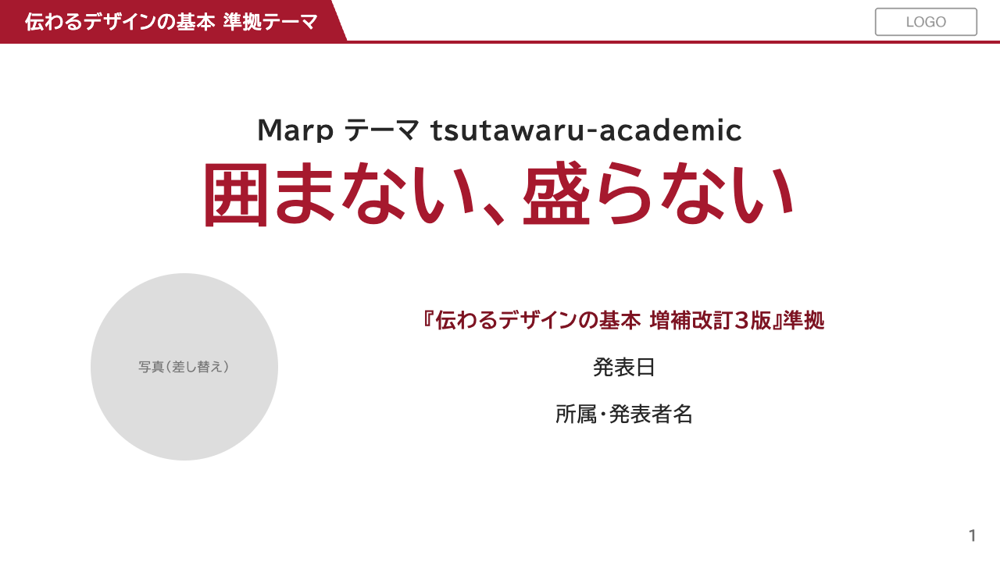
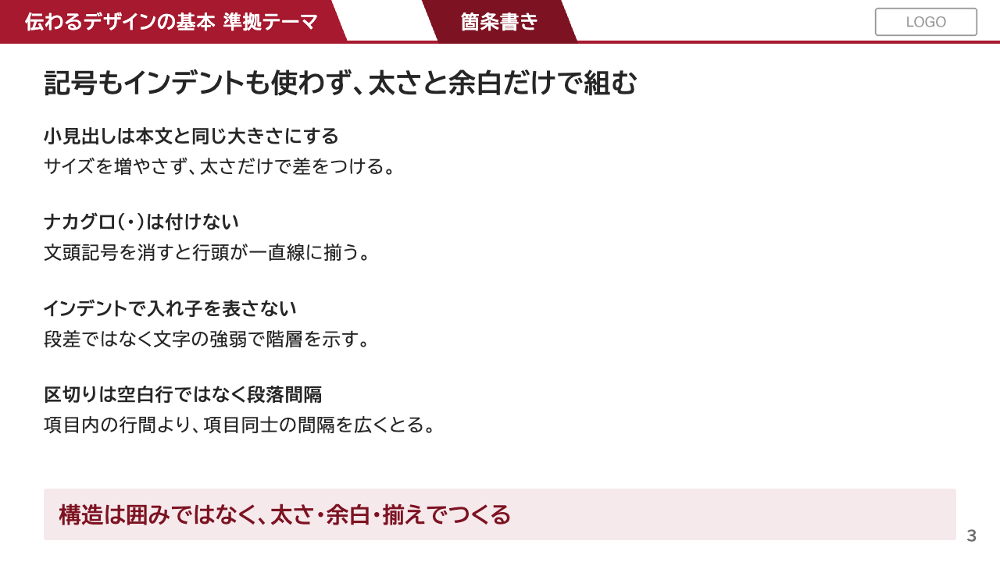
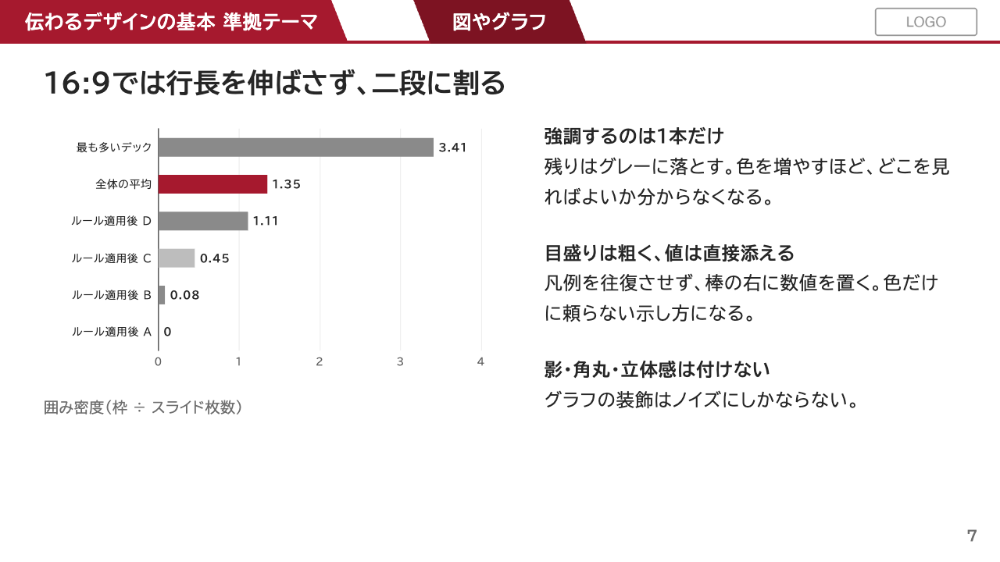

# tsutawaru-marp

『伝わるデザインの基本 増補改訂3版』（高橋佑磨・片山なつ／技術評論社）のルールを
CSS に実装した **Marp スライドテーマ＋ツール一式**。
Markdown を書くだけで、「囲まない・盛らない・揃える」資料のルールが自動で守られる。

| 表紙 | 本文（囲みなしの箇条書き） | グラフ（強調1系列） |
|---|---|---|
|  |  |  |

## 特徴

- **テーマがルールを守る**：3色運用・文字サイズ3種・行間1.7・行長28字・表の罫線3本・
  影とグラデーション全廃、をCSSが強制。書き手はMarkdownを書くだけ
- **タイトルと要点帯（takeaway）が全スライドで同じ位置に固定**される
- **グラフは静的SVG**：ECharts（Node）または matplotlib（Python・日本語対応）で焼いて
  インライン埋め込み。PDF/PNG書き出しでも崩れない。手描きのインラインSVG図解も使える
- **ベクターPDF出力**：枚数が多くても落ちない分割印刷スクリプト同梱
- **発表モード**：Chromeで全画面プレゼン（発表者ビュー・タイマー付き）
- **lint**：囲み過多・文字数過多・18px未満・体言止め・煽り語を機械点検
- **Claude Code 対応**：CLAUDE.md 同梱。AIにスライドを書かせてもルールから外れにくい

## 同梱物

```
tsutawaru-marp/
├── README.md                  このマニュアル
├── CLAUDE.md                  Claude Code（AIアシスタント）用の作業ルール
├── package.json               npm scripts（pdf / present / lint / demo）
├── theme/
│   ├── academic.css           土台テーマ（ヘッダー帯・表紙・スライド型）
│   └── tsutawaru-academic.css 本文を本のルールで再定義（メインのテーマ）
├── docs/
│   └── tsutawaru-guide.md     詳細ガイド（設計思想・部品カタログ・根拠ページ一覧）
├── slides/
│   ├── assets/                共有素材（ロゴのプレースホルダ入り）
│   └── demo-tsutawaru/        模範デック11枚（本のAfter作例を再現。新規デックの下敷き）
└── tools/
    ├── echarts-render/        EChartsのoption → 静的SVG（SSR・ブラウザ不要）
    ├── matplotlib-chart/      Python派向けの代替（japanize-matplotlib）
    ├── marp-pdf/              落ちないベクターPDF出力（分割印刷 → 結合）
    ├── marp-present/          Chromeで全画面プレゼン
    └── tsutawaru-lint.mjs     デザイン・文体の機械点検
```

## 必要環境

| 何 | 用途 | 導入 |
|---|---|---|
| Node.js 18+ | Marp CLI・EChartsレンダラ | https://nodejs.org （または `brew install node`） |
| Google Chrome | PDF出力・プレゼン表示 | インストール済みならそのまま使われる |
| poppler（`pdfunite`） | PDFの結合 | `brew install poppler` |
| VS Code + Marp for VS Code 拡張 | エディタ内プレビュー | 任意（推奨） |
| Python 3 + matplotlib + matplotlib-fontja | EChartsを使わない場合のグラフ | 任意：`pip install matplotlib matplotlib-fontja` |

Marp CLI 本体はコマンド実行時に `npx` が自動で取得するので、個別インストール不要。
シェルスクリプト（`tools/marp-pdf` / `tools/marp-present`）は macOS を前提にしている。
Linux では `CHROME_PATH=/usr/bin/google-chrome` のように環境変数を指定し、デックの
`.md` を引数で明示すれば動く（引数なしの「最終編集デック自動選択」はmacOS専用）。
Windows は後述の「[Windows で使う](#windows-で使う)」を参照（コア機能はそのまま動く）。

## インストール

```bash
git clone <このリポジトリ>
cd tsutawaru-marp
npm install        # echarts（グラフ用）を導入。グラフを使わないなら省略可
```

## クイックスタート：模範デックを動かす

```bash
# 1) プレビュー（ブラウザが開く）
npx @marp-team/marp-cli@latest slides/demo-tsutawaru/demo-tsutawaru.md --no-stdin \
  --theme-set theme/academic.css theme/tsutawaru-academic.css --html --preview

# 2) ベクターPDFに書き出す（→ slides/demo-tsutawaru/out/）
npm run demo:pdf

# 3) 全画面プレゼン（F=全画面 / P=発表者ビュー / ←→=ページ送り / O=一覧）
npm run present slides/demo-tsutawaru/demo-tsutawaru.md
```

> **`--html` と `--no-stdin` は全コマンドで必須。** `--html` が無いとインラインSVGが
> ソースコードの文字列として描画され、`--no-stdin` が無いと非対話実行で marp が固まる。
> （npm scripts と同梱スクリプトは付与済み）

## 新しいデックを作る

1デック = 1ディレクトリ。模範デックをコピーして書き換えるのが早い：

```bash
cp -r slides/demo-tsutawaru slides/20260901_seminar_ai-intro
cd slides/20260901_seminar_ai-intro && mv demo-tsutawaru.md 20260901_seminar_ai-intro.md
```

```
slides/20260901_seminar_ai-intro/
  20260901_seminar_ai-intro.md   ← ディレクトリと同名のmd
  src/                           ← 素材（画像・グラフのoption）。半角英数とハイフンのみ
  out/                           ← 出力先（gitignore済み）
```

frontmatter はこれだけ：

```yaml
---
marp: true
theme: tsutawaru-academic
paginate: true
size: 16:9
header: '<div class="hdr-left">デックタイトル</div>'
footer: ''
---
```

ロゴは `slides/assets/` に自組織のPNG（横長・高さ38px程度で表示）を置いて差し替える。

**書き方・部品の一覧は [docs/tsutawaru-guide.md](docs/tsutawaru-guide.md)**（部品カタログ・
根拠ページ付き）と、模範デック [slides/demo-tsutawaru/](slides/demo-tsutawaru/) を見る。

## コマンド一覧

```bash
DECK=slides/<deck-name>

# プレビュー（ファイル監視つき）
npx @marp-team/marp-cli@latest "$DECK/<deck-name>.md" --no-stdin \
  --theme-set theme/academic.css theme/tsutawaru-academic.css --html --preview

# PNG（1枚ずつの画像。目視確認・SNS用）
npx @marp-team/marp-cli@latest "$DECK/<deck-name>.md" --no-stdin \
  --theme-set theme/academic.css theme/tsutawaru-academic.css \
  --html --images png --allow-local-files -o "$DECK/out/<deck-name>.png"

# ベクターPDF（推奨。枚数が多くても落ちない）
npm run pdf "$DECK/<deck-name>.md"        # 引数省略で最終編集デックを自動選択
npm run pdf:safe "$DECK/<deck-name>.md"   # それでも落ちるとき（チャンク12枚）

# 全画面プレゼン
npm run present "$DECK/<deck-name>.md"

# lint（デザイン・文体の機械点検）
npm run lint                              # slides/ 全体
node tools/tsutawaru-lint.mjs "$DECK"     # 1デックだけ
```

### PDFについて

Marp 標準の `--pdf` は、枚数が多い／インラインSVGが重いデックで
`Printing failed` と落ちることがある。同梱の `tools/marp-pdf/build-pdf.sh` は
全スライドを1つのHTMLに描画 → ページ範囲ごとに分割印刷 → `pdfunite` で結合する方式で、
**ベクター品質のまま**確実に出力する（ページ番号も連番のまま）。

PNG画像を並べてPDF化する方法（ラスタ化）は文字がにじむので使わない。

## グラフを入れる

### 方法1：ECharts（標準・Node）

```bash
# option（データと見た目）を .mjs に書く → 静的SVGに焼く
node tools/echarts-render/render.mjs \
  slides/<deck>/src/fig01-sales.chart.mjs slides/<deck>/src/fig01-sales.svg 760x400
```

焼いたSVGの中身をスライドの Markdown に**インラインで直接貼る**。
『伝わるデザイン』準拠のテーマ（強調1系列＋グレー・目盛は粗く・影なし）が自動で当たる。
書き方の実例は `slides/demo-tsutawaru/src/*.chart.mjs`、詳細は
[tools/echarts-render/README.md](tools/echarts-render/README.md)。

### 方法2：matplotlib（Python・日本語対応）

```bash
pip install matplotlib matplotlib-fontja
python3 tools/matplotlib-chart/example.py slides/<deck>/src/fig01-example.svg
```

`example.py` が完全な見本。詳細は [tools/matplotlib-chart/README.md](tools/matplotlib-chart/README.md)。

### 方法3：手描きインラインSVG（構造図・概念図）

フロー図・概念図はSVGを直接 Markdown に書いてよい。共通の注意：

- **`` / `` は使わない**（PDF/PNG書き出しで空白になる）
- **SVG内に空行を入れない**（Markdownがブロックを打ち切りスライドが壊れる）

## カスタマイズ

CSS本体は編集せず、デックの frontmatter `style:` でCSS変数を上書きする：

```yaml
style: |
  :root {
    --accent: #007069;          /* メインの色（例：赤 → ティール） */
    --accent-dark: #00544F;
    --accent-soft: #E0F2F1;     /* takeaway帯・薄い背景 */
    --em: #B45309;              /* 4色目（強調色）を分けたい場合のみ */
  }
```

- **フォント**：既定は BIZ UDPGothic（Google Fonts から取得。オフライン時はOS標準の
  ゴシックにフォールバック）。差し替えは `--font-jp` を上書き
- **ヘッダー帯の幅**：既定は文字量に自動追従。固定したいときだけ
  `--hdr-left-w` / `--pt-center` / `--pt-width` を上書き（docs/tsutawaru-guide.md 第2節）
- **色を変えるときも「3色＋強調1色」の枠は守る**（本のルール。テーマの前提）

## VS Code で使う

このリポジトリを開くと `.vscode/settings.json` がテーマを Marp 拡張に登録済み：

- **プレビュー**：Marp for VS Code 拡張でmdを開くだけ
- **⌘⇧B**：開いているデックをベクターPDF化（`.vscode/tasks.json`）
- **NPMスクリプト ▶**：エクスプローラーの「NPM スクリプト」から `pdf` / `present` / `lint`

## Claude Code（AI）で使う

同梱の [CLAUDE.md](CLAUDE.md) に作業ルール（レンダリングして目視確認・出典の裏取り・
デック構造・グラフの焼き方・禁止事項）を書いてある。リポジトリを開いて
「◯◯のスライドを作って」と頼めば、テーマとルールに沿ったデックが出てくる。

## Windows で使う

テーマCSS・Marp CLI・Node製ツール（lint / EChartsレンダラ）はクロスプラットフォームで、
**macOS/Linux 前提なのはシェルスクリプト2本だけ**。Windows 用の fork は不要です。

| 機能 | Windows での使い方 |
|---|---|
| プレビュー / PNG / HTML | そのまま動く（`npx @marp-team/marp-cli@latest …`） |
| PDF（通常） | marp 標準の `--pdf` を使う（Chrome/Edge を自動検出）：`npx @marp-team/marp-cli@latest <deck>.md --no-stdin --theme-set theme/academic.css theme/tsutawaru-academic.css --html --pdf --allow-local-files -o out/<deck>.pdf` |
| PDF（分割ベクター方式） | 枚数が多く通常PDFが `Printing failed` で落ちるデックだけ必要。**WSL 上で** `tools/marp-pdf/build-pdf.sh` を実行する（`CHROME_PATH` にWSL内のChromeを指定） |
| プレゼン | HTMLに書き出してブラウザで開けば同じ操作（F=全画面 / P=発表者ビュー / ←→=送り）：`npx @marp-team/marp-cli@latest <deck>.md --no-stdin --theme-set theme/academic.css theme/tsutawaru-academic.css --html -o <deck>.html` |
| lint / ECharts / matplotlib | そのまま動く（Node / Python） |
| VS Code Marp 拡張のプレビュー | そのまま動く（`.vscode/settings.json` がテーマ登録済み） |

- `npm run pdf` / `npm run present` は内部で `bash` を呼ぶため、Windows では WSL か上表の直接コマンドを使う
  （`.vscode/tasks.json` の ⌘⇧B タスクも同様）
- フォント：既定の BIZ UDPGothic は **Windows 10（1809）以降に標準搭載**。むしろ好条件
- 改行コード：`.gitattributes` で `*.sh` をLF固定済み。`core.autocrlf=true` の環境で clone しても
  スクリプトが壊れない

## クレジット

- デザインルールの出典：『伝わるデザインの基本 増補改訂3版 よい資料を作るためのレイアウトのルール』
  高橋佑磨・片山なつ 著（技術評論社、2021）。本テーマは同書のルールを参考にした
  **非公式の実装**であり、著者・出版社とは関係ありません。書籍と併読することを強く勧めます
  （CSSコメントの `p.NNN` が該当ページ）
- グラフ描画：[Apache ECharts](https://echarts.apache.org/)
- スライド変換：[Marp](https://marp.app/)

## ライセンス

[MIT License](LICENSE)。著作権表示とライセンス文の保持だけが条件で、商用利用・改変・再配布は自由です。

### お願い（任意）

以下は**ライセンス上の義務ではなく、お願い**です。

- **謝辞・言及**：このテーマで作った資料を紹介する記事や、論文・紀要・教材などでは、
  謝辞やクレジットで触れてもらえると嬉しいです
  （例：「スライドの作成には tsutawaru-marp（Shoh Tagawa 作）を使用した」）。
  GitHub 上では「Cite this repository」ボタン（`CITATION.cff`）から引用情報を取得できます
- **寄付**：継続的な開発の励みになります。リポジトリの Sponsor ボタンからどうぞ
  （公開者向けメモ：`.github/FUNDING.yml` に自分のアカウントを記入するとボタンが出ます）
