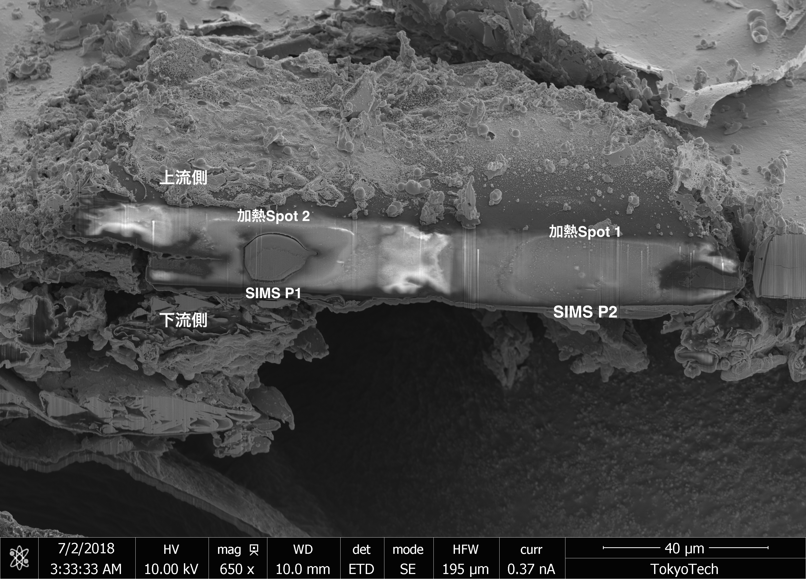

<!-- _class: cover-hero -->

2018/07/02 ~ 04　IIL

H2O in DAC

<b>SHM12p1#1</b>　SIMS による融解実験試料の水素定量結果まとめ

<!--
- DAC（ダイヤモンドアンビルセル）融解実験試料中の H2O を SIMS で定量した結果のまとめ。2018/07/02〜04、IIL。
-->

---

SEM-EDS像

# SHM12p1#1　SEM-EDS　加熱Spot2のEDS像

注) <b>Fe中にSiとOが濃縮した箇所有</b>

<!--
- SHM12p1#1 の加熱Spot2のSEM-EDS像。Fe中にSiとOが濃縮した箇所がある点に注意。
-->

---

深さ方向プロファイル

# SHM12p1#1 (Spot2 上流(左) 3500 K / 下流(右) 4050 K)

SIMS 深さ方向プロファイル（<b>28Si-</b> / <b>1H-</b> / <b>40Ca-</b> / <b>1H/28Si</b>） 縦軸 <b>H2O(wt%)</b> 0 – 0.5　／　横軸 <b>H/Si</b>　スケール <b>10um</b>

<b>Ca-Pv</b>

<b>Metal</b>

<b>Silicate Melt</b>

*Edge effect

?

※ 元スライドのライン分析チャート画像（28Si- / 1H- / 40Ca- / 1H/28Si の深さプロファイル）は PPTX変換時に失われ復元不可

<!--
- Spot2の深さ方向プロファイル（上流3500 K / 下流4050 K）。Ca-Pv・Metal・Silicate Melt の各相、Edge effectに注意。
- 元のライン分析チャート画像は変換で失われたため、ラベルのみ保持。
-->

---

SIMS分析点

# 加熱Spotと SIMS 分析点

<!--
- 加熱Spot1/Spot2 と SIMS分析点 P1/P2 の位置を注釈したSEM像（上流側/下流側）。
-->

---

検量線

# 検量線(Internalの Internal で仮検量/Confidential)

加熱Spot2 ▶　上流3500 K　下流4000K

加熱Spot1 ▶　&gt;4500 K　測温できず

<b style="font-size:30px;">Spotによって差がある</b> 
- 加熱順序?(同一runで二度加熱した) 
- 温度?(1000K異なる)

<!--
- Internal の Internal で仮検量（Confidential）。Spotによって差がある：加熱順序（同一runで二度加熱）や温度（1000K異なる）が要因か。
-->

---

分配係数

# 分配係数

※本来はmol濃度だが、先行研究に習い、便宜的に質量パーセントで計算　(Imai D論)

<u>SHM12</u> ※仮データ / Si 量をスタンダートと同じと仮定

<table style="width:100%; border-collapse:collapse; font-size:24px;">
<thead>
<tr style="border-bottom:2.5px solid var(--accent);">
<th style="text-align:left; padding:8px 12px;"></th>
<th style="padding:8px 12px;">Fe melt</th>
<th style="padding:8px 12px;">Silicate melt</th>
<th style="padding:8px 12px; border-left:2px solid #888;">分配係数</th>
</tr>
</thead>
<tbody>
<tr style="border-bottom:1px solid #ddd;">
<td style="padding:12px; text-align:left;"><b>加熱Spot1 ▶</b> &gt;4500 K 測温できず</td>
<td style="text-align:center;">X~ 1 1.8 wt.% H</td>
<td style="text-align:center;">1.3 wt. % H2O 0.14 wt.% H</td>
<td style="text-align:center; border-left:2px solid #888; font-size:30px;">13</td>
</tr>
<tr>
<td style="padding:12px; text-align:left;"><b>加熱Spot2 ▶</b> 上流3500 K 下4000K</td>
<td style="text-align:center;">X~ 1 1.8 wt.% H</td>
<td style="text-align:center;">0.35 wt. % H2O 0.04 wt.% H</td>
<td style="text-align:center; border-left:2px solid #888; font-size:30px;">45</td>
</tr>
</tbody>
</table>

<!--
- 分配係数。Fe melt と Silicate melt の水素量から算出。Spot1で13、Spot2で45。仮データ・mol濃度の代わりに質量%で計算（Imai D論）。
-->

---

まとめ・課題

# まとめ・現状の課題

<b style="font-size:26px;">まとめ</b>
<ul style="margin:6px 0 0 1.1em; padding:0; font-size:21px; line-height:1.5;">
<li>メルト中の水素量は、定量可能である</li>
<li>Csイオンではなく、Oイオンを用いるコンベンショナル法で行う</li>
<li>分析までの手順を確立し、分析条件も確定できた</li>
<li>分配係数は、10 ~ 50程度になる可能性が高い</li>
<li>1サンプルでの二箇所加熱はできない</li>
</ul>

<b style="font-size:26px; color:#C0182B;">現状の課題</b>
<ul style="margin:6px 0 0 1.1em; padding:0; font-size:19px; line-height:1.45;">
<li>作ったスタンダードが、2 wt.%検量線にのるか? </li>
<li>鉄が均一にクエンチされず、スラグ(SiやOが多い部分)や正体不明な輪郭(厚み3 µmほど)が成長している場合がある

▶水が多すぎるのか?1 wt.%H2Oのガラスも作るべきか

▶加熱時間を出来る限り短くする
</li>
<li>Si量の完全な定量が必要。EPMAでの定量を行うべきでは?

▶EPMA用のホルダに、SIMSホルダを載せる改造をする
</li>
<li>温度が上下で不均一/熱圧力の補正が必要

▶Fe箔ではなく、Au箔にして融解実験を行い、補正する
</li>
</ul>

<!--
- まとめ：水素量は定量可能、Oイオンのコンベンショナル法、手順・条件確定、分配係数10〜50、1サンプル二箇所加熱は不可。
- 課題：標準試料の検量線、クエンチ不均一・スラグ・輪郭成長、Si量定量（EPMA）、温度不均一・熱圧力補正（Au箔）。
-->
