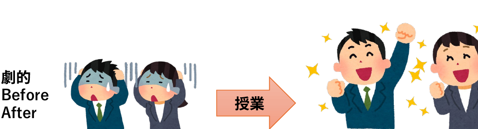
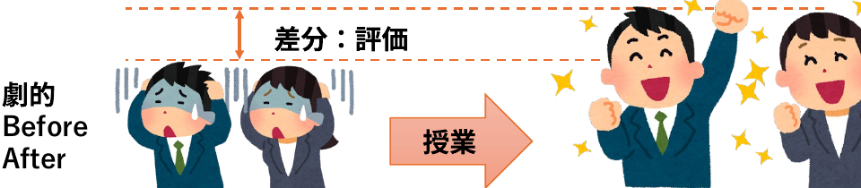
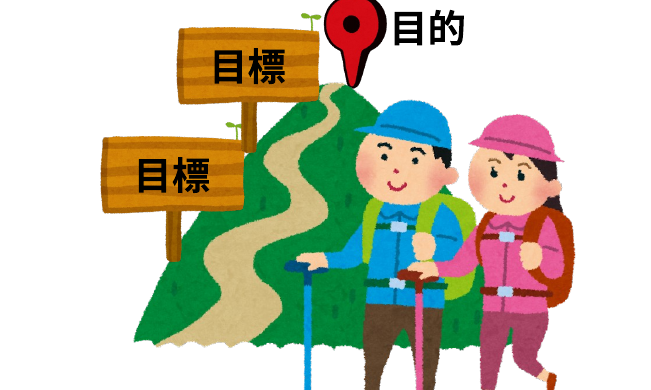

<!-- _class: cover-hero -->

大学などで教える

目的と目標を書く

<b>達成目標：</b> 目的と目標を適切に提案することが出来る

<!--
- タイトルコール。「目的と目標を書く」。達成目標は、目的と目標を適切に提案できるようになること。
-->

---

目的と目標を書く

# 目的と目標を書く

読んだ事ないし、 適当でよいのでは？

<b>達成目標：</b> 目的と目標を適切に提案することが出来る

ルールなんて あるの？

<!--
- 「読んだ事ないし適当でよいのでは？」「ルールなんてあるの？」という素朴な疑問から入る。
-->

---

目的と目標を書く

# 書き方の共通事項

学習者の「<b style="color:var(--accent-dark);">主体的学び✨</b>」を支援する

①主語は<b>学習者</b>とすること

②動詞に<b>注意</b>すること

<!--
- 共通事項は2つ。①主語は学習者、②動詞に注意する。狙いは学習者の「主体的学び」の支援。
-->

---

目的と目標を書く

# 目的を書くヒント

<b>①「ために」</b>を上手く使う

<b>② 多様な価値</b>が含まれていることを示す

<table class="vtbl">
<tr><th style="width:8.5em;">価値の種類</th><th>意味</th><th>目的達成後の例</th></tr>
<tr><td>達成価値</td><td>習得と達成から満足が得られたか</td><td>一人で出来るようになった・一冊読んだ</td></tr>
<tr><td>内発的価値</td><td>授業のタスクそのものに価値を感じられるか</td><td>議論がためになる・プログラミングが楽しい</td></tr>
<tr><td>道具的価値</td><td>高次の目標達成に役立つか</td><td>資格取得に必要・卒論や就職後役立つ</td></tr>
</table>

<b>③ DPとの関連性</b>を考える

研究現場や社会に出てから熱力学を使いこなすために、岩石・鉱物・人工物へ熱力学の基礎法則を適用する方法を理解し、一人で問題解決できる力を身につける。

<!--
- 目的を書くヒント。①「ために」を使う、②達成価値・内発的価値・道具的価値という多様な価値を示す、③DPとの関連性を考える。下は熱力学の記述例。
-->

---

目的と目標を書く

# 目標を書くヒント

①<b>観察可能</b>(=<b>評価可能</b>)<b>な行動</b>で記載する

②<b>一つの文章に一つの目標</b>

シラバス全体で、 多くても10個

③<b>現実的かつジャンプすれば届く距離</b>

<!--
- 目標を書くヒント。①観察可能（評価可能）な行動で書く、②一文一目標（全体で多くても10個）、③現実的かつジャンプすれば届く距離。
-->

---

目的と目標

# 目標とは

<b>目標</b>：終了後に学習者にできるようになって欲しい<b>能力</b> (Goal, Learning outcomes)

授業の結果、学習者が何を学び、何ができるようになっているのか。

<!--
- 目標とは、終了後に学習者にできるようになって欲しい能力（Learning outcomes）。授業を経て劇的にBefore→Afterが変わる。
-->

---

目的と目標を書く

# 目標とは　差分：評価

例： <b>地球内部の熱力学▶</b>地球内部の相転移が起こる条件を記述出来る。 例： <b>医療倫理</b>▶諸問題を討議し、一般的な葛藤の構造を解釈する。

知っておくべきこと

① 目的を<b>具体化</b>したもの

② <b>学生の自学自習</b>に役立つ

③ <b>評価項目</b>と一致させる

<!--
- 目標は評価との差分でもある。知っておくべきこと：①目的を具体化、②自学自習に役立つ、③評価項目と一致。例は地球内部の熱力学・医療倫理。
-->

---

目的と目標

# 目的と目標

<table class="vtbl" style="font-size:25px; max-width:760px;">
<tr><td style="width:11em;">この<b>授業</b>の目標</td><td>シラバスに使用</td></tr>
<tr><td>この<b>講義</b>の目標</td><td>各回の冒頭に説明</td></tr>
<tr><td>この<b>動画</b>の目標</td><td>各動画の冒頭に説明</td></tr>
<tr><td>この<b>課題</b>の目標</td><td>課題のデザインに使用</td></tr>
</table>

各段階で 様々な目標がある

目標を定めて、 デザインする

<!--
- 目標は段階ごとにある。授業＝シラバス、講義＝各回冒頭、動画＝各動画冒頭、課題＝デザインに使用。各段階で様々な目標を定めてデザインする。
-->

---

目的と目標

# 授業の目的・目標と上位概念

DP

CP

授業の<b>目的</b>

授業の<b>目標</b>

講義の<b>目標</b>

課題・動画の<b>目標</b>

DP: Diploma policy CP: Curriculum policy

<b style="color:var(--accent-dark);">上位のものと整合的</b>である、または<b style="color:var(--accent-dark);">関係性を説明</b>できる

<!--
- 授業の目的・目標は上位概念（DP/CP）の下にある。下位の目標は、上位のものと整合的、または関係性を説明できることが大切。
-->

---

まとめ

# まとめ

<b>授業の目的とは？</b> 存在意義

<b>目標とは？</b> 終了後に学習者にできるようになって欲しい<b>能力</b>

参考文献：栗田佳代子 (2017) 『<i>インタラクティブ・ティーチング</i>』 河合出版 栗田佳代子(2021) <i>Interactive Teaching</i>, Coursera by 東京大学

<!--
- まとめ。授業の目的とは存在意義。目標とは終了後に学習者にできるようになって欲しい能力。山頂＝目的、道標＝目標のイメージ。参考文献：栗田佳代子。
-->
