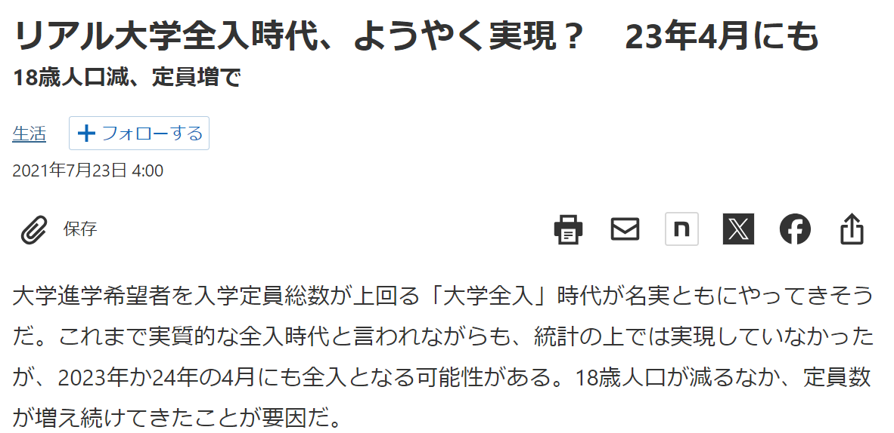
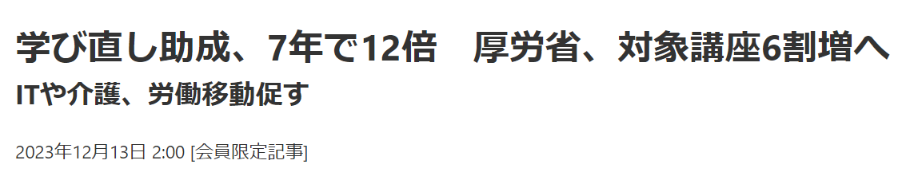
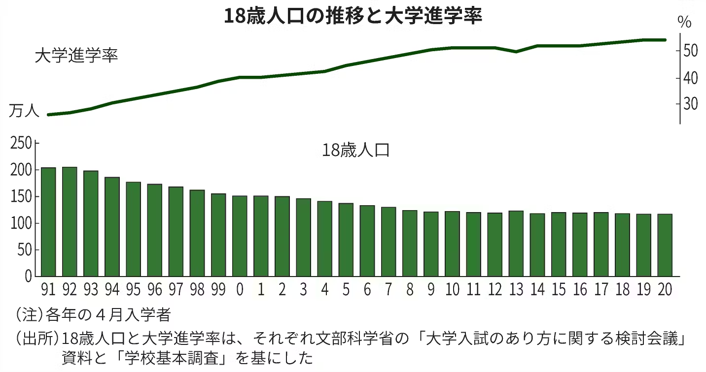

<!-- _class: cover-hero -->

大学などで教える

<b>高等教育</b>の<b>置かれている状況</b>

<b>達成目標：</b>日本の高等教育の課題を理解出来る。

<!--
- まずは、タイトルコール。
-->

---

大学性悪説

# 大学性悪説

- そもそも大学や大学教員はその活動を疑われている
- 批判は<b>60年代・70年代</b>から
  
中教審「大学教育の改善についての答申」（1963年）、 「当面する大学教育の課題に対応するための方策について」（1970年）、

  
ライシャワー（1979）、ヴォ―ゲル（1979）、グレーザー（1977）など

  
「欠如理論」＋「経済ナショナリズムへの奉仕」（苅谷2018）

- <b>現状についての根拠の曖昧さ</b>
  
教育または教育制度についての　科学的根拠の不足・不在、外的妥当性の問題

→<b>ブラックボックス</b>としての教育

<!--
- 大学や大学教員はその活動を疑われてきた。批判は60〜70年代から。根拠の曖昧さゆえ、教育はブラックボックスとして扱われがち。
-->

---

大学性悪説

# 大学性悪説

「個々の授業が実際にどのような内容を伝えるかは、ほぼ個々の教員に任されていて、教員間に明確な共通理解があるわけではない。あるいはそれらを集積した学習経験がどのような教育成果を形成するかについても、それについての一定の暗黙の期待があるものの、それがどのような過程を通じて形成されるかが明示されることはほとんどなく、また実際に検証されることもない」（金子2014）

- 所詮シグナリングに過ぎないという学内外の根強い意見も。
  
優秀な人間を選抜しているだけ?（大学教育に効果があるわけではない）

- 研究機関としての価値はあるが、教育はセレンディピティだけ？

→組織的詐欺？

大学への良い変化を作れるか

<!--
- 大学はシグナリングに過ぎない、教育効果は無いという根強い意見も。組織的詐欺とまで言われかねない中で、大学に良い変化を作れるか。
-->

---

大学全入時代／社会人の学び直し

# 大学全入時代／　社会人の学び直し

2021年7月23日

日本経済新聞 2023年12月13日

「エリートのモラトリアム」から <b>「全員の学びの場」</b>への転換

<!--
- 18歳人口は減り定員は増え、リアル大学全入時代がやってくる。学び直し助成は7年で12倍。「エリートのモラトリアム」から「全員の学びの場」への転換が進む。
-->

---

海外の状況

# 海外の状況

お金の意味・研究引用指数で<b>先行</b>

背景には、<b>語学以上の問題</b>

<!--
- 海外は、お金の意味や研究引用指数で先行している。背景には、語学以上の問題がある。
-->

---

価値のある大学教育の実現

# 価値のある大学教育の実現

施策

各種施策の実施

教員が変わることによる、教育の変化

千葉大の取組例

作っていくのは、<b>未来の教員となる受講者のみんな</b>

<!--
- 各種施策の実施、教員が変わることによる教育の変化、千葉大の取組例。作っていくのは、未来の教員となる受講者のみんな。
-->

---

<!-- _class: sec-open -->

まとめ

# まとめ

1. <b>大学性悪説</b> ── 教育はブラックボックスと疑われてきた

2. <b>大学全入時代</b>・<b>社会人の学び直し</b> ── 「全員の学びの場」へ

3. <b>価値のある大学教育</b>を作るのは、未来の教員となるみんな

日本の高等教育の課題を理解し、良い変化を作っていく

<!--
- まとめ。性悪説、全入時代・学び直し、そして価値ある大学教育の実現。作っていくのは未来の教員となる受講者のみんな。
-->
