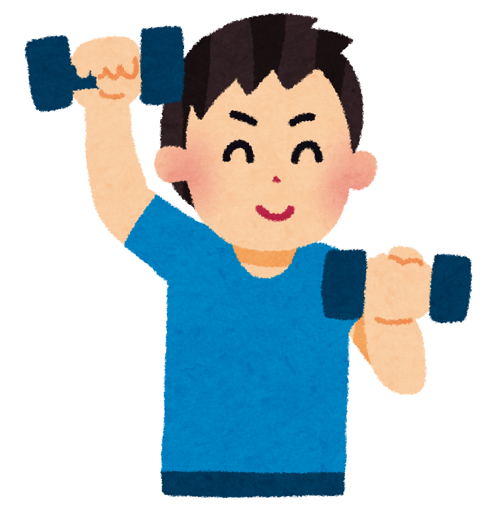

<!-- _class: cover-hero -->

大学などで教える

逆向き設計

<b>達成目標：</b>逆向き設計を理解し、使用出来る。

<!--
- まずは、タイトルコール。「逆向き設計」を理解して使えるようになる、が今回の達成目標。
-->

---

逆向き設計とは

# 授業担当者となったら

まずは…

分析

⇒

設計

概観しましょう

<!--
- 授業担当者になったら、みんな「どう作ろう」と困る。まずは全体像を「分析 → 設計」の2段で概観しましょう。
-->

---

逆向き設計とは

# 分析すべき内容　参照

分析全体像決定の為の情報収集

<b>チェックリスト化</b>し、 <b>確認</b>しましょう

要件

①<b>上位ポリシー</b> (DP / CP)

②<b>課目の位置づけ</b>　普遍 / 専門, 必修/選択

③<b>開講期間・時間要件</b>　集中 / ターム, 1単位=時間？

学生

④学生の<b>人数・態度・ニーズ・モチベーション</b>

⑤学生の<b>スキル・既習概念</b>

環境

⑥オンライン・対面・オンデマンド

⑦<b>機材</b>(プロジェクタ)<b>・什器</b> (机は可動式？)

⑧<b>前担当者</b>や<b>プログラム担当者</b>の期待・意見

<!--
- 設計の前に「分析」。全体像を決めるための情報収集を、要件・学生・環境の3観点でチェックリスト化して確認する。
-->

---

逆向き設計とは

# 逆向き設計(backward design)設計

① 求められている結果を明確にする <b>（目的・目標）</b>

② 承認できる証拠を決定する <b>（評価方法）</b>

③ 学習経験と指導を計画する <b>（内容）</b>

(この順番 or 三位一体)

Wiggins &amp; McTighe (1998), <i>Understanding by Design</i>；西岡 (2005)

<!--
- 設計の本体が逆向き設計。①結果（目的・目標）→②証拠（評価方法）→③計画（内容）の順、または三位一体で考える。
-->

---

逆向き設計とは

# 逆向き設計(backward design)設計

① 求められている結果を明確にする <b>（目的・目標）</b>

② 承認できる証拠を決定する <b>（評価方法）</b>

③ 学習経験と指導を計画する <b>（内容）</b>

なんで「逆向き」?

指導後に考えられがちな評価方法を指導の前にる点，単元末・学年末・卒業時といった最終的な結果から遡って教育を設計する点から。

Wiggins &amp; McTighe (1998), <i>Understanding by Design</i>；西岡 (2005)

<!--
- 「逆向き」と呼ぶ理由：評価方法を指導の“前”に決める／最終的な結果から遡って設計するから。
-->

---

逆向き設計とは

# 逆向き設計(backward design)の例設計

(架空)　筋トレ学第一

①

<b>目的</b>：健やかな人生を歩むために、理論的医学的背景、方法論を理解し、実践を楽しみながら一人で正しく筋トレできる能力を身につける。 <b>目標</b>：猫背や腰痛の防止に不可欠な広背筋を適切に鍛えられる。

②

<b>評価</b>：A. 意識する部位を実技で述べ採点。　B. 実演動画を視聴し、コメント。　C. 期末に広背筋の体力テスト。　D. 本質的な問についてのレポート。

③

<b>設計</b>：A. ペアで実技し評価表で採点。　B. 自宅トレーニング用動画教材の準備。　C. 筋トレ計画の作成とモニタ。　D. 健康・体力への影響等の探究。

<!--
- 架空例「筋トレ学第一」で①目的・目標→②評価→③設計を一気通貫で示す。
- 西岡先生の例：①アメリカの歴史→「独立するとは何か」、②基礎物理→「重力とは何か」。 https://www.jstage.jst.go.jp/article/jscs/14/0/14_KJ00007910995/_article/-char/ja
-->

---

逆向き設計とは

# まとめ

1. 授業担当者となったら…

2. 分析 は、チェックリストで情報収集

3. 設計 は、逆向き設計を用いる

目的・目標、評価方法、内容をこの順番 or 同時に作っていく

<!--
- まとめ。①担当になったら、②まず分析（チェックリストで情報収集）、③設計は逆向き設計で。目的・目標／評価方法／内容を順番に、または同時に作る。
-->
