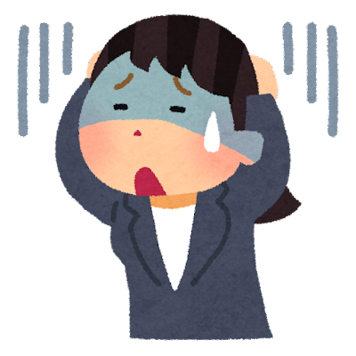

<!-- _class: cover-hero -->

大学などで教える

目的と目標とは？

<b>達成目標：</b>目的と目標とはなにかを説明出来る

<!--
- まずは、タイトルコール。
-->

---

目的と目標とは

# 目的と目標とは

そもそも、これいる？

<b>達成目標：</b>目的と目標とはなにかを説明出来る

目標と目的？ 同じじゃん？

<!--
- 「目標」と「目的」は同じでは？ いる？という素朴な疑問から入る。
-->

---

目的と目標とは

# 授業の目的 = 授業の存在意義

学習者の <b style="font-size:34px; color:var(--tag-blue);">「Why? なぜこれを学ぶ必要があるのか？」</b> に対する答え

<b>例：筋トレ学</b> 一生健やかな人生を歩むために、 筋トレの背景にある理論、医学的エビデンス、方法を理解し、 実践を楽しみながら、一人で正しく筋トレする能力を身につける。

<b>例： 医療倫理</b> 患者さんに寄り添える医療従事者となるために、 多様なケーススタディと議論を通して倫理観を涵養する。

<!--
- 授業の目的＝授業の存在意義。「なぜこれを学ぶのか」への答え。筋トレ学・医療倫理を例に。
-->

---

目的と目標とは

# 目標：終了後に学習者にできるようになって欲しい能力

(Goal, Learning outcomes)

授業の結果、学習者が何を学び、何ができるようになっているのか。

劇的 Before

できるように なる

授業

➡

劇的 After

<!--
- 目標＝修了後に学習者にできるようになって欲しい能力（Learning outcomes）。授業を通じてBefore→Afterへ。
-->

---

目的と目標とは

# 目標：終了後に学習者にできるようになって欲しい能力

例： <b>筋トレ学▶</b>各動作にて意識すべき部位と怪我の注意点を指摘出来る。 例： <b>医療倫理</b>▶諸問題を討議し、一般的な葛藤の構造を解釈する。

知っておくべきこと

① 目的を<b>具体化</b>したもの

② <b>学生の自学自習</b>に役立つ

③ <b>評価項目</b>と一致させる

Before

差分：評価

授業

➡

劇的 After

<!--
- 目標は ①目的を具体化 ②自学自習に役立つ ③評価項目と一致 の3要件。Before→Afterの差分＝評価。
-->

---

目的と目標とは

# 目標：終了後に学習者にできるようになって欲しい能力

<table style="border-collapse:collapse; font-size:30px; margin:14px 0; width:78%;">
<tr><td style="border:2px solid var(--accent); background:var(--accent-soft); padding:10px 24px; font-weight:800;">この<b style="color:var(--accent-dark);">授業</b>の目標</td><td style="border:2px solid #ccc; padding:10px 24px;">シラバスに使用</td></tr>
<tr><td style="border:2px solid var(--accent); background:var(--accent-soft); padding:10px 24px; font-weight:800;">この<b style="color:var(--accent-dark);">講義</b>の目標</td><td style="border:2px solid #ccc; padding:10px 24px;">各回の冒頭に説明</td></tr>
<tr><td style="border:2px solid var(--accent); background:var(--accent-soft); padding:10px 24px; font-weight:800;">この<b style="color:var(--accent-dark);">動画</b>の目標</td><td style="border:2px solid #ccc; padding:10px 24px;">各動画の冒頭に説明</td></tr>
<tr><td style="border:2px solid var(--accent); background:var(--accent-soft); padding:10px 24px; font-weight:800;">この<b style="color:var(--accent-dark);">課題</b>の目標</td><td style="border:2px solid #ccc; padding:10px 24px;">課題のデザインに使用</td></tr>
</table>

各段階で 様々な目標がある

目標を定めて、 デザインする

<!--
- 授業・講義・動画・課題、それぞれの段階で目標がある。目標を定めてからデザインする。
-->

---

目的と目標とは

# 授業の目的・目標と上位概念

逆向き設計　⬇

<svg viewBox="0 0 440 332" xmlns="http://www.w3.org/2000/svg" style="width:100%; height:auto;">
<!-- 頂点(220,8)から底辺左右(5,320)(435,320)へ一直線。各段の上下辺はこの斜辺上に置く＝きれいな三角形 -->
<polygon points="220,8 179,68 261,68" fill="#C44A1E"/>
<polygon points="176,72 264,72 298,120 142,120" fill="#D86A3C"/>
<polygon points="140,124 300,124 333,172 107,172" fill="#E58A5E"/>
<polygon points="104,176 336,176 369,224 71,224" fill="#EFA989"/>
<polygon points="69,228 371,228 402,272 38,272" fill="#F4C3AC"/>
<polygon points="36,276 404,276 435,320 5,320" fill="#F8D7C7"/>
<text x="220" y="61" fill="#fff" font-size="27" font-weight="800" text-anchor="middle">DP</text>
<text x="220" y="105" fill="#fff" font-size="27" font-weight="800" text-anchor="middle">CP</text>
<text x="220" y="157" fill="#fff" font-size="25" font-weight="700" text-anchor="middle">授業の目的</text>
<text x="220" y="209" fill="#6B2A10" font-size="25" font-weight="700" text-anchor="middle">授業の目標</text>
<text x="220" y="259" fill="#6B2A10" font-size="25" font-weight="700" text-anchor="middle">講義の目標</text>
<text x="220" y="307" fill="#6B2A10" font-size="25" font-weight="700" text-anchor="middle">課題・動画の目標</text>
</svg>

DP / CP → 『高等教育の建付け』

上位のものと<b>整合的</b>である、 または<b>関係性を説明</b>できる

<!--
- 授業の目的・目標は DP/CP といった上位概念とつながる。上位と整合的・関係を説明できることが大切。逆向き設計で上から下へ。
-->

---

まとめ

# まとめ

暗記授業の目的とは？

授業の<b>存在意義</b>

目標とは？

修了後に学習者にできる ようになって欲しい<b style="color:var(--accent-dark);">能力</b>

参考文献：栗田佳代子, 中村長史 編著 (2023)　<i>『インタラクティブ・ティーチング 実践編2』</i>河合出版

<!--
- まとめ。目的＝授業の存在意義、目標＝修了後にできるようになって欲しい能力。暗記してほしいポイント。
- 参考文献：栗田・中村 編著 (2023)『インタラクティブ・ティーチング 実践編2』河合出版。
-->
