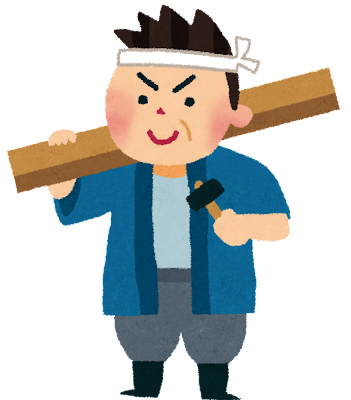

<!-- _class: cover-hero -->

大学などで教える

Bloomの教育目標分類

<b>達成目標：</b>教育目標分類を使いこなせるようになる。

<!--
- タイトルコール。Bloomの教育目標分類を使いこなせるようになる、が今回の達成目標。
-->

---

Bloomの教育目標分類

# Bloomの教育目標分類　参照

# 1956年に認知的領域、1964年に情意的領域。精神運動領域は1972年の別のグループの仕事。認知的領域はAndersonらの改訂版を使用。

教育心理学者Bloomらにより、 <b>8年かけて#作られた教育における目標の分類</b>

<table class="bloom">
<thead><tr><th class="axis"></th><th>認知的領域 (知識や思考)</th><th>精神運動的領域 (技能やスキル)</th><th>情意的領域 (態度)</th></tr></thead>
<tbody>
<tr><td class="axis">高次</td><td><b class="lv">創造</b> (学習を応用し、新しい価値を作れる)</td><td class="dim"></td><td class="dim"></td></tr>
<tr><td class="axis"></td><td><b class="lv">評価</b> (事物・判断等を比較し、評価出来る)</td><td><b class="lv">自然化</b> (習慣的な動作として行える)</td><td><b class="lv">個性化</b> (自身の世界観を持ち行動を促せる)</td></tr>
<tr><td class="axis"></td><td><b class="lv">分析</b> (要素に分け、関係性を指摘できる)</td><td><b class="lv">分節化</b> (複数動作を組み合わせ調和できる)</td><td><b class="lv">組織化</b> (複数の価値の相互関係を設定する)</td></tr>
<tr><td class="axis"></td><td><b class="lv">応用</b> (他の場面や状況に使用できる)</td><td><b class="lv">精密化</b> (臨機応変な動作が出来る)</td><td><b class="lv">価値づけ</b> (価値を理解し自分のものとする)</td></tr>
<tr><td class="axis"></td><td><b class="lv">理解</b> (学習内容を説明出来る)</td><td><b class="lv">巧妙化</b> (示された動作を誤りなく行える)</td><td><b class="lv">反応</b> (新しい現象に能動的に反応する)</td></tr>
<tr><td class="axis">低次</td><td><b class="lv">記憶</b> (事実や概念を暗記している)</td><td><b class="lv">模倣</b> (示された動作を真似できる)</td><td><b class="lv">受け入れ</b> (新たな現象に注意を向ける)</td></tr>
</tbody>
</table>

(梶田, 2010や栗田&中村, 2023を元に作成)

<!--
- 認知・精神運動・情意の3領域×6段階。8年かけて作られた目標分類。低次（記憶）から高次（創造）へ。
-->

---

Bloomの教育目標分類

# Bloomの教育目標分類

<table class="bloom">
<thead><tr><th class="axis"></th><th>知識や思考</th><th>技能やスキル</th><th>態度</th></tr></thead>
<tbody>
<tr><td class="axis">高次</td><td><b class="lv">創造</b></td><td class="dim"></td><td class="dim"></td></tr>
<tr><td class="axis hi">評</td><td class="hi"><b class="lv">評価</b></td><td class="hi"><b class="lv">自然化</b></td><td class="hi"><b class="lv">個性化</b></td></tr>
<tr><td class="axis"><b>分析</b></td><td><b class="lv">分析</b></td><td><b class="lv">分節化</b></td><td><b class="lv">組織化</b></td></tr>
<tr><td class="axis"></td><td><b class="lv">応用</b></td><td><b class="lv">精密化</b></td><td><b class="lv">価値づけ</b></td></tr>
<tr><td class="axis"></td><td><b class="lv">理解</b></td><td><b class="lv">巧妙化</b></td><td><b class="lv">反応</b></td></tr>
<tr><td class="axis">低次</td><td><b class="lv">記憶</b></td><td><b class="lv">模倣</b></td><td><b class="lv">受け入れ</b></td></tr>
</tbody>
</table>

個人のスキルは、<b>教育目標に沿って発達している</b> と考えると、腑に落ちませんか？

棟梁

大工

見習い

<!--
- スキルは目標に沿って発達する。見習い→大工→棟梁の熟達は、低次→高次の階層と重なる。
-->

---

Bloomの教育目標分類

# 道具として使う ①目標の次元

<b>Bloomの教育目標をコースデザインの道具として使う</b> <b>①目標の次元：</b>クラスのレベルや構造を考える

<table class="bloom">
<thead><tr><th class="axis"></th><th>知識や思考</th><th>技能やスキル</th><th>態度</th></tr></thead>
<tbody>
<tr><td class="axis">高次</td><td><b class="lv">創造</b></td><td class="dim"></td><td class="dim"></td></tr>
<tr><td class="axis"></td><td><b class="lv">評価</b></td><td><b class="lv">自然化</b></td><td><b class="lv">個性化</b></td></tr>
<tr><td class="axis"></td><td><b class="lv">分析</b></td><td><b class="lv">分節化</b></td><td><b class="lv">組織化</b></td></tr>
<tr><td class="axis"></td><td><b class="lv">応用</b></td><td><b class="lv">精密化</b></td><td><b class="lv">価値づけ</b></td></tr>
<tr><td class="axis"></td><td><b class="lv">理解</b></td><td><b class="lv">巧妙化</b></td><td><b class="lv">反応</b></td></tr>
<tr><td class="axis">低次</td><td><b class="lv">記憶</b></td><td><b class="lv">模倣</b></td><td><b class="lv">受け入れ</b></td></tr>
</tbody>
</table>

授業内容の 見直しにも！

<b>一年生の授業</b>だから、 低次を中心にしよう

<b>大学院の統計学</b>だから 評価と分節化まで。 態度は評価しない

<b>起業の実践論</b>なので、 創造体験に集中しよう

<!--
- ①目標の次元：クラスのレベルや構造を、表のどこを狙うかで言語化する。授業内容の見直しにも使える。
-->

---

Bloomの教育目標分類

# 道具として使う ②評価の次元

<b>Bloomの教育目標をコースデザインの道具として使う</b> <b>②評価の次元：</b>各次元まで測れるか・課題のねらい考える

<table class="bloom">
<thead><tr><th class="axis"></th><th>知識や思考</th><th>技能やスキル</th><th>態度</th></tr></thead>
<tbody>
<tr><td class="axis">高次</td><td><b class="lv">創造</b></td><td class="dim"></td><td class="dim"></td></tr>
<tr><td class="axis"></td><td><b class="lv">評価</b></td><td><b class="lv">自然化</b></td><td><b class="lv">個性化</b></td></tr>
<tr><td class="axis"></td><td><b class="lv">分析</b></td><td><b class="lv">分節化</b></td><td><b class="lv">組織化</b></td></tr>
<tr><td class="axis"></td><td><b class="lv">応用</b></td><td><b class="lv">精密化</b></td><td><b class="lv">価値づけ</b></td></tr>
<tr><td class="axis"></td><td><b class="lv">理解</b></td><td><b class="lv">巧妙化</b></td><td><b class="lv">反応</b></td></tr>
<tr><td class="axis">低次</td><td><b class="lv">記憶</b></td><td><b class="lv">模倣</b></td><td><b class="lv">受け入れ</b></td></tr>
</tbody>
</table>

課題種別に応じて 評価できるものは変わるよ

理解と記憶の確認が主 なので、筆記試験！

複数手法を構造化する 論述試験と複数手法を 応用するレポートかな

実演や企画書の提出、 面接等も必要かも

<!--
- ②評価の次元：各次元まで測れるか、課題のねらいを考える。狙う段階に応じて評価手法が変わる。
-->

---

Bloomの教育目標分類

# 道具として使う ②評価の次元（例）

<b>Bloomの教育目標をコースデザインの道具として使う</b>　<b>②評価の次元：</b>各次元まで測れるか・課題のねらい考える

例)

<table class="bloom detail">
<thead><tr><th class="axis"></th><th>知識 (認知的領域) Cognitive domain (knowledge-based)</th><th>技能 (精神運動的領域) Psychomotor domain (action-based)</th><th>態度 (情意的領域) Affective domain (emotion-based)</th></tr></thead>
<tbody>
<tr><td class="axis">高次</td><td><b>創造 Create</b> 6分間模擬授業制作⑦</td><td class="dim"></td><td class="dim"></td></tr>
<tr><td class="axis"></td><td><b>評価 Evaluate</b> 模擬授業評価⑧</td><td class="dim">自然化 Naturalization</td><td class="dim">個性化 Characterizing</td></tr>
<tr><td class="axis"></td><td><b>分析 Analyze</b> 授業参観計画書④・ 報告書⑤</td><td><b>分節化 Articulation</b> 6分間模擬授業制作⑦</td><td><b>組織化 Organizing</b> シラバスの作成③</td></tr>
<tr><td class="axis"></td><td><b>応用 Apply</b> クラスデザインシート 作成③、シラバス作成②</td><td><b>精密化 Precision</b> クラスデザインシート 作成③</td><td><b>価値づけ Valuing</b> 1 min 自己紹介① 「 教育の抱負」レポート ①/⑧</td></tr>
<tr><td class="axis"></td><td><b>理解 Understand</b> (授業コンテンツそのもの)</td><td><b>巧妙化 Manipulation</b> シラバス作成②</td><td><b>反応 Responding</b> リアクションペーパー④・ ⑥</td></tr>
<tr><td class="axis">低次</td><td><b>記憶 Remember</b> 著作権理解度テスト ⑦</td><td><b>模倣 Imitation</b> 授業参観報告書⑤</td><td><b>受け入れ Receiving</b> (授業コンテンツその)</td></tr>
</tbody>
</table>

<!--
- 評価の次元の具体例。各セルに、どの課題（①〜⑧）がどの段階を測るかを割り付けている。
-->

---

Bloomの教育目標分類

# 道具として使う ③インストラクションの次元

<b>Bloomの教育目標をコースデザインの道具として使う</b> <b>③インストラクションの次元：</b>その教え方で身につきます？

<table class="bloom">
<thead><tr><th class="axis"></th><th>知識や思考</th><th>技能やスキル</th><th>態度</th></tr></thead>
<tbody>
<tr><td class="axis">高次</td><td><b class="lv">創造</b></td><td class="dim"></td><td class="dim"></td></tr>
<tr><td class="axis"></td><td><b class="lv">評価</b></td><td><b class="lv">自然化</b></td><td><b class="lv">個性化</b></td></tr>
<tr><td class="axis"></td><td><b class="lv">分析</b></td><td><b class="lv">分節化</b></td><td><b class="lv">組織化</b></td></tr>
<tr><td class="axis"></td><td><b class="lv">応用</b></td><td><b class="lv">精密化</b></td><td><b class="lv">価値づけ</b></td></tr>
<tr><td class="axis"></td><td><b class="lv">理解</b></td><td><b class="lv">巧妙化</b></td><td><b class="lv">反応</b></td></tr>
<tr><td class="axis">低次</td><td><b class="lv">記憶</b></td><td><b class="lv">模倣</b></td><td><b class="lv">受け入れ</b></td></tr>
</tbody>
</table>

単なる講義では 高次の目標には 到達できないよ

オンデマンド型の講義 で十分かな

輪読型の授業や実社会 の課題を見学する時間 は取りたいかも

アクティブラーニング や外部講師は必須かも

<!--
- ③インストラクションの次元：その教え方で本当に身につくか。狙う段階が高いほど能動的な学習が必要。
-->

---

Bloomの教育目標分類

# Finkの意味ある学習分類

<b>Finkの意味ある学習分類</b> (Taxonomy of significant learning)

<b>人間性の醸成</b>や、<b>価値観</b>の見出し、 <b>学び方自体の学習</b>なども目標に加える立場

Fink (2003) Creating significant leaning experiences

⇒

複数の学習分類があるので、 学習に組み込む必要がある領域を 含んだモデルを使用する

目標分類を道具として活用し、授業に活かす

<!--
- Finkの分類は、人間性・価値観・学び方の学習まで目標に含める。必要な領域を含んだモデルを選び、道具として授業に活かす。
-->
