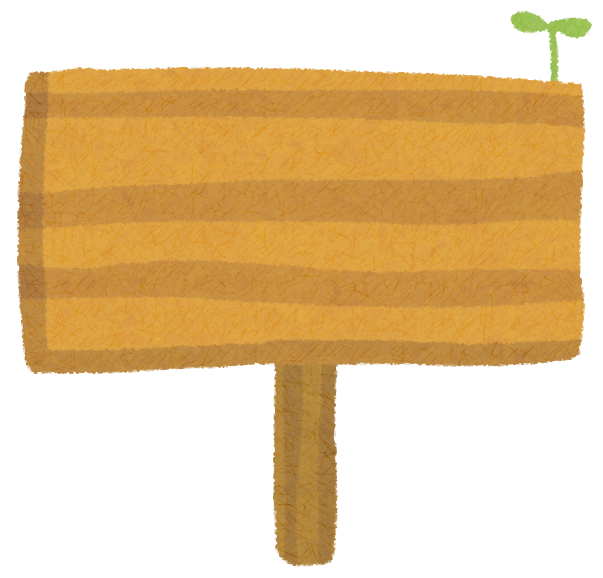

<!-- _class: cover-hero -->

大学などで教える

評価と目標の関係

<b>達成目標：</b>目標に応じた評価方法を理解する。

<!--
- タイトルコール。「目標に応じた評価方法を理解する」が今回の達成目標。
-->

---

評価と目標の関係

テストなんて嫌だ… 評価されたくない…

<b>達成目標：</b>目標に応じた評価方法を理解する。

成績をつけるのに どんな意義があるの

<!--
- 学生からはテストや評価への抵抗の声がある。一方で成績をつける意義は何か。この緊張関係から考えていく。
-->

---

評価と目標の関係

# そもそも、なぜ評価は必要？

<b>良い成績を取れる人を見分けるため？</b>　⇒ 否。受験パラダイムは忘れよう。

<b>学修者を支援するため</b>

<b>学修者：</b>目標到達度に基づく主体的な学びのため

<b>教員：</b>理解度を確認し支援するため

<b>教員：</b>授業を改善するため

<b>学修の質を保証をするため (成績)</b>

<!--
- 評価は良い成績の人を見分けるためではない。受験パラダイムを忘れ、学修者支援・授業改善・質保証のためと捉える。
-->

---

評価と目標の関係

# 目標到達度を評価する

<b>目標</b>とは、授業で出来るようになって欲しいことの一覧

<b>評価</b>とは、<b>目標に対しどれほど到達出来たか</b>を可視化したもの

<b>評価対象と評価方法</b>は<b>目標と対応</b> →逆向き設計でも同じ話がありました

<b>評価</b>：あと30 mで目標到達 道の右側の方が安全だよ

<!--
- 目標＝できてほしいことの一覧、評価＝目標への到達度を可視化したもの。評価対象・方法は目標と対応する（逆向き設計と同じ）。
-->

---

評価と目標の関係

# 評価を設定する

① <b>頻度</b>：どのくらい評価はマメに行うべきか？

② <b>種類</b>：どの方法で評価するのか？

③ <b>性質</b>：その評価で目標到達は測れるのか？

<b>✔ シラバスの目標一覧</b>と<b>教育目標分類</b>を眺めながら決める

<b>✔ </b>目標が曖昧で評価が決まらないなら、<b>目標に立ち返って目標を明確化する</b>

<!--
- 評価設定は①頻度②種類③性質の3点で考える。シラバスの目標一覧と教育目標分類を眺めて決め、曖昧なら目標に立ち返る。
-->

---

評価と目標の関係

# 評価の種類

<b>高次</b>の目標を測りやすい

組み合わせて測ることも<b>可</b>

<svg viewBox="0 0 1000 520" style="width:760px; margin-top:6px;" xmlns="http://www.w3.org/2000/svg">
<defs>
<marker id="ah" markerWidth="12" markerHeight="12" refX="6" refY="6" orient="auto-start-reverse"><path d="M1,1 L11,6 L1,11 Z" fill="#8a8f96"/></marker>
<linearGradient id="redarr" x1="0" y1="1" x2="1" y2="0"><stop offset="0" stop-color="#f3b6b6"/><stop offset="1" stop-color="#d11f1f"/></linearGradient>
</defs>
<line x1="500" y1="30" x2="500" y2="490" stroke="#8a8f96" stroke-width="5" marker-start="url(#ah)" marker-end="url(#ah)"/>
<line x1="30" y1="265" x2="970" y2="265" stroke="#8a8f96" stroke-width="5" marker-start="url(#ah)" marker-end="url(#ah)"/>
<text x="500" y="22" text-anchor="middle" font-size="28" font-weight="800">複雑</text>
<text x="500" y="512" text-anchor="middle" font-size="28" font-weight="800">単純</text>
<text x="34" y="300" font-size="28" font-weight="800">筆記</text>
<text x="900" y="300" font-size="28" font-weight="800">実演</text>
<!-- 単純/筆記(左下)→複雑/実演(右上=高次)。シャフトと対称な矢じり -->
<line x1="160" y1="355" x2="724" y2="93" stroke="url(#redarr)" stroke-width="38" stroke-linecap="round" opacity="0.92"/>
<polygon points="795,60 744,135 705,51" fill="#d11f1f"/>
<rect x="120" y="70" width="520" height="95" rx="6" fill="#FBE4EA" stroke="#E08A2B" stroke-width="2.5"/>
<text x="380" y="108" text-anchor="middle" font-size="29" font-weight="800">パフォーマンス課題</text>
<text x="380" y="146" text-anchor="middle" font-size="25">(小論文、作品制作、発表等)</text>
<rect x="120" y="185" width="220" height="92" rx="6" fill="#fff" stroke="#E08A2B" stroke-width="2.5"/>
<text x="230" y="220" text-anchor="middle" font-size="26">論述式問題</text>
<text x="230" y="256" text-anchor="middle" font-size="26">レポート</text>
<rect x="540" y="185" width="240" height="92" rx="6" fill="#fff" stroke="#E08A2B" stroke-width="2.5"/>
<text x="660" y="220" text-anchor="middle" font-size="26">実技テスト</text>
<text x="660" y="256" text-anchor="middle" font-size="26">面接/口頭試問</text>
<rect x="135" y="300" width="180" height="92" rx="6" fill="#fff" stroke="#E08A2B" stroke-width="2.5"/>
<text x="225" y="335" text-anchor="middle" font-size="26">記述式</text>
<text x="225" y="371" text-anchor="middle" font-size="26">問題</text>
<rect x="640" y="300" width="160" height="92" rx="6" fill="#fff" stroke="#E08A2B" stroke-width="2.5"/>
<text x="720" y="335" text-anchor="middle" font-size="26">観察</text>
<text x="720" y="371" text-anchor="middle" font-size="26">試験</text>
<rect x="135" y="408" width="180" height="92" rx="6" fill="#fff" stroke="#E08A2B" stroke-width="2.5"/>
<text x="225" y="443" text-anchor="middle" font-size="26">選択式</text>
<text x="225" y="479" text-anchor="middle" font-size="26">問題</text>
<rect x="560" y="408" width="160" height="92" rx="6" fill="#fff" stroke="#E08A2B" stroke-width="2.5"/>
<text x="640" y="443" text-anchor="middle" font-size="26">心理</text>
<text x="640" y="479" text-anchor="middle" font-size="26">テスト</text>
</svg>

田中耕治（2010）「<i>よくわかる教育評価</i>」(ミネルヴァ書房)を改変

<!--
- 評価の種類を「筆記↔実演」「単純↔複雑」の2軸で整理。右上ほど高次の目標を測りやすい。組み合わせて測ることも可。
-->

---

評価と目標の関係

# ルーブリック

<b>✔採点道具の一つで、課題を構成要素に分け、　要素ごとに評価基準を満たすレベルを説明した表</b> ✔パフォーマンス課題・レポート・実技等の評価の可視化

◀──── 評価尺度（レベル） ────▶

評価基準

<table style="border-collapse:collapse; font-size:20px; flex:1; table-layout:fixed; width:100%;">
<colgroup><col style="width:140px;"><col><col><col></colgroup>
<tr style="background:var(--accent); color:#fff;">
<th style="border:1.5px solid #fff; padding:6px 8px; color:#fff;">評価観点</th>
<th style="border:1.5px solid #fff; padding:6px 8px; color:#fff;">素晴らしい(2)</th>
<th style="border:1.5px solid #fff; padding:6px 8px; color:#fff;">合格(1)</th>
<th style="border:1.5px solid #fff; padding:6px 8px; color:#fff;">不十分(0)</th>
</tr>
<tr><td style="border:1.5px solid #ccc; padding:6px 8px; background:var(--accent-soft); font-weight:700;">分量</td><td style="border:1.5px solid #ccc; padding:6px 8px;"></td><td style="border:1.5px solid #ccc; padding:6px 8px;">6分間で丁度</td><td style="border:1.5px solid #ccc; padding:6px 8px;">過剰か少ない</td></tr>
<tr><td style="border:1.5px solid #ccc; padding:6px 8px; background:var(--accent-soft); font-weight:700;">目標と目的</td><td style="border:1.5px solid #ccc; padding:6px 8px;">明確かつ内容が一致していた</td><td style="border:1.5px solid #ccc; padding:6px 8px;">明確さか内容の何れかに改善点</td><td style="border:1.5px solid #ccc; padding:6px 8px;">明確さ・内容の何れも不十分</td></tr>
<tr><td style="border:1.5px solid #ccc; padding:6px 8px; background:var(--accent-soft); font-weight:700;">レベル設定</td><td style="border:1.5px solid #ccc; padding:6px 8px;">手を伸ばせば届くレベルだった</td><td style="border:1.5px solid #ccc; padding:6px 8px;">一部高度・容易な箇所があった</td><td style="border:1.5px solid #ccc; padding:6px 8px;">極端に高度・容易であった</td></tr>
</table>

<b>「課題内容</b>：6分模擬授業」を評価するためのルーブリック　(スティーブンス＆レビ, 2014)

ルーブリックを適切に設計し高次の課題も扱おう

栗田 &amp; 中村（2024）<i>インタラクティブ・ティーチング 実践編３</i>

<!--
- ルーブリックは採点道具。課題を要素に分け、要素ごとに評価基準のレベルを説明した表。評価観点×評価尺度の二次元で高次の課題も評価できる。
-->

---

評価と目標の関係

# まとめ

① 評価は、学習者を支援するためにある

② 目標と評価方法は、強い対応関係を持つ

③ 目標の<b>レベル感に合わせた評価方法</b>を選ぶ

具体的な問題設定自体については、Tipsはいくつかあるものの、<b>各分野の先行事例</b>や<b>教科書の例</b>、<b>先生ご自身の体験</b>、<b>過去の結果</b>から設定可能と考えます。

<!--
- まとめ。①評価は学習者支援のため、②目標と評価方法は強い対応関係、③目標のレベル感に合った評価方法を選ぶ。具体の問題設定は先行事例・教科書・体験・過去結果から設定可能。
-->
