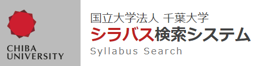
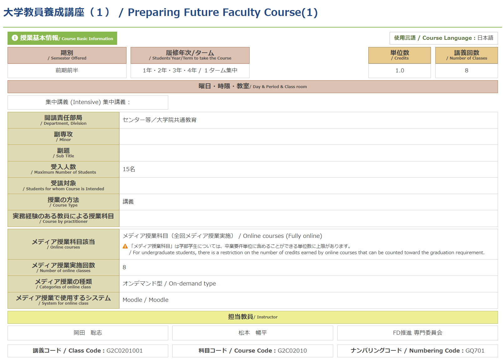
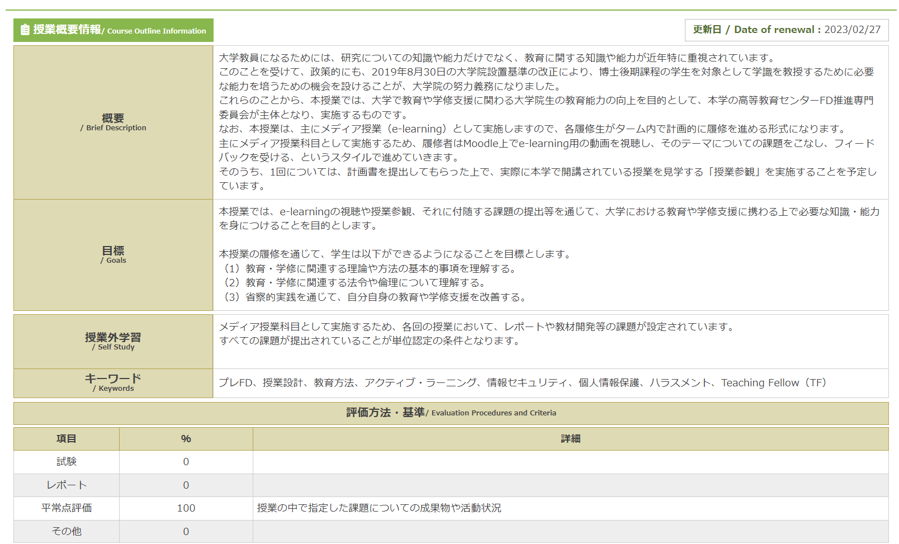
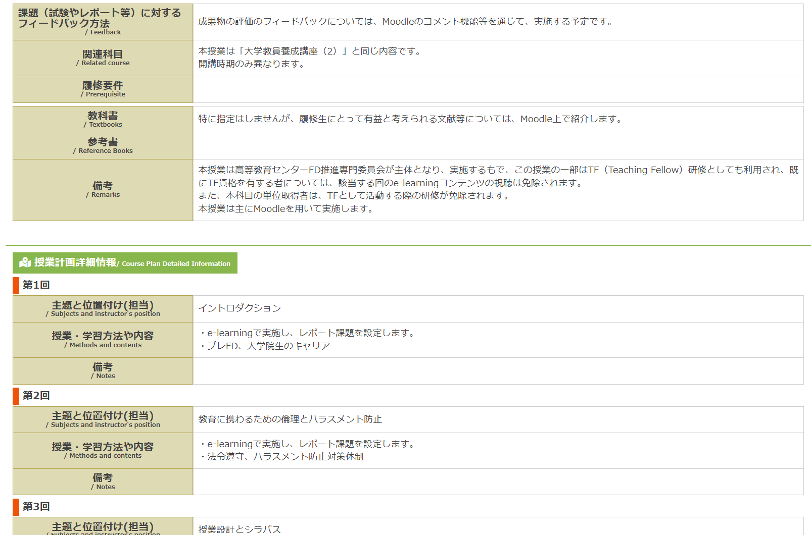
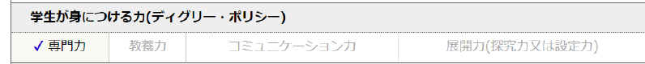
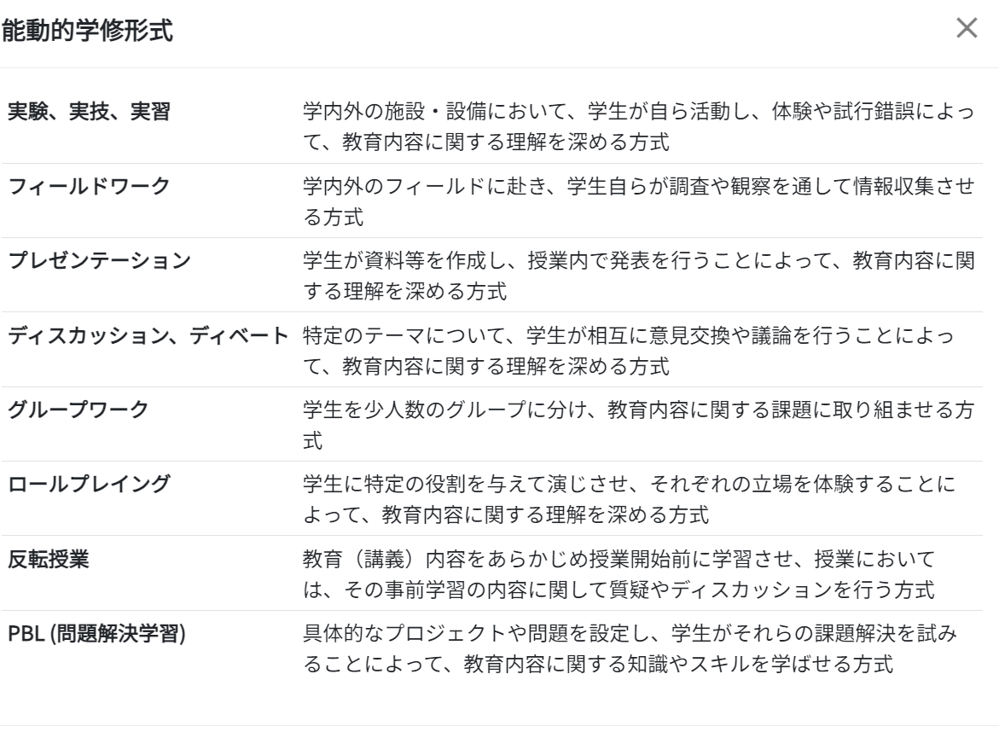

<!-- _class: cover-hero -->

千葉大シラバス

<b>達成目標：</b>千葉大のシラバスに係る取組みを理解する。

https://cu-syllabus-management.an.r.appspot.com/2024/401002000000000/G2C0201001/ja_JP

<!--
- まずは、タイトルコール。千葉大のシラバスに係る取組みを理解する、が達成目標。
-->

---

千葉大シラバス

1/3

# 開いて確認してみよう

授業タイトル

<b>基本情報</b> ターム／単位数／年次 開講部局／タイプ／システム

担当教員

<!--
- まずシラバスを開いて、授業タイトル・基本情報・担当教員を確認する。
-->

---

千葉大シラバス

2/3

# 概要・目標・評価

概要と講義目的

達成目標

成績評価方法・基準

<!--
- 続いて、概要と講義目的・達成目標・成績評価方法と基準を確認する。
-->

---

千葉大シラバス

3/3

# 条件・教科書・各回

履修条件

教科書・参考文献

各回ごとの授業内容

準備学修等の指示

<!--
- 最後に、履修条件・教科書／参考文献・各回ごとの授業内容・準備学修等の指示を確認する。
-->

---

千葉大シラバス

# 千葉大の取組み

- <b>シラバス作成に係るFD</b> 
- <b>シラバスシステムマニュアルの充実</b> 
- <b>シラバスチェック</b>

特に、シラバスチェックについては、全授業の記載を年度当初に確認の上、不備が認められる場合は<b>改善を依頼</b>

<b>応募先や採用先のポリシー</b>を確認し尊重を

<!--
- 千葉大では、シラバス作成に係るFD・システムマニュアルの充実・シラバスチェックを実施。特にチェックは年度当初に全授業を確認し、不備があれば改善を依頼している。応募先・採用先のポリシーも確認し尊重を。
-->

---

(参考)千葉大シラバスチェック

# (参考)シラバスチェック

７つの重点確認項目

１

担当教員の連絡先が適切に入力されており、学生がこの情報をもとに担当教員にコンタクトを取ることができるか。

２

「目標」が、学生を主語とする分かりやすい言葉で、学生が「〇〇できる」というように具体的に記述されているか。

３

「授業外学習」に、具体的に必要な準備学習（予習）や授業の理解を深めるための宿題や小レポートなど（復習）について十分に記述されているか。

４

「評価方法・基準」に、評価の方法や基準、成績判定における評価の割合が適切に記述されているか。

５

<b>「評価方法・基準」に、授業への出席（欠席）が評価方法として記述されていないか。</b>

６

「フィードバック方法」に、課題（試験やレポート等）に対するフィードバックの方法や内容が十分に記述されているか。

７

「主題と位置づけ（担当）」「授業・学習方法や内容」に、各回の授業内容や方法が適切に記述されているか。

８

１単位全８回の授業で、８回目を試験のみとして記述していないか。

<!--
- (参考)千葉大のシラバスチェックで用いる７つの重点確認項目。特に⑤の出席を評価にしない点に注意。
-->

---

他大学のシラバスポリシー

# 他大学のシラバスポリシー

例)東京工業大学

<b>学生が身につける力(≈DP)との関係性</b>を明記

(東工大HPより)

例)北海道大学

教員の実務経験があれば記載

例)慶應義塾大学

<b>能動的学修形式</b>を記載

(慶應大HPより)

<!--
- 他大学にも固有のポリシーがある。東工大は身につける力(≈DP)との関係性、慶應は能動的学修形式、北大は実務経験を記載する。
-->

---

まとめ

# まとめ

1. 千葉大では、役立つシラバスのため様々な取組みを実施している

2. 他大学でも固有のポリシーや特徴がある

3. 公募に応募する時は応募先の例を確認

<b>参考文献</b>： 
①千葉大FDポータル シラバスチェックサイト(教職員向け) 
②各大学のシラバス検索システム　千葉大・東工大・慶應義塾大・北大

<!--
- まとめ。①千葉大は役立つシラバスのため様々な取組みを実施、②他大学にも固有のポリシーや特徴、③公募の際は応募先の例を確認する。
-->
