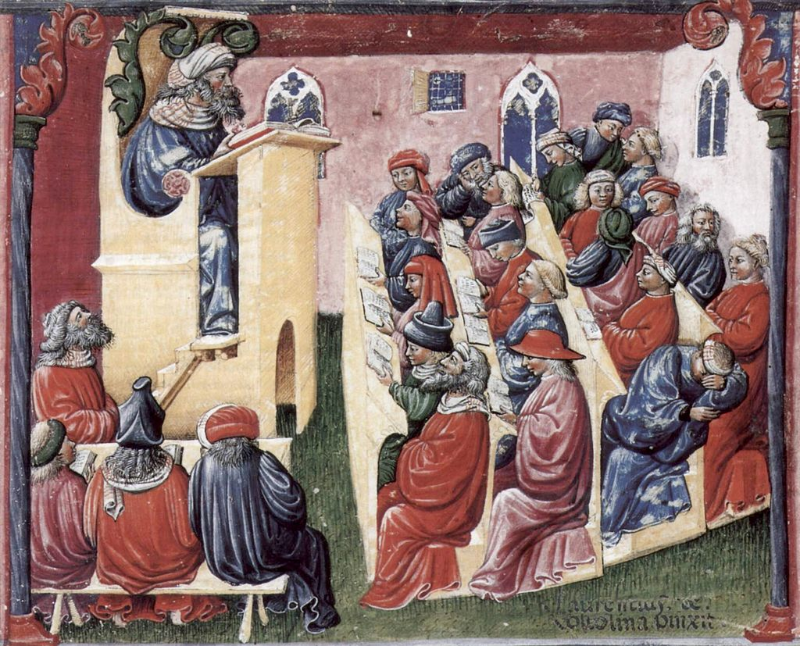
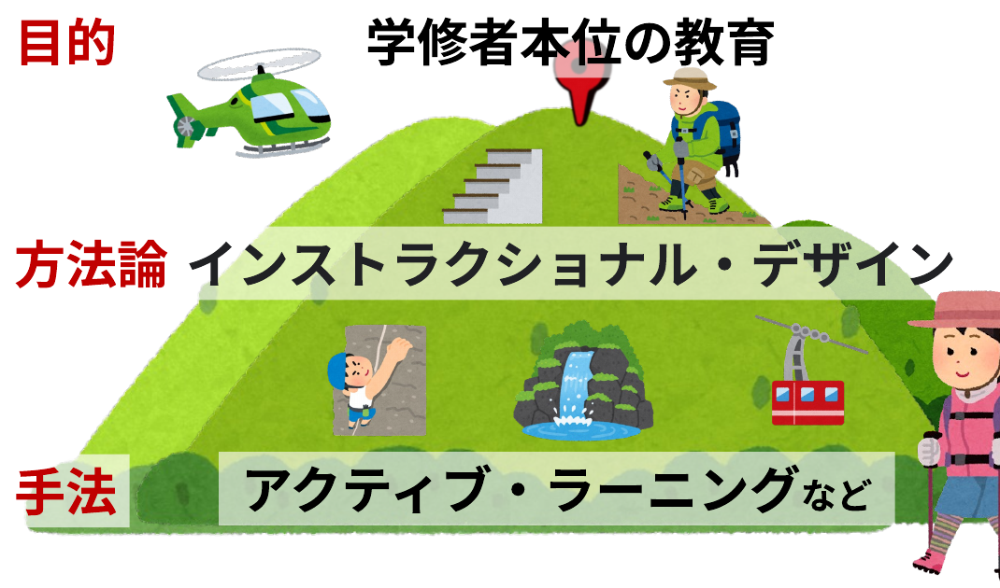

<!-- _class: cover-hero -->

大学などで教える

高等教育の変化

<b>達成目標：</b>高等教育の変化を説明出来る。

<!-- まずは、タイトルコール。 -->

---

高等教育の変化

# 何が変わった？変わるべき？

14世紀 @ ドイツ

Laurentius de Voltolina

現在？

Generated by DALL-E

<b>社会</b>も、<b>科学技術</b>も、<b>教育理論</b>も進歩 でも、<b>授業は同じまま</b>？

<!--
左の絵は、13世紀のドイツの大学の絵。

なお、右の絵は左の絵を元に、以下のスクリプトで出来た。

添付の絵と同じ構図で、現代の大学の教室、学生が眠そうに授業を受けている絵を生成して下さい。教員は、投影されたスクリーンに難しい数式を並べ、それを説明している形にして下さい。学生はやる気なく、机の上にパソコンがあったり、スマホを使っている学生がいたり、寝ていたりする様子にしてください。学生の服装は現代的なものにして下さい。教員の服装はスーツにしてください。教室の雰囲気は、できる限り現在の大学に合わせて下さい。なるべく無機質な教室が良いです。教室の窓はシンプルな四角い窓で構いません。また壁面の絵なども不要です。そのようにして、添付の絵のパロディを作って下さい。
-->

---

高等教育の変化

# 理解すべきキーワード

暗記

<b>学修者本位の教育</b>／<b>アクティブ・ラーニング</b>

教員が<b>「何を教えたか」</b>ではなく

学修者が<b>「何を学び、身に付けることができたのか」</b>という思想に基づき設計された教育 (2040年の高等教育グランドデザイン答申)

<b>アクティブ・ラーニング</b>：一方向性による知識伝達型の学習方法<b>ではなく</b>、<b>学修者の能動的な学修への参加</b>を取り入れた教授・学習法の総称

<b>インストラクショナル・デザイン</b>：教育の効果・効率・魅力を高める手法・モデル・研究を統合し、<b>学修を支援する環境を構成するプロセス</b>

<!-- 教育パラダイムの変革期 -->

---

高等教育の変化

# 理解すべきキーワード

目的学修者本位の教育

方法論インストラクショナル・デザイン

手法アクティブ・ラーニングなど

<!--
教えること(ティーチング)も、インストラクションの一部
インストラクションのガニエの定義は、「学修を支援する目的的(purposeful)な活動を構成する事象の集合体」
Instruction is a human undertaking whose purpose is to help people learn
Instruction is a set of events that affect learners in such a way that learning is facilitated
-->

---

高等教育の変化

# 理解すべきキーワード

目的学修者本位の教育

方法論インストラクショナル・デザイン

手法アクティブ・ラーニングなど

教員　「知識に関する専門家」としてだけではなく、 <b>「学びを促進するためのファシリテーター」</b>

<!--
登る山は違っても良い。

授業方法は教員に「知識に関する専門家」としてだけではなく「学びを促進するためのファシリテーター」
-->

---

高等教育の変化

# 教育の周辺環境の変化

✔ イシュー型/PBL型の学修？

✔ オンライン教育? 対面授業?

✔ 生成AI / 機械翻訳どう使おう…？

この授業で、スキルとヒントを会得し、 その後も<b>学び続けて下さい</b>  <b style="font-size:34px;">未来の大学教育を作るのは、あなたです</b>

<!-- ＼＼ドン！／／ -->

---

高等教育の変化

# 高等教育は、変わっていく

学修者本位の教育

<b>教員</b>が<b>「何を教えたか」</b>ではなく

<b>学修者</b>が<b>「何を学び、身に付けることができたのか」</b>

インストラクショナル・デザイン / アクティブ・ラーニング

教員は、<b>「知識に関する専門家」</b>から、<b>「学びを促進するファシリテーター」</b>へ

環境の変化

教育学研究の進展、技術進展等で進化

変えるのは、<b style="color:var(--accent-dark);">あなた</b>です

<!-- 高等教育は変わっていく。学修者本位の教育、ID/AL、環境の変化。変えるのはあなた。 -->
