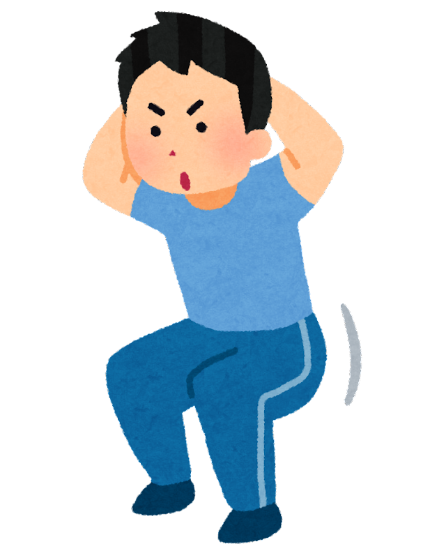

<!-- _class: cover-hero -->

大学などで教える

目的と目標を書く

<b>達成目標：</b>目的と目標を適切に提案することが出来る。

<b style="color:var(--tag-green)!important;">Hint</b>　シラバス作成課題の<b style="color:var(--accent-dark);">目的</b>と<b style="color:var(--accent-dark);">目標</b>を書きながら受講すること

<!--
- まずは、タイトルコール。シラバス作成課題の目的と目標を書きながら受講するのがコツ。
-->

---

目的と目標を書く

# 目的と目標を書く

読んだ事ないし、 適当でよいのでは？

<b>達成目標：</b> 目的と目標を適切に提案することが出来る。

ルールなんて あるの？

<!--
- 「読んだことないし適当でよいのでは？」「ルールなんてあるの？」——実はルール（書き方）がある、という導入。
-->

---

目的と目標を書く

# 参照 書き方の共通事項

学習者の「<b style="color:var(--accent-dark);">主体的学び✨</b>」の支援になること

①主語は<b>学習者</b>とすること

②動詞に<b>注意</b>すること

参考文献：目的・目標記載のための動詞例 (佐藤編2010、中島編2016、栗田編2023)

<!--
- 共通事項は2つ。①主語は学習者にする、②動詞に注意する。すべては「主体的学び」の支援のため。動詞例は参考文献を参照。
-->

---

目的と目標を書く

# 参照 目的を書くヒント

<b style="color:var(--accent-dark);">①</b>「<b>ために</b>」を上手く使う

<b style="color:var(--accent-dark);">②</b> <b style="color:var(--accent-dark);">多様な価値</b>が含まれていることを示す

<table style="border-collapse:collapse; width:100%; font-size:21px; line-height:1.4;">
<tr style="background:var(--accent-soft); color:var(--accent-dark);">
<th style="border:1.5px solid #bbb; padding:5px 10px;">価値の種類</th>
<th style="border:1.5px solid #bbb; padding:5px 10px;">意味</th>
<th style="border:1.5px solid #bbb; padding:5px 10px;">目的達成後の例</th>
</tr>
<tr>
<td style="border:1.5px solid #bbb; padding:5px 10px;">達成価値</td>
<td style="border:1.5px solid #bbb; padding:5px 10px;">習得と達成から満足が得られたか</td>
<td style="border:1.5px solid #bbb; padding:5px 10px;">一人で出来るようになった・一冊読んだ</td>
</tr>
<tr>
<td style="border:1.5px solid #bbb; padding:5px 10px;">内発的価値</td>
<td style="border:1.5px solid #bbb; padding:5px 10px;">授業のタスクそのものに価値を感じられるか</td>
<td style="border:1.5px solid #bbb; padding:5px 10px;">議論がためになる・プログラミングが楽しい</td>
</tr>
<tr>
<td style="border:1.5px solid #bbb; padding:5px 10px;">道具的価値</td>
<td style="border:1.5px solid #bbb; padding:5px 10px;">高次の目標達成に役立つか</td>
<td style="border:1.5px solid #bbb; padding:5px 10px;">資格取得に必要・卒論や就職後役立つ</td>
</tr>
</table>

価値が多いほどモチベーションが高まるとされる (例：<b>自動車教習</b>🚗)

<b style="color:var(--accent-dark);">③</b> <b style="color:var(--accent-dark);">DP</b>との関連性を考える

<!--
- 目的を書くヒント：①「ために」を使う、②達成・内発的・道具的の多様な価値を示す、③DP（ディプロマポリシー）との関連を考える。価値が多いほど動機づけが高まる。
-->

---

目的と目標を書く

# 目的 (= 授業の存在意義)の例

<b>(私が、)</b>一生健やかな人生を歩む<b>ために </b>(道具的価値)、 
筋トレの背景にある理論、医学的エビデンス、方法を<b>理解し</b>、 
実践を楽しみながら(内発的価値)、 
一人で正しく筋トレする<b>能力を身につける</b>(達成価値) 。

<b>(私が、)</b>未来の大学教員として活躍する<b>ために</b>(道具的価値)、 
学習者主体の高等教育の実現や学修支援に必要な概念を<b>理解し</b>、 
(課題などのアクティビティを楽しみながら：内発的価値)、 
教育を担当する際に<b>応用できるようになる</b>(達成価値)。

<b>(私が、)</b>患者さんに寄り添える医療従事者となる<b>ために</b>(道具的価値) 、 
多様なケーススタディと議論を通して、 
倫理観を涵養する(達成価値) 。

<!--
- 目的の文例3つ。いずれも「〜のために（道具的価値）／〜を理解し（内発的価値）／〜できる能力（達成価値）」の形で多様な価値を織り込む。
-->

---

目的と目標を書く

# 参照 目標を書くヒント

授業の結果、学修者が修了後に できるようになって欲しい能力

<b>①</b>観察可能<b>(=評価可能)な行動</b>で記載

<b>②</b>一つの文章に一つの目標 （シラバス全体で、多くても10個）

<b>③</b>現実的かつジャンプすれば届く距離

難易度調整：優しすぎず、難しすぎず。

あなたが<b>その道のプロ</b>であれば、<b>目標は比較的簡単</b>に書けます。但し、学習した当時は難しかったことを忘れ、今や簡単になっているので<b>難易度設定には要注意</b>

<!--
- 目標を書くヒント：①観察可能（=評価可能）な行動で書く、②一文一目標（全体で多くても10個）、③現実的かつ少しジャンプすれば届く距離。プロほど難易度を見誤りやすいので要注意。
-->

---

目的と目標を書く

# 目標 (= 出来る様になって欲しい能力)の例

(私が、)

①筋トレの主要5動作と対応する種目を<b>説明出来る</b>。 
②各種目における自身の10RMを実践から<b>測定する</b>。 
③正しいトレーニング方法を<b>模倣する。</b> 
④ペアの筋トレスキルの向上に<b>協力する</b>。 
⑤疲れや怪我の時の筋トレプランを<b>構成出来る</b>。 
⑥各動作にて意識すべき部位と怪我の注意点を<b>指摘出来る</b>。 
⑦生涯健康の為の筋トレの必要性について、 
　クラスでの討議に積極的に参加し<b>持論を持つ</b>。

<b>注意</b> 評価と照らし合わせ、それで全てか考えよ。

劇的 Before After

→

できるように なる

授業

<!--
- 目標の文例。観察可能な動詞（説明出来る・測定する・模倣する…）で記述。評価と照らして「これで全てか」を確認すること。
-->

---

<!-- _class: summary -->

まとめ

# まとめ

① 目的と目標には、<b style="color:var(--accent-dark);">書き方がある</b>

② まずは、<b style="color:var(--accent-dark);">練習してみる</b>　動詞例の表 参照 のスライド

③ 学習者の「<b style="color:var(--accent-dark);">主体的学び✨</b>」の支援を目指すことを忘れずに

<b style="color:var(--accent-dark);font-size:22px;">参考文献</b>：栗田佳代子, 中村長史 編著 (2023) 『<i>インタラクティブ・ティーチング 実践編2</i>』河合出版

<!--
- まとめ。①目的と目標には書き方がある、②まずは練習してみる（動詞例の表を参照）、③主体的学びの支援を目指すことを忘れずに。
-->
