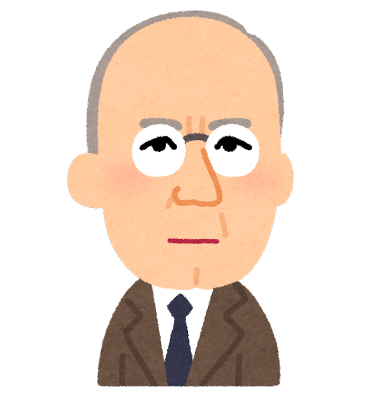
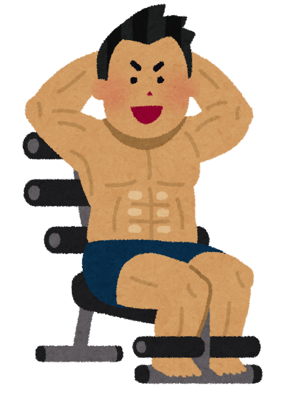

<!-- _class: cover-hero -->

大学などで教える

目的と目標を書く

<b>達成目標：</b>目的と目標を適切に提案することが出来る。

Hint　シラバス作成課題の<b>目的</b>と<b>目標</b>を書きながら受講すること

<!-- まずは、タイトルコール。 -->

---

目的と目標を書く

# 目的と目標を書く

読んだ事ないし、 適当でよいのでは？

<b>達成目標：</b>目的と目標を適切に提案することが出来る。

ルールなんて あるの？

<!-- 目的・目標の書き方なんてルールあるの？という素朴な疑問から始める。 -->

---

目的と目標を書く

# 参照 書き方の共通事項

学習者の「<b>主体的学び✨</b>」の支援になること

①主語は<b>学習者</b>とすること

②動詞に<b>注意</b>すること

参考文献：目的・目標記載のための動詞例 (佐藤編2010、中島編2016、栗田編2023)

<!-- 共通事項は2つ。主語は学習者、動詞に注意。いずれも主体的学びの支援が目的。 -->

---

目的と目標を書く

# 参照 目的を書くヒント

①<b>「ために」</b>を上手く使う

②<b>多様な価値</b>が含まれていることを示す

<table class="vtbl" style="margin:6px 0; margin-right:calc(var(--pip-w) - 60px);">
<tr><th>価値の種類</th><th>意味</th><th>目的達成後の例</th></tr>
<tr><td class="k">達成価値</td><td>習得と達成から満足が得られたか</td><td>一人で出来た・一冊読んだ 🚗一人で運転/教本読破/試験合格</td></tr>
<tr><td class="k">内発的価値</td><td>授業のタスクそのものに価値を感じられるか</td><td>議論がためになる・作業が楽しい 🚗運転楽しい/教官との話有意義</td></tr>
<tr><td class="k">道具的価値</td><td>高次の目標達成に役立つか</td><td>資格取得・卒論や就職後役立つ 🚗免許取得/旅行出来る/就職に有利</td></tr>
</table>

価値が多いほどモチベーションが高まるとされる (例：<b>自動車教習</b>🚗)

③ <b>DPとの関連性</b>を考える

<!-- 目的を書くヒント3つ。特に「多様な価値」（達成・内発・道具）が含まれるとモチベが高まる。 -->

---

目的と目標を書く

# 目的 (= 授業の存在意義)の例

(私が、)一生健やかな人生を歩む<b>ために (道具的価値)</b>、 
筋トレの背景にある理論、医学的エビデンス、方法を<b>理解し</b>、実践を楽しみながら<b>(内発的価値)</b>、一人で正しく筋トレする<b>能力を身につける(達成価値)</b> 。

<b>(私が、)</b>未来の大学教員として活躍する<b>ために(道具的価値)</b>、学習者主体の高等教育の実現や学修支援に必要な概念を<b>理解し</b>、<b>(</b>課題などのアクティビティを楽しみながら：内発的価値<b>)</b>、教育を担当する際に<b>応用できるようになる(達成価値)</b>。

<b>(私が、)</b>患者さんに寄り添える医療従事者となる<b>ために(道具的価値)</b> 、多様なケーススタディと議論を通して、倫理観を涵養する<b>(達成価値) </b>。

<!-- 目的の例を3つ。道具的・内発的・達成の各価値がどこに含まれるかを色で示す。 -->

---

目的と目標を書く

# 参照 目標を書くヒント

授業の結果、学修者が修了後に できるようになって欲しい能力

①<b>観察可能(=評価可能)な行動</b>で記載

②<b>一つの文章に一つの目標</b>

シラバス全体で、 多くても10個

③<b>現実的かつジャンプすれば届く距離</b>

▶ 難易度調整：優しすぎず、難しすぎず。

あなたが<b>その道のプロ</b>であれば、<b>目標は比較的簡単</b>に書けます。 但し、学習した当時は難しかったことを忘れ、今や簡単になっているので<b>難易度設定には要注意</b>

<!-- 目標を書くヒント3つ。観察可能な行動で、1文1目標、ジャンプすれば届く難易度に。 -->

---

目的と目標を書く

# 目標 (= 出来る様になって欲しい能力)の例

(私が、)

①筋トレの主要5動作と対応する種目を<b>説明出来る</b>。 
②各種目における自身の10RMを実践から<b>測定する</b>。 
③正しいトレーニング方法を<b>模倣する。</b> 
④ペアの筋トレスキルの向上に<b>協力する</b>。 
⑤疲れや怪我の時の筋トレプランを<b>構成出来る</b>。 
⑥各動作にて意識すべき部位と怪我の注意点を<b>指摘出来る</b>。 
⑦生涯健康な人生における筋トレの必要性について、 
　クラスでの討議に積極的に参加し、<b>持論を持つ</b>。

<b>注意</b> 評価と照らし合わせ、それで全てか考えよ。

<b>劇的 Before After</b>

<b>できるように なる</b> 授業

<!-- 目標の例を①〜⑦で。動詞は観察可能なものに。評価と照合し漏れがないか確認。 -->

---

まとめ

# まとめ

①目的と目標には、<b>書き方がある</b>

②まずは、<b>練習してみる</b> 
動詞例の表 参照 のスライド

③学習者の「<b>主体的学び✨</b>」の 
支援を目指すことを忘れずに

<b>参考文献</b>：栗田佳代子, 中村長史 編著 (2023) <i>『インタラクティブ・ティーチング 実践編2』</i>河合出版

<!-- まとめ。①書き方がある、②まず練習、③主体的学びの支援を忘れずに。 -->
