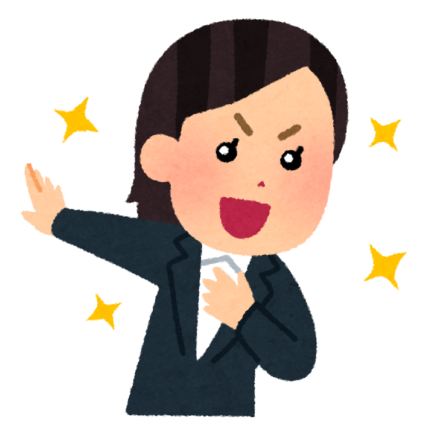
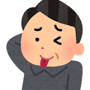
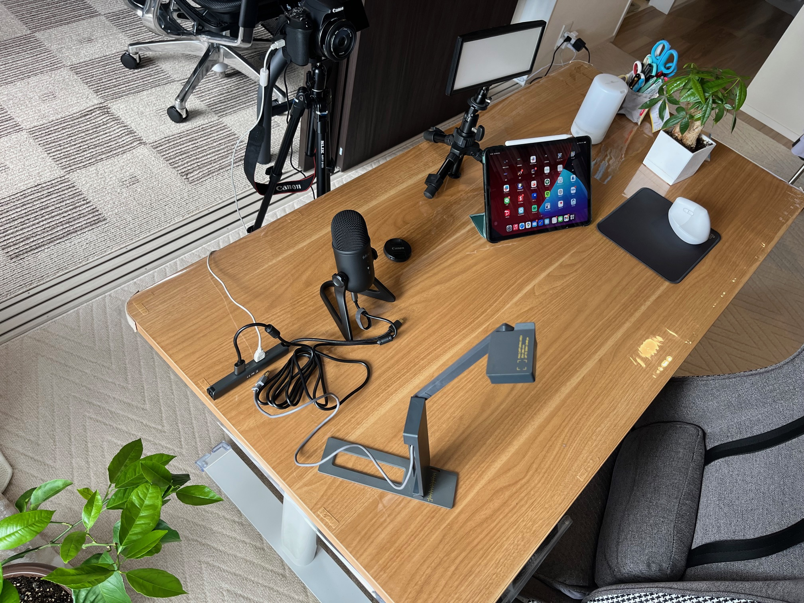

<!-- _class: cover-hero -->

大学などで教える

自己紹介ワーク

<b>達成目標：</b> 動画撮影の方法を知ろう。 自己紹介に慣れよう。

<!--
- まずは、タイトルコール。動画撮影の方法を知って、自己紹介に慣れよう、が今回の達成目標。
-->

---

自己紹介ワーク

# ワークの内容

1.<b>1</b><b>分で</b>自己紹介しよう！

2.<b>必須項目</b>を入れよう。

　名前、専攻、学年 　専門は何？ 　受講動機は何？

3.<b>ゆっくり、分かりやすい言葉</b>で。 

注意：他の受講生も見ます。

<!--
- 民間にいた時のエピソード。1分で、必須項目（名前・専攻・学年・専門・受講動機）を入れて、ゆっくり分かりやすく。他の受講生も見るので注意。
-->

---

自己紹介ワーク

# 自己紹介はつきもの

場面

① 授業で？

② 学会で？

③ ミーティングで？

④ 飲み会で？

⑤ 採用面接で？

<b>…一生ついて来るので、鉄板ネタ</b>を用意しましょう　　”フック”🪝も大切に

<b>参考</b>：Elevator pitch /YouTube ショート

<!--
- 深部の研究のエピソード。自己紹介はあらゆる場面でつきもの。一生ついて来るので、鉄板ネタとフックを用意しよう。
-->

---

自己紹介ワーク

# 動画・音声の収録方法

<b>注意</b>：動画・音声とも事情により難しい場合は 　　　文章(1分で音読できる量)も可

※自分を写すか否か、スライドを掲示するかは自由

1.<b>Zoom</b>で撮影

2.<b>PowerPoint</b>で撮影

<!--
- 動画・音声が難しければ文章でも可。自分を写すかスライド掲示かは自由。撮影方法はZoomかPowerPointの2通り。
-->

---

自己紹介ワーク

# 動画・音声の収録方法

↑レモン🍋

機材

田川の環境 2024：

iPad (配信側の確認用)

高感度マイク(好感度)

一眼レフ（趣味）

三脚 (上から写そう)

ライト (暗いと怖い)

書画カメラ(紙派)

OBS (軽い)

<!--
- 田川の2024年の収録環境。iPad・高感度マイク・一眼レフ・三脚・ライト・書画カメラ・OBS。机がレモン色。
-->
