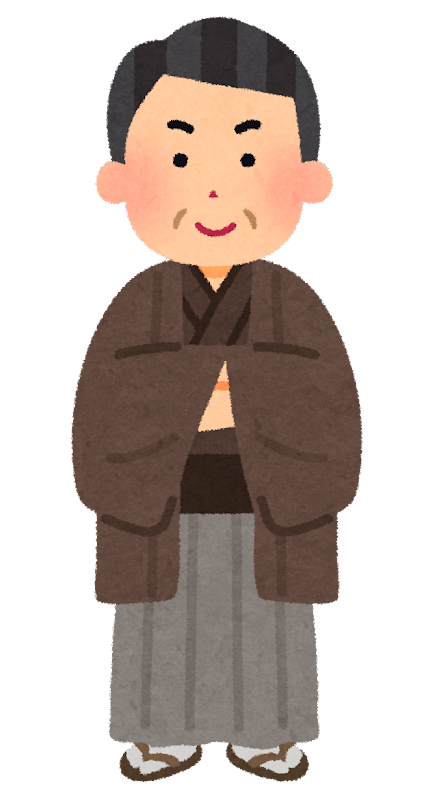
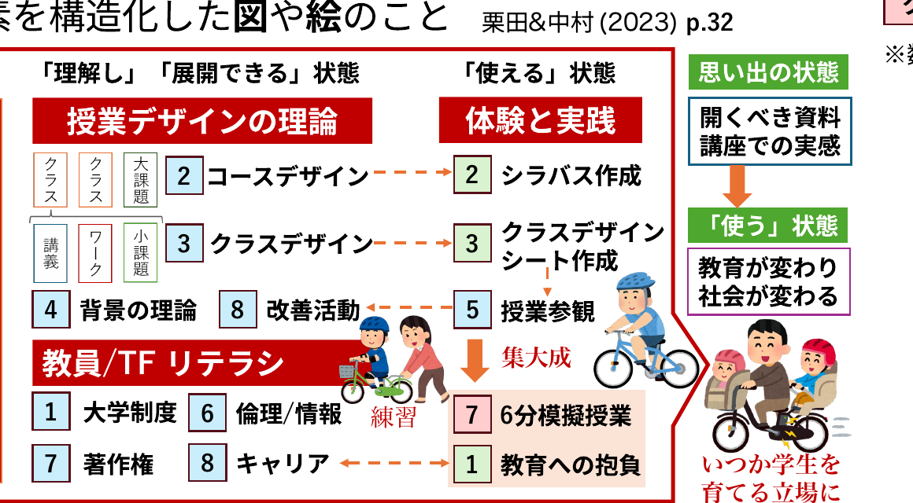

<!-- _class: cover-hero -->

大学などで教える

コース構成のtips

<b>達成目標：</b>授業構成のtipsを理解し応用できる。

<!--
- タイトルコール。授業構成のtipsを理解し応用できるようになる、が今回の達成目標。
-->

---

授業構成のtips

# クラスをどう並べるか？

各内容の比重は？

順番は？

教科書と同じで良いのでは？

<!--
- 授業担当になると「クラスをどう並べるか？」で悩む。各内容の比重・順番・教科書との関係。この回でtipsを示す。
-->

---

授業構成のtips

# 原則

① 必修の学習内容・評価は <b>絞り込む</b>

② 自分と学習者は <b>違うこと</b> 認識する

③ <b>構造化</b> し項目の関係性を考える

<!--
- 授業構成の3原則：①絞り込む ②自分と学習者は違う ③構造化して関係性を考える。
-->

---

授業構成のtips

# 原則

授業の雛形に一致させるだけではなく、 <b>原則に基づいた、一歩前進なクラス配置</b>を

①

必修の学習内容・評価は<b>絞り込む</b>　Tip 1 最近接発達領域・足場かけ/足場外し

②

自分と学習者は<b>違うこと</b>認識する　Tip 2 専門家の盲点 / Tip 3 学習者を知ること

③

<b>構造化</b>し項目の関係性を考える　Tip 4 効果的な学習順序 / Tip 5 グラフィック・シラバス

<!--
- 3原則それぞれに対応するTip 1〜5を示す。雛形に合わせるだけでなく、原則に基づき一歩前進したクラス配置を。
-->

---

授業構成のtips

# Tip 1最近接発達領域

<b>受講前は自力でできないが、受けたら自力で出来るようになる</b>

<svg viewBox="0 0 430 270" width="430" xmlns="http://www.w3.org/2000/svg">
<ellipse cx="215" cy="135" rx="210" ry="130" fill="#EFEFEF" stroke="#888" stroke-width="2"/>
<text x="215" y="34" text-anchor="middle" font-size="20" fill="#333">援助や協同があっても<tspan font-weight="700">出来ない</tspan></text>
<ellipse cx="215" cy="150" rx="170" ry="100" fill="#F5B800" stroke="#C99400" stroke-width="2"/>
<text x="215" y="80" text-anchor="middle" font-size="20" fill="#222">援助や協同が<tspan font-weight="700">あれば出来る</tspan></text>
<ellipse cx="215" cy="165" rx="105" ry="62" fill="#D7EFC4" stroke="#7FB36B" stroke-width="2"/>
<text x="215" y="160" text-anchor="middle" font-size="22" font-weight="700" fill="#222">自力で</text>
<text x="215" y="186" text-anchor="middle" font-size="22" font-weight="700" fill="#222">出来る</text>
<text x="215" y="234" text-anchor="middle" font-size="20" font-weight="800" fill="#C0182B">最近接発達領域</text>
</svg>

Vygotsky (1978)

伝えたいことは沢山あるかもですが、多すぎては身になりません

<b>最近接発達領域</b>に<b>内容を絞り</b>ましょう

個人差がある場合は、<b>参考資料・補完教材</b>を使用しましょう

<b>足場かけ (Scaffolding)：</b>他者の援助や協同で出来る状態にする （最近接発達領域を広げたり、身につけたりする内容）　／　<b>足場外し (Fading)：</b>他者の援助や協同を徐々に減らし独り立ち （自力出来るようになる内容）

<!--
- Tip 1：最近接発達領域。自力／援助があれば／援助でも無理、の3層。受講前は自力で無理でも、受けたら自力でできるように。足場かけと足場外しで設計する。
-->

---

授業構成のtips

# Tip 2専門家の盲点

 

今のあなた：熟達者

無意識にできる

 

昔のあなた・学生：見習い

できること わかりにくいこと 面白いこと <b>すべて異なる</b>

<b>専門家の盲点</b>：専門家は、無意識にできてしまうために<b>学習者が何がわからないか分からない</b>

教師は<b>学習内容をわかっていても、学習者を理解できないこと</b>を前提とし、<b>学習者の意見・反応を意識的に盛り込む</b>のが望ましい

アンブローズ (2014)

<!--
- Tip 2：専門家の盲点。熟達者は無意識にできるため、学習者が何でつまずくか分からない。学習者の意見・反応を意識的に盛り込む。
-->

---

授業構成のtips

# Tip 3学習者を知る

✘ 教師に合わせる○ 学習者に合わせる

授業中・後の質問、オフィスアワーの雑談、ミニッツ・ペーパーの記載、授業前後アンケートの結果

インタラクションは 学習者を知るチャンス

<b>教室もダイバーシティ＆インクルーシブ</b>

支援が必要な学生さんはいないか <b>(色覚→赤注意、その他)</b>　<b>例：</b>”色のシミュレータ” アプリ on iPhone/Android 
分かりやすい説明と思考は人により異なる <b>(認知特性・背景)</b>　<b>例 会社時代のストーリー：</b> 自分の話は、ビジョンや絵で思考する人には伝わるけど、文字思考の人には伝わりにくい

<!--
- Tip 3：学習者を知る。教師ではなく学習者に合わせる。インタラクションは学習者を知るチャンス。教室の多様性・インクルーシブにも配慮（色覚・認知特性）。
-->

---

授業構成のtips

# Tip 4効果的な学習順序

情報提示の雛形

既知→未知

簡単→複雑

結論→理由

個別→一般

具体→抽象

過去→現在→未来

<b>全体→要素→再構築</b>

<b>原則→個別</b>

概論→例示→体験

<b>Why→How→What</b>

空(事実)→雨(解釈)→傘(行動)

抽象→比喩

問題意識→一次情報(体験)→理論→体系

<b>理論→応用→理論</b> 参照

<b>正解はないが、よく使われる雛形はある</b>

栗田 (2017) p.76 / 安宅 (2010) Nilson (2007) Sinek (2010)他  <b style="color:var(--accent-dark);">参考：</b>ストーリーテーリングの重要性

<!--
- Tip 4：効果的な学習順序。情報提示の雛形は既知→未知、簡単→複雑、Why→How→Whatなど多数。正解はないが、よく使われる雛形がある。
-->

---

授業構成のtips

授業構成のtips

# Tip 5グラフィックシラバス

授業の重要な概念感の系統性や関係性を図示し、要素を構造化した<b>図</b>や<b>絵</b>のこと　栗田&中村 (2023) <b>p.32</b>

凡例 ※数字はクラス番号

クラス主要活動

クラス事後課題

クラス最終成果物

<!--
- Tip 5：グラフィックシラバス。重要概念の系統性・関係性を図示し構造化した図・絵。養成講座の全体像を一枚の図で示した例。
-->

---

授業構成のtips

# 原則を意識したコース作成

①

必修の学習内容・評価は<b>絞り込む</b>　Tip 1 最近接発達領域・足場かけ/足場外し

②

自分と学習者は<b>違うこと</b>認識する　Tip 2 専門家の盲点 / Tip 3 学習者を知ること

③

<b>構造化</b>し項目の関係性を考える　Tip 4 効果的な学習順序 / Tip 5 グラフィック・シラバス

最後に：時間的なゆとりや雑談、ふんわりとした進行も重要です。

そこから安心感や気づきや、興味・関心が生まれます。ガチガチに誤りなくかっこよく作り込む必要はありません。

<!--
- まとめ。3原則とTip 1〜5を意識したコース作成を。最後に、時間的ゆとり・雑談・ふんわりした進行も大切。完璧に作り込む必要はない。
-->
