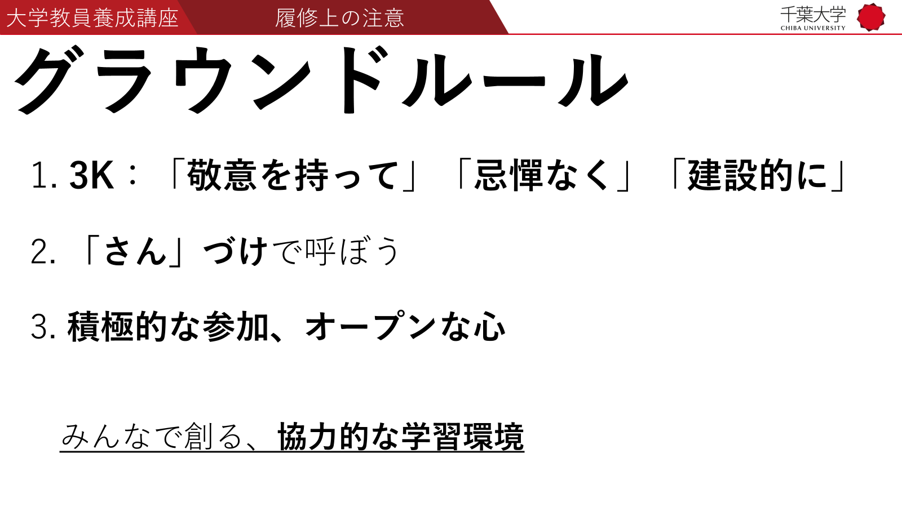
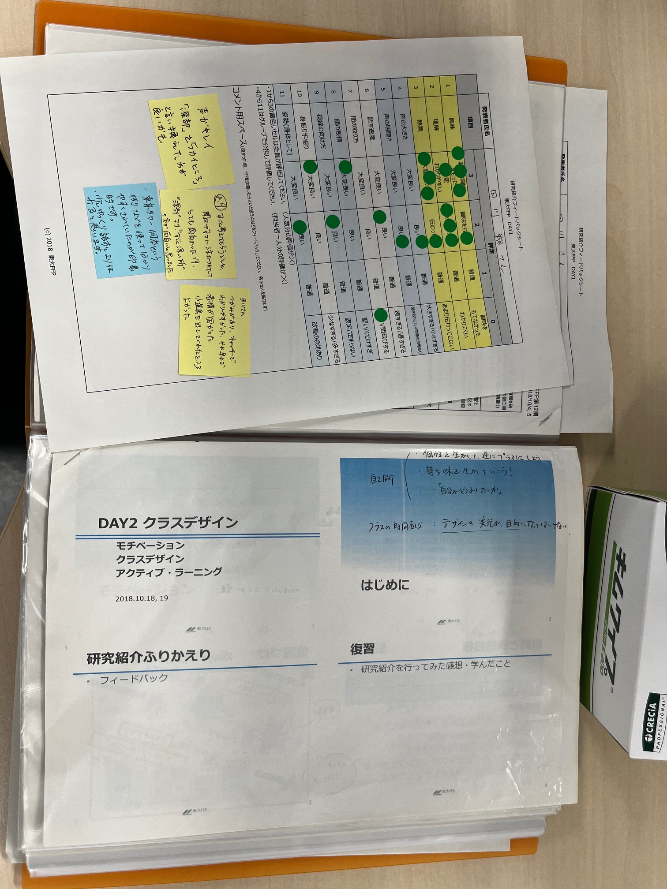

<!-- _class: cover-hero -->

大学などで教える

履修上の注意

<b>達成目標：</b>履修する上での注意点を理解する。

<!-- まずは、タイトルコール。 -->

---

履修上の注意

# グラウンドルール

1.&nbsp;<b>3K</b>：「<b>敬意を持って</b>」「<b>忌憚なく</b>」「<b>建設的に</b>」

2.&nbsp;<b>「さん」づけ</b>で呼ぼう

3.&nbsp;<b>積極的な参加、オープンな心</b>

みんなで創る、<b>協力的な学習環境</b>

<!-- フィードバックなどあります。
そのときに、この三点を忘れずに頑張りましょう！ -->

---

履修上の注意

# 諸注意

1.&nbsp;<b>シラバスの成績評価方法</b>は熟読

課題の締切は守って下さい / 23:59 JSTまで

2.&nbsp;質問は遠慮なく<b>アナウンス</b>か<b>メール</b>で

3.&nbsp;<b>スライドと作成物</b>は全部保存

<b>いつか役立つから、単位を取ろう</b>

<!-- フィードバックなどあります。
そのときに、この三点を忘れずに頑張りましょう！ -->

---

履修上の注意

# ちょっとしたヒント

<b>1.</b> スライドにコメントで書き込む (PDFでも手書きでも)

これは使える！

<b>2.</b> 公募に応募する際や授業作成時に、見返そう

<!-- フィードバックなどあります。
そのときに、この三点を忘れずに頑張りましょう！ -->

---

履修上の注意

# オンデマンドの注意

1.&nbsp;困ったらすぐに聞こう / 大きく反応しよう

2.&nbsp;動画は、倍速再生、一時停止、複数視聴など自由

3.&nbsp;締切さえ守れば、いつ進めてもOK

<!-- フィードバックなどあります。
そのときに、この三点を忘れずに頑張りましょう！ -->
