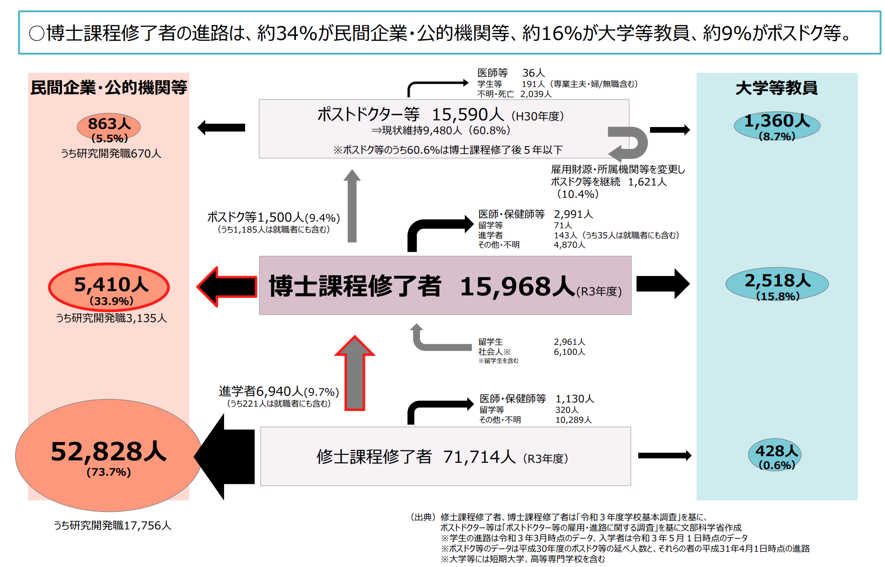
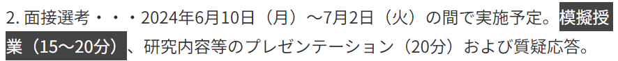
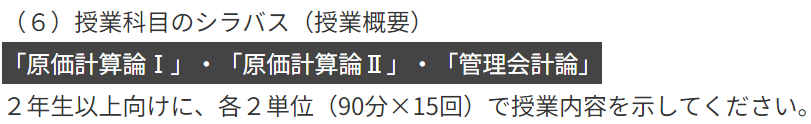
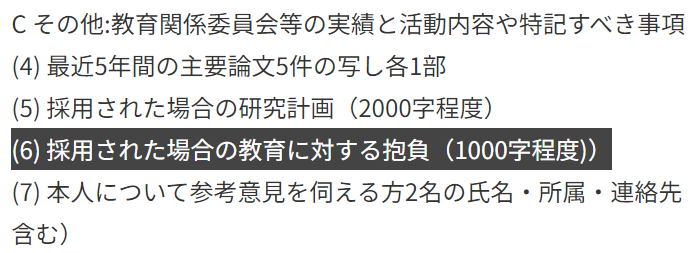

<!-- _class: cover-hero -->

大学などで教える

PreFDの価値

<b>達成目標：</b>PreFDを受講する意義を説明出来る。

<!--
- まずは、タイトルコール。
-->

---

PreFDの価値

# PreFD(プレFD)とは

学識を教授するために必要な能力を培うための機会

<b>大学院設置基準 第四十二条</b> 大学院は、博士課程の学生が修了後自らが有する学識を教授するために必要な能力を培うための機会を設けること又は当該機会に関する情報の提供を行うことに努めるものとする

大学教員準備プログラム

<b>実施校は10%満たない</b>

※Pre FDは和製英語。英語では、Preparing Future Faculty （PFF）。　(栗田, <i>教育心理学年報</i>, 2020)

<!--
- 学識を教授するために必要な能力を培うための機会。実施校はまだ10%に満たない。
-->

---

PreFDの価値

# PreFD(プレFD)とは

学識を教授するために必要な能力を培うための機会

<b>大学院設置基準 第四十二条</b>　大学院は、博士課程の学生が修了後自らが有する学識を教授するために必要な能力を培うための機会を設けること又は当該機会に関する情報の提供を行うことに努めるものとする

※Pre FDは和製英語。英語では、Preparing Future Faculty （PFF）。

２つの機会大学教員準備プログラムTF(ティーチングフェロー)制度

<b>達成価値</b>：授業を準備し実施するための一通りを体験

<b>内発的価値</b>：タスクや仕事が楽しい / 色々な人と学べて満足

<b>道具的価値</b>：実際の授業で役立つ / 採用に役立つ

どうして採用にも関わるのか？

<!--
- 達成・内発的・道具的の3価値。とくに道具的価値は採用にも役立つ。どうして採用にも関わるのか？
-->

---

PreFDの価値

# 昨今の状況

<b>大学教員は狭き門？</b>

博士後期課程修了者の進路について / 文部科学省 R5年1月参照 https://www8.cao.go.jp/cstp/tyousakai/hyouka/haihu144/144_honpen3.pdf

<!--
- 博士課程修了者の進路。約34%が民間企業・公的機関、約16%が大学等教員、約9%がポスドク等。
-->

---

PreFDの価値

# 昨今の状況

やっぱり結構難しい

<b>PD</b>1.5万人

<b>新卒/民間</b>1.5万人

3万人

何が合否を分けるのか？

①専門分野での研究業績 <b style="color:var(--accent-dark);">②将来の展望</b> <b style="color:var(--accent);">③教育力</b>

ざっくり

5倍

<b>助教相当 新規採用数</b> 6000ポスト (2019年)

※大学間移動1000ポスト　(文部科学省 学校教員統計調査)

※分野によって、値が異なることに注意。 　統計上、大雑把な専門分野別に分かれているので、倍率は概算可能。

<!--
- 採用枠は助教相当で約6000ポスト、応募はざっくり3万人で約5倍。合否を分けるのは研究業績・将来の展望・教育力。
-->

---

PreFDの価値

# 公募で聞かれる教育力

<b>助教相当公募数</b>　6,751ポスト (2022)

教授・准教授・講師・助教公募数　<b style="color:var(--accent-dark);">1,822</b> (2024.3.18現在)

<table style="width:100%; border-collapse:collapse; font-size:22px;">
<tr>
<td style="padding:8px 10px; width:38%;"><b>模擬授業含む</b> △2017.4.13の13%から増加</td>
<td style="padding:8px 10px; width:22%; text-align:center;">414 (23%)</td>
<td style="padding:8px 10px;">早稲田大 </td>
</tr>
<tr>
<td style="padding:8px 10px;"><b>シラバス含む</b> △2017.4.13の5%から増加</td>
<td style="padding:8px 10px; text-align:center;">127 (7%)</td>
<td style="padding:8px 10px;">千葉大 </td>
</tr>
<tr>
<td style="padding:8px 10px;"><b>教育に対する抱負含む</b></td>
<td style="padding:8px 10px; text-align:center;">186 (10%)</td>
<td style="padding:8px 10px;">北大 </td>
</tr>
</table>

多くの公募で教育力を重視

<!--
- 公募では教育力が問われる。模擬授業・シラバス・抱負を含む公募が年々増加。多くの公募で教育力を重視。
-->

---

まとめ

# まとめ

1. PreFDの価値づけの例

達成価値：<b>一通りを体験</b>　　内発的価値：<b>楽しい</b> 
道具的価値： <b>実際の授業で役立つ</b>/<b style="color:var(--accent);">採用に役立つ</b>

2. 大学教員の公募は、近年<b style="color:var(--accent);">教育力重視</b>

3. 実際に、<b>課題で模擬演習</b>しよう

<b>参考文献</b>：栗田 (2020) <i>教育心理学年報</i>

<!--
- まとめ。①価値づけの例、②近年は教育力重視、③課題で模擬演習しよう。
-->
