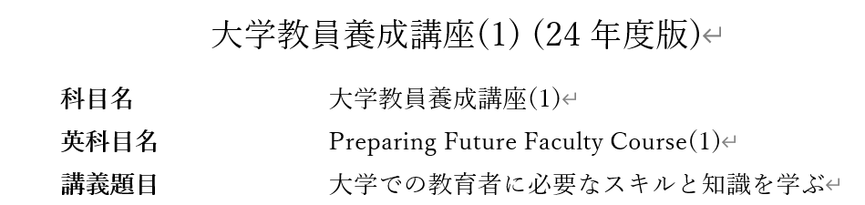

<!-- _class: cover-hero -->

大学などで教える

シラバス

<b>達成目標：</b>シラバスが学習者と教員双方へどう役立つか説明出来る。

<!--
- まずは、タイトルコール。シラバスが学習者と教員の双方にどう役立つかを説明できる、が今回の達成目標。
-->

---

<!-- _class: cover-hero -->

大学などで教える

シラバス

<b>達成目標：</b>シラバスが学習者と教員双方へどう役立つか説明出来る。

シラバス、学生or教員として 使ったことありますか？

<!--
- 導入の問いかけ。シラバスを学生として、あるいは教員として使ったことがありますか？
-->

---

シラバス

# シラバスとは何か

<b>各授業科目の詳細な授業計画。</b>

－大学の授業名、 
－担当教員名、 
－講義目的、 
－各回ごとの授業内容、 
－成績評価方法・基準、 
－準備学修等についての具体的な指示、 
－教科書・参考文献、履修条件等

が記されており、<b>学生が各授業科目の準備学修等を進めるための基本となるもの。</b>

中教審, 質的転換答申 (2012)の用語集より

<!--
- シラバスの定義。各授業科目の詳細な授業計画で、授業名・担当教員・目的・各回の内容・評価・準備学修・教科書などが記され、学生が準備学修を進める基本となるもの。
-->

---

シラバス

# シラバスの根拠

大学設置基準 （成績評価基準等の明示等）

第二十五条の二　大学は、学生に対して、授業の方法及び内容並びに一年間の授業の計画をあらかじめ明示するものとする。

２　大学は、学修の成果に係る評価及び卒業の認定に当たつては、客観性及び厳格性を確保するため、学生に対してその基準をあらかじめ明示するとともに、当該基準にしたがつて適切に行うものとする。

教学マネジメント指針（中教審 / 2020）

学生と教員の共通理解の基盤及び成績評価の基点として シラバスの重要性を強調

<!--
- シラバスの法的・政策的根拠。大学設置基準第25条の2で計画と評価基準の事前明示が求められ、2020年の教学マネジメント指針でも共通理解と成績評価の基点として重要性が強調されている。
-->

---

シラバス

# 2種類のシラバス

① <b>授業要覧</b>から発展したもの

シラバスの必須要素が 端的にまとまっている

② <b>より詳細</b>なもの

　事務連絡、契約書、学習のガイド等の要素も含み、 　<b style="color:var(--accent-dark);">学生の学修を促すツール</b>

<b>ねらい・目的/目標・課題・</b> <b>予習・参考文献</b>等、行間も分かる

①を公開しつつ、②を履修者に配る授業も増加 (中島, 2016)

<!--
- シラバスには2種類。①授業要覧から発展した必須要素中心のもの（千葉大シラバス検索システム）と、②事務連絡・契約書・学習ガイドの要素も含む、学修を促す詳細なもの。①を公開しつつ②を配る授業も増加。
-->

---

シラバス

# シラバスは誰のため？

<b>シラバスを作ることで授業をデザインする</b>

学生

－<b>コースデザイン</b>に役立つ目標に応じたデザイン 
－<b>カリキュラムの整合性</b>の確認　DP、CP、AP 
－<b>教育力を示す資料</b>として

－<b>学修を促すツール</b>として

両者にとって…　－<b>約束事</b>(評価/態度等)として

教員

シラバス作成は、学習者・教員の双方に役立つ

<!--
- シラバスは誰のため？ 作ることで授業をデザインできる。教員にはコースデザイン・カリキュラム整合性・教育力の証明、学生には学修を促すツール、両者には約束事として役立つ。シラバス作成は双方に役立つ。
-->

---

シラバス

# シラバス作成課題

実際に作成するときも 同じ流れがgood!

① <b>雛形をダウンロード</b>する。 　　A. <b>千葉大シラバス</b> 　　B. <b>詳細シラバスを一旦作成後</b>、千葉大シラバスに内容を<b>精選</b>する。

② <b>逆向き設計</b>で埋める。分析設計 　本学・他大学の類似講義を参考にするのも可。 　<b>目標・目的の記載、評価方法</b>については、この講義で順を追い、説明する。

③ 完成させたら、<b>学生が主体的に学べる</b>か、<b>量的無理がないか、記載の妥当性</b>等を<b>チェックリスト</b>で確認。

<!--
- シラバス作成課題の手順。①雛形をDL（千葉大シラバス、または詳細を作ってから精選）。②逆向き設計で埋める（分析→設計）。③完成後はチェックリストで妥当性を確認。実際に作るときも同じ流れがgood。
-->

---

まとめ

# まとめ

1. <b>シラバス</b>は、各授業科目の詳細な授業計画に加え、 学生の学修を促すツール

2. シラバスが役立つのは、<b>学生・教員双方</b> コースデザインや整合性の確認にもなる

3. シラバスの作り方には… <b style="color:var(--accent);">型がある</b>ので、課題で身につけよう

<b>参考文献</b>： ①中島英博 編著 (2016) 『<i>授業設計</i>』 玉川大学出版部 ②栗田佳代子・中村長史 編著 (2023) <i>インタラクティブ・ティーチング 実践編2</i>

<!--
- まとめ。①シラバスは詳細な授業計画に加え学修を促すツール。②役立つのは学生・教員双方で、コースデザインや整合性確認にもなる。③作り方には型があるので課題で身につけよう。
-->
