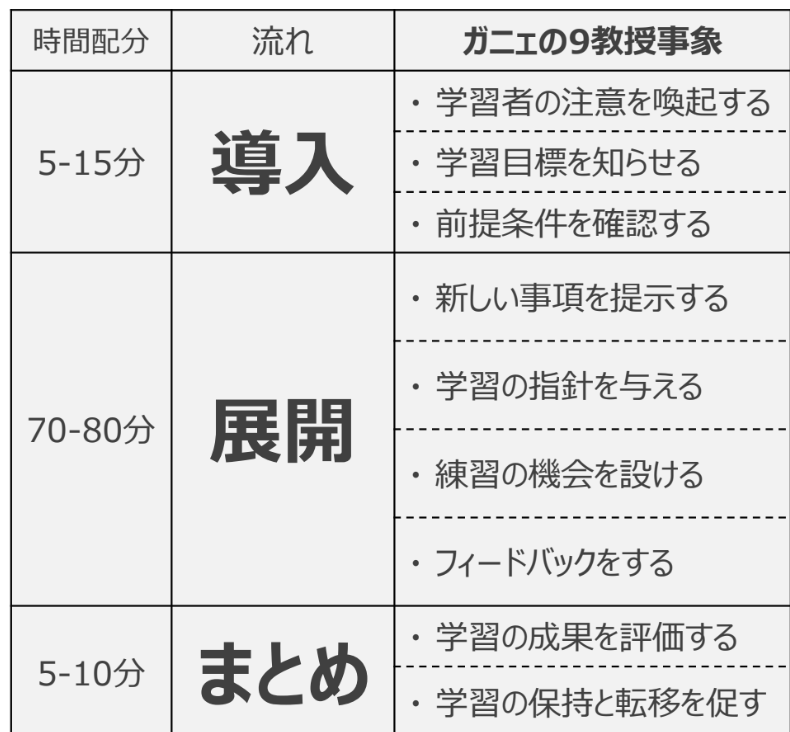
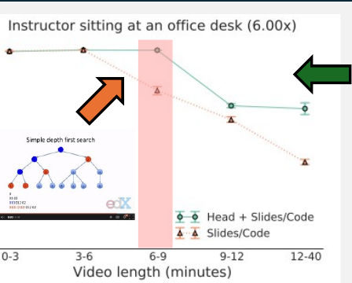

<!-- _class: cover-hero -->

大学などで教える

学習者主体のクラス設計

<b>達成目標：</b>クラス設計の指針を理解する。

<!-- まずは、タイトルコール。 -->

---

学習者主体のクラス設計

# クラス設計とは設計

<b>一回分の授業を「要素」</b>を組み合わせ、 <b>目標が達成出来るようにデザインする</b>こと

①逆向き設計を使用する

② 2つの便利な方針を知っておく

③<b style="color:var(--accent-dark)">インストラクショナル・デザイン</b>の要素を 適切に組み合わせ使用する

<!-- クラス設計とは、一回分の授業を要素の組み合わせでデザインすること。3つの指針で進める。 -->

---

学習者主体のクラス設計

# クラス設計とは設計

①逆向き設計を使用する

「コースにおける」クラスの目標を認識する

✔<b>クラスの次元での目標</b>をきちんと定義し説明しましょう

▶この授業だと、各回のイントロ動画で

✔<b>要素の目標</b>をきちんと定義しましょう

▶課題の目標は、詳細シラバスで

▶動画の目標は、動画のタイトルページで

✔あとはコースデザインの時と同じです

<!-- ①逆向き設計。クラスの次元・要素それぞれの目標を定義し説明する。あとはコースデザインと同じ。 -->

---

学習者主体のクラス設計

# クラス設計とは設計参照

② 2つの便利な方針を知っておく

ガニエの9教授事象 (ガニエ他 2004)

<b>認知プロセス</b>に沿った教え方

関心をもち、価値を知り、 説明を受け、体験の機会を得て、 記憶に残り、使える知識になる

<b>授業の時間</b>を<b>どうデザインするか</b>

それぞれの流れに於いて、<b>何をするべきか</b>

<!-- ガニエ：インストラクショナル・デザインの大家。9教授事象は認知プロセスに沿った教え方。 -->

---

学習者主体のクラス設計

# クラス設計とは設計

② 2つの便利な方針を知っておく

90-20-8の法則 (ロバート・パイク, 2008)

• 理解しながら聞けるのは<b>90分</b>まで 
• 記憶に残しながら聞けるのは<b>20分</b>まで 
• <b>8分ごと</b>に参画させる

<b>→内容を20分毎にわける</b>

学生の集中度合い

<b>大規模オンラインコースの分析</b>　(Guo et al, 2014)

6 ~ 9分を超えると集中力低下

<!-- 90-20-8の法則。集中が続くのは短い。Guo et al の分析でも6〜9分超で集中低下。内容を20分毎にわける。 -->

---

学習者主体のクラス設計

# クラス設計とは設計参照

③ 様々なインストラクションの要素を適切に組みわせる

予習映像

事前知識を共通化し、質問もしやすくなる

事前問題

事前に価値付けされ、授業にも関心をもつ

講義説明

学習項目を短時間で伝達し、理解に役立つ

演習問題

学習項目を体験し理解度も確かめられる

雑談

協力的な学習環境形成や集中の回復に

ゆとり

臨機応変な授業運営で学習者の興味に応える

課題

▶コースデザイン参照

ワーク

<b>学習者が主体的に学ぶチャンスが増える</b>

<!-- 授業を構成する様々な要素を、目的に応じて適切に組み合わせる。 -->

---

学習者主体のクラス設計

# アクティブラーニング

ワーク課題学習者が<b style="color:var(--accent-dark)">主体的に</b>学びやすい要素

双方向性・主体性のある学びを実現する方法論

教員と学生が意思疎通を図りつつ、<b>一緒になって</b>切磋琢磨し、相互に刺激を与えながら知的に成長する場を創り、<b>学生が主体的に問題を発見し、解を見出していく能動的学修 </b>(文科省 2012)

<b>▶手法：沢山ある (いくつかを次以降、体験)</b>

<b>▶実装方法：教員がする or </b><b>ティーチングフェローが双方向性を創る</b>

授業の目的上、適切ならば<b>積極的に利用</b>する <b>学習者が聴くだけの授業は終わりにしよう</b>

<!-- ミニッツペーパー、自己評価、Think-Pair-Share、ピアレビュー、ブレインストーミング、ジグソー法、ケーススタディ、課題解決型学習(PBL)、チーム基盤型学習(TBL)、ピアインストラクション、ポスターツアー...... -->

---

学習者主体のクラス設計

# アクティブラーニングの有効性

学部初歩の物理授業のテスト成績の分布図

学生の人数(人)

得点

(Deslauriers et al. Science, 2011)

■ 経験豊富な講師の講義　<b>N = 267</b>

■ 経験は少ない講師の双方向な授業　<b>N = 271</b>

<b>適切な講習を受け、双方向性・主体性のある学習</b>を取り入れると、 <b>若い教員も良い授業ができる!</b>

<b>注意：</b>アクティブラーニングすること自体が授業の目的ではない <b>(効果がない事例も多数)</b>

<!-- Deslauriersらの研究：双方向授業を取り入れると若い教員でも成績が上がる。ただしAL自体が目的ではない。 -->
