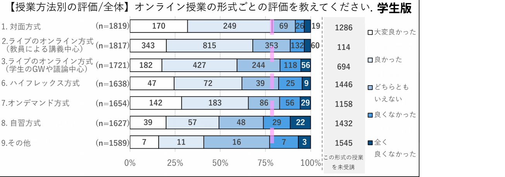
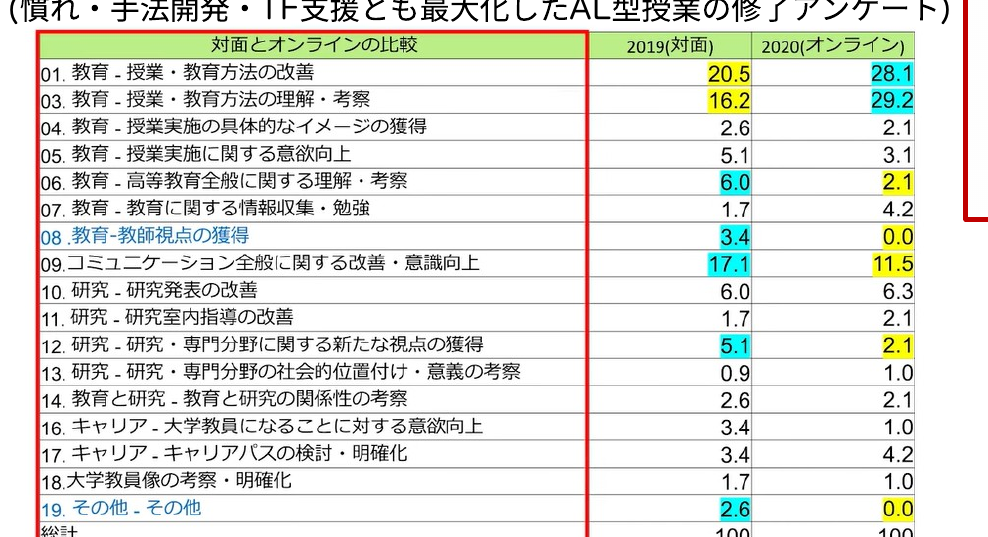
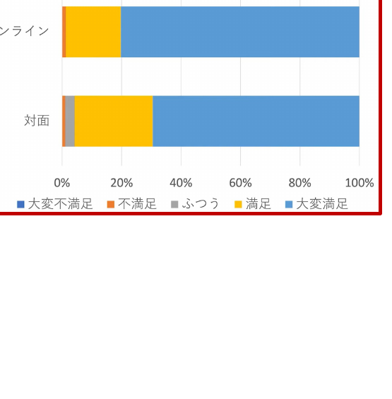

<!-- _class: cover-hero -->

大学などで教える

オンラインで出来ること

<b>達成目標：</b> メディア授業の利点・欠点を指摘できる。

<!--
- まずは、タイトルコール。メディア授業（オンライン授業）の利点・欠点を指摘できる、が今回の達成目標。
-->

---

オンライン授業で出来ること

# メディア授業の種類参照

オンデマンド型

この授業 (他MOOC等が例)。映像が構造的に並び学習者が履修。情報の効率的な伝達に効果的で、資格試験関係に便利だが、遊びがないため疲れ易く、エンゲージメントが難しい

同時双方向型

Zoom等で学生の反応を見て実施。通常のクラスをオンライン化。アクティブ・ラーニング手法も取り入れ易いが、ツール・準備を要するため、教員が大変。ただ話すだけだと飽きられ易い

ハイフレックス型

オンライン・対面の両方で履修可。準備が大変で(教室の)設備も必要

反転授業型 (後述)

オンデマンド教材を履修後、教室で演習やワークを実施

ブレンド型

対面や上記の形式を授業の目的に合わせて選択し実施

自習型

映像や音声は使わず、課題やレポート等の課題のみで実施

<!--
- メディア授業には大きく6つの型がある：オンデマンド／同時双方向／ハイフレックス／反転授業／ブレンド／自習。後ほど反転授業を詳しく扱う。
-->

---

オンライン授業で出来ること

# メディア授業の建付けと制限

① 大学設置基準内にメディア授業を規定 ▶大学設置基準第二十五条第二項

② <b>「面接(=対面)授業に相当する教育効果を有する」</b> - オンデマンド型の場合には <b>事後の指導</b>と<b>意見交換(質問)の機会確保</b>が必須 ▶平成13年文科省告示第51条

<b>③ 学部は卒業単位数に含められる上限がある</b> <b>- メディア授業科目(</b>授業回数のうち半数を超える回数をメディア授業で実施する授業)は<b>60単位まで</b> <b>※</b>大学院は<b>上限はない</b> (短大/通信制大学は別規定)

大学における多様なメディアを高度に利用した授業について (文部科学省資料)　https://www.mext.go.jp/b_menu/shingi/chukyo/chukyo4/043/siryo/__icsFiles/afieldfile/2018/09/10/1409011_6.pdf

<!--
- メディア授業は大学設置基準に位置づけられ、対面相当の教育効果（オンデマンドは事後指導と意見交換の機会確保が必須）が求められる。学部は卒業単位に含められる上限が60単位。
-->

---

オンライン授業で出来ること

# メディア授業の評価

<b>対面</b>>ライブ講義~オンデマンド><b>オンラインアクティブラーニング</b>

教員側のFD<b>(慣れ・手法開発・TF支援)</b>の問題

東京大学 オンライン授業・Web会議ポータルサイト　https://utelecon.adm.u-tokyo.ac.jp/questionnaire/student_2020A/

<!--
- 学生版の評価アンケート。おおむね 対面 ＞ ライブ講義～オンデマンド ＞ オンラインAL の順。背景には教員側のFD（慣れ・手法開発・TF支援）の問題がある。
-->

---

オンライン授業で出来ること

# メディア授業の評価

<b>東大の大学などで教える</b>での結果 (慣れ・手法開発・TF支援とも最大化したAL型授業の修了アンケート)

<b style="color:var(--tag-blue);">青い数字</b>：一方が<b>3ポイント以上良い項目</b>　©東大FFP/栗田/2022

修了率の変化はない <b>満足度はオンラインの方が高い？</b>

<!--
- 東大FFPのAL型授業（慣れ・手法開発・TF支援とも最大化）の修了アンケート結果。修了率は変わらず、満足度はむしろオンラインの方が高いという結果も。
-->

---

オンライン授業で出来ること

# メディア授業の強み・弱み・配慮点

強み

①<b>設定した目標への到達</b>は得意

②<b>情報を効率的に提示し理解</b>に至りやすい

③<b>時間・場所的な融通</b>が効く

弱み

①<b>意図しない学びの発生</b>が難しい

②ジェネリックスキル形成に繋がり難い

③疲れやすい/集中しにくい

要配慮

①学生/教師-学生間の<b style="color:#E08A2B;">コミュニケーション</b>

②学生側の視聴環境に差がある

<!--
- 強み：目標到達・効率的な理解・時間や場所の融通。弱み：意図しない学びが起きにくい・ジェネリックスキルが育ちにくい・疲れやすい。要配慮：コミュニケーションと視聴環境の差。
-->

---

オンライン授業で出来ること

# 反転授業

事前に基礎知識に関する(メディア)学習をして, <b>授業では議論・演習を行うブレンド型</b>の一つ

▶医学部等でも<b>実践論文</b>あり / Stanfordの取組が有名

高度化型

<ul style="list-style:none; margin-left:0; padding-left:0;">
<li>- <b>「理解」</b>をオンデマンド</li>
<li>- <b>高次目標</b>を演習や実験で</li>
</ul>

完全習得型

<ul style="list-style:none; margin-left:0; padding-left:0;">
<li>- <b>「理解」</b>をオンデマンド</li>
<li>- <b>理解の確認や質問</b>を教室で</li>
</ul>

✔アクティブラーニングを取り入れ教育効果を高めやすい ✔教員は多様な学生に対応しやすく、効率化もしやすい ✔学生は疑問点や関心をもって授業に取り組める

<!--
- 反転授業＝事前にメディアで基礎知識を学び、教室では議論・演習を行うブレンド型。高度化型（高次目標を演習で）と完全習得型（理解の確認・質問を教室で）がある。教育効果が高めやすい。
-->

---

オンライン授業で出来ること

# まとめ

① オンライン授業には、<b>対面授業とは異なる強みと弱みがある</b> 特に、意図しない学びの発生は難しくコミュニケーション等の配慮が必要

② <b>オンラインと対面を組み合わせたブレンド型授業 </b>(含む反転授業)に 注目が集まっている

③ 学部はオンライン授業を卒業単位に含める上での<b>上限</b>がある

<!--
- まとめ。①対面とは異なる強み・弱みがある（意図しない学びは難しくコミュニケーションへの配慮が必要）。②ブレンド型（含む反転授業）に注目。③学部は卒業単位算入に上限がある。
-->
