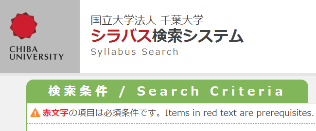

<!-- _class: cover-hero -->

詳細版シラバス

<b>達成目標：</b> 詳細版シラバスの内容を理解しよう。

<!-- まずは、タイトルコール。 -->

---

詳細版シラバス

# 詳細版シラバスとは

学生が各科目の準備学習等を進めるための<b>基本</b>となるもの (中央教育審議会, 2008)

Webにあるシラバス

“授業要覧”

<!-- 授業要覧には、形式や各回の計画など、最低限の事が書いてある / 授業選択には便利 / 詳細版シラバスは、アメリカなどで多い。いろんな側面がある / 実は、配っている授業も出てきている。 -->

---

詳細版シラバス

# 詳細版シラバスとは

学生が各科目の準備学習等を進めるための<b>基本</b>となるもの　(中央教育審議会, 2008)

① Webにあるシラバス　“授業要覧”

② 詳細版シラバス

連絡文章、契約書、 <b>主体的な学習支援</b> etc…

<b>ねらい・目的/目標・課題・</b> <b>予習・参考文献</b>等、行間も分かる

①を公開しつつ、<b>②を履修者に配る</b>授業も増加 (中島, 2016)

<!-- 授業要覧には、形式や各回の計画など、最低限の事が書いてある / 授業選択には便利 / 詳細版シラバスは、アメリカなどで多い。いろんな側面がある / 実は、配っている授業も出てきている。 -->

---

詳細版シラバス

# シラバスは誰のため？

<b>シラバスを作ることで授業をデザインする</b>

学生

<b>コースデザイン</b>に役立つ目標に応じたデザイン

<b>カリキュラムの整合性</b>の確認　DP、CP、AP

<b>教育力を示す資料</b>として

<b>学修を促すツール</b>として

両者にとって…　<b>約束事</b>(評価/態度等)として

教員

<b>シラバス作成は、学習者・教員の双方に役立つ</b>

<!-- シラバス作成は、学習者・教員の双方に役立つ。 -->

---

詳細版シラバス

# 自修の同伴者

<b>1.</b> 詳細シラバスは、学習のガイド

<b>2.</b> 目標・目的は、学習の道しるべ
←最重要

<b>3.</b> 課題/成績評価は、単位取得の鍵

<b>しっかり読み込もう</b>

<!-- 目標・目的が最重要。しっかり読み込もう。 -->
