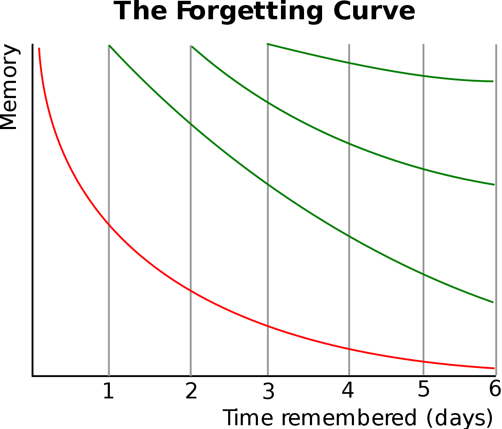

<!-- _class: cover-hero -->

大学などで教える

評価の方法

<b>達成目標：</b>評価の性質という観点から説明できる。

<!--
- タイトルコール。「評価の方法」を、評価の性質という観点から説明できるようになるのが今回の達成目標。
-->

---

評価の方法

# 頻度軸：総括的評価と形成的評価 参照

<table class="assess-tbl" style="width:100%;">
<tr><th></th><th>形成的評価</th><th>総括的評価</th></tr>
<tr><td>目的</td><td>学習途上の改善</td><td>達成された成果の測定</td></tr>
<tr><td>機能</td><td>優れた点，改善点等 フィードバック</td><td>合格水準判定</td></tr>
<tr><td>時期</td><td>学習中</td><td>学習終了後</td></tr>
<tr><td>成績評価</td><td>原則、含めない</td><td>含める</td></tr>
<tr><td>範囲</td><td>狭い/学習内容のみ</td><td>広い/発展課題も含む</td></tr>
</table>

<b>※</b>「どちらか」ではない。 「形成的側面を持った総括的評価」やその逆もあり。 <b>※</b> 一つの授業で両方を組み合わせるのもあり。

主体的な学びには<b>形成的評価の導入も重要</b>

栗田&amp;中村 (2023)  p.18

<!--
- 頻度軸は形成的評価と総括的評価。目的・機能・時期・成績評価・範囲で対比。どちらか一方ではなく組み合わせるのもあり。主体的な学びには形成的評価の導入も重要。
-->

---

評価の方法

# エビングハウスの忘却曲線

↑

復習

↑

復習

形成的評価で忘れない 道を間違わない

忘れにくくなる

忘れた

Ebbinghaus, H. (1885)など　https://commons.wikimedia.org/wiki/File:ForgettingCurve.svg

形成的評価で<b>復習を促す</b>ことも重要

<!--
- 忘却曲線。復習のたびに記憶が戻り、忘れにくくなる。形成的評価で復習を促すことも重要。
-->

---

評価の方法

# 性質軸：目標に応じた評価方法 参照

<table class="assess-tbl" style="width:100%;">
<tr><th></th><th>知識</th><th>技能</th><th>態度</th></tr>
<tr><td>客観試験</td><td class="ok">◯(低次)</td><td></td><td></td></tr>
<tr><td>論述試験</td><td class="ok">◯(高次)</td><td></td><td></td></tr>
<tr><td>レポート</td><td class="ok">◯(高次)</td><td class="ok">◯</td><td class="ok">◯</td></tr>
<tr><td>発表</td><td class="ok">◯(高次)</td><td class="ok">◯</td><td class="ok">◯</td></tr>
<tr><td>口述試験/面接</td><td class="ok">◯</td><td></td><td class="ok">◯</td></tr>
<tr><td>観察評価</td><td class="ok">◯</td><td class="ok">◯</td><td class="ok">◯</td></tr>
<tr><td>実演・制作</td><td></td><td class="ok">◯</td><td class="ok">◯</td></tr>
<tr><td>心理テスト</td><td></td><td></td><td class="ok">◯</td></tr>
</table>

<b>目標にあった評価方法</b>を選ぶ

中島 (2016)  p.36を参考

<!--
- 性質軸。知識・技能・態度という目標に応じて評価方法を選ぶ。客観試験は知識(低次)、レポートや発表は3領域すべてを評価できる。
-->

---

評価の方法

# 性質軸：目標に応じた評価方法

例：柑橘2/3年苗木の栽培方法

<b>目標：</b>苗を植えて2/3年目の柑橘に必要な作業を1人で計画し実施出来る。

<b>①知識&gt;記憶・理解</b>

1年間の必要な作業の一覧を<b>客観試験して記憶・理解を促す</b>(順番並び替え・作業の理由)

<b>②知識&gt;応用・分析</b>と<b>技能&gt;精密化</b>

剪定作業・水やり実習での<b>観察評価</b>

<b>③知識&gt;創造</b>と<b>技能&gt;分節化</b>と<b>態度&gt;価値づけ</b>

作業の効果/効率を上げるためのチーム探究活動における<b>レポートと発表</b>

<!--
- 柑橘栽培を例に、①記憶・理解は客観試験、②応用・分析と技能は観察評価、③創造・態度はレポートと発表、と目標の段階に応じて評価方法を選ぶ。
-->

---

評価の方法

# 設定軸：何を評価するべきか 参照

①<b>目標に対しどれほど到達出来たか</b>を測れるもの

目的/目標と無関係な負担の多い課題や測れない課題を多数出題しない

②<b>学生の主体的な学びを促す</b>もの

フィードバックや評価実施自体が学びに繋がると良い

③<b>授業の目的・目標の達成において、重要なもの</b>

評価を行う箇所→<b>学習者が良く学び、良く経験出来る箇所</b> そのため、授業上重要な点・価値ある点(=目的・目標)について<b>重点的(かつ満遍なく)</b>設定する

具体的な問題設定自体に関するTipsはあるものの、 <b>各分野の先行事例</b>や<b>教科書の例題</b>、<b>自身の体験</b>、<b>過去の結果</b>から設定可能と考えます。

<!--
- 設定軸。①目標への到達を測れる、②主体的な学びを促す、③目的・目標の達成において重要、という観点で評価箇所を設定する。
-->

---

<!-- _class: summary -->

まとめ

# まとめ

頻度軸：<b>総括的評価</b>と<b>形成的評価</b>を組み合わせる

性質軸：目標に応じた評価方法を選ぶ

設定軸：<b>目的・目標の達成において重要</b>、 かつ<b>学生の主体的な学びを促す</b> 点を評価する

全部の評価方法を授業で実施するのは無理なので、 各軸を意識し、<b>適切に取捨選択するのが肝要</b>です

<!--
- まとめ。頻度軸・性質軸・設定軸の3軸を意識し、全部はできないので適切に取捨選択するのが肝要。
-->
