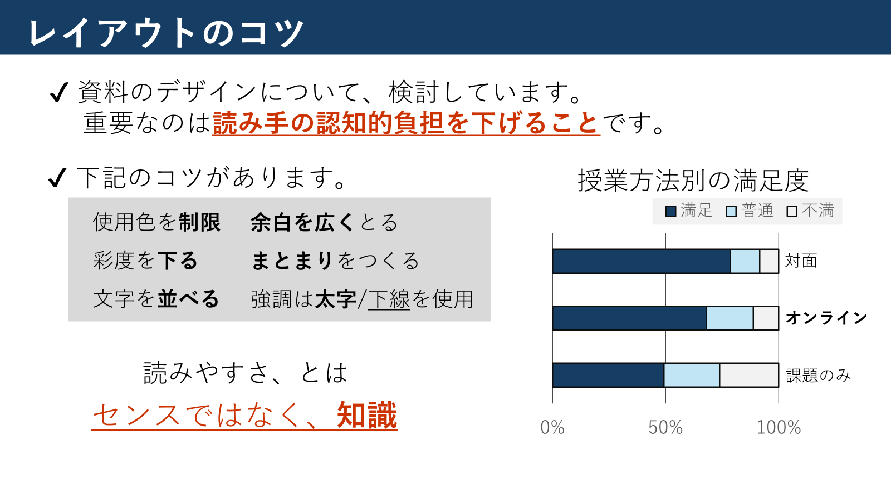
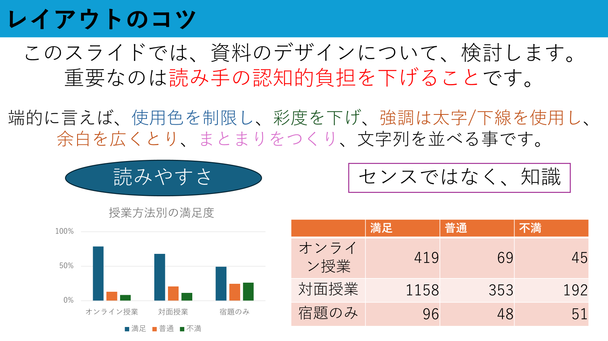
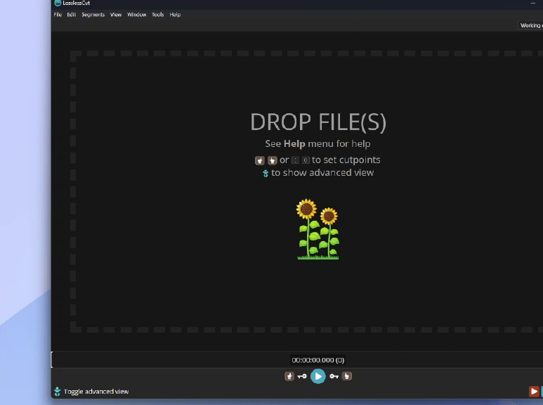

<!-- _class: cover-hero -->

大学などで教える

6分間模擬授業

<b>達成目標：</b>模擬授業作成上の注意点を理解する。

<!--
- まずは、タイトルコール。
-->

---

6分間模擬授業

# 6分間模擬授業とは

開発

→

実施

<b>クラスデザインシート</b>や<b>知識</b>を元に、 実際に<b>動画教材</b>を作ってみる　→ この授業の集大成です

<b>狙い</b>　①授業で習った知識を使い、<b>学生が主体的に学べる教材</b>を作れる

　　　②デリバリースキルを身につける

　　　③他者からフィードバックをもらう

国内の教員養成講座と同種のプログラムには<b>全て模擬授業の実施が含まれています</b>

<!--
- どんな授業がたのしかったですか？考えてみて下さい。
-->

---

6分間模擬授業

# スライドの作成tips

下記のwebページを参照のこと

<b style="color:var(--tag-blue);">https://tsutawarudesign.com/</b>　高橋佑磨・片山なつ (オフィス伝わる)　※高橋先生は、千葉大の先生です

✔ 情報デザインには<b>ルール</b>がある (=誰でも出来る) 
✔ 見やすい<b>レイアウト・配色・グラフ</b>にする 
✔ <b>バリアフリー</b>を考える (色覚 / 他リクエスト)

<!--
- どんな授業がたのしかったですか？考えてみて下さい。
-->

---

6分間模擬授業

# デリバリースキルのtips参照

<b>①自信を持った姿勢</b>　胸を張って肩を落とす / 目を合わせる /落ち着いた身振り

首が前に出る/目が泳ぐ→自信がなく見える　　胸を突っ張る →余裕がなく見える

<b>②沈黙・いい間違え</b>を恐れない/焦らない

　「余裕」を持って話す / 明るく話す　　学生の発言がない時に、待ってあげる

<b>③授業用の話し方</b>　ゆっくり話す / 聞き間違えない単語を選ぶ

自分の想定より早くなりがち / 地球「深部」

栗田編, <i>インタラクティブ・ティーチング</i> (2017), 第９章

<!--
- どんな授業がたのしかったですか？考えてみて下さい。
-->

---

6分間模擬授業

# オンライン授業収録のtips参照

<b>①カメラチェック</b>

<b>明るさ：顔が明るい</b> (必要に応じ照明) / 逆光✗

<b>高さ　：</b>講師の目と<b>同じ</b>か<b>高い場所</b>に設置　見下ろすと「偉そう」に見えて悪印象

<b>②マイクチェック</b>

<b>音量　：一回撮って聞く </b>/ 出来れば別マイク

<b>③オーバーリアクション &amp; 親しみやすさ</b>

<b>反応　：</b>対面より<b>2割増</b>の反応で飽きにくい

<!--
- どんな授業がたのしかったですか？考えてみて下さい。
-->

---

6分間模擬授業

# オンライン授業編集のtips

LosslessCut

VLC Player

<b>いらない部分は、切る</b>

✔ 映像が大きく変わる場所(🔑の箇所)で切れる (それ以外は多少ずれる) 
✔ 書き出しは、数秒で可能 
✔ 長い動画の<b>切り貼り</b>や<b>短縮が簡単</b>

<b>サイズを圧縮する </b>(1280 x 720ピクセルで十分)

✔ 実は、VLCプレイヤーで圧縮できる 
https://www.math.kyoto-u.ac.jp/sites/default/files/public_files/How2VideoDownconv.pdf

Adobe 系ソフトを使うと、高度なことも可能　<b>Premier Pro / Audition / Encoder</b>

<!--
- どんな授業がたのしかったですか？考えてみて下さい。
-->

---

6分間模擬授業

# オンライン授業編集のtips

LosslessCut使用例

<!--
- どんな授業がたのしかったですか？考えてみて下さい。
-->

---

6分間模擬授業

# その他 ~発表の心得~参照

① <b>20分以下の場合、発表時間は厳守</b>する

　 終了時間<b>30秒前</b>から<b>修了時間内</b>に収める

② <b>他の人に聞いてもらう</b>

<b>　 専門外の家族・友人</b>などの反応は重要

③ 目線・ポインターで指す所、手振りについて　<b>3回は練習を繰り返す</b>

(博論発表のときでも、時間が収まったら、自分で3回、後輩と2回くらい？？？)

<!--
- どんな授業がたのしかったですか？考えてみて下さい。
-->
