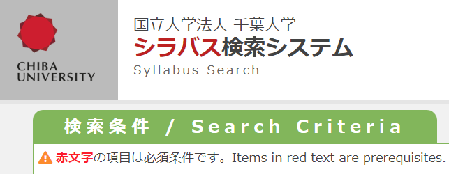
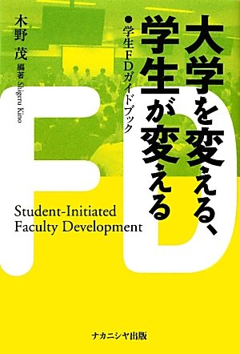

<!-- _class: cover-hero -->

大学などで教える

<b>FD</b>の<b>価値</b>

<b>達成目標：</b>FDの重要性を説明出来る。

<!--
まずは、タイトルコール。FDの重要性を説明できる、が今回の達成目標。
-->

---

FDの価値

# <b>FD</b>(ファカルティディベロップメント)とは

大学設置基準の要請

教員が<b>授業内容・方法を改善し向上</b>させるための組織的な取組の総称。 
→大学教員の人事研修的側面 / 教員本人の自己教育活動を支援

(文部科学省：教学マネジメント指針用語集)

より広い定義

教育の改善、研究活動、社会貢献、管理運営に関わる教員団の<b>職能開発の活動全般</b>

<b>大学設置基準上必須</b>(2008年以降)であり、<b>千葉大でも活動を実施 (質保証・FD部)</b>

<!--
FDの定義。狭義は授業改善のための組織的取組、広義は教員団の職能開発全般。2008年以降は大学設置基準上必須。
-->

---

FDの価値

# <b>FD</b>の<b>例</b>

千葉大学高等教育センター

FDポータル

https://fd-portal.gs.chiba-u.jp/program

シラバスチェック

講演会

例)「ポストコロナにおける学生支援　   - 有機的な連携・協働を実現するには -」

国際FD

例) 外部講師を招いた実践研修プログラム

<b>他校先行事例：大阪大学</b>　https://www.tlsc.osaka-u.ac.jp/fd_program_guide/

教員の<b style="color:var(--accent-dark)">こうなりたい・こうしたい</b>を支援　自分が着任したら<b style="color:var(--accent-dark)">最大限利用しよう</b>

<!--
千葉大のFDの例。FDポータル・シラバスチェック・講演会・国際FD。他校先行事例として大阪大学。教員のこうなりたい・こうしたいを支援するので、着任したら最大限利用しよう。
-->

---

FDの価値

# <b>海外</b>での<b>取組事例</b>

歴史

1800年代

研究活動のための長期有給(サバティカル) @ ハーバード大

1970年代

米国を端緒とする学生の要請：研究から教育充実へ

現在

アカデミアにおけるプロフェッショナル・デベロップメント

例コア・コンピテンシー (教員・研究者たらせる能力)

📝 ライティングとコミュニケーションスキル

🔍 研究力・データ分析力

🧠 キャリア探索とその準備

👨‍🏫 教える力とメンタリング

🤝 リーダーシップとコラボレーション

⚖️ 公正さとインクルージョン

https://grad.berkeley.edu/professional-development/guide/

<!--
海外事例。歴史：1800年代サバティカル、1970年代に研究から教育充実へ、現在はプロフェッショナル・デベロップメント。バークレーのコア・コンピテンシー一覧。
-->

---

FDの価値

# <b>未来</b>の<b>FD</b>

<b>1. Scholarship of Teaching and Learning</b>（SoTL）

「教員による授業実践に関する学術的探求を通して、教授・学習過程を改善する取り組み」（吉良、2010年）

<b>2. 学生と創るFD </b>(学生FD)

大規模オンライン授業を学生と創る@東工大

教育も研究にしてしまえば結果、教育力向上？

<!--
未来のFD。SoTL（授業実践の学術的探求）と、学生と創るFD（学生FD）。教育を研究化すれば教育力も上がる、という発想。
-->

---

まとめ

# <b>まとめ</b>

1. FDの定義

教育の改善、研究活動、社会貢献、管理運営に関わる教員の職能開発の活動全般

(文部科学省：教学マネジメント指針用語集)

2. 教員になったら、<b style="color:var(--accent-dark)">FDを最大限活用</b>しよう

3. SoTL、学生と創るFD等、 <b style="color:var(--accent-dark)">新領域のFD</b>もある

<!--
まとめ。1. FDの定義（教員の職能開発の活動全般）、2. 教員になったらFDを最大限活用、3. SoTL・学生と創るFDなど新領域もある。
-->
