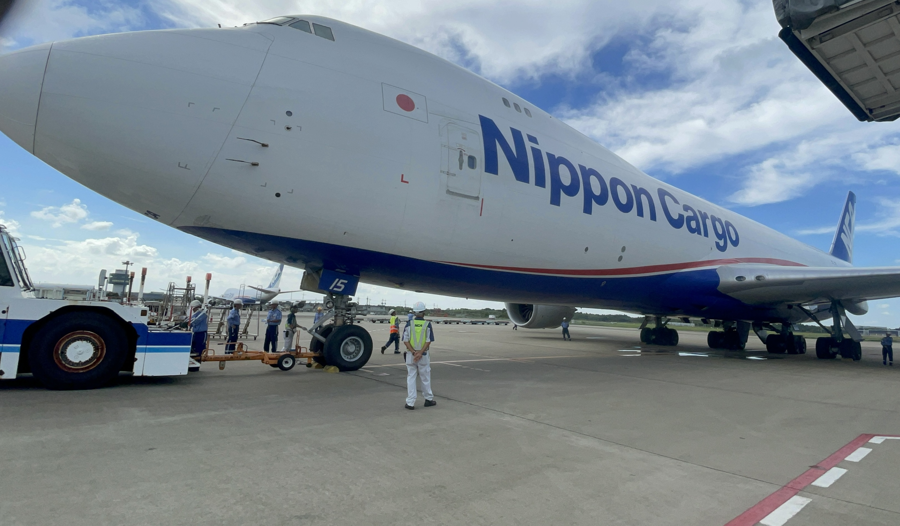
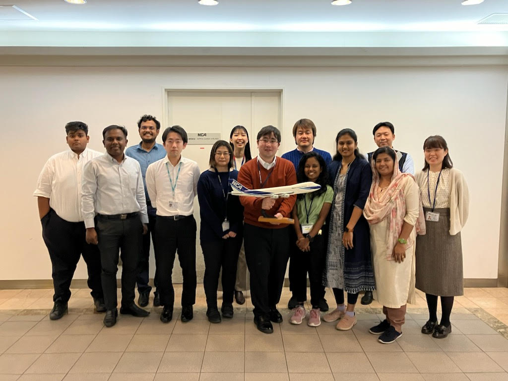
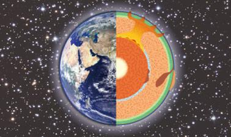

田川 翔

田川 翔高等教育センター 助教

<b>民間での経験：</b> 
　①イシューから始めよ + 一次情報を貪欲に 
　②世界でリーダーシップを取る 
　③組織や環境は良くなる

▶教育はどうあるべき？

1990年 宮崎県生まれ 
趣味は旅行、人と話すこと 
図書館にいるのが好き 
問題意識に基づいて生きる

<!--
- 高等教育センター助教の田川翔です。1990年宮崎県生まれ。民間での経験から「教育はどうあるべきか」を考えてきました。
-->

---

▶大学院教育への問題意識

# 専門

①高圧地球科学 ②材料工学

▶実験よりの科学者

　博士(理学) 2020年3月

<b>地球の起源を探る</b>：フリースタイルの戦い (副専攻etc…)

<!--
- 専門は①高圧地球科学②材料工学。実験よりの科学者で、2020年3月に博士(理学)を取得。地球の起源を探る研究をしてきました。
-->

---

専門と抱負

# 専門

①高圧地球科学

②材料工学

<b style="color:var(--accent-dark);">③高等教育論　</b>

- プレFD

A)TA制度構築

B)大学教育開発の授業

C)オンライン教育支援

<b>1.</b>一生に一度のチャンス。 次世代人材育成計画に共感 縁があって本当に良かった。

<b>2.</b>学生・センター・大学に貢献し、 先進的かつ学習者目線の教育を実現したい。

<b>3.</b>大学院教育改革や、生成AI活用、プレFD等の イシュー (=チャンス)へ果敢に挑戦したい。

多様な先生方と共にセンターで働けること 大変嬉しく思います。 ご指導のほど宜しくお願い致します。

<!--
- 専門は高圧地球科学・材料工学・高等教育論(プレFD)。一生に一度のチャンスとして果敢に挑戦したい。ご指導のほど宜しくお願い致します。
-->
