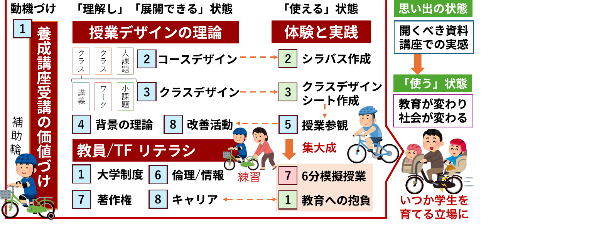

<!-- _class: cover-hero -->

授業のおわりに

<b> 達成目標：</b>　到達目標への達成度合いを振り返る。

<!--
- まずは、タイトルコール。
-->

---

まとめ

<b>授業の目的</b>　未来の大学教員として<b>活躍</b>✨するために、必要な概念を<b>理解</b>🤔し、<b>応用できる</b>😆ようになる。

<!--
- 養成講座受講の価値づけ。動機づけ→「理解し」「展開できる」状態→「使える」状態→思い出の状態、という全体像を概観する。
- 授業デザインの理論／教員・TFリテラシ／体験と実践の3系統で構成されている。
-->

---

まとめ

授業の目標

(1)高等教育の現状及び大学教員のキャリアの性質を説明できる。

(2)関連する法令やポリシー、倫理を理解し、各自がかかわる教育活動の場に適用できる。

(3)教育・学修に関連する理論や学説、方法の基本的事項を理解し、学習者が主体的に学べる授業をデザインできる。

(4)模擬授業の開発・実施・評価を通して学習内容を実践し応用できる。

(5)省察的実践と分析を通じて、自身が受ける教育や学修支援を改善し、教育改革に寄与できる。

<!--
- 授業の5つの目標を一覧で確認。到達目標への達成度合いを、この5項目で振り返る。
-->

---

まとめ

授業の目標

(1)高等教育の現状及び大学教員のキャリアの性質を説明できる。

(2)関連する法令やポリシー、倫理を理解し、各自がかかわる教育活動の場に適用できる。

(3)教育・学修に関連する理論や学説、方法の基本的事項を理解し、学習者が主体的に学べる授業をデザインできる。

(4)模擬授業の開発・実施・評価を通して学習内容を実践し応用できる。

(5)省察的実践と分析を通じて、自身が受ける教育や学修支援を改善し、教育改革に寄与できる。

<!--
- (1) 高等教育の現状とキャリアの性質。説明できる状態になったか振り返る。
-->

---

まとめ

授業の目標

(1)高等教育の現状及び大学教員のキャリアの性質を説明できる。

(2)関連する法令やポリシー、倫理を理解し、各自がかかわる教育活動の場に適用できる。

(3)教育・学修に関連する理論や学説、方法の基本的事項を理解し、学習者が主体的に学べる授業をデザインできる。

(4)模擬授業の開発・実施・評価を通して学習内容を実践し応用できる。

(5)省察的実践と分析を通じて、自身が受ける教育や学修支援を改善し、教育改革に寄与できる。

<!--
- (2) 法令・ポリシー・倫理。各自の教育活動に適用できる状態になったか。
-->

---

まとめ

授業の目標

(1)高等教育の現状及び大学教員のキャリアの性質を説明できる。

(2)関連する法令やポリシー、倫理を理解し、各自がかかわる教育活動の場に適用できる。

(3)教育・学修に関連する理論や学説、方法の基本的事項を理解し、学習者が主体的に学べる授業をデザインできる。

(4)模擬授業の開発・実施・評価を通して学習内容を実践し応用できる。

(5)省察的実践と分析を通じて、自身が受ける教育や学修支援を改善し、教育改革に寄与できる。

<!--
- (3) 理論・学説・方法。学習者が主体的に学べる授業をデザインできる状態になったか。
-->

---

まとめ

授業の目標

(1)高等教育の現状及び大学教員のキャリアの性質を説明できる。

(2)関連する法令やポリシー、倫理を理解し、各自がかかわる教育活動の場に適用できる。

(3)教育・学修に関連する理論や学説、方法の基本的事項を理解し、学習者が主体的に学べる授業をデザインできる。

(4)模擬授業の開発・実施・評価を通して学習内容を実践し応用できる。

(5)省察的実践と分析を通じて、自身が受ける教育や学修支援を改善し、教育改革に寄与できる。

<!--
- (4) 模擬授業の開発・実施・評価。学習内容を実践し応用できる状態になったか。
-->

---

まとめ

授業の目標

(1)高等教育の現状及び大学教員のキャリアの性質を説明できる。

(2)関連する法令やポリシー、倫理を理解し、各自がかかわる教育活動の場に適用できる。

(3)教育・学修に関連する理論や学説、方法の基本的事項を理解し、学習者が主体的に学べる授業をデザインできる。

(4)模擬授業の開発・実施・評価を通して学習内容を実践し応用できる。

(5)省察的実践と分析を通じて、自身が受ける教育や学修支援を改善し、教育改革に寄与できる。

<!--
- (5) 省察的実践と分析。自身が受ける教育・学修支援を改善し、教育改革に寄与できる状態になったか。
-->
