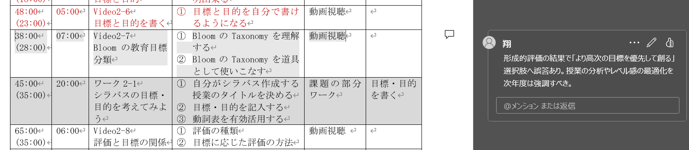
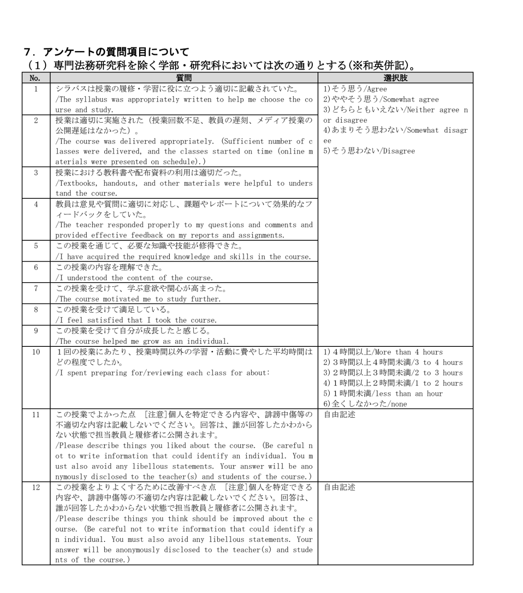

<!-- _class: cover-hero -->

大学などで教える

模擬授業の評価

<b>達成目標：</b>模擬授業の評価から授業改善を体験する。

<!--
- まずは、タイトルコール。
-->

---

模擬授業の評価

# 授業の評価課題 評価

1.<b>他受講生・ご自身</b>の模擬授業の評価

①<b>ルーブリック</b>を体験し、活用出来るようになる。 ②<b>相互フィードバックや授業改善の価値・必要性</b>を理解する。③学びの変化を柔軟かつ正しく取り入れ、学びの場を創造する能力を獲得する。

2.

3.

<!--
- 授業の評価課題。まず「他受講生・ご自身の模擬授業の評価」から。
-->

---

模擬授業の評価

# 目標到達度を評価する 復習

<b style="color:var(--accent-dark);">目標</b>とは、授業で出来るようになって欲しいことの一覧

<b>大学などで教えるの目標</b> (3) 教育・学修に関連する理論や学説、方法の基本的事項を理解し、<b>学習者が主体的に学べる授業をデザイン</b>できる。 (4) <b>模擬授業の開発・実施・評価を通して、学習内容を実践し応用できる。</b> (5) <b>省察的実践と分析</b>を通じて自身が受ける教育や学修支援を改善し、教育改革に寄与できる。

<b style="color:var(--accent-dark);">評価</b>とは、<b style="color:var(--accent-dark);">目標に対しどれほど到達出来たか</b>を可視化したもの

評価は優劣を見分けるためではなく、<b>学修者の支援</b>のためにある

今回の授業での学びを実践してみましょう

<!--
- 評価は、優劣を見分けるためではなく、学修者の支援のためにある。
-->

---

模擬授業の評価

# ルーブリック

✔パフォーマンス課題・レポート・実技等の評価の可視化。 ✔<b>高次の学習目標の評価を可能</b>にする。

「6分模擬授業」を評価するためのルーブリック

<table class="rubric">
<thead><tr><th class="ann">課題内容</th><th>素晴らしい(2)</th><th>合格(1)</th><th>不十分(0)</th></tr></thead>
<tbody>
<tr><th>分量</th><td></td><td></td><td></td></tr>
<tr><th>目標</th><td></td><td></td><td></td></tr>
<tr><th>レベル</th><td></td><td></td><td></td></tr>
</tbody>
</table>

↑評価観点評価基準 →尺度 →

<b>作り方</b>：作法があり、従えば比較的容易に作れる (但し研究は難しい)

<b>参考①</b>：早稲田大資料「ルーブリック作成ガイド」 <b>参考②</b>：インタラクティブ・ティーチング 「③学びを促す評価」

<!--
- ルーブリック＝評価の可視化。高次の学習目標の評価を可能にする。評価観点・基準・尺度の三要素。
-->

---

模擬授業の評価

# 授業の評価課題 評価

1.<b>他受講生・ご自身</b>の模擬授業の評価

①<b>ルーブリック</b>を体験し、活用出来るようになる。 ②<b>相互フィードバックや授業改善の価値・必要性</b>を理解する。③学びの変化を柔軟かつ正しく取り入れ、学びの場を創造する能力を獲得する。

2.<b>ご自身</b>の模擬授業の内省評価

①授業記録の方法を理解する。

3.

<!--
- 2つ目の課題は「ご自身の模擬授業の内省評価」。まず授業記録の方法を理解する。
-->

---

模擬授業の評価

# 授業記録

<b>意義</b>：自らの授業活動での思考や行動を対象に、言語化できる<b>メタ認知能力</b>を向上させる。

<b>方法①：</b>授業中や授業後に気がついたことを、ノート、デザインシートや教材に<b>簡単にメモ</b>する

<b style="color:var(--accent-dark);">方法②</b>：<b>自身の動画や音声記録</b>をもとに分析する。

Welsch &amp; Devlin (2007) <i>Action in Teacher Education</i>

<!--
- 授業記録の方法。①デザインシート等への簡単なメモ、②自身の動画や音声記録をもとに分析する。
-->

---

模擬授業の評価

# 授業の評価課題 評価

1.<b>他受講生・ご自身</b>の模擬授業の評価

①<b>ルーブリック</b>を体験し、活用出来るようになる。 ②<b>相互フィードバックや授業改善の価値・必要性</b>を理解する。③学びの変化を柔軟かつ正しく取り入れ、学びの場を創造する能力を獲得する。

2.<b>ご自身</b>の模擬授業の内省評価

①授業記録の方法を理解する。

3.<b>この授業全体</b>の評価

①授業を改善し続けるための<b>分析を行う枠組み</b>を獲得する。 ②<b>教育改革に参画出来る</b>ようになる。

<!--
- 3つ目の課題「この授業全体の評価」が加わり、3課題が出そろう（ここでは全体像を提示）。
-->

---

模擬授業の評価

# 授業の評価課題 評価

1.<b>他受講生・ご自身</b>の模擬授業の評価

①<b>ルーブリック</b>を体験し、活用出来るようになる。 ②<b>相互フィードバックや授業改善の価値・必要性</b>を理解する。③学びの変化を柔軟かつ正しく取り入れ、学びの場を創造する能力を獲得する。

2.<b>ご自身</b>の模擬授業の内省評価

①授業記録の方法を理解する。

3.<b>この授業全体</b>の評価

①授業を改善し続けるための<b>分析を行う枠組み</b>を獲得する。 ②<b>教育改革に参画出来る</b>ようになる。

<!--
- 3つ目の課題は「この授業全体の評価」。分析の枠組みを獲得し、教育改革に参画できるように。
-->

---

模擬授業の評価

# 授業アンケート

学生授業評価は、統計的に信頼性があり、使用法も妥当で、他の評価法と比べてバイアスもコントロールの必要も少なく、授業改善にも人事にも役立つ。 (Marsh &amp; Roche, 1997)

✔ 授業評価記録や授業アンケート結果が、<b>公募の補助資料</b>となっている例あり。 ✔ 大学が実施する場合や、<b>教員自身が実施している</b>場合もあり。

① <b>教員の教える行為(教授活動)</b>を中心にしたアンケート 　教育方法、学修成果、教育内容や授業など 　例：串本(2005) 日本の1994 – 2003年までの授業評価アンケートの特徴 　　　 ※千葉大は、12問の形式で実施中

② <b>学生の学ぶ行為(学習活動)</b>を中心にしたアンケート 　深い学びに関する評価観点 例：エントウィスル著, 山口訳 (2010)

<b>この授業では体験も兼ねて、全部実施します。</b> 必要に応じて質問項目をご自身の授業に活用して下さい。 Hint! 授業の終了直前の数分で取らない (回答が粗雑になり回収率ダウン)　コース期間中にミニッツペーパーで簡単に何回か実施するのもGood

<!--
- 授業アンケート。教授活動中心と学習活動中心の2系統。千葉大は12問で実施。体験も兼ねて全部実施する。
-->

---

模擬授業の評価

# グラウンドルール 復習

1.<b>3K</b>：<b style="color:var(--accent-dark);">敬意を持って、忌憚なく、建設的に</b>

→<b>甘くするのではなく、改善すれば良くなる点をキチンと書く</b>

2.<b>「さん」づけ</b>で呼ぼう

3.<b>積極的な参加とオープンな心</b>

第8回は、全員の参加がないと成立しません <b style="font-size:28px;">積極的な参加をお願いします</b>

<!--
- グラウンドルール3点。3K（敬意・忌憚なく・建設的に）、さんづけ、積極的な参加。
- フィードバックなどあります。そのときに、この三点を忘れずに頑張りましょう！
-->

---

まとめ

# この授業では、以下の評価活動を行います 評価

授業における学習の到達目標として評価体験

1.<b>他受講生・ご自身</b>の模擬授業の評価

※他受講生や教員のフィードバックは、実際の成績になります

今後教育者として授業改善していくための評価技法

2.<b>ご自身</b>の模擬授業の内省評価

3.<b>この授業全体</b>の評価

<!--
- まとめ。到達目標としての評価体験（課題1）と、今後の授業改善のための評価技法（課題2・3）。
-->

---

<!-- _class: refs -->

まとめ

# 参考文献

栗田佳代子, 中村長史 (編著) (2024) <i>インタラクティブ・ティーチング 実践編3</i>. 河合出版. 
佐藤浩章, 栗田佳代子 (編著) (2021) <i>シリーズ 大学の教授法6 授業改善</i>. 玉川大学出版部. 
ノエル・エントウィスル 著 山口　栄一 訳 (2010) <i>学生の理解を重視する大学授業</i>. 玉川大学出版部. 
串本剛 (2005) 教育目的との対応にみる教育評価の妥当性―授業評価項目の分析を具体例に.<i>『大学教育学会誌』</i>27 (1), 124-130. 
吉川政夫, 有沢孝治, 川野辺裕幸, 内田晴久 (2012) 構造化された授業評価アンケートの開発.<i>『広島大学 高等教育研究開発センター 大学論集』</i> 第 43 集(2011年度), 337-351. 
Welsch, R. G., &amp; Devlin, P. A. (2007). Developing Preservice Teachers’ Reflection: Examining the Use of Video. <i>Action in Teacher Education</i>, 28(4), 53–61. https://doi.org/10.1080/01626620.2007.10463429

千葉大学のアンケート調査

<!--
- 参考文献。あわせて千葉大学のアンケート調査の質問項目を提示。
-->
