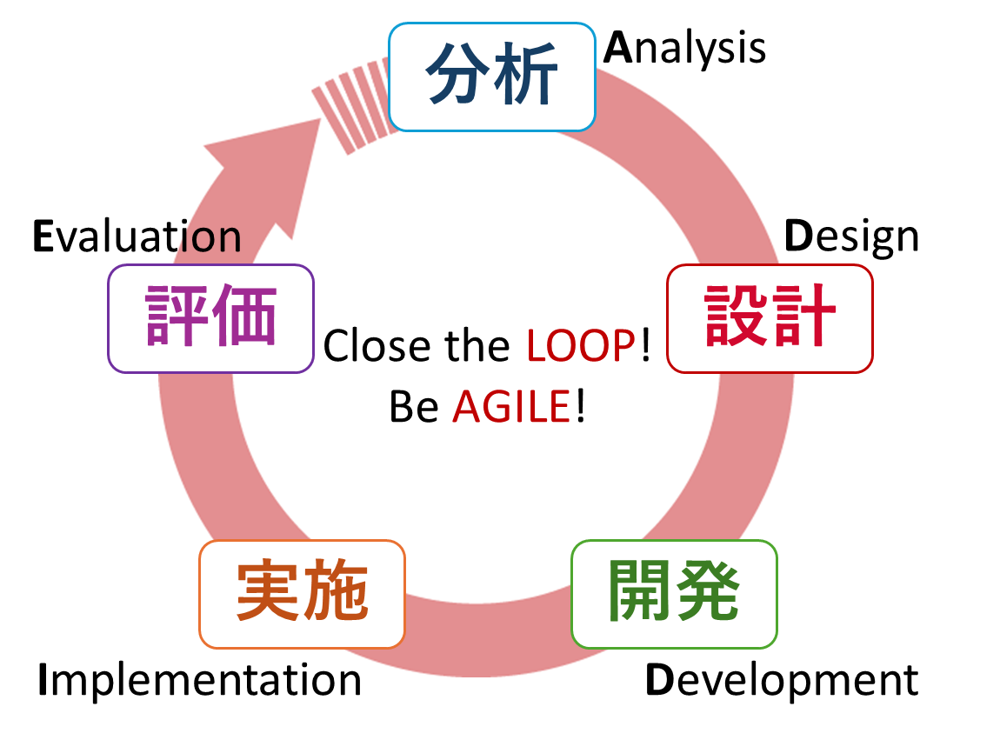

<!-- _class: cover-hero -->

大学などで教える

ADDIEモデル

<b> 達成目標：</b>ADDIEモデルを使えるようになる。

<!--
- まずは、タイトルコール。
-->

---

復習

# ADDIEモデル復習

実は、もう学習済です。

分析

2-2 逆向き設計

設計

2-2 逆向き設計 (シラバス)

3-2 学修者主体のクラス設計

3-8 6分間クラスデザイン

開発

7-6 6分間模擬授業

実施

7-6 6分間模擬授業

評価

8-2 模擬授業の評価

<!--
- どんな授業がたのしかったですか？考えてみて下さい。
-->

---

ADDIEモデル

# ADDIEモデル

<b>教育・教材設計のプロセス</b>を示したもの (ガニエ他 2007) ※但し1980sからある

本授業を通して<b>「1 ループ」</b>体験したことになります 
但し1回のループで終わるのではなく、より高次のループに入ることが重要です(Close the LOOP!) 
<b>授業を実施する度(例：毎年度)に一周</b>させましょう 
この形に常に固執するのではなく場合によっては実験を行ったり(ラピッドプロトタイピング)、引き返すなどが重要です(Be AGILE!)

<!--
- どんな授業がたのしかったですか？考えてみて下さい。
-->

---

ADDIEモデル

# ADDIEモデルのどこが重要？

30秒間あるので、 一つ選んで下さい

<!--
- どんな授業がたのしかったですか？考えてみて下さい。
-->

---

ADDIEモデル

# ADDIEモデルは設計が重要!

多くの方が2個目のDやIを重要と答えるようです…

重要なのは<b>設計</b>(1個目のD)です 授業でも設計を中心に話しました

<!--
- どんな授業がたのしかったですか？考えてみて下さい。
-->

---

復習

# インストラクショナル・デザイン復習

教育の効果・効率・魅力を高める手法・モデル・研究を統合し、<b>学修を支援する環境を構成するプロセス</b>

<table class="lvl-tbl">
<tr><td class="lv">レベル3</td><td><b>学びたさ</b>の道具</td><td class="tool">モチベーション理論・価値</td></tr>
<tr><td class="lv">レベル2</td><td><b>学びやすさ</b>の道具</td><td class="tool">9教授事象・AL・反転授業 など</td></tr>
<tr><td class="lv">レベル1</td><td><b>分かりやすさ</b>の道具</td><td class="tool">ADDIE、伝わるデザイン など</td></tr>
<tr><td class="lv">レベル0</td><td><b>無駄のなさ</b>の道具</td><td class="tool">目標分類、分析手法 など</td></tr>
<tr><td class="lv">それ以前</td><td><b>イラつきのなさ</b>の道具</td><td class="tool">リテラシ、ICT支援 など</td></tr>
</table>

鈴木克明監修 (2016) インストラクショナル・ デザインの道具箱101

<!--
- どんな授業がたのしかったですか？考えてみて下さい。
-->

---

ADDIEモデル

# ID第一原理

あらゆる状況において効果的な学習環境を実現するために必要な<b>5つの要素  </b>Merrill (2002) “First principles of instruction”

<b>解説</b>：鈴木・根本 (2011) <i>教育システム情報学会誌</i> 28(2), 168-176　特に<b style="color:var(--accent)">p.171</b>

①<b>問題 (Problem)</b>：現実に起こりそうな問題に挑戦する

②<b>活性化 (Activation)</b>：すでに知っている知識を動員する

③<b>例示 (Demonstration)</b>：伝えるのではなく、例示する

④<b>応用 (Application)</b>：学んだことを使う機会がある

⑤<b>統合 (Integration)</b>：現場で活用し、振り返る機会がある

この授業は、IDの第一原理に基づき設計された具体例です　統合は、教員になったときに、ぜひ行って下さい

<!--
- 過去の関連する経験を思い起こさせせよ / 新しく学ぶ過去の経験から得た知識を思い出させ、関連付け、記述させ、応用させるように仕向けよ / 新しく学ぶ知識の基礎にナルような関連する経験を学修者に与えよ
-->

---

まとめ

# 授業の学びを繋げる6分間

IDインストラクショナル・デザイン

①<b>問題 (Problem)</b>：現実に起こりそうな問題に挑戦する

②<b>活性化 (Activation)</b>：すでに知っている知識を動員する

③<b>例示 (Demonstration)</b>：伝えるのではなく、例示する

④<b>応用 (Application)</b>：学んだことを使う機会がある

⑤<b>統合 (Integration)</b>：現場で活用し、振り返る機会がある

IDの第一原理　Merrill (2002)

ADDIE

重要なのは<b>設計！</b> 毎回見直して、<b>高次のループ</b>に！ <b>融通を</b>効かせて！

<!--
- 一つメタな視点にたつと、皆さんはこの授業を通して実践から学んでいる
-->

---

<!-- _class: refs -->

まとめ

# 参考文献

Robert M. Gagne et al., 鈴木克明, 岩崎信 (監訳) (2004/日本語訳2007) インストラクショナルデ ザインの原理. <i>北大路書房</i>.

Merrill M.D. (2002) First principles of instruction. <i>Educational Technology Research and Development</i>, 50(3 ). 

鈴木克明 監修, 市川尚, 根本淳子編著 (2016) インストラクショナル・デザインの道具箱101、<i>北大路書房</i>. 

鈴木克明・根本淳子 (2011) 教育設計についての三つの第一原理の誕生をめぐって,<i>教育システム情報学会誌</i> 28(2), 168-176 .

<!--
- 一つメタな視点にたつと、皆さんはこの授業を通して実践から学んでいる
-->
