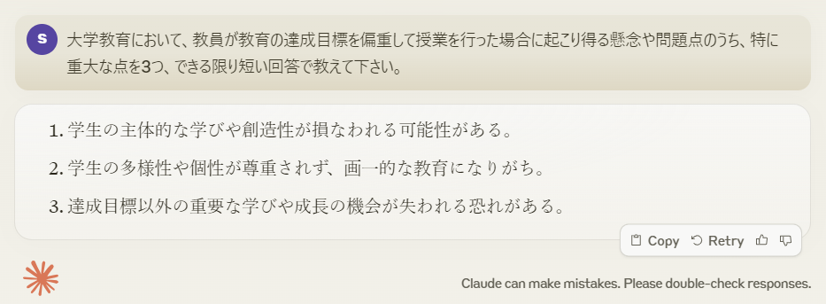
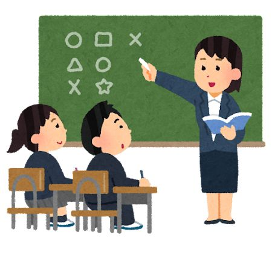
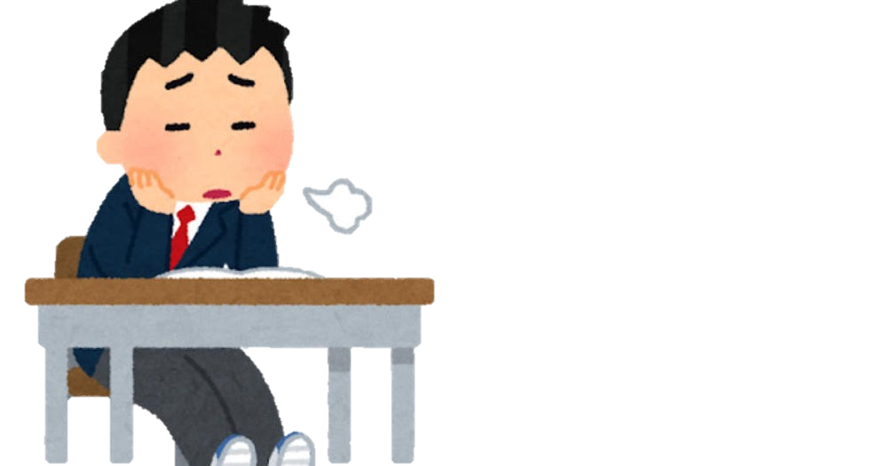
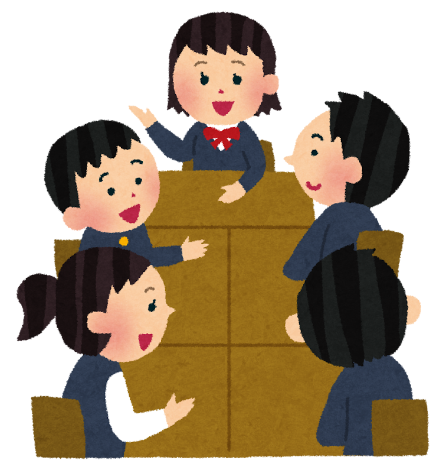
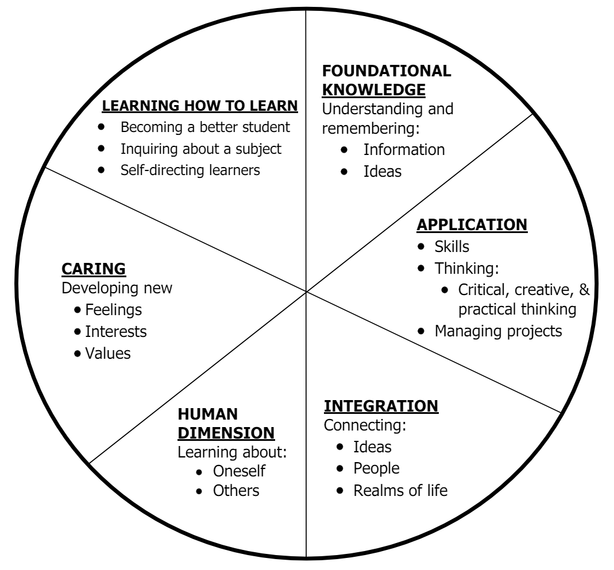

<!-- _class: cover-hero -->

大学などで教える

あそびの価値、深い学びの意義

<b>達成目標：</b>目的指向や知識偏重ではない 学びの価値も認識できる。

<!--
- タイトルコール。目的指向や知識偏重ではない「学びの価値」も認識できる、が今回の達成目標。
-->

---

あそびの価値、深い学びの意義

# 3つの懸念から始める

<b>1.</b> <b>目標の設定を誤ってはいけない</b> 　→ 主体的な学びを織り込んだ目標・設計にしましょう

<b>2.</b> <b>教室の内外の多様性を活かす</b> 　→インタラクションを設計に折り込みましょう

<b>3.</b> <b>詰めすぎず、あそび(=ゆとり)を活かす</b> 　→協力的な学習環境を作り、対話や気付きのある場にしましょう

(Claudeを使って生成 2024/5/15)

N.G.　:認知的領域 (特に低次)に偏る　／　Good　:<b style="color:var(--accent-dark)">どのような学生を育てるべきかを考える</b>

<!--
- あそびの価値、深い学びの意義。Claudeに「達成目標を偏重した場合の懸念」を尋ねた回答から、3つの注意点を引き出す。
-->

---

あそびの価値、深い学びの意義

# 効率を常に追う必要はない

同じ内容でも、学び方で、受け取り方は変わる

計画された学び

理解はするけど、忘れるかも…

偶発的な学び

気づけたことは、残るかも！

計画された目標と評価に終始し、無駄を切り詰め、対話もない <b>そんな「あそびやゆとりのない教育」ではいけない</b>。<b>教育を一歩引いたところから捉え、深い学びに繋がる道</b>を選ぶ

<b>偏った目標を極端に追い求めると、失うものがある</b>

<!--
- 同じ内容でも学び方で受け取り方は変わる。計画された学びは「理解するけど忘れるかも」、偶発的な学びは「気づけたことは残るかも」。偏った目標を極端に追うと失うものがある。
-->

---

あそびの価値、深い学びの意義

# Finkの意義ある学習分類、再び　Fink (2003)

<b>人間性の醸成</b>や、<b>価値観</b>の見出し、<b>学び方自体の学習</b>なども目標に加える立場

基礎知識
応用
統合
人間性
関心
学び方の学習

Q) 逆向き設計は使えないんですか？

A)<b>いいえ</b>。 原則はこの授業で習った内容と<b>同じ</b>です。 例えばE.F. Barkleyらの<b>学習評価ハンドブック</b>に、Finkの学習分類に基づく評価技法がのっています。

L.Dee Fink. (2003). <i>A Self-Directed Guide to Designing Courses for Significant Learning</i>. Jossey-Bass.

<!--
- Finkの意義ある学習分類を再び。基礎知識・応用・統合・人間性・関心・学び方の学習。逆向き設計は使える（原則は同じ）。Barkleyらの学習評価ハンドブックにFink分類に基づく評価技法がある。
-->

---

あそびの価値、深い学びの意義

# 深いアクティブ・ラーニング

「<b>学生にある物事を行わせ、行っている物事について考えさせる</b>こと」

松下佳代 編著 (2015) <i>ディープ･アクティブラーニング 大学授業を深化させるために</i>

学習への深いアプローチの例

- 学生自身のこれまでの知識や経験に、学びを関連づけること 
- 実践や具体例から、パターンや重要な原理を探すこと 
- 論理や議論を注意深く、批判的に検討すること 
- 他者との関わりから、自らの考えを形づくること 
- 仮説を形成し、根拠を探し、それらを結論に関連づけること 
- 学生自身やチームが学びながら成長していることを自覚的に理解すること 
- 学びに積極的に関わり、自らのイシューを見定め、学びを形作れること

<b>あそび</b>や一時的な<b>無駄</b>、<b>試行錯誤</b>も<b>織り込む</b>。<b style="color:var(--accent-dark)">一見すると無駄かもしれないが、一生無駄かは分からない</b>。知識を詰め込むだけではなく、<b style="color:var(--accent-dark)">研究や経験の共有</b>なども学びかも

<b>参考資料：</b>文部科学省 教育課程企画特別部会　論点整理　補足資料（5）

<!--
- 深いアクティブ・ラーニング。「学生に物事を行わせ、行っていることを考えさせる」。あそび・無駄・試行錯誤も織り込む。一見無駄でも一生無駄とは限らない。
-->

---

あそびの価値、深い学びの意義

# カリキュラム論や社会学への発展

教育の次元

アクティビティ

クラス

コース

カリキュラム

カリキュラム・デザインのポイント 
①高校までの「答えが決まっている学び」から、<b>「答えのない課題を発見する学び」への転換</b>が出来る。 
②<b>主体性の重要性、学びの重要性</b>に気付ける。 
③多様な価値観や意識をもつ<b>他者と、いかに共同して成果を上げるか</b>を体験し、社会に出る自信が持てる。 
④社会の現実や仕組みを理解し、<b>将来のキャリアを主体的に描ける</b>ようになる。 
⑤<b>課題発見能力・課題解決能力を身につけ</b>、磨く。

佐藤浩章ほか (2016) 『大学生の主体的学びを促すカリキュラム・デザイン』を改変

大学や教育のあり方
→ 社会学的な視点

例：インターネットやAIがあれば、ほとんどの知識が学べる時代に、私達はなぜ大学に集うのか。大学の価値はなにか。 →古今東西、多数の本があるので、当たられると面白いかと思います。

<!--
- カリキュラム論や社会学への発展。教育の次元はアクティビティ→クラス→コース→カリキュラムと上がる。カリキュラムまで上がると社会学的な視点に発展する。
-->

---

あそびの価値、深い学びの意義

# 知識偏重ではないカリキュラム

<b>次の人材育成を目標とする教育</b>をどう実現するか

<b>患者さんを尊重した医療を提供できる人材</b>を育成する ー千葉大学 総合医療教育研修センターのミッションより

<b>積極性と主体性を備えた課題解決人材</b>を育成する ー千葉大学千葉大学次世代人材育成計画より

僕らは、そのような人材の育成を<b style="color:var(--accent-dark)">本気</b>で目指しています。皆さんも、着任した機関で目指す教育の形があるでしょう 
専門的知識の伝授は、もちろん大切です。しかし、それだけでは、<b style="color:var(--accent-dark)">人を育てることは出来ません</b>

<b style="color:var(--accent-dark)">知識・スキルに偏重した「専門性の伝授」だけに終始せず、学修者の主体的な学びへ転換しましょう</b>

<!--
- 知識偏重ではないカリキュラム。千葉大の人材育成目標を例に、専門的知識の伝授だけでは人は育てられない。主体的な学びへ転換しよう。
-->

---

<!-- _class: refs -->

あそびの価値、深い学びの意義

# 参考文献

L.Dee Fink. (2003). <i>A Self-Directed Guide to Designing Courses for Significant Learning</i>. Jossey-Bass.
<a href="https://www.bu.edu/sph/files/2014/03/www.deefinkandassociates.com_GuidetoCourseDesignAug05.pdf">https://www.bu.edu/sph/files/2014/03/www.deefinkandassociates.com_GuidetoCourseDesignAug05.pdf</a>

文部科学省 教育課程企画特別部会 (2015) 論点整理 > 補足資料（5）アクティブ・ラーニングに関する議論.
<a href="https://www.mext.go.jp/component/b_menu/shingi/toushin/__icsFiles/afieldfile/2015/09/24/1361110_2_5.pdf">https://www.mext.go.jp/component/b_menu/shingi/toushin/__icsFiles/afieldfile/2015/09/24/1361110_2_5.pdf</a>

松下佳代 編著 (2015) <i>ディープ･アクティブラーニング 大学授業を深化させるために</i>, 勁草書房.

佐藤浩章ほか (2016) <i>大学生の主体的学びを促すカリキュラム・デザイン</i>, ナカニシヤ出版.

千葉大学 (2022)千葉大学次世代人材育成計画.
<a href="https://www.chiba-u.ac.jp/academics/files/pdf/blueprint2028.pdf">https://www.chiba-u.ac.jp/academics/files/pdf/blueprint2028.pdf</a>

<!--
- 参考文献一覧。
-->
