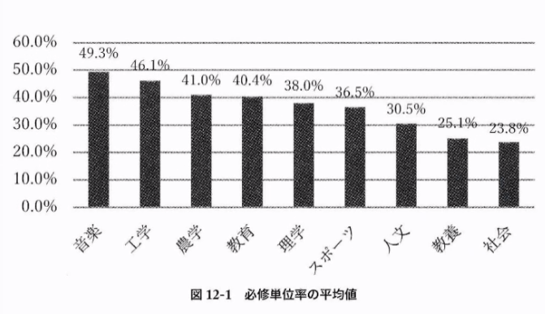
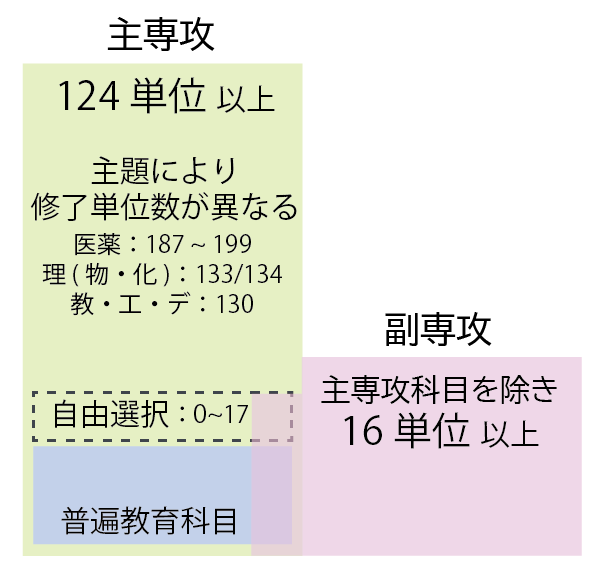
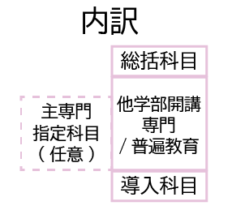
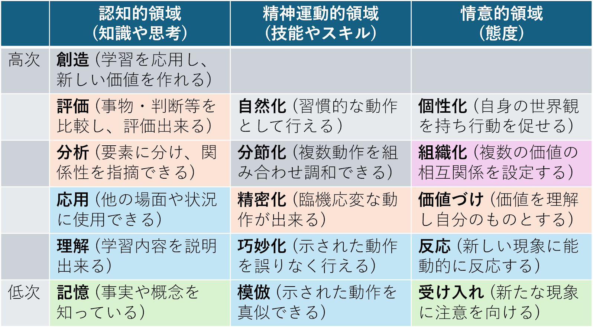

<!-- _class: cover-hero -->

学部副専攻の実質化を目指した

単位要件の変更案

2024年6月3日

高等教育センター　副専攻検討プロジェクトチーム

<!--
- 学部副専攻を実質化するための単位要件の変更案。高等教育センター 副専攻検討プロジェクトチームからの提案。
-->

---

現状の課題

# 副専攻制度の現状と課題

「<b>専攻分野以外の幅広い知見</b>に触れ，国内外を問わず<b>社会で活躍する人材に必要とされる能力</b>や素養を<b>体系的に身につけさせる</b>こと」 - 千葉大学における全学副専攻プログラムに関する規程

現状の課題

自専攻を含め30単位 → 学部によって<b>副専攻の履修しやすさに大きな差</b>

結果として「全学」副専攻の<b>公平性</b>に課題 / <b>履修者の拡充やプログラム追加に困難</b>

例)『国際日本学』修了者の他学部科目の履修単位数例：文学部 6単位 / 工学部 22単位

別添① 国際日本学修了者の単位取得分布

<!--
- 副専攻規程の理念に対し、現状は学部によって履修しやすさに大きな差があり、全学副専攻としての公平性に課題がある。
-->

---

変更案

# 設置上の最小カリキュラムを定める

<b>今後開設される副専攻について、設置上の最小要件を設定したい</b>。また、その最小要件でも、<b>千葉大の副専攻の趣旨を満たすか確認する</b>

<b>変更案 ：</b> <b>1</b>、<b>2</b>の両方を設置上の最小カリキュラムとする

<b>1.</b>「専攻分野以外の幅広い知見」を得る機会の実質化のため、副専攻設置要件に、「修了に要する最小単位数」を盛り込む。

<b>現行</b>：指定科目から30単位 (専攻を問わない)

<b>案</b>：<b>「他学部開講科目」と「普遍教育科目(必修を除く)」から16単位以上を要件</b>とする(但し、副専攻カリキュラムを16単位以上とすることや、主専攻での必修科目を設けることを<b>妨げない</b>。)

<b>2.</b>「副専攻分野の体系的な能力や素養の獲得」の実現のため、必修科目(導入科目と総括科目)の指定を設ける。

必修科目１：副専攻の主題の体系的な俯瞰のための導入科目 (1～2単位程度)

必修科目２：副専攻の主題への学びを応用・転移する総括科目 (2単位程度)

<!--
- 変更案は2点。1=最小単位数（他学部+普遍から16単位以上）の導入。2=必修の導入科目・総括科目の指定。
-->

---

変更案の構造

# 単位構成と副専攻内訳

主専攻124単位以上の中で、主専攻科目を除き16単位以上を副専攻に

資料:表1/2

最小単位と副専攻内のカリキュラム要件(導入科目・総括科目)を定め、<b>イシューベース / ディシプリンベース、何れのカリキュラムに対しても副専攻の設定を可能とする</b>

<!--
- 主専攻124単位以上の枠内で、主専攻科目を除き16単位以上を副専攻として要件化。導入・総括・専門の内訳でカリキュラムを構成する。
-->

---

検討：最小単位数（上限）

# 「千葉大の副専攻」の最小単位数

検討「千葉大の副専攻」としての最小単位数の検討

<b>前提</b>：規定の学際性の保証のため他学科/普遍の単位を要件とすべき

上限CAP制の考え方に基づく、主専攻カリキュラムの確認

卒研所属ゲートまでの履修可能な余剰単位 別添② 各コースのCAP制単位数

<b>理・化学：15 単位程度 / 工・物質科学：21単位</b>

→卒業要件から考えると<b>15 ~ 21単位以上の他学科履修要件</b>は、履修不能な学生を生むため「全学」プログラムの理念に不適

<!--
- 上限：CAP制で見ると、卒研ゲートまでの余剰単位は理化学15・工21程度。これ以上の他学科要件は履修不能な学生を生むため不適。
-->

---

検討：最小単位数（下限）

# 下限：主題の学びに必要な単位数

下限副専攻とよべる主題の学びには何単位必要か

①学びの深さ (学習目標分類)

副専攻の目的は有色部で達成 / 水準は100 ~ 300まで（串本 2021）

②ディシプリンに基づく最小単位数

主専攻の必修単位数（串本 2021） 資格過程を除く各分野の必修項目は、<b>10 ~ 30%</b>(124とすると<b>12</b> ~ 37単位)

③イシューに基づく最小単位数

<b>千葉大国際教養</b>の主題の構成科目数 (200 ~ 300番台 / サブ群2つ分) 俯瞰(1~2単位) + 専門 (<b>12</b>~23単位)

<b>2</b> ＋ <b>12</b> ＋ <b>2</b> ≧ 16単位

<!--
- 下限は3つの観点（学びの深さ・ディシプリン・イシュー）から検討。導入2+専門12+総括2で16単位以上が妥当。
-->

---

確認・課題と打ち手

# 16単位で「副専攻」と呼べるか

確認16単位で「副専攻」と呼んでも問題ないか

<b>国内</b>：10単位程度の副専攻プログラムが存在(例：福井大)、 　　　国内副専攻制度の論文でも16単位が妥当との結論 (田中 2011)

<b>海外</b>：UCB等のマイナーでも、18単位程度のものが存在

<!--
- 16単位は国内外の事例と先行研究（田中2011）からも妥当な水準。
-->

---

課題と打ち手

# 残る課題と打ち手

課題と打ち手

課題

打ち手

学部単位での履修コントロール

将来、コース別での副専攻設定など細分化を検討

副専攻により修了要件が変わる

各副専攻の内容/学習量をWEBにより社会に説明

理系副専攻は文系が受けにくい

カリキュラム設定時に工夫する方法を説明

<b>備考</b>：既存分の副専攻については<b>不遡及</b>。但し既存の副専攻を上記視点で分析した場合<b>現状も同様の構成</b>であり、学修者の学習量は<b>現状と同等か増加</b>する。

<!--
- 16単位は国内外の事例と先行研究（田中2011）からも妥当。残る課題は3点で、それぞれ打ち手を用意。既存副専攻には不遡及。
-->
