
開始前のお願い

会場は机の<b>島</b>、オンラインは<b>ブレイクアウトルーム</b>で進行します。

お願い①

PC/スマホを取り出しやすい場所において下さい。

次に、テーブルの「ワークシート」を<b>ご一読</b>ください。

Zoom参加の方は名前を<b>【オンライン】名前</b>として下さい。

お願い②

開始まで班が同じ先生と<b>ご歓談</b>ください。

協力的な雰囲気作りが良い研修には不可欠です。

チームワークよく、全員が話せる場が理想です。

今日は、年齢や職階を気にせず、話しましょう！

お願い③

<b>PCを用いたメモ担当</b>をグループから2人決めて下さい。

<b>会場は3人並びの席の中心</b>にメモ担当がお座りください。

<!--
- 開始前のお願い。机の島／ブレイクアウトで進行。お願い①PC/スマホを手元に・ワークシート一読・Zoom名は【オンライン】名前、お願い②開始まで同じ班の先生とご歓談、お願い③PCメモ担当を2人決め、会場は3人並びの中心へ。
-->

---

困った場合・質問

困った場合

<b>会場</b>：手をあげて合図下さい 
事務系担当者が、サポートに伺います。  
<b>オンライン：zoomチャット内にある、事務局にダイレクトメッセージにてコメントを送って下さい。</b>

質問

時間の関係上、最後にまとめて受け答えいたします。 
質問がある方は、Comment Screenまで送付ください

<!--
- 困ったとき：会場は挙手で事務系担当者がサポート、オンラインはzoomチャットで事務局にDM。質問は時間の関係上最後にまとめて。Comment Screenまで送付を。
-->

---

<!-- _class: cover-hero -->

全員で使える　Tipsってなんだろう

学生の学習意欲を高める、 授業設計

東京工芸大学　FD研修会

2024/9/9

<!--
- タイトルコール。「全員で使えるTipsってなんだろう」をサブに、「学生の学習意欲を高める、授業設計」。東京工芸大学FD研修会、2024/9/9。
-->

---

講師の簡単な紹介

田川

千葉大のFD / Pre FD担当

<ul style="margin:6px 0 0 1.05em; font-size:21px; line-height:1.45;">
<li>SPring-8や電子顕微鏡</li>
<li>航空会社勤務</li>
<li>地球の起源の研究 → 教育系へ</li>
</ul>

齋藤

学芸大で芸術×教育の研究

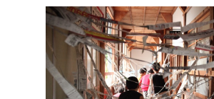
<ul style="margin:6px 0 0 1.05em; font-size:21px; line-height:1.45;">
<li>民間で研修の企画 → 教育系へ</li>
<li>地域の廃校での造形ワークショップ</li>
<li>新入社員 野外研修</li>
</ul>

東京高等工芸学校の流れを持つ、東京工芸大と千葉大。こうして機会を頂ける縁に、しみじみしております。頑張ります！　人が集まる＜場＞で遊びや気づき、学びが最大限生まれる設計（仕掛け）を考えてきました。この時間で私もたくさんの気づきを持ち帰りたいです。お困りのことあればお声がけください！

<!--
- 講師紹介。田川＝千葉大のFD/Pre FD担当（SPring-8・電子顕微鏡、航空会社勤務、地球の起源の研究→教育系へ）。齋藤＝学芸大で芸術×教育の研究（民間で研修の企画→教育系へ、廃校での造形WS、新入社員野外研修）。詳しい先生は周りの先生の支援に回ってください。
-->

---

今日の目的とゴール

<b>多様なワークを楽しみ</b>つつ、<b>設計の工夫をことばに</b>し<b>、理論を学ぶ</b>ことで、<b>日頃の授業に応用できる</b>ようになる。

目的

「学生の学習意欲を高めたい！」先生に応えるプログラムです。

ゴール

<b>「やってみる」を3つ選んで頂きます</b>

思いっきりご参加下さい !　Tipsを取り入れたいと思って頂きたい！

<!--
- 今日の目的とゴール。目的＝「学習意欲を高めたい！」先生に応えるプログラム。ゴール＝「やってみる」を3つ選んで頂く。多様なワークを楽しみ、工夫をことばにし、理論を学んで日頃の授業に応用できるように。思いっきりご参加を。
-->

---

今日の進行スタイル

スタイル

全員で「<b style="color:var(--accent);">発見</b>」する

言葉にして「<b style="color:var(--accent);">共感・実感</b>」する

「<b style="color:var(--accent);">仲間</b>」を得る

期待

皆さん、出来ます

− <b>難しい話はありません</b>

− <b>実践的で役立つ</b>ことに気づけます

− 終了後<b>日々試して頂く</b>ことが鍵です

<!--
- 今日の進行スタイル。スタイル＝全員で「発見」、言葉にして「共感・実感」、「仲間」を得る。期待＝皆さん出来ます（難しい話はない／実践的で役立つことに気づける／終了後日々試すのが鍵）。今できていなくても構いません。
-->

---

グランド・ルール

<i>from</i> 東京大学・プレFD講座

互いに学び合う、協力的環境づくり

− <b>積極的に</b>ご参加頂きたい 
− <b>3Kなフィードバック</b> 
「敬意を持って」「忌憚なく」「建設的に」 
− <b>職位に関係なく、ざっくばらんに</b>話せる

<!--
- グランド・ルール（東京大学・プレFD講座より）。互いに学び合う、協力的環境づくり。積極的なご参加／3Kなフィードバック「敬意を持って」「忌憚なく」「建設的に」／職位に関係なくざっくばらんに話せる。
-->

---

使用ツール 3点

①

<b>ワークシート</b>　お手元の紙/PDFで、<b>ワークで記入</b>頂きます。道具箱も添付しています。回収はしません。

②

<b>Google ドキュメント</b>　<b>グループワークの結果を会場全体で共有する</b>用です。会場は3人並びの真ん中の先生が<b>メモご担当です(各班2名)</b>。編集は、<b>同時接続100人制限がある</b>ので、その他の先生は、閲覧用リンクをご参照下さい。

③

<b>コメントスクリーン</b>　その場アンケート、反応、質疑応答用です。時々使います。

<b>ご案内メールにもリンクございます</b>

<!--
- 使用ツール3点。①ワークシート（紙/PDFで記入、道具箱付き・回収なし）、②Googleドキュメント（結果を会場全体で共有・メモ担当が記入、各班2名・同時接続100人制限、他は閲覧用リンク）、③コメントスクリーン（その場アンケート・反応・質疑応答）。ご案内メールにもリンクあり。
-->

---

コメント・スクリーン

講演インタラクティブ化ツール

…皆様、ニコニコ生放送ってご存知ですか？（動画でコメントが流れる／88888888）

その場で<b>匿名</b>アンケートも取れます　顔文字も送れます

<b>温かい反応を頂けますと幸いです</b> 
<b>折角なのでテストにご協力下さい</b>　お手柔らかに

88888888

https://www.commentscreen.com/comments?id=yLDuyRiqvXcRovEzk3LI　／　<b>ご案内メールにもリンクございます</b>

<!--
- コメント・スクリーン＝講演インタラクティブ化ツール。ニコニコ生放送のようにコメントが流れる（88888888）。匿名アンケートや顔文字も。温かい反応を、折角なのでテストにご協力を。ご案内メールにもリンクあり。
-->

---

コメント・スクリーン

いかがでしたでしょうか

・<b>同じURLを最初から最後まで</b>使います　反応を伺いたいとき、その場アンケート、質疑応答

・<b>顔文字と反応は、いつでも記載OKです</b>

ただし、余り長文や頻繁にならないよう、お願い致します 
場合によっては、オフにすることもございますので、ご理解下さい

<!--
- コメント・スクリーン、いかがでしたか。同じURLを最初から最後まで使う（反応・その場アンケート・質疑応答）。顔文字と反応はいつでもOK。ただし長文や頻繁にならないよう。場合によりオフにすることもご理解を。
-->

---

3つの質問の振り返り

CR 1

質問①

今回の研修は次のどちらが望ましいですか。

質問②

学習意欲を高める教え方についてご自身はどのくらい自信をお持ちですか。主観で構いませんので、お答え下さい。

<!--
- 3つの質問の振り返り（CR 1）。質問①今回の研修は次のどちらが望ましいか。質問②学習意欲を高める教え方についてご自身はどのくらい自信があるか（主観でOK）。みんなが困り事を持つこと、先生だけではないことを確認。出来なくて当然＝方略を学ぶ機会が少ないだけ（方略帰属）。ワーク形式で気付きを大切に進めたい。
-->

---

モチベーション向上を体験！

CR 2

いきなりですが、以下を覚えて下さい。

モチベーションとは期待と価値の掛け算であるというモデルが<b>期待価値理論</b>である。 
学習意欲自体を高めるための方略もあり、<b>ARCSモデル</b>や<b>現場のTips</b>、<b>学びの場づくり</b>があげられる。

と言われたら、どう思いますか？

覚えようと思いましたか

▶ Yes / No

<!--
- モチベーション向上を体験！（CR 2）。いきなりですが覚えて下さい：モチベーション＝期待×価値（期待価値理論）。学習意欲を高める方略にARCSモデル・現場のTips・学びの場づくり。と言われたら覚えようと思いましたか？▶Yes/No。
-->

---

今日の俯瞰図

# 今日の俯瞰図

理論実践

<svg viewBox="0 0 1180 520" style="width:100%; height:auto;" xmlns="http://www.w3.org/2000/svg" font-family="sans-serif">
<defs><linearGradient id="diag" x1="0" y1="0" x2="1" y2="1"><stop offset="0" stop-color="#F6CBD3"/><stop offset="1" stop-color="#EFB6C1"/></linearGradient></defs>
<polygon points="40,40 980,440 920,500 0,100" fill="url(#diag)"/>
<polygon points="900,400 1060,470 940,560" fill="url(#diag)"/>
<rect x="360" y="20" width="370" height="56" rx="6" fill="#BFE4F2"/>
<text x="545" y="58" text-anchor="middle" font-size="30" fill="#1a1a1a">モチベーションって何？</text>
</svg>

<!--
- 今日の全体像。左上「理論」から右下「実践」へ降りていく大きな矢印。出発点は「モチベーションって何？」という問い。
-->

---

今日の俯瞰図

# 今日の俯瞰図

理論実践

<svg viewBox="0 0 1180 520" style="width:100%; height:auto;" xmlns="http://www.w3.org/2000/svg" font-family="sans-serif">
<defs><linearGradient id="diag2" x1="0" y1="0" x2="1" y2="1"><stop offset="0" stop-color="#F6CBD3"/><stop offset="1" stop-color="#EFB6C1"/></linearGradient></defs>
<polygon points="40,30 980,430 920,490 0,90" fill="url(#diag2)"/>
<polygon points="900,390 1060,460 940,550" fill="url(#diag2)"/>
<rect x="40" y="60" width="700" height="430" rx="10" fill="none" stroke="#5BB37A" stroke-width="2.5" stroke-dasharray="9 7"/>
<rect x="60" y="90" width="190" height="70" rx="14" fill="#fff" stroke="#E08A2B" stroke-width="4"/>
<text x="155" y="138" text-anchor="middle" font-size="42" font-weight="800" fill="#1a1a1a">期待</text>
<rect x="80" y="172" width="170" height="40" fill="#D7EFC9"/><text x="165" y="201" text-anchor="middle" font-size="26" fill="#1a1a1a">目標・結果</text>
<rect x="80" y="222" width="170" height="40" fill="#D7EFC9"/><text x="165" y="251" text-anchor="middle" font-size="26" fill="#1a1a1a">自己効力</text>
<rect x="60" y="300" width="190" height="70" rx="14" fill="#fff" stroke="#E08A2B" stroke-width="4"/>
<text x="155" y="348" text-anchor="middle" font-size="42" font-weight="800" fill="#1a1a1a">価値</text>
<rect x="80" y="382" width="170" height="40" fill="#D7EFC9"/><text x="165" y="411" text-anchor="middle" font-size="26" fill="#1a1a1a">関連付け</text>
<rect x="400" y="180" width="300" height="150" rx="22" fill="#fff" stroke="#2E7D32" stroke-width="3.5"/>
<text x="550" y="240" text-anchor="middle" font-size="38" font-weight="800" fill="#1a1a1a">学びの</text>
<text x="550" y="290" text-anchor="middle" font-size="38" font-weight="800" fill="#1a1a1a">モチベーション</text>
<line x1="255" y1="150" x2="395" y2="215" stroke="#E8821E" stroke-width="9" marker-end="url(#ah)"/>
<line x1="255" y1="320" x2="395" y2="265" stroke="#E8821E" stroke-width="9" marker-end="url(#ah)"/>
<defs><marker id="ah" markerWidth="6" markerHeight="6" refX="3" refY="3" orient="auto"><path d="M0,0 L6,3 L0,6 Z" fill="#E8821E"/></marker></defs>
<text x="430" y="170" text-anchor="middle" font-size="24" fill="#1a1a1a">喚起</text>
<path d="M560,330 Q585,372 615,335" fill="none" stroke="#E8821E" stroke-width="9" marker-end="url(#ah)"/>
<text x="540" y="360" text-anchor="end" font-size="24" fill="#1a1a1a">維持</text>
</svg>

<!--
- 今、できていなくても構いません。
- 「学びのモチベーション」を真ん中に置き、期待（目標・結果／自己効力）と価値（関連付け）の2本柱が喚起し、維持する。
-->

---

今日の俯瞰図

# 今日の俯瞰図

理論実践

<svg viewBox="0 0 1180 520" style="width:100%; height:auto;" xmlns="http://www.w3.org/2000/svg" font-family="sans-serif">
<defs><linearGradient id="diag3" x1="0" y1="0" x2="1" y2="1"><stop offset="0" stop-color="#F6CBD3"/><stop offset="1" stop-color="#EFB6C1"/></linearGradient><marker id="ah3" markerWidth="6" markerHeight="6" refX="3" refY="3" orient="auto"><path d="M0,0 L6,3 L0,6 Z" fill="#E8821E"/></marker><marker id="gah3" markerWidth="6" markerHeight="6" refX="3" refY="3" orient="auto"><path d="M0,0 L6,3 L0,6 Z" fill="#9aa0a6"/></marker></defs>
<polygon points="40,30 980,430 920,490 0,90" fill="url(#diag3)"/>
<polygon points="900,390 1060,460 940,550" fill="url(#diag3)"/>
<rect x="40" y="60" width="700" height="430" rx="10" fill="none" stroke="#5BB37A" stroke-width="2.5" stroke-dasharray="9 7"/>
<rect x="60" y="90" width="190" height="70" rx="14" fill="#fff" stroke="#E08A2B" stroke-width="4"/>
<text x="155" y="138" text-anchor="middle" font-size="42" font-weight="800" fill="#1a1a1a">期待</text>
<rect x="80" y="172" width="170" height="40" fill="#D7EFC9"/><text x="165" y="201" text-anchor="middle" font-size="26" fill="#1a1a1a">目標・結果</text>
<rect x="80" y="222" width="170" height="40" fill="#D7EFC9"/><text x="165" y="251" text-anchor="middle" font-size="26" fill="#1a1a1a">自己効力</text>
<rect x="60" y="300" width="190" height="70" rx="14" fill="#fff" stroke="#E08A2B" stroke-width="4"/>
<text x="155" y="348" text-anchor="middle" font-size="42" font-weight="800" fill="#1a1a1a">価値</text>
<rect x="80" y="382" width="170" height="40" fill="#D7EFC9"/><text x="165" y="411" text-anchor="middle" font-size="26" fill="#1a1a1a">関連付け</text>
<rect x="400" y="180" width="300" height="150" rx="22" fill="#fff" stroke="#2E7D32" stroke-width="3.5"/>
<text x="550" y="240" text-anchor="middle" font-size="38" font-weight="800" fill="#1a1a1a">学びの</text>
<text x="550" y="290" text-anchor="middle" font-size="38" font-weight="800" fill="#1a1a1a">モチベーション</text>
<line x1="255" y1="150" x2="395" y2="215" stroke="#E8821E" stroke-width="9" marker-end="url(#ah3)"/>
<line x1="255" y1="320" x2="395" y2="265" stroke="#E8821E" stroke-width="9" marker-end="url(#ah3)"/>
<text x="430" y="170" text-anchor="middle" font-size="24" fill="#1a1a1a">喚起</text>
<path d="M560,330 Q585,372 615,335" fill="none" stroke="#E8821E" stroke-width="9" marker-end="url(#ah3)"/>
<text x="540" y="360" text-anchor="end" font-size="24" fill="#1a1a1a">維持</text>
<rect x="760" y="215" width="150" height="70" rx="14" fill="#fff" stroke="#bcbfc4" stroke-width="3.5"/>
<text x="835" y="262" text-anchor="middle" font-size="36" font-weight="800" fill="#9aa0a6">行動</text>
<line x1="700" y1="250" x2="755" y2="250" stroke="#9aa0a6" stroke-width="6" marker-end="url(#gah3)"/>
<rect x="950" y="215" width="150" height="70" rx="14" fill="#fff" stroke="#bcbfc4" stroke-width="3.5"/>
<text x="1025" y="262" text-anchor="middle" font-size="36" font-weight="800" fill="#9aa0a6">成果</text>
<line x1="910" y1="250" x2="945" y2="250" stroke="#9aa0a6" stroke-width="6" marker-end="url(#gah3)"/>
</svg>

<!--
- 今、できていなくても構いません。
- モチベーションは「行動」を生み、その先に「成果」へつながる。
-->

---

今日の俯瞰図

# 今日の俯瞰図

理論実践

<svg viewBox="0 0 1180 540" style="width:100%; height:auto;" xmlns="http://www.w3.org/2000/svg" font-family="sans-serif">
<defs><linearGradient id="diag4" x1="0" y1="0" x2="1" y2="1"><stop offset="0" stop-color="#F6CBD3"/><stop offset="1" stop-color="#EFB6C1"/></linearGradient><marker id="ah4" markerWidth="6" markerHeight="6" refX="3" refY="3" orient="auto"><path d="M0,0 L6,3 L0,6 Z" fill="#E8821E"/></marker><marker id="gah4" markerWidth="6" markerHeight="6" refX="3" refY="3" orient="auto"><path d="M0,0 L6,3 L0,6 Z" fill="#9aa0a6"/></marker></defs>
<polygon points="40,30 980,440 920,500 0,90" fill="url(#diag4)"/>
<polygon points="900,400 1060,470 940,560" fill="url(#diag4)"/>
<rect x="40" y="60" width="700" height="430" rx="10" fill="none" stroke="#5BB37A" stroke-width="2.5" stroke-dasharray="9 7"/>
<rect x="60" y="90" width="190" height="70" rx="14" fill="#fff" stroke="#E08A2B" stroke-width="4"/>
<text x="155" y="138" text-anchor="middle" font-size="42" font-weight="800" fill="#1a1a1a">期待</text>
<rect x="80" y="172" width="170" height="40" fill="#D7EFC9"/><text x="165" y="201" text-anchor="middle" font-size="26" fill="#1a1a1a">目標・結果</text>
<rect x="80" y="222" width="170" height="40" fill="#D7EFC9"/><text x="165" y="251" text-anchor="middle" font-size="26" fill="#1a1a1a">自己効力</text>
<rect x="60" y="300" width="190" height="70" rx="14" fill="#fff" stroke="#E08A2B" stroke-width="4"/>
<text x="155" y="348" text-anchor="middle" font-size="42" font-weight="800" fill="#1a1a1a">価値</text>
<rect x="80" y="382" width="170" height="40" fill="#D7EFC9"/><text x="165" y="411" text-anchor="middle" font-size="26" fill="#1a1a1a">関連付け</text>
<rect x="400" y="180" width="300" height="150" rx="22" fill="#fff" stroke="#2E7D32" stroke-width="3.5"/>
<text x="550" y="240" text-anchor="middle" font-size="38" font-weight="800" fill="#1a1a1a">学びの</text>
<text x="550" y="290" text-anchor="middle" font-size="38" font-weight="800" fill="#1a1a1a">モチベーション</text>
<line x1="255" y1="150" x2="395" y2="215" stroke="#E8821E" stroke-width="9" marker-end="url(#ah4)"/>
<line x1="255" y1="320" x2="395" y2="265" stroke="#E8821E" stroke-width="9" marker-end="url(#ah4)"/>
<text x="430" y="170" text-anchor="middle" font-size="24" fill="#1a1a1a">喚起</text>
<path d="M560,330 Q585,372 615,335" fill="none" stroke="#E8821E" stroke-width="9" marker-end="url(#ah4)"/>
<text x="540" y="360" text-anchor="end" font-size="24" fill="#1a1a1a">維持</text>
<rect x="760" y="160" width="150" height="70" rx="14" fill="#fff" stroke="#bcbfc4" stroke-width="3.5"/>
<text x="835" y="207" text-anchor="middle" font-size="36" font-weight="800" fill="#9aa0a6">行動</text>
<line x1="700" y1="230" x2="755" y2="200" stroke="#9aa0a6" stroke-width="6" marker-end="url(#gah4)"/>
<rect x="950" y="160" width="150" height="70" rx="14" fill="#fff" stroke="#bcbfc4" stroke-width="3.5"/>
<text x="1025" y="207" text-anchor="middle" font-size="36" font-weight="800" fill="#9aa0a6">成果</text>
<line x1="910" y1="195" x2="945" y2="195" stroke="#9aa0a6" stroke-width="6" marker-end="url(#gah4)"/>
<rect x="760" y="270" width="180" height="62" rx="12" fill="#fff" stroke="#7B2D8E" stroke-width="4"/>
<text x="850" y="312" text-anchor="middle" font-size="34" font-weight="800" fill="#1a1a1a">道具箱</text>
<polygon points="755,300 700,275 700,325" fill="#E8821E"/>
<rect x="800" y="345" width="170" height="40" fill="#D7EFC9"/><text x="885" y="374" text-anchor="middle" font-size="26" fill="#1a1a1a">ARCS</text>
<rect x="820" y="392" width="170" height="40" fill="#D7EFC9"/><text x="905" y="421" text-anchor="middle" font-size="26" fill="#1a1a1a">AL</text>
<rect x="840" y="439" width="180" height="40" fill="#D7EFC9"/><text x="930" y="468" text-anchor="middle" font-size="26" fill="#1a1a1a">現場Tips</text>
<text x="1030" y="498" text-anchor="start" font-size="24" fill="#1a1a1a">etc…</text>
</svg>

<!--
- 今、できていなくても構いません。
- モチベーションを喚起・維持する「道具箱」には、ARCS・AL・現場Tipsなど。これらを実践で使う。
-->

---

今日の俯瞰図

# 今日の俯瞰図

理論実践

<svg viewBox="0 0 1180 560" style="width:100%; height:auto;" xmlns="http://www.w3.org/2000/svg" font-family="sans-serif">
<defs><linearGradient id="diag5" x1="0" y1="0" x2="1" y2="1"><stop offset="0" stop-color="#F6CBD3"/><stop offset="1" stop-color="#EFB6C1"/></linearGradient><marker id="ah5" markerWidth="6" markerHeight="6" refX="3" refY="3" orient="auto"><path d="M0,0 L6,3 L0,6 Z" fill="#E8821E"/></marker><marker id="gah5" markerWidth="6" markerHeight="6" refX="3" refY="3" orient="auto"><path d="M0,0 L6,3 L0,6 Z" fill="#9aa0a6"/></marker></defs>
<polygon points="40,30 980,440 920,500 0,90" fill="url(#diag5)"/>
<polygon points="900,400 1060,470 940,560" fill="url(#diag5)"/>
<rect x="40" y="60" width="700" height="380" rx="10" fill="none" stroke="#5BB37A" stroke-width="2.5" stroke-dasharray="9 7"/>
<rect x="60" y="90" width="190" height="64" rx="14" fill="#fff" stroke="#E08A2B" stroke-width="4"/>
<text x="155" y="134" text-anchor="middle" font-size="40" font-weight="800" fill="#1a1a1a">期待</text>
<rect x="80" y="164" width="170" height="36" fill="#D7EFC9"/><text x="165" y="191" text-anchor="middle" font-size="25" fill="#1a1a1a">目標・結果</text>
<rect x="80" y="210" width="170" height="36" fill="#D7EFC9"/><text x="165" y="237" text-anchor="middle" font-size="25" fill="#1a1a1a">自己効力</text>
<rect x="60" y="278" width="190" height="64" rx="14" fill="#fff" stroke="#E08A2B" stroke-width="4"/>
<text x="155" y="322" text-anchor="middle" font-size="40" font-weight="800" fill="#1a1a1a">価値</text>
<rect x="80" y="352" width="170" height="36" fill="#D7EFC9"/><text x="165" y="379" text-anchor="middle" font-size="25" fill="#1a1a1a">関連付け</text>
<rect x="400" y="180" width="300" height="140" rx="22" fill="#fff" stroke="#2E7D32" stroke-width="3.5"/>
<text x="550" y="236" text-anchor="middle" font-size="36" font-weight="800" fill="#1a1a1a">学びの</text>
<text x="550" y="284" text-anchor="middle" font-size="36" font-weight="800" fill="#1a1a1a">モチベーション</text>
<line x1="255" y1="140" x2="395" y2="210" stroke="#E8821E" stroke-width="9" marker-end="url(#ah5)"/>
<line x1="255" y1="300" x2="395" y2="255" stroke="#E8821E" stroke-width="9" marker-end="url(#ah5)"/>
<text x="430" y="168" text-anchor="middle" font-size="24" fill="#1a1a1a">喚起</text>
<path d="M560,320 Q585,360 615,325" fill="none" stroke="#E8821E" stroke-width="9" marker-end="url(#ah5)"/>
<text x="540" y="348" text-anchor="end" font-size="24" fill="#1a1a1a">維持</text>
<rect x="760" y="150" width="150" height="68" rx="14" fill="#fff" stroke="#bcbfc4" stroke-width="3.5"/>
<text x="835" y="194" text-anchor="middle" font-size="34" font-weight="800" fill="#9aa0a6">行動</text>
<line x1="700" y1="220" x2="755" y2="190" stroke="#9aa0a6" stroke-width="6" marker-end="url(#gah5)"/>
<rect x="950" y="150" width="150" height="68" rx="14" fill="#fff" stroke="#bcbfc4" stroke-width="3.5"/>
<text x="1025" y="194" text-anchor="middle" font-size="34" font-weight="800" fill="#9aa0a6">成果</text>
<line x1="910" y1="184" x2="945" y2="184" stroke="#9aa0a6" stroke-width="6" marker-end="url(#gah5)"/>
<rect x="760" y="252" width="180" height="58" rx="12" fill="#fff" stroke="#7B2D8E" stroke-width="4"/>
<text x="850" y="291" text-anchor="middle" font-size="32" font-weight="800" fill="#1a1a1a">道具箱</text>
<polygon points="755,281 700,258 700,304" fill="#E8821E"/>
<rect x="800" y="322" width="160" height="36" fill="#D7EFC9"/><text x="880" y="349" text-anchor="middle" font-size="25" fill="#1a1a1a">ARCS</text>
<rect x="820" y="366" width="160" height="36" fill="#D7EFC9"/><text x="900" y="393" text-anchor="middle" font-size="25" fill="#1a1a1a">AL</text>
<rect x="840" y="410" width="170" height="36" fill="#D7EFC9"/><text x="925" y="437" text-anchor="middle" font-size="25" fill="#1a1a1a">現場Tips</text>
<text x="1020" y="464" text-anchor="start" font-size="22" fill="#1a1a1a">etc…</text>
<rect x="60" y="470" width="640" height="64" rx="10" fill="none" stroke="#5BB37A" stroke-width="2.5" stroke-dasharray="9 7"/>
<text x="95" y="510" text-anchor="middle" font-size="34" font-weight="800" fill="#1a1a1a" transform="rotate(0 95 510)">環境</text>
<rect x="200" y="482" width="320" height="44" fill="#D7EFC9"/><text x="360" y="514" text-anchor="middle" font-size="28" font-weight="800" fill="#1a1a1a">「学びの場づくり」</text>
</svg>

<!--
- 今、できていなくても構いません。
- さらに、これらを支える「環境＝学びの場づくり」が土台になる。
-->

---

<!-- _class: split -->

学習意欲とは

# 学習意欲をもってもらうって、なんだろう？

学修者を学ぶようにコントロールすること？

学修者が主体的に学びたいと思うこと

<!--
- 学習意欲をもってもらうとは何か。「コントロール」か、それとも「主体的に学びたいと思うこと」か。問いを投げる。
-->

---

<!-- _class: split -->

学習意欲とは

# 学習意欲を感じてもらうって、なんだろう？

学修者を学ぶようにコントロールすること？

学修者が主体的に学びたいと思うこと

<!--
- 答えは後者。「コントロール」ではなく、「学修者が主体的に学びたいと思うこと」。
-->

---

学習意欲とは

# 学習意欲を感じてもらうって、なんだろう？

学修者を学ぶようにコントロールすること？　学修者が主体的に学びたいと思うこと

　Ver. 1.0 …生存(サバイバル) 
　Ver. 2.0 …アメとムチ/報酬と罰 <b>(外発的動機づけ)</b> 
　　将来役立つから、不快を避けれるから … 
　Ver. 3.0 …内発的なモチベーション <b>(内発的動機づけ)</b> 
　　好きだからやる、その行為が楽しい …

モチベーション 3.0

ダニエル・ピンク (著) 大前 研一 (翻訳) 2009 / 2010

<b>内発的動機づけ・外発的動機づけ双方重要</b>ですが、“アメとムチ”戦略<b>だけでは</b>うまくいかないことも…「やらせる―させられる」以上に、<b>主体的な機会</b>を

<!--
- 外発的動機づけも仕方なし、という話をする。
- ダニエル・ピンク『モチベーション3.0』。Ver1.0生存→2.0アメとムチ(外発)→3.0内発。双方重要だが、アメとムチだけでは限界。主体的な機会を。
-->

---

学習意欲とは

# 学習意欲を感じてもらうって、なんだろう？

学修者を学ぶようにコントロールすること？　学修者が主体的に学びたいと思うこと

こういう感じではなく、、、

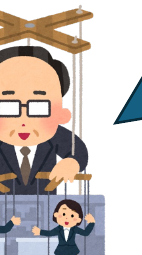

学習意欲を <b>直接</b>上げよう

こういう感じ！

学びの機会/経験 授業 / 先生との話

学習意欲を上げるとは<b>指示やコントロールではなく、方略を味方に、プロセスを生成すること</b>

<!--
- 学習意欲を「直接」上げようとするのではなく、学びの機会・経験を通じてプロセスを生成する。指示・コントロールではなく方略を味方に。
-->

---

学習意欲とは

# 学習意欲 (学びたいモチベーション)とはなにか？

定義

モチベーションとは、望ましい状態や結果に達するために、人が行う個人的な投資である。

Maehr &amp; Meyer (1997) ／邦訳：栗田訳 大学における『学びの場作り』(2014)

役割

<b>学修者のモチベーション</b>は、　学ぶための行動を<b>喚起</b>し、<b>方向づけ</b>、<b>維持</b>する。

Ambrose et al. (2010) ／邦訳：栗田訳 大学における『学びの場作り』(2014)

<b>出来ないこと、知らないことに出会い続ける学びの場</b>において<b>モチベーションの喚起と維持は重要かつ必須</b>

<!--
- 学習意欲＝学びたいモチベーションの定義と役割。望ましい結果へ向かう個人的投資であり、行動を喚起・方向づけ・維持する。学びの場では喚起と維持が必須。
-->

---

どう喚起・維持？

# モチベーションは、どう喚起・維持されるのだろう？

<b>複数のモデルがあります</b>　限界も…

※様々知られたい方は、鹿毛 (2022) モチベーションの心理学など、オススメです。

しかし、授業設計においては、基盤かつ包括的な 
期待 × 価値モデル 
をおさえて下さい

e.g. Wigfield &amp; Eccles (2000) <i>Contemp. Educ. Psychol.</i>

<!--
- モチベーションのモデルは複数あり、限界もある。だが授業設計では、基盤かつ包括的な「期待×価値モデル」をおさえてほしい。
-->

---

ワーク①

# アイスブレイクワーク①

<b>自己紹介 ＆ ご自分が立ち会った</b> 
<b>学習意欲が上がった瞬間</b>を共有して下さい！

<b>① まずは30秒、先生ご自身で、</b> 
　<b>ご自身が立ち会った簡単に学習意欲が上がった瞬間</b>のエピソードを選んで下さい(ありふれた例でOKです)。 
　※ご自身のことでも、教えた学生のことでもOKです

<b>② 各グループ(= 6人ほど) で、1人1分でご紹介下さい。</b>　<b>お名前・専門・エピソード</b>

<b>③ 傾聴と温かいうなずきをお願い致します！</b>

---

アイスブレイク

ワーク①

# ①モチベーションの解像度、あがりましたか？

<b>学習意欲を高める教え方は難しい</b>、 
とお答えいただいた先生もいましたが…

案外簡単？

<!--
- ワーク①のアイスブレイクを終えて。モチベーションの解像度は上がったか。「学習意欲を高める教え方は難しい」と答えた先生も、案外簡単だったのでは。
-->

---

アイスブレイク

ワーク①

# ①モチベーションの解像度、あがりましたか？

<b>学習意欲を高める教え方は難しい</b>、 
とお答えいただいた先生もいましたが…

<h1 style="margin-top:18px;">②意外な話もありましたか？</h1>

内容は多様だったかもしれません。 
全員が学習意欲が上がった瞬間は、結構ありふれてます。

<b style="color:var(--accent);">学生の学習意欲</b>を<b style="color:var(--accent);">高める授業設計は出来る</b>、<b style="color:var(--accent);">という期待</b>を持って下さい！

<!--
- 意外な話もあったのでは。学習意欲が上がる瞬間は、結構ありふれている。だから「学生の学習意欲を高める授業設計は出来る」という期待を持ってほしい。
-->

---

期待とはなにか

# 期待とはなにか

<b>期待</b>：<b>実現可能性</b>(目標達成)への<b>主観的な認識</b>(確率)

<!--
- 期待とは何か。実現可能性（目標達成）への主観的な認識（確率）のこと。
-->

---

期待とはなにか

# 期待とはなにか

<b>期待</b>：<b>実現可能性</b>(目標達成)への<b>主観的な認識</b>(確率)

<svg viewBox="0 0 140 150" width="140" height="150" xmlns="http://www.w3.org/2000/svg">
<path d="M20 40 L45 22 L70 32 L95 22 L120 40 L105 58 L100 50 L100 135 L40 135 L40 50 L35 58 Z" fill="#fff" stroke="#1A6BB0" stroke-width="3" stroke-linejoin="round"/>
<text x="70" y="78" font-size="26" font-weight="800" text-anchor="middle" fill="#222">大谷</text>
<text x="70" y="112" font-size="30" font-weight="800" text-anchor="middle" fill="#222">17</text>
</svg>

↑憧れれるが、 <b>なるのは難しそう</b>

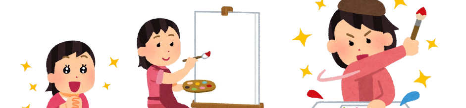

↑段階を踏んで学んで頑張れば、 <b>自分もなれるかもしれない！</b>

<!--
- 先生にも伺う。大谷選手のようになるのは「憧れれるが難しそう」＝期待が低い。一方、段階を踏んで学べば「自分もなれるかもしれない」＝期待が持てる。
-->

---

期待とはなにか

# 期待とはなにか

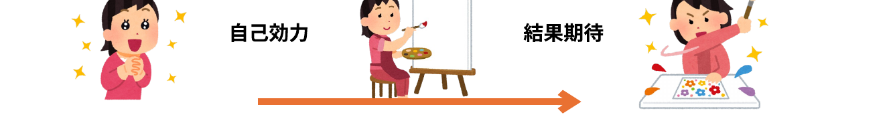

<b>自己効力</b>　<b>自分はできるか？</b>

達成に必要な一連の行動を遂行できるか、という自分の能力に関する主観的な判断。

<b>結果期待</b>　その行動は望ましい結果をもたらすか？<b>(無駄か？)</b>

<!--
- 期待は「自己効力」と「結果期待」に分けられる。自己効力＝自分はできるか（行動を遂行できるかの主観的判断）。結果期待＝その行動は望ましい結果をもたらすか（無駄ではないか）。
-->

---

学習性無力感・回避目標

# 学習性無力感・回避目標

<b>結構、深い問題</b>です。 こんな学生さん、いませんか？

学習性無力感

繰り返し失敗し、何をやっても無駄だ…

回避目標・方略

失敗したくない、能力がないと思われたくない

<b>やれば出来る、諦めるなよ</b>と言い続けても <b>本質的には改善しない</b>

期待を向上させるにはどうすれば良い？

<!--
- 結構深い問題。学習性無力感（繰り返し失敗し何をやっても無駄だ）や、回避目標・方略（失敗したくない、能力がないと思われたくない）。こんな学生はいないか。「やれば出来る、諦めるな」と言い続けても本質的には改善しない。では期待を向上させるにはどうすれば良いか。
-->

---

期待を向上させるには

# Tips 1) 期待を向上させるには

<b>成功するステップを経験</b>し、 <b>出来るようにすること</b>こそが重要

鹿毛 (2022) モチベーションの心理学

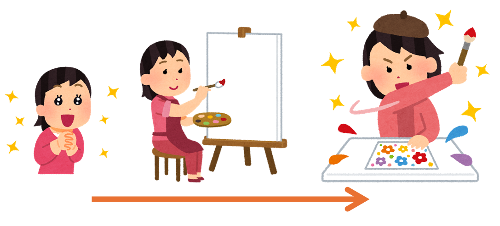

<!--
- ジャンプすれば届く距離。期待を向上させるTips①。成功するステップを経験し、出来るようにすることこそが重要。
-->

---

期待を向上させるには

# Tips 1) 期待を向上させるには

<b>成功するステップを経験</b>し、<b>出来るようにすること</b>こそが重要

<b>①難易度をあわせる (難しくても、簡単でも低下) → 分析</b>

近接目標(達成可能な小さな目標)による成功体験積み上げ

→ 取り組みが<b>2～3割も進捗が違う</b>実験結果あり

Bandura and Schunk (1980) <i>J. Pers. Soc. Psychol.</i>

Ambrose et al. (2010) ／邦訳：栗田訳 大学における『学びの場作り』(2014) p. 90

<!--
- ①難易度をあわせる（難しくても簡単でも低下）→分析。近接目標（達成可能な小さな目標）による成功体験の積み上げで、取り組みが2～3割も進捗が違うという実験結果がある。
-->

---

期待を向上させるには

# Tips 1) 期待を向上させるには

<b>成功するステップを経験</b>し、<b>出来るようにすること</b>こそが重要

<b>①難易度をあわせる (難しくても、簡単でも低下) → 分析</b>

近接目標(達成可能な小さな目標)による成功体験積み上げ

→ 取り組みが<b>2～3割も進捗が違う</b>実験結果あり

Bandura and Schunk (1980) <i>J. Pers. Soc. Psychol.</i>

<b>専門家の盲点</b> 先生はもはや、何が分からなかったかわからなくなっている いちいち説明もしなくなっている

Ambrose et al. (2010) ／邦訳：栗田訳 大学における『学びの場作り』(2014) p. 90

<!--
- 専門家の盲点。先生はもはや、何が分からなかったかわからなくなっている。いちいち説明もしなくなっている。
-->

---

期待を向上させるには

# Tips 1) 期待を向上させるには

cf. Bandura and Schunk (1980) <i>J. Pers. Soc. Psychol.</i>

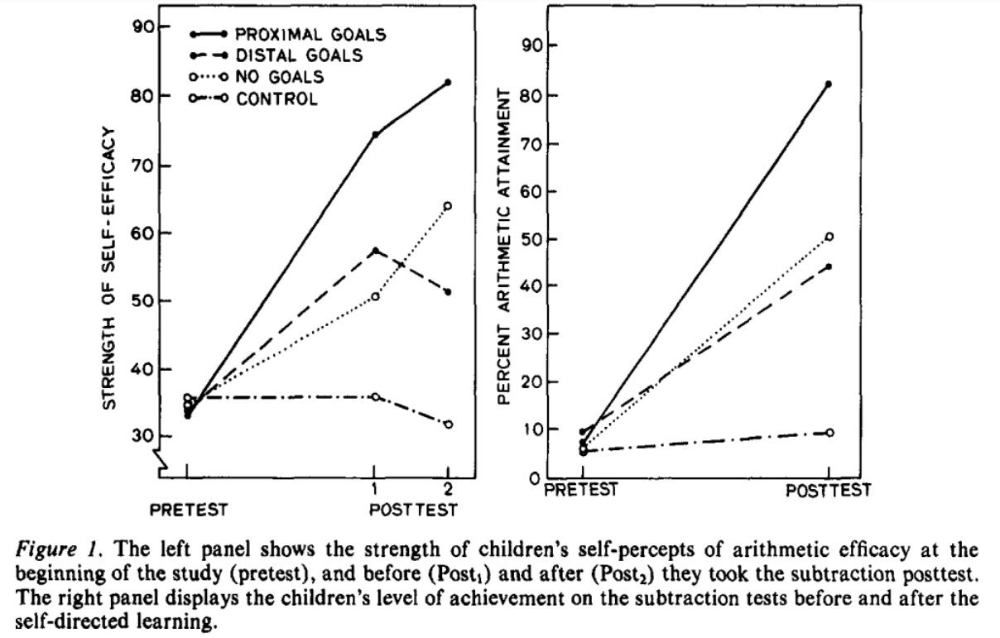

25 %！

<b>自己効力の高さ</b>（左）

<b>テストの成績</b>（右）

近接目標／遠い目標／目標なし／コントロール

<!--
- ジャンプすれば届く距離。Bandura & Schunk (1980)。左パネルが自己効力の高さ、右パネルがテストの成績。近接目標が他の条件（遠い目標・目標なし・コントロール）に比べ大きく向上し、その差は25%にもなる。
-->

---

期待を向上させるには

# Tips 1) 期待を向上させるには

<b>成功するステップを経験</b>し、<b>出来るようにすること</b>こそが重要

<b>①難易度をあわせる (難しくても、簡単でも低下) → 分析</b>

近接目標(達成可能な小さな目標)による成功体験積み上げ

→ 取り組みが<b>2～3割も進捗が違う</b>実験結果あり

Bandura and Schunk (1980) <i>J. Pers. Soc. Psychol.</i>

②学び方の学びを入れる　cf. Finkの意義ある学習目標分類

③的確なフィードバックを与える

Ambrose et al. (2010) ／邦訳：栗田訳 大学における『学びの場作り』(2014) p. 90

<!--
- ②学び方の学びを入れる（cf. Finkの意義ある学習目標分類）。③的確なフィードバックを与える。
-->

---

<!-- _class: refs -->

勉強法

# 参考 勉強法

<b>記憶に意味がない</b>学習法 (スキル向上は別)： 再読、ハイライト、単に書き写す・まとめる

<b>記憶に意味がある学習法</b>： 
<b>アクティブリコール (レトリーブ)</b> (思い出す・白紙に書き出す) 
<b>分散学習</b> (一気に全部ではなく、何回も復習)、など

学而一「学びて時にこれを習ふ、亦た説ばしからずや」

学んだことを、時に応じて反復し、理解を深める、これもまた楽しいことではないか。出典：デジタル大辞泉（小学館） 安川 科学的根拠に基づく最高の勉強法 (2024)

<!--
- 参考。勉強法。記憶に意味がない学習法（再読・ハイライト・書き写し・まとめ。ただしスキル向上は別）。記憶に意味がある学習法（アクティブリコール＝思い出す・白紙に書き出す、分散学習＝何回も復習、など）。学而一「学びて時にこれを習ふ、亦た説ばしからずや」。
-->

---

期待×価値理論

# （再掲）期待×価値理論

<svg viewBox="0 0 1180 470" style="width:100%; height:auto; max-height:430px;" xmlns="http://www.w3.org/2000/svg" font-family="sans-serif">
<rect x="20" y="20" width="700" height="380" rx="6" fill="none" stroke="#2E9E5B" stroke-width="2.5" stroke-dasharray="9 7"/>
<line x1="290" y1="115" x2="490" y2="170" stroke="#9aa0a6" stroke-width="9"/>
<polygon points="490,170 462,158 471,182" fill="#9aa0a6"/>
<line x1="290" y1="320" x2="490" y2="240" stroke="#E08A2B" stroke-width="9"/>
<polygon points="490,240 462,236 470,262" fill="#E08A2B"/>
<rect x="60" y="70" width="225" height="78" rx="14" fill="#fff" stroke="#aaa" stroke-width="3"/>
<text x="172" y="123" text-anchor="middle" font-size="46" font-weight="800" fill="#9aa0a6">期待</text>
<rect x="80" y="160" width="200" height="44" fill="#d9d9d9"/>
<text x="180" y="192" text-anchor="middle" font-size="30" fill="#1a1a1a">目標・結果</text>
<rect x="80" y="212" width="200" height="44" fill="#d9d9d9"/>
<text x="180" y="244" text-anchor="middle" font-size="30" fill="#1a1a1a">自己効力</text>
<rect x="60" y="280" width="225" height="78" rx="14" fill="#fff" stroke="#E08A2B" stroke-width="4"/>
<text x="172" y="333" text-anchor="middle" font-size="46" font-weight="800" fill="#1a1a1a">価値</text>
<rect x="80" y="370" width="200" height="44" fill="#cfe9cf"/>
<text x="180" y="402" text-anchor="middle" font-size="30" fill="#1a1a1a">関連付け</text>
<rect x="500" y="150" width="320" height="150" rx="20" fill="#fff" stroke="#2E7D46" stroke-width="4"/>
<text x="660" y="208" text-anchor="middle" font-size="40" font-weight="800" fill="#1a1a1a">学びの</text>
<text x="660" y="258" text-anchor="middle" font-size="40" font-weight="800" fill="#1a1a1a">モチベーション</text>
<text x="615" y="338" text-anchor="middle" font-size="26" fill="#1a1a1a">維持</text>
<path d="M 645 350 A 55 32 0 0 0 745 348" fill="none" stroke="#C0641A" stroke-width="8"/>
<polygon points="645,350 660,332 670,357" fill="#C0641A"/>
<line x1="820" y1="225" x2="900" y2="225" stroke="#9aa0a6" stroke-width="7"/>
<polygon points="900,225 876,215 876,235" fill="#9aa0a6"/>
<rect x="905" y="190" width="135" height="72" rx="12" fill="#fff" stroke="#aaa" stroke-width="3"/>
<text x="972" y="240" text-anchor="middle" font-size="40" font-weight="800" fill="#9aa0a6">行動</text>
<line x1="1040" y1="225" x2="1080" y2="225" stroke="#9aa0a6" stroke-width="7"/>
<polygon points="1080,225 1056,215 1056,235" fill="#9aa0a6"/>
<rect x="1085" y="190" width="90" height="72" rx="12" fill="#fff" stroke="#aaa" stroke-width="3"/>
<text x="1130" y="240" text-anchor="middle" font-size="36" font-weight="800" fill="#9aa0a6">成果</text>
</svg>

モチベーションとは、 
期待×価値である

<!--
- （再掲）期待×価値理論。モチベーション＝期待×価値。ここでは「価値」側にフォーカスする。
-->

---

価値とはなにか

# 価値とはなにか

<b>価値</b>：学生が<b>授業にどれだけの価値を見いだせる</b>か

<!--
- 価値とは何か。学生が授業にどれだけの価値を見いだせるか。
-->

---

価値とはなにか

# 価値とはなにか

<b>価値</b>：学生が<b>授業にどれだけの価値を見いだせる</b>か

🚗 <b>自動車教習</b>を例に考えてみましょう

<table style="width:100%; border-collapse:collapse; font-size:20px; margin:4px 0;">
<tr style="background:var(--accent); color:#fff;">
<th style="padding:5px 10px; text-align:left; width:150px;">価値の種類</th>
<th style="padding:5px 10px; text-align:left;">意味</th>
<th style="padding:5px 10px; text-align:left;">目的達成後の例</th>
</tr>
<tr style="background:var(--accent-soft);">
<td style="padding:5px 10px; font-weight:800; color:var(--accent-dark);">達成価値</td>
<td style="padding:5px 10px;">習得と達成から満足が得られたか</td>
<td style="padding:5px 10px;">一人で出来た・一冊読んだ 🚗一人で運転/教本読破/試験合格</td>
</tr>
<tr>
<td style="padding:5px 10px; font-weight:800; color:var(--accent-dark);">内発的価値</td>
<td style="padding:5px 10px;">授業のタスクそのものに価値を感じられるか</td>
<td style="padding:5px 10px;">議論がためになる・作業が楽しい 🚗運転楽しい/教官との話有意義</td>
</tr>
<tr style="background:var(--accent-soft);">
<td style="padding:5px 10px; font-weight:800; color:var(--accent-dark);">道具的価値</td>
<td style="padding:5px 10px;">高次の目標達成に役立つか</td>
<td style="padding:5px 10px;">資格取得・卒論や就職後役立つ 🚗免許取得/旅行出来る/就職に有利</td>
</tr>
</table>

<b>価値が多いほど</b>モチベーションが<b>高まる</b>とされる

価値を盛り込み、伝えましょう

<!--
- 価値には達成価値・内発的価値・道具的価値の3種。自動車教習を例に。価値が多いほどモチベーションが高まる。価値を盛り込み伝えましょう。
-->

---

モチベーション向上を体験！

# モチベーション向上を体験！

CR 2

２回目ですが、以下を覚えて下さい。

- モチベーションとは期待と価値の掛け算であるというモデルが<b>期待価値理論</b>である。 
- 学習意欲自体を高めるための方略もあり、<b>ARCSモデル</b>や<b>現場のTips</b>、<b>学びの場づくり</b>があげられる。

と言われたら、どう思いますか？

覚えようと思いましたか

▶ Yes / No

<!--
- この時点で、期待は上がっている。
-->

---

モチベーション向上を体験！

# モチベーション向上を体験！

CR 2

情報を追加します。

- モチベーションとは期待と価値の掛け算であるというモデルが<b>期待価値理論</b>であり、 学習意欲の向上を目指すのに役立つ。 
- 学習意欲自体を高めるための方略もあり、<b>ARCSモデル</b>や<b>現場のTips</b>、<b>学びの場づくり</b>があげられ、 先生ご自身が授業で教えるのが楽しくなるかもしれない。

覚えようと思いましたか

▶ Yes / No

<!--
- さらに、内発的価値や道具的価値を足した。
-->

---

価値を向上させるには

# Tips 2) 自己関連づけ効果と利用価値介入

イーロン・マスク
なにかを覚えるためには、 それに<b>意味を与える</b>必要があります。 <b>なぜこれが自分に関連するのか、説明してみて</b>下さい。 それができれば、多分、覚えられます。

サイエンスの論文
化学の授業内容がどう自分に関連するか、 <b>定期的に時々エッセイを書く → 成績が上がる</b>

Hulleman &amp; Harackiewicz (2009) <i>Science</i>

安川 科学的根拠に基づく最高の勉強法 (2024) p. 156

① 授業内容を学生の関心と結びつける

② 本格的な現実世界の課題を与える

Ambrose et al. (2010) ／邦訳：栗田訳 大学における『学びの場作り』(2014) p. 90

<!--
- ジャンプすれば届く距離
-->

---

価値を向上させるには

# Tips 3) 価値を向上させるには

①将来における<b>教授内容の重要性</b>を示す

② 先生が<b>何に価値をおいているか</b>示し、それを評価する

③ <b>授業内容</b>に対する<b>情熱や意欲</b>を示す

Ambrose et al. (2010) ／邦訳：栗田訳 大学における『学びの場作り』(2014) p. 89

<!--
- ジャンプすれば届く距離
-->

---

授業の目的について

# 参考 授業の目的について

学習者の「<b>主体的学び</b>✨」の支援になること

①主語は<b>学習者</b>とすること

②動詞に<b>注意</b>すること

③<b>多様な価値を含んでいること</b>を示すこと

例：

<b>（私が、）</b>一生健やかな人生を歩む<b>ために</b>（道具的価値）、 
筋トレの背景にある理論、医学的エビデンス、方法を<b>理解し</b>、 
実践を楽しみながら（内発的価値）、 
一人で正しく筋トレする<b>能力を身につける</b>（達成価値）。

<!--
- 授業の目的の書き方：①主語は学習者、②動詞に注意、③多様な価値を含む。筋トレ学の例で道具的・内発的・達成価値を盛り込む。
-->

---

期待×価値理論

# 期待×価値理論

<svg viewBox="0 0 1180 470" style="width:100%; height:auto; max-height:430px;" xmlns="http://www.w3.org/2000/svg" font-family="sans-serif">
<rect x="20" y="20" width="700" height="380" rx="6" fill="none" stroke="#2E9E5B" stroke-width="2.5" stroke-dasharray="9 7"/>
<line x1="290" y1="115" x2="490" y2="170" stroke="#E08A2B" stroke-width="9"/>
<polygon points="490,170 462,158 471,182" fill="#E08A2B"/>
<line x1="290" y1="320" x2="490" y2="240" stroke="#E08A2B" stroke-width="9"/>
<polygon points="490,240 462,236 470,262" fill="#E08A2B"/>
<rect x="60" y="70" width="225" height="78" rx="14" fill="#fff" stroke="#E08A2B" stroke-width="4"/>
<text x="172" y="123" text-anchor="middle" font-size="46" font-weight="800" fill="#1a1a1a">期待</text>
<rect x="80" y="160" width="200" height="44" fill="#cfe9cf"/>
<text x="180" y="192" text-anchor="middle" font-size="30" fill="#1a1a1a">目標・結果</text>
<rect x="80" y="212" width="200" height="44" fill="#cfe9cf"/>
<text x="180" y="244" text-anchor="middle" font-size="30" fill="#1a1a1a">自己効力</text>
<rect x="60" y="280" width="225" height="78" rx="14" fill="#fff" stroke="#E08A2B" stroke-width="4"/>
<text x="172" y="333" text-anchor="middle" font-size="46" font-weight="800" fill="#1a1a1a">価値</text>
<rect x="80" y="370" width="200" height="44" fill="#cfe9cf"/>
<text x="180" y="402" text-anchor="middle" font-size="30" fill="#1a1a1a">関連付け</text>
<rect x="500" y="150" width="320" height="150" rx="20" fill="#fff" stroke="#2E7D46" stroke-width="4"/>
<text x="660" y="208" text-anchor="middle" font-size="40" font-weight="800" fill="#1a1a1a">学びの</text>
<text x="660" y="258" text-anchor="middle" font-size="40" font-weight="800" fill="#1a1a1a">モチベーション</text>
<text x="615" y="338" text-anchor="middle" font-size="26" fill="#1a1a1a">維持</text>
<path d="M 645 350 A 55 32 0 0 0 745 348" fill="none" stroke="#C0641A" stroke-width="8"/>
<polygon points="645,350 660,332 670,357" fill="#C0641A"/>
<line x1="820" y1="225" x2="900" y2="225" stroke="#9aa0a6" stroke-width="7"/>
<polygon points="900,225 876,215 876,235" fill="#9aa0a6"/>
<rect x="905" y="190" width="135" height="72" rx="12" fill="#fff" stroke="#E8A6AE" stroke-width="3"/>
<text x="972" y="240" text-anchor="middle" font-size="40" font-weight="800" fill="#1a1a1a">行動</text>
<line x1="1040" y1="225" x2="1080" y2="225" stroke="#9aa0a6" stroke-width="7"/>
<polygon points="1080,225 1056,215 1056,235" fill="#9aa0a6"/>
<rect x="1085" y="190" width="90" height="72" rx="12" fill="#fff" stroke="#E8A6AE" stroke-width="3"/>
<text x="1130" y="240" text-anchor="middle" font-size="36" font-weight="800" fill="#1a1a1a">成果</text>
</svg>

モチベーションとは、 
期待×価値である

<!--
- 期待×価値理論。期待と価値の両輪がモチベーションを生み、行動・成果につながる。
-->

---

ネガティブ・コメント

# アンケートでのネガティブ・コメント

<b>かなり少ない</b>ですが、ありました

期待：

- なんでも知ってる前提で話されるから 
- 難しい問題も多かった 
- 半分出来なかったと思うから

価値：

- 先生の作品に対する主観的な捉え方や意見がもっと聞きたい。 
- 実際に演習に回す時間をもっと増やしてよいと思った。 
- フィードバックが来ないと不安になる。

<b>辛く感じるのは不要です。方略やプロセスの問題なので。</b>

<!--
- アンケートのネガティブ・コメント。期待・価値それぞれの観点で。辛く感じる必要はなく、方略やプロセスの問題。
-->

---

ルビコンモデル

# 参考 ルビコンモデル

モチベーションが行動として顕在化すると、質が変わる （一気に、行動しやすくなる）

例：布団の中にいる間はモチベーションは上がらない 布団を出来ると、急にやる気が出る

行動しないより、行動したほうが、 モチベーションが維持されやすい

<!--
- ルビコンモデル。モチベーションが行動として顕在化すると質が変わる。布団の例。行動したほうがモチベーションは維持されやすい。
-->

---

方略を学ぶ重要性を考える

# 方略を学ぶ重要性を考える

ワーク②

学習意欲を考えた授業設計は、 なぜ必要なのでしょうか。

ワークシートの中段、「ワーク②」を各自で、記入下さい。 
この時間に、適宜休憩をお取り下さい。 
（記入後の共有の時間はありません）

15:05から、<b>再開</b>します

<!--
- ワーク②。学習意欲を考えた授業設計はなぜ必要か。ワークシート中段に各自記入、適宜休憩。15:05から再開。
-->

---

期待×価値理論

# 期待×価値理論

<svg viewBox="0 0 1080 360" width="1010" xmlns="http://www.w3.org/2000/svg" font-family="sans-serif">
<rect x="6" y="6" width="760" height="290" rx="10" fill="none" stroke="#2E9E5B" stroke-width="2.5" stroke-dasharray="9 7"/>
<rect x="40" y="34" width="190" height="64" rx="14" fill="#fff" stroke="#E08A2B" stroke-width="3.5"/>
<text x="135" y="78" text-anchor="middle" font-size="36" font-weight="800" fill="#1a1a1a">期待</text>
<rect x="50" y="106" width="170" height="34" fill="#DDEFD8"/>
<text x="135" y="131" text-anchor="middle" font-size="24" fill="#1a1a1a">目標・結果</text>
<rect x="50" y="146" width="170" height="34" fill="#DDEFD8"/>
<text x="135" y="171" text-anchor="middle" font-size="24" fill="#1a1a1a">自己効力</text>
<rect x="40" y="196" width="190" height="64" rx="14" fill="#fff" stroke="#E08A2B" stroke-width="3.5"/>
<text x="135" y="240" text-anchor="middle" font-size="36" font-weight="800" fill="#1a1a1a">価値</text>
<rect x="50" y="266" width="170" height="34" fill="#DDEFD8"/>
<text x="135" y="291" text-anchor="middle" font-size="24" fill="#1a1a1a">関連付け</text>
<rect x="350" y="86" width="290" height="124" rx="16" fill="#fff" stroke="#2E7D46" stroke-width="3.5"/>
<text x="495" y="135" text-anchor="middle" font-size="34" font-weight="800" fill="#1a1a1a">学びの</text>
<text x="495" y="178" text-anchor="middle" font-size="34" font-weight="800" fill="#1a1a1a">モチベーション</text>
<line x1="232" y1="66" x2="346" y2="120" stroke="#E08A2B" stroke-width="8" marker-end="url(#ar)"/>
<line x1="232" y1="226" x2="346" y2="172" stroke="#E08A2B" stroke-width="8" marker-end="url(#ar)"/>
<path d="M 430 214 q 65 46 130 0" fill="none" stroke="#C0581A" stroke-width="6" marker-end="url(#arr)"/>
<text x="408" y="232" text-anchor="end" font-size="22" fill="#1a1a1a">維持</text>
<line x1="642" y1="148" x2="800" y2="148" stroke="#bbb" stroke-width="6" marker-end="url(#arg)"/>
<rect x="806" y="112" width="130" height="72" rx="12" fill="#fff" stroke="#E2A6AE" stroke-width="3"/>
<text x="871" y="158" text-anchor="middle" font-size="34" font-weight="800" fill="#1a1a1a">行動</text>
<line x1="940" y1="148" x2="996" y2="148" stroke="#bbb" stroke-width="6" marker-end="url(#arg)"/>
<rect x="1000" y="112" width="130" height="72" rx="12" fill="#fff" stroke="#E2A6AE" stroke-width="3" transform="translate(-58 0)"/>
<text x="1013" y="158" text-anchor="middle" font-size="34" font-weight="800" fill="#1a1a1a">成果</text>
<defs>
<marker id="ar" markerWidth="6" markerHeight="6" refX="3" refY="3" orient="auto"><path d="M0,0 L6,3 L0,6 z" fill="#E08A2B"/></marker>
<marker id="arr" markerWidth="6" markerHeight="6" refX="3" refY="3" orient="auto"><path d="M0,0 L6,3 L0,6 z" fill="#C0581A"/></marker>
<marker id="arg" markerWidth="6" markerHeight="6" refX="3" refY="3" orient="auto"><path d="M0,0 L6,3 L0,6 z" fill="#bbb"/></marker>
</defs>
</svg>

モチベーションとは、 
期待×価値である

<!--
- 期待×価値理論（再掲）。期待（目標・結果／自己効力）と価値（関連付け）が学びのモチベーションを生み、維持され、行動→成果につながる。モチベーションとは、期待×価値である。
-->

---

Tips 4) ARCSモデル

# Tips 4) ARCSモデル

<b>インストラクショナルデザインのモデル</b> 
<b>学習意欲を考えた授業設計</b>の<b>方略集</b>

<b style="color:var(--accent);">A</b>：Attention　　　　学修者の注意・関心

<b style="color:var(--accent);">R</b>：Relevance 　　　学修者との関連性

<b style="color:var(--accent);">C</b>：Confidence　　　学修者の自信

<b style="color:var(--accent);">S</b>：Satisfaction　　 学修者の満足感

授業のチェックリストとして機能する 
面白い話をする (注意) だけではない

ケラー(2009) /邦訳：鈴木監訳 <i>学習意欲をデザインする</i> (2010) p.297

<!--
- Tips 4) ARCSモデル。インストラクショナルデザインのモデルで、学習意欲を考えた授業設計の方略集。A:Attention（注意・関心）R:Relevance（関連性）C:Confidence（自信）S:Satisfaction（満足感）。授業のチェックリストとして機能し、面白い話（注意）だけではない。ケラー(2009)。
-->

---

Tips 4) ARCSモデル

# Tips 4) ARCSモデル

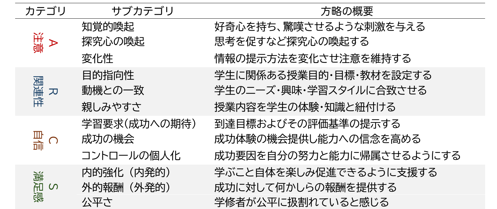

ケラー(2009) /邦訳：鈴木監訳 <i>学習意欲をデザインする</i> (2010) p.297　／　貴学図書館 OPAC ▶

<!--
- Tips 4) ARCSモデル。ARCSの各カテゴリ（注意・関連性・自信・満足感）のサブカテゴリと方略の概要の一覧表。ケラー(2009) p.297。貴学図書館OPACから参照可能。
-->

---

アンケートのポジティブ・コメント

# アンケートのポジティブ・コメント

かなりたくさん、ありました

<b style="color:var(--accent);">A</b>：Attention　注意・関心

参考映像の中には普段滅多に見ないようなものもあったため、いろんな出会いがあった。先生の多彩な知識のおかげで授業が面白かったです。難しい内容であっても、先生の体験談などで面白く説明してくれるのでスっと頭に入ってくる。

<b style="color:var(--accent);">R</b>：Relevance 　学修者との関連性

広範囲かつ芸術に関わる事を重視した授業内容だった。分かりやすくかつ学んだことがどんなことに活用されているのか、実際の例を挙げながら説明していた。

<!--
- アンケートのポジティブ・コメント、かなりたくさんありました。A：Attention（注意・関心）＝参考映像で普段見ないものとの出会い・多彩な知識で授業が面白い・体験談でスッと頭に入る。R：Relevance（関連性）＝広範囲かつ芸術重視の内容・どんなことに活用されているか実例を挙げて説明。
-->

---

アンケートのポジティブ・コメント

# アンケートのポジティブ・コメント

<b style="color:var(--accent);">C</b>：Confidence 学修者の自信

先生たちのアドバイスが的確で、いいところも教えてくれるのでモチベーションの維持に繋がったから。本当にアドバイスが的確。大変助かりました。課題を忘れてしまう事が多く、期限内にあまり出せず不安だったが遅れて提出でも点数が入る仕組みで助かった。

<b style="color:var(--accent);">S</b>：Satisfaction　学修者の満足感

成績評価がシラバスに掲載されている通りだった。質問に対してのフィードバックが厚いので助かっています。授業のやり方が丁寧で一人一人に向き合っていると思いました。

<!--
- アンケートのポジティブ・コメント（続き）。C：Confidence（自信）＝アドバイスが的確で良いところも教えてくれモチベ維持に・遅れて提出でも点数が入る仕組みで助かった。S：Satisfaction（満足感）＝成績評価がシラバス通り・フィードバックが厚い・授業が丁寧で一人一人に向き合っている。
-->

---

グッド・プラクティスさがし

# グッド・プラクティスさがしワーク③

<b>上手い取組みをされている先生を探し、なぜその先生が学習意欲を高めた授業を実現されて</b>いるのかTips (方略)にしてみて下さい。

<b>5〜6人で行う、20分間</b>のワークです。

<b>1.</b> “個人ワーク②”で記入した工夫を共有頂き、良い取組をされている先生を見つけて下さい (5分)

<b>2.</b> その先生の工夫は何でしょうか　インタビューしながら、会場全体に使えるTipsとして言葉にして下さい (12分)　<b>メモ担当の先生はGoogle Docsに記入し、共有して下さい</b>

<b>3.</b> 会場全体で見て見ましょう (3分)

<!--
- ワーク③グッド・プラクティスさがし。上手い取組みをされている先生を探し、なぜ学習意欲を高めた授業を実現されているかをTips（方略）にする。5〜6人で20分。1.個人ワーク②の工夫を共有し良い取組の先生を見つける(5分) 2.その工夫を会場全体に使えるTipsとして言葉に・メモ担当がGoogle Docsに記入(12分) 3.会場全体で見てみる(3分)。
-->

---

Tips 5) 学びの場作り

# Tips 5) 学びの場作り

<b>協力的環境</b>であると感じられると<b>期待・価値の両方</b>に良い影響あり

環境

➡

期待 ▲

価値 ▲

① シラバスと最初で<b>雰囲気を確立</b>する 積極的に聴くことを促進する 包括的な言葉、行動、態度のモデルを示す

② 対立的な緊張には早めに対処する

③ 白黒つけなくても良い/正解は一つとは限らないことを示す

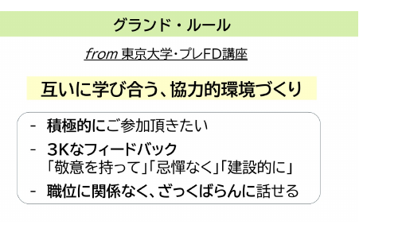

Ambrose et al. (2010) /邦訳：栗田訳 <i>大学における『学びの場作り』</i>(2014) p. 176

<!--
- Tips 5) 学びの場作り。協力的環境であると感じられると期待・価値の両方に良い影響あり（環境→期待▲・価値▲）。①シラバスと最初で雰囲気を確立（積極的に聴くことを促進・包括的な言葉/行動/態度のモデルを示す）②対立的な緊張には早めに対処③白黒つけなくても良い/正解は一つとは限らないことを示す。Ambrose et al. (2010) p.176。
-->

---

学びの場作りの重要性

# 学びの場作りの重要性

米国の事例

<b>クラフトマンシップ</b>の尊重と <b>エクセレンスの文化</b>の形成

① 作品作りや探求を徹底する

② 学修者が自分から学ぶようになる

③ 一般の公立校から学生が羽ばたく

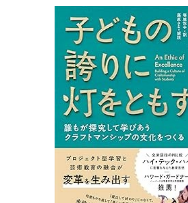

<b>芸術 × 工学</b>がまさに強みとする領域 
(先日MIT行きましたが、芸術×工学でした)

<!--
- 学びの場作りの重要性（米国の事例）。クラフトマンシップの尊重とエクセレンスの文化の形成。①作品作りや探求を徹底②学修者が自分から学ぶようになる③一般の公立校から学生が羽ばたく。芸術×工学がまさに強みとする領域（先日MITも芸術×工学でした）。
-->

---

アクティブ・ラーニング

# アクティブ・ラーニング (主体的で対話的な深い学び)

対話や活動への<b>エンゲージメント</b> 
学生の学習意欲を高める<b>機会</b>にもなり得る

学びの機会/経験 授業 / 先生との話

先生方のご専門の面白さが、学習意欲に繋がはずです

<b>補足) 学生同士での教え合いも有効です</b> 
<b>プロテジェ効果</b>：誰かに教える、教えようとすることで、学習内容の理解が深まる 
プロダクション効果：書いたり、声に出し足したりすると覚える

<!--
- アクティブ・ラーニング（主体的で対話的な深い学び）。対話や活動へのエンゲージメント、学生の学習意欲を高める機会にもなり得る。学びの機会/経験＝授業/先生との話。先生方のご専門の面白さが学習意欲に繋がるはず。補足）学生同士の教え合いも有効：プロテジェ効果（教えることで理解が深まる）、プロダクション効果（書いたり声に出すと覚える）。
-->

---

教員のスタイルの変化

# 教員のスタイルの変化CR 3

以下のどれが、 <b style="font-size:28px;">今後の教員により求められるスタイル</b>でしょう。

A)　　エキスパート(専門家) 
B)　　リーダー 
C)　ファシリテーター 
D)　コーチ 
E)　　友人

<!--
- 教員のスタイルの変化（CR 3）。以下のどれが、今後の教員により求められるスタイルでしょう。A)エキスパート(専門家) B)リーダー C)ファシリテーター D)コーチ E)友人。この時点で期待は上がっている。
-->

---

教員のスタイルの変化

# 教員のスタイルの変化CR 3

以下のどれが、<b>今後の教員により求められるスタイル</b>でしょう。

A)　　エキスパート(専門家) 
B)　　リーダー 
<b style="color:var(--accent);">C)　ファシリテーター</b> 
<b style="color:var(--accent);">D)　コーチ</b> 
E)　　友人

<b>知識に関する専門家</b>から、<b>学びを促進するファシリテーター</b>へ 
Teaching のみならず、<b>Coaching</b>も

まずは、<b>先生方が学生に期待する</b>ことが肝要です

ライゲルース &amp; カノップ (2013) /訳：<i>情報時代の学校をデザインする</i> (2018)

<!--
- 教員のスタイルの変化（CR 3、答え）。今後より求められるのはC)ファシリテーター・D)コーチ。知識に関する専門家から、学びを促進するファシリテーターへ。TeachingのみならずCoachingも。まずは先生方が学生に期待することが肝要。ライゲルース&カノップ(2013)。
-->

---

この研修の活動自体からヒントに

# Tips 5) この研修の活動自体からヒントになること

モチベーションについて<b>お伝えしつつ</b>、先生方の<b>モチベーションに繋がる研修に</b>したい

なぜ、ワーク中心なのか

・学びの場との相互作用が、快い体験をもたらし、モチベーションに繋がるから(<b>効力感</b>)。

・自ら決めると内発的動機づけに繋がるから(<b>自己決定理論</b>)。

どんな、方略？

・期待 × 価値、ARCS

・時間進行 (<b>8 – 20 – 90の法則</b>)　8分毎にワークなどで関与を促し、20分ごとに内容を分ける

ロバート・パイク (2008) / 訳：中村監訳 <i>クリエィティブ・トレーニング・テクニック・ハンドブック</i>　／　<b>メタ認知も重要</b>です

<!--
- Tips 5) この研修の活動自体からヒントになること。なぜワーク中心なのか：モチベーションについてお伝えしつつ、先生方のモチベーションに繋がる研修にしたい。学びの場との相互作用が快い体験をもたらしモチベに繋がる（効力感）。自ら決めると内発的動機づけに繋がる（自己決定理論）。どんな方略？期待×価値、ARCS、時間進行（8-20-90の法則：8分毎にワークで関与、20分ごとに内容を分ける）。ロバート・パイク(2008)。メタ認知も重要。
-->

---

モチベーション作りは、目標？

再掲

モチベーション

<svg width="120" height="220" viewBox="0 0 120 220" xmlns="http://www.w3.org/2000/svg"><defs><marker id="ar61" markerWidth="10" markerHeight="10" refX="5" refY="3" orient="auto"><path d="M0,0 L6,3 L0,6 Z" fill="#E8721C"/></marker></defs><line x1="60" y1="200" x2="60" y2="30" stroke="#E8721C" stroke-width="26" marker-end="url(#ar61)"/></svg>

直接目指させるのではなく…

学修者

目標にむけ取り組んでいると、 <b>学習意欲があがるプロセス</b>を作る

<svg width="100%" height="190" viewBox="0 0 460 190" xmlns="http://www.w3.org/2000/svg" style="margin-top:8px;"><path d="M30,180 C120,40 260,30 360,90 C410,120 440,150 450,180 Z" fill="#8DBF3F"/><path d="M150,178 C200,150 230,120 270,95 C300,78 330,72 360,72" fill="none" stroke="#F2B233" stroke-width="9" stroke-linecap="round"/><rect x="330" y="40" width="40" height="40" fill="#F6E6B0" opacity="0.85"/><text x="350" y="72" font-size="34" fill="#C0182B" font-weight="800" text-anchor="middle">!</text><text x="345" y="34" font-size="26" font-weight="800" fill="#1a1a1a" text-anchor="middle">Goal</text><text x="150" y="120" font-size="26" fill="#C0182B" font-weight="800">!</text><text x="220" y="150" font-size="26" fill="#1A6BB0" font-weight="800">?</text><text x="270" y="135" font-size="26" fill="#C0182B" font-weight="800">!</text></svg>

学習意欲を上げるとは<b>指示やコントロールではなく、</b>　<b>方略を味方に、プロセスを生成すること</b>

<!--
- （再掲）モチベーション作りは目標？ 学修者に直接モチベーションを目指させるのではなく、目標にむけ取り組んでいると学習意欲があがるプロセスを作る。学習意欲を上げるとは指示やコントロールではなく、方略を味方に、プロセスを生成すること。
-->

---

まとめと宣言

ワーク④

<b>本日、気づかれたり学ばれたりした内容をもとに、今後授業で取り入れられたいことを3つ述べて下さい。</b>

2〜3人で行う5分間のワークです。

① “ワーク④” に取り入れられたい点を各自で記載下さい（2分）

② そのうちもっとも重要なことを3人でご共有下さい（2分） ポジティブなフィードバックをお願い致します。

③ グループでもっとも印象的な点を1点か2点、メモ担当の先生がGoogle Docsにご記載下さい（1分）

<!--
- まとめと宣言（ワーク④）。本日気づかれた・学ばれた内容をもとに、今後授業で取り入れたいことを3つ述べる。2〜3人で5分。①各自で記載（2分）②もっとも重要なことを3人で共有・ポジティブFB（2分）③印象的な点を1〜2点メモ担当がGoogle Docsに記載（1分）。
-->

---

(再掲) 今日の俯瞰図

<b>理論</b>

自己効力 <b style="color:var(--accent-dark);">期待</b> 関連付け <b style="color:var(--accent-dark);">価値</b> 目標・結果

<b style="color:#2E7D46;">環境</b>

モチベーションって何？

喚起 ↘

学びの モチベーション

行動
→
成果

↑ 維持

「学びの場づくり」

道具箱

ARCS AL 現場Tips etc…

実践

<!--
- （再掲）今日の俯瞰図。理論＝学びのモチベーション（自己効力・期待／関連付け・価値／目標・結果）を喚起・維持。行動→成果。実践＝道具箱（ARCS・AL・現場Tips等）と「学びの場づくり」（環境）。理論と実践の全体像。
-->

---

おわりに

①

宣言は、<b>先生方自身が到達された</b>内容です。

ご自身に拍手して下さい。そして、選ばれたTipsを大切にして下さい。

②

皆様には、<b>仲間であり味方である先生方</b>がいます。

③

「馬を水辺に連れていけても水を飲ませることはできない」

方略は100%のものではありません。限界もあります。学ぶかどうかを最終的に決めるのは、<b>学修者自身</b>です。悩みすぎず、上手くいかなければ次、の試行錯誤が肝要です。

<!--
- おわりに。①宣言は先生方自身が到達された内容（ご自身に拍手・選んだTipsを大切に）。②皆様には仲間であり味方である先生方がいる。③「馬を水辺に連れていけても水を飲ませることはできない」＝方略は100%ではなく限界もある。学ぶかを決めるのは学修者自身。悩みすぎず、次の試行錯誤が肝要。
-->

---

3つの質問の振り返り

CR 4

質問① プレ - ポスト

学習意欲を高める教え方についてご自身はどのくらい自信をお持ちですか。主観で構いませんので、お答え下さい。

質問②

学習意欲の向上を目指した授業設計を取り入れてみたいですか。

<b>呼びかけ③：グッドマークを押してください</b> 
東京工芸大での学びを、もっと良くしていきましょう！

<!--
- 3つの質問の振り返り（CR 4）。質問①プレ-ポスト：学習意欲を高める教え方にどのくらい自信があるか（主観でOK）。質問②：学習意欲の向上を目指した授業設計を取り入れてみたいか。呼びかけ③：グッドマークを押してください。東京工芸大での学びをもっと良くしていきましょう！
-->

---

<!-- _class: divider -->

質疑応答

# ご清聴、ありがとうございました

質問がある方は、<b style="color:#fff;">挙手</b>か<b style="color:#fff;">Comment Screen</b>まで送付ください

<!--
- 質疑応答。ご清聴ありがとうございました。質問がある方は挙手かComment Screenまで送付ください。
-->

---

教えない授業

参考

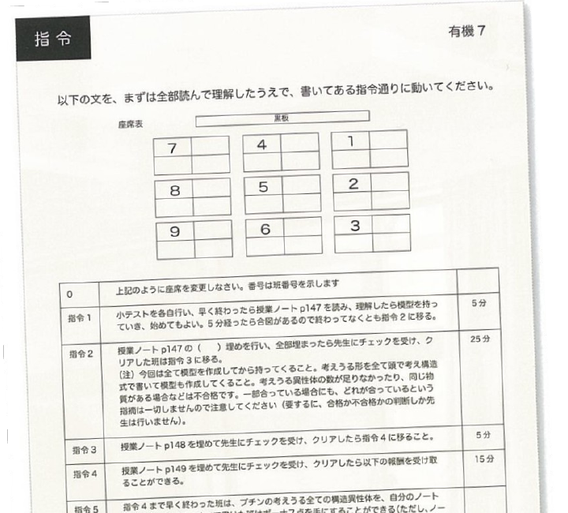

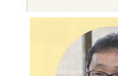

宮崎県高校教諭 化学→探求

<b>化学：</b>『指令書』で学生が自発的に学び、教え合う

<b>探求：</b>通信制夜間部で、学生のやる気のきっかけを創る

<b>Teaching から Coachingへ</b> <b>『学生に時間を返す』運動</b>

山辺 他 (2017) <i>ひとはもともとアクティブ・ラーナー！</i>

<!--
- 参考）教えない授業。宮崎県高校教諭（化学→探求）。化学：『指令書』で学生が自発的に学び教え合う。探求：通信制夜間部で学生のやる気のきっかけを創る。TeachingからCoachingへ、『学生に時間を返す』運動。山辺他(2017)。
-->

---

スマホ・RPGができるなら

参考

スマホや、ゲームは、何も勉強しなくても、使っているうちにできるようになる。

<b>勉強だと思って、構える</b>からできない。 
<b>遊びだと思って、使って</b>みるとできる。

工学や芸術など、具体的なモノや、環境とのインタラクションがある場では、勉強せずに学べる。大学入試まで来れる子に、できない子はいない。だから学生の問題ではなく、きっかけの問題なのだ。

<!--
- 参考）スマホ・RPGができるなら。スマホやゲームは何も勉強しなくても使っているうちにできるようになる。勉強だと思って構えるからできない、遊びだと思って使ってみるとできる。工学や芸術など具体的なモノ・環境とのインタラクションがある場では勉強せずに学べる。大学入試まで来れる子にできない子はいない。学生の問題ではなく、きっかけの問題なのだ。
-->

---

生理学的なモチベーション

参考

ドーパミン

中脳辺縁系の脳の部位が、<b>ドーパミンで刺激</b>されると、<b>モチベーションが上がる</b>とされます

<b>何かをしたい</b>と思ったときに、ドーパミンが出て、快楽感につながっています

ノルアド レナリン

締切に遅れそう！危険！など、不快を避けたり、やばいときに多く出ます

ガチャの場合、当たったときも出ますが、<b>当たる前のワクワク感</b>で一番出ているそうです。ドーパミンを意図的に出させる設計のものは枚挙に暇がありません（ガチャ、ゲーム、パチンコ、YouTube ショート...）

でも、新しい情報を学ぶ期待を持ったときは、<b>たとえ学習</b>であっても、ドーパミンは出るのだそうです。<b>わからないこと</b>を一旦考える、メタ認知が重要です

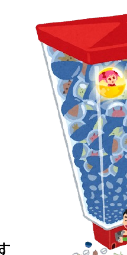

参考：https://www.kobe-np.co.jp/rentoku/feature/202108/0014554529.shtml

<!--
- 参考）生理学的なモチベーション。ドーパミン＝中脳辺縁系がドーパミンで刺激されるとモチベーションが上がる。何かをしたいと思ったときに出て快楽感に。ノルアドレナリン＝締切や危険など不快を避けるとき多く出る。ガチャは当たる前のワクワク感で一番出る。意図的に出させる設計（ガチャ・ゲーム・パチンコ・YouTubeショート）。でも新しい情報を学ぶ期待を持つと学習でもドーパミンは出る、メタ認知が重要。
-->

---

「問い」のデザイン①

参考

<b>「創造的対話」の定義</b> 
新しい意味やアイデアが創発する対話のこと 
居心地が良い カフェ VS 危険だけど居心地が良いカフェ

<b>「問い」の定義</b> 
人々が創造的対話と通して認識と関係性を編み直すための媒体

<table style="width:100%; margin-top:14px; border-collapse:collapse; font-size:23px; margin-right:calc(var(--pip-w) + 8px);">
<thead>
<tr style="background:var(--accent); color:#fff;">
<th style="padding:8px 12px;"></th><th style="padding:8px 12px;">問う側</th><th style="padding:8px 12px;">問われる側</th><th style="padding:8px 12px;">機能</th>
</tr>
</thead>
<tbody>
<tr style="background:var(--accent-soft);"><td style="padding:7px 12px; font-weight:800;">質問</td><td style="padding:7px 12px;">答えを知らない</td><td style="padding:7px 12px;">答えを知っている</td><td style="padding:7px 12px;">情報を引き出す</td></tr>
<tr><td style="padding:7px 12px; font-weight:800;">発問</td><td style="padding:7px 12px;">答えを知っている</td><td style="padding:7px 12px;">答えを知らない</td><td style="padding:7px 12px;">考えさせるため</td></tr>
<tr style="background:var(--accent-soft);"><td style="padding:7px 12px; font-weight:800;">問い</td><td style="padding:7px 12px;">答えを知らない</td><td style="padding:7px 12px;">答えを知らない</td><td style="padding:7px 12px;">創造的対話を促す</td></tr>
</tbody>
</table>

<!--
- 参考）「問い」のデザイン①。「創造的対話」の定義＝新しい意味やアイデアが創発する対話（居心地が良いカフェVS危険だけど居心地が良いカフェ）。「問い」の定義＝人々が創造的対話を通して認識と関係性を編み直すための媒体。質問／発問／問いの違い（問う側・問われる側が答えを知っているか、機能）。
-->

---

「問い」のデザイン②

参考

<b>良いアイスブレイクの問のポイント (①〜③の3アイスを壊す)</b> 
①固定観念を揺さぶる 
②集団の関係性を揺さぶる 
③警戒と緊張を解す 
④テーマと接続させる

<b>ファシリテーター</b>：ファシリテーションをする人 
<b>ファシリテーション</b>：<b>問題の本質を捉え直し、解くべき課題を定義し、問題解決のプロセスに伴走する</b>こと

<table style="width:100%; margin-top:12px; border-collapse:collapse; font-size:21px; margin-right:calc(var(--pip-w) + 8px);">
<thead>
<tr style="background:var(--accent); color:#fff;">
<th style="padding:6px 10px;">タイプ</th><th style="padding:6px 10px;">問う側</th><th style="padding:6px 10px;">問う側スタンス</th><th style="padding:6px 10px;">問われる側</th>
</tr>
</thead>
<tbody>
<tr style="background:var(--accent-soft);"><td style="padding:6px 10px; font-weight:800;">シンプル</td><td style="padding:6px 10px;">答えを持っていない</td><td style="padding:6px 10px;">知りたい→</td><td style="padding:6px 10px;">不明</td></tr>
<tr><td style="padding:6px 10px; font-weight:800;">ティーチング</td><td style="padding:6px 10px;">答えを持っている</td><td style="padding:6px 10px;">気づかせる→</td><td style="padding:6px 10px;">答えを持っていない</td></tr>
<tr style="background:var(--accent-soft);"><td style="padding:6px 10px; font-weight:800;">コーチング</td><td style="padding:6px 10px;">答えを持っていない</td><td style="padding:6px 10px;">←引き出す</td><td style="padding:6px 10px;">答えを持っている</td></tr>
<tr><td style="padding:6px 10px; font-weight:800;">フィロソフィカル</td><td style="padding:6px 10px;">答えを持っていない</td><td style="padding:6px 10px;">←共に考える→</td><td style="padding:6px 10px;">答えを持っていない</td></tr>
</tbody>
</table>

安斎・塩瀬 (2020) <i>問いのデザイン</i>

<!--
- 参考）「問い」のデザイン②。良いアイスブレイクの問のポイント（①〜③の3アイスを壊す）：①固定観念を揺さぶる②集団の関係性を揺さぶる③警戒と緊張を解す④テーマと接続させる。ファシリテーター＝ファシリテーションをする人。ファシリテーション＝問題の本質を捉え直し、解くべき課題を定義し、問題解決のプロセスに伴走すること。問いのタイプ（シンプル／ティーチング／コーチング／フィロソフィカル）。安斎・塩瀬(2020)。
-->

---

情報化時代の教育パラダイム

参考

<table style="width:100%; margin-top:10px; border-collapse:collapse; font-size:22px; margin-right:calc(var(--pip-w) + 8px);">
<thead>
<tr style="background:var(--accent); color:#fff;">
<th style="padding:8px 12px; text-align:left;"></th><th style="padding:8px 12px;">工業時代</th><th style="padding:8px 12px;">情報化時代</th>
</tr>
</thead>
<tbody>
<tr style="background:var(--accent-soft);"><td style="padding:7px 12px; font-weight:800;">キーワード</td><td style="padding:7px 12px;">標準化/画一的</td><td style="padding:7px 12px;">カスタマイズ/多様性</td></tr>
<tr><td style="padding:7px 12px; font-weight:800;">学修者の関係</td><td style="padding:7px 12px;">競争的</td><td style="padding:7px 12px;">協働的</td></tr>
<tr style="background:var(--accent-soft);"><td style="padding:7px 12px; font-weight:800;">学修者に 求められる能力</td><td style="padding:7px 12px;"><b>従順さ、持久力、普通さ、時間内に間に合わせること</b></td><td style="padding:7px 12px;"><b>主体性と自律性</b> (動機づけと自尊心の重要性)</td></tr>
<tr><td style="padding:7px 12px; font-weight:800;">教員の役割</td><td style="padding:7px 12px;">専門家によるサービス</td><td style="padding:7px 12px;">セルフサービス：学生に時間を渡す (ファシリテーター・コーチ)</td></tr>
<tr style="background:var(--accent-soft);"><td style="padding:7px 12px; font-weight:800;">授業進度</td><td style="padding:7px 12px;"><b>時間ベース</b></td><td style="padding:7px 12px;"><b>到達ベース</b></td></tr>
<tr><td style="padding:7px 12px; font-weight:800;">評価</td><td style="padding:7px 12px;">序列をつけるもの</td><td style="padding:7px 12px;">フィードバック</td></tr>
</tbody>
</table>

ライゲルース &amp; カノップ (2013) /訳：稲垣ほか 訳 <i>情報時代の学校をデザインする</i> (2018)

<!--
- 参考）情報化時代の教育パラダイム。工業時代 vs 情報化時代。キーワード：標準化/画一的→カスタマイズ/多様性。学修者の関係：競争的→協働的。求められる能力：従順さ・持久力・普通さ→主体性と自律性（動機づけと自尊心）。教員の役割：専門家によるサービス→セルフサービス（学生に時間を渡す・ファシリテーター/コーチ）。授業進度：時間ベース→到達ベース。評価：序列→フィードバック。ライゲルース&カノップ(2013)。
-->

---

反転授業

# 反転授業参考

事前に基礎知識に関する(メディア)学習をして， 
<b>授業では議論・演習を行うブレンド型</b>の一つ

▶医学部等でも<b>実践論文</b>あり / Stanfordの取組が有名

高度化型

<ul>
<li><b>「理解」</b>をオンデマンド</li>
<li><b>高次目標</b>を演習や実験で</li>
</ul>

完全習得型

<ul>
<li><b>「理解」</b>をオンデマンド</li>
<li><b>理解の確認や質問</b>を教室で</li>
</ul>

✔アクティブラーニングを取り入れ教育効果を高めやすい 
✔教員は多様な学生に対応しやすく、効率化もしやすい 
✔学生は疑問点や関心をもって授業に取り組める

<!--
- 反転授業：事前に基礎知識をメディアで学び、授業では議論・演習を行うブレンド型。医学部でも実践論文があり、Stanfordの取組が有名。高度化型と完全習得型がある。アクティブラーニングを取り入れやすく、教員も学生もメリットがある。
-->

---

オンライン授業の Good Practice

# オンライン授業のGood Practice参考

手間を掛けずに、学習者のモチベーションが上がる授業

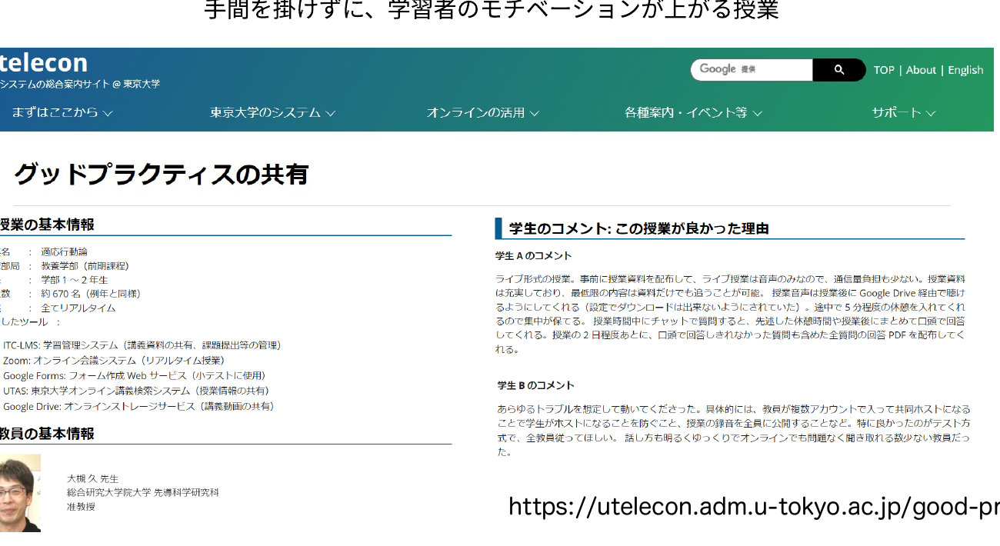

https://utelecon.adm.u-tokyo.ac.jp/good-practice/

<!--
- 東京大学のutelecon「グッドプラクティスの共有」。手間を掛けずに学習者のモチベーションが上がる授業の事例集。
-->

---

アクティブ・ラーニング

# アクティブ・ラーニング参考

教員と学生が意思疎通を図りつつ、<b>一緒になって</b>切磋琢磨し、相互に刺激を与えながら知的に成長する場を創り、<b>学生が主体的に問題を発見し、解を見出していく能動的学修</b>(文科省 2012)

▶手法：沢山ある (問いかけ、シンク・ペア・シェア、ジグゾー法、ピアインストラクション、PBL etc…)

▶実装方法：教員がする or TA/学修者で双方向性を創る

<b>双方向性・主体性のある学びを実現する方法論</b>

学修者が<b>主体性をもつきっかけ</b>になりえる 
授業の目的上、適切ならば<b>積極的に利用</b>する 
<b>学習者が聴くだけの授業は終わりにしよう</b>

<!--
- アクティブ・ラーニング：教員と学生が一緒になって切磋琢磨し、学生が主体的に問題を発見し解を見出す能動的学修（文科省2012）。手法は多様。双方向性・主体性のある学びを実現する方法論。学習者が聴くだけの授業は終わりにしよう。
-->

---

アクティブ・ラーニングの効果

# アクティブ・ラーニングの効果参考

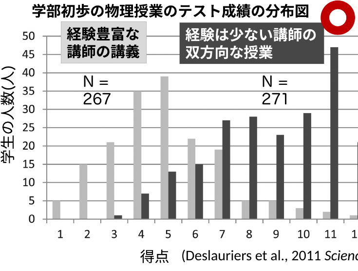

適切な講習を受け、 
双方向性・主体性のある学習を取り入れると、 
若い教員も良い授業ができる!

<b>注意：</b>アクティブラーニングすること自体が授業の目的ではない 
アクティブ・ラーニングは手段 <b>(効果がない事例も多数)</b>

Deslauriers et al., 2011 <i>Science</i>

<!--
- 学部初歩の物理授業のテスト成績分布。経験豊富な講師の講義（N=267）より、経験は少ない講師の双方向な授業（N=271）の方が高得点。適切な講習を受け双方向性・主体性のある学習を取り入れると、若い教員も良い授業ができる。ただしアクティブラーニング自体は目的ではなく手段（効果がない事例も多数）。
-->

---

モチベーションへの誤解

# モチベーションへの誤解参考

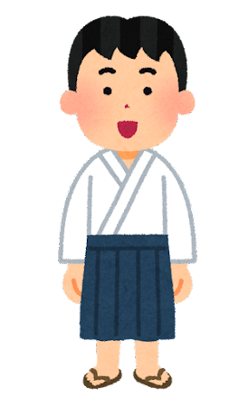

モチベーションは、学生が自分自身で 
見つけるものだろ？

いいえ。 
維持と喚起は、必要です。 
<b>どなたでもできる方略</b>があります。

<!--
- モチベーションは学生が自分自身で見つけるもの、という誤解。いいえ。維持と喚起は必要で、どなたでもできる方略があります。
-->

---

90-20-8の法則

# 90-20-8の法則参考

<b>内容を20分毎にわける</b>

理解しながら聞けるのは<b>90分</b>まで

記憶に残しながら聞けるのは<b>20分</b>まで

<b>8分ごと</b>に参画させる

ロバート・パイク, 2008

学生の集中度合い

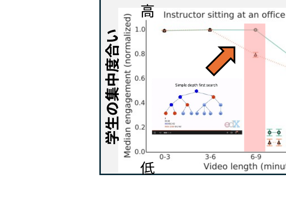

<b>大規模オンラインコースの分析</b> <b>6 ~ 9分を超えると集中力低下</b>

Guo et al, 2014

<!--
- 90-20-8の法則（ロバート・パイク2008）：理解しながら聞けるのは90分、記憶に残せるのは20分、8分ごとに参画させる。内容を20分毎にわける。Guoら2014の大規模オンラインコース分析でも、6〜9分を超えると集中力が低下する。
-->

---

最近接発達領域

# 最近接発達領域参考

どの難易度で教えるか？　<b>受講前は自力でできないが、受けたら自力で出来るようになる</b>

<svg viewBox="0 0 360 280" xmlns="http://www.w3.org/2000/svg" style="width:100%;">
<ellipse cx="180" cy="140" rx="175" ry="135" fill="#E9EEF5" stroke="#8AA0C0" stroke-width="2"/>
<ellipse cx="180" cy="150" rx="130" ry="100" fill="#FCEFDD" stroke="#E08A2B" stroke-width="2"/>
<ellipse cx="180" cy="162" rx="78" ry="56" fill="#FBE4EA" stroke="#CC003D" stroke-width="2"/>
<text x="180" y="36" text-anchor="middle" font-size="15" font-weight="800" fill="#33415c">援助や協同があっても出来ない</text>
<text x="180" y="92" text-anchor="middle" font-size="15" font-weight="800" fill="#8a4b00">援助や協同があれば出来る</text>
<text x="180" y="158" text-anchor="middle" font-size="16" font-weight="800" fill="#8E0029">自力で</text>
<text x="180" y="180" text-anchor="middle" font-size="16" font-weight="800" fill="#8E0029">出来る</text>
<text x="180" y="232" text-anchor="middle" font-size="14" font-weight="800" fill="#8E0029">最近接発達領域</text>
</svg>

Vygotsky (1978)

伝えたいことは沢山あるかもですが、多すぎては身になりません

<b>最近接発達領域</b>に<b>内容を絞り</b>ましょう

個人差がある場合は、<b>参考資料・補完教材</b>を使用しましょう

<b>足場かけ (Scaffolding)：</b>他者の援助や協同で出来る状態にする　／　<b>足場外し (Fading)：</b>他者の援助や協同を徐々に減らし独り立ち

<!--
- 最近接発達領域（Vygotsky 1978）：自力で出来る／援助や協同があれば出来る／あっても出来ない、の三層。受講前は自力でできないが受けたら出来るようになる範囲を狙う。内容を最近接発達領域に絞る。個人差があれば参考資料・補完教材を使う。足場かけ（Scaffolding）で出来る状態にし、足場外し（Fading）で独り立ちさせる。
-->

---

専門家の盲点

# 専門家の盲点参考

今のあなた：熟達者

無意識にできる

⇔

昔のあなた・学生：見習い

できること わかりにくいこと 面白いこと <b>すべて異なる</b>

<b>専門家の盲点</b>：専門家は、無意識にできてしまうために <b>学習者が何がわからないか分からない</b>

教師は<b>学習内容をわかっていても、学習者を理解できないこと</b>を前提とし、<b>学習者の意見・反応を意識的に盛り込む</b>のが望ましい

アンブローズ (2014)

<!--
- 専門家の盲点（アンブローズ2014）：今のあなたは熟達者で無意識にできる。昔のあなた・学生は見習い。できること・わかりにくいこと・面白いことはすべて異なる。専門家は無意識にできるため学習者が何が分からないか分からない。学習内容を分かっていても学習者を理解できないことを前提に、学習者の意見・反応を意識的に盛り込むのが望ましい。
-->

---

ガニエの9教授事象

# ガニエの9教授事象参考

<b>認知プロセス</b>に沿った教え方

授業の<b>時間</b>を<b>どうデザインするか</b>

それぞれの流れに於いて、<b>何をするべきか</b>

関心をもち、価値を知り、説明を受け、体験の機会を得て、記憶に残り、使える知識になる

<table style="width:100%; border-collapse:collapse; font-size:20px;">
<tr style="background:var(--accent); color:#fff;">
<th style="padding:5px 8px; border:1px solid #ccc;">時間配分</th><th style="padding:5px 8px; border:1px solid #ccc;">流れ</th><th style="padding:5px 8px; border:1px solid #ccc;">ガニエの9教授事象</th>
</tr>
<tr><td style="padding:5px 8px; border:1px solid #ccc; text-align:center;">5-15分</td><td style="padding:5px 8px; border:1px solid #ccc; font-weight:800; background:var(--accent-soft);">導入</td><td style="padding:5px 8px; border:1px solid #ccc;">学習者の注意を喚起する 学習目標を知らせる 前提条件を思い出させる</td></tr>
<tr><td style="padding:5px 8px; border:1px solid #ccc; text-align:center;">70-80分</td><td style="padding:5px 8px; border:1px solid #ccc; font-weight:800; background:var(--accent-soft);">展開</td><td style="padding:5px 8px; border:1px solid #ccc;">新しい事項を提示する 学習の指針を与える 練習の機会をつくる フィードバックをする</td></tr>
<tr><td style="padding:5px 8px; border:1px solid #ccc; text-align:center;">5-10分</td><td style="padding:5px 8px; border:1px solid #ccc; font-weight:800; background:var(--accent-soft);">まとめ</td><td style="padding:5px 8px; border:1px solid #ccc;">学習の成果を評価する 学習の保持と転移を促す</td></tr>
</table>

ガニエ他 2005／表は 栗田他(2017) /FFP資料より

<!--
- ガニエの9教授事象（ガニエ他2005）：認知プロセスに沿った教え方。授業の時間をどうデザインするか、それぞれの流れで何をするべきか。導入（5-15分）・展開（70-80分）・まとめ（5-10分）に9つの事象を配置する。関心をもち、価値を知り、説明を受け、体験し、記憶に残り、使える知識になる。
-->

---

Bloomの教育目標分類

# Bloomの教育目標分類参考

教育心理学者Bloomらにより、<b>8年かけて作られた教育における目標の分類</b>

<table style="width:100%; border-collapse:collapse; font-size:18px; margin-top:8px;">
<tr style="background:var(--accent); color:#fff;">
<th style="padding:4px 6px; border:1px solid #ccc;"></th>
<th style="padding:4px 6px; border:1px solid #ccc;">認知的領域 (知識や思考)</th>
<th style="padding:4px 6px; border:1px solid #ccc;">精神運動的領域 (技能やスキル)</th>
<th style="padding:4px 6px; border:1px solid #ccc;">情意的領域 (態度)</th>
</tr>
<tr><td style="padding:4px 6px; border:1px solid #ccc; font-weight:800; background:var(--accent-soft); text-align:center;">高次</td><td style="padding:4px 6px; border:1px solid #ccc;">創造 (学習を応用し、新しい価値を作れる)</td><td style="padding:4px 6px; border:1px solid #ccc;"></td><td style="padding:4px 6px; border:1px solid #ccc;"></td></tr>
<tr><td style="padding:4px 6px; border:1px solid #ccc;"></td><td style="padding:4px 6px; border:1px solid #ccc;">評価 (事物・判断等を比較し、評価出来る)</td><td style="padding:4px 6px; border:1px solid #ccc;">自然化 (習慣的な動作として行える)</td><td style="padding:4px 6px; border:1px solid #ccc;">個性化 (自身の世界観を持ち行動を促せる)</td></tr>
<tr><td style="padding:4px 6px; border:1px solid #ccc;"></td><td style="padding:4px 6px; border:1px solid #ccc;">分析 (要素に分け、関係性を指摘できる)</td><td style="padding:4px 6px; border:1px solid #ccc;">分節化 (複数動作を組み合わせ調和できる)</td><td style="padding:4px 6px; border:1px solid #ccc;">組織化 (複数の価値の相互関係を設定する)</td></tr>
<tr><td style="padding:4px 6px; border:1px solid #ccc;"></td><td style="padding:4px 6px; border:1px solid #ccc;">応用 (他の場面や状況に使用できる)</td><td style="padding:4px 6px; border:1px solid #ccc;">精密化 (臨機応変な動作が出来る)</td><td style="padding:4px 6px; border:1px solid #ccc;">価値づけ (価値を理解し自分のものとする)</td></tr>
<tr><td style="padding:4px 6px; border:1px solid #ccc;"></td><td style="padding:4px 6px; border:1px solid #ccc;">理解 (学習内容を説明出来る)</td><td style="padding:4px 6px; border:1px solid #ccc;">巧妙化 (示された動作を誤りなく行える)</td><td style="padding:4px 6px; border:1px solid #ccc;">反応 (新しい現象に能動的に反応する)</td></tr>
<tr><td style="padding:4px 6px; border:1px solid #ccc; font-weight:800; background:var(--accent-soft); text-align:center;">低次</td><td style="padding:4px 6px; border:1px solid #ccc;">記憶 (事実や概念を暗記している)</td><td style="padding:4px 6px; border:1px solid #ccc;">模倣 (示された動作を真似できる)</td><td style="padding:4px 6px; border:1px solid #ccc;">受け入れ (新たな現象に注意を向ける)</td></tr>
</table>

1956年に認知的領域、1964年に情意的領域。精神運動領域は1972年の別のグループの仕事。認知的領域はAndersonらの改訂版を使用。　(梶田, 2010や栗田&中村, 2023を元に作成)

<!--
- Bloomの教育目標分類：8年かけて作られた教育目標の分類。認知的領域（知識や思考）・精神運動的領域（技能やスキル）・情意的領域（態度）の3領域を、低次から高次へ段階化したもの。梶田2010や栗田&中村2023を元に作成。
-->

---

ダイバーシティ & インクルーシブ

# 教室もダイバーシティ &amp; インクルーシブ参考

<b>✘ 教師に合わせる　○ 学習者に合わせる</b>

支援が必要な学生さんはいないか <b>(色覚→赤注意、その他)</b> 
<b>例：</b>”色のシミュレータ” アプリ on iPhone/Android

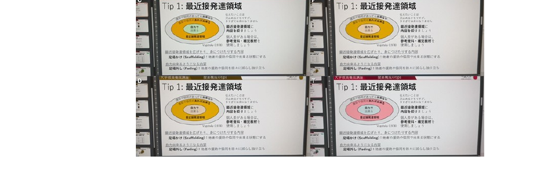

<b>インタラクションは学修者を知るチャンス</b>

分かりやすい説明と思考は人により異なる <b>(認知特性・背景)</b> 
<b>例 会社時代のストーリー：</b>　自分の話は、ビジョンや絵で思考する人には伝わるけど、文字思考の人には伝わりにくい

<!--
- 教室もダイバーシティ＆インクルーシブ。教師に合わせるのではなく学習者に合わせる。色覚など支援が必要な学生がいないか、「色のシミュレータ」アプリで確認できる。インタラクションは学修者を知るチャンス。分かりやすい説明は人により異なる（認知特性・背景）。会社時代の例：ビジョンや絵で思考する人には伝わるが、文字思考の人には伝わりにくかった。
-->

---

学習意欲の第一原理

# 学習意欲の第一原理参考

学習への意欲は、次のときに増進される。 
1. 学修者の好奇心が現在の知識のなかのギャップを知覚して刺激されたとき 
2. 学ぶべき知識が学修者のゴールへ有意義に関連があると気づいたとき 
3. 学修者が学習課題をマスターすることに成功できると思うとき 
4. 学修者が学習課題に満足な結果を予想し経験するとき 
更に、
5. 学修者が彼らの意図を保護するために意志（自己調整）の方略を使うとき、増進され、かつ、維持される。

ケラー(2009) /邦訳：鈴木監訳 学習意欲をデザインする (2010) p.319

<!--
- 学習意欲の第一原理（ケラー2009、邦訳：鈴木監訳『学習意欲をデザインする』2010 p.319）。学習への意欲は、①好奇心が知識のギャップを知覚して刺激されたとき、②学ぶべき知識がゴールへ有意義に関連すると気づいたとき、③課題をマスターできると思うとき、④満足な結果を予想し経験するときに増進される。さらに⑤意図を保護する意志（自己調整）の方略を使うとき、増進され維持される。
-->

---

メディア授業の評価

# メディア授業の評価参考

対面&gt;ライブ講義~オンデマンド&gt;オンラインアクティブラーニング

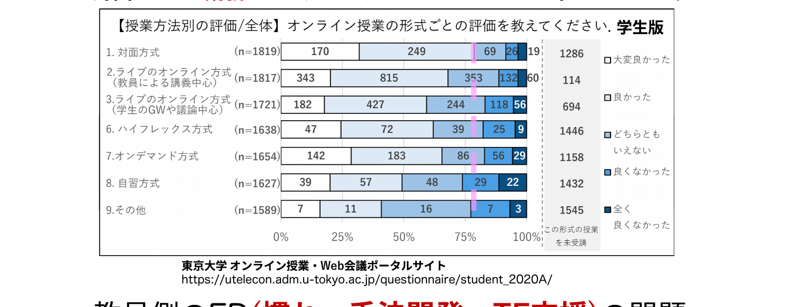

学生版

<b>教員側のFD</b> (慣れ・手法開発・TF支援) の問題

東京大学 オンライン授業・Web会議ポータルサイト https://utelecon.adm.u-tokyo.ac.jp/questionnaire/student_2020A/

<!--
- 参考。授業方法別の学生評価では、対面＞ライブ講義〜オンデマンド＞オンラインアクティブラーニングの順。ただしこれは教員側のFD（慣れ・手法開発・TF支援）の問題でもある。
-->

---

メディア授業の評価

# メディア授業の評価参考

<b>東大の大学などで教える</b>での結果 (慣れ・手法開発・TF支援とも最大化したAL型授業の修了アンケート)

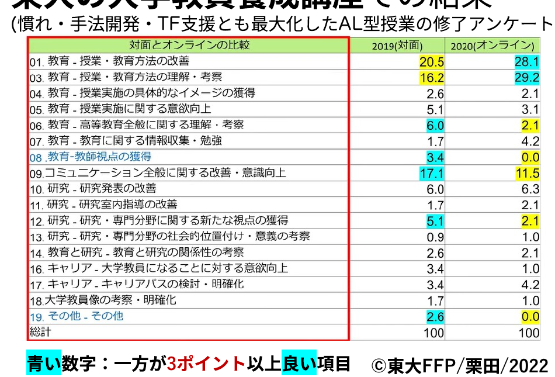

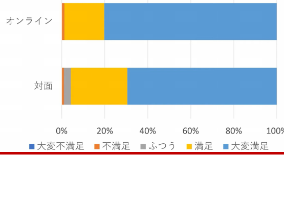

修了率の変化はない <b>満足度はオンラインの方が高い？</b>

青い数字：一方が3ポイント以上良い項目

©東大FFP/栗田/2022

<!--
- 慣れ・手法開発・TF支援をすべて最大化したAL型授業では、修了率の変化はないが、満足度はむしろオンラインの方が高いという結果も。
-->

---

メディア授業の強み・弱み・配慮点

# メディア授業の強み・弱み・配慮点参考

<b style="color:var(--accent-dark)">強み</b>　オンライン授業で出来ること

①<b>設定した目標への到達</b>は得意

②<b>情報を効率的に提示し理解</b>に至りやすい

③<b>時間・場所的な融通</b>が効く

<b style="color:#8a4b00">弱み</b>

①<b>意図しない学びの発生</b>が難しい

②ジェネリックスキル形成に繋がり難い

③疲れやすい/集中しにくい

<b>要配慮</b>　①学生/教師-学生間の<b style="color:var(--accent)">コミュニケーション</b>　／　②学生側の視聴環境に差がある

<!--
- オンライン授業の強み・弱み・配慮点を整理。強み＝目標到達・効率的提示・時間場所の融通。弱み＝意図しない学び・ジェネリックスキル・疲れやすさ。配慮＝コミュニケーションと視聴環境差。
-->

---

勉強法

# 勉強法参考

ダンロスキーらの文章のまとめ

<b>記憶に意味がない</b>学習法 (スキル向上は別)： 再読、ハイライト、単に書き写す・まとめる

<b>記憶に意味がある学習法</b>： 
<b>アクティブリコール (レトリーブ)</b> (思い出す・白紙に書き出す) 
<b>分散学習</b> (一気に全部ではなく、何回も復習) 
<b>精緻的質問・自己説明</b> (Why?How?と自分にといかけ自分の言葉で説明) 
<b>インターリービング</b> (近いが異なる学び・スキルを挟んで学習)

「学びて時にこれを習ふ、亦た説ばしからずや」 学んだことを、時に応じて反復し、理解を深める、これもまた楽しいことではないか。出典：デジタル大辞泉（小学館）

安川 科学的根拠に基づく最高の勉強法 (2024)

<!--
- 勉強法の参考。記憶に意味がない学習法（再読・ハイライト・書き写し）と、意味がある学習法（アクティブリコール・分散学習・精緻的質問/自己説明・インターリービング）。
-->

---

<!-- _class: refs -->

より深い理解のために

# より深い理解のために参考

ケラー(2009) /邦訳：鈴木監訳 <i>学習意欲をデザインする</i> (2010)

ARCSモデルを全面に出し、学習意欲を解説した本です。特に、p. 297にある、ARCSの方略チェックリストは、困ったときに参考になります。

アンブローズ 他 (2010) /邦訳：栗田訳 <i>大学における『学びの場作り』</i> (2014)

期待×価値理論の解説と、そこから得られる処方箋は、この本を参考にしています。

鹿毛 (2022) <i>モチベーションの心理学</i>

モチベーションにまつわるモデルと研究が網羅的に記載されており、心理学的な考え方から教育に至るまで、わかりやすく記載されています。

栗田 他 (2017) <i>インタラクティブ・ティーチング</i>

東大FFP授業の解説本です。コースやクラスの設計と学習意欲の関係性、アクティブラーニングの技法が実践的に書かれています。

本研修は、こうした書籍をまとめたり、原著論文を書かれた多くの方の努力の上に成立しております。この場を借りて御礼申し上げます。

<!--
- より深い理解のための参考文献。ケラー（学習意欲をデザインする）、アンブローズ他（学びの場作り）、鹿毛（モチベーションの心理学）、栗田他（インタラクティブ・ティーチング）。この場を借りて御礼。
-->
