<!-- _class: cover-hero -->

全員で使える Tipsってなんだろう

学生の学習意欲を高める、授業設計

2024/9/9　東京工芸大学 FD研修会

<b>配布資料版</b>　更新日：2024/9/9

<!--
- タイトルコール。「学生の学習意欲を高める、授業設計」、全員で使えるTipsを一緒に探していきます。
-->

---

講師の簡単な紹介

# 講師の簡単な紹介

田川　千葉大のFD / Pre FD担当

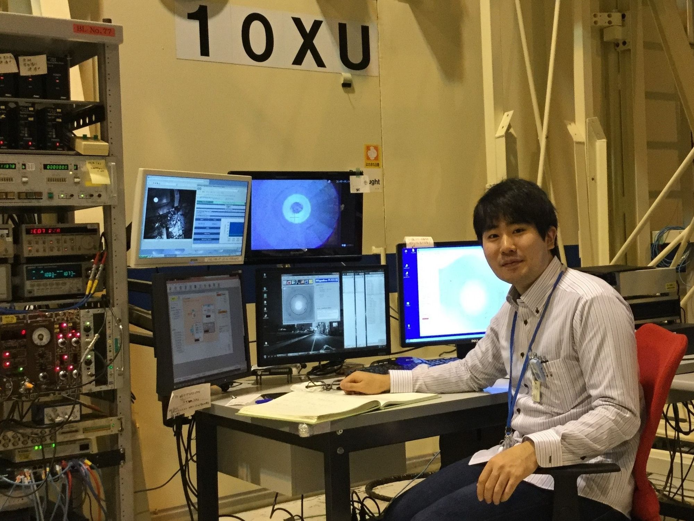

<ul>
<li>SPring-8や電子顕微鏡</li>
<li>航空会社勤務</li>
<li>地球の起源の研究 → 教育系へ</li>
</ul>

齋藤　学芸大で芸術×教育の研究

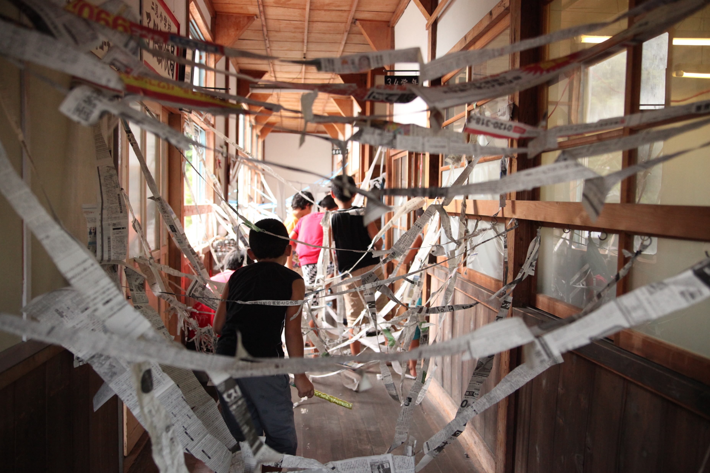
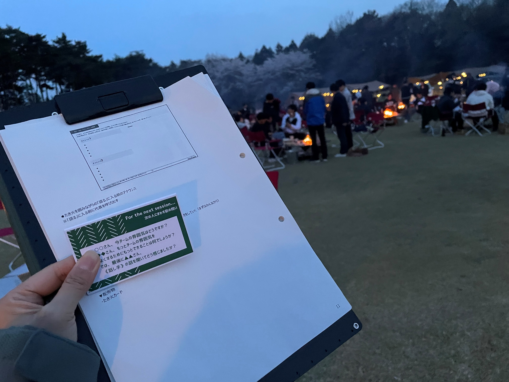

<ul>
<li>民間で研修の企画 → 教育系へ</li>
<li>地域の廃校での造形ワークショップ</li>
<li>新入社員 野外研修</li>
</ul>

東京高等工芸学校の流れを持つ、東京工芸大と千葉大。こうして機会を頂ける縁に、しみじみしております。頑張ります！　／　人が集まる＜場＞で遊びや気づき、学びが最大限生まれる設計（仕掛け）を考えてきました。この時間で私もたくさんの気づきを持ち帰りたいです。お困りのことあればお声がけください！

<!--
- 詳しい先生もいらっしゃると思います。ぜひ、周りの先生の支援に回ってください。
-->

---

今日の目的とゴール

# 今日の目的とゴール

<b>目的</b>：「学生の学習意欲を高めたい！」先生に応えるプログラムです。

<b>多様なワークを楽しみ</b>つつ、 
<b>設計の工夫をことばに</b>し<b>、理論を学ぶ</b>ことで、 
<b>日頃の授業に応用できる</b>ようになる。

思いっきりご参加下さい！

<b>ゴール</b>：Tipsを取り入れたいと思って頂きたい！　<b>「やってみる」を3つ</b>選んで頂きます

<!--
- 詳しい先生もいらっしゃると思います。ぜひ、周りの先生の支援に回ってください。
-->

---

今日の進行スタイル

# 今日の進行スタイル

スタイル

全員で「<b style="color:var(--accent)">発見</b>」する

言葉にして「<b style="color:var(--accent)">共感・実感</b>」する

「<b style="color:var(--accent)">仲間</b>」を得る

期待

皆さん、出来ます

－ <b>難しい話はありません</b>

－ <b>実践的で役立つ</b>ことに気づけます

－ 終了後<b>日々試して頂く</b>ことが鍵です

<!--
- 今、できていなくても構いません。
-->

---

グランド・ルール

# グランド・ルール

<i>from</i> 東京大学・プレFD講座

互いに学び合う、協力的環境づくり

－　<b>積極的に</b>ご参加頂きたい 
－　<b>3Kなフィードバック</b>　「敬意を持って」「忌憚なく」「建設的に」 
－　<b>職位に関係なく、ざっくばらんに</b>話せる

<!--
- 互いに学び合う、協力的な環境を全員でつくりましょう。
-->

---

使用ツール 3点

# 使用ツール 3点

<b>①ワークシート</b>

お手元の紙/PDFで、<b>ワークで記入</b>頂きます。道具箱も添付しています。回収はしません。

<b>②Google ドキュメント</b>

<b>グループワークの結果を会場全体で共有する</b>用です。会場は3人並びの真ん中の先生が<b>メモご担当です(各班2名)</b>。編集は、<b>同時接続100人制限がある</b>ので、その他の先生は、閲覧用リンクをご参照下さい。

<b>③コメントスクリーン</b>

その場アンケート、反応、質疑応答用です。時々使います。

<b>ご案内メールにもリンクございます</b>

<!--
- 使うツールは3点。ワークシート、Googleドキュメント、コメントスクリーン。リンクはご案内メールにもあります。
-->

---

コメント・スクリーン

# コメント・スクリーン

<b>講演インタラクティブ化ツール</b>

…皆様、ニコニコ生放送ってご存知ですか？　動画にコメントが流れる「88888888」「お手柔らかに」

その場で<b>匿名</b>アンケートも取れます　顔文字も送れます　😂😭😆👍👏❤️

<b>温かい反応を頂けますと幸いです</b> <b>折角なのでテストにご協力下さい</b>

https://www.commentscreen.com/comments?id=yLDuyRiqvXcRovEzk3LI

<!--
- コメントスクリーンは講演インタラクティブ化ツール。匿名アンケートや顔文字も送れます。折角なのでテストにご協力下さい。
-->

---

今日の俯瞰図

# 今日の俯瞰図

理論

<b>期待</b>（目標・結果 / 自己効力）

<b>価値</b>（関連付け）

<b>環境</b>「<b>学びの場づくり</b>」

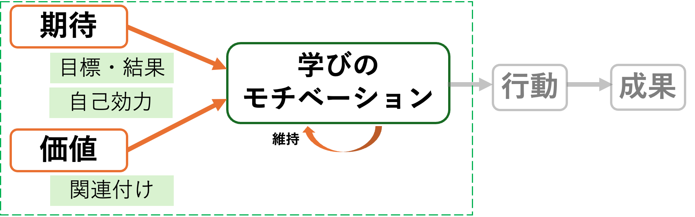

モチベーションって何？ ／ <b>喚起</b>・<b>維持</b>

実践　<b>道具箱</b>：ARCS ／ AL ／ 現場Tips　etc…

<!--
- 今日の俯瞰図。理論（期待・価値・環境）と実践（道具箱：ARCS, AL, 現場Tips）。中心は「学びのモチベーション」の喚起と維持です。
-->

---

学習意欲とは

# 学習意欲を感じてもらうって、なんだろう？

学修者を学ぶようにコントロールすること？　→　<b style="color:var(--accent)">学修者が主体的に学びたいと思うこと</b>

　Ver. 1.0 …生存(サバイバル) 
　Ver. 2.0 …アメとムチ/報酬と罰 <b>(外発的動機づけ)</b> 
　　将来役立つから、不快を避けれるから … 
　Ver. 3.0 …内発的なモチベーション <b>(内発的動機づけ)</b> 
　　好きだからやる、その行為が楽しい …

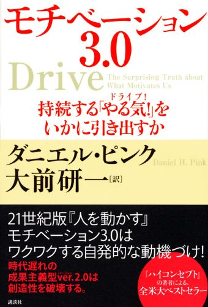

ダニエル・ピンク (著) 大前 研一 (翻訳)　2009 / 2010

<b>内発的動機づけ・外発的動機づけ双方重要</b>ですが、“アメとムチ”戦略<b>だけでは</b>うまくいかないことも… 「やらせる―させられる」以上に、<b>主体的な機会</b>を

<!--
- 外発的動機づけも仕方なし、という話をする。
-->

---

学習意欲とは

# 学習意欲を感じてもらうって、なんだろう？

学修者を学ぶようにコントロールすること？　→　<b style="color:var(--accent)">学修者が主体的に学びたいと思うこと</b>

こういう感じではなく、、、

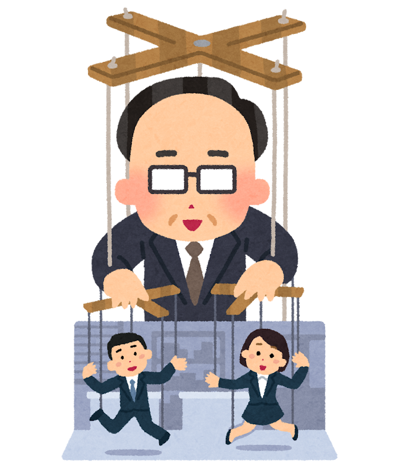

学習意欲を<b>直接</b>上げよう

こういう感じ！

学びの機会/経験　授業 / 先生との話

学習意欲を上げるとは<b>指示やコントロールではなく、方略を味方に、プロセスを生成すること</b>

<!--
- 直接コントロールするのではなく、方略を味方に、学習意欲が上がるプロセスを生成することが大切。
-->

---

学習意欲とは

# 学習意欲 (学びたいモチベーション)とはなにか？

定義

モチベーションとは、望ましい状態や結果に達するために、人が行う個人的な投資である。

Maehr &amp; Meyer (1997) ／邦訳：栗田訳 大学における『<i>学びの場作り</i>』(2014)

役割

<b>学修者のモチベーション</b>は、学ぶための行動を<b>喚起</b>し、<b>方向づけ</b>、<b>維持</b>する。

Ambrose et al. (2010) ／邦訳：栗田訳 大学における『<i>学びの場作り</i>』(2014)

<b>出来ないこと、知らないことに出会い続ける学びの場</b>において<b>モチベーションの喚起と維持は重要かつ必須</b>

<!--
- 学習意欲の定義と役割。学びの場ではモチベーションの喚起と維持が重要かつ必須です。
-->

---

学習意欲とは

# モチベーションは、どう喚起・維持されるのだろう？

<b>複数のモデルがあります</b>　／　限界も…

※様々知られたい方は、鹿毛 (2022) モチベーションの心理学など、オススメです。

しかし、授業設計においては、基盤かつ包括的な <b style="font-size:30px;">期待×価値モデル</b> をおさえて下さい

e.g. Wigfield &amp; Eccles (2000) <i>Contemp. Educ. Psychol.</i>

<!--
- モチベーションには複数のモデルがあり限界もある。授業設計では基盤かつ包括的な「期待×価値モデル」をおさえてください。
-->

---

ワーク①

# アイスブレイク　ワーク①

<b>自己紹介 ＆ ご自分が立ち会った 学習意欲が上がった瞬間</b>を共有して下さい！

<b>① まずは30秒、先生ご自身で、</b>　ご自身が立ち会った<b>簡単に学習意欲が上がった瞬間</b>のエピソードを選んで下さい（ありふれた例でOKです）。 ※ご自身のことでも、教えた学生のことでもOKです

<b>② 各グループ（= 6人ほど）で、1人1分でご紹介下さい。</b>　お名前・専門・エピソード

<b>③ 傾聴と温かいうなずきをお願い致します！</b>

<!--
- ワーク①アイスブレイク。自己紹介と、ご自分が立ち会った学習意欲が上がった瞬間を共有。まず30秒で自分のエピソードを選び、各グループで1人1分ずつ紹介。傾聴と温かいうなずきをお願いします。
-->

---

ワーク①

# アイスブレイク　ワーク①

①モチベーションの解像度、あがりましたか？

<b>学習意欲を高める教え方は難しい</b>、とお答えいただいた先生もいましたが…

②意外な話もありましたか？案外簡単？

内容は多様だったかもしれません。全員が学習意欲が上がった瞬間は、結構ありふれてます。

<b>学生の学習意欲</b>を<b>高める授業設計は出来る</b>、 という<b>期待</b>を持って下さい！

<!--
- アイスブレイクの振り返り。モチベーションの解像度は上がったか、意外な話もあったか。学習意欲を高める教え方は難しいという声もあったが、全員が学習意欲が上がった瞬間は結構ありふれている。学生の学習意欲を高める授業設計は出来るという期待を持ってほしい。
-->

---

期待とはなにか

# 期待とはなにか

<b>期待</b>：<b>実現可能性</b>（目標達成）への<b>主観的な認識</b>（確率）

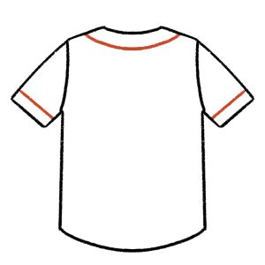

↑憧れれるが、 <b>なるのは難しそう</b>

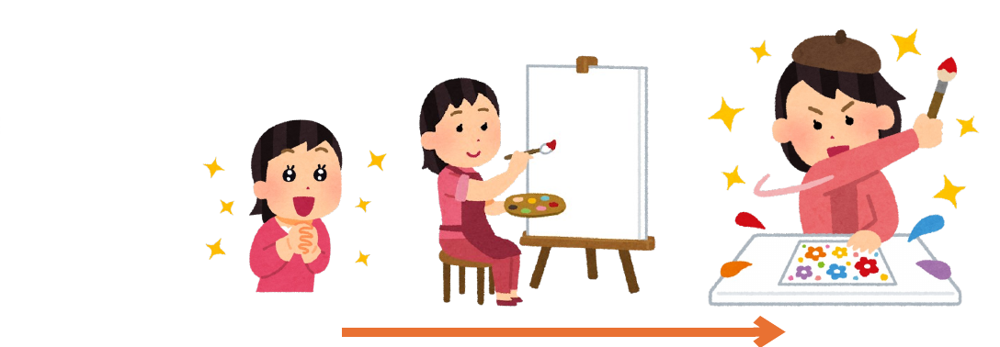

↑段階を踏んで学んで頑張れば、 <b>自分もなれるかもしれない！</b>

<!--
- 期待とは、実現可能性（目標達成）への主観的な認識（確率）。大谷選手のように憧れてもなるのは難しそう、では期待は持てない。段階を踏んで頑張れば自分もなれるかもしれない、と思えることが大切。
-->

---

期待とはなにか

# 期待とはなにか

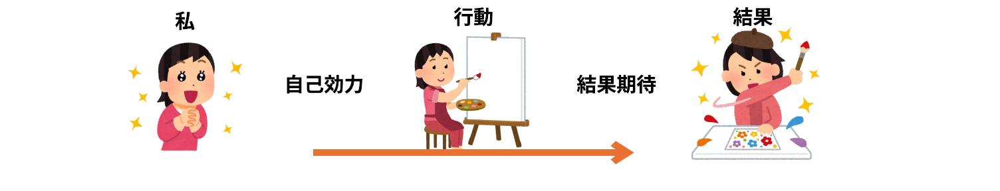

効力

<b>自己効力</b>　<b style="color:var(--accent-dark);">自分はできるか？</b> 達成に必要な一連の行動を遂行できるか、という自分の能力に関する主観的な判断。

<b>結果期待</b>　その行動は望ましい結果をもたらすか？（無駄か？）

<!--
- 期待は「私→行動→結果」の流れで考える。自己効力＝自分はできるか、という能力に関する主観的な判断。結果期待＝その行動は望ましい結果をもたらすか、無駄ではないか。
-->

---

学習性無力感

# 学習性無力感・回避目標

<b>結構、深い問題</b>です。 こんな学生さん、いませんか？

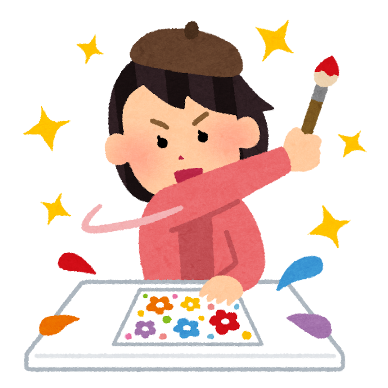

<b>学習性無力感</b>　　繰り返し失敗し、何をやっても無駄だ… 
<b>回避目標・方略</b>　失敗したくない、能力がないと思われたくない

<b>やれば出来る、諦めるなよ</b>と言い続けても<b>本質的には改善しない</b>

<b>期待を向上させるにはどうすれば良い？</b>

<!--
- 学習性無力感＝繰り返し失敗し、何をやっても無駄だと感じる状態。回避目標・方略＝失敗したくない、能力がないと思われたくない。結構深い問題で、やれば出来る・諦めるなよと言い続けても本質的には改善しない。では期待を向上させるにはどうすれば良いか？
-->

---

Tips

# Tips 1) 期待を向上させるには

<b>成功するステップを経験</b>し、<b>出来るようにすること</b>こそが重要

<b>専門家の盲点</b> 先生はもはや、何が分からなかったかわからなくなっている　いちいち説明もしなくなっている

<b>①難易度をあわせる（難しくても、簡単でも低下）分析</b>　近接目標（達成可能な小さな目標）による成功体験積み上げ → 取り組みが<b style="color:var(--accent);">2～3割も進捗が違う</b>実験結果ありBandura and Schunk (1980) <i>J. Pers. Soc. Psychol.</i>

<b>②学び方の学びを入れる　cf. Fink</b>の意義ある学習目標分類Ambrose et al. (2010) ／邦訳：栗田訳 大学における『<i>学びの場作り</i>』(2014) p. 90 
<b>③的確なフィードバックを与える</b>

<!--
- Tips1）期待を向上させるには。①難易度をあわせる（分析）：近接目標による成功体験の積み上げで、取り組みが2〜3割も進捗が違う実験結果あり。②学び方の学びを入れる（cf. Finkの分類）。③的確なフィードバックを与える。成功するステップを経験し出来るようにすることが重要。専門家の盲点に注意。
-->

---

Tips

# Tips 1) 期待を向上させるには

<i>cf.</i> Bandura and Schunk (1980)　<i>J. Pers. Soc. Psychol.</i>

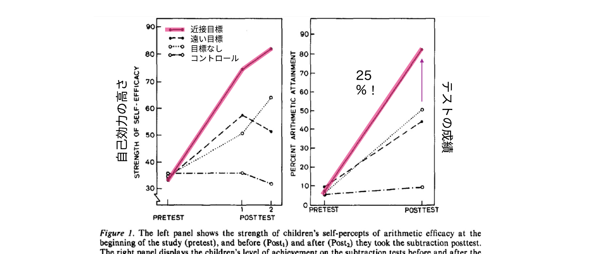

近接目標を立てた群は、テストの成績が<b style="font-size:32px;">25 %！</b>高い

<!--
- Bandura and Schunk (1980)の実験結果。近接目標・遠い目標・目標なし・コントロールの4群を比較すると、自己効力の高さもテストの成績も近接目標群が最も高く、成績は25%も違う。
-->

---

参考

# 参考) 勉強法

<b>記憶に意味がない</b>学習法（スキル向上は別）： 再読、ハイライト、単に書き写す・まとめる

<b>記憶に意味がある学習法</b>： <b>アクティブリコール（レトリーブ）</b>（思い出す・白紙に書き出す） <b>分散学習</b>（一気に全部ではなく、何回も復習）、など

学而一「学びて時にこれを習ふ、亦た説ばしからずや」

学んだことを、時に応じて反復し、理解を深める、これもまた楽しいことではないか。出典：デジタル大辞泉（小学館）

安川 科学的根拠に基づく最高の勉強法 (2024)

<!--
- 参考）勉強法。記憶に意味がない学習法は再読・ハイライト・単に書き写す/まとめる。記憶に意味がある学習法はアクティブリコール（思い出す・白紙に書き出す）と分散学習（何回も復習）。「学びて時にこれを習ふ」＝時に応じて反復し理解を深める楽しさ。
-->

---

価値とはなにか

# 価値とはなにか

<b>価値</b>：学生が<b>授業にどれだけの価値を見いだせる</b>か　／　🚗 <b>自動車教習</b>を例に考えてみましょう

<table style="margin:8px 0; border-collapse:collapse; width:100%; font-size:21px; line-height:1.45;">
<tr style="background:var(--accent); color:#fff;"><th style="padding:5px 12px; text-align:left;">価値の種類</th><th style="padding:5px 12px; text-align:left;">意味</th><th style="padding:5px 12px; text-align:left;">目的達成後の例</th></tr>
<tr style="background:#FCEAEC;"><td style="padding:5px 12px; font-weight:800; color:var(--accent);">達成価値</td><td style="padding:5px 12px;">習得と達成から満足が得られたか</td><td style="padding:5px 12px;">一人で出来た・一冊読んだ 🚗一人で運転/教本読破/試験合格</td></tr>
<tr style="background:#FBEEDD;"><td style="padding:5px 12px; font-weight:800; color:#B86A00;">内発的価値</td><td style="padding:5px 12px;">授業のタスクそのものに価値を感じられるか</td><td style="padding:5px 12px;">議論がためになる・作業が楽しい 🚗運転楽しい/教官との話有意義</td></tr>
<tr style="background:#EAF2FB;"><td style="padding:5px 12px; font-weight:800; color:var(--tag-blue);">道具的価値</td><td style="padding:5px 12px;">高次の目標達成に役立つか</td><td style="padding:5px 12px;">資格取得・卒論や就職後役立つ 🚗免許取得/旅行出来る/就職に有利</td></tr>
</table>

<b>価値が多いほど</b>モチベーションが<b>高まる</b>とされる　／　<b>価値を盛り込み、伝えましょう</b>

<!--
- 価値とは、学生が授業にどれだけの価値を見いだせるか。自動車教習を例に。達成価値（習得と達成の満足）、内発的価値（タスクそのものの価値）、道具的価値（高次の目標達成に役立つ）。価値が多いほどモチベーションが高まる。価値を盛り込み、伝えましょう。
-->

---

Tips

# Tips 2) 自己関連づけ効果と利用価値介入

マスク

<b>イーロン・マスク</b>　なにかを覚えるためには、それに<b>意味を与える</b>必要があります。<b>なぜこれが自分に関連するのか、説明してみて</b>下さい。それができれば、多分、覚えられます。

安川 科学的根拠に基づく最高の勉強法 (2024) p. 156

論文

<b>サイエンスの論文</b>　化学の授業内容がどう自分に関連するか、<b>定期的に時々エッセイを書く → 成績が上がる</b>

Hulleman &amp; Harackiewicz (2009) <i>Science</i>

① 授業内容を学生の関心と結びつける 
② 本格的な現実世界の課題を与える

Ambrose et al. (2010) ／邦訳：栗田訳 大学における『<i>学びの場作り</i>』(2014) p. 90

<!--
- Tips2）自己関連づけ効果と利用価値介入。イーロン・マスク：覚えるには意味を与える必要があり、なぜ自分に関連するか説明できれば覚えられる。サイエンスの論文：化学の授業がどう自分に関連するか定期的にエッセイを書くと成績が上がる。①授業内容を学生の関心と結びつける、②本格的な現実世界の課題を与える。
-->

---

Tips

# Tips 3) 価値を向上させるには

①将来における<b>教授内容の重要性</b>を示す  
② 先生が<b>何に価値をおいているか</b>示し、それを評価する  
③ <b>授業内容</b>に対する<b>情熱や意欲</b>を示す

Ambrose et al. (2010) ／邦訳：栗田訳 大学における『<i>学びの場作り</i>』(2014) p. 89

<!--
- Tips3）価値を向上させるには。①将来における教授内容の重要性を示す、②先生が何に価値をおいているか示しそれを評価する、③授業内容に対する情熱や意欲を示す。
-->

---

授業の目的

# 授業の目的について　参考

学習者の「<b>主体的学び✨</b>」の支援になること

①主語は<b>学習者</b>とすること 
②動詞に<b>注意</b>すること 
③<b>多様な価値を含んでいること</b>を示すこと

例：

<b>(私が、)</b>一生健やかな人生を歩む<b>ために</b>（<b style="color:var(--tag-blue);">道具的価値</b>）、 
筋トレの背景にある理論、医学的エビデンス、方法を<b>理解し</b>、 
実践を楽しみながら（<b style="color:#B86A00;">内発的価値</b>）、 
一人で正しく筋トレする<b>能力を身につける</b>（<b style="color:var(--accent);">達成価値</b>）。

<!--
- 授業の目的について（参考）。学習者の主体的学びの支援になること。①主語は学習者、②動詞に注意、③多様な価値を含んでいることを示す。例：一生健やかな人生のために（道具的価値）、理論やエビデンス・方法を理解し、実践を楽しみながら（内発的価値）、一人で正しく筋トレする能力を身につける（達成価値）。
-->

---

アンケート

# アンケートでのネガティブ・コメント

かなり少ないですが、ありました

期待：

- なんでも知ってる前提で話されるから
- 難しい問題も多かった
- 半分出来なかったと思うから

価値：

- 先生の作品に対する主観的な捉え方や意見がもっと聞きたい。
- 実際に演習に回す時間をもっと増やしてよいと思った。
- フィードバックが来ないと不安になる。

<b>辛く感じるのは不要です。</b>方略やプロセスの問題なので。

<!--
- ネガティブ・コメントはかなり少ないが、あった。期待・価値の両面で。辛く感じる必要はなく、方略やプロセスの問題として捉える。
-->

---

参考

# 参考) ルビコンモデル

モチベーションが行動として顕在化すると、質が変わる （一気に、行動しやすくなる）

例：布団の中にいる間はモチベーションは上がらない 布団を出来ると、急にやる気が出る

行動しないより、行動したほうが、 モチベーションが維持されやすい

<!--
- ルビコンモデル。モチベーションが行動として顕在化すると質が変わり、一気に行動しやすくなる。布団の例。行動した方が維持されやすい。
-->

---

Tips

# Tips 4) ARCSモデルの4カテゴリ

<b>インストラクショナルデザインのモデル</b> <b>学習意欲を考えた授業設計</b>の<b>方略集</b>

<table style="margin:16px auto; border-collapse:collapse; font-size:26px; line-height:1.5;">
<tr><td style="font-weight:800; color:var(--accent); padding:4px 18px; white-space:nowrap;">A：Attention</td><td style="padding:4px 18px;">学修者の注意・関心</td></tr>
<tr><td style="font-weight:800; color:var(--accent); padding:4px 18px; white-space:nowrap;">R：Relevance</td><td style="padding:4px 18px;">学修者との関連性</td></tr>
<tr><td style="font-weight:800; color:var(--accent); padding:4px 18px; white-space:nowrap;">C：Confidence</td><td style="padding:4px 18px;">学修者の自信</td></tr>
<tr><td style="font-weight:800; color:var(--accent); padding:4px 18px; white-space:nowrap;">S：Satisfaction</td><td style="padding:4px 18px;">学修者の満足感</td></tr>
</table>

過去の大量の論文や実践のレビューから抽出 授業のチェックリストとして機能

ケラー (2009) ／邦訳：鈴木監訳 <i>学習意欲をデザインする</i> (2010) p.297

<!--
- ARCSモデルはインストラクショナルデザインのモデルで、学習意欲を考えた授業設計の方略集。A注意・R関連性・C自信・S満足感の4カテゴリ。授業のチェックリストとして機能する。
-->

---

Tips

# Tips 4) ARCSモデル (詳細)

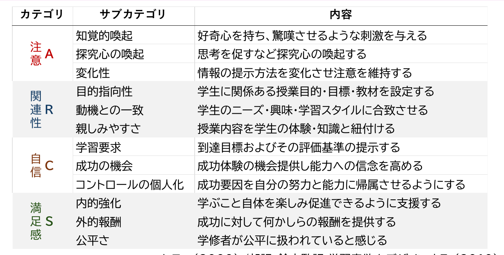

ケラー (2009) ／邦訳：鈴木監訳 <i>学習意欲をデザインする</i> (2010) p.297　／　貴学図書館 OPAC ▶

<!--
- ARCSモデルの詳細。各カテゴリのサブカテゴリと内容を一覧で。貴学図書館OPACでも参照可能。
-->

---

アンケート

# アンケートのポジティブ・コメント

かなりたくさん、ありました

A<b>Attention</b>　注意・関心

参考映像の中には普段滅多に見ないようなものもあったため、いろんな出会いがあった。 先生の多彩な知識のおかげで授業が面白かったです。 難しい内容であっても、先生の体験談などで面白く説明してくれるのでスっと頭に入ってくる。

R<b>Relevance</b>　学修者との関連性

広範囲かつ芸術に関わる事を重視した授業内容だった 分かりやすくかつ学んだことがどんなことに活用されているのか、実際の例を挙げながら説明していた。

<!--
- ポジティブ・コメントはかなり多くあった。ARCSのA注意・関心、R関連性に対応する声を紹介。
-->

---

アンケート

# アンケートのポジティブ・コメント

C<b>Confidence</b>　学修者の自信

先生たちのアドバイスが的確で、いいところも教えてくれるのでモチベーションの維持に繋がったから。 本当にアドバイスが的確。大変助かりました。 課題を忘れてしまう事が多く、期限内にあまり出せず不安だったが遅れて提出でも点数が入る仕組みで助かった。

S<b>Satisfaction</b>　学修者の満足感

成績評価がシラバスに掲載されている通りだった。 質問に対してのフィードバックが厚いので助かっています。 授業のやり方が丁寧で一人一人に向き合っていると思いました。

<!--
- ポジティブ・コメントの続き。ARCSのC自信、S満足感に対応する声を紹介。
-->

---

ワーク③

# グッド・プラクティスさがし　ワーク③

<b>上手い取組みをされている先生を探し、 なぜその先生が学習意欲を高めた授業を実現されて</b>いるのかTips（方略）にしてみて下さい。

<b>5〜6人で行う、20分間</b>のワークです。

1. “個人ワーク②”で記入した工夫を共有頂き、良い取組をされている先生を見つけて下さい（5分）

2. その先生の工夫は何でしょうかインタビューしながら、会場全体に使えるTipsとして言葉にして下さい（12分）<b>メモ担当の先生はGoogle Docsに記入し、共有して下さい</b>

3. 会場全体で見て見ましょう（3分）

<!--
- ワーク③。上手い取組みの先生を探し、なぜ学習意欲を高めた授業を実現できているのかをTips（方略）にする。5〜6人で20分。
-->

---

Tips

# Tips 5) 学びの場作り

<b>協力的環境</b>であると感じられると<b>期待・価値の両方</b>に良い影響あり

環境 ⬆

⇒

期待 ⬆

価値 ⬆

① シラバスと最初で<b>雰囲気を確立</b>する 積極的に聴くことを促進する 包括的な言葉、行動、態度のモデルを示す ② 対立的な緊張には早めに対処する ③ 白黒つけなくても良い／正解は一つとは限らないことを示す

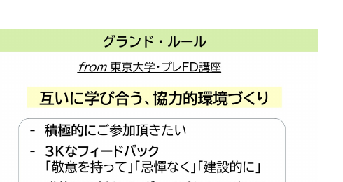

Ambrose et al. (2010) ／邦訳：栗田訳 <i>大学における『学びの場作り』</i>(2014) p. 176

<!--
- Tips5）学びの場作り。協力的環境だと感じられると期待・価値の両方に良い影響。①シラバスと最初で雰囲気確立、②対立的緊張に早めに対処、③白黒つけなくてもよいことを示す。
-->

---

学びの場作り

# 学びの場作りの重要性

米国の事例

<b>クラフトマンシップ</b>の尊重と <b>エクセレンスの文化</b>の形成

① 作品作りや探求を徹底する ② 学修者が自分から学ぶようになる ③ 一般の公立校から学生が羽ばたく

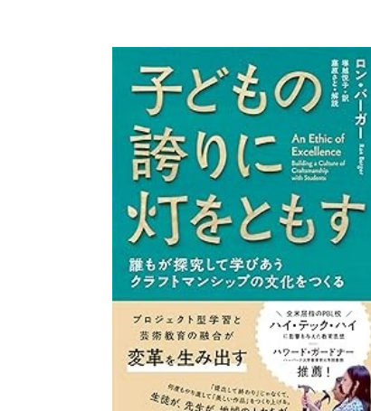

<b>芸術 × 工学</b>がまさに強みとする領域 （先日MIT行きましたが、芸術×工学でした）

<!--
- 学びの場作りの重要性。米国の事例。クラフトマンシップの尊重とエクセレンスの文化の形成。①作品作りや探求の徹底、②自分から学ぶ、③公立校から学生が羽ばたく。芸術×工学が強み。
-->

---

アクティブ・ラーニング

# アクティブ・ラーニング（主体的で対話的な深い学び）

対話や活動への<b>エンゲージメント</b> 学生の学習意欲を高める<b>機会</b>にもなり得る

学びの機会／経験 授業 / 先生との話

➡

先生方のご専門の面白さが、学習意欲に繋がはずです

<b>補足) 学生同士での教え合いも有効です</b> <b>プロテジェ効果</b>：誰かに教える、教えようとすることで、学習内容の理解が深まる プロダクション効果：書いたり、声に出し足したりすると覚える

<!--
- アクティブ・ラーニング（主体的で対話的な深い学び）。対話や活動へのエンゲージメントが学習意欲を高める機会になり得る。学生同士の教え合いも有効（プロテジェ効果・プロダクション効果）。
-->

---

教員のスタイル

# 教員のスタイルの変化

以下のどれが、<b>今後の教員により求められるスタイル</b>でしょう。

A）　エキスパート（専門家） 
B）　リーダー 
<b style="color:var(--accent);">C）　ファシリテーター</b> 
<b style="color:var(--accent);">D）　コーチ</b> 
E）　友人

<b>知識に関する専門家</b>から、<b>学びを促進するファシリテーター</b>へ Teaching のみならず、<b>Coaching</b>も

まずは、<b>先生方が学生に期待する</b>ことが肝要です

ライゲルース & カノップ (2013) ／訳：<i>情報時代の学校をデザインする</i> (2018)

<!--
- 教員のスタイルの変化。CR：今後の教員に求められるスタイルはC）ファシリテーター・D）コーチ。知識の専門家から学びを促進するファシリテーターへ。TeachingのみならずCoachingも。まずは先生方が学生に期待することが肝要。
-->

---

Tips

# Tips 6) この研修の活動自体からヒントになること

モチベーションについて<b>お伝えしつつ</b>、 先生方の<b>モチベーションに繋がる研修に</b>したい

なぜ、ワーク中心なのか

- 学びの場との相互作用が、快い体験をもたらし、モチベーションに繋がるから（<b>効力感</b>）。 
- 自ら決めると内発的動機づけに繋がるから（<b>自己決定理論</b>）。

どんな、方略？

期待 × 価値、ARCS 時間進行（<b>8 – 20 – 90の法則</b>） 8分毎にワークなどで関与を促し、20分ごとに内容を分ける

ロバート・パイク (2008) ／訳：中村監訳 <i>クリエィティブ・トレーニング・テクニック・ハンドブック</i>　／　<b>メタ認知も重要</b>です

<!--
- Tips6）この研修の活動自体からヒントになること。モチベーションを伝えつつ、先生方のモチベーションに繋がる研修にしたい。ワーク中心の理由＝効力感・自己決定理論。方略＝期待×価値、ARCS、8-20-90の法則。メタ認知も重要。
-->

---

モチベーション作りは、目標？

# モチベーション作りは、目標<b style="color:var(--accent)">？</b>

直接目指させるのではなく…

モチベーション

<svg width="60" height="150" viewBox="0 0 60 150"><polygon points="30,4 54,60 40,60 40,146 20,146 20,60 6,60" fill="var(--accent)"/></svg>

学修者

目標にむけ取り組んでいると、 <b>学習意欲があがるプロセス</b>を作る

Goal

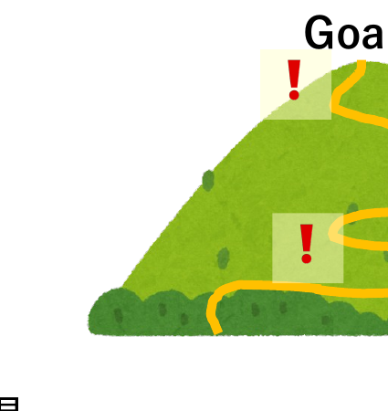

再掲

学習意欲を上げるとは<b>指示やコントロールではなく、 方略を味方に、プロセスを生成すること</b>

<!--
- モチベーション作りは目標そのものではない。学修者が目標に向けて取り組む中で、学習意欲があがるプロセスを作ることが大切。再掲：指示やコントロールではなく、方略を味方にプロセスを生成すること。
-->

---

まとめと宣言

# ワーク④　まとめと宣言

<b>本日、気づかれたり学ばれたりした内容をもとに、 今後授業で取り入れられたいことを3つ述べて下さい。</b>

<b>2～3人で行う5分間</b>のワークです。

1. “ワーク④” に取り入れられたい点を各自で記載下さい (2分) 
2. そのうちもっとも重要なことを3人でご共有下さい (2分)　ポジティブなフィードバックをお願い致します。 
3. グループでもっとも印象的な点を1点か2点、メモ担当の先生がGoogle Docsにご記載下さい(1分)

<!--
- ワーク④。本日の気づきや学びをもとに、今後授業で取り入れたいことを3つ。2～3人で5分間。各自記載→3人で共有→Google Docsにメモ。さらに、内発的価値や道具的価値を足した。
-->

---

おわりに

# おわりに

① 宣言は、<b>先生方自身が到達された</b>内容です。

ご自身に拍手して下さい。 そして、選ばれたTipsを大切にして下さい。

② 皆様には、<b>仲間であり味方である先生方</b>がいます。

③「馬を水辺に連れていけても水を飲ませることはできない」

方略は100%のものではありません。限界もあります。 学ぶかどうかを最終的に決めるのは、<b>学修者自身</b>です。 悩みすぎず、上手くいかなければ次、の試行錯誤が肝要です。

<!--
- おわりに。①宣言は先生方自身が到達された内容、ご自身に拍手を。②仲間であり味方の先生方がいます。③馬を水辺に連れていけても…、最終的に学ぶかを決めるのは学修者自身。悩みすぎず試行錯誤を。
-->

---

<!-- _class: qa -->

質疑応答

# 質疑応答

ご清聴、ありがとうございました

質問がある方は、<b>挙手</b>か<b>Comment Screen</b>まで送付ください

<!--
- 質疑応答。ご清聴ありがとうございました。質問がある方は、挙手かComment Screenまで。
-->

---

# 教えない授業参考

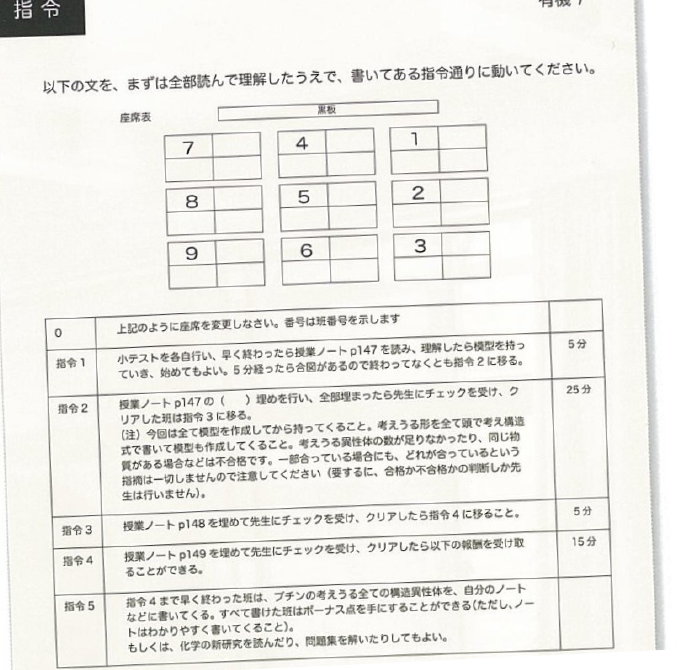

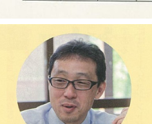

宮崎県高校教諭 化学→探求

<b>化学：</b>『指令書』で学生が 自発的に学び、教え合う

<b>探求：</b>通信制夜間部で、 学生のやる気のきっかけを創る

<b>Teaching から Coachingへ</b> <b>『学生に時間を返す』運動</b>

山辺他(2017) ひとはもともとアクティブ・ラーナー！

<!--
- 参考：教えない授業。宮崎県高校教諭。化学は『指令書』で学生が自発的に学び教え合う、探求は通信制夜間部で学生のやる気のきっかけを創る。TeachingからCoachingへ、学生に時間を返す運動。
-->

---

# スマホ・RPGができるなら参考

スマホやゲームは、何も勉強しなくても、 
使っているうちにできるようになる。

<b>勉強だと思って、構える</b>からできない。 
<b>周りの上手さと、比べる</b>からできない。 
<b>遊びだと思って、使って</b>みるとできる。

<b>工学</b>や<b>芸術</b>など、具体的なモノや、環境とのインタラクションがある場では、勉強と思わずに、学ぶプロセスを紡ぐ可能性がある。 
<b style="color:var(--accent);">スマホやRPGが出来るのに、学ぶ能力がないわけが、ない。</b>

<!--
- 参考：スマホ・RPGができるなら。勉強だと構える・比べるからできない。遊びだと思って使うとできる。工学や芸術など環境とのインタラクションがある場では、勉強と思わずに学ぶプロセスを紡げる。スマホやRPGが出来るのに学ぶ能力がないわけがない。
-->

---

# 生理学的なモチベーション参考

ドーパミン

中脳辺縁系の脳の部位が、<b>ドーパミンで刺激</b>されると、<b>モチベーションが上がる</b>とされます

<b>何かをしたい</b>と思ったときに、ドーパミンが出て、快楽感につながっています

ガチャの場合、当たったときも出ますが、<b>当たる前のワクワク感</b>で一番出ているそうです。

ドーパミンを意図的に出させる設計のものは枚挙に暇がありません

ガチャ、ゲーム、パチンコ、YouTube ショート...

でも、新しい情報を学ぶ期待を持ったときは、<b>たとえ学習</b>であっても、ドーパミンは出るのだそうです。<b>わからないこと</b>は何か、一旦考える、そんなメタ認知が重要です。

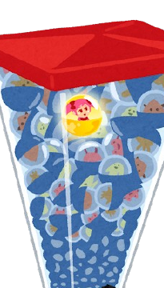

参考：https://www.kobe-np.co.jp/rentoku/feature/202108/0014554529.shtml ／ https://diamond.jp/articles/-/307185

<!--
- 参考：生理学的なモチベーション。中脳辺縁系がドーパミンで刺激されるとモチベーションが上がる。ガチャは当たる前のワクワク感で一番出る。でも新しい情報を学ぶ期待でも出る。わからないことを考えるメタ認知が重要。
-->

---

# 「問い」のデザイン①参考

<b>「創造的対話」の定義</b> 新しい意味やアイデアが創発する対話のこと 居心地が良い カフェ VS 危険だけど居心地が良いカフェ

<b>「問い」の定義</b> 人々が創造的対話と通して認識と関係性を編み直すための媒体

<table style="width:100%; border-collapse:collapse; font-size:21px;">
<thead><tr style="background:var(--accent); color:#fff;"><th style="padding:6px;"></th><th style="padding:6px;">問う側</th><th style="padding:6px;">問われる側</th><th style="padding:6px;">機能</th></tr></thead>
<tbody>
<tr style="background:var(--accent-soft);"><td style="padding:6px; font-weight:800;">質問</td><td style="padding:6px;">答えを知らない</td><td style="padding:6px;">答えを知っている</td><td style="padding:6px;">情報を引き出す</td></tr>
<tr><td style="padding:6px; font-weight:800;">発問</td><td style="padding:6px;">答えを知っている</td><td style="padding:6px;">答えを知らない</td><td style="padding:6px;">考えさせるため</td></tr>
<tr style="background:var(--accent-soft);"><td style="padding:6px; font-weight:800;">問い</td><td style="padding:6px;">答えを知らない</td><td style="padding:6px;">答えを知らない</td><td style="padding:6px;">創造的対話を促す</td></tr>
</tbody>
</table>

<!--
- 参考：「問い」のデザイン①。創造的対話とは新しい意味やアイデアが創発する対話。問いはそれを通して認識と関係性を編み直す媒体。質問・発問・問いの違いを、問う側／問われる側／機能で整理。
-->

---

# 「問い」のデザイン②参考

<b>良いアイスブレイクの問のポイント (①〜③の3アイスを壊す)</b> ①固定観念を揺さぶる ②集団の関係性を揺さぶる ③警戒と緊張を解す ④テーマと接続させる

<b>ファシリテーター</b>：ファシリテーションをする人 <b>ファシリテーション</b>：<b>問題の本質を捉え直し、解くべき課題を定義し、問題解決のプロセスに伴走する</b>こと

<table style="width:100%; border-collapse:collapse; font-size:20px;">
<thead><tr style="background:var(--accent); color:#fff;"><th style="padding:5px;">タイプ</th><th style="padding:5px;">問う側</th><th style="padding:5px;">問う側スタンス</th><th style="padding:5px;">問われる側</th></tr></thead>
<tbody>
<tr style="background:var(--accent-soft);"><td style="padding:5px; font-weight:800;">シンプル</td><td style="padding:5px;">答えを持っていない</td><td style="padding:5px;">知りたい→</td><td style="padding:5px;">不明</td></tr>
<tr><td style="padding:5px; font-weight:800;">ティーチング</td><td style="padding:5px;">答えを持っている</td><td style="padding:5px;">気づかせる→</td><td style="padding:5px;">答えを持っていない</td></tr>
<tr style="background:var(--accent-soft);"><td style="padding:5px; font-weight:800;">コーチング</td><td style="padding:5px;">答えを持っていない</td><td style="padding:5px;">←引き出す</td><td style="padding:5px;">答えを持っている</td></tr>
<tr><td style="padding:5px; font-weight:800;">フィロソフィカル</td><td style="padding:5px;">答えを持っていない</td><td style="padding:5px;">←共に考える→</td><td style="padding:5px;">答えを持っていない</td></tr>
</tbody>
</table>

安斎・塩瀬 (2020) <i>問いのデザイン</i>

<!--
- 参考：「問い」のデザイン②。良いアイスブレイクは固定観念・関係性・警戒を揺さぶり解し、テーマと接続。ファシリテーションは問題の本質を捉え直し課題を定義し伴走すること。問いのタイプを4種で整理。
-->

---

# 情報化時代の教育パラダイム参考

<table style="width:100%; border-collapse:collapse; font-size:22px; margin-top:10px;">
<thead><tr style="background:var(--accent); color:#fff;"><th style="padding:7px;"></th><th style="padding:7px;">工業時代</th><th style="padding:7px;">情報化時代</th></tr></thead>
<tbody>
<tr style="background:var(--accent-soft);"><td style="padding:7px; font-weight:800;">キーワード</td><td style="padding:7px;">標準化/画一的</td><td style="padding:7px;">カスタマイズ/多様性</td></tr>
<tr><td style="padding:7px; font-weight:800;">学修者の関係</td><td style="padding:7px;">競争的</td><td style="padding:7px;">協働的</td></tr>
<tr style="background:var(--accent-soft);"><td style="padding:7px; font-weight:800;">学修者に 求められる能力</td><td style="padding:7px;"><b>従順さ、持久力、普通さ、時間内に間に合わせること</b></td><td style="padding:7px;"><b>主体性と自律性</b> (動機づけと自尊心の重要性)</td></tr>
<tr><td style="padding:7px; font-weight:800;">教員の役割</td><td style="padding:7px;">専門家によるサービス</td><td style="padding:7px;">セルフサービス ：学生に時間を渡す (ファシリテーター・コーチ)</td></tr>
<tr style="background:var(--accent-soft);"><td style="padding:7px; font-weight:800;">授業進度</td><td style="padding:7px;"><b>時間ベース</b></td><td style="padding:7px;"><b>到達ベース</b></td></tr>
<tr><td style="padding:7px; font-weight:800;">評価</td><td style="padding:7px;">序列をつけるもの</td><td style="padding:7px;">フィードバック</td></tr>
</tbody>
</table>

ライゲルース &amp; カノップ (2013) ／訳：稲垣ほか 訳 <i>情報時代の学校をデザインする</i> (2018)

<!--
- 参考：情報化時代の教育パラダイム。工業時代と情報化時代を、キーワード・関係・求められる能力・教員の役割・進度・評価で対比。情報化時代はカスタマイズ、協働、主体性と自律性、到達ベース、フィードバックへ。
-->

---

# 反転授業参考

事前に基礎知識に関する(メディア)学習をして, <b>授業では議論・演習を行うブレンド型</b>の一つ

高度化型

<ul>
<li><b>「理解」</b>をオンデマンド</li>
<li><b>高次目標</b>を演習や実験で</li>
</ul>

例：PBLや創作活動の前

完全習得型

<ul>
<li><b>「理解」</b>をオンデマンド</li>
<li><b>理解の確認や質問</b>を教室で</li>
</ul>

例：講義科目や教養科目

✔アクティブラーニングを取り入れ教育効果を高めやすい　✔教員は多様な学生に対応しやすく、効率化もしやすい　✔学生は疑問点や関心をもって授業に取り組める

バーグマン &amp; アーロン (2012) 訳：山内・大浦監修 <i>反転授業</i> (2014)

<!--
- 参考：反転授業。事前にメディア学習し授業で議論・演習を行うブレンド型。高度化型は高次目標を演習で（PBLの前）、完全習得型は理解の確認を教室で（講義・教養）。ALで効果を高め、多様な学生に対応しやすい。
-->

---

# オンライン授業のGood Practice参考

手間を掛けずに、学習者のモチベーションが上がる授業

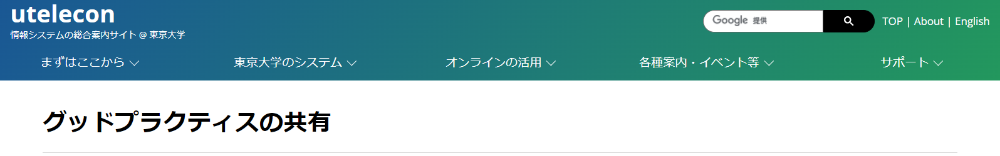

https://utelecon.adm.u-tokyo.ac.jp/good-practice/

<!--
- 参考：オンライン授業のGood Practice。東京大学のutelecon「グッドプラクティスの共有」。手間を掛けずに学習者のモチベーションが上がる授業の事例集です。
-->

---

アクティブ・ラーニング

# アクティブ・ラーニング 参考

教員と学生が意思疎通を図りつつ、<b>一緒になって</b>切磋琢磨し、相互に刺激を与えながら知的に成長する場を創り、<b>学生が主体的に問題を発見し、解を見出していく能動的学修</b>（文科省 2012）

▶手法：沢山ある (問いかけ、シンク・ペア・シェア、ジグゾー法、ピアインストラクション、PBL etc…)

▶実装方法：教員がする or TA/学修者で双方向性を創る

<b>双方向性・主体性のある学びを実現する方法論</b>

学修者が<b>主体性をもつきっかけ</b>になりえる 授業の目的上、適切ならば<b>積極的に利用</b>する <b>学習者が聴くだけの授業は終わりにしよう</b>

<!--
- アクティブ・ラーニングは双方向性・主体性のある学びを実現する方法論。学習者が聴くだけの授業は終わりにしよう。
-->

---

アクティブ・ラーニングの効果

# アクティブ・ラーニングの効果 参考

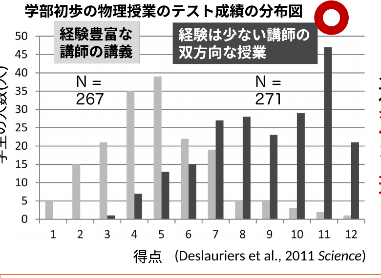

適切な講習を受け、 <b>双方向性・主体性のある学習</b>を取り入れると、 若い教員も良い授業ができる!

<b>注意：</b>アクティブラーニングすること自体が授業の目的ではない　アクティブ・ラーニングは手段 <b>(効果がない事例も多数)</b>

Deslauriers et al. (2011) <i>Science</i>

<!--
- 経験の少ない講師の双方向な授業のほうが成績分布が高い。ただしALは手段であって目的ではない。
-->

---

モチベーションへの誤解

# モチベーションへの誤解 参考

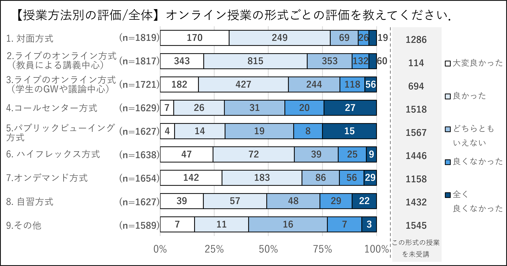

モチベーションは、学生が自分自身で見つけるものだろ？

いいえ。 維持と喚起は、必要です。 <b>どなたでもできる方略</b>があります。

<!--
- モチベーションは学生が自分で見つけるもの、という誤解。維持と喚起は必要で、どなたでもできる方略があります。
-->

---

90-20-8の法則

# 90-20-8の法則 参考

・理解しながら聞けるのは<b>90分</b>まで 
・記憶に残しながら聞けるのは<b>20分</b>まで 
・<b>8分ごと</b>に参画させる

ロバート・パイク (2008)

<b>内容を20分毎にわける</b>

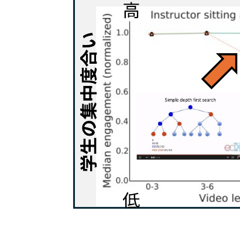
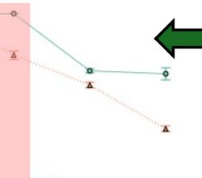

(Guo et al, 2014)

<b>大規模オンラインコースの分析</b>：<b>6 ~ 9分を超えると集中力低下</b>

<!--
- 90-20-8の法則。理解は90分、記憶は20分、8分ごとに参画。オンラインコースの分析でも6〜9分を超えると集中力が低下する。
-->

---

最近接発達領域

# 最近接発達領域 参考

どの難易度で教えるか？　<b style="color:var(--accent)">受講前は自力でできないが、受けたら自力で出来るようになる</b>

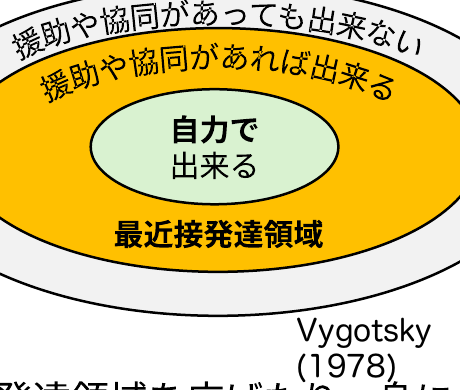

Vygotsky (1978)

伝えたいことは沢山あるかもですが、多すぎては身になりません

<b>最近接発達領域</b>に<b>内容を絞り</b>ましょう

個人差がある場合は、<b>参考資料・補完教材</b>を使用しましょう

<b>足場かけ (Scaffolding)：</b>他者の援助や協同で出来る状態にする　／　<b>足場外し (Fading)：</b>他者の援助や協同を徐々に減らし独り立ち

<!--
- 最近接発達領域に内容を絞る。足場かけ（Scaffolding）と足場外し（Fading）で、受講前はできないことを自力でできるようにする。
-->

---

専門家の盲点

# 専門家の盲点 参考

<b>今のあなた：熟達者</b> 無意識にできる

⇔

<b>昔のあなた・学生</b>：見習い

できること／わかりにくいこと／面白いこと　<b>すべて異なる</b>

<b>専門家の盲点</b>：専門家は、無意識にできてしまうために<b>学習者が何がわからないか分からない</b>

教師は<b>学習内容をわかっていても、学習者を理解できないこと</b>を前提とし、<b>学習者の意見・反応を意識的に盛り込む</b>のが望ましい

アンブローズ (2014)

<!--
- 専門家の盲点。熟達者は無意識にできるため、学習者が何をわからないか分からない。学習者の意見・反応を意識的に盛り込む。
-->

---

ガニエの9教授事象

# ガニエの9教授事象 参考

<b>認知プロセス</b>に沿った教え方

(ガニエ他 2005)

授業の<b>時間</b>を<b>どうデザインするか</b>

それぞれの流れに於いて、<b>何をするべきか</b>

関心をもち、価値を知り、説明を受け、体験の機会を得て、記憶に残り、使える知識になる

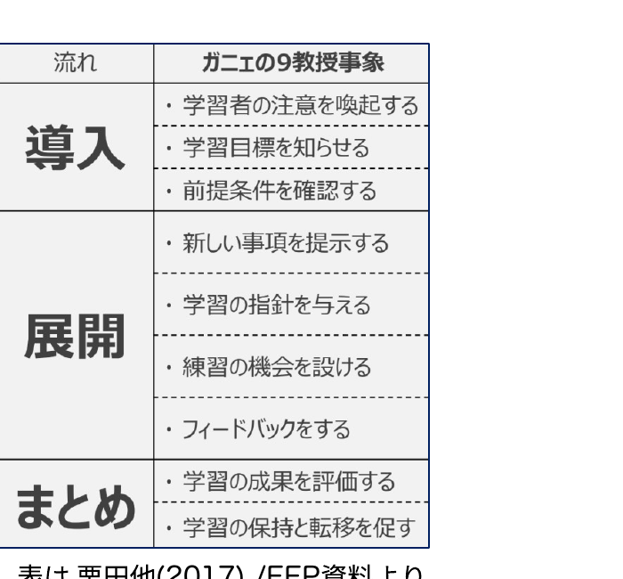

表は 栗田他(2017) /FFP資料より

<!--
- ガニエの9教授事象。認知プロセスに沿った教え方を、導入・展開・まとめの流れでデザインする。
-->

---

Bloomの教育目標分類

# Bloomの教育目標分類 参考

教育心理学者Bloomらにより、<b>8年かけて作られた教育における目標の分類</b>

1956年に認知的領域、1964年に情意的領域。精神運動領域は1972年の別のグループの仕事。認知的領域はAndersonらの改訂版を使用。

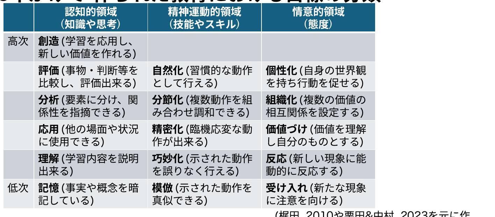

(梶田, 2010や栗田&中村, 2023を元に作成)

<!--
- Bloomの教育目標分類。認知的・精神運動的・情意的の3領域を、低次から高次へと整理した分類。
-->

---

教室もダイバーシティ&インクルーシブ

# 教室もダイバーシティ & インクルーシブ 参考

支援が必要な学生さんはいないか <b>(色覚→赤注意、その他)</b> <b>例：</b>"色のシミュレータ" アプリ on iPhone/Android

分かりやすい説明と思考は人により異なる <b>(認知特性・背景)</b> <b>例 会社時代のストーリー：</b>　自分の話は、ビジョンや絵で思考する人には伝わるけど、文字思考の人には伝わりにくい

<b>インタラクションは学修者を知るチャンス</b>

<b>✘ 教師に合わせる　　○ 学習者に合わせる</b>

<!--
- 教室もダイバーシティ＆インクルーシブ。説明や思考は人により異なる。教師ではなく学習者に合わせる。
-->

---

学習意欲の第一原理

# 学習意欲の第一原理 参考

学習への意欲は、次のときに増進される。 
1. 学修者の好奇心が現在の知識のなかのギャップを知覚して刺激されたとき 
2. 学ぶべき知識が学修者のゴールへ有意義に関連があると気づいたとき 
3. 学修者が学習課題をマスターすることに成功できると思うとき 
4. 学修者が学習課題に満足な結果を予想し経験するとき 
更に、 
5. 学修者が彼らの意図を保護するために意志（自己調整）の方略を使うとき、　増進され、かつ、維持される。

ケラー(2009) /邦訳：鈴木監訳 学習意欲をデザインする (2010) p.319

<!--
- 学習意欲の第一原理。好奇心、ゴールとの関連、成功の見込み、満足な結果、そして意志の方略で意欲は増進・維持される。
-->

---

メディア授業の評価

# メディア授業の評価 参考

<b>対面</b>＞<b>ライブ講義</b>～<b>オンデマンド</b>＞<b>オンラインアクティブラーニング</b>

<b>学生版</b>　<b>東京大学 オンライン授業・Web会議ポータルサイト</b> https://utelecon.adm.u-tokyo.ac.jp/questionnaire/student_2020A/

<!--
- メディア授業の評価（学生版）。対面が最も高く、ライブ講義〜オンデマンド、オンラインALと続く。
-->

---

メディア授業の評価

# メディア授業の評価 参考

<b>東大の大学などで教える</b>での結果 (慣れ・手法開発・TF支援とも最大化したAL型授業の修了アンケート)

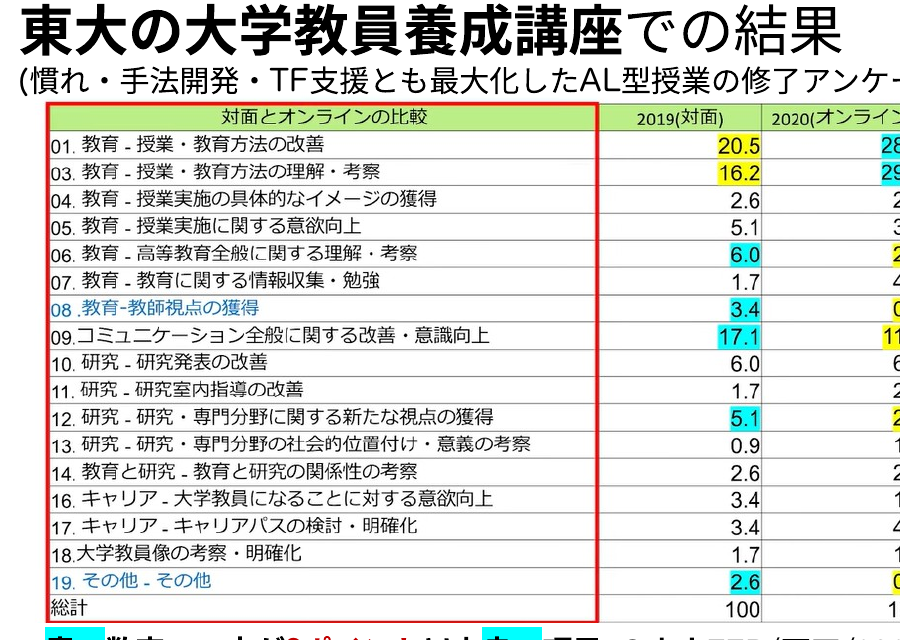

<b>青い数字：一方が3ポイント以上良い項目</b>

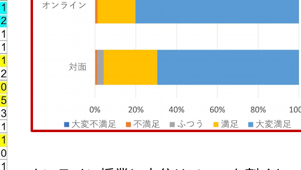

修了率の変化はない <b>満足度はオンラインの方が高い？</b>

オンライン授業に十分リソースを割くと、結果が良くなる可能性が高い

<b>©東大FFP/栗田/2022</b>　／　「対面からオンラインへの転換における学びの変化」 https://www.youtube.com/watch?v=7EIokZL08ek

<!--
- 東大の講座での結果。修了率の変化はないが、満足度はオンラインの方が高い可能性。十分リソースを割けば結果が良くなる。
-->

---

メディア授業の強み・弱み・配慮点

# メディア授業の強み・弱み・配慮点 参考

オンライン授業で出来ること

強み

①<b>設定した目標への到達</b>は得意 ②<b>情報を効率的に提示し理解</b>に至りやすい ③<b>時間・場所的な融通</b>が効く

弱み

①<b>意図しない学びの発生</b>が難しい ②ジェネリックスキル形成に繋がり難い ③疲れやすい/集中しにくい

要配慮

①学生/教師-学生間の<b style="color:var(--accent)">コミュニケーション</b> ②学生側の視聴環境に差がある

<!--
- メディア授業の強み・弱み・配慮点。目標到達や効率的な提示は得意な一方、意図しない学びやジェネリックスキル形成は難しい。コミュニケーションと視聴環境の差に配慮する。
-->

---

より良い勉強法

# より良い勉強法 参考

ダンロスキーらのレビューを基にした、科学的根拠に基づく最高の勉強法より

<b>記憶に意味がない</b>学習法 (スキル向上は別)： 再読、ハイライト、単に書き写す・まとめる

<b>記憶に意味がある学習法</b>： 
<b>アクティブリコール (レトリーブ)</b> (思い出す・白紙に書き出す) 
<b>分散学習</b> (一気に全部ではなく、何回も復習) 
<b>精緻的質問・自己説明</b> (Why?How?と自分にといかけ自分の言葉で説明) 
<b>インターリービング</b> (近いが異なる学び・スキルを挟んで学習)

「学びて時にこれを習ふ、亦た説ばしからずや」 学んだことを、時に応じて反復し、理解を深める、これもまた楽しいことではないか。出典：デジタル大辞泉（小学館）

安川 科学的根拠に基づく最高の勉強法 (2024)

<!--
- より良い勉強法。再読やハイライトは記憶には効果が薄い。アクティブリコール、分散学習、精緻的質問・自己説明、インターリービングが科学的根拠に基づく勉強法。
-->

---

より深い理解のために

# より深い理解のために 参考

<b>アンブローズ 他 (2010)</b> /邦訳：栗田訳 大学における『学びの場作り』(2014) 
期待×価値理論の解説と、そこから得られる処方箋は、この本を参考にしています。

<b>栗田 他 (2017) インタラクティブ・ティーチング</b> 
東大FFP授業の解説本です。コースやクラスの設計と学習意欲の関係性、アクティブラーニングの技法が実践的に書かれています。

<b>ケラー(2009)</b> /邦訳：鈴木監訳 学習意欲をデザインする (2010) 
ARCSモデルを全面に出し、学習意欲を解説した本です。 特に、p. 297にある、ARCSの方略チェックリストは、困ったときに参考になります。

<b>鹿毛 (2022) モチベーションの心理学</b> 
モチベーションにまつわるモデルと研究が網羅的に記載されており、心理学的な考え方から教育に至るまで、わかりやすく記載されています。

本研修は、こうした書籍をまとめたり、原著論文を書かれた多くの方の努力の上に成立しております。この場を借りて御礼申し上げます。

<!--
- より深い理解のために。アンブローズ、栗田、ケラー、鹿毛らの書籍を紹介。本研修はこうした書籍や原著論文を書かれた多くの方の努力の上に成立しています。
-->
