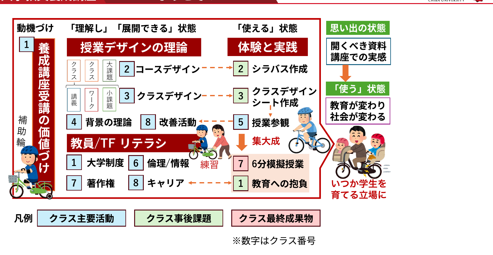

<!-- _class: cover-hero -->

ようこそ！

<b>達成目標：</b>履修する価値づけを自らできる。

<!--
いよいよ始まりましたね。
大学などで教えるへようこそ。
講師の松本です。田川です。
最初の動画である今回の目標は
履修する価値づけを自らできる、です。

教えるって、型があると思います？
-->

---

ようこそ！

この講座でやること（全体像）

<!--
この授業で何をするかをざっくりまとめました。
田川先生、説明頂けますか。
(田川)
水色は、主に授業時間内での活動です。
赤い四角はユニットを表しています。

最後は、みんな一旦は忘れると思うんですよ。
-->

---

まとめ

<b style="font-size:38px; display:block; margin-bottom:8px;">授業の目標</b>
<b>未来の大学教員</b>として<b>活躍</b>✨するために、必要な概念を<b>理解</b>🤔し、<b>応用できる</b>😆ようになる。

実際に体験し、学習したことをモノにして下さい。 
皆さんの期待に添える様にデザインしたので、 
<b>一緒に頑張っていきましょう！</b> 
担当：岡田・松本・田川

<!--
(松本先生のほうで目標を音読する。)

皆さんの期待に添えるよう、デザイン頑張りました。
一緒に頑張っていきましょう。宜しくお願い致します。
-->
