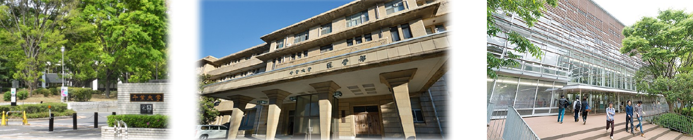
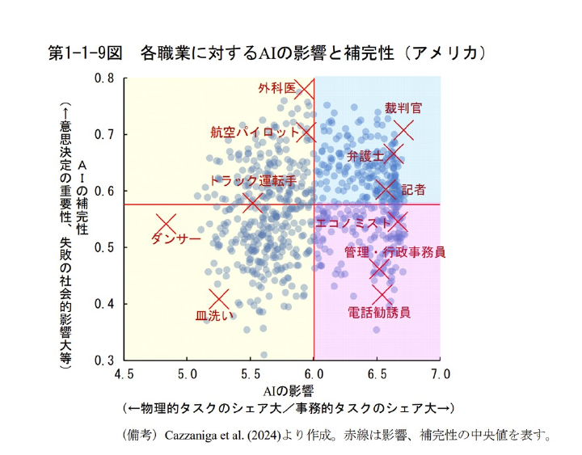
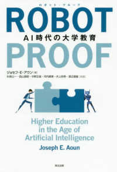
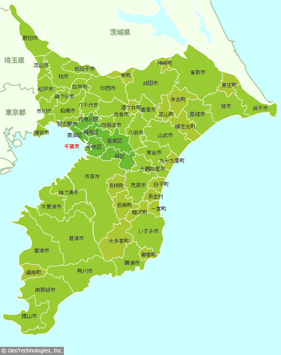
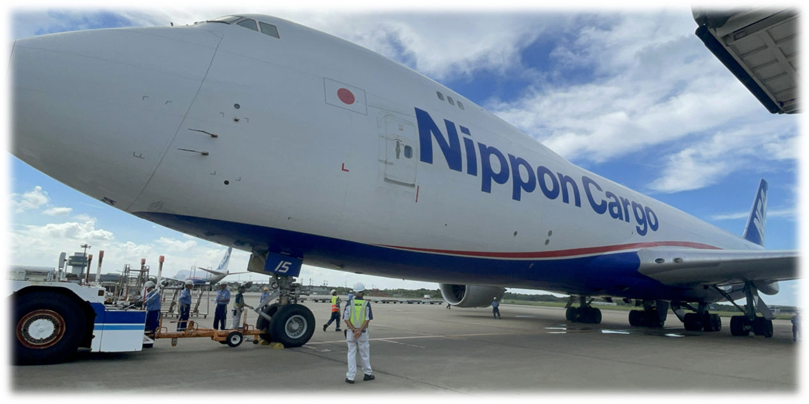
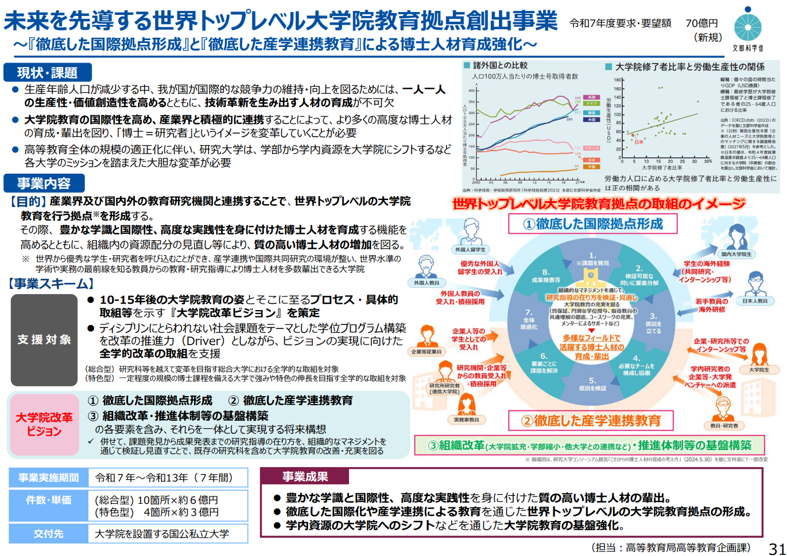
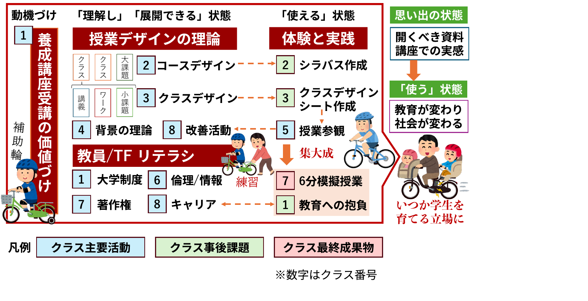

<!-- _class: cover-hero -->

航空貨物✕教育　新授業構想

千葉大学

学部数：

11学部

キャンパス：

西千葉・亥鼻・松戸

予算規模：

国立大学で13番目

学生数：

1万人 (学部)/ 3千人 (大学院)

緑豊か、まじめで、のんびりした大学

<!--
- 千葉大学の概観。11学部・3キャンパスの総合大学。緑豊か、まじめで、のんびりした大学。
-->

---

航空貨物✕教育 新授業構想

# 千葉大学の特色

特色

①<b>全員留学</b>　卒業までに、<b>必ず</b>海外を訪れる

②<b>イシューベースの学び</b>　文理融合的・学際的・実際的な学び

③<b>質の揃った総合大学</b>　生命科学・自然科学・人文社会

<b>モットー</b>：つねに、より高きものをめざして

学ぶ喜び、社会課題解決、<b style="color:var(--accent-dark)">地域貢献・連携</b>、組織と運営の柔軟性

学部数：

11学部

キャンパス：

西千葉・亥鼻・松戸

予算規模：

国立大学で13番目

学生数：

1万人 (学部)/ 3千人 (大学院)

<!--
- 千葉大の3つの特色＝全員留学・イシューベースの学び・質の揃った総合大学。モットーは「つねに、より高きものをめざして」。
-->

---

航空貨物✕教育 新授業構想

# 千葉大学における、私のミッション

<b>千葉大学における、私のミッション</b> 世界に学び世界に貢献する人材の育成のため、 未来の学びの場を企画し、変えていくこと。

<b>国際未来教育基幹：</b> 
大学のバックオフィス (学部・学科=表とは異なる) 
千葉大学の<b>教育企画・教育改革・構成員支援・質保証</b>を担当する部署

<!--
- 私のミッション＝未来の学びの場を企画し変えていくこと。所属する国際未来教育基幹は、教育企画・改革・支援・質保証を担うバックオフィス。
-->

---

航空貨物✕教育 新授業構想

# 未来の教育は変わるべきか

Q) 未来の教育は今と同じでよいのでしょうか？

→ <b>変わって行くべき</b> 
コミュニティの価値：<b>人と共にあるからこそ出来る学び</b>を重視 
データ主導、学修者主体、個別最適など、課題は沢山 
大人も学びやすい大学へ変わる

Q) AIはどのように社会を変え、教育はどうあるべきなのでしょうか？ 
→ 人を支援する目的で<b>AIを使いこなす力</b>を。ここ<b>5年が勝負</b>。

<!--
- 未来の教育は変わるべき。人と共にある学びを重視しつつ、データ主導・個別最適へ。AIを人の支援に使いこなす力を、ここ5年が勝負。
-->

---

航空貨物✕教育 新授業構想

# AI proof な学び

<b>AI proof = AIやロボットにとって変わられない学び</b> AI化・ロボット化した社会・経済を闊歩できる人材の育成

<b>内閣府資料</b>：AIがインパクトをもたらす職業

<b>大人になっても</b>、 自分の学びを磨ける社会の実現 
<b>解決したい課題を</b>、 多様な視点で試し、 人と共に学びあえる場 
<b style="color:var(--accent-dark)">→未来の大学の役割？</b>

▶ 生成AIのデモ

<!--
- AI proof＝AIに代替されない学び。内閣府資料で職業ごとのAI影響を示す。大人も学び続け、課題を人と共に解く場が未来の大学の役割。生成AIのデモへ。
-->

---

航空貨物✕教育 新授業構想

# AI proof な学び　米国の事例

<b>AI proof = AIやロボットにとって変わられない学び</b> AI化・ロボット化した社会・経済を闊歩できる人材の育成

<b>アメリカ・ノースイースタン大学の事例</b> 
<b>経験学習(企業の中での実践的学び)</b>で 学生の<b>AI proof力</b>が向上 
リーダーシップ、主体性、批判的思考力、柔軟性、創造性、

教育プログラムと実践経験の統合 
管理職対象の全米調査で<b>96%</b>が重要と回答

インターン？→ <b style="color:var(--accent-dark)">No/企業と共同で学びを設計</b>

<!--
- 米ノースイースタン大学では、企業内での経験学習でAI proof力（リーダーシップ・批判的思考等）が向上。全米調査で96%が重要と回答。インターンではなく企業と共同で学びを設計する。
-->

---

航空貨物✕教育 新授業構想

# 国の教育方針の変化　(R7 概算要求)

<b>国の教育方針の変化 (R7 概算要求)</b> <b>専門知識の詰め込み</b>から、<b>創造的で柔軟な問題解決</b>人材へ

<b>実践力強化 産業界との連携</b>

<b>英語・国際力強化 国際拠点形成</b>

<!--
- 国の教育方針（R7概算要求）は、専門知識の詰め込みから創造的で柔軟な問題解決人材へ。柱は「実践力強化・産業界との連携」「英語・国際力強化・国際拠点形成」。
-->

---

航空貨物✕教育 新授業構想

# 国の教育方針の変化　(R7 概算要求)

<b>国の教育方針の変化 (R7 概算要求)</b> <b>専門知識の詰め込み</b>から、<b>創造的で柔軟な問題解決</b>人材へ

<b>実践力強化 産業界との連携</b>

<b>英語・国際力強化 国際拠点形成</b>

！

<!--
- 同じ方針を航空貨物の文脈につなぐ。実践力・産業界連携、英語・国際力強化という国の方向と、航空貨物×教育の構想がここで結びつく。
-->

---

航空貨物✕教育 新授業構想

# 千葉という学び場

千葉大には、 <b>千葉という素晴らしい学び場</b>がある

成田

航空貨物や航空業界で 日本が世界を更にリードするには？

浦安

心が動く瞬間ってなんだろう？

房総

水産や農業にデータサイエンスを 持って来るには？

私たちには、教育を面白くし、<b>日本と地域を盛り上げる、無限の可能性</b>がある

<!--
- 千葉は素晴らしい学び場。成田＝航空、浦安＝心が動く瞬間、房総＝水産・農業×データサイエンス。教育を面白くし地域を盛り上げる無限の可能性がある。
-->

---

航空貨物✕教育 新授業構想

# 連携方法

私案： NCA様 &amp; 成田地域との連携方法

<table style="width:100%; border-collapse:collapse; font-size:23px; margin-top:6px;">
<thead>
<tr><th style="width:26%;"></th><th style="background:var(--accent); color:#fff; padding:8px; border-radius:8px 0 0 0;">何をする</th><th style="background:var(--accent); color:#fff; padding:8px; border-radius:0 8px 0 0;">メリット</th></tr>
</thead>
<tbody>
<tr>
<td style="padding:10px;"><b>学部AI・統計 授業</b></td>
<td style="padding:10px; border-top:1.5px solid #ddd;">データ分析やAIツール を作成</td>
<td style="padding:10px; border-top:1.5px solid #ddd;">新規アイデアを作り実験 航空に興味を持つ学生増加</td>
</tr>
<tr>
<td style="padding:10px;"><b>大学院授業</b></td>
<td style="padding:10px; border-top:1.5px solid #ddd;">貴社の課題を学生の 専門で解決</td>
<td style="padding:10px; border-top:1.5px solid #ddd;">具体的なツールを獲得 学生が試行錯誤</td>
</tr>
<tr>
<td style="padding:10px;"><b>大学院予算 応募</b></td>
<td style="padding:10px; border-top:1.5px solid #ddd;">カリキュラムを構成</td>
<td style="padding:10px; border-top:1.5px solid #ddd;">予算獲得/課題解決加速？</td>
</tr>
</tbody>
</table>

<!--
- NCA様＆成田地域との連携の私案。学部AI・統計授業／大学院授業／大学院予算応募の3本柱で、「何をする」と「メリット」を整理。
-->

---

航空貨物✕教育 新授業構想

# 連携方法

私案： NCA様との連携方法

<table style="width:100%; border-collapse:collapse; font-size:23px; margin-top:6px;">
<thead>
<tr><th style="width:26%;"></th><th style="background:var(--accent); color:#fff; padding:8px; border-radius:8px 0 0 0;">何をする</th><th style="background:var(--accent); color:#fff; padding:8px; border-radius:0 8px 0 0;">Why?</th></tr>
</thead>
<tbody>
<tr>
<td style="padding:10px;"><b>学部AI・統計 授業</b></td>
<td style="padding:10px; border-top:1.5px solid #ddd;">データ分析やAIツール を作成</td>
<td style="padding:10px; border-top:1.5px solid #ddd;">新規アイデアを作り実験 航空に興味を持つ学生増加</td>
</tr>
<tr>
<td style="padding:10px;"><b>大学院授業</b></td>
<td style="padding:10px; border-top:1.5px solid #ddd;">貴社の課題を学生の 専門で解決</td>
<td style="padding:10px; border-top:1.5px solid #ddd;">具体的なツールを獲得 学生が試行錯誤</td>
</tr>
<tr>
<td style="padding:10px;"><b>大学院予算 応募</b></td>
<td style="padding:10px; border-top:1.5px solid #ddd;">カリキュラムを構成</td>
<td style="padding:10px; border-top:1.5px solid #ddd;">予算獲得/課題解決加速？</td>
</tr>
</tbody>
</table>

<!--
- 同じ連携の私案を「何をする」と「Why?」で再整理。3本柱の狙いを問いの形で確認する。
-->

---

航空貨物✕教育 新授業構想

# 学部AI・統計授業

<b>何をする</b>：データ分析やAIツールを作成

新規アイデアを作り実験／航空に興味を持つ学生増加

2024年度開始、8回構成、参加人数は50人 ~ 100人

機械学習・AIをテーマに、7人ずつのグループでコンペ 
(PBL：プロジェクトベース学習) 
最初の2回 

<!--
- 学部AI・統計授業。2024年度開始・8回構成・50〜100人。機械学習やAIをテーマに7人グループでコンペ（PBL）。最初の2回が導入。
-->

---

航空貨物✕教育 新授業構想

# 大学院授業

<b>貴社の課題</b>を学生の専門で解決

具体的なツールを獲得／学生が試行錯誤

個別の学生の興味

園芸・薬系

薬・農作物 安定して運ぶ方法

教育系

より情報を 的確に伝える方法

情報系

ULD誤搭載防止appの テスト作成

<b>大学院の学生20人が</b> <b>各自のテーマで成田で試行錯誤(1 week→発表)</b>

<!--
- 大学院授業。貴社の課題を学生の専門（園芸・薬系／教育系／情報系）で解決。20人が各自のテーマで成田で1週間試行錯誤して発表。
-->

---

航空貨物✕教育 新授業構想

# 大学院予算応募

カリキュラムを構成

予算獲得/課題解決加速？

千葉大は応募するのか？ 決定は、大学上層部

<!--
- 大学院予算応募。世界トップレベル大学院教育拠点創出事業へ。カリキュラムを構成し予算獲得・課題解決を加速。応募の決定は大学上層部。
-->

---

グラフィック・シラバス

# 養成講座受講の価値づけ

<!--
- 養成講座のグラフィック・シラバス。授業デザインの理論→体験と実践→使える状態へ。各クラスの主要活動・事後課題・最終成果物を一望できる全体像。数字はクラス番号。
-->

---

まとめ

# まとめ

・ ワクチンの話

<!--
- まとめ。次の話題（ワクチンの話）へ。
-->
