<!-- _class: cover-hero -->

授業における生成AIの利用　理学編

学修効果を損なわず、学修者の主体的な学びを支えるために

<b>本日の内容 (この時間の目的)：</b> 
<b>学生の授業課題における生成AIの利用</b>を題材に、効果を損なわず学修者の主体的な学びを支えるため、<b>教員は生成AIとどう向き合うか</b>を考える。

<b>高等教育センター 助教</b> 
田川　翔 
2024年11月21日

<!--
こんにちは。高等教育センターの田川です。本日は貴重な機会をいただきありがとうございます。本日は、授業における生成AIの利用というテーマです。学習効果を損なわず、学習者の主体的な学びを支えるために、教員は生成AIとどういう風に向き合っていけばいいか。ということを、皆様と考えていければ、と思っております。よろしくお願い致します。
-->

---

本日の流れ

# 本日の流れ

<table style="font-size:24px; line-height:1.5; margin-bottom:12px;">
<tr><td style="font-weight:800; vertical-align:top; white-space:nowrap; padding-right:18px;">時間：</td><td><b>14:00 ~ 14:45</b> (終盤 5分、質疑応答やコメントの読み上げに使います)</td></tr>
<tr><td style="font-weight:800; vertical-align:top; white-space:nowrap; padding-right:18px;">質問：</td><td>答えられるものはお答えします 答えられないものは、後日、共有致します</td></tr>
<tr><td style="font-weight:800; vertical-align:top; white-space:nowrap; padding-right:18px;">方法：</td><td>映像を流しつつ、適宜インタラクティブに進めます</td></tr>
</table>

<b>目標：</b>　順番に、10分程でお話します (動画は別途共有予定) 
<b>①</b> <b>"教育×AI"領域の俯瞰：</b>教育におけるAI活用が何を目指しているか、背景にある教育領域の知見を整理する。 
<b>②</b> <b>課題での利用例 (出来るようになったこと)：</b>　現状、どのような利用例/研究例があるのか知り、試せるようになる。 
<b>③</b> <b>先生ご自身が授業にて活用される/対策される上で：</b>　指針等をもとに、生成AIを制限/活用する上での、「原則」を考える。

<!-- でも、アンケートを有効活用しようと思っていただければ嬉しいです。 -->

---

担当講師自己紹介

# 担当講師自己紹介

田川 翔

(たがわ しょう)

<b>所属：</b>千葉大・高等教育センター ※ 12月よりアカデミックリンクセンター兼任

<b>専門：</b>地球惑星科学 (高圧地球科学) /高等教育論

<b>経歴：</b>東工大 (学部・修) → 東大 (博)　※ 2020年3月 博士(理学) 取得 その後、教育領域 → 理学領域 → 航空会社

<b>研究例：</b>「海の起源」の仮説検証 Tagawa et al. (2021)

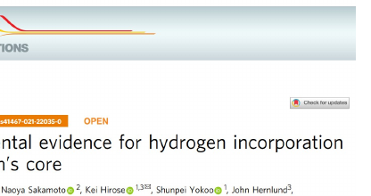

---

おことわり：内容の限界について

# おことわり：内容の限界について

今回の内容は、2024年11月時点のものです。

<b>①</b> ツールの進化が早く、半年後には主に具体例が、陳腐化している可能性があります。 
　 AIエージェント/AGI (汎用人工知能)/SGI (超知性)/ 脳インプラントの登場で、状況が根本的に変わる可能性があります。 
　 (本講座では、そのようなツールの登場を前提にしません)

<b>②</b> 高等教育センター/大学を代表した意見ではありません。 
<b>③</b> <b>AIを利用した教育の効果は、未だ論文に乏しい</b>状態です。 
　 適宜、最新事例の収集に努めて参りますので、気になった点は後日、担当講師までお知らせ下さい。

<!-- でも、アンケートを有効活用しようと思っていただければ嬉しいです。 -->

---

インタラクティブ化ツール

# インタラクティブ化ツール

CommentScreen

<b>①反応を画面に送付できます</b> リアクションを絵文字でお送り頂けます。コメントを入力頂くと、ニコニコ動画のように画面に流れて来ます。

こんな感じです

😊 👍 🎉 ❤️

リアクション、大歓迎です

<b>②アンケートを取らせて頂きます</b> 自動的に画面が変わります

<b>③質問もこちらにご入力下さい</b>

PCまたはスマホで開いて下さい

QRコード

https://www.commentscreen.com/comments?id=q4hJvmaU6OtendaYY8lY

<!-- でも、アンケートを有効活用しようと思っていただければ嬉しいです。 -->

---

① "教育×AI"領域の俯瞰

# ① "教育×AI"領域の俯瞰

<b>アンケート 1</b>　生成AIを授業利用するうえで、困ったご経験はありますか？

①既に授業内で活用していて、困ったこともない 
②既に授業内で活用していているが、使用する際の考え方に困っている 
③使用する指針に困っており、まだ使用していない 
④使用する気はない

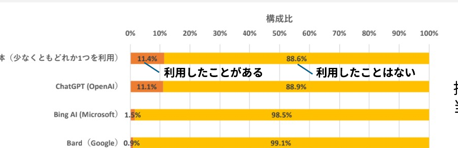

授業で利用された先生は 当時、<b>1割強</b>

千葉大学IR ＞ 2023 年 10 月公開の教員向け全学調査 ＞ 生成AIの授業利用の経験 (n=333) https://drive.google.com/file/d/1_MsKvN347bQwuO8pf_xSdaqY7Fv84y_o/view

最初の10分では、背景にある考え方を俯瞰し、説明致します

---

① "教育×AI"領域の俯瞰

# 国内における生成AIの利用状況調査の結果例

学生全体4割強が利用

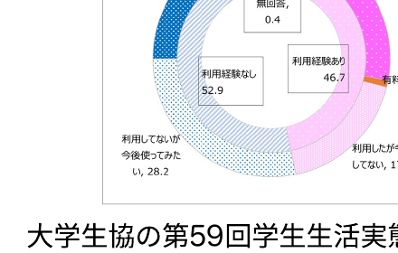

大学生協の第59回学生生活実態調査 　▶ 2023年10～11月 n = 9,873人 ※使用者の使用目的 　「論文・レポートの作成の参考に」（22.1%） 　「翻訳・外国語作文」（12.1%） 　「相談・雑談相手」（11.0%）など

他大学の例① 東大 (2024.3)

生成AIの提供方針に関するアンケート (n=415) 「数日に1度（か、それ以上）の頻度で利用している」の回答が、学部生・大学院生・常勤教員で<b>5割超え</b> https://utelecon.adm.u-tokyo.ac.jp/notice/2024/04-aichat-survey-result/

他大学の例② 阪大 (2024.3)

浦田・長岡・村上 (2024) 情報処理 生成 AI を利用している学生(n=206)が <b>50％</b> 生成 AI を利用している教員(n=245)が <b>64.1％</b> 　※うち、有料版の利用は29.9% 利用場面として<b>教育 29.3％</b>，研究 63.1％，業務が 65.6％

学生には、<b>4~5割程の普及率</b>

---

① "教育×AI"領域の俯瞰

# ① "教育×AI"領域の俯瞰

目的<b>教育におけるAI活用が何を目指しているか</b>、背景にある教育領域の知見を整理する。

内容

<b>A. AIを教育の文脈に取り込む</b> 
　"社会の水準"、理学の学びと生成AI

<b>B. Bloomの仕事と生成AI</b> 
　2シグマ問題・学習目標分類

---

① "教育×AI"領域の俯瞰

# 社会の"水準"としてのAI

"自由に検索出来る"知識の水準としてのインターネット

<b>インターネットが教育に入ってきた黎明期 ▶ 主に知識 (記憶・理解)の次元への影響</b>

▶ 但し、インターネットの知識を自らのものとして使いこなすには、 変わらず相当の学びが必要だった 
▶ 一方、課題を解いたり、より上位の学習目標分類に至る上で、検索する手間が大きく省略され、授業設計や課題設定の幅が広がった 
▶ インターネットリテラシやその使用方法は、仕事や課題解決の前提となった

<b>AIが教育に入ってきた黎明期 ▶ 主に思考/推論 (理解・応用・分析)の次元への影響</b>

思考やアウトプットの水準としてのAI

<b>AI利用を想定した授業設計・課題設定が不可欠になる / でも学びの本質は変わらない</b> 
▶ 知識や思考を自らのものとして使いこなすには、変わらず学びが必要では？

<!-- ハンプサイクル -->

---

① "教育×AI"領域の俯瞰

# 理学を志すこと (私自身の立ち位置)

　理学は、世界に対する人の好奇心という、本質的な心の働きにドライブされた学問領域であると私は思います。

　そのため、 
　　- 理解/思考する上での道具として使いたい、とか 
　　- 教員が教える際に支援や高度化に繋がる、とか 
　生成AIは、目的を達するための「道具」として捉えられると思います。 
　レポート/課題の時間を短縮したい、成績上げたいという意識が不正や学びの毀損に繋がることはありえますが、AIに頼っても自分が伸びない、という点は、学生も共感出来ると想定しています。

<b>理学の学び/研究のワクワク感やモチベーションには、今のところ影響しない</b>と考えます。

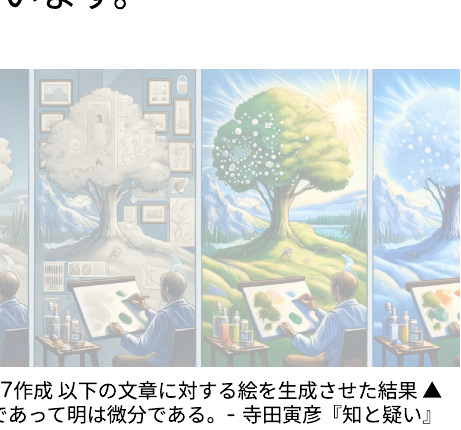

DALL·Eで2024/7作成 以下の文章に対する絵を生成させた結果 ▲ 暗は無限大であって明は有限である。暗はいっさいであって明は微分である。- 寺田寅彦『知と疑い』

<!-- ハンプサイクル -->

---

① "教育×AI"領域の俯瞰

# Benjamin Bloom の２つの仕事 - その1　2シグマ問題

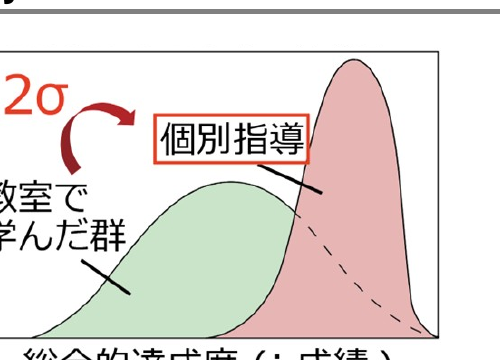

Bloom (1984) <i>Educational Researcher</i> https://web.mit.edu/5.95/readings/bloom-two-sigma.pdf

個別指導は、通常の教室での指導と比べ学習効果が<b>2標準偏差</b>高い。

"コスト上実現しえない個別指導"と同等の学びを<b>全員に常時提供する方法</b>はあるか？

<b>生成AIで個別最適な学び</b>が支援出来る？

<b>学びの個別最適化ツール・伴走者として利用する</b>

例：興味や既習知識を例とした説明の生成、 
　　チュータリング、学習歴の情報統合、評価 
例：英語、プログラミング等のスキル学習

<b>MOOC提供者</b> <b>Khan (2024)</b> 学修支援向け生成AIの実用化

---

① "教育×AI"領域の俯瞰

# Benjamin Bloom の２つの仕事 – その2 学習目標分類

<table style="font-size:20px; line-height:1.4; width:100%;">
<thead>
<tr style="background:var(--accent); color:#fff;">
<th style="padding:5px;"></th><th style="padding:5px;">認知的領域 (知識や思考)</th><th style="padding:5px;">学びへの生成AIの影響</th>
</tr>
</thead>
<tbody>
<tr><td style="font-weight:800; text-align:center; background:var(--section-bg);">高次</td><td><b>創造</b> (学習を応用し、新しい価値を作れる)</td><td>人の創造性こそが大切</td></tr>
<tr><td style="background:var(--section-bg);"></td><td><b>評価</b> (事物・判断等を比較し評価出来る)</td><td>評価軸/価値/判断は人が設定する</td></tr>
<tr><td style="background:var(--section-bg);"></td><td><b>分析</b> (要素に分け、関係性を指摘できる)</td><td>解答/過程の支援可(例：要約・構造化・コーディング)</td></tr>
<tr><td style="background:var(--section-bg);"></td><td><b>応用</b> (他の場面や状況に使用できる)</td><td>単なる問題では、 AIが解いてしまう…</td></tr>
<tr><td style="background:var(--section-bg);"></td><td><b>理解</b> (学習内容を説明出来る)</td><td>説明/例示で支援可能 だが学修者の理解必須</td></tr>
<tr><td style="font-weight:800; text-align:center; background:var(--section-bg);">低次</td><td><b>記憶</b> (事実や概念を暗記している)</td><td>支援可能だが、 学修者の記憶必須</td></tr>
</tbody>
</table>

左は栗田&中村 (2023)を元に作成 / 原著 Bloom (1956/1964)、改訂版(2001)を記載

<b>学修の目標を構造化し、学びの設計を支援</b>

※近年では、下から個別・段階的に行うのではなく、複数の次元の要素を組み合わせる必要性が叫ばれている。 
※近年では、学び方の学びや、人間性の涵養などを含む、学習目標分類も作成されている (e.g. Finkの学習目標分類) 
※但し、低次(特に記憶・理解・応用の段階)を蔑ろにして、高次の学修目標の達成は難しいと想定される。

授業におけるAI利用の指針となり得る

<b>授業の課題やワークの一部として、AIを学びの設計に取り入れる/対策する/教員支援を行う</b>

▶学習目標分類についての、担当講師による解説動画 (9分) https://www.notion.so/geophysica/Bloom-145d8c8bc5ab80deb9dfc15b89d91875?pvs=4

---

① “教育×AI”領域の俯瞰

# 本日のスコープの整理

<b style="color:#9b9b9b;">トレンド①</b> 
<b style="color:#9b9b9b;">学びの個別最適化ツール・ 同伴者として利用する</b>

大学教育の趨勢として <u>← こちらも気になりますが…</u>

<b style="color:var(--accent-dark);">トレンド②</b> 
<b style="color:var(--accent-dark);">授業の課題やワークの一部として、 AIを学びの設計に取り入れる/対策する/教員支援を行う</b>

本講座では、 <u>← こちら</u>を話題にします。

<!--
- 本日のスコープの整理。生成AI×教育には2つのトレンドがある。トレンド①は個別最適化ツール・伴走者としての利用。気にはなるが、本講座ではトレンド②、授業の課題やワークに取り入れる/対策する/教員支援、を話題にします。
-->

---

① “教育×AI”領域の俯瞰

# “教育×AI”領域の俯瞰

目的

<b>教育におけるAI活用が何を目指しているか</b>、背景にある教育領域の知見を整理する。

内容

<b>A. AIを教育の文脈に取り込む</b> “社会の水準”、理学の学びと生成AI

AI利用を想定した授業設計・課題設定が不可欠になる でも、理学の学びの本質は変わらないのではないか

<b>B. Bloomの仕事と生成AI</b> 2シグマ問題・学習目標分類

トレンド① 学びの個別最適化ツール・伴走者として利用する トレンド② 授業の課題やワークの一部として、設計に取り入れる and/or 教員支援を行う

<!--
- ①“教育×AI”領域の俯瞰。目的は、教育におけるAI活用が何を目指しているか、背景の教育領域の知見を整理すること。内容はA. AIを教育の文脈に取り込む（社会の水準、理学の学びと生成AI）、B. Bloomの仕事と生成AI（2シグマ問題・学習目標分類）。
-->

---

②課題での利用例

# ②課題での利用例

目的

現状、どのような利用例/研究例があるのか知り、試せるようになる。

内容

<b>A. 学生が利用する</b>

学修目標の達成のため、積極的に取り入れうる領域

公平かつ正しい評価のため、AI対策すべき領域

<b>B. 教員が利用する</b>

<!--
- ②課題での利用例。目的は、現状どのような利用例/研究例があるかを知り、試せるようになること。内容はA. 学生が利用する（積極的に取り入れる領域／AI対策すべき領域）、B. 教員が利用する。
-->

---

②課題での利用例

# AIを学びの設計に取り入れる

<b>現在の状況：</b>各大学で、グッドプラクティスを洗い出している状況 　　　　　　昨今の生成AIの進化が早く、評価結果はかなり限られている

<b>学生が使用する：課題・ワークでの活用</b>

学生の<b>分析・応用・理解の次元</b>における生成AIの利用 特に、課題/ワーク上での<b>支援</b>や<b>課題ツール</b>としての利用

<b>教員が使用する：先生ご自身の支援ツールとしての活用</b>

フィードバック用ルーブリック 問題や問いかけの作成支援、(シラバスや設計の支援)

参考① 阪大「生成AI教育ガイド」 https://www.tlsc.osaka-u.ac.jp/project/generative_ai/support_al.html 参考② Bowen &amp; Watson, AAC&amp;U “Teaching with AI” (2024)

<!--
- AIを学びの設計に取り入れる。現在は各大学でグッドプラクティスを洗い出している段階で、進化が早く評価結果は限られる。学生は分析・応用・理解の次元での利用、課題/ワーク上の支援や課題ツール。教員はフィードバック用ルーブリック、問題や問いかけの作成支援、シラバスや設計の支援。
- メタな点：①ルーブリックでの採点やフィードバック支援はAIが可能になった
-->

---

②課題での利用例

# アンケート 2

<u>実際に授業で活用されている先生はどのように使用されていますか？</u>

① コーディング

② 理解の促進 (学生が理解しにくい教授内容の深堀り)

③ 高度な学習目標の課題をさせるための途中過程

④ 外国語の翻訳や本/論文の要約

⑤ その他

<u>(補足)差し支えなければ、コメントスクリーンでご紹介頂けませんか</u>

この10分では、課題での利用例を説明致します

<!--
- アンケート2。実際に授業で活用されている先生はどう使っているか。①コーディング、②理解の促進、③高度な学習目標の課題をさせる途中過程、④外国語の翻訳や本/論文の要約、⑤その他。差し支えなければコメントスクリーンでご紹介ください。この10分では課題での利用例を説明します。
-->

---

②課題での利用例

# デモ：理解を支援する、情報の分析、問題を作成する

<b style="font-size:32px;">NotebookLM</b> by Google　(5分)

① NotebookLMにアクセスしてみて下さい　https://notebooklm.google.com/

② 新規作成をクリックし、論文等のPDFや興味ある学習YouTubeなどを読み込ませて下さい

③ 分析後、質問を書いたり、選んだり、英語による要約を確認してみて下さい

④ 学生がよく持ちがちな誤概念について、間違っている理由を説明させて下さい

▶生物×物理とか、分野横断/学際的な学習も支援や実装出来る？

研修後、Gemini / NotebookLMのデモ動画を共有

逆に言えば、学生スライドや配布資料をもとに、レポートを書くことや検索することが可能です <b>　→ ある程度重たい課題でも学生は実施出来ます / 逆に、簡単な課題はAIが答えてしまいます</b> ※情報の変換・統合的なタスクであり比較的安心ですが、ハルシネーションはまだ発生します。

授業動画ファイルも、Gemini Pro (有料版)に読み込ませて、要約などが可能です。 (支援が必要な学生向けに有効かも… / でも、授業を聞かなくてもよい、とはならないはずです)　▶先生方の感想や気付きを、コメントスクリーンでご共有頂けませんか

<!--
- デモ：NotebookLMで理解を支援し、課題の情報を分析し、問題を作成する。①アクセス、②PDFやYouTubeを読み込ませる、③質問・英語要約、④誤概念の説明。学生資料からレポートや検索が可能で、重たい課題もできる一方、簡単な課題はAIが答えてしまう。授業動画もGemini Proで要約可能だが、授業を聞かなくてよいとはならない。(5分)
-->

---

②課題での利用例

# 動画を解釈する / 個別の生成AIツールを作成する

Google AI studio

<b>自分の講義動画から授業の要約や問題作成をする例</b> (たたき台作成向け) https://geophysica.notion.site/Google-AI-studio-145d8c8bc5ab80a29a94dd3acf009c54?pvs=4

Claude 有料版 プロジェクト機能

<b>PDFをアップロードするだけで、フィードバックシートを作成する例</b> https://geophysica.notion.site/Claude-project-145d8c8bc5ab8037a41ad7fb7b3cf2d4?pvs=4

※昨今、これらのツールが大きく進展し、LangChainを使わずとも、Google / AWS / OpenAI等の公式ツールや、Dify等のサードパーティツールで、目的特化型の生成AI chatbotを設計出来るようになっています。

<!--
- 動画を解釈する／個別の生成AIツールを作成する。Google AI studioで講義動画から要約や問題作成（たたき台向け）。Claude有料版のプロジェクト機能で、PDFをアップするだけでフィードバックシートを作成。昨今はLangChainを使わずとも公式ツールやDify等で目的特化型chatbotを設計できる。
-->

---

②課題での利用例

# 参考：理解を支援するための他のGoogleツール

<b style="font-size:32px;">LearnLM</b> by Google　Jurenka et al. (2024) on Arxiv

① Google AI Studioにログインしてみて下さい　https://aistudio.google.com/prompts/new_chat?hl=ja

② 新規作成/Create New Promptをクリックし、LearnLMを選択後、先生の分野における法則や概念、事実とされている内容を質問してみて下さい

③ その内容について、問題を作成したり、先生の興味から解説するよう聞いて下さい

研修後、LearnLMのデモ動画を共有

<b>Googleの取り組みについて</b> 「Googleの使命は、世界中の<u>情報を整理</u>し、<u>世界中の人がアクセス</u>できて<u>使える</u>ようにすること」 Google labs の中に、幾つかの開発中の製品があり、教育への影響もありそうです → https://labs.google/ 例：Illuminate (何でもソクラテス化：説明文や論文を対話的な解説に変えてしまうAI)

<!--
- 参考：理解を支援するための他のGoogleツール、LearnLM (Jurenka et al. 2024 on Arxiv)。①Google AI Studioにログイン、②LearnLMを選択し分野の法則や概念を質問、③問題作成や興味からの解説を依頼。Googleの使命「世界中の情報を整理し、誰もがアクセスできて使えるように」。Google labsに開発中の製品。例：Illuminate（何でもソクラテス化）。
-->

---

②課題での利用例

# ChatGPT(無料版)の現状

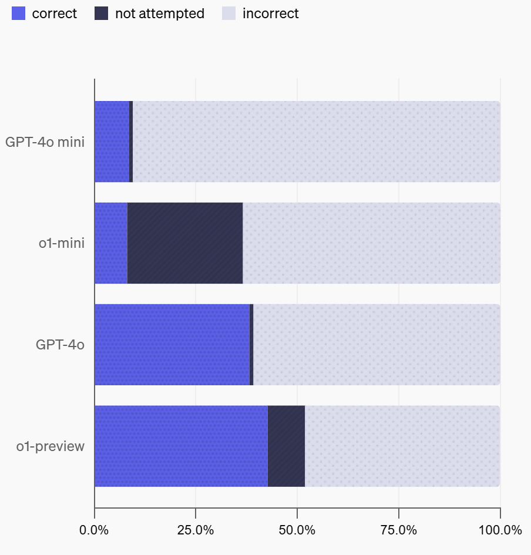

ハルシネーション正解

SimpleQA：回答の事実的正確性のベンチマーク　Wei et al. (2024) Arxiv

例) Q. Who received the IEEE Frank Rosenblatt Award in 2010? 　　A. Michio Sugeno

知識のエッジ(=学習回数小)にある内容も含めてある

問題を解かせたり、論文を探させた場合等、無料版である<b>4o mini</b>は、「分からない」ということもなく、ハルシネーションする可能性が高い

但し、本流の知識を求めた場合については、 - 正しく説明したり、 - 答えを与えた状態でその理由を説明させると正しい 可能性が高い。

<!--
- ChatGPT無料版の現状。SimpleQA（回答の事実的正確性のベンチマーク、Wei et al. 2024）。知識のエッジ＝学習回数の少ない内容も含む。無料版4o miniは「分からない」と言わずハルシネーションしやすい。但し本流の知識なら、正しく説明したり、答えを与えてその理由を説明させると正しい可能性が高い。
-->

---

②課題での利用例

# ChatGPT(有料版)の現状

1. インタラクティブに数値実験する

フーリエ関数で、xが1つ増えるごとに1と-1を行き来するbox関数を、だんだん近似してみせて。 (なんか、Box側が違いますが…)

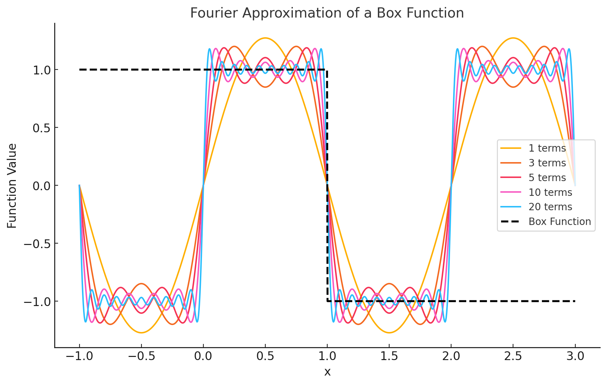

2. 質問を自動生成する→ 精緻化（elaboration）

「なぜそうなっているのか（Why）？」 「どのようにそうなっているのか（How）？」 「具体例は何なのか（What）？」

3. o1を使って、問題の詳細な解説を得る

自分は、この問題について、〇〇と思った。 解答は、△だった。なぜ？

4. Webで検索する

地球の核に水素が入っている可能性があるか、地球核のニュートリノ観測でわかるかどうか、英語の論文を引用しながら教えて。出典を明記して。

5. 出典を明示する

地球の核に水素が存在する可能性は？ 学校で学びそうなことを質問すると、自動生成されます。

6. コーディングする

<!--
- ChatGPT有料版の現状。1. インタラクティブに数値実験（フーリエでbox関数を近似）。2. 質問を自動生成→精緻化（Why/How/What）。3. o1で問題の詳細な解説を得る。4. Webで検索する。5. 出典を明示する。6. コーディングする。学校で学びそうなことを質問すると自動生成される。
-->

---

②課題での利用例

# 要注意パターン：「応用」の次元への対応

簡単な問題や単答式の問題では、生成AIが直接回答を当てる場合がありえます 特に、昨今のOpenAI o1は推論性能の向上により、相当強力です

※課金した学生が成績がよい、という不公平な状況が発生しないよう、留意下さい

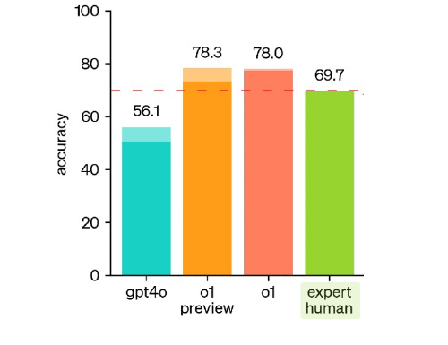

GPQA＝Graduate-level Physical and Quantitative Assessmentで 人間の回答精度を上回る　Rein et al. (2023) arXiv https://openai.com/index/learning-to-reason-with-llms/

<b>化学（一般）</b>　炭素と水素原子で構成される液体有機化合物の反応が、80度、20気圧で24時間行われたとする。プロントの核磁気共鳴スペクトルにおいて、反応物の最も高い化学シフトのシグナルが、生成物のシグナルに置き換わり、それは約3〜4 unit ほど低磁場側で観測される。対応する工業的大規模プロセスでも使用される、周期表のどの位置にある元素の化合物が、最も可能性の高い初期添加物（少量）として使用されたと考えられるか？ 第5周期の金属化合物／第5周期の金属化合物と第3周期の非金属化合物／第4周期の金属化合物／第4周期の金属化合物と第2周期の非金属化合物

<b>天文</b>　天文学者たちは、有効温度(Teff)が約6000 Kの星を研究している。彼らは2つの化学元素El1とEl2の分光線(等価幅 EW &lt; 100 mÅ)を使用して、分光学的に星の表面重力を決定することに関心がある。この星の大気温度では、El1は主に中性状態にあり、El2は主にイオン化する。天文学者が考慮すべき表面重力に最も敏感な分光線はどれか？　A) El2 I (中性) B) El1 II (一重イオン化) C) El2 II (一重イオン化) D) El1 I (中性)

<!--
- 要注意パターン：「応用」の次元への対応。簡単な問題や単答式では、生成AIが直接回答を当てうる。特にOpenAI o1は推論性能が高く相当強力で、GPQA（大学院レベル）で人間を上回る（Rein et al. 2023 arXiv）。化学・天文の難問例。課金した学生が有利になる不公平が起きないよう留意。
-->

---

②課題での利用例

# 要注意パターン：「応用」の次元への対応

語学的な課題や、要約的な課題も、生成AIに直接入れてしまうだけで、回答が出てしまうことがありえます (写真も読み込めます)。

例：〇〇論文の内容を要約せよ / 教科書を翻訳せよ

課題

生成AI

▶

アウトプット

成績?

AIスキルの得点？

<u>そこで、一捻りいかがでしょう</u> (RPGを設計するように、レベル上げのパスを設計する)

例：教科書を翻訳の後、単語リストを作成し、暗記した内容をテストする。 
例：教科書の翻訳の際には、生成AIを使用しないポリシーを定める。 
例：生成AIで回答させた後、自分で添削して、そのプロセスを提出する。 
例：発表と質疑で成績を評価する。(理解のために生成AIは用いてよい。)

課題

生成AI

学習目標を確認できる学習者の努力

▶

アウトプット

成績

<!--
- 要注意パターン続き。語学・要約的な課題も生成AIに直接入れると回答が出てしまう（写真も読込可）。課題→生成AI→アウトプットだと「AIスキルの得点」になってしまう。そこで一捻り：翻訳後に単語リストでテスト、翻訳時は生成AI不可ポリシー、AI回答後に自分で添削しプロセス提出、発表と質疑で評価（理解のためのAIは可）。課題→生成AI→学習目標を確認できる学習者の努力→アウトプット、という設計を。
-->

---

②課題での利用例

# 要注意パターン：「応用」の次元への対応

持込み不可 試験など

課題

学習目標を確認できる学習者の努力

▶

アウトプット

成績

要注意 持込み可試験 レポートなど

課題 (演習問題)

生成AI

▶

アウトプット

成績?

生成AIを利用する課題デザイン

課題

生成AI

学習目標を確認できる学習者の努力

▶

アウトプット

成績

高次の学習目標 (例：創造・評価・分析) cf. 課題中心型の教授方略

大きな課題

複数トピック

<svg viewBox="0 0 360 64" style="width:100%; height:100%;" xmlns="http://www.w3.org/2000/svg"><polyline points="6,58 70,58 70,42 150,42 150,26 240,26 240,10 330,10" fill="none" stroke="#333" stroke-width="2.5"/></svg>

アウトプット

成績

過程を確認する途中で学修者の努力を含む

<!--
- AIを必要に応じ活用しながらも、人間の創造性や批判的思考を重視し、
-->

---

②課題での利用例

# 課題の種別ごとの、生成AIのインパクト

<table style="border-collapse:collapse; font-size:22px; flex:0 0 auto;">
<thead>
<tr style="background:var(--accent); color:#fff;">
<th style="padding:6px 14px; border:1px solid #fff;"></th>
<th style="padding:6px 18px; border:1px solid #fff;">知識</th>
<th style="padding:6px 18px; border:1px solid #fff;">思考</th>
<th style="padding:6px 18px; border:1px solid #fff;">技能</th>
<th style="padding:6px 18px; border:1px solid #fff;">態度</th>
</tr>
</thead>
<tbody>
<tr><td style="padding:5px 14px; border:1px solid #ccc; color:var(--accent-dark); font-weight:700;">客観試験</td><td style="padding:5px 14px; border:1px solid #ccc; text-align:center;">◎(低次)</td><td style="padding:5px 14px; border:1px solid #ccc; text-align:center;">◯</td><td style="border:1px solid #ccc; background:#f3f3f3;"></td><td style="border:1px solid #ccc; background:#f3f3f3;"></td></tr>
<tr><td style="padding:5px 14px; border:1px solid #ccc; color:var(--accent-dark); font-weight:700;">論述試験</td><td style="padding:5px 14px; border:1px solid #ccc; text-align:center;">◯(高次)</td><td style="padding:5px 14px; border:1px solid #ccc; text-align:center;">◎</td><td style="border:1px solid #ccc; background:#f3f3f3;"></td><td style="border:1px solid #ccc; background:#f3f3f3;"></td></tr>
<tr><td style="padding:5px 14px; border:1px solid #ccc; color:var(--accent-dark); font-weight:700;">レポート</td><td style="padding:5px 14px; border:1px solid #ccc; text-align:center;">◯(高次)</td><td style="padding:5px 14px; border:1px solid #ccc; text-align:center;">◎</td><td style="padding:5px 14px; border:1px solid #ccc; text-align:center;">◯</td><td style="padding:5px 14px; border:1px solid #ccc; text-align:center;">◎</td></tr>
<tr><td style="padding:5px 14px; border:1px solid #ccc;">発表</td><td style="padding:5px 14px; border:1px solid #ccc; text-align:center;">◯(高次)</td><td style="padding:5px 14px; border:1px solid #ccc; text-align:center;">◯</td><td style="padding:5px 14px; border:1px solid #ccc; text-align:center;">◯</td><td style="padding:5px 14px; border:1px solid #ccc; text-align:center;">◯</td></tr>
<tr><td style="padding:5px 14px; border:1px solid #ccc;">口述/面接</td><td style="padding:5px 14px; border:1px solid #ccc; text-align:center;">◎</td><td style="padding:5px 14px; border:1px solid #ccc; text-align:center;">◎</td><td style="border:1px solid #ccc; background:#f3f3f3;"></td><td style="padding:5px 14px; border:1px solid #ccc; text-align:center;">◯</td></tr>
<tr><td style="padding:5px 14px; border:1px solid #ccc;">観察評価</td><td style="padding:5px 14px; border:1px solid #ccc; text-align:center;">◯</td><td style="padding:5px 14px; border:1px solid #ccc; text-align:center;">◯</td><td style="padding:5px 14px; border:1px solid #ccc; text-align:center;">◎</td><td style="padding:5px 14px; border:1px solid #ccc; text-align:center;">◯</td></tr>
<tr><td style="padding:5px 14px; border:1px solid #ccc;">実演・制作</td><td style="border:1px solid #ccc; background:#f3f3f3;"></td><td style="border:1px solid #ccc; background:#f3f3f3;"></td><td style="padding:5px 14px; border:1px solid #ccc; text-align:center;">◎</td><td style="padding:5px 14px; border:1px solid #ccc; text-align:center;">◯</td></tr>
<tr><td style="padding:5px 14px; border:1px solid #ccc;">自己評価</td><td style="border:1px solid #ccc; background:#f3f3f3;"></td><td style="border:1px solid #ccc; background:#f3f3f3;"></td><td style="border:1px solid #ccc; background:#f3f3f3;"></td><td style="padding:5px 14px; border:1px solid #ccc; text-align:center;">◯</td></tr>
<tr><td style="padding:5px 14px; border:1px solid #ccc;">心理テスト</td><td style="border:1px solid #ccc; background:#f3f3f3;"></td><td style="border:1px solid #ccc; background:#f3f3f3;"></td><td style="border:1px solid #ccc; background:#f3f3f3;"></td><td style="padding:5px 14px; border:1px solid #ccc; text-align:center;">◯</td></tr>
</tbody>
</table>

<b>生成AI利用可とした場合：</b> 成果物へのインパクトが大

中島 (2016) p.36が出典、吉田 (2023)/阪大FD (参照日：2024.11.20)より改変

---

②課題での利用例

# その他、利用例

<b>① 授業内のグループワークの設計</b>

東大・前期教養のアクティブ・ラーニングクラスでの実践例 <a href="https://www.juce.jp/LINK/journal/2501/pdf/02_01.pdf" style="color:var(--tag-blue); font-size:19px; word-break:break-all;">https://www.juce.jp/LINK/journal/2501/pdf/02_01.pdf</a>

<b>② レポート用フィードバック ルーブリックの作成</b>

阪大のプロンプト例 <a href="https://www.tlsc.osaka-u.ac.jp/project/generative_ai/support_al.html#4" style="color:var(--tag-blue); font-size:19px; word-break:break-all;">https://www.tlsc.osaka-u.ac.jp/project/generative_ai/support_al.html#4</a>

<b>③ 教員利用 / 学生利用の場合のグッドプラクティス例</b>

横国の実施例 <a href="https://www.yec.ynu.ac.jp/news/images/AI_good_practice.pdf" style="color:var(--tag-blue); font-size:19px; word-break:break-all;">https://www.yec.ynu.ac.jp/news/images/AI_good_practice.pdf</a>

アクティブラーニングの参加者の一人が生成AIになる ※広大などでは、グループワークの情報を統合する利用例がある

---

②課題での利用例

# 現状の利用例を知り、試す

目的

現状、どのような利用例/研究例があるのか知り、試せるようになる。

内容

<b>A. 学生が利用する</b>

理解を支援する、課題での情報の分析を行う ツール例：NotebookLM 授業のワーク・課題の設計で用いる

<b>B. 教員が利用する</b>

問題を作成する、フィードバックに用いる

---

③活用/対策

# 「原則」を考える

目的

指針等をもとに、生成AIを制限/活用する上での、「原則」を考える。

内容

<b>A. 利用/対策のポリシー、チェックシート</b>

<b>B. 利用/対策の原則</b>

---

③活用/対策

# こんなとき、どうされますか？

レポートや課題、 生成AIで悪影響 受けないかな…

▶対策は？

学生が理解したり、 演習するのを助ける上で生成AIを 使ってみようかな？

▶活用は？

ここでは、対策と活用の部分についてご説明します

---

③活用/対策

# 千葉大学における生成AIの指針① (令和５年４月１２日)

<a href="https://gakunai.jm.chiba-u.jp/gakujutsu/joho/sjoho2023/pdf/20230713ChatGPT.pdf" style="color:var(--tag-blue); word-break:break-all;">https://gakunai.jm.chiba-u.jp/gakujutsu/joho/sjoho2023/pdf/20230713ChatGPT.pdf</a>

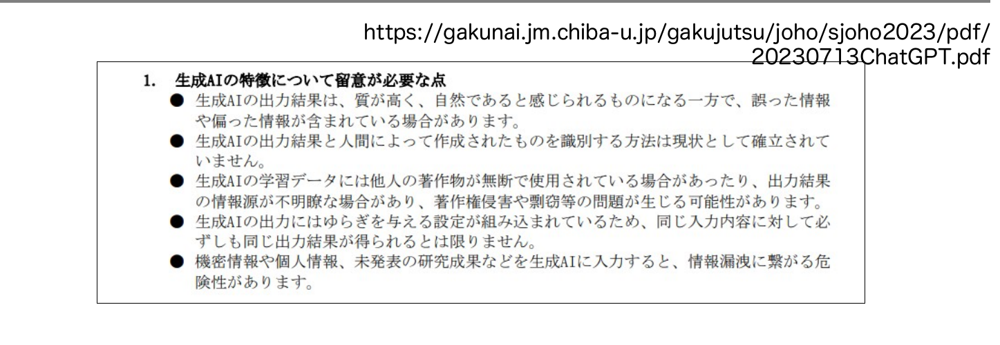

特に、<b>機密情報や個人情報の入力禁止</b>、生成AIにより出力された情報の著作権 (表現への類似性・依拠性)には留意が必要です。

---

③活用/対策

# 千葉大学における生成AIの指針② (令和５年４月１２日)

<a href="https://gakunai.jm.chiba-u.jp/gakujutsu/joho/sjoho2023/pdf/20230713ChatGPT.pdf" style="color:var(--tag-blue); word-break:break-all;">https://gakunai.jm.chiba-u.jp/gakujutsu/joho/sjoho2023/pdf/20230713ChatGPT.pdf</a>

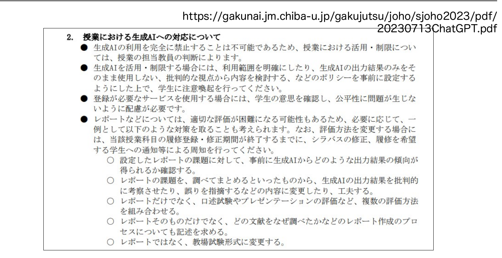

---

③活用/対策

# (補足) 評価に関わる対策集 / 阪大FD (2024)

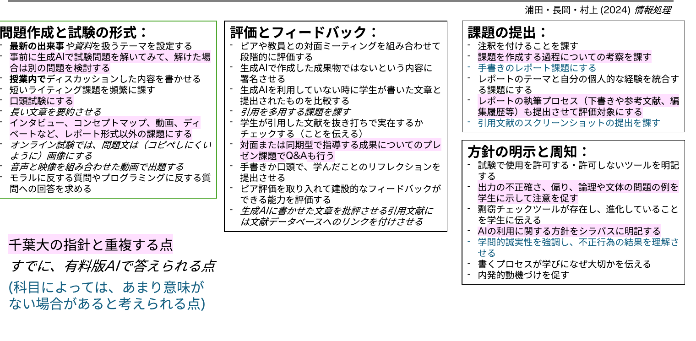

浦田・長岡・村上 (2024) 情報処理

---

③活用/対策

# 制限/活用する上での「原則」 (Bowen &amp; Watson, AAC&amp;U 2024)

<b>① 課題をAIに入れてみて、試す</b>

<b>② ポリシーを決める</b>

▶大学全体、授業全体、個別の課題での生成AI利用を定める ※ 使用の可否、使用内容/使用バージョンの記載等 ▶授業の目的・目標を鑑みて、AIの使用可否を説明する。

<b>③ 不正行為のAI検出は不完全である</b>

▶採点対象の成果は、生成AIで直接出力不可のものにするか、生成AIの使用過程を含め、課題をデザインする ※記述式のテストは、測れる能力が限定される点に留意

<b>④ 生成AI利用にあたるリテラシを共有する</b>

---

③活用/対策

# 課題における記載例 (Bowen &amp; Watson, AAC&amp;U 2024)

課題における自分のコントリビューションを説明する

<b>- 私は友人、ツール、テクノロジー、AI の助けを一切借りずに、この作業を完全に自力で行った</b>。 
<b>- 最初のドラフトは自分で書いたが、その後、友人/ 家族/AI/ パラフレーズ/文法/剽窃ソフトウェアに読んでもらい、提案をもらった。この助けを受けた後、以下の変更を行った：</b>

- スペルと文法の修正 - 構成や順序の変更

<b>自分で作成した後、テクノロジーを使用して文全体や段落全体を書き直した。</b> 
<b>元となるアイデアを生成するためにAI/友人/チューターを使用した。</b> 
<b>アウトライン/最初のドラフトを作成するためにAIを使用し、その後編集した。</b>

<!--
- メタな点：①ルーブリックでの採点やフィードバック支援はAIが可能になった
-->

---

③活用/対策

# 課題における記載例 (Bowen &amp; Watson, AAC&amp;U 2024)

事前に授業における生成AI利用のポリシーを共有する

- AI の使用が許可または禁止されるのはいつか？なぜか？ 
- AI とのブレイ ンストーミングはカンニングにあたるのか？ 
- AI がこのクラスで学習をど のように強化または妨げる可能性があるのか？ 
- AI が許可されている場合、 学生は課題提出の一環として AI プロンプ トを共有する必要があるのか？ 
- AI の使用はどのようにクレジットされるべきか？ 
- AI の限界に関する警告 
- AI 検出ツールの使用計画とその情報の使用方法に関する説明

<!--
- メタな点：①ルーブリックでの採点やフィードバック支援はAIが可能になった
-->

---

③先生ご自身が授業で活用/対策される上で

# 参考：課題における記載例 (Bowen &amp; Watson, AAC&amp;U 2024)

事前に授業における生成AI利用のポリシーの例

このライティングコースの目標の一つは、効果的に書き、コミュニケーションをとる方法を学ぶことだ。これは練習が必要である。AIを使って迅速に生産することも期待されるが、<b>そもそも質の高い文章を自分で作成、編集し、認識する能力も必要</b>である。AIが自分を介さずに作業を行うことができる場合、それは雇用されるに値するスキルを持っていない、いうことになる。だから、練習しよう。

それを達成するために、コースの前半では、AIのサポートは一切禁止する。この過程の苦労やもどかしさは、レベル上げ訓練のようなものと捉えてほしい。自分で作業を行う人が利益を得るのだ。

一方、コースの後半では、特定の状況下でAIを使用することが許可される場合がある。AIの使用を認める必要がある。使用したプロンプトとその応答を提出するよう求める場合がある。

AIリテラシーは重要な新しいスキルだ。Aiは「幻覚：事実のように見えるものを生成する可能性」があることに注意が必要である。この技術の利点と潜在的な危険性の両方について批判的に考える必要がある。

あなたは依然として最終的な成果物およびAIからの制限やバイアスの可能性について責任を負う。このポリシーは必要に応じて変更する権利を留保する。

<!-- メタな点：①ルーブリックでの採点やフィードバック支援はAIが可能になった -->

---

③先生ご自身が授業で活用/対策される上で

# 参考：LLMを視覚的に体験し、リテラシを向上させる

LLM Visualization by Brendan Bycroft

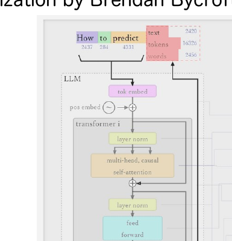
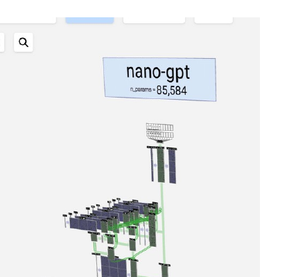

次のトークンを予想することで、回答を出すことを体験出来る

---

③先生ご自身が授業で活用/対策される上で

# アンケート 3

先生ご自身は、生成AIの授業利用/制限について、 
どんな「原則」を大切にされたいと考えますか？ 
ぜひ、チャットにて共有して下さい。 
※ 触れた内容でも、他でも構いません。

<b>例：</b>

難しい問題はAIが支援を可能にする分、基礎力を徹底して鍛える授業にしたい。

生成AIを使われてしまいかねない課題は、生成AIに試しで入力してみる

課題をデザインする際に、生成AIを使用する部分を中間に設ける

※ 他の先生のコメントへの、返信もぜひ、お願い致します。

---

③先生ご自身が授業で活用/対策される上で

# 目的と内容　まとめ

目的指針等をもとに、生成AIを制限/活用する上での、「原則」を考える。

<b>A. 利用/対策のポリシー、チェックシート</b>

まずは、<b>千葉大のポリシー</b>をご参照下さい 
<b>活用</b>する場合 → <b>他大学のgood practice</b>をご参照いただき、授業のポリシーを設定下さい 
<b>対策</b>する場合 → 阪大の評価にかかる対策集や授業ポリシー例をご活用下さい

<b>B. 利用/対策の原則</b>

科目・分野による差が大きく、<b>一律の決定は難しい印象</b>です。一方で、本日お話したように、方針やチェックすべき点は見出されつつあります。本研修をもとに、先生方ご自身が、自らや授業での原則を形作って頂けますと、嬉しいです。

---

まとめ

# 学習効果を損なわず、学修者の自律的な学びを支えるために

Bloomの学修目標分類

<table style="width:100%; border-collapse:collapse; font-size:20px; line-height:1.35;">
<thead>
<tr style="background:var(--accent); color:#fff;">
<th style="padding:7px 10px; text-align:left;">認知的領域 (知識や思考)</th>
<th style="padding:7px 10px; text-align:left;">学びへの生成AIの影響</th>
<th style="padding:7px 10px; text-align:left;">現在の状況</th>
</tr>
</thead>
<tbody>
<tr style="background:var(--accent-soft);">
<td style="padding:7px 10px; border:1px solid #e3c9d2;"><b>分析</b> (要素に分け、関係性を指摘できる)</td>
<td style="padding:7px 10px; border:1px solid #e3c9d2;">解答/過程の支援可(例：要約・構造化・コーディング)</td>
<td style="padding:7px 10px; border:1px solid #e3c9d2;">AIを利用することで、高度な課題が可能に</td>
</tr>
<tr>
<td style="padding:7px 10px; border:1px solid #e3c9d2;"><b>応用</b> (他の場面や状況に使用できる)</td>
<td style="padding:7px 10px; border:1px solid #e3c9d2;">単なる問題では、 AIが解いてしまう…</td>
<td style="padding:7px 10px; border:1px solid #e3c9d2;">アウトプットが直接成績にならないよう注意</td>
</tr>
<tr style="background:var(--accent-soft);">
<td style="padding:7px 10px; border:1px solid #e3c9d2;"><b>理解</b> (学習内容を説明出来る)</td>
<td style="padding:7px 10px; border:1px solid #e3c9d2;">説明/例示で支援可能 だが学修者の理解必須</td>
<td style="padding:7px 10px; border:1px solid #e3c9d2;">生成AIが理解をインタラクティブに支援</td>
</tr>
</tbody>
</table>

- 理解の次元は、<b>持ち込みなしペーパーテスト等</b>で確認しやすいです。 
- 分析の次元は、学生のアウトプットが発表やレポート、口頭での試験となりやすく、<b>AIで単純に回答出来なくなります</b>。 
- 応用の次元は、生成AIが直接アウトプットを出さないように気をつけましょう。- <b>高度な次元 (例：創造的なPBL等)の課題</b>を設定するのも手です。

---

まとめ

# 今日の俯瞰図：AIを学びの設計に入れる / AIを対策する

学生

<table style="width:100%; border-collapse:collapse; font-size:17px; line-height:1.3;">
<tr style="background:var(--accent); color:#fff;"><th style="padding:5px 7px; text-align:left;">知識や思考</th><th style="padding:5px 7px; text-align:left;">生成AIの利用</th><th style="padding:5px 7px; text-align:left;">使用可能なツール</th></tr>
<tr><td style="padding:5px 7px; border:1px solid #e3c9d2;"><b>分析</b></td><td style="padding:5px 7px; border:1px solid #e3c9d2;">情報を統合する/要約する/比較する</td><td style="padding:5px 7px; border:1px solid #e3c9d2;">NotebookLM</td></tr>
<tr><td style="padding:5px 7px; border:1px solid #e3c9d2;"><b>応用</b></td><td style="padding:5px 7px; border:1px solid #e3c9d2;">- 課題のデザインを考える</td><td style="padding:5px 7px; border:1px solid #e3c9d2;"></td></tr>
<tr><td style="padding:5px 7px; border:1px solid #e3c9d2;"><b>理解</b></td><td style="padding:5px 7px; border:1px solid #e3c9d2;">AIを使って様々な角度から説明を受ける／授業に関する質問をAIに聞いてみる／授業の聞き逃しを要約する</td><td style="padding:5px 7px; border:1px solid #e3c9d2;">NotebookLM/LearnLM／NotebookLM / ChatGPT等／Gemini</td></tr>
</table>

教員（メタな部分）

<table style="width:100%; border-collapse:collapse; font-size:16px; line-height:1.3;" class="pip-safe">
<tr style="background:var(--accent); color:#fff;"><th style="padding:4px 7px; text-align:left;">メタな部分</th><th style="padding:4px 7px; text-align:left;">生成AIの利用</th><th style="padding:4px 7px; text-align:left;">使用可能なツール例</th></tr>
<tr style="background:var(--accent-soft);"><td style="padding:4px 7px; border:1px solid #e3c9d2;">指針 (ガイドライン)</td><td style="padding:4px 7px; border:1px solid #e3c9d2;">千葉大の指針／使用までの推奨フローと禁止行為／(参考)文部科学省 初等中等向けガイドライン</td><td style="padding:4px 7px; border:1px solid #e3c9d2;">リンク (要ログイン)／リンク</td></tr>
<tr><td style="padding:4px 7px; border:1px solid #e3c9d2;">授業設計</td><td style="padding:4px 7px; border:1px solid #e3c9d2;">タスクベースの教授方略 / 反転授業／PBL/アクティブラーニング</td><td style="padding:4px 7px; border:1px solid #e3c9d2;">後ほど動画を公開</td></tr>
<tr style="background:var(--accent-soft);"><td style="padding:4px 7px; border:1px solid #e3c9d2;">問題作成</td><td style="padding:4px 7px; border:1px solid #e3c9d2;">様々な形式問題を作成する</td><td style="padding:4px 7px; border:1px solid #e3c9d2;">NotebookLM / LearnLM</td></tr>
<tr><td style="padding:4px 7px; border:1px solid #e3c9d2;">採点</td><td style="padding:4px 7px; border:1px solid #e3c9d2;">ルーブリックに基づく採点/フィードバック</td><td style="padding:4px 7px; border:1px solid #e3c9d2;">NotebookLM / Claude 3.5</td></tr>
<tr style="background:var(--accent-soft);"><td style="padding:4px 7px; border:1px solid #e3c9d2;">他大学の例</td><td style="padding:4px 7px; border:1px solid #e3c9d2;">グッド・プラクティス集</td><td style="padding:4px 7px; border:1px solid #e3c9d2;">Yale / 阪大 / 横国 / 私大情協</td></tr>
</table>

<!-- メタな点：①ルーブリックでの採点やフィードバック支援はAIが可能になった -->

---

補足

# SoTL / Good practice収集のお誘い

<b>SoTL</b> = Scholarship of Teaching and Learning (授業実践に係る研究) 
例：生成AIを使ったら成果物の質が上がった、学生の点数が上がった/下がった etc…

今後、<b>生成AIの利用における理学</b>と<b>学際分野の学修への影響を調査していきたい</b>と考えています。もし、<b>先生の授業で研究/AI関連の支援をさせて頂ける場合</b>には、ぜひお声掛け頂けませんでしょうか。理学の教育活動に、貢献できますと幸いです。

また、授業で生成AIを使用して見た結果など、グッドプラクティスを個人プロジェクトとして収集しています。インタビューや授業見学させて頂ける場合には、ぜひ、お知らせ下さい。

本日は、お時間を頂き、ありがとうございました。

それと、<b>複数の分野の知を使う学び/研究の加速</b>や、<b>大学院の研究支援</b>なども、可能では、、、と

<!-- メタな点：①ルーブリックでの採点やフィードバック支援はAIが可能になった -->

---

補足

# 本研修のアンケートのお願い

本研修の内容について、 
主に選択式で、3分程度で終わる、アンケートがございます。

https://forms.gle/aXK5n2ojYu2SzoQ96

差し支えなければ、今週中で構いませんので、ご回答頂けますと幸いです。

頂いた質問は、こちらにて解答致します (千葉大学 Google アカウントへのログインが必要です) 
<a style="font-size:18px; word-break:break-all;">https://docs.google.com/document/d/15iYeIOcIvbMgsydTFyBxJnvFKWMAoICJcXbLhNEMVJw/edit?usp=sharing</a>

<!-- メタな点：①ルーブリックでの採点やフィードバック支援はAIが可能になった -->

---

③先生ご自身が授業で活用/対策される上で

# 参考：AIリテラシ OECD (2023)

AIの技術面を批判的に評価し、AIを効果的に活用できる能力 
(communicate and collaborate)

能力

第１：AIの基本的な機能と日常生活におけるAIの使用方法に関する知識

第２：様々な場面に応用することのできる能力

第３：AIを実装し、評価することができる能力

第４：アルゴリズムの開発に必要なデータを管理する能力とAIの出力結果を批判的に考察する能力

AIを理解し、活用し、監視し、批判的に考察できるスキル

各国でリスキリング/学校教育への取り込みが行われている

<b>内閣府(2024)</b> 世界経済の潮流＞第1章＞p.32

<!-- ハンプサイクル -->

---

① “教育×AI”領域の俯瞰

# 参考：職業への影響

<b>内閣府(2024)</b> 世界経済の潮流＞第1章＞p.13

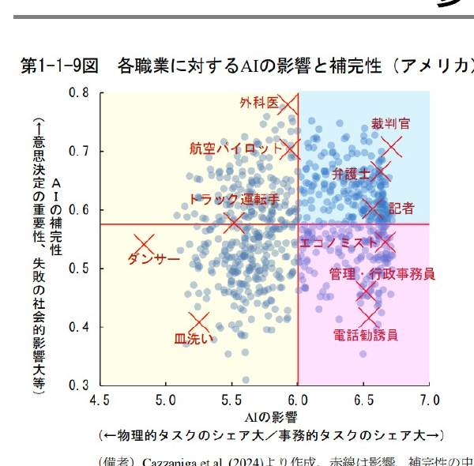

<b style="color:#C0182B;">AIの影響が大きく、代替性が高い職業：</b>事務的タスクのシェアが大きい職業。▶ つまり、AIがとって変わってしまう職業

<b>AIの影響が大きく、補完性が高い職業：</b>事務的タスクのシェアが大きいものの、意思決定の重要性が高く、AI任せとすることが社会的に望ましくない職業。▶ AIを使いこなす必要のある職業

<b>AIの影響の小さい職業：</b>物理的タスクのシェアが大きい職業。

※ 教員・研究者(自然科学系)は、青の領域

<!-- ハンプサイクル -->

---

オンライン授業で出来ること

# 参考：反転授業　参照

基礎知識に関する(メディア)学習を<b>事前に行い、</b> 
<b>その後の授業では議論・演習などを行うブレンド型の設計</b>

▶Stanfordの取組が有名 /学内でも医学部等でも<b>実践論文</b>あり

高度化型
<ul><li>- <b>高次目標</b>を演習や実験で</li></ul>

完全習得型
<ul><li>- <b>理解の確認や質問</b>を教室で</li></ul>

✔<b>アクティブラーニング</b>を取り入れ教育効果を高めやすい 
✔教員は多様な学生に対応しやすく、<b>効率化もしやすい</b> 
✔学生は疑問点や関心を持ち、<b>自己に最適な授業に臨める</b> 
✔授業時間の課題で評価するので、AIの影響を受けにくい/設計に取り入れやすい

---

授業構成のtips

# 参考：最近接発達領域　参照

<b>受講前は自力でできないが、課題を解いたら自力で出来るようになる</b>

<svg viewBox="0 0 410 280" xmlns="http://www.w3.org/2000/svg" style="width:100%;">
<ellipse cx="165" cy="150" rx="160" ry="120" fill="#FBE4EA" stroke="var(--accent)" stroke-width="2"/>
<text x="165" y="44" text-anchor="middle" font-size="16" font-weight="700" fill="var(--accent-dark)">援助や協同があっても出来ない</text>
<ellipse cx="165" cy="165" rx="118" ry="92" fill="#F6C9D5" stroke="var(--accent)" stroke-width="2"/>
<text x="165" y="98" text-anchor="middle" font-size="16" font-weight="700" fill="var(--accent-dark)">援助や協同があれば出来る</text>
<text x="165" y="116" text-anchor="middle" font-size="13" font-weight="700" fill="#8a4b00">最近接発達領域</text>
<ellipse cx="165" cy="185" rx="74" ry="58" fill="#fff" stroke="#888" stroke-width="2"/>
<text x="165" y="190" text-anchor="middle" font-size="16" font-weight="700" fill="#333">自力で出来る</text>
<line x1="332" y1="222" x2="332" y2="150" stroke="var(--accent)" stroke-width="2.5" marker-end="url(#zpdarw)"/>
<defs><marker id="zpdarw" markerWidth="9" markerHeight="9" refX="4" refY="4.5" orient="auto"><path d="M0,0 L9,4.5 L0,9 Z" fill="var(--accent)"/></marker></defs>
<text x="344" y="226" text-anchor="start" font-size="14" font-weight="700" fill="#333">AI以前</text>
<text x="344" y="156" text-anchor="start" font-size="14" font-weight="700" fill="#333">AI以後</text>
<text x="326" y="188" text-anchor="middle" font-size="14" font-weight="800" fill="var(--accent-dark)" transform="rotate(-90 326 188)">拡大？</text>
</svg>

Vygotsky (1978)

<b>足場かけ (Scaffolding)：</b>他者の援助や協同で出来る状態にする 
最近接発達領域を広げたり、身につけたりする内容

<b style="color:#C0182B;">足場外し (Fading)：</b>他者の援助や協同を徐々に減らし独り立ち 
自力出来るようになる内容

<b>生成AIの活用を前提とすれば、よい本質的な課題に取り組む設計が出来る？</b>

---

学習者主体のクラス設計

# 参考：アクティブラーニングの有効性とAI　参照

学部初歩の物理授業のテスト成績の分布図

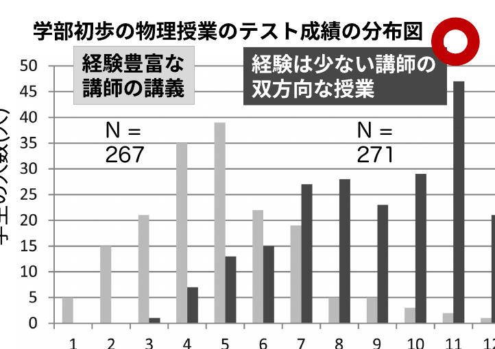

Deslauriers et al. (2011) <i>Science</i>

適切な講習を受け、双方向性・主体性のある学習を取り入れると、若い教員も良い授業ができる 　→その支援にAIはならないか？

<b>注意：</b>アクティブラーニングすること自体が授業の目的ではない <b>(効果がない事例も多数)</b>

<!--
- 学習者主体のクラス設計。経験が少ない講師でも、適切な講習を受け双方向・主体性のある学習を取り入れれば良い授業ができる。その支援にAIはならないか。アクティブラーニング自体が目的ではない点に注意。
-->

---

評価と目標の関係

# 評価の種類　参照

複雑

筆記

パフォーマンス課題 (小論文、作品制作、発表等)

論述式問題 レポート

実技テスト 面接/口頭試問

記述式問題

観察試験

選択式問題

心理テスト

単純

実演

<b>高次</b>の目標を測りやすい

組み合わせて測ることも<b>可</b>

田中耕治（2010）「よくわかる教育評価」を改変

<!--
- 評価と目標の関係。評価は単純⇔複雑、筆記⇔実演の軸で整理できる。パフォーマンス課題は高次の目標を測りやすい。組み合わせて測ることも可。
-->

---

ルーブリック

# ルーブリック　参照

<b>✔採点道具の一つで、課題を構成要素に分け、要素ごとに評価基準を満たすレベルを説明した表</b> 
✔パフォーマンス課題・レポート・実技等の評価の可視化

「<b>課題内容</b>：6分模擬授業」を評価するためのルーブリック

<table style="width:100%; border-collapse:collapse; font-size:21px;">
<tr style="background:var(--accent); color:#fff;">
<th style="border:1px solid #ccc; padding:5px 8px;">評価観点</th>
<th style="border:1px solid #ccc; padding:5px 8px;">素晴らしい(2)</th>
<th style="border:1px solid #ccc; padding:5px 8px;">合格(1)</th>
<th style="border:1px solid #ccc; padding:5px 8px;">不十分(0)</th>
</tr>
<tr>
<td style="border:1px solid #ccc; padding:5px 8px; font-weight:700;">分量</td>
<td style="border:1px solid #ccc; padding:5px 8px;"></td>
<td style="border:1px solid #ccc; padding:5px 8px;">6分間で丁度</td>
<td style="border:1px solid #ccc; padding:5px 8px;">過剰か少ない</td>
</tr>
<tr>
<td style="border:1px solid #ccc; padding:5px 8px; font-weight:700;">目標</td>
<td style="border:1px solid #ccc; padding:5px 8px;">明確かつ内容が一致していた</td>
<td style="border:1px solid #ccc; padding:5px 8px;">明確さか内容の何れかに改善点</td>
<td style="border:1px solid #ccc; padding:5px 8px;">明確さ・内容の何れも不十分</td>
</tr>
<tr>
<td style="border:1px solid #ccc; padding:5px 8px; font-weight:700;">レベル設定</td>
<td style="border:1px solid #ccc; padding:5px 8px;">手を伸ばせば届くレベルだった</td>
<td style="border:1px solid #ccc; padding:5px 8px;">一部高度・容易な箇所があった</td>
<td style="border:1px solid #ccc; padding:5px 8px;">極端に高度・容易であった</td>
</tr>
</table>

評価尺度＝列（レベル）　評価基準＝各セルの説明

ルーブリックを設計し高次目標の課題も扱おう

栗田 &amp; 中村（2024）「インタラクティブ・ティーチング 実践編３」；スティーブンス＆レビ (2014)

<!--
- メタな点：①ルーブリックでの採点やフィードバック支援はAIが可能になった
- ルーブリックは採点道具の一つ。課題を構成要素に分け、要素ごとに評価基準を満たすレベルを説明した表。評価尺度（列）と評価基準（セル）から成る。設計して高次目標の課題も扱おう。
-->

---

②課題での利用例

# 参考：AIを活用する上で、私が気をつけていること

設計

⇄

PoC

⇒

運用

⇒

確認

<b>① ループする/人力を入れる：</b>1回で正しい/求める答えは出ない。設計、PoCの双方で、AIと何度もやり取りしながら、求める形の結果になるまで整える。雛形が一回出来上がると、コンスタント化。

<b>② 十分なコンテキストを与える：</b>特に有料版の生成AIは、背景となる資料を与えた上でコンテキストを規定することで、的を射た形になる。

<b>③ 生成AIの答えを直接信用しない：</b>出てきた解答を検証する。あるいは、選択する。例えば、1つの例を作るより、10個の例をAIが作って、正しいものを選ぶほうが早いし、きれい。

<!--
- ②課題での利用例。AIを活用する上で気をつけていること：①ループする/人力を入れる、②十分なコンテキストを与える、③生成AIの答えを直接信用しない。設計→PoC→運用→確認のサイクルで回す。
-->

---

②課題での利用例

# 参考：ID(インストラクショナル・デザイン)の第一原理

<b>インストラクション</b>：学習を促進させるために行うことすべて

IDの第一原理

<table style="width:100%; border-collapse:collapse; font-size:24px;">
<tr style="background:var(--section-bg);">
<th style="border:1px solid #ccc; padding:8px 14px; text-align:left; width:42%;">5つの要件</th>
<th style="border:1px solid #ccc; padding:8px 14px; text-align:left;">説明</th>
</tr>
<tr>
<td style="border:1px solid #ccc; padding:8px 14px;">➀問題(Problem)</td>
<td style="border:1px solid #ccc; padding:8px 14px;">現実に起こりそうな問題に挑戦する</td>
</tr>
<tr>
<td style="border:1px solid #ccc; padding:8px 14px;">②活性化(Activation)</td>
<td style="border:1px solid #ccc; padding:8px 14px;">すでに知っている知識を動員する</td>
</tr>
<tr>
<td style="border:1px solid #ccc; padding:8px 14px;">③例示(Demonstration)</td>
<td style="border:1px solid #ccc; padding:8px 14px;">例示がある(Tell me でなく Show me)</td>
</tr>
<tr>
<td style="border:1px solid #ccc; padding:8px 14px;">④応用(Application)</td>
<td style="border:1px solid #ccc; padding:8px 14px;">応用するチャンスがある(Let me)</td>
</tr>
<tr>
<td style="border:1px solid #ccc; padding:8px 14px;">⑤統合(Integration)</td>
<td style="border:1px solid #ccc; padding:8px 14px;">現場で活用し、振り返るチャンスがある</td>
</tr>
</table>

鈴木克明（2015）『研修設計マニュアル』北大路書房）

<!--
- ②課題での利用例。IDの第一原理。インストラクションは学習を促進させるために行うことすべて。5要件：①問題、②活性化、③例示、④応用、⑤統合。
-->

---

②課題での利用例

# 参考：課題中心型の授業設計を行う背景にある問題意識

14世紀 @ ドイツ

Laurentius de Voltolina

現在？

Generated by DALL-E

<b>社会</b>も、<b>科学技術</b>も、<b>教育理論</b>も進歩。でも、<b>授業は同じまま</b>？

<table style="width:100%; border-collapse:collapse; font-size:22px;">
<tr style="background:var(--section-bg);"><th colspan="2" style="border:1px solid #ccc; padding:5px;">認知的領域</th></tr>
<tr><td style="border:1px solid #ccc; padding:4px 8px; text-align:center; font-weight:700;">高</td><td style="border:1px solid #ccc; padding:4px 12px;">創造</td></tr>
<tr><td style="border:1px solid #ccc; padding:4px 8px;"></td><td style="border:1px solid #ccc; padding:4px 12px;">評価</td></tr>
<tr><td style="border:1px solid #ccc; padding:4px 8px;"></td><td style="border:1px solid #ccc; padding:4px 12px;">分析</td></tr>
<tr><td style="border:1px solid #ccc; padding:4px 8px;"></td><td style="border:1px solid #ccc; padding:4px 12px;">応用</td></tr>
<tr><td style="border:1px solid #ccc; padding:4px 8px;"></td><td style="border:1px solid #ccc; padding:4px 12px;">理解</td></tr>
<tr><td style="border:1px solid #ccc; padding:4px 8px; text-align:center; font-weight:700;">低</td><td style="border:1px solid #ccc; padding:4px 12px;">記憶</td></tr>
</table>

<b>座学の講義で理解を促すだけ</b>では、到達出来たり、授業中に試せたりする<b>目標の範囲が狭くなりがち</b>。そこで、<b>課題中心や実験中心など、「起こりそうな問題」や「実験」を設計の軸にする</b>ことで、より深く学べるようになるのでは？

<!--
- ②課題での利用例。14世紀ドイツの講義と現在の講義はほとんど同じ。社会・科学技術・教育理論は進歩したのに授業は同じまま？座学だけでは到達できる目標の範囲が狭くなりがち。課題中心や実験中心を設計の軸にすれば深く学べる。
-->

---

Teaching with AI

# 参考：Teaching with AI　(Bowen &amp; Watson, AAC&amp;U 2024)

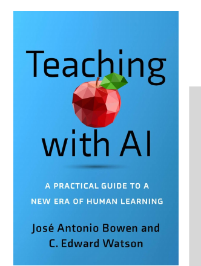

高等教育における、 生成AI活用の事例・ プロンプト集

授業での活用:

<ul style="font-size:17px; line-height:1.4; margin:2px 0 6px 1.1em; padding:0;">
<li>AIをリアルタイムの議論のサポートとして活用</li>
<li>AIを用いた模擬面接や役割演習の実施</li>
<li>AIを使った個別化された学習支援とフィードバック提供</li>
<li>クラスディスカッションでのAIの活用(例:反対意見の提示役として)</li>
<li>授業内での小テストやミニエッセイの実施</li>
</ul>

課題設計:

<ul style="font-size:17px; line-height:1.4; margin:2px 0 0 1.1em; padding:0;">
<li>個人の経験や地域に基づいた課題の作成</li>
<li>プロセスを重視した段階的な課題設計</li>
<li>ピアレビューを組み込んだ課題</li>
<li>リアルタイムの出来事についての分析課題</li>
<li>フィールドワークやインタビューを含む課題</li>
<li>グループワークやコラボレーション課題</li>
<li>アノテーション(注釈付け)を活用した読解課題</li>
<li>マルチメディア(ビデオ、ポッドキャスト)を使用した課題</li>
</ul>

評価方法:

<ul style="font-size:17px; line-height:1.4; margin:2px 0 6px 1.1em; padding:0;">
<li>ルーブリックを使用した評価</li>
<li>プロセスの評価(draftsの提出など)</li>
<li>AIとの対話記録の提出と評価</li>
<li>個別化された評価基準の設定</li>
<li>即時フィードバックの提供</li>
</ul>

特徴的な課題例:

<ul style="font-size:17px; line-height:1.4; margin:2px 0 0 1.1em; padding:0;">
<li>AIを使って生成した文章の編集・改善</li>
<li>AIの出力に対する事実確認演習</li>
<li>異なる観客向けの文章作成練習</li>
<li>ケーススタディやテキストアドベンチャーゲームの作成</li>
<li>グラフィックノベルの制作</li>
<li>プレゼンテーションの準備と実施</li>
</ul>

AIを活用しながらも、人間の創造性や批判的思考を重視し、学習効果を高める

本一冊のユースケースについて要約を依頼し出力, 2024.11.21, Claude 3.5 Sonnet

<!--
- AIを必要に応じ活用しながらも、人間の創造性や批判的思考を重視し、学習効果を高める。
- Teaching with AI（Bowen & Watson, AAC&U 2024）は高等教育での生成AI活用の事例・プロンプト集。授業での活用・課題設計・評価方法・特徴的な課題例を本一冊分要約。
-->

---

Teaching with AI

# 参考：課題中心型の授業設計

<b>✗問題解決型</b>：現実の解決する形で設定するが、どのような学びや学問を使用するかは、明確にデザインされていない (スキル獲得を目指すもの)。

<b>◯課題中心型</b>：現実に起きそうな問題を、教員が小問 (道しるべ) や試行錯誤、ワークなど、使用する概念や獲得される学びを把握して、学習課程を設計する。

方法

①新しい全体的なタスクを見せる 
②タスクに必要な構成要素を提示する 
③タスクに関する構成要素を演示する 
④もう一つ新しい全体タスクを見せる 
⑤学修者に、既習の構成要素を新タスクに応用させる 
⑥この新タスクに必要となる追加的な構成要素を提示する 
　補足：追加部分は、AIに支援させるなども可能 
⑦これらの追加的な構成要素を演示する 
⑧ステップ4~7を続くステップにも繰り返す

ブランチ・メリル (2013)

<!--
- 課題中心型の授業設計。✗問題解決型は学びや学問の使い方が明確にデザインされていない。◯課題中心型は使用する概念や獲得される学びを把握して学習課程を設計する。方法は①〜⑧の8ステップ。
-->
