<!-- _class: cover-hero -->

授業評価アンケートの活用に向けて

(補足) 授業評価アンケートに係る補足事項

<b>説明する内容：</b> ① システムの使い方・実施の流れ詳細 ② 内部質保証としての授業評価アンケート

高等教育センター 助教　<b>田川　翔</b> 
高等教育センター 質保証・FD部長／医学研究院 教授　<b>伊藤　彰一</b>

<!--
(00:45) 皆様、こんにちは。高等教育センター 助教の田川と申します。千葉大学全学FD、授業評価アンケートの活用に向けて、の二本目の動画となります。この動画では、効果的なアンケートの実施・活用方法を説明します。
-->

---

補足① イーキュースの使い方 (教員向け)

# 授業評価アンケートのスケジュール

例：2024年度 (R6) T1

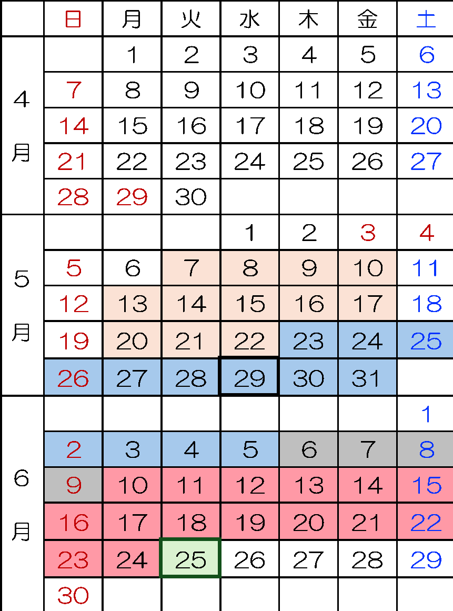

<b>アンケート対象講義選定</b>　(学部・研究科学務担当者)

<b>アンケート回答期間</b> (学生)

<b>ターム終了日</b>

<b>集計日</b> (スマートオフィス)

<b>フィードバックコメント入力期間</b> (教員)

<b>アンケート結果閲覧開始</b> (学生)

※T3、T6も含め、毎学期実施している

<!--
アンケートは毎学期、ターム単位で実施。回答期間→集計→教員のコメント入力→学生への結果閲覧、という流れがスケジュールされている。
-->

---

補足① イーキュースの使い方 (教員向け)

# 授業評価アンケートの流れ (詳細)

学生への案内メール

Step.1 回答期間開始

- アンケート開始日 　※ 未回答の場合リマインド

学生による回答

Step.2 回答期間中

- リンクから随時 - 授業中に記入 など

アンケート集計

Step.3 回答期間終了

※スマートオフィスで実施

教員へ結果通知・ 教員がコメント記入

Step.4 集計完了

- 結果を確認し、フィードバックコメント (1授業に対し1つ)を記載下さい 　※受講者が少ない場合は、集計結果のみ公開

学生へ通知メール／ 学生がコメントを確認

Step.5 学生へ、 コメントが戻る

- 一方通行ではない、コミュニケーション

<!--
回答開始→回答中→集計→教員コメント→学生へ結果が戻る、までの5ステップ。最後に学生へコメントが戻ることで、一方通行ではないコミュニケーションになる。
-->

---

補足① イーキュースの使い方 (教員向け)

# 学生への案内メール　Step.1 回答期間開始

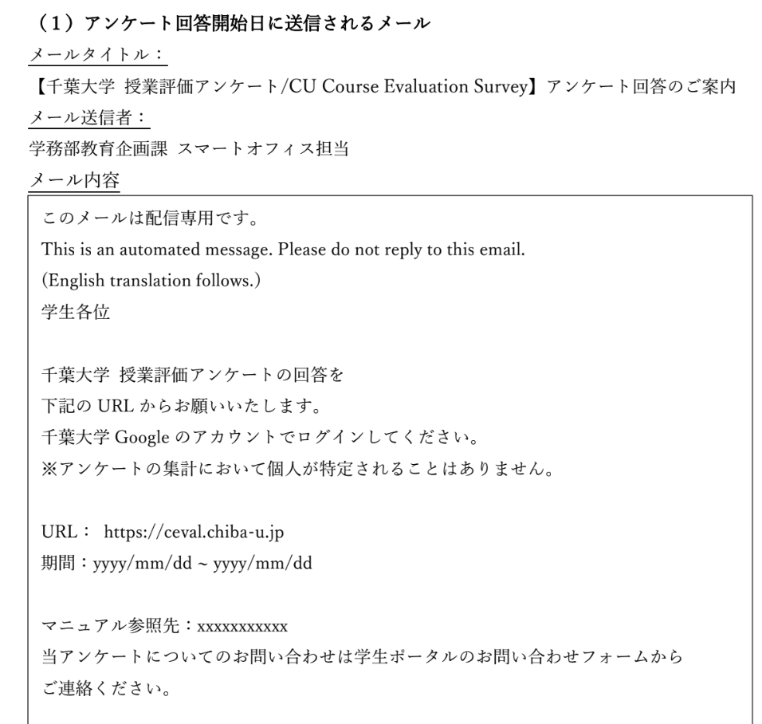

- アンケート開始日 　※ 未回答の場合リマインド

※日英、併記で送付されます。

※回答用のマニュアルリンク、期間等も送付されます。

<!--
回答開始日に学生へ案内メールが自動送付される。日本語と英語が併記され、回答用マニュアルのリンクや回答期間も記載される。未回答者にはリマインドが送られる。
-->

---

補足① イーキュースの使い方 (教員向け)

# 学生による回答　Step.2 回答期間中

- リンクから随時　- 授業中に記入 など

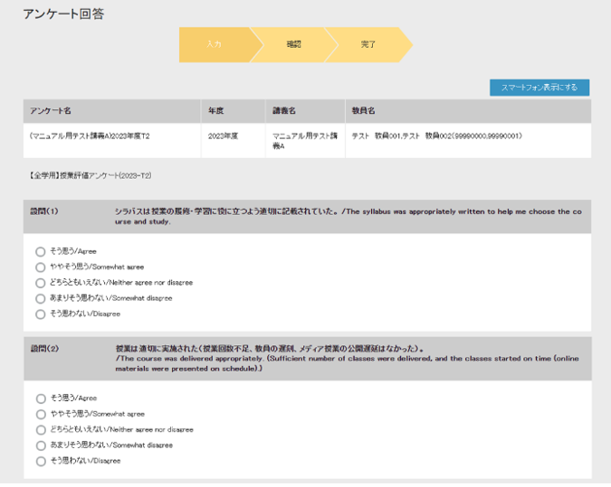

PC版

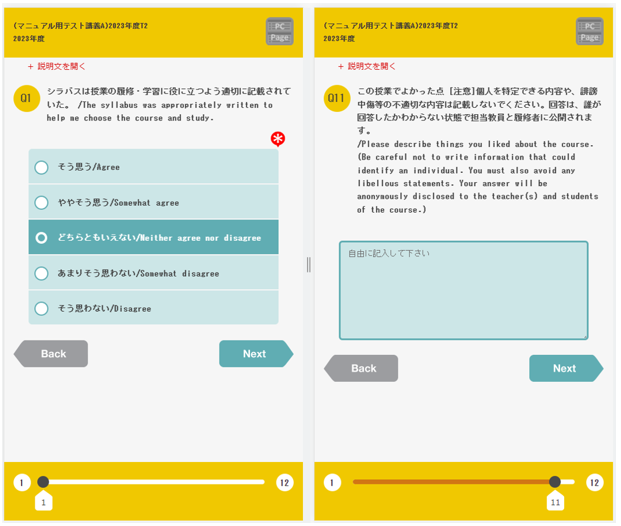

スマホ版

<!--
学生はメールのリンクから随時、または授業中に回答できる。PC版・スマホ版どちらにも対応している。
-->

---

補足① イーキュースの使い方 (教員向け)

# 教員へ結果通知・教員がコメント記入　Step.4 集計完了

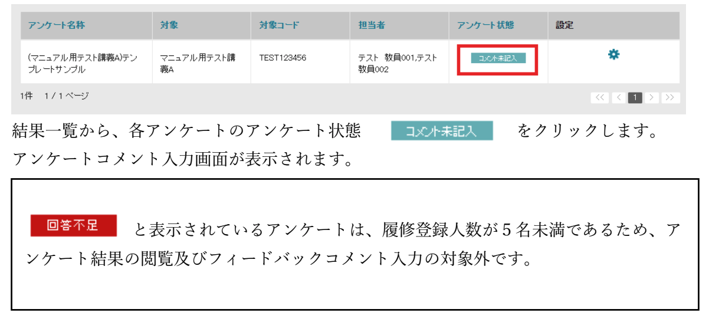
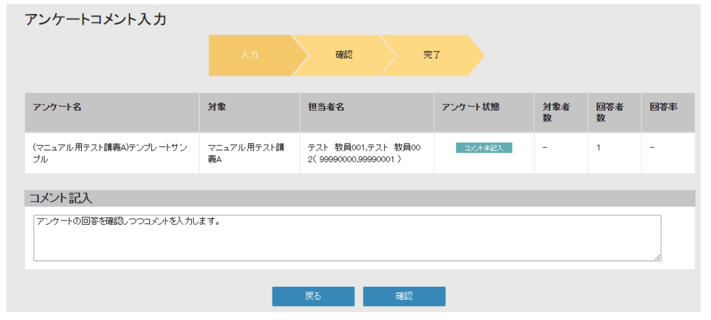

- 結果を確認し、フィードバックコメント (1授業に対し1つ)を記載下さい 　※受講者が少ない場合は、集計結果のみ公開

履修登録人数が5名未満であるため、アンケート結果の閲覧及びフィードバックコメント入力の対象外 　※分析結果の一覧は確認可能です

※オムニバス等、複数教員で担当する場合、一人でも記入された場合、コメント記入済となります

<!--
集計完了後、教員に結果が通知される。結果を確認し、1授業につき1つフィードバックコメントを記入する。受講者が5名未満の授業は対象外（分析結果の一覧は確認可能）。オムニバスは誰か一人が記入すれば記入済となる。
-->

---

補足① イーキュースの使い方 (教員向け)

# 分析結果の閲覧方法

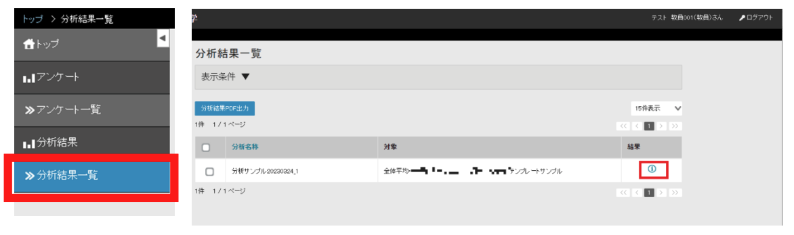
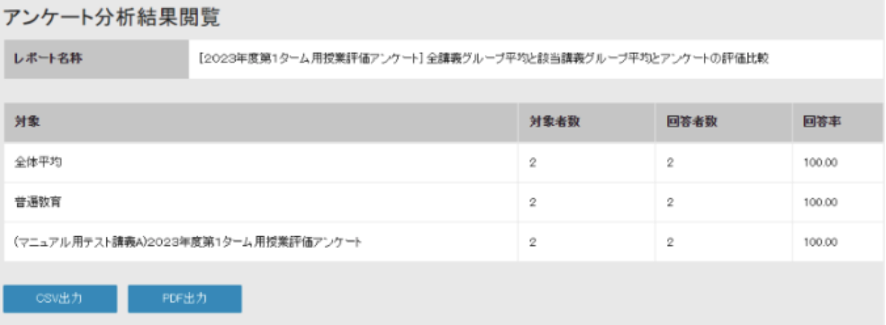

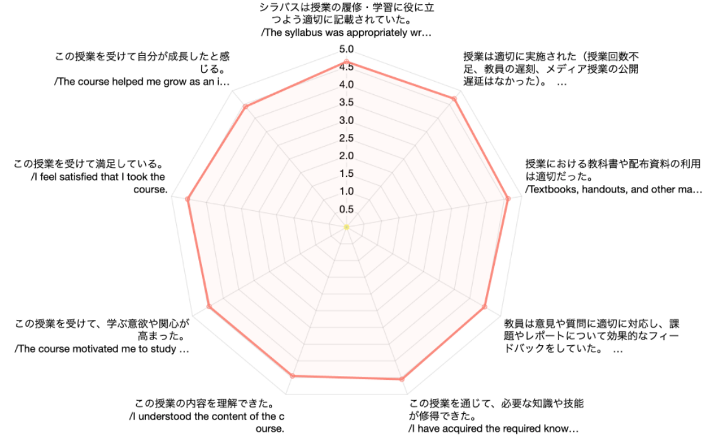

<b>より詳しく、分析されたい先生へ</b>　<b>「回答一覧 CSV 出力」</b>より、各設問(自由記述含む)について、学生を特定できない形で個票データを出力できます。

<!--
分析結果は一覧から閲覧できる。設問別の評価がレーダーチャートで可視化される。より詳しく分析したい場合は「回答一覧CSV出力」で、学生を特定できない形の個票データを出力できる。
-->

---

補足① イーキュースの使い方 (教員向け)

# システムの詳細なマニュアル

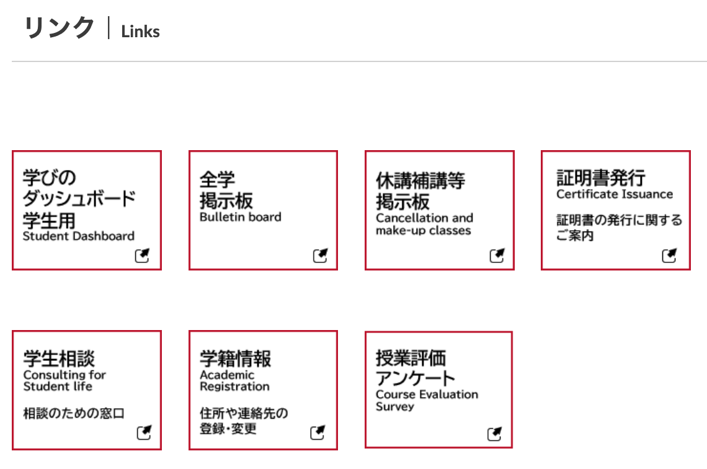

学生ポータル

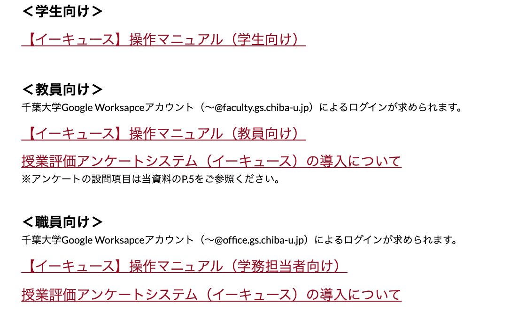

https://portal.gs.chiba-u.jp/ceval

<!--
詳細なマニュアルは学生ポータルから確認できる。学生向け・教員向け・職員向けに、それぞれ操作マニュアルやシステム導入の解説が用意されている。
-->

---

補足② 科目レベルの内部質保証

# 大学の教育の質をどう、保証するか

● 設置認可制度（学校教育法第4条）　● <b>認証評価制度</b>（学校教育法第109条第2項）◀設置時 (大学<b>設置</b>基準)　◀恒常的 (eg. 大学<b>評価</b>基準)

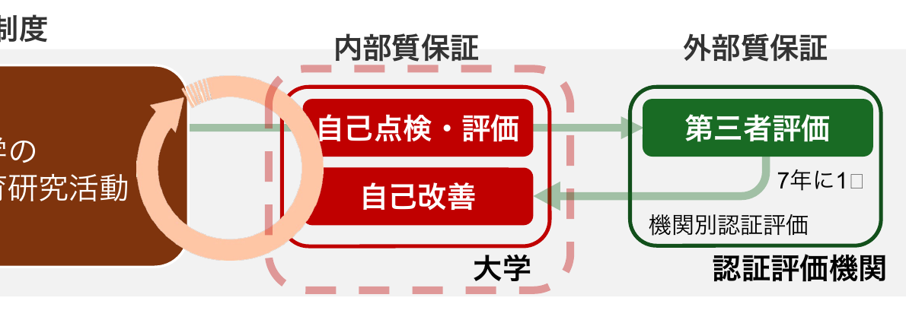

「内部質保証」とは、大学が自律的な組織として、その使命や目的を実現するために、自らが行う教育及び研究（中略）の状況について継続的に点検・評価し、質の保証を行うとともに、絶えず改善・向上に取り組むことを指す。(「教育の内部質保証に関するガイドライン」NIAD、2017)

<!--
大学の質は、設置時の「設置認可制度」と、恒常的な「認証評価制度」で保証される。大学は自ら点検・評価・改善を行う「内部質保証」と、第三者評価という「外部質保証」を組み合わせて質を保つ。機関別認証評価は7年に1回。
-->

---

補足② 科目レベルの内部質保証

# 教学マネジメント上、どのような位置づけか

<b>教学マネジメント</b>：大学がその教育目的を達成するために行う管理運営 ▶<b>大学の内部質保証の確立にも密接に関わる</b>重要な営み　<b>学修者本位の教育</b>の実現へ

・DP、CP、AdPに基づく体系的で組織的な大学教育を展開し、その成果を学位を与える課程共通の考え方や尺度に則って、点検・評価を行うことで、不断の改善に取り組むこと 
・学生の学修成果に関する情報や大学全体の教育成果に関する情報を的確に把握・測定し、教育活動の見直し等に適切に活用すること

以下の2点が必要かつ、<b>PＤＣＡサイクルを確立する</b>ことが求められる。

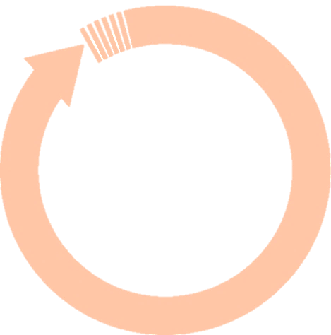

より良くを 目指す、 PDCA

授業評価アンケートは、<b>3回</b>出現する (かなり、重要視されている)　Ⅲ 学修成果・教育成果の把握・可視化／Ⅳ 教学マネジメントを支える基盤（ＦＤ・ＳＤの高度化、教学ＩＲ体制の確立）　▶個々の<b>授業改善の基礎資料</b>として、<b>FDの授業事例把握</b>の資料として

「教学マネジメント指針」 中央教育審議会大学分科会 (2020)

<!--
教学マネジメントは、教育目的の達成のための管理運営であり、内部質保証の確立に密接に関わる。「教学マネジメント指針」では授業評価アンケートが3回出現し、学修成果の把握や授業改善の基礎資料として重視されている。
-->

---

補足② 科目レベルの内部質保証

# 科目レベルの内部質保証・教学マネジメントをどう、実現するか

<b>授業評価アンケート</b>は、科目レベルの質保証の重要な手段 　個々の<b>授業改善の指針</b>として、授業への満足度や学びの状況の把握の資料として

大学評価基準２－２ 【<b>重点評価項目】内部質保証のための手順が明確に規定されていること</b>

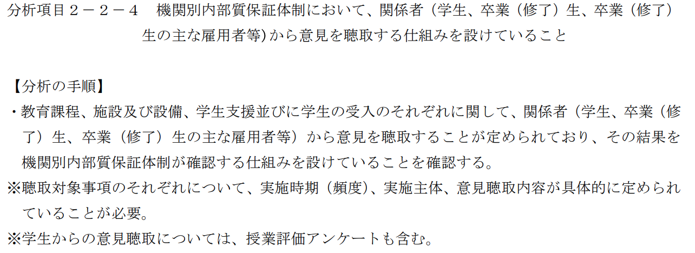

大学機関別認証評価自己評価実施要項（NIAD、令和6年6月版）　https://www.niad.ac.jp/storage/006/202405/no6_1_1_jikohyoukajissiyoukouR7.pdf

<!--
授業評価アンケートは科目レベルの質保証の重要な手段。大学評価基準2-2の重点評価項目「内部質保証のための手順が明確に規定されていること」では、関係者から意見を聴取する仕組みの一つとして、学生からの意見聴取＝授業評価アンケートも含まれる。
-->

---

補足② 科目レベルの内部質保証

# 授業評価アンケート活用の国内グッドプラクティス

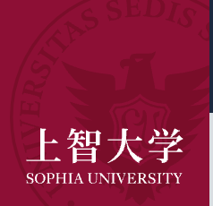

<b>インタビュー記事</b>：学生が思う「いい授業」を知り、教育を変える／分析結果例：2024年春学期大学授業アンケート集計・分析報告

例えば、学生の授業推奨度に強く影響するのは、<b>「説明のわかりやすさ」に加え、「知的に刺激され、深く勉強したくなる」授業である</b>という事実。楽な授業が評価されるだろうとの教職員側の予想はいい意味で裏切られ、上智生は歯ごたえのある授業を求めています。

北海道 大学

<b>令和5年度全学教育科目 学生による授業アンケート報告書</b>　▶ 自由記述の回答データについて、計量テキスト分析を実施、以下の提言を導く

授業の情報量と課題量は学生が受け止め切れる程度にする。予習・復習のための学習リソースを提供する。レクチャーだけでなく、グループワークなど能動的でインタラクティブな活動を取り入れる。一方、フリーライダーの防止や十分な準備時間の折込みなど工夫が必要。学生の学習意欲を維持するための形成的評価の実施。

分析対象：2275 科目、回答率：50.0%　https://www.fd-sophia.jp/activity/survey/pdf/report_2024_01.pdf

<!--
国内のグッドプラクティス。上智大学のインタビューでは、学生が求めるのは楽な授業ではなく「知的に刺激される歯ごたえのある授業」だと判明。北海道大学は自由記述を計量テキスト分析し、情報量・課題量の調整やアクティブな活動の導入などの提言を導いている。
-->

---

<!-- _class: message -->

補足② 科目レベルの内部質保証

結果を教育に還元することにより、<b>学生には、アンケートに回答して良かった、大学づくりに貢献した</b>、と思ってもらいたい。アンケートの調査期間中、回答を呼びかけるポスターに配したのは、「WE MAKE SOPHIA」のキャッチフレーズです。アンケートを通して、<b>よりよい大学を一緒につくろうとのメッセージを込めました。</b>

トレンド：「総括的評価」ではなく、フィードバックへの転換

アンケートの役割：<b>学生のフィードバックから、良い大学を一緒に作る</b>

<b>授業評価アンケートの活用や促進は、大学の制度論や高等教育政策以上に、大学での学びをより良くする風土の醸成の話なのかも、しれません。</b>

インタビュー記事：学生が思う「いい授業」を知り、教育を変える (上智大学)　https://www.sophia.ac.jp/jpn/article/feature/endeavor/endeavor-0019/

<!--
最後に。アンケートのトレンドは「総括的評価」からフィードバックへの転換。結果を教育に還元することで、学生に「回答して良かった、大学づくりに貢献した」と思ってもらう。授業評価アンケートの活用は、制度論以上に、大学での学びをより良くする風土の醸成の話なのかもしれません。
-->
