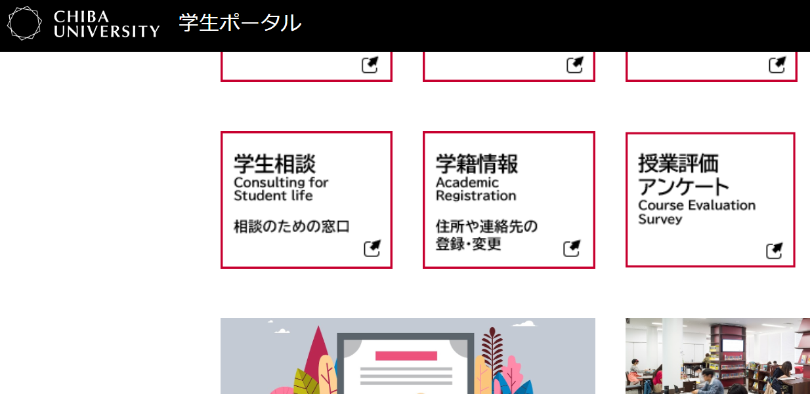
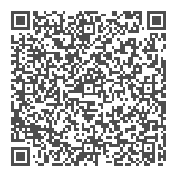

<!-- _class: cover-hero -->

授業評価アンケートの活用に向けて

② 効果的なアンケートの実施・活用方法

<b>到達目標：</b> アンケートの効果的な実施方法が分かる。 各項目を授業改善に活用できる。

<b>高等教育センター 助教</b>　田川　翔 
<b>高等教育センター 質保証・FD部長　医学研究院 教授</b>　伊藤　彰一

<!--
こんにちは 高等教育センター 助教の田川 と申します / 2本目の動画も開いていただき、ありがとうございます。 / この動画は、千葉大学全学FD、授業評価アンケートの活用に向けて、の2本目、効果的なアンケートの実施 活用方法です この動画を通して アンケートの効果的な実施方法や結果の活用方法についてお知りおきいただけますと幸いです
-->

---

②効果的なアンケートの実施・活用方法

# 後半の解説動画です

<b>毎タームの終わりに行っている授業評価アンケート</b>、後半の解説動画です。

嬉しい結果で やる気でた
時間、かかって 大変そう…
不満の記入 で心が痛い
意味あるの？ 妥当な意見なの？
使い方が、 分からない…
なぜ、 必要？

色々な声、疑問、お考えも あると想像します

この動画では、上記の点をご説明します

<!--
この動画で取り扱う声や意見はこちらです。それは、 アンケートの使い方、取得にかかる時間、 そして学生の不満の声への心づもり、という観点です。 / 一本目の動画に比べて、よりプラクティカルで役立つ内容をお伝えできればと思います。
-->

---

②効果的なアンケートの実施・活用方法

# 授業評価アンケートの流れ

<b>Step.1</b> 回答期間開始

学生への案内メール

<b>Step.2</b> 回答期間中

学生による回答

<b>Step.3</b> 回答期間終了

アンケート集計

<b>Step.4</b> 集計完了

教員へ結果通知・ 教員がコメント記入

<b>Step.5</b> 学生へ教員の コメントが戻る

学生へ通知メール／ 学生がコメントを確認

<!--
まず、簡単に授業評価アンケートの流れをご説明します。 / 最初に、アンケートへの回答期間が始まると、学生への案内メールが流れます。そして、回答期間中に学生による回答が行われ、回答期間終了後に集計作業が行われます。その後、教員へ結果が通知され、学生へのフィードバック・コメントの入力が依頼されます。最後、学生へ、アンケート結果と教員からのコメントが公開されます。 / 教員・学生間の双方向のコミュニケーションであることを目指して、このようなデザインになっています。
-->

---

②効果的なアンケートの実施・活用方法

# 授業評価アンケートの流れ — お力添え頂きたい点

<b>Step.1</b> 回答期間開始

学生への案内メール

<b>Step.2</b> 回答期間中

学生による回答

<b>Step.3</b> 回答期間終了

アンケート集計

<b>Step.4</b> 集計完了

教員へ結果通知・ 教員がコメント記入

<b>Step.5</b> 学生へ教員の コメントが戻る

学生へ通知メール／ 学生がコメントを確認

お力添え頂きたい点

<b>①</b> 回答を促して頂きたい

<b>②</b> できれば、コメントを学生に戻して頂きたい

<!--
その中で先生方にお願いしたいのは二点です。①学生に回答を促していただくこと、②できれば学生にフィードバック・コメントを戻して頂きたい、という点です。
-->

---

②効果的なアンケートの実施・活用方法

# 授業評価アンケートの回答に何分かかるでしょう

A. 1分 
B. 5分 
C. 10分 
D. 15分

<!--
まずは、アンケートの回答が集まらないことには、始まりません。 / 一つの目のお願いである、学生に回答を促していただくことについて、説明致します。 / 簡単な問題を出させて下さい。 授業評価アンケートの実施にかかる時間は、 何分ぐらいでしょうか (10秒待つ)。
-->

---

②効果的なアンケートの実施・活用方法

# 授業評価アンケートの回答に何分かかるでしょう

×　A. 1分 
◯　B. 5分 
◯　C. 10分 
×　D. 15分

ご想像より、かなり短い時間で取れるのではないでしょうか

<!--
千葉大の授業評価アンケートの場合、実は5分もあれば、十分に学生が回答するところまで終わらせることができます。10分だと、少し長め、という印象です。 / 先生のご想像より、かなり短い時間で取れるのではないでしょうか。
-->

---

②効果的なアンケートの実施・活用方法

時間、かかって 大変そう…

# 実は5分間でも、十分な回答が得られます

見えてきたグッドプラクティス ①授業中に5~10分ほど時間をとって実施する

最終回の<b>最初か最後のたった5分</b>で行っています。 昨年は10分の時間を取りましたが、5分でも質は同じでした。

※<b>補足</b>：1単位の授業科目の場合、7.5回分で1単位分の授業に到達していることとなります。 　　　　5分のアンケートを授業内に実施するのは、問題ありません。

<!--
先ほどご紹介した結果は、教育学部の八木澤先生の取り組みの中で、見えてきたことです。 / 先生は最終回の授業の最初か最後にアンケートを取得されています。 / 2023年度は10分間、2024年は5分間でアンケートを取得され、回答の質はどちらもほぼ変わらなかったそうです。
-->

---

②効果的なアンケートの実施・活用方法

時間、かかって 大変そう…

# 実はQRでも、十分な回答が得られます

見えてきたグッドプラクティス ②複雑な説明は不要、”QR + 授業改善のために答えてほしい”でOK

多くの学生はスマホで答えているようです。アンケートの価値とか重要性とか、説明したこともあるのですが、あまり聞いている様子ではありませんでした。今年はシンプルに、<b>「授業評価アンケートです。皆さんからのフィードバックは参考になりますので、よろしくお願いします」</b>とだけ伝えました。それでも回答数や内容(の質)は変わりませんでした。

<!--
では、授業中に実施する場合、教員側の準備は大変なのでしょうか。いえ、実は、そうではありません。 / 八木澤先生の実践では、QRコードを示し、授業改善のために答えてほしい、だけで十分、学生は答えられるとのことです。 / 以前は十分な説明をされていたようですが、シンプルに回答をお願いするだけでも、回答数や質は変わらないようです。
-->

---

②効果的なアンケートの実施・活用方法

# 実施例

<b>千葉大学授業評価アンケート</b> 授業を良くするために、皆様の感想・意見を教えて下さい

<b>所要時間</b>：5分間 
<b>方法</b>：スマホで回答可 
<b>教員氏名</b>：田川

①詳細に書きたい方は、メールで届いたアンケートの案内、以下のURLからも記入できます。 https://portal.gs.chiba-u.jp/ceval　②あとから、結果の修正も可能です。　③結果は匿名化され、この授業と大学の教育を良くする目的で使用されます。後ほど、教員からもフィードバック致します。

<!--
私の方でも、学生に説明する際に使えそうなスライドのモックアップを作ってみました。アンケートシステムであるイーキュスへのログインリンク、時間、講師名。これで十分学生は答えることができるようです。ぜひ、ご活用してみて下さい。
-->

---

②効果的なアンケートの実施・活用方法

時間、かかって 大変そう…

# 日頃より教員に相談できる雰囲気も重要です

見えてきたグッドプラクティス ③協力的な学びの場作りで、日頃から教員に伝えられる教室を

.. honestly it's more helpful to get that feedback <b>before </b>the end of the course, and <b>I try to create a classroom where that's possible.</b>

cf. 授業の雰囲気に最も影響する要素は、<b>「教員の学生志向性※」</b>であり、学生の主体的な学びにポジティブな影響をもつ 。 <i>Astin (1993)</i> 　※ 学生の学業面の課題への関心、授業外への親しみやすさ、学生への認識など

<!--
そして、もう一つ重要な点は、協力的な学びの場作りです。 / モリス先生は、協力的な場作りで、日頃から学生が教員に課題感を伝えられるようにしているとのことです。 / 「協力的な学びの場作り」は、学生のモチベーションを上げる方法の一つとして知られています。
-->

---

②効果的なアンケートの実施・活用方法

使い方が、 分からない…

# 各項目が関連しうる改善可能項目について、必要に応じてご確認ください

(1) シラバスは授業の履修・学習に役に立つよう適切に記載されていた。

→ シラバスのFDやシラバスチェックをご参照下さい。大学設置基準 (第25条)に依拠するのみならず、<b>学生の主体的な学びを支援する</b>ものです。

(2) 授業は適切に実施された（授業回数不足、教員の遅刻、メディア授業の公開遅延はなかった）。

→ <b>授業成立の前提条件</b>となるため、この点は、ぜひ満点に向け、お願い致します。

(3) 授業における教科書や配布資料の利用は適切だった。

→ 学修者レベルに合っていない、アクセスできない、スライドに過不足がある、指定した教科書を使わない、学び方の学びを説明していない、など

(4) 教員は意見や質問に適切に対応し、課題やレポートについて効果的なフィードバックをしていた。

→ 特に、オンデマンド授業の場合にご注意下さい。

(10) １回の授業にあたり、授業時間以外の学習・活動に費やした平均時間はどの程度でしたか。

→ 1単位<b>45時間</b>の学修が必要です。 (主に授業内で15時間、予習・復習で30時間)

※ 専門法務研究科を除く授業評価アンケート

<!--
こちらのスライドに、各項目についての改善のヒントを記載しております。必要に応じてご確認頂けますと幸いです。
-->

---

②効果的なアンケートの実施・活用方法

使い方が、 分からない…

# 学生とのコミュニケーションとして、必要に応じ、フィードバックして下さい

「皆さんの声・アイデアを踏まえて、今後の授業内容を検討したいと思います」

<ul style="font-size:19px; line-height:1.45; margin-top:12px; padding-left:1.1em;">
<li>Moodleでの質問数は、前年度と比べて今年度はほとんど無かった。講義時に質問しにくい場合にMoodle等で質問できることをアナウンスしているが、より周知したい。</li>
<li>オムニバス形式の授業のため、フィードバックの部分で課題が残ってしまった。Moodleをうまく活用しフィードバックするように改善します。</li>
<li>授業時間外に予習復習をすることが求められていることを周知する必要があることがわかった。</li>
</ul>

<b>2024年前期、350件</b>を超える授業で、教員から学生へのフィードバックを頂けました

<ul class="pip-safe" style="font-size:19px; line-height:1.45; margin-top:12px; padding-left:1.1em;">
<li>概ね好評のようであった。回答率が数パーセントなので、できればもっと多くの学生にコメントをして欲しかった。</li>
<li>スライドの文字が多いことや話が多かったことについて、今後改善をしていきたいと思います。</li>
<li>もっと多くの受講者に答えてほしかった</li>
<li>視覚的な教材が良かったという声もありましたので、今後の使い方を考えたいと思います。</li>
</ul>

<!--
先生方にご協力頂きたい点の2つ目、学生へのフィードバックコメントについてです。2024年度前期の授業では、350件を超えるフィードバックが教員から学生に届いています。匿名でその記載事項をまとめ、気になるものを抜き出してみました。教員も学生の回答を受けるだけではなく、教員の意図を伝える、双方向のコミュニケーションの道具となっています。
-->

---

②効果的なアンケートの実施・活用方法

使い方が、 分からない…

# 学生とのコミュニケーションとして、必要に応じ、フィードバックして下さい

「ありがとう。」

「期待しています。」

「素敵な教員になって下さい、応援しています。」

好循環を 回しましょう

<ul style="font-size:21px; line-height:1.55; margin:0 0 0 165px; padding:0; list-style:none;">
<li>- アンケート結果への教員のフィードバック</li>
<li>- 学生の<b>「自分は授業に良い影響を与えている」</b>という感覚</li>
<li>- 学生の回答のモチベーションになる</li>
<li>- <b>授業がよりよくなる</b></li>
<li>- 学生の<b>学びのモチベーション</b>になる</li>
</ul>

<!--
読んでいくと、ちょっと心が動くようなコメントを記載されている先生もいらっしゃいます。 / 教員のフィードバックは、学生が自分の授業に良い影響を与えているという感覚に繋がり、回答を増加させ、学修者本位の授業に繋がります。それは未来の学生の学びのモチベーションになります。そうしたポジティブな循環が生まれると嬉しいです。
-->

---

②効果的なアンケートの実施・活用方法

不満の記入 で心が痛い

# フィードバックという意味以上に、気にしすぎる必要はありません

私自身、FDで<b>結構ズタボロに書かれたこと</b>があります。教員相手なので凹みましたが、気づきもありました。

重要なのは、

コメントに左右されず、<b>改善のサイクルを回す、フィードバックとして捉える</b>ことです。

そして、<b>良いことや建設的なこと</b>が書かれている方が多く、教えるモチベーションになったこともあります。

▶ 裏話など、ぜひダイアログをご視聴下さい！

<!--
最後に、不満の記入への心持ちです。ほとんどの教員が辛いコメントを書かれたことがあると思います。自分もそうです。 / 重要なのは、コメントに左右されるのではなく、改善のサイクルを回す、フィードバックとなる点を見出すことです。実はかなりの場合、良いことや建設的なことが書かれている場合も多いのです。あまり構えずにご活用頂けますと幸いです。
-->

---

まとめ

# まとめ — 授業評価アンケートをぜひご活用下さい

時間、かかって 大変そう…

実は5分間でも、十分な回答が得られます QRを提示し、スマホで答える、でOKです

使い方が、 分からない…

各項目が関連しうる改善可能項目について、必要に応じてご確認ください <b>学生とのコミュニケーション</b>として、必要に応じ、フィードバックして下さい

不満の記入 で心が痛い

フィードバックという意味以上に、気にしすぎる必要はありません

<!--
この映像では、効果的なアンケートの実施・活用方法についてご説明致しました。実は5分、スマホで答える形式でも十分な回答があること、学生との双方向的なコミュニケーションとしてご活用頂きたいこと、フィードバックという以上に気にする必要はないこと、この三点がお伝えしたかったことです。
-->

---

<!-- _class: cover-hero -->

おわりに

嬉しい結果で やる気でた

授業アンケートを活用する文化を作り、 
学生にも、教員にも幸せな、より良い千葉大の教育を 
作って行きましょう

<!--
アンケートを実施していくことで、良かった、伝わった、嬉しかった、ということも出てくると思います。授業評価アンケートをぜひ先生の授業でもご活用頂き、よりよい千葉大の教育へと繋がっていけばと思います。以上で本FDを終了致します。ご視聴頂き、ありがとうございました。
-->
