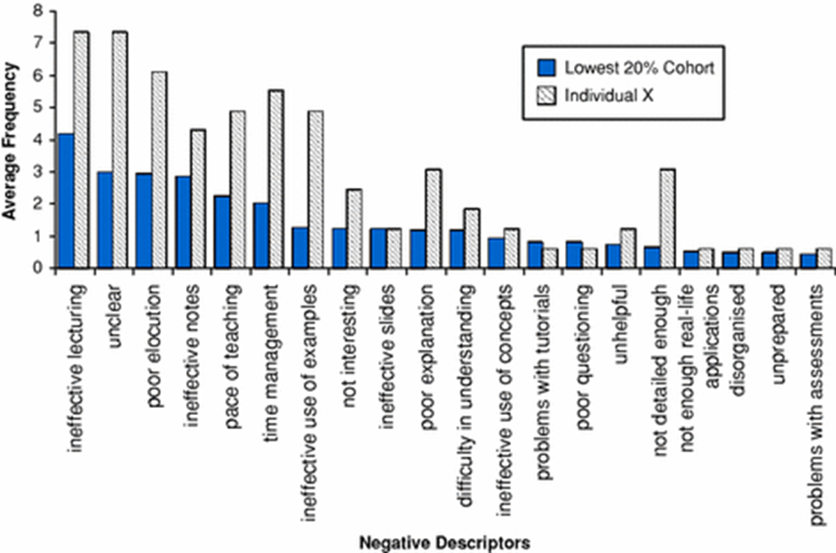
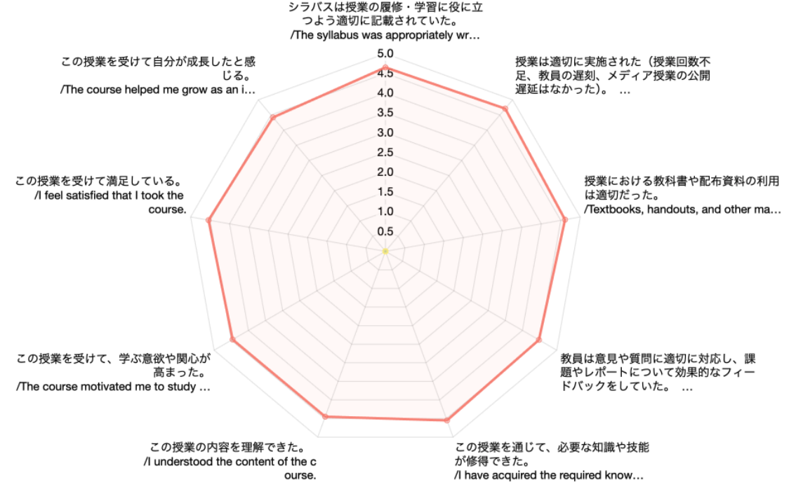
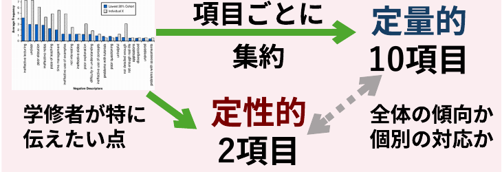
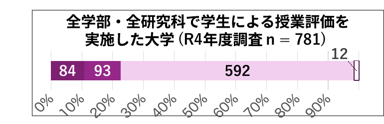
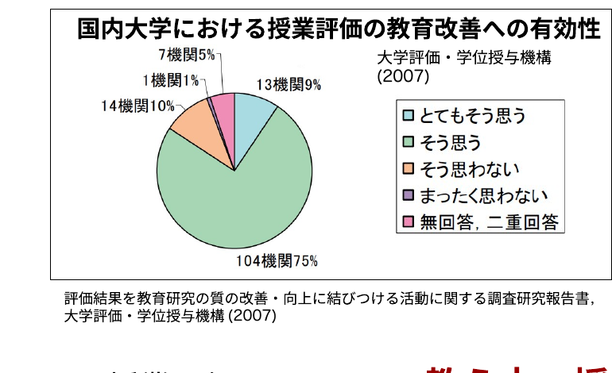
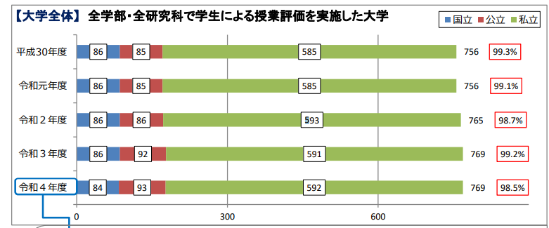
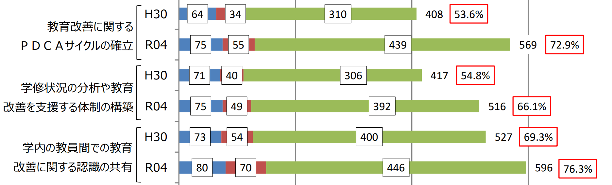
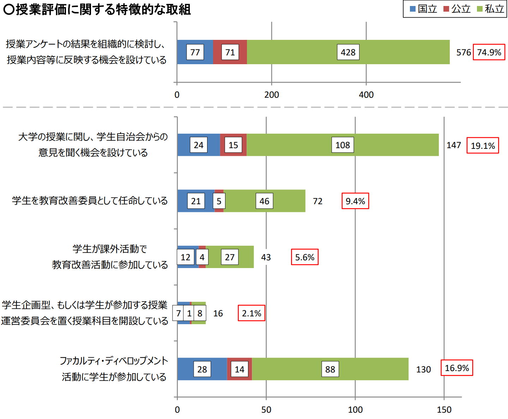

<!-- _class: cover-hero -->

授業評価アンケートの活用に向けて

① アンケートの価値 / 活用のグッドプラクティス

願わくば…

<b>到達目標：</b> 授業評価アンケートに価値を見出す。 「活用したい」と感じるようになる。

<b>高等教育センター 助教</b>　<b style="font-size:26px;">田川　翔</b> 
<b>高等教育センター 質保証・FD部長　医学研究院 教授</b>　<b style="font-size:26px;">伊藤　彰一</b>

<!--
- タイトルコール。授業評価アンケートに価値を見出し、活用したいと感じるようになる、が到達目標です。
-->

---

①アンケートの価値/活用のグッドプラクティス

# 毎タームの終わりに行っている授業評価アンケート

<b>不満の記入</b> <b>で心が痛い</b>

<b>嬉しい結果で</b> <b>やる気でた</b>

<b>時間、かかって</b> <b>大変そう…</b>

<b>意味あるの？</b> <b>妥当な意見なの？</b>

<b>なぜ、</b> <b>必要？</b>

<b>使い方、</b> <b>呼びかけ方、</b> <b>分からない…</b>

色々な声、疑問、お考えもあると想像します。 そんな先生方に<b>応える</b>のがこの映像です。

<!--
- でも、アンケートを有効活用しようと思っていただければ嬉しいです。
-->

---

①アンケートの価値/活用のグッドプラクティス

# この動画では、上記の2点をご説明します

<b>なぜ、必要？</b>

<b>意味あるの？</b> <b>妥当な意見なの？</b>

毎タームの終わりに行っている<b>授業評価アンケート</b>について

<!--
- でも、アンケートを有効活用しようと思っていただければ嬉しいです。
-->

---

①アンケートの価値/活用のグッドプラクティス

# そもそも、<b>なぜ、</b>授業評価アンケートを取るのでしょう

A.　大学が評価を受ける上で、必要なため。 
B.　教え方の上手い/下手を点数化するため。 
C.　良い授業が行われていることを保証するため。 
<b style="color:var(--accent-dark);">D.　先生方に次年度の授業改善に活かして頂くため。</b>

<!--
- でも、アンケートを有効活用しようと思っていただければ嬉しいです。
-->

---

①アンケートの価値/活用のグッドプラクティス

# そもそも、<b>なぜ、</b>授業評価アンケートを取るのでしょう

△　A.　大学が評価を受ける上で、必要なため。 
×　B.　教え方の上手い/下手を点数化するため。 
◯　C.　良い授業が行われていることを保証するため。 
◎　<b style="color:var(--accent-dark);">D.　先生方に次年度の授業改善に活かして頂くため。</b>

<b>よりよい授業</b>を<b>実現する</b>際に参考となるコミュニケーションツール

先生ご自身が<b>自己アピールに活用</b>されるのは妨げません

<!--
- もちろん、昇進など、自己アピールでの活用は問題ありません。
-->

---

①アンケートの価値/活用のグッドプラクティス

# 授業改善に繋がる内容とは具体的に何なのでしょう

Pan et al. (2009) <i>Res. High. Educ.</i> シンガポール国立大学の授業評価アンケートのネガティブな記述子の頻度

授業改善として、教員に対する頻出コメント例<b>(青)</b> 
<b>①効果がない教え方　②不明瞭な説明 ③聞きにくい　④効果の低い板書 ⑤授業ペースが速い/遅い　⑥時間管理がまずい ⑦例が効果的ではない　⑧興味を惹かない ⑨スライドが効果的ではない　⑩説明が下手 ⑪理解が難しい…</b>

先生ご自身の個性や環境といった要因<b>より</b>も<b>教え方など変えられるものが大半</b>です

<!--
- 授業改善に繋がる内容は、先生の個性や環境よりも、教え方など変えられるものが大半です。
-->

---

①アンケートの価値/活用のグッドプラクティス

# 千葉大学の授業評価アンケートの構造

<b>10個の定量的項目</b>

<b>2つの定性的項目</b>

- よかった点 - 改善されると学修者として嬉しい点

<b>イメージ</b>

<!--
- 千葉大の授業評価アンケートは、10個の定量的項目と、2つの定性的項目で構成されています。
-->

---

①アンケートの価値/活用のグッドプラクティス

<b>意味あるの？</b> <b>妥当な意見なの？</b>

<h1 style="font-size:36px; line-height:1.45;"><b>授業評価など学生アンケートは、</b>限界もありつつも、<b style="color:var(--accent-dark)">妥当性を持つ</b>という研究結果が多くあります。</h1>

<!--
- 授業評価など学生アンケートは、限界もありつつも、妥当性を持つという研究結果が多くあります。
-->

---

①アンケートの価値/活用のグッドプラクティス

<b>意味あるの？</b> <b>妥当な意見なの？</b>

<h1 style="font-size:34px; line-height:1.45;"><b>授業評価など学生アンケートは、</b>限界もありつつも、<b style="color:var(--accent-dark)">妥当性を持つ</b>という研究結果が多くあります。</h1>

学生は、<b>教員のユーモアやカリスマ性などの特定の個性より</b>も<b style="color:var(--accent-dark)">「教育の質」— つまり説明能力や理解を助ける力—を重視</b>し評価する。

Pen et al. (2009) <i>Res. High. Educ.</i> シンガポール国立大学のアンケートの分析

<!--
- 学生は、教員の個性よりも教育の質を重視して評価します。
-->

---

①アンケートの価値/活用のグッドプラクティス

<b>意味あるの？</b> <b>妥当な意見なの？</b>

<h1 style="font-size:32px; line-height:1.4;"><b>授業評価など学生アンケートは、</b>限界もありつつも、<b style="color:var(--accent-dark)">妥当性を持つ</b>という研究結果が多くあります。</h1>

学生は、<b>教員のユーモアやカリスマ性などの特定の個性より</b>も<b style="color:var(--accent-dark)">「教育の質」— つまり説明能力や理解を助ける力—を重視</b>し評価する。

Pen et al. (2009) <i>Res. High. Educ.</i> シンガポール国立大学のアンケートの分析

学生の総合的な授業評価は<b>教え方の質</b>が最も大きな因子となる。<b style="color:var(--accent-dark)">教え方の質、科目のやりがい、興味の水準、成績、教員の親切さ</b>の5つで分散の多くを説明できる

Barth (2008) <i>J. Educ. Bus.</i> ジョージアサザン大学のアンケートの分析

<!--
- 学生の総合的な授業評価は、教え方の質が最も大きな因子です。
-->

---

①アンケートの価値/活用のグッドプラクティス

<b>意味あるの？</b> <b>妥当な意見なの？</b>

学生は、<b>教員のユーモアやカリスマ性などの特定の個性より</b>も<b style="color:var(--accent-dark)">「教育の質」— つまり説明能力や理解を助ける力—を重視</b>し評価する。

Pen et al. (2009) <i>Res. High. Educ.</i> シンガポール国立大学のアンケートの分析

学生の総合的な授業評価は<b>教え方の質</b>が最も大きな因子となる。<b style="color:var(--accent-dark)">教え方の質、科目のやりがい、興味の水準、成績、教員の親切さ</b>の5つで分散の多くを説明できる

Barth (2008) <i>J. Educ. Bus.</i> ジョージアサザン大学のアンケートの分析

学生アンケートの結果には、信頼性と安定性があり、適切な支援と併用される場合、<b style="color:var(--accent-dark)">教育効果の向上に役立つ</b>といえる。

Marsh &amp; Roche (1997) <i>Am. Psychol.</i> 学生による教育評価に関するレビュー論文

<b style="color:#C0182B;">×総括的評価が嫌だ</b> → ◯<b>よりよい授業のためのフィードバック・参考意見</b>

<!--
- 総括的評価ではなく、よりよい授業のためのフィードバックと捉えましょう。
-->

---

①アンケートの価値/活用のグッドプラクティス

<b>より詳しく知られたい先生方へ</b> 
・海外での事例については、<b>SET (Student Evaluation of Teaching)</b>と検索頂くと、相当数の論文や実施例が見つかります。 
・日本では、東海大学を皮切りに、<b>現在殆どの大学で実施</b>されています。 
・アンケートの信頼性にはまだ多くの議論があり、<b>バイアスの影響を含め、結果の利用には限界がある</b>と考えられています。 
　▶結果/記載内容を<b>絶対視する必要はありません</b> (誤解や批判もある) 
　▶結果の<b>全てに応対する必要はありません</b> (有効な内容を活用する)

<b>懸念や限界も含め、詳しい内容を参照されたい方へ：</b>Spooren et al. (2013) RER 
大学における、学生の教育評価に関する大規模システマティックレビュー

<!--
- より詳しく知りたい方は、SETで検索を。結果を絶対視する必要も、全てに応対する必要もありません。
-->

---

①アンケートの価値/活用のグッドプラクティス

# 国内大学における授業評価の教育改善への有効性

大学における教育内容等の改革状況について (R4), 文部科学省 (2023)

評価結果を教育研究の質の改善・向上に結びつける活動に関する調査研究報告書, 大学評価・学位授与機構 (2007)

国内でも、<b style="font-size:34px;">98 %</b>の大学が 学生による何らかの授業評価を実施

有効性は、 <b style="font-size:30px;">概ね肯定的に認識</b> されている。

授業評価アンケートは<b>教え方・授業改善に活用できるツール</b>です

<!--
- 国内では98%の大学が学生による授業評価を実施しており、その有効性も概ね肯定的に認識されている。授業評価アンケートは教え方・授業改善に活用できるツールです。
-->

---

①アンケートの価値/活用のグッドプラクティス

なぜ、 必要？

大学として必要な理由と 
先生ご自身のお役に立てるからという理由があります

<!--
- アンケートが必要な理由には、大学として必要な理由と、先生ご自身のお役に立てるからという理由があります。
-->

---

①アンケートの価値/活用のグッドプラクティス

なぜ、 必要？

大学として必要な理由と先生ご自身のお役に立てるからという理由があります

<svg viewBox="0 0 360 340" style="height:330px; flex:0 0 auto;" xmlns="http://www.w3.org/2000/svg">
<path d="M180 60 a110 110 0 1 1 -78 32" fill="none" stroke="#DD8893" stroke-width="26" stroke-linecap="butt"/>
<polygon points="180,44 200,72 160,72" fill="#DD8893"/>
<g font-family="sans-serif" font-weight="800" text-anchor="middle">
<g><rect x="120" y="20" width="120" height="38" rx="8" fill="#2E6CB5"/><text x="180" y="45" font-size="20" fill="#fff">分析</text></g>
<text x="180" y="13" font-size="14" fill="#333">Analysis</text>
<g><rect x="262" y="118" width="86" height="38" rx="8" fill="#7D3FA6"/><text x="305" y="143" font-size="20" fill="#fff">設計</text></g>
<text x="305" y="172" font-size="14" fill="#333">Design</text>
<g><rect x="228" y="232" width="86" height="38" rx="8" fill="#3FA66B"/><text x="271" y="257" font-size="20" fill="#fff">開発</text></g>
<text x="271" y="288" font-size="14" fill="#333">Development</text>
<g><rect x="92" y="232" width="86" height="38" rx="8" fill="#D98A1F"/><text x="135" y="257" font-size="20" fill="#fff">実施</text></g>
<text x="135" y="288" font-size="14" fill="#333">Implementation</text>
<g><rect x="10" y="118" width="86" height="38" rx="8" fill="#C0182B"/><text x="53" y="143" font-size="20" fill="#fff">評価</text></g>
<text x="53" y="172" font-size="14" fill="#333">Evaluation</text>
<text x="180" y="172" font-size="17" fill="#C0182B">Close the LOOP!</text>
<text x="180" y="196" font-size="17" fill="#C0182B">Be AGILE!</text>
</g>
</svg>

<b>ADDIEモデル</b> <b style="font-size:27px;">授業・教材設計のプロセス</b>を示したもの (ガニエ他 2007) ※但し1980sからある

授業を改善するとは、 <b style="color:var(--accent-dark);">改善のサイクルを回す</b>こと

<b>起点</b>となる<b>評価→分析</b>の道具が、 授業評価アンケートの役割です

<!--
- 授業を改善するとは改善のサイクルを回すこと。ADDIEモデルはそのプロセスを示したもので、起点となる評価→分析の道具が授業評価アンケートの役割です。Close the LOOP! Be AGILE!
-->

---

①アンケートの価値/活用のグッドプラクティス

# 活用のグッド・プラクティス

2024年度前期に、回収率が良かった先生にお話を伺いました

<b style="color:var(--accent-dark); font-size:24px;">教育学部</b> 助教 八木澤 史子先生 専門は初等中等教育におけるICT利用。 小学校教諭を長年勤め、千葉大学に2022年ご着任

<b style="color:var(--accent-dark); font-size:24px;">国際未来教育基幹</b> 特別語学講師 Roy Morris 先生 専門は英語教育。 各大学での英語講師を経て、千葉大学に2024年着任。

お二人の授業での回収率は、なんと、<b style="font-size:30px;">7割</b>超え！　活用の秘訣を伺いました

<!--
- 2024年度前期に回収率が良かった先生にお話を伺いました。教育学部の八木澤史子先生と、国際未来教育基幹のRoy Morris先生。お二人の回収率はなんと7割超え。活用の秘訣を伺いました。
-->

---

①アンケートの価値/活用のグッドプラクティス

# 活用のグッド・プラクティス

<b style="color:var(--accent);">見えてきた活用の原則 ①</b> 学生と教員間の<b>認識のズレ</b>に気づき、<b>伝え方/設計を変える機会</b>と捉える

必修授業で学校のICT活用を教えたのですが、ICT推しの内容が気に入らなかった学生もいて…。ICTに不信感を持つ学生にとっては、押し付けられるのが嫌だったんだと気づきました。次の年の授業からは、ICTを取り入れる利点を教えつつ、<b>「苦手な人と得意な人の差も考慮してどうすべきか考える」という構成を取り入れた</b>ところ、「ICT推しは嫌だ」というコメントはなくなりました。

評価から、学修者を分析し、設計を変えて、実施する　まさに、ADDIEの実践例です

<!--
- 見えてきた活用の原則①。学生と教員間の認識のズレに気づき、伝え方／設計を変える機会と捉える。八木澤先生の事例はまさにADDIEの実践例です。
-->

---

①アンケートの価値/活用のグッドプラクティス

# 活用のグッド・プラクティス

<b style="color:var(--accent);">見えてきた活用の原則 ①</b> 学生と教員間の<b>認識のズレ</b>に気づき、<b>伝え方/設計を変える機会</b>と捉える

I sometimes find comments like <b>"The teacher spoke too quickly"</b> and these are helpful,.. Usually I use the results of these to make sure my class had met everyone's expectations.

期末の授業評価アンケートにだけに頼らず、 日頃から授業改善可能な「学びの場づくり」が面白いです

<!--
- Morris先生も、コメントを授業がみんなの期待に応えられているか確認するために使っている。期末のアンケートにだけ頼らず、日頃から授業改善可能な「学びの場づくり」が面白いです。
-->

---

①アンケートの価値/活用のグッドプラクティス

# 活用のグッド・プラクティス

<b style="color:var(--accent);">見えてきた活用の原則 ②</b> 即対応出来るものと、来年のもの、後回しで検討のものに<b>分ける</b>

1回目の授業で出た反省を2回目や翌年の授業に活かすようにしています。例えば、「スライドが見にくい」や「声が大きすぎる」というのはすぐに改善できます。一方、<b>内容や授業構成全体に関わるものは、すぐに修正するのは難しい</b>です。最初に<b>「対応可能なもの」</b>と<b>「そうでないもの」</b>に分けて考えるようにしています。そうすると自分も少し気が楽になりますし、授業も無理なく改善できますね。

<!--
- 見えてきた活用の原則②。即対応できるもの、来年のもの、後回しで検討のものに分ける。すぐ直せるものと、内容・構成に関わる難しいものを最初に分けると、気が楽になり無理なく改善できる。
-->

---

①アンケートの価値/活用のグッドプラクティス

# 活用のグッド・プラクティス

<b style="color:var(--accent);">見えてきた活用の原則 ②</b>　即対応出来るものと、来年のもの、後回しで検討のものに<b>分ける</b>

<b style="color:var(--accent-dark);">優先度</b> (=目標達成へ必要な度合い)

<table style="border-collapse:collapse; font-size:21px; text-align:center;">
<tr><td style="border:none;"></td><td style="border:none;"></td><td colspan="3" style="padding:4px 10px; font-weight:800;">対応に必要な努力量</td></tr>
<tr><td style="border:none;"></td><td style="border:none;"></td><td style="border:1.5px solid #888; padding:6px 14px; background:#f4f4f4;">少ない</td><td style="border:1.5px solid #888; padding:6px 14px; background:#f4f4f4;">中</td><td style="border:1.5px solid #888; padding:6px 14px; background:#f4f4f4;">多い</td></tr>
<tr><td rowspan="3" style="writing-mode:vertical-rl; text-orientation:upright; font-weight:800; padding:6px; background:var(--accent); color:#fff;">優先度</td><td style="border:1.5px solid #888; padding:6px 12px; font-weight:800; background:#FBE4EA;">対応必須</td><td style="border:1.5px solid #888; padding:10px;">連絡忘れ</td><td style="border:1.5px solid #888; padding:10px;"><b style="color:var(--accent);">シラバスと違う！</b></td><td style="border:1.5px solid #888; padding:10px;"></td></tr>
<tr><td style="border:1.5px solid #888; padding:6px 12px; font-weight:800;">高い</td><td style="border:1.5px solid #888; padding:10px;">話し方…</td><td style="border:1.5px solid #888; padding:10px;">資料</td><td style="border:1.5px solid #888; padding:10px;"><b>例</b></td></tr>
<tr><td style="border:1.5px solid #888; padding:6px 12px; font-weight:800;">低い</td><td style="border:1.5px solid #888; padding:10px;"></td><td style="border:1.5px solid #888; padding:10px;"></td><td style="border:1.5px solid #888; padding:10px;"></td></tr>
</table>

※ 他の教員・FDなどの力を借りる手もあります！

フィードバックを改善に落とし込む前に、<b>優先順位</b>と<b>手数</b>を考え、<b>どこから改善するかを考える</b>のは、有効に思います。時々、<b>対応必須の内容も出てくる</b>と思います。全てを一律に改善するのではなく、<b>タイムフレームを分ける心持ち</b>に納得しました。

<!--
- 優先度（=目標達成へ必要な度合い）と対応に必要な努力量のマトリクスで整理する。優先順位と手数を考え、どこから改善するかを考えるのは有効。タイムフレームを分ける心持ちに納得。他の教員・FDの力を借りる手もあります。
-->

---

①アンケートの価値/活用のグッドプラクティス

# 活用のグッド・プラクティス

<b style="color:var(--accent);">見えてきた活用の原則 ③</b> 総括評価ではなく、<b>フィードバックの声/コミュニケーション</b>として捉える

<b>学生からのフィードバック</b>で授業改善することが、自分自身の良い授業に繋がると思います。学生も、自分の意見が授業に反映されると感じれば、より積極的に参加してくれるのではないかな、と。もちろん、すべての意見を反映できるわけではありませんが。でも、<b>少しでも「自分たちの意見が尊重されている」感覚</b>が、学習意欲につながるのではないでしょうか。

... very occasionally I get one student answering negatively in a class. It can be frustrating, but I try to read them carefully as those students are actually giving <b>feedback that I can reflect and act on</b> (usually).

フィードバックとして捉え、良い授業の糧とする。「省察的実践家」としての姿勢に、感銘を受けました。 参考 ▶ 八木澤先生のインタビューは、書き起こしがございますので、ご興味あればご確認下さい

<!--
- 見えてきた活用の原則③。総括評価ではなく、フィードバックの声／コミュニケーションとして捉える。フィードバックを良い授業の糧とする「省察的実践家」としての姿勢に感銘を受けました。
-->

---

①アンケートの価値/活用のグッドプラクティス

# 活用のグッド・プラクティス

<b>適切な支援と併用される場合</b>、教育効果の向上に役立つ　Marsh &amp; Roche (1997) <i>Am. Psychol.</i>

アンケートの回答率：最も高いのは教育学部

部局での風土づくりを行う

① 学部長(藤川先生)より、「アンケートを大事にしましょう」と教授会で共有があった

部局での活用の場を設定する

② アンケートをもとにしたFDが講座にあり、有効活用されている

<b>アンケート記載内容を教員同士で共有し、改善方法を相談する場</b> 　→ 実践的な交流になり、安心感や気付きに繋がる

<b>教員個人</b>でも、<b>部局全体</b>でも、<b>フィードバックとして</b>ご活用下さい！

<!--
- 適切な支援と併用される場合、教育効果の向上に役立つ。教育学部では部局での風土づくりと活用の場の設定が行われている。教員個人でも部局全体でも、フィードバックとしてご活用下さい。
-->

---

①アンケートの価値/活用のグッドプラクティス

なぜ、 必要？

大学として必要な理由と先生ご自身のお役に立てるからという理由があります

<b style="font-size:26px;">大学として必要な理由について、より詳しく知られたい先生方へ</b>
<ol style="margin:10px 0 0 1.2em; padding:0;">
<li style="margin:8px 0;">授業評価アンケートは、科目レベルで教育の質を点検し、改善し、その質を保証する役割をもちます。R2に示された<b>「教学マネジメント」指針を支える、基礎的なデータの一つ</b>となります。</li>
<li style="margin:8px 0;">大学評価時のアセスメントにおいても、<b>自己点検と改善のサイクルが回っていること</b>は、重点的に確認されます。</li>
<li style="margin:8px 0;">大学の社会的責任の文脈でもアンケートで授業の質を向上させる点は、不可欠といえます。</li>
</ol>

<!--
- 大学として必要な理由について。授業評価アンケートは「教学マネジメント」指針を支える基礎的なデータの一つで、自己点検と改善のサイクルが回っていることは大学評価でも重点的に確認される。大学の社会的責任の文脈でも不可欠です。
-->

---

まとめ

① アンケートの価値 / 活用のグッドプラクティス

意味あるの？ 妥当な意見なの？

学生アンケートは、限界もありつつも、 妥当性を持つという研究結果が多くあります。

なぜ、 必要？

大学として必要な理由と 先生ご自身のお役に立てるからという理由があります

授業評価アンケートに<b>価値を見出し</b>、ぜひ<b>活用</b>頂けますと幸いです

<!--
- まとめ。①アンケートの価値／活用のグッドプラクティス。学生アンケートは限界もありつつも妥当性を持つという研究結果が多くある。大学として必要な理由と先生ご自身のお役に立てるからという理由がある。授業評価アンケートに価値を見出し、ぜひ活用頂けますと幸いです。
-->

---

<!-- _class: fig -->

①アンケートの価値/活用のグッドプラクティス

# 参考資料：国内大学のアンケートへの取り組み状況

学生による授業評価の実施状況

教学マネジメントに関する取り組み

大学における教育内容等の改革状況について (R4), 文部科学省 (2023). <a href="https://www.mext.go.jp/content/20241011-mxt_daigakuc01-000038093_1.pdf">https://www.mext.go.jp/content/20241011-mxt_daigakuc01-000038093_1.pdf</a>

