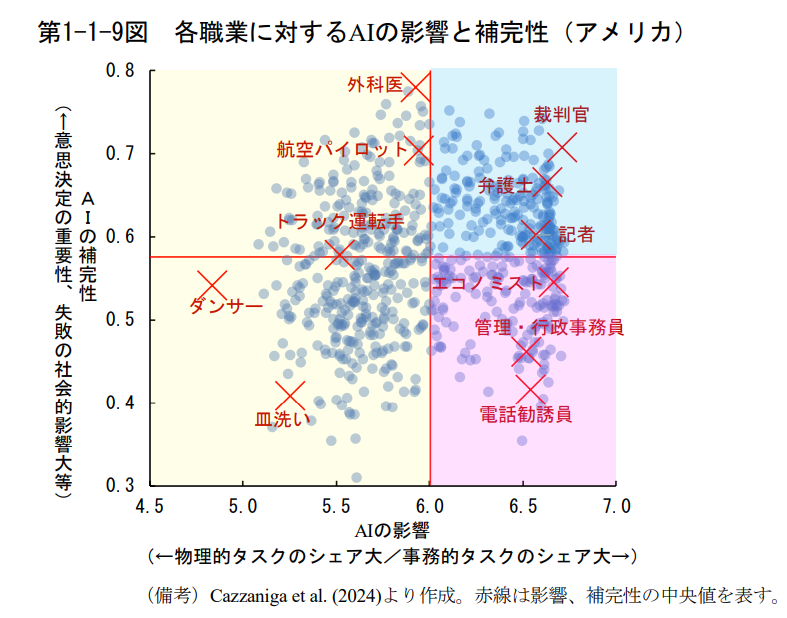
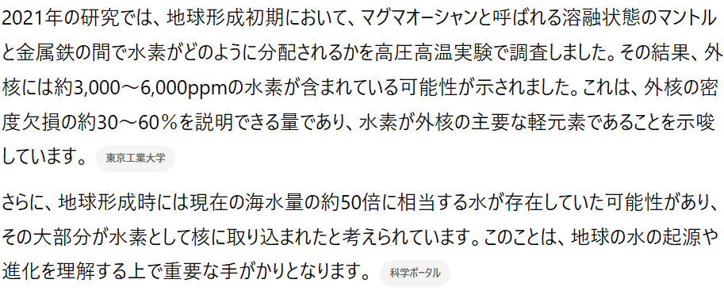
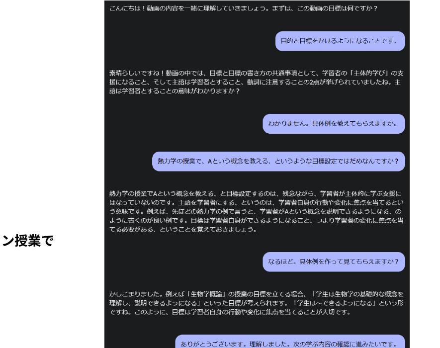
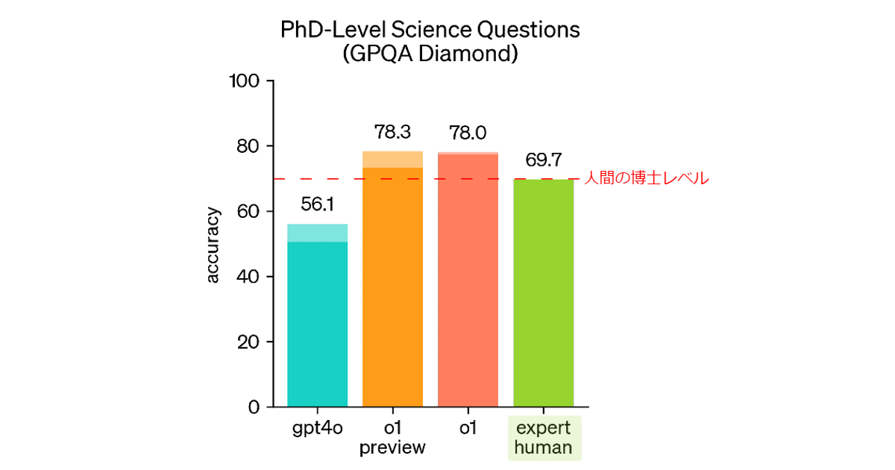
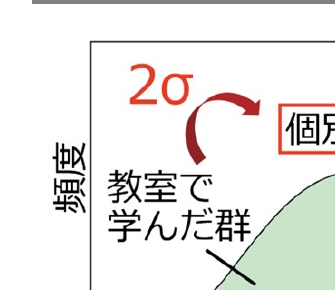
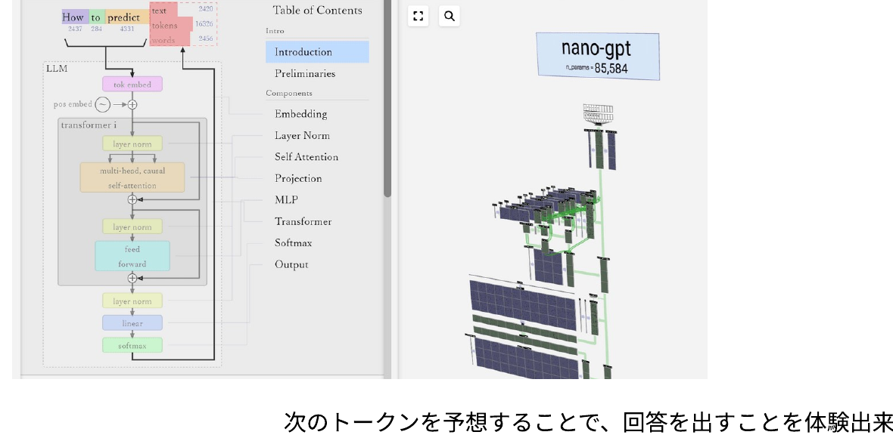
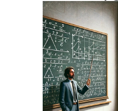
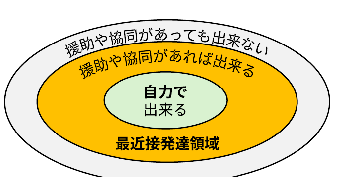
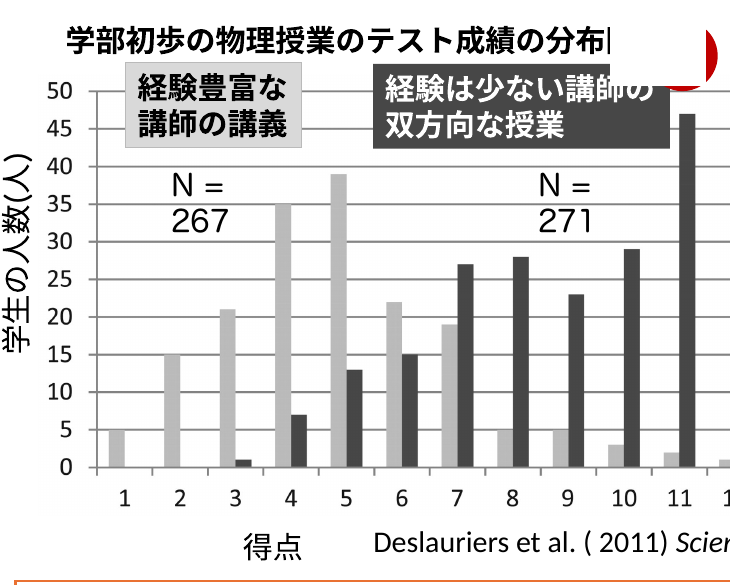
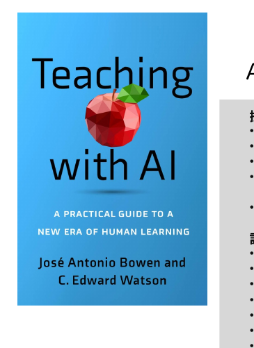

<!-- _class: cover-hero -->

生成AIと理学の学びを考えてみる

非公式 座談会 (ワークショップ)

<b>本日の内容 (この時間の目的)：</b> 
‐&nbsp;&nbsp;AIと自分の学びの関係を考え、自らの意見を見つける。 
‐&nbsp;&nbsp;AIについて、気になった点を聞いてみる。

注意：正解が無い問です

高等教育センター 助教　田川　翔

2024年12月25日

<!--
- AIと自分の学びの関係を考え、自らの意見を見つける。AIについて気になった点を聞いてみる。正解が無い問です。
-->

---

インタラクティブ化ツール

# slido

①反応を送付できます

リアクション、大歓迎です

②アンケートを取らせて頂きます

自動的に画面が変わります

③質問もこちらにご入力下さい

PCまたはスマホで開いて下さい

slido.com

#2311 489

<!--
- でも、アンケートを有効活用しようと思っていただければ嬉しいです。
-->

---

“教育×AI”領域の俯瞰

# 社会の”水準”としてのAI

<b>“自由に検索出来る”知識の水準としてのインターネット</b> 
<b>インターネットが教育に入ってきた黎明期 ▶ 主に知識 (記憶・理解)の次元への影響</b>

▶ 但し、インターネットの知識を自らのものとして使いこなすには、変わらず相当の学びが必要だった 
▶ 一方、課題を解いたり、より上位の学習目標分類に至る上で、検索する手間が大きく省略され、授業設計や課題設定の幅が広がった 
▶ インターネットリテラシやその使用方法は、仕事や課題解決の前提となった

<b>AIが教育に入ってきた黎明期 ▶ 主に思考/推論 (理解・応用・分析)の次元への影響</b> 
思考やアウトプットの水準としてのAI

<b>大切なのは、情報を収集し、自分がどう付き合うか考えること</b> ▶ 知識や思考を自らのものとして使いこなすには、変わらず学びが必要では？

<!--
- ハンプサイクル
-->

---

“教育×AI”領域の俯瞰

# 参考：職業への影響

<b>AIの影響が大きく、代替性が高い職業：</b>事務的タスクのシェアが大きい職業。▶ つまり、AIがとって変わってしまう職業

<b>AIの影響が大きく、補完性が高い職業：</b>事務的タスクのシェアが大きいものの、意思決定の重要性が高く、AI任せとすることが社会的に望ましくない職業。▶ AIを使いこなす必要のある職業

<b>AIの影響の小さい職業：</b>物理的タスクのシェアが大きい職業。

※ 教員・研究者(自然科学系)は、青の領域

内閣府 (2024) <i>世界経済の潮流</i> &gt; 第1章 &gt; p.13

<!--
- ハンプサイクル
-->

---

AIの現状

# ChatGPT(無料版)の現状

SimpleQA：回答の事実的正確性のベンチマーク Wei et al. (2024) <i>Arxiv</i>

例) Q. Who received the IEEE Frank Rosenblatt Award in 2010? 
&nbsp;&nbsp;&nbsp;&nbsp;A. Michio Sugeno

知識のエッジ(=学習回数小)にある内容も含めてある

問題を解かせたり、論文を探させた場合等、無料版である<b>4o mini</b>は、「分からない」ということもなく、ハルシネーションする可能性が高い

但し、本流の知識を求めた場合については、 
&nbsp;- 正しく説明したり、 
&nbsp;- 答えを与えた状態でその理由を説明させると正しい 
可能性が高い。

<!--
-->

---

AIの現状

# ChatGPT(有料版)の現状

1. インタラクティブに数値実験する

(なんか、Box関数が違いますが…)

2. 質問を自動生成する→ 精緻化（elaboration）

「なぜそうなっているのか（Why）？」 
「どのようにそうなっているのか（How）？」 
「具体例は何なのか（What）？」

3. o1を使って、問題の詳細な解説を得る

自分は、この問題について、〇〇と思った。 
解答は、△だった。なぜ？

4. Webで検索する

地球の核に水素が存在する可能性は？

地球の核に水素が入っている可能性があるか、地球核のニュートリノ観測でわかるかどうか、英語の論文を引用しながら教えて。出典を明記して。

5. 出典を明示する

6. コーディングする

フーリエ関数で、xが1つ増えるごとに1と-1を行き来するbox関数を、だんだん近似してみせて。

<!--
- 学校で学びそうなことを質問すると、自動生成されます。
-->

---

AIの現状

# チュータリングを行う

<b>1.</b> Google AI studioに、授業動画を与え、チューターとして振る舞わせた場合

※同様の機能は、Coursera等の大規模オンライン授業で既に実装済み。

<!--
-->

---

AIの現状

# デモ：理解を支援する、課題での情報の分析を行う、問題を作成する

NotebookLM by Google (5分)

① Notebook LMにアクセスしてみて下さい 
&nbsp;&nbsp;&nbsp;&nbsp;https://notebooklm.google.com/ 
② 新規作成をクリックし、論文等のPDFや興味ある学習YouTubeなどを読み込ませて下さい 
③ 分析後、質問を書いたり、選んだり、英語による要約を確認してみて下さい 
④ 学生がよく持ちがちな誤概念について、間違っている理由を説明させて下さい

逆に言えば、学生スライドや配布資料をもとに、レポートを書くことや検索することが可能です 
<b>&nbsp;&nbsp;&nbsp;→ ある程度重たい課題でも学生は実施出来ます / 逆に、簡単な課題はAIが答えてしまいます</b> 
※情報の変換・統合的なタスクであり比較的安心ですが、ハルシネーションはまだ発生します。

▶生物×物理とか、分野横断/学際的な学習も支援や実装出来る？

授業動画ファイルも、Gemini Pro (有料版)に読み込ませて、要約などが可能です。 
(支援が必要な学生向けに有効かも… / でも、授業を聞かなくてもよい、とはならないはずです)

▶先生方の感想や気付きを、コメントスクリーンでご共有頂けませんか

<!--
- 研修後、Gemini / NotebookLMのデモ動画を共有
-->

---

AIの現状

# 参考：理解を支援するための他のGoogleツール

LearnLM by Google Jurenka et al. (2024) on <i>Arxiv</i>

① Google AI Studioにログインしてみて下さい 
&nbsp;&nbsp;https://aistudio.google.com/prompts/new_chat?hl=ja 
② 新規作成/Create New Promptをクリックし、LearnLMを選択後、先生の分野における法則や概念、事実とされている内容を質問してみて下さい 
③ その内容について、問題を作成したり、先生の興味から解説するよう聞いて下さい

LearnLM の取り組みについて 
「Google の使命は、世界中の情報を整理し、世界中の人がアクセスできて使えるようにすること」 
 
Google labs の中に、幾つかの開発中の製品があり、教育への影響もありそうです → https://labs.google/ 
例：Illuminate (何でもソクラテス化：説明文や論文を対話的な解説に変えてしまうAI)

<!--
- 研修後、LearnLMのデモ動画を共有
-->

---

AIの現状

# 動画を解釈する / 個別の生成AIツールを作成する

Google AI studio

<b>自分の講義動画から授業の要約や問題作成をする例 (たたき台作成向け)</b>

https://geophysica.notion.site/Google-AI-studio-145d8c8bc5ab80a29a94dd3acf009c54?pvs=4

Claude 有料版 プロジェクト機能

<b>PDFをアップロードするだけで、フィードバックシートを作成する例</b>

https://geophysica.notion.site/Claude-project-145d8c8bc5ab8037a41ad7fb7b3cf2d4?pvs=4

※昨今、これらのツールが大きく進展し、LangChainを使わずとも、Google / AWS / OpenAI等の公式ツールや、Dify等のサードパーティツールで、目的特化型の生成AI chatbotを設計出来るようになっています。

<!--
-->

---

AIの現状

# 要注意パターン：AIが、レポートを解いてしまわないか

簡単な問題や単答式の問題では、生成AIが直接回答を当てる場合がありえます 
特に、昨今のOpenAI o1は推論性能の向上により、相当強力です

GPQA＝Graduate-level Physical and Quantitative Assessmentで人間の回答精度を上回る Rein et al. (2023) <i>arXiv</i> ／ https://openai.com/index/learning-to-reason-with-llms/

<b>化学（一般）</b> 
炭素と水素原子で構成される液体有機化合物の反応が、80度、20気圧で24時間行われたとする。プロントの核磁気共鳴スペクトルにおいて、反応物の最も高い化学シフトのシグナルが、生成物のシグナルに置き換わり、それは約3〜4 unit ほど低磁場側で観測される。対応する工業的大規模プロセスでも使用される、周期表のどの位置にある元素の化合物が、最も可能性の高い初期添加物（少量）として使用されたと考えられるか？ 
第5周期の金属化合物／第5周期の金属化合物と第3周期の非金属化合物／第4周期の金属化合物／第4周期の金属化合物と第2周期の非金属化合物

<b>天文</b> 
天文学者たちは、有効温度(Teff)が約6000 Kの星を研究している。彼らは2つの化学元素El1とEl2の分光線(等価幅 EW &lt; 100 mÅ)を使用して、分光学的に星の表面重力を決定することに関心がある。この星の大気温度では、El1は主に中性状態にあり、El2は主にイオン化する。天文学者が考慮すべき表面重力に最も敏感な分光線はどれか？ 
A) El2 I (中性) B) El1 II (一重イオン化) C) El2 II (一重イオン化) D) El1 I (中性)

※課金した学生が成績がよい、という不公平な状況が発生しないよう、留意下さい

<!--
-->

---

AIの現状

# 参考：AIを活用する上で、私が気をつけていること

<b>① ループする/人力を入れる：</b> 
&nbsp;1回で正しい/求める答えは出ない 
&nbsp;設計、PoCの双方で、AIと何度もやり取りしながら、求める形の結果になるまで整える。 
&nbsp;雛形が一回出来上がると、コンスタント化。

設計

⇄

PoC

→

運用

→

確認

<b>② 十分なコンテキストを与える：</b> 
&nbsp;特に有料版の生成AIは、背景となる資料を与えた上でコンテキストを規定することで、的を射た形になる。

<b>③ 生成AIの答えを直接信用しない：</b> 
&nbsp;出てきた解答を検証する。あるいは、選択する。例えば、1つの例を作るより、10個の例をAIが作って、正しいものを選ぶほうが早いし、きれい。

<!--
-->

---

“教育×AI”領域の俯瞰

# Benjamin Bloom の２つの仕事 - その1　2シグマ問題

<b>Bloom (1984)</b> <i>Educational Researcher</i> <a href="https://web.mit.edu/5.95/readings/bloom-two-sigma.pdf">https://web.mit.edu/5.95/readings/bloom-two-sigma.pdf</a>

個別指導は、通常の教室での指導と比べ 学習効果が<b>2標準偏差</b>高い。

“コスト上実現しえない個別指導”と同等の学びを<b style="color:var(--accent-dark)">全員に常時提供する方法</b>はあるか？

<b>生成AIで個別最適な学び</b>が支援出来る？

<b>学修支援向け生成AIの実用化</b>（<b>MOOC提供者</b> / Khan, 2024）

<b>学びの個別最適化ツール・伴走者として利用する</b> 例：興味や既習知識を例とした説明の生成、チュータリング、学習歴の情報統合、評価 例：英語、プログラミング等のスキル学習

<!--
- ブルームの2シグマ問題。個別指導は教室一斉指導より2標準偏差ぶん効果が高い。でもコスト的に全員に個別指導はできない。それを生成AIで代替できないか、という問いです。
-->

---

“教育×AI”領域の俯瞰

# Benjamin Bloom の２つの仕事 – その2　学習目標分類

<table style="width:100%; border-collapse:collapse; font-size:19px;">
<tr style="background:var(--accent); color:#fff;">
<th style="padding:5px 8px; border:1px solid #fff; width:3.4em;"></th>
<th style="padding:5px 8px; border:1px solid #fff;">認知的領域 (知識や思考)</th>
<th style="padding:5px 8px; border:1px solid #fff;">学びへの生成AIの影響</th>
</tr>
<tr style="background:var(--accent-soft);">
<td style="padding:5px 8px; border:1px solid #ddd; text-align:center; font-weight:800;">高次</td>
<td style="padding:5px 8px; border:1px solid #ddd;"><b>創造</b> (学習を応用し、新しい価値を作れる)</td>
<td style="padding:5px 8px; border:1px solid #ddd;">人の創造性こそが大切</td>
</tr>
<tr>
<td style="padding:5px 8px; border:1px solid #ddd;"></td>
<td style="padding:5px 8px; border:1px solid #ddd;"><b>評価</b> (事物・判断等を比較し評価出来る)</td>
<td style="padding:5px 8px; border:1px solid #ddd;">評価軸/価値/判断は人が設定する</td>
</tr>
<tr style="background:#fafafa;">
<td style="padding:5px 8px; border:1px solid #ddd;"></td>
<td style="padding:5px 8px; border:1px solid #ddd;"><b>分析</b> (要素に分け、関係性を指摘できる)</td>
<td style="padding:5px 8px; border:1px solid #ddd;">解答/過程の支援可(例：要約・構造化・コーディング)</td>
</tr>
<tr>
<td style="padding:5px 8px; border:1px solid #ddd;"></td>
<td style="padding:5px 8px; border:1px solid #ddd;"><b>応用</b> (他の場面や状況に使用できる)</td>
<td style="padding:5px 8px; border:1px solid #ddd;">単なる問題では、 AIが解いてしまう…</td>
</tr>
<tr style="background:#fafafa;">
<td style="padding:5px 8px; border:1px solid #ddd;"></td>
<td style="padding:5px 8px; border:1px solid #ddd;"><b>理解</b> (学習内容を説明出来る)</td>
<td style="padding:5px 8px; border:1px solid #ddd;">説明/例示で支援可能 だが学修者の理解必須</td>
</tr>
<tr style="background:var(--accent-soft);">
<td style="padding:5px 8px; border:1px solid #ddd; text-align:center; font-weight:800;">低次</td>
<td style="padding:5px 8px; border:1px solid #ddd;"><b>記憶</b> (事実や概念を暗記している)</td>
<td style="padding:5px 8px; border:1px solid #ddd;">支援可能だが、 学修者の記憶必須</td>
</tr>
</table>

左は栗田&amp;中村 (2023)を元に作成 / 原著 Bloom (1956/1964)、改訂版(2001)を記載

学修の目標を構造化し、学びの設計を支援

※近年では、下から個別・段階的に行うのではなく、複数の次元の要素を組み合わせる必要性が叫ばれている。 ※近年では、学び方の学びや、人間性の涵養などを含む、学習目標分類も作成されている (e.g. Finkの学習目標分類) ※但し、低次(特に記憶・理解・応用の段階)を蔑ろにして、高次の学修目標の達成は難しいと想定される。

授業におけるAI利用の指針となり得る

授業の課題やワークの一部として、AIを学びの設計に取り入れる/対策する/教員支援を行う

<!--
- ブルームの2つ目の仕事が学習目標分類。記憶・理解・応用・分析・評価・創造の6段階。生成AIが効くのは低次〜中次の支援で、高次の創造や評価軸の設定は人がやる、という整理です。
- 学習目標分類についての解説動画(9分) https://www.notion.so/geophysica/Bloom-145d8c8bc5ab80deb9dfc15b89d91875?pvs=4
-->

---

学生が授業で活用する上で

# 制限/活用する上での「原則」 (Bowen &amp; Watson, AAC&amp;U 2024)

① <b>課題をAIに入れてみて、試す</b>

② <b>ポリシーを決める</b>

▶大学全体、授業全体、個別の課題での生成AI利用を定める ※ 使用の可否、使用内容/使用バージョンの記載等 ▶授業の目的・目標を鑑みて、AIの使用可否を説明する。

③ <b>不正行為のAI検出は不完全である</b>

▶採点対象の成果は、生成AIで直接出力不可のものにするか、生成AIの使用過程を含め、課題をデザインする ※記述式のテストは、測れる能力が限定される点に留意

④ <b>生成AI利用にあたるリテラシを共有する</b>

<!--
- 学生が授業でAIを使う上での原則4つ。①まず課題をAIに入れて試す、②ポリシーを決める、③AI検出は不完全だと知った上で課題をデザインする、④リテラシを共有する。
-->

---

学生が授業で活用する上で

# 課題における利用ポリシーを使う (Bowen &amp; Watson, AAC&amp;U 2024)

課題における自分のコントリビューションを説明する

- 私は友人、ツール、テクノロジー、AI の助けを一切借りずに、この作業を完全に自力で行った。
- 最初のドラフトは自分で書いたが、その後、友人/ 家族/AI/ パラフレーズ/文法/剽窃ソフトウェアに読んでもらい、提案をもらった。この助けを受けた後、以下の変更を行った：
  - スペルと文法の修正
  - 構成や順序の変更
- 自分で作成した後、テクノロジーを使用して文全体や段落全体を書き直した。
- 元となるアイデアを生成するためにAI/友人/チューターを使用した。
- アウトライン/最初のドラフトを作成するためにAIを使用し、その後編集した。

<!--
- メタな点：①ルーブリックでの採点やフィードバック支援はAIが可能になった
- 学生に「自分が課題にどう貢献したか」を申告させるチェックリスト。AIを一切使っていない〜アイデア生成やドラフトにAIを使った、までを段階的に選ばせる。
-->

---

学生が授業で活用する上で

# 課題における利用ポリシーを使う (Bowen &amp; Watson, AAC&amp;U 2024)

事前に授業における生成AI利用のポリシーを共有する

- AI の使用が許可または禁止されるのはいつか？なぜか？
- AI とのブレイ ンストーミングはカンニングにあたるのか？
- AI がこのクラスで学習をど のように強化または妨げる可能性があるのか？
- AI が許可されている場合、 学生は課題提出の一環として AI プロンプ トを共有する必要があるのか？
- AI の使用はどのようにクレジットされるべきか？
- AI の限界に関する警告
- AI 検出ツールの使用計画とその情報の使用方法に関する説明

<!--
- メタな点：①ルーブリックでの採点やフィードバック支援はAIが可能になった
- 授業の最初に、生成AIをいつ使ってよいか・引用はどうするか・限界の警告などを学生と共有しておく、という観点リスト。
-->

---

学生が授業で活用する上で

# (補足) 評価に関わる対策集 / 阪大FD (2024)

浦田・長岡・村上 (2024) <i>情報処理</i>

<b style="color:#C0182B;">問題作成と試験の形式：</b> 
<b>最新の出来事</b>や資料を扱うテーマを設定する／事前に生成AIで試験問題を解いてみて、解けた場合は別の問題を検討する／<b>授業内で</b>ディスカッションした内容を書かせる／短いライティング課題を頻繁に課す／口頭試験にする／長い文章を要約させる／インタビュー、コンセプトマップ、動画、ディベートなど、レポート形式以外の課題にする／オンライン試験では、問題文は（コピペしにくいように）画像にする／音声と映像を組み合わせた動画で出題する／モラルに反する質問やプログラミングに反する質問への回答を求める

<b>評価とフィードバック：</b> 
ピアや教員との対面ミーティングを組み合わせて段階的に評価する／生成AIで作成した成果物ではないという内容に署名させる／生成AIを利用していない時に学生が書いた文章と提出されたものを比較する／引用を多用する課題を課す／学生が引用した文献を抜き打ちで実在するかチェックする（ことを伝える）／対面または同期型で指導する成果についてのプレゼン課題でQ&amp;Aも行う／手書きか口頭で、学んだことのリフレクションを提出させる／ピア評価を取り入れて建設的なフィードバックができる能力を評価する／生成AIに書かせた文章を批評させる引用文献には文献データベースへのリンクを付けさせる

<b>課題の提出：</b> 
注釈を付けることを課す／課題を作成する過程についての考察を課す／手書きのレポート課題にする／レポートのテーマと自分の個人的な経験を統合する課題にする／レポートの執筆プロセス（下書きや参考文献、編集履歴等）も提出させて評価対象にする／引用文献のスクリーンショットの提出を課す

<b>方針の明示と周知：</b> 
試験で使用を許可する・許可しないツールを明記する／出力の不正確さ、偏り、論理や文体の問題の例を学生に示して注意を促す／剽窃チェックツールが存在し、進化していることを学生に伝える／AIの利用に関する方針をシラバスに明記する／学問的誠実性を強調し、不正行為の結果を理解させる／書くプロセスが学びになぜ大切かを伝える／内発的動機づけを促す 
(科目によっては、あまり意味がない場合があると考えられる点)

<!--
- 阪大FDの対策集を4カテゴリで紹介。問題作成と試験の形式／評価とフィードバック／課題の提出／方針の明示と周知。千葉大の指針と重複する点も多く、すでに有料版AIで答えられてしまう点もある。
-->

---

学生が授業で活用する上で

# 参考：AIリテラシ　OECD (2023)

AIの技術面を批判的に評価し、AIを効果的に活用できる能力 (communicate and collaborate)

第１：AIの基本的な機能と日常生活におけるAIの使用方法に関する知識 
第２：様々な場面に応用することのできる能力 
第３：AIを実装し、評価することができる能力 
第４：アルゴリズムの開発に必要なデータを管理する能力とAIの出力結果を批判的に考察する能力

AIを理解し、活用し、監視し、批判的に考察できるスキル

<b>内閣府(2024) 世界経済の潮流</b>&gt;第1章&gt;p.32

各国でリスキリング/学校教育への取り込みが行われている

<!--
- ハンプサイクル
- OECDのAIリテラシ定義。AIを理解し・活用し・監視し・批判的に考察できるスキル。第1〜第4の段階で、各国でリスキリングや学校教育への取り込みが進んでいます。
-->

---

学生が授業で活用する上で

# 参考：LLMを視覚的に体験し、リテラシを向上させる

LLM Visualization by Brendan Bycroft

次のトークンを予想することで、回答を出すことを体験出来る

<!--
- Brendan Bycroft の LLM Visualization。トランスフォーマーの中身を3Dで可視化したサイトで、「次のトークンを予想する」仕組みを体験的に理解できます。
-->

---

未来の大学の授業

# 参考：課題中心型の授業設計を行う背景にある問題意識

14世紀 @ ドイツ

Laurentius de Voltolina

現在？

Generated by DALL-E

<b>社会</b>も、<b>科学技術</b>も、<b>教育理論</b>も進歩 でも、<b>授業は同じまま</b>？

<table style="border-collapse:collapse; font-size:21px; margin:0 0 10px;">
<tr style="background:var(--accent); color:#fff;"><th style="padding:4px 10px; border:1px solid #fff;"></th><th style="padding:4px 10px; border:1px solid #fff;">認知的領域</th></tr>
<tr style="background:var(--accent-soft);"><td style="padding:3px 10px; border:1px solid #ddd; font-weight:800; text-align:center;">高</td><td style="padding:3px 14px; border:1px solid #ddd;">創造</td></tr>
<tr><td style="padding:3px 10px; border:1px solid #ddd;"></td><td style="padding:3px 14px; border:1px solid #ddd;">評価</td></tr>
<tr style="background:#fafafa;"><td style="padding:3px 10px; border:1px solid #ddd;"></td><td style="padding:3px 14px; border:1px solid #ddd;">分析</td></tr>
<tr><td style="padding:3px 10px; border:1px solid #ddd;"></td><td style="padding:3px 14px; border:1px solid #ddd;">応用</td></tr>
<tr style="background:#fafafa;"><td style="padding:3px 10px; border:1px solid #ddd;"></td><td style="padding:3px 14px; border:1px solid #ddd;">理解</td></tr>
<tr style="background:var(--accent-soft);"><td style="padding:3px 10px; border:1px solid #ddd; font-weight:800; text-align:center;">低</td><td style="padding:3px 14px; border:1px solid #ddd;">記憶</td></tr>
</table>

<b>座学の講義で理解を促すだけ</b>では、到達出来たり、授業中に試せたりする<b>目標の範囲が狭くなりがち</b>。そこで、<b>課題中心や実験中心など、「起こりそうな問題」や「実験」を設計の軸にする</b>ことで、より深く学べるようになるのでは？

<!--
- 14世紀ドイツの講義の絵と、現代の黒板講義の絵を並べて「授業は同じまま？」と問いかける。社会も科学技術も教育理論も進歩したのに、座学で理解を促すだけだと到達できる目標の範囲が狭い。課題中心・実験中心に軸を移そう、という問題意識です。
-->

---

未来の大学の授業

# 参考：課題中心型の授業設計

<b style="color:#C0182B;">✗問題解決型</b>：現実の解決する形で設定するが、どのような学びや学問を使用するかは、明確にデザインされていない (スキル獲得を目指すもの)。

<b>◯課題中心型</b>：現実に起きそうな問題を、教員が小問 (道しるべ) や試行錯誤、ワークなど、使用する概念や獲得される学びを把握して、学習課程を設計する。

方法

①新しい全体的なタスクを見せる 
②タスクに必要な構成要素を提示する 
③タスクに関する構成要素を演示する 
④もう一つ新しい全体タスクを見せる 
⑤学修者に、既習の構成要素を新タスクに応用させる 
⑥この新タスクに必要となる追加的な構成要素を提示する　補足：追加部分は、AIに支援させるなども可能 
⑦これらの追加的な構成要素を演示する 
⑧ステップ4~7を続くステップにも繰り返す

ブランチ・メリル (2013)

<!--
- 問題解決型と課題中心型の違い。課題中心型は、現実に起きそうな問題に対して教員が小問やワークを使って学習過程を設計する。8ステップの方法で、全体タスクを見せ、構成要素を提示・演示しながら新タスクに応用させていきます。追加部分はAIに支援させることも可能。
-->

---

未来の大学の授業

# 参考：反転授業

基礎知識に関する(メディア)学習を<b>事前に行い、その後の授業では議論・演習などを行うブレンド型の設計</b>

▶Stanfordの取組が有名 /千葉大内でも医学部等でも<b style="color:var(--accent-dark)">実践論文</b>あり

高度化型

- <b>高次目標</b>を演習や実験で

完全習得型

- <b>理解の確認や質問</b>を教室で

✔<b>アクティブラーニング</b>を取り入れ教育効果を高めやすい 
✔教員は多様な学生に対応しやすく、<b>効率化もしやすい</b> 
✔学生は疑問点や関心を持ち、<b>自己に最適な授業に臨める</b> 
✔授業時間の課題で評価するので、AIの影響を受けにくい/設計に取り入れやすい

<!--
- 反転授業。基礎知識のインプットを事前にメディアで行い、教室では議論や演習をやるブレンド型。Stanfordの取組が有名で、千葉大の医学部でも実践論文があります。高度化型と完全習得型があり、AIの影響を受けにくい設計に取り入れやすい。
-->

---

未来の大学の授業

# 参考：最近接発達領域

<b>受講前は自力でできないが、課題を解いたら自力で出来るようになる</b>

Vygotsky (1978)

<svg viewBox="0 0 240 270" style="width:100%; max-width:240px;" xmlns="http://www.w3.org/2000/svg">
<g font-family="sans-serif">
<text x="6" y="52" font-size="18" font-weight="700">AI以</text>
<text x="6" y="74" font-size="18" font-weight="700">前</text>
<ellipse cx="150" cy="62" rx="64" ry="38" fill="#ECECEC" stroke="#222" stroke-width="1.5"/>
<ellipse cx="150" cy="62" rx="42" ry="24" fill="#F5B800" stroke="#222" stroke-width="1.5"/>
<ellipse cx="150" cy="62" rx="20" ry="11" fill="#DCEFD6" stroke="#222" stroke-width="1.2"/>
<text x="6" y="200" font-size="18" font-weight="700">AI以</text>
<text x="6" y="222" font-size="18" font-weight="700">後</text>
<ellipse cx="138" cy="200" rx="88" ry="52" fill="#ECECEC" stroke="#222" stroke-width="1.5"/>
<ellipse cx="138" cy="200" rx="62" ry="36" fill="#F5B800" stroke="#222" stroke-width="1.5"/>
<ellipse cx="138" cy="200" rx="26" ry="14" fill="#DCEFD6" stroke="#222" stroke-width="1.2"/>
<g transform="translate(176,200)">
<path d="M0,-14 L18,-14 L18,-24 L40,0 L18,24 L18,14 L0,14 Z" fill="#F3E1F5" stroke="#9C4DA0" stroke-width="1.5"/>
<text x="20" y="4" font-size="13" font-weight="700" fill="#7A2A80" text-anchor="middle">拡大？</text>
</g>
</g>
</svg>

最近接発達領域を広げたり、身につけたりする内容

<b>足場かけ (Scaffolding)：</b>他者の援助や協同で出来る状態にする

自力出来るようになる内容

<b>足場外し (Fading)：</b>他者の援助や協同を徐々に減らし独り立ち

生成AIの活用を前提とすれば、よい本質的な課題に取り組む設計が出来る？

<!--
- ヴィゴツキーの最近接発達領域。自力で出来る／援助があれば出来る／援助があっても出来ない、の3層。足場かけ(Scaffolding)で援助して出来る状態にし、足場外し(Fading)で徐々に援助を減らして独り立ちさせる。生成AIをこの足場かけに使えば、より本質的な課題に取り組む設計ができるのでは、という問いかけです。
-->

---

未来の大学の授業

# 参考：アクティブラーニングの有効性とAI参照

適切な講習を受け、 双方向性・主体性のある学習を取り入れると、 若い教員も良い授業ができる

<b>→その支援にAIはならないか？</b>

<b>注意：</b>アクティブラーニングすること自体が授業の目的ではない <b>(効果がない事例も多数)</b>

Deslauriers et al. (2011), <i>Science</i>

<!--
- アクティブラーニング自体が目的ではない。経験の浅い講師でも適切な講習＋双方向の授業設計で良い成績分布になる、というDeslauriersらの分布図。
- その「適切な講習・設計」の支援にAIが使えないか、が問い。
-->

---

未来の大学の授業

# ルーブリック参照

✔<b>採点道具の一つで、課題を構成要素に分け、 　要素ごとに評価基準を満たすレベルを説明した表</b> 
✔パフォーマンス課題・レポート・実技等の評価の可視化

「<b>課題内容</b>：6分模擬授業」を評価するためのルーブリック

評価観点

<table style="flex:1; border-collapse:collapse; font-size:19px;">
<thead>
<tr style="background:var(--accent); color:#fff;">
<th style="border:1px solid #c9ced6; padding:5px 10px;">評価観点</th>
<th style="border:1px solid #c9ced6; padding:5px 10px;">素晴らしい(2)</th>
<th style="border:1px solid #c9ced6; padding:5px 10px;">合格(1)</th>
<th style="border:1px solid #c9ced6; padding:5px 10px;">不十分(0)</th>
</tr>
</thead>
<tbody>
<tr>
<td style="border:1px solid #c9ced6; padding:5px 10px; background:var(--section-bg); font-weight:700;">分量</td>
<td style="border:1px solid #c9ced6; padding:5px 10px;"></td>
<td style="border:1px solid #c9ced6; padding:5px 10px;">6分間で丁度</td>
<td style="border:1px solid #c9ced6; padding:5px 10px;">過剰か少ない</td>
</tr>
<tr>
<td style="border:1px solid #c9ced6; padding:5px 10px; background:var(--section-bg); font-weight:700;">目標</td>
<td style="border:1px solid #c9ced6; padding:5px 10px;">明確かつ内容が一致していた</td>
<td style="border:1px solid #c9ced6; padding:5px 10px;">明確さか内容の何れかに改善点</td>
<td style="border:1px solid #c9ced6; padding:5px 10px;">明確さ・内容の何れも不十分</td>
</tr>
<tr>
<td style="border:1px solid #c9ced6; padding:5px 10px; background:var(--section-bg); font-weight:700;">レベル設定</td>
<td style="border:1px solid #c9ced6; padding:5px 10px;">手を伸ばせば届くレベルだった</td>
<td style="border:1px solid #c9ced6; padding:5px 10px;">一部高度・容易な箇所があった</td>
<td style="border:1px solid #c9ced6; padding:5px 10px;">極端に高度・容易であった</td>
</tr>
</tbody>
</table>

評価尺度

<b>AIは、ルーブリック評価が上手い (ようだ)</b>

栗田 &amp; 中村（2024）「インタラクティブ・ティーチング 実践編３」；スティーブンス＆レビ (2014)

<!--
- ルーブリックは採点道具の一つ。課題を構成要素（評価観点）に分け、各要素の評価基準（尺度）をレベル別に言葉で説明した表。
- 例は「6分模擬授業」を分量・目標・レベル設定の3観点で採点。AIはこのルーブリック評価がどうやら上手い。
-->

---

未来の大学の授業

# 参考：ID(インストラクショナル・デザイン)の第一原理

<b>インストラクション</b>：学習を促進させるために行うことすべて

IDの第一原理

<table style="width:calc(100% - var(--pip-w) - 8px); border-collapse:collapse; font-size:24px; margin-top:4px;">
<thead>
<tr style="background:var(--accent); color:#fff;">
<th style="border:1px solid #c9ced6; padding:7px 14px; width:40%;">5つの要件</th>
<th style="border:1px solid #c9ced6; padding:7px 14px;">説明</th>
</tr>
</thead>
<tbody>
<tr>
<td style="border:1px solid #c9ced6; padding:7px 14px; font-weight:700;">➀問題(Problem)</td>
<td style="border:1px solid #c9ced6; padding:7px 14px;">現実に起こりそうな問題に挑戦する</td>
</tr>
<tr>
<td style="border:1px solid #c9ced6; padding:7px 14px; background:var(--section-bg); font-weight:700;">②活性化(Activation)</td>
<td style="border:1px solid #c9ced6; padding:7px 14px; background:var(--section-bg);">すでに知っている知識を動員する</td>
</tr>
<tr>
<td style="border:1px solid #c9ced6; padding:7px 14px; font-weight:700;">③例示(Demonstration)</td>
<td style="border:1px solid #c9ced6; padding:7px 14px;">例示がある(Tell me でなく Show me)</td>
</tr>
<tr>
<td style="border:1px solid #c9ced6; padding:7px 14px; background:var(--section-bg); font-weight:700;">④応用(Application)</td>
<td style="border:1px solid #c9ced6; padding:7px 14px; background:var(--section-bg);">応用するチャンスがある(Let me)</td>
</tr>
<tr>
<td style="border:1px solid #c9ced6; padding:7px 14px; font-weight:700;">⑤統合(Integration)</td>
<td style="border:1px solid #c9ced6; padding:7px 14px;">現場で活用し、振り返るチャンスがある</td>
</tr>
</tbody>
</table>

鈴木克明（2015）『研修設計マニュアル』北大路書房

<!--
- IDの第一原理。インストラクション＝学習を促進させるために行うことすべて。
- ①問題→②活性化→③例示→④応用→⑤統合の5要件。Tell me でなく Show me / Let me が鍵。
-->

---

未来の大学の授業

# 参考文献の紹介：Teaching with AI

(Bowen &amp; Watson, AAC&amp;U 2024)　高等教育における、生成AI活用の事例・プロンプト集

授業での活用

<ul style="font-size:18px; line-height:1.35;">
<li>AIをリアルタイムの議論のサポートとして活用</li>
<li>AIを用いた模擬面接や役割演習の実施</li>
<li>AIを使った個別化された学習支援とフィードバック提供</li>
<li>クラスディスカッションでのAIの活用(例:反対意見の提示役として)</li>
<li>授業内での小テストやミニエッセイの実施</li>
</ul>

課題設計

<ul style="font-size:18px; line-height:1.35;">
<li>個人の経験や地域に基づいた課題の作成</li>
<li>プロセスを重視した段階的な課題設計</li>
<li>ピアレビューを組み込んだ課題</li>
<li>リアルタイムの出来事についての分析課題</li>
<li>フィールドワークやインタビューを含む課題</li>
<li>グループワークやコラボレーション課題</li>
<li>アノテーション(注釈付け)を活用した読解課題</li>
<li>マルチメディア(ビデオ、ポッドキャスト)を使用した課題</li>
</ul>

評価方法・課題例

評価方法:

<ul style="font-size:18px; line-height:1.3; margin-bottom:6px;">
<li>ルーブリックを使用した評価</li>
<li>プロセスの評価(draftsの提出など)</li>
<li>AIとの対話記録の提出と評価</li>
<li>個別化された評価基準の設定</li>
<li>即時フィードバックの提供</li>
</ul>

特徴的な課題例:

<ul style="font-size:18px; line-height:1.3;">
<li>AIを使って生成した文章の編集・改善</li>
<li>AIの出力に対する事実確認演習</li>
<li>異なる観客向けの文章作成練習</li>
<li>ケーススタディやテキストアドベンチャーゲームの作成</li>
<li>グラフィックノベルの制作</li>
<li>プレゼンテーションの準備と実施</li>
</ul>

<b>AIを活用しながらも、人間の創造性や批判的思考を重視し、学習効果を高める</b>

本一冊のユースケースについて要約を依頼し出力, 2024.11.21, Claude 3.5 Sonnet

<!--
- 紹介書籍 Teaching with AI (Bowen & Watson, AAC&U 2024)。高等教育での生成AI活用の事例・プロンプト集。
- 授業での活用・課題設計・評価方法を本一冊から要約。AIを使いつつ人間の創造性と批判的思考を重視する姿勢。
-->
