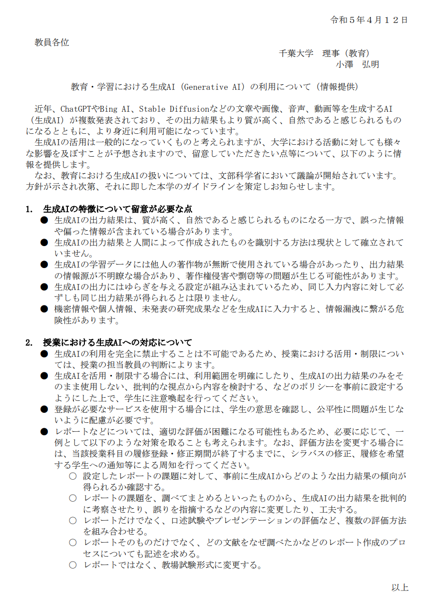
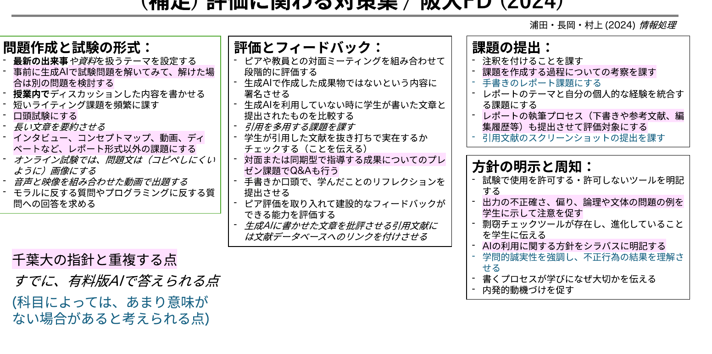
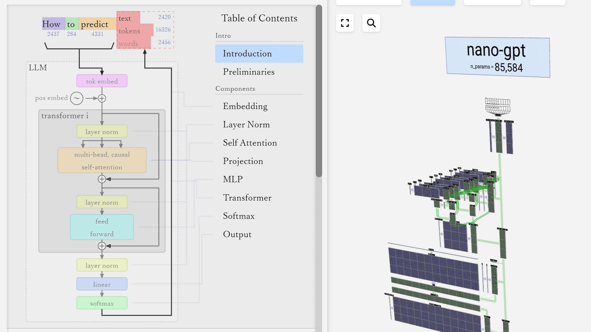

②課題での利用例 ／ その他、利用例

# その他、利用例

<b>①授業内のグループワークの設計</b>

東大・前期教養のアクティブ・ラーニングクラスでの実践例

<a href="https://www.juce.jp/LINK/journal/2501/pdf/02_01.pdf" style="color:var(--tag-blue); font-size:20px;">https://www.juce.jp/LINK/journal/2501/pdf/02_01.pdf</a>

アクティブラーニングの参加者の一人が生成AIになる ※広大などでは、グループワークの情報を統合する利用例がある

<b>② レポート用フィードバック ルーブリックの作成</b>

阪大のプロンプト例

<a href="https://www.tlsc.osaka-u.ac.jp/project/generative_ai/support_al.html#4" style="color:var(--tag-blue); font-size:20px;">https://www.tlsc.osaka-u.ac.jp/project/generative_ai/support_al.html#4</a>

<b>③ 教員利用 / 学生利用の場合のグッドプラクティス例</b>

横国の実施例

<a href="https://www.yec.ynu.ac.jp/news/images/AI_good_practice.pdf" style="color:var(--tag-blue); font-size:20px;">https://www.yec.ynu.ac.jp/news/images/AI_good_practice.pdf</a>

---

②課題での利用例

# ②課題での利用例

目的

現状、どのような利用例/研究例があるのか知り、試せるようになる。

内容

<b>A. 学生が利用する</b>

理解を支援する、課題での情報の分析を行う ツール例：<b>NotebookLM</b>　／　授業のワーク・課題の設計で用いる

<b>B. 教員が利用する</b>

問題を作成する、フィードバックに用いる

---

③先生ご自身が授業で活用/対策される上で

# ③先生ご自身が授業で活用/対策される上で

目的

指針等をもとに、生成AIを制限/活用する上での、「原則」を考える。

内容

<b>A. 利用/対策のポリシー、チェックシート</b>

<b>B. 利用/対策の原則</b>

---

こんなとき、どうされますか？

# こんなとき、どうされますか？

レポートや課題、 生成AIで悪影響 受けないかな…

▶対策は？

学生が理解したり、 演習するのを助ける上で生成AIを 使ってみようかな？

▶活用は？

ここでは、対策と活用の部分についてご説明します

---

千葉大学における生成AIの指針①

# 千葉大学における生成AIの指針① (令和５年４月１２日)

<a href="https://gakunai.jm.chiba-u.jp/gakujutsu/joho/sjoho2023/pdf/20230713ChatGPT.pdf" style="color:var(--tag-blue); font-size:20px;">https://gakunai.jm.chiba-u.jp/gakujutsu/joho/sjoho2023/pdf/20230713ChatGPT.pdf</a>

特に、<b>機密情報や個人情報の入力禁止</b>、生成AIにより出力された情報の著作権 (表現への類似性・依拠性)には留意が必要です。

---

千葉大学における生成AIの指針②

# 千葉大学における生成AIの指針② (令和５年４月１２日)

<a href="https://gakunai.jm.chiba-u.jp/gakujutsu/joho/sjoho2023/pdf/20230713ChatGPT.pdf" style="color:var(--tag-blue); font-size:20px;">https://gakunai.jm.chiba-u.jp/gakujutsu/joho/sjoho2023/pdf/20230713ChatGPT.pdf</a>

---

(補足) 評価に関わる対策集 / 阪大FD (2024)

# (補足) 評価に関わる対策集 / 阪大FD (2024)

浦田・長岡・村上 (2024). <i>情報処理</i>

---

制限/活用する上での「原則」

# 制限/活用する上での「原則」 (Bowen &amp; Watson, AAC&amp;U 2024)

<b>① 課題をAIに入れてみて、試す</b>

<b>② ポリシーを決める</b>

▶大学全体、授業全体、個別の課題での生成AI利用を定める ※ 使用の可否、使用内容/使用バージョンの記載等 ▶授業の目的・目標を鑑みて、AIの使用可否を説明する。

<b>③ 不正行為のAI検出は不完全である</b>

<b>▶</b>採点対象の成果は、生成AIで直接出力不可のものにするか、生成AIの使用過程を含め、課題をデザインする ※記述式のテストは、測れる能力が限定される点に留意

<b>④ 生成AI利用にあたるリテラシを共有する</b>

---

参考：LLMを視覚的に体験する

# 参考：LLMを視覚的に体験し、リテラシを向上させる

LLM Visualization by Brendan Bycroft

次のトークンを予想することで、回答を出すことを体験出来る

---

アンケート3

# アンケート3

先生ご自身は、生成AIの授業利用/制限について、どんな「原則」を大切にされたいと考えますか？ ぜひ、チャットにて共有して下さい。 
※ 触れた内容でも、他でも構いません。

例：

難しい問題はAIが支援を可能にする分、基礎力を徹底して鍛える授業にしたい。 生成AIを使われてしまいかねない課題は、生成AIに試しで入力してみる 課題をデザインする際に、生成AIを使用する部分を中間に設ける

※ 他の先生のコメントへの、返信もぜひ、お願い致します。

---

③先生ご自身が授業で活用/対策される上で

# ③先生ご自身が授業で活用/対策される上で

目的

指針等をもとに、生成AIを制限/活用する上での、「原則」を考える。

<b>A. 利用/対策のポリシー、チェックシート</b>

まずは、<b>千葉大のポリシー</b>をご参照下さい - <b>活用</b>する場合 → <b>他大学のgood practice</b>をご参照いただき、授業のポリシーを設定下さい - <b>対策</b>する場合 → 阪大の評価にかかる対策集や授業ポリシー例をご活用下さい

<b>B. 利用/対策の原則</b>

科目・分野による差が大きく、<b>一律の決定は難しい印象</b>です 一方で、本日お話したように、方針やチェックすべき点は見出されつつあります 本研修をもとに、先生方ご自身が、自らや授業での原則を形作って頂けますと、嬉しいです

---

まとめ

# まとめ

<b>学習効果を損なわず、学修者の自律的な学びを支える</b>ために

Bloomの学修目標分類

<table style="width:100%; border-collapse:collapse; font-size:21px; line-height:1.4; margin-top:2px;">
<tr>
<th style="background:var(--accent); color:#fff; padding:7px 10px; width:30%;">認知的領域 (知識や思考)</th>
<th style="background:var(--accent); color:#fff; padding:7px 10px; width:36%;">学びへの生成AIの影響</th>
<th style="background:var(--accent); color:#fff; padding:7px 10px;">現在の状況</th>
</tr>
<tr>
<td style="border:1px solid #ccc; padding:7px 10px;"><b>分析</b> (要素に分け、関係性を指摘できる)</td>
<td style="border:1px solid #ccc; padding:7px 10px;">解答/過程の支援可(例：要約・構造化・コーディング)</td>
<td style="border:1px solid #ccc; padding:7px 10px;">AIを利用することで、高度な課題が可能に</td>
</tr>
<tr>
<td style="border:1px solid #ccc; padding:7px 10px; background:var(--accent-soft);"><b>応用</b> (他の場面や状況に使用できる)</td>
<td style="border:1px solid #ccc; padding:7px 10px; background:var(--accent-soft); color:var(--accent-dark); font-weight:800;">単なる問題では、 AIが解いてしまう…</td>
<td style="border:1px solid #ccc; padding:7px 10px; background:var(--accent-soft);">アウトプットが直接成績にならないよう注意</td>
</tr>
<tr>
<td style="border:1px solid #ccc; padding:7px 10px;"><b>理解</b> (学習内容を説明出来る)</td>
<td style="border:1px solid #ccc; padding:7px 10px;">説明/例示で支援可能 だが学修者の理解必須</td>
<td style="border:1px solid #ccc; padding:7px 10px;">生成AIが理解をインタラクティブに支援</td>
</tr>
</table>

- 理解の次元は、<b>持ち込みなしペーパーテスト等</b>で確認しやすいです。 
- 分析の次元は、学生のアウトプットが発表やレポート、口頭での試験となりやすく、<b>AIで単純に回答出来なくなります</b>。 
- 応用の次元は、生成AIが直接アウトプットを出さないように気をつけましょう。- <b>高度な次元 (例：創造的なPBL等)の課題</b>を設定するのも手です。

