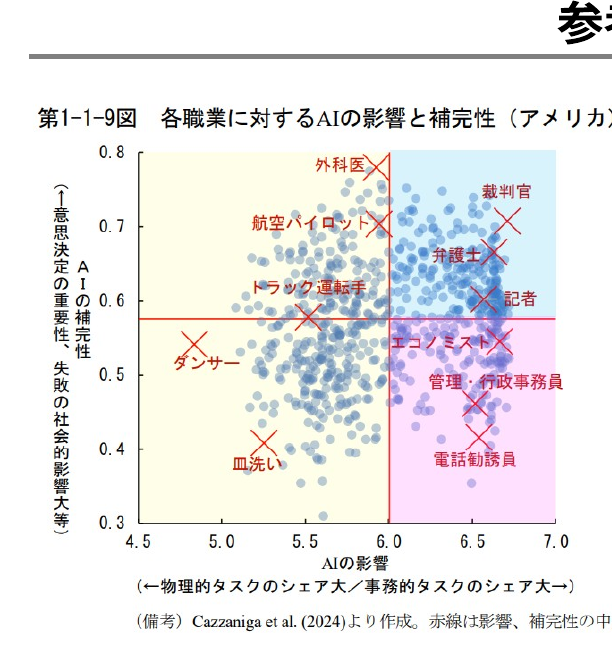
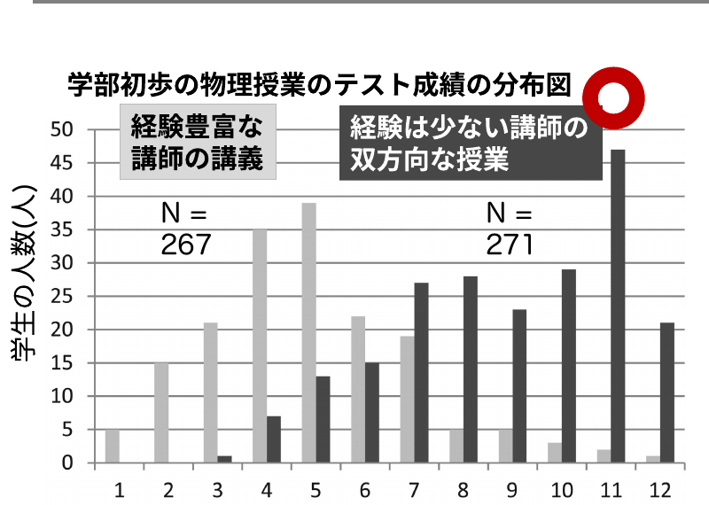

まとめ

# 今日の俯瞰図：AIを学びの設計に入れる / AIを対策する

学生

<table style="width:100%; border-collapse:collapse; font-size:19px; line-height:1.35;">
<tr>
<th style="background:var(--accent); color:#fff; padding:5px 8px; width:14%;">知識や思考</th>
<th style="background:var(--accent); color:#fff; padding:5px 8px;">生成AIの利用</th>
<th style="background:var(--accent); color:#fff; padding:5px 8px; width:24%;">使用可能なツール</th>
</tr>
<tr>
<td style="border:1px solid #ccc; padding:5px 8px;"><b>分析</b></td>
<td style="border:1px solid #ccc; padding:5px 8px;">情報を統合する/要約する/比較する</td>
<td style="border:1px solid #ccc; padding:5px 8px;">NotebookLM</td>
</tr>
<tr>
<td style="border:1px solid #ccc; padding:5px 8px;"><b>応用</b></td>
<td style="border:1px solid #ccc; padding:5px 8px;">- 課題のデザインを考える</td>
<td style="border:1px solid #ccc; padding:5px 8px;"></td>
</tr>
<tr>
<td style="border:1px solid #ccc; padding:5px 8px;"><b>理解</b></td>
<td style="border:1px solid #ccc; padding:5px 8px;">AIを使って様々な角度から説明を受ける／授業に関する質問をAIに聞いてみる／授業の聞き逃しを要約する</td>
<td style="border:1px solid #ccc; padding:5px 8px;">NotebookLM/LearnLM NotebookLM / ChatGPT等 Gemini</td>
</tr>
</table>

教員

<table style="width:100%; border-collapse:collapse; font-size:18px; line-height:1.3;">
<tr>
<th style="background:var(--accent-dark); color:#fff; padding:4px 8px; width:18%;">メタな部分</th>
<th style="background:var(--accent-dark); color:#fff; padding:4px 8px;">生成AIの利用</th>
<th style="background:var(--accent-dark); color:#fff; padding:4px 8px; width:26%;">使用可能なツール例</th>
</tr>
<tr>
<td style="border:1px solid #ccc; padding:4px 8px;">指針 (ガイドライン)</td>
<td style="border:1px solid #ccc; padding:4px 8px;">千葉大の指針／使用までの推奨フローと禁止行為／(参考)文部科学省 初等中等向けガイドライン</td>
<td style="border:1px solid #ccc; padding:4px 8px;"><a href="#" style="color:var(--tag-blue);">リンク</a> (要ログイン)　<a href="#" style="color:var(--tag-blue);">リンク</a></td>
</tr>
<tr>
<td style="border:1px solid #ccc; padding:4px 8px;">授業設計</td>
<td style="border:1px solid #ccc; padding:4px 8px;">タスクベースの教授方略 / 反転授業／PBL/アクティブラーニング</td>
<td style="border:1px solid #ccc; padding:4px 8px;">後ほど動画を公開</td>
</tr>
<tr>
<td style="border:1px solid #ccc; padding:4px 8px;">問題作成</td>
<td style="border:1px solid #ccc; padding:4px 8px;">様々な形式問題を作成する</td>
<td style="border:1px solid #ccc; padding:4px 8px;">NotebookLM / LearnLM</td>
</tr>
<tr>
<td style="border:1px solid #ccc; padding:4px 8px;">採点</td>
<td style="border:1px solid #ccc; padding:4px 8px;">ルーブリックに基づく採点/フィードバック</td>
<td style="border:1px solid #ccc; padding:4px 8px;">NotebookLM / Claude 3.5</td>
</tr>
<tr>
<td style="border:1px solid #ccc; padding:4px 8px;">他大学の例</td>
<td style="border:1px solid #ccc; padding:4px 8px;">グッド・プラクティス集</td>
<td style="border:1px solid #ccc; padding:4px 8px;">Yale / 阪大 / 横国 / 私大情協</td>
</tr>
</table>

<!-- メタな点：①ルーブリックでの採点やフィードバック支援はAIが可能になった -->

---

補足

# SoTL / Good practice収集のお誘い

SoTL = Scholarship of Teaching and Learning (授業実践に係る研究) 例：生成AIを使ったら成果物の質が上がった、学生の点数が上がった/下がった etc…

今後、<b>生成AIの利用における理学</b>と<b>学際分野の学修への影響を調査していきたい</b>と考えています。 
もし、<b>先生の授業で研究/AI関連の支援をさせて頂ける場合</b>には、ぜひお声掛け頂けませんでしょうか。理学の教育活動に、貢献できますと幸いです。

また、授業で生成AIを使用して見た結果など、グッドプラクティスを個人プロジェクトとして収集しています。インタビューや授業見学させて頂ける場合には、ぜひ、お知らせ下さい。

それと、<b>複数の分野の知を使う学び/研究の加速</b>や、<b>大学院の研究支援</b>なども、可能では、、、と

<!-- メタな点：①ルーブリックでの採点やフィードバック支援はAIが可能になった -->

---

補足

# 本研修のアンケートのお願い

本研修の内容について、 主に選択式で、3分程度で終わる、アンケートがございます。

<a href="https://forms.gle/aXK5n2ojYu2SzoQ96" style="color:var(--tag-blue);">https://forms.gle/aXK5n2ojYu2SzoQ96</a>

差し支えなければ、今週中で構いませんので、ご回答頂けますと幸いです。

頂いた質問は、こちらにて解答致します (千葉大学 Google アカウントへのログインが必要です) <a href="https://docs.google.com/document/d/15iYeIOcIvbMgsydTFyBxJnvFKWMAoICJcXbLhNEMVJw/edit?usp=sharing" style="color:var(--tag-blue); font-size:19px;">https://docs.google.com/document/d/15iYeIOcIvbMgsydTFyBxJnvFKWMAoICJcXbLhNEMVJw/edit?usp=sharing</a>

<!-- メタな点：①ルーブリックでの採点やフィードバック支援はAIが可能になった -->

---

③先生ご自身が授業で活用/対策される上で

# 参考：AIリテラシ OECD (2023)

AIの技術面を批判的に評価し、AIを効果的に活用できる能力 (communicate and collaborate)

第１：AIの基本的な機能と日常生活におけるAIの使用方法に関する知識 
第２：様々な場面に応用することのできる能力 
第３：AIを実装し、評価することができる能力 
第４：アルゴリズムの開発に必要なデータを管理する能力とAIの出力結果を批判的に考察する能力

AIを理解し、活用し、監視し、批判的に考察できるスキル

<b>内閣府(2024) 世界経済の潮流</b>＞第1章＞p.32

<b>各国でリスキリング/学校教育への取り込みが行われている</b>

<!-- ハンプサイクル -->

---

① "教育×AI"領域の俯瞰

# 参考：職業への影響

<b>内閣府(2024) 世界経済の潮流</b>＞第1章＞p.13

<b>AIの影響が大きく、代替性が高い職業：</b>事務的タスクのシェアが大きい職業。▶ つまり、AIがとって変わってしまう職業

<b>AIの影響が大きく、補完性が高い職業：</b>事務的タスクのシェアが大きいものの、意思決定の重要性が高く、AI任せとすることが社会的に望ましくない職業。▶ AIを使いこなす必要のある職業

<b>AIの影響の小さい職業：</b>物理的タスクのシェアが大きい職業。

※ 教員・研究者(自然科学系)は、青の領域

<!-- ハンプサイクル -->

---

オンライン授業で出来ること

# 参考：反転授業

基礎知識に関する(メディア)学習を<b>事前に行い、その後の授業では議論・演習などを行うブレンド型の設計</b>

▶Stanfordの取組が有名 / 学内でも医学部等でも<b>実践論文</b>あり

高度化型

- <b>高次目標</b>を演習や実験で

完全習得型

- <b>理解の確認や質問</b>を教室で

✔<b>アクティブラーニング</b>を取り入れ教育効果を高めやすい 
✔教員は多様な学生に対応しやすく、<b>効率化もしやすい</b> 
✔学生は疑問点や関心を持ち、<b>自己に最適な授業に臨める</b> 
✔授業時間の課題で評価するので、AIの影響を受けにくい/設計に取り入れやすい

---

授業構成のtips

# 参考：最近接発達領域

<b>受講前は自力でできないが、課題を解いたら自力で出来るようになる</b>

<svg viewBox="0 0 320 260" xmlns="http://www.w3.org/2000/svg" style="width:100%;">
<circle cx="160" cy="130" r="120" fill="#FCEAEC" stroke="var(--accent)" stroke-width="2.5"/>
<circle cx="160" cy="150" r="78" fill="#F8D7DC" stroke="var(--accent)" stroke-width="2.5"/>
<circle cx="160" cy="178" r="40" fill="#fff" stroke="#888" stroke-width="2.5"/>
<text x="160" y="40" text-anchor="middle" font-size="15" font-weight="800" fill="var(--accent-dark)">援助や協同があっても出来ない</text>
<text x="160" y="112" text-anchor="middle" font-size="15" font-weight="800" fill="var(--accent-dark)">援助や協同があれば出来る</text>
<text x="160" y="183" text-anchor="middle" font-size="15" font-weight="800" fill="#333">自力で出来る</text>
<text x="160" y="246" text-anchor="middle" font-size="14" font-weight="800" fill="var(--accent)">最近接発達領域</text>
</svg>

Vygotsky (1978)

<b>足場かけ (Scaffolding)：</b>他者の援助や協同で出来る状態にする

最近接発達領域を広げたり、身につけたりする内容

<b>足場外し (Fading)：</b>他者の援助や協同を徐々に減らし独り立ち

自力出来るようになる内容

<b>生成AIの活用を前提とすれば、よい本質的な課題に取り組む設計が出来る？</b>

---

学習者主体のクラス設計

# 参考：アクティブラーニングの有効性とAI

Deslauriers et al. (2011). <i>Science</i>

適切な講習を受け、双方向性・主体性のある学習を取り入れると、若い教員も良い授業ができる 　→その支援にAIはならないか？

<b>注意：</b>アクティブラーニングすること自体が授業の目的ではない <b>(効果がない事例も多数)</b>

---

評価と目標の関係

# 評価の種類

田中耕治（2010）「よくわかる教育評価」を改変

組み合わせて測ることも<b>可</b>

<svg viewBox="0 0 1040 430" xmlns="http://www.w3.org/2000/svg" style="width:100%;">
<defs>
<marker id="ar" markerWidth="10" markerHeight="10" refX="6" refY="3" orient="auto"><path d="M0,0 L6,3 L0,6 Z" fill="#888"/></marker>
<linearGradient id="hi" x1="0" y1="1" x2="1" y2="0"><stop offset="0" stop-color="#FCEAEC" stop-opacity="0.2"/><stop offset="1" stop-color="var(--accent)" stop-opacity="0.9"/></linearGradient>
</defs>
<line x1="520" y1="40" x2="520" y2="410" stroke="#888" stroke-width="4" marker-start="url(#ar)" marker-end="url(#ar)"/>
<line x1="120" y1="240" x2="940" y2="240" stroke="#888" stroke-width="4" marker-start="url(#ar)" marker-end="url(#ar)"/>
<line x1="240" y1="370" x2="760" y2="90" stroke="url(#hi)" stroke-width="20" stroke-linecap="round" marker-end="url(#ar)"/>
<text x="520" y="28" text-anchor="middle" font-size="22" font-weight="800">複雑</text>
<text x="520" y="428" text-anchor="middle" font-size="22" font-weight="800">単純</text>
<text x="80" y="280" text-anchor="middle" font-size="22" font-weight="800">筆記</text>
<text x="960" y="280" text-anchor="middle" font-size="22" font-weight="800">実演</text>
<text x="700" y="70" font-size="22" font-weight="800"><tspan fill="var(--accent-dark)">高次</tspan>の目標を測りやすい</text>
<rect x="150" y="130" width="370" height="80" fill="#FCEAEC" stroke="var(--accent)" stroke-width="2.5"/>
<text x="335" y="162" text-anchor="middle" font-size="24" font-weight="800">パフォーマンス課題</text>
<text x="335" y="192" text-anchor="middle" font-size="20">(小論文、作品制作、発表等)</text>
<rect x="150" y="225" width="200" height="78" fill="#fff" stroke="#E08A2B" stroke-width="2.5"/>
<text x="250" y="256" text-anchor="middle" font-size="22" font-weight="700">論述式問題</text>
<text x="250" y="284" text-anchor="middle" font-size="22" font-weight="700">レポート</text>
<rect x="160" y="312" width="180" height="60" fill="#fff" stroke="#E08A2B" stroke-width="2.5"/>
<text x="250" y="349" text-anchor="middle" font-size="22" font-weight="700">記述式問題</text>
<rect x="540" y="225" width="220" height="78" fill="#fff" stroke="#E08A2B" stroke-width="2.5"/>
<text x="650" y="256" text-anchor="middle" font-size="22" font-weight="700">実技テスト</text>
<text x="650" y="284" text-anchor="middle" font-size="22" font-weight="700">面接/口頭試問</text>
<rect x="610" y="312" width="150" height="60" fill="#fff" stroke="#E08A2B" stroke-width="2.5"/>
<text x="685" y="349" text-anchor="middle" font-size="22" font-weight="700">観察試験</text>
<rect x="160" y="382" width="180" height="42" fill="#fff" stroke="#E08A2B" stroke-width="2.5"/>
<text x="250" y="410" text-anchor="middle" font-size="22" font-weight="700">選択式問題</text>
<rect x="540" y="382" width="150" height="42" fill="#fff" stroke="#E08A2B" stroke-width="2.5"/>
<text x="615" y="410" text-anchor="middle" font-size="22" font-weight="700">心理テスト</text>
</svg>

---

ルーブリック

# ルーブリック

✔<b>採点道具の一つで、課題を構成要素に分け、要素ごとに評価基準を満たすレベルを説明した表</b> 
✔パフォーマンス課題・レポート・実技等の評価の可視化

<b>「課題内容：6分模擬授業」</b>を評価するためのルーブリック

<table style="width:100%; border-collapse:collapse; font-size:21px; line-height:1.4;">
<tr>
<th style="background:var(--accent-dark); color:#fff; padding:6px 10px; width:16%;">評価観点</th>
<th style="background:var(--accent); color:#fff; padding:6px 10px;">素晴らしい(2)</th>
<th style="background:var(--accent); color:#fff; padding:6px 10px;">合格(1)</th>
<th style="background:var(--accent); color:#fff; padding:6px 10px;">不十分(0)</th>
</tr>
<tr>
<td style="border:1px solid #ccc; padding:6px 10px; background:var(--accent-soft); font-weight:700;">分量</td>
<td style="border:1px solid #ccc; padding:6px 10px;"></td>
<td style="border:1px solid #ccc; padding:6px 10px;">6分間で丁度</td>
<td style="border:1px solid #ccc; padding:6px 10px;">過剰か少ない</td>
</tr>
<tr>
<td style="border:1px solid #ccc; padding:6px 10px; background:var(--accent-soft); font-weight:700;">目標</td>
<td style="border:1px solid #ccc; padding:6px 10px;">明確かつ内容が一致していた</td>
<td style="border:1px solid #ccc; padding:6px 10px;">明確さか内容の何れかに改善点</td>
<td style="border:1px solid #ccc; padding:6px 10px;">明確さ・内容の何れも不十分</td>
</tr>
<tr>
<td style="border:1px solid #ccc; padding:6px 10px; background:var(--accent-soft); font-weight:700;">レベル設定</td>
<td style="border:1px solid #ccc; padding:6px 10px;">手を伸ばせば届くレベルだった</td>
<td style="border:1px solid #ccc; padding:6px 10px;">一部高度・容易な箇所があった</td>
<td style="border:1px solid #ccc; padding:6px 10px;">極端に高度・容易であった</td>
</tr>
</table>

<b>評価尺度</b>＝横軸（2・1・0）

<b>評価基準</b>＝縦の各観点

ルーブリックを設計し高次目標の課題も扱おう

栗田 &amp; 中村（2024）「インタラクティブ・ティーチング 実践編３」／スティーブンス＆レビ (2014)

---

②課題での利用例

# 参考：AIを活用する上で、私が気をつけていること

設計

⇄

PoC

→

運用

→

確認

<b>① ループする/人力を入れる：</b>

1回で正しい/求める答えは出ない。設計、PoCの双方で、AIと何度もやり取りしながら、求める形の結果になるまで整える。雛形が一回出来上がると、コンスタント化。

<b>② 十分なコンテキストを与える：</b>

特に有料版の生成AIは、背景となる資料を与えた上でコンテキストを規定することで、的を射た形になる。

<b>③ 生成AIの答えを直接信用しない：</b>

出てきた解答を検証する。あるいは、選択する。例えば、1つの例を作るより、10個の例をAIが作って、正しいものを選ぶほうが早いし、きれい。

---

②課題での利用例

# 参考：ID(インストラクショナル・デザイン)の第一原理

<b>インストラクション</b>：学習を促進させるために行うことすべて

IDの第一原理

<table style="width:100%; border-collapse:collapse; font-size:23px; line-height:1.45;">
<tr>
<th style="background:var(--accent); color:#fff; padding:8px 12px; width:34%;">5つの要件</th>
<th style="background:var(--accent); color:#fff; padding:8px 12px;">説明</th>
</tr>
<tr>
<td style="border:1px solid #ccc; padding:7px 12px;">①問題(Problem)</td>
<td style="border:1px solid #ccc; padding:7px 12px;">現実に起こりそうな問題に挑戦する</td>
</tr>
<tr>
<td style="border:1px solid #ccc; padding:7px 12px;">②活性化(Activation)</td>
<td style="border:1px solid #ccc; padding:7px 12px;">すでに知っている知識を動員する</td>
</tr>
<tr>
<td style="border:1px solid #ccc; padding:7px 12px;">③例示(Demonstration)</td>
<td style="border:1px solid #ccc; padding:7px 12px;">例示がある(Tell me でなく Show me)</td>
</tr>
<tr>
<td style="border:1px solid #ccc; padding:7px 12px;">④応用(Application)</td>
<td style="border:1px solid #ccc; padding:7px 12px;">応用するチャンスがある(Let me)</td>
</tr>
<tr>
<td style="border:1px solid #ccc; padding:7px 12px;">⑤統合(Integration)</td>
<td style="border:1px solid #ccc; padding:7px 12px;">現場で活用し、振り返るチャンスがある</td>
</tr>
</table>

鈴木克明（2015）『研修設計マニュアル』北大路書房

