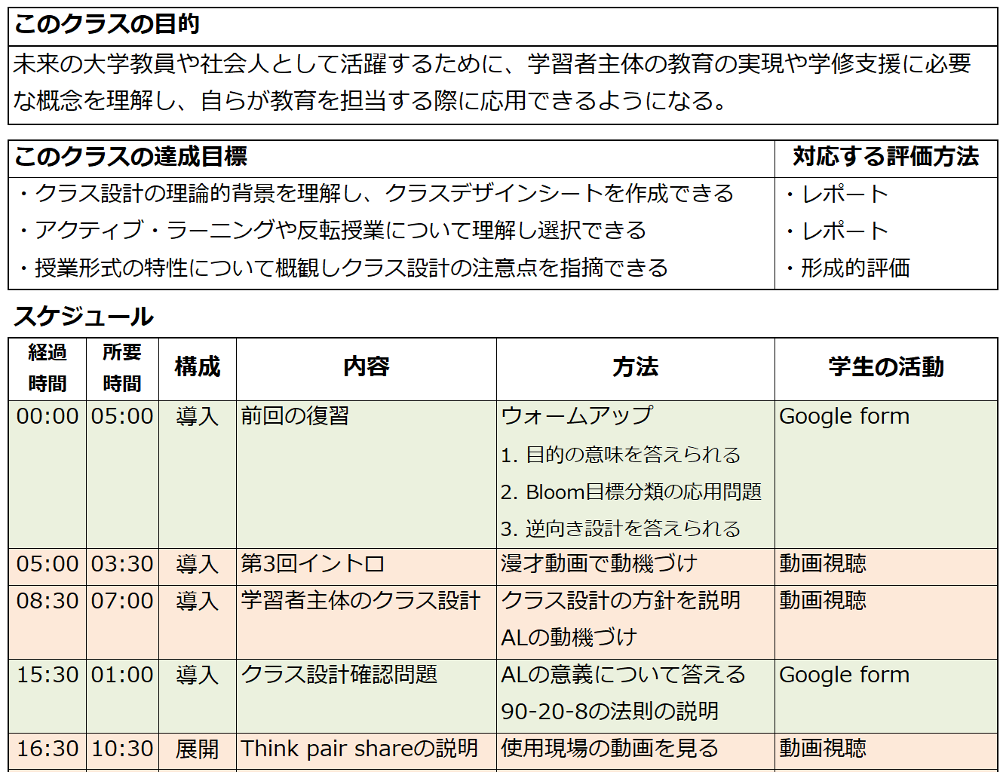

<!-- _class: cover-hero -->

大学などで教える

6分間クラスデザイン

<b>達成目標：</b>クラスデザインシートを作れる。

<!--
- まずは、タイトルコール。
-->

---

6分間クラスデザイン

# クラス設計とは　設計復習

<b>一回分の授業を「要素」</b>を組み合わせ、 
<b>目標が達成出来るようにデザインする</b>こと

①<b>逆向き設計</b>を使用する

② 2つの便利な方針を知っておく

ガニエの9教授事象　90-20-8の法則

③<b>インストラクショナル・デザイン</b>の要素を 
適切に組み合わせ使用する

アクティブラーニングなど

<!--
- どんな授業がたのしかったですか？考えてみて下さい。
-->

---

6分間クラスデザイン

# クラスデザインシートとは　設計

✔クラスの<b>設計作業を集約した</b>シート

設計 <b>開発</b>に入る前に作る

▼

情報が集約されており、作成すれば逆向き設計が<b>自ずと実現</b>される

▼

時間やワーク、評価の過不足が理解できる

<!--
- クラスの設計作業を1枚に集約したシート。作れば逆向き設計が自ずと実現され、時間・ワーク・評価の過不足も見える。
-->

---

6分間クラスデザイン

# クラスデザインシートとは　設計

✔クラスの<b>設計作業を集約した</b>シート

✔<b>時間配分</b>、<b>目的/目標</b>、<b>構成</b>、<b>内容</b>、 
　<b>方法、学生の活動</b>を授業全体に対し時系列でまとめたもの

✔クラス設計のtipsに倣い実施する

- <b>導入</b>・<b>展開</b>・<b>まとめ</b> 
- <b>20分</b>を目安に話題進行 
- <b>8分</b>を目処に参画する 
- <b>アクティブラーニング</b>なども利用 
- <b>詰め込み過ぎない</b>

<!--
- シートは時間配分・目的/目標・構成・内容・方法・学生の活動を時系列でまとめたもの。導入展開まとめ・20分・8分・AL・詰め込みすぎないのtipsに倣う。
-->

---

6分間クラスデザイン

# クラスの外も充実させる　参照

✔クラス時間の設計と同時に、 
　<b>課題や課外活動などについても同時に</b>デザインする

※学部：<b>１単位＝４５時間の学修</b> (大学設置基準第二十一条)　→<b>30時間のクラス外活動が標準</b>

✔シラバス時に設計した大規模課題などは、<b>授業との関連性</b>を考える

- 事前知識や課題の狙いを説明したか？　- 例の提示や補足説明は不要か？

✔その他の課題を<b>目標に沿って適宜配置する</b>

- 授業の目標達成の評価にかかる課題　- 課題内容を授業内で活用するための課題・予習

<b>確実なフィードバック</b>と<b>課題にかかる時間</b>に留意

<!--
- クラス時間と同時に課題・課外活動も設計する。1単位45時間＝30時間のクラス外活動が標準。フィードバックと課題時間に留意。
-->

---

6分間クラスデザイン

# よくあるQ  A

<b>◯なぜデザインするの？ </b>→ <b>時間は限られているから</b>

<b>①最も重要なこと</b>はなにか <b>→ 目標ファースト</b>

目標を伝え、目標到達にむけ要素が配置され、目標到達が評価出来る事

<b>②何をワーク</b>にするか <b>→ 最も重要な内容/覚えて欲しい事</b>

<b>③1つのトピックを説明するのに何分かかるか</b>

配布資料・スライドならおおよそ<b>6分</b>　※ 板書があるなら<b>8~10分くらい</b>

<!--
- なぜデザインするか＝時間は限られているから。①目標ファースト、②ワークは最重要内容、③1トピック≒6分（板書なら8〜10分）。
-->

---

6分間クラスデザイン

# 6分間クラスデザイン　設計参照

<b>1つのトピックを説明する6分間をデザインする</b>

※普段は<b>パワーポイントのアウトライン作成</b>が同じ作業／通常はクラスレベルでデザインすればOK

確認

①レベルは、学部初級(普遍教育か2年次のイントロ科目) 
②導入 – 展開 – まとめの構成で作る 
③簡易<b>ワーク</b>をいれ、主体的に学べる仕掛け作りを。 (Think pair shareや問いかけは2分程度) 
④スライドまたは板書で実施 
⑤必要に応じて、<b>Google Formsなど使用可</b> 
⑥<b>詰め込み過ぎない </b>(内容の飛躍も注意) 
⑦興味・関心をひくか　⑧内容は目標と合っているか

<b>無駄を削いだら、6分 - 1コンセプト</b>を実感しよう

<!--
- 1トピック＝6分をデザインする。普段のPPTアウトライン作成と同じ。確認①〜⑧をチェック。無駄を削げば6分-1コンセプトを実感できる。
-->

---

まとめ

# まとめ

クラスデザイン
クラスデザインシートの作成で達成される

クラスデザインシート
雛形のシートを使いつつ、クラス設計のtipsを参照し作成する

クラスの外も設計する

先日、師匠に聞きに行ったら、授業の最後に<b>ビハインド・ザ・シーン</b>を入れるデザインを取り入れたと仰ってました。こういうのもデザインシートがないと難しいので、ぜひ作成を！

<!--
- まとめ。クラスデザイン＝シート作成で達成、シートは雛形＋tipsで作る、クラスの外も設計。師匠のビハインド・ザ・シーン例もシートがあればこそ。ぜひ作成を。
-->
