<!-- _class: cover-hero -->

個別最適な高等教育の生成

生成AIは、大学の学びをどう変えるのか？

<b>クロスアポイントメント先機関：</b>

東京大学 大学総合教育研究センター

<b>千葉大学 高等教育センター 助教</b>

<b>博士 (理学)</b>

田川　翔

<!--
生成AIは、大学の学びをどのように変えるのでしょうか。 / 本日、「個別最適な高等教育の生成」というテーマで提案させていただきます。田川と申します。どうぞよろしくお願いいたします。
-->

---

申請者紹介

# 田川　翔たがわ しょう

<b>大学教育を設計し、学生と教員を支援する仕事</b>

<b>所属：</b>千葉大学 高等教育センター/アカデミックリンクセンター

<b>専門・経歴：</b>

<b>地球惑星科学</b>　東工大(学部・修) → 東大(博) 2020年学位取得

<b>高等教育論</b>　特に、教員のICT支援/教授法開発

<b>システム開発</b>　日本貨物航空(株)で、貨物管理システムのIT企画

研究例

「海の起源」の仮説検証 Tagawa et al. (2021) <i>Nat. Com.</i> 他 15報 (筆頭4本)

スキル・経験・実行力

大学の教育企画やFD等実務、 IT企画・開発経験、研究経験、 プログラミングスキル

分野を越境し、他者と協働し、知を<b>掛け合わせる</b>重要さを強く認識

<!--
私は現在、千葉大学の高等教育センターおよびアカデミックリンクセンターに所属しております。そこでは未来の大学教育を設計し、学生や教員を支援する仕事を行っています。バックグラウンドとしては、地球惑星科学、高等教育論、そして民間でのシステム開発の経験がございます。研究は、理学分野で地球の起源について実験していました。 / こうしたキャリアパスから、私は分野を超えて、他者と協働し、知を創造する重要性を強く認識しているところです。
-->

---

なぜ本研究が必要か

# 教育学の未解決問題：2シグマ問題

<svg viewBox="0 0 560 360" xmlns="http://www.w3.org/2000/svg" style="width:100%; height:auto;">
<line x1="80" y1="40" x2="80" y2="320" stroke="#333" stroke-width="2.5"/>
<line x1="80" y1="320" x2="540" y2="320" stroke="#333" stroke-width="2.5"/>
<path d="M80,320 C200,320 230,90 300,90 C370,90 400,320 520,320 Z" fill="#C9E3C2" stroke="#7FB07A" stroke-width="2"/>
<path d="M260,320 C380,320 410,120 480,120 C540,120 555,320 600,320 Z" fill="#F4CFD3" stroke="#D98B92" stroke-width="2" opacity="0.85"/>
<text x="190" y="190" font-size="30" font-weight="700" fill="#222">教室で</text>
<text x="180" y="226" font-size="30" font-weight="700" fill="#222">学んだ群</text>
<line x1="280" y1="232" x2="300" y2="270" stroke="#333" stroke-width="2"/>
<text x="150" y="105" font-size="44" font-weight="800" fill="var(--accent)">2σ</text>
<path d="M205,150 C230,110 280,108 320,118" fill="none" stroke="var(--accent-dark)" stroke-width="6"/>
<polygon points="318,104 340,120 314,130" fill="var(--accent-dark)"/>
<rect x="350" y="120" width="170" height="44" fill="#fff" stroke="var(--accent)" stroke-width="2.5" rx="3"/>
<text x="360" y="152" font-size="30" font-weight="700" fill="#222">個別指導</text>
<text x="20" y="220" font-size="26" font-weight="700" fill="#222" transform="rotate(-90 30 200)">頻度</text>
<text x="200" y="352" font-size="26" font-weight="700" fill="#222">総合的達成度 (≒成績)</text>
</svg>

<b>個別最適化が可能なら学修者はもっと学べる、でも出来ない</b>

Bloom (1984). <i>Educational Researcher</i>. https://web.mit.edu/5.95/readings/bloom-two-sigma.pdf

<!--
本研究で挑むのは、2シグマ問題です。 / 1980年初頭提案されたこの問題は、教室で学んだ集団と比較して、個別指導を受けた学習者の成績が平均で2シグマ向上するという現象を指します。 / つまり、個別最適化やチュータリングが可能であれば学習者はもっと学べるのですが、それを教室で実現する方法論は未解明です。 / この問題の解決に向け長年、様々な教授法の試行錯誤が教育の現場で取り組まれているものの、いまだに個別指導を超える方法はないと言われています。
-->

---

この研究では何をするか

# 5年間に取り組む研究課題のチャレンジングな点

<b>大学での学びの経験を変え、 誰もが学びやすく、夢を叶えられる世界を実践的に実現する。</b>

現状の課題

① 社会人学生、留学生、支援を必要とする学生、学際的な学びの実現… 　多様な学生に対応できるでしょうか？<b>教員の負担、多すぎませんか？</b>

② 生成AIが、<b>授業課題の回答に悪用されていませんか</b>？

③ 学ぶ経験が、<b>対話的で実践的なら、もっと面白くなる</b>と思いませんか。

→ 今の教育の延長では、<b>2シグマ問題の解決は困難</b>

<!--
私が目指すのは、この問題に対してAI技術を用いて実践的に解決策を提示し、大学での学びの経験を変えることです。そしてその先にある、「誰もが学びやすく夢を叶えられる世界」の実現を目指します。 / 現状の大学の課題を想像してみて下さい。 / まず、学生が多様化しています。社会人学生や留学生が増え、支援を必要とする学生の数も増加しました。学際的・分野横断的な学びの実現も求められています。大学教員の教育的負担は増加する一方です。 / また、身近な例では、生成AIを教員の意図と無関係に学生が使用する例もあります。 / さらに、学びの経験が対話的で実践的になれば、大学の授業はもっと学べるものになるのではないでしょうか。 / しかし、現状の方法論やリソースの延長線上では2シグマ問題の解決は困難といえます。 / ※合理的配慮：2010年：1万人、2023年：3万人
-->

---

この研究では何をするか

# 5年間に取り組む研究課題のチャレンジングな点

<b>大学での学びの経験を変え、 誰もが学びやすく、夢を叶えられる世界を実践的に実現する。</b>

現状の課題

① 社会人学生、留学生、支援を必要とする学生、学際的な学びの実現… 　多様な学生に対応できるでしょうか？<b>教員の負担、多すぎませんか？</b>

② 生成AIが、<b>授業課題の回答に悪用されていませんか</b>？

③ 学ぶ経験が、<b>対話的で実践的なら、もっと面白くなる</b>と思いませんか。

<b>生成AIで解決できるのではないか？</b>

<!--
そこで、AI等を活用した効果的な学びを、大学の授業で実現できれば、現状を改善し、2シグマ問題を解決できるのではないでしょうか。
-->

---

この研究では何をするか

# 学問あるいは社会をどのように変えていくか

<b>予算内で開発したツールと教授法</b>を他大学に提供　→　社会実装で、高等教育を変える

<b>学修者 – 大学 – 生成AI</b>という場での生成AIの活用モデル

アプリ・ツール実装 → 具体的な教授法・カリキュラム開発 → 効果測定

AI✕学修者モデル

⇒

学びの場におけるAIモデル

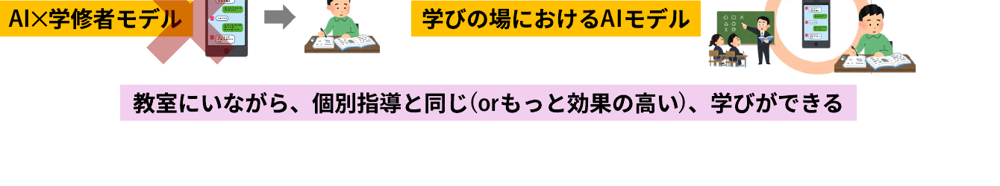

<b>教室にいながら、個別指導と同じ(orもっと効果の高い)、学びができる</b>

<!--
本研究では、開発したツールと教授法を提供し、社会実装に繋げることを目指します。 / 具体的には、学習者・大学（教室）・生成AIの3つの要素を連携させた新しい学びの場のモデルを構築します。 / 通常、このような研究やEdTechの開発は、学修者とアプリケーション間の関係を想定しがちです。しかし、そうではなく学びの場における生成AIのあり方を考えます。 / 授業があり、その前後で教員・学生・生成AIが相互作用することで、同じ時間・同じコストで、より深い学びのデザインが出来る可能性があります。 / 人間性や創造性、概念の関係性の学びなど、高度な学習目標を含む教育も実現できるかもしれません。
-->

---

この研究では何をするか

# 学問あるいは社会をどのように変えていくか

<b>予算内で開発したツールと教授法</b>を他大学に提供　→　社会実装で、高等教育を変える

<b>学修者 – 大学 – 生成AI</b>という<b>場</b>での生成AIの活用モデル アプリ・ツール実装 → 具体的な教授法・カリキュラム開発 → 効果測定

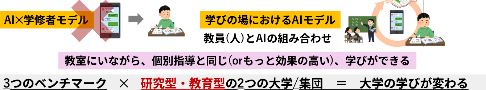

<b>教室にいながら、個別指導と同じ(orもっと効果の高い)、学びができる</b>

3つのベンチマーク

<ul>
<li><b>学修成果</b> (到達できる学びの広さ・深さ)</li>
<li>学修の<b>”経験”</b> の測定 (大学のUX)</li>
<li><b>教員の負担軽減</b></li>
</ul>

<b>3つのベンチマーク　✕　研究型・教育型の2つの大学/集団　＝　大学の学びが変わる</b>

<!--
この実現の為に、 3 つのベンチマークと2 つの異なる大学、つまり教育型と、研究型の大学において、実践的な研究を行うことで、本研究を推進いたします。 / 3 つのベンチマークとは、まずは学習成果、つまり到達できる学びの深さ、広さを指します。この2シグマという効果量は非常に大きいことから、試験や形成的評価により十分に測れると考えます。 / そして、学修者の経験の測定です。 / これは、例えば、ユーザーエキスペリアンスのようなものを考えております。大学という学びがどの様に変わったかということの心理的な調査となります。これは、インタビューや質問紙調査を想定しています。 / さらに、教員の負担が減るのかどうかという点も鍵となります。
-->

---

この研究では何をするか

# アプリケーションと教授法の開発

Step 1 機能開発

→

Step 2 問：教育工学/教育心理学

→

Step 3 問：高等教育論

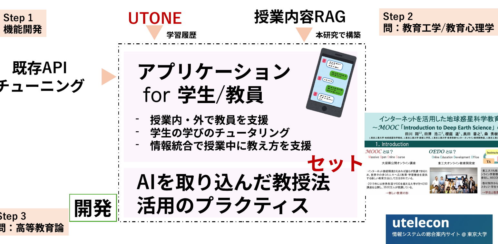

<!--
申請書にありますように、3つのステップにて、研究を行います。 / 最初は機能開発、これは生成AIを軸とするアプリケーションを、教員向け・学生向けに提供することです。完全なアプリケーションとして要件定義を冒頭で固めるのではなく、アジャイルに授業に合わせつくります。 / ある意味、企業の概念実証に近いものを想像して下さい。担当教員、TA/RA、企業の方との協働に加え、本研究で学んだ知見を応用するなどフレキシブルな開発を考えています。また、私はTA/RAを含めた授業開発支援に従事した経験が長く、その点は大きな強みとなります。 / また、生成AIのチューニングやUTONE (学修履歴の基盤システム)を中心とする、別システムからの情報の取り出し、授業内容のデータ等も利用できるよう整備します。 / その上で、授業の内外で教員を支援できるかそして、学生のチュータリングができるか、授業中に生成AIを用いた、教え方を支援・開発できるか、といった点を目指します。 / その上で、AIを取り込んだ教授法や活用のプラクティスをセットで開発・公開します。
-->

---

この研究では何をするか

# 開発と測定のサイクル

Step 1 機能開発

→

Step 2 問：教育工学/教育心理学

→

Step 3 問：高等教育論

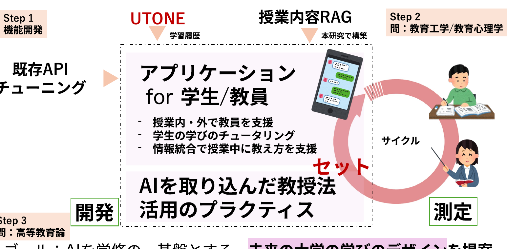

ゴール：AIを学修の一基盤とする、<b>未来の大学の学びのデザインを提案</b>

<!--
また、AIを用いた教授法も大きな伸びしろがあり、生成AI自体も引き続き急速に進化することが予想されます。 / そこで、サイクルを回す事、つまり教室での実践と生成AIの修正を行い、効果を測定し、その時点で出来ることを把握しながら、問に迫っていきたいと考えます。 / 最終的には、AI を一つの基盤とする未来の大学・大学院のあり方やカリキュラム設計の提案に繋げていきたいと考えます
-->

---

なぜ本研究が必要か

# 研究の背景— 世界の背景と研究提案の更新

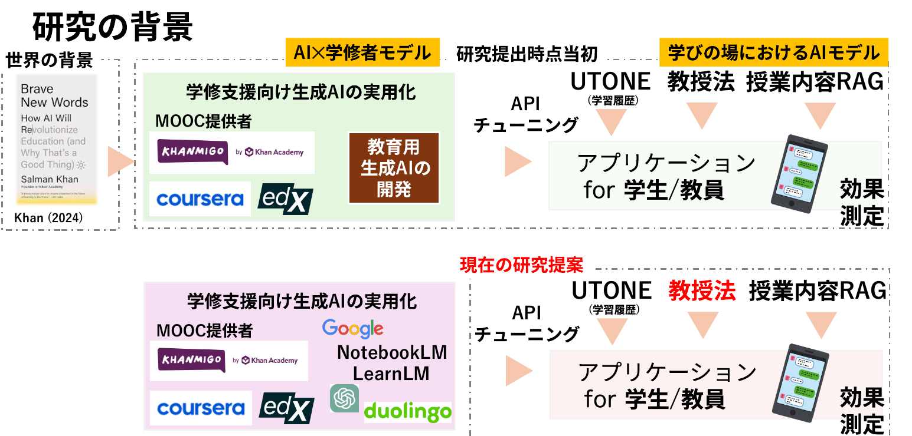

<b>教授法の開発、実践、効果測定が最優先に</b>

<!--
研究の背景を説明します。今年の春、大規模オンライン授業(MOOC)のCEOであるKhanが生成AIによる2シグマ問題の解決を掲げました。多くのMOOCが同時に学修基盤に生成AIを取り入れました。その時点で私もそれらのツールを試したものの、有効とは感じませんでした。研究当初は、こちらの開発の部分に比重がありました。 / しかし、この半年で周辺技術に大きな進歩があり、応用側、つまり、教え方の開発こそが重要になると考えています。 / その上で当初の進め方と逆方向、つまり教育側での実践から、LLMやAI関連技術にフィードバックできるというようなことを目指したいと考えます。 / ※自分が一番できるとこと、課題感が移ってきていると思った。教育の視点としては、AIの応用側、教え方の開発、分析も重要になると考えました。 / Khan (2024)
-->

---

なぜ東大・大総センター？

# なぜ東大・大総センターか

「<b>生成AIツールをどう作るか</b>」から、 「<b>学びの場をどう創り、どう測り、どう活かすか</b>」へ

<b>生成AI周辺の急速な技術進展 / 教員側はまだ教育に取り入れにくい</b> →ツール化 / LLMの情報工学的な領域以上に、<b>教育側の実践と測定が最優先</b>に

<b>UTONE (個人の学修の履歴：ラーニングポートフォリオを確立する)</b> センター内のプロジェクトが、<b>個人最適な学び生成の基盤データ</b>に

<b>最も先進的な教授法・カリキュラム開発・</b>FDの先生方の<b>支援の確約・共同研究</b> <b>センター内、東大内の学内リソースの利用</b>や<b>TAの参画</b> 栗田佳代子先生 (大学総合教育研究センター 副センター長/教授)　教育心理学・授業設計・FD

大学総合教育研究センターでの実施が、<b>現時点で最善と判断 →</b> <b>高い研究実現性</b>

<!--
この状況の変化を踏まえると、生成AIツールをどう作るか、から、生成AIを使った学びの場をどう創り、測り、活かすかについて、挑めるようになった、という認識です。 / 最初の提案に書いた問や実現したい点は変わりません。しかし研究環境については、大学総合教育研究センター(大総センター)での実施に、提案時点から更新しました。 / 教員側は生成AIを教育に取り入れることに、現状は戸惑いがあると言われています。まずは、教育現場での実践を早期に開始することから始めていきたいと思っております。 / また、当該センターが所管する、ラーニングポートフォリオ構想は、本研究に大きく寄与するはずです。 / 何より研究実施先の大総センターは、教授法やカリキュラム開発を行い、未来の大学教員を育てる拠点です。その先生方が生成AIと大学教育の現状に、緊迫感を持たれています。学内リソースも充実しており、AIをはじめとする様々な先生、技術者と共に働き学ばせて頂く機会も多いでしょう。 / そのことから、実現性を踏まえ大総センターでの実施が最善と判断しております。
-->

---

まとめ

# 2シグマ問題を解決する

<svg viewBox="0 0 480 320" xmlns="http://www.w3.org/2000/svg" style="width:100%; height:auto;">
<line x1="70" y1="30" x2="70" y2="280" stroke="#333" stroke-width="2.5"/>
<line x1="70" y1="280" x2="460" y2="280" stroke="#333" stroke-width="2.5"/>
<path d="M70,280 C180,280 205,80 270,80 C335,80 360,280 470,280 Z" fill="#C9E3C2" stroke="#7FB07A" stroke-width="2"/>
<path d="M230,280 C340,280 365,110 430,110 C490,110 505,280 545,280 Z" fill="#F4CFD3" stroke="#D98B92" stroke-width="2" opacity="0.85"/>
<text x="160" y="170" font-size="26" font-weight="700" fill="#222">教室で</text>
<text x="150" y="202" font-size="26" font-weight="700" fill="#222">学んだ群</text>
<text x="130" y="92" font-size="40" font-weight="800" fill="var(--accent)">2σ</text>
<path d="M180,135 C205,98 255,96 295,106" fill="none" stroke="var(--accent-dark)" stroke-width="6"/>
<polygon points="293,92 315,108 289,118" fill="var(--accent-dark)"/>
<rect x="320" y="106" width="150" height="40" fill="#fff" stroke="var(--accent)" stroke-width="2.5" rx="3"/>
<text x="330" y="135" font-size="26" font-weight="700" fill="#222">個別指導</text>
<text x="18" y="190" font-size="23" font-weight="700" fill="#222" transform="rotate(-90 28 175)">頻度</text>
<text x="170" y="310" font-size="22" font-weight="700" fill="#222">総合的達成度 (≒成績)</text>
</svg>

Bloom (1984). <i>Educational Researcher</i>. https://web.mit.edu/5.95/readings/bloom-two-sigma.pdf

個別指導は、通常の教室での指導と比べ学習効果が<b>2標準偏差</b>高い。

“コスト上実現しえない個別指導”と同等の学びを<b>全員に常時提供する方法</b>は…？

<b>生成AIで個別最適な学び</b>が支援出来る！

Step 1 機能開発

→

Step 2 明らかにする問 (教育工学・教育心理学)

→

Step 3 明らかにする問 (高等教育論)

<b>前人未踏の学修支援・教員支援、日本の大学の高度化・教員の負担軽減へ</b>

<!--
まとめです。本研究は、2 シグマ問題に、AIそして教授法の開発から挑みます。 / 実際に教室の中で、AIを使った教育を実現し、前人未到の優れた学習支援、教育支援、そして我が国の大学の高度化や先生方の負担軽減へ、全力で挑んでいきたいと思います / 以上で発表を終わります。 / ありがとうございました。
-->

---

本研究の構成

# 大学の高度化(5年後) = 個別最適な学び ＋ 協働的な学び

<b>本提案：</b>革新的学修基盤とAI利用教授法で、大学の個別最適な学びを実装する（<b>実装 → 教授法 → 効果測定</b>）

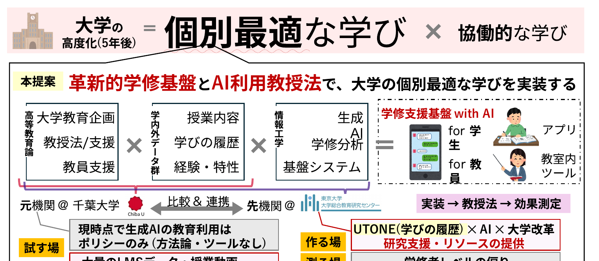

<b>究極の目的：</b>AI技術で、誰もが夢を叶えられる、革新的な高等教育モデルを創る

<!--
- 5年後の大学の高度化を、個別最適な学びと協働的な学びの2軸で捉える。本提案は革新的学修基盤とAI利用教授法で個別最適な学びを実装する。
-->

---

予算全体像

# 予算提案全体像

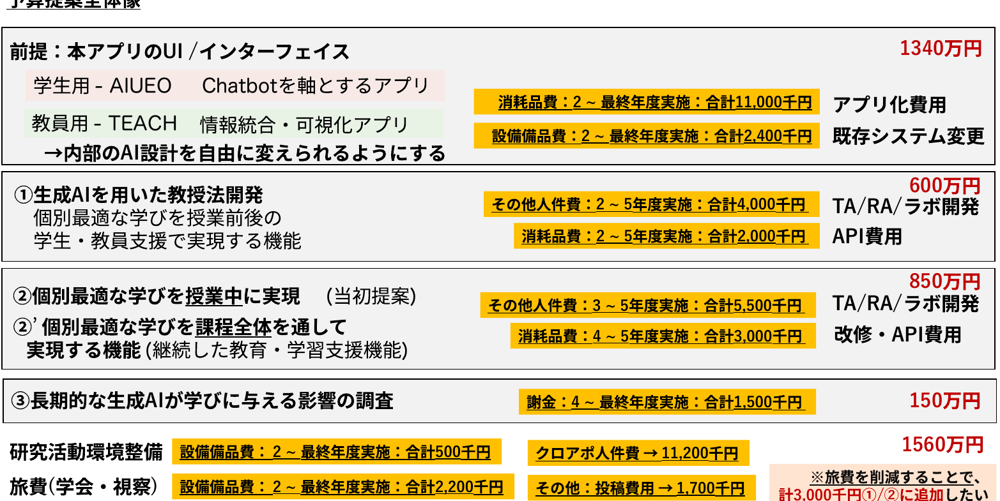

<!--
- 旅費
- 予算の全体像。①教授法開発、②授業中の個別最適化、③長期的影響調査の3本柱で、消耗品費・設備備品費・人件費を年度ごとに計上。
-->

---

申請者の過去の経験

# 申請者の過去の経験

学生時：オンライン授業制作支援 (リーダー)

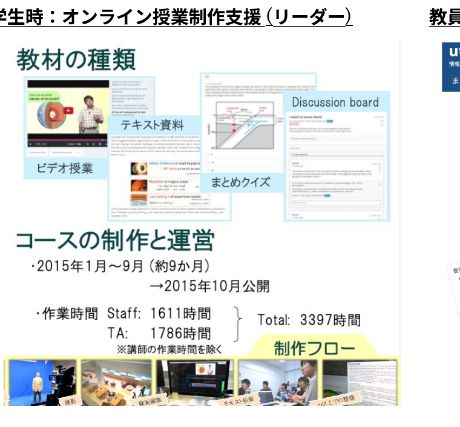

教員時：オンライン授業の記事作成 (分担)

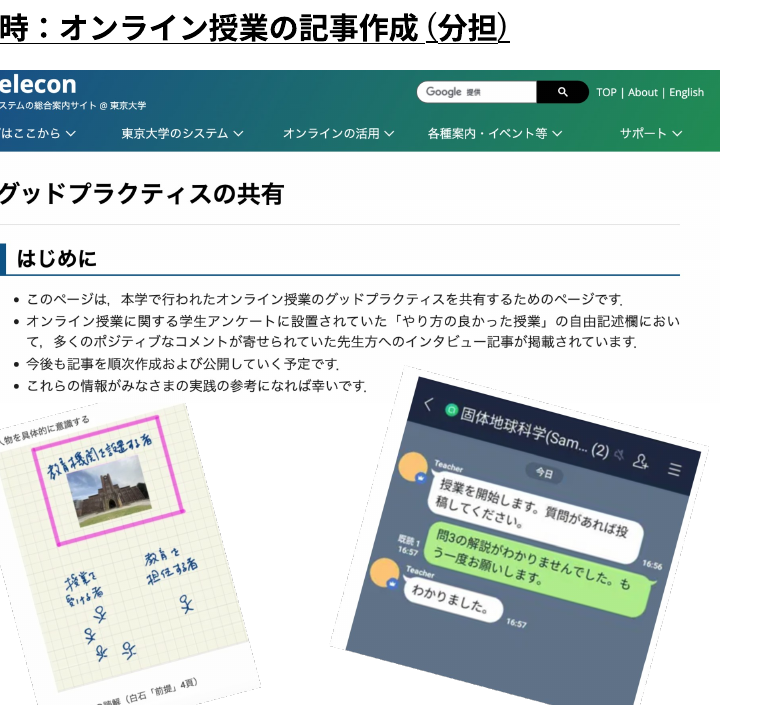

学生・教員双方で、<b>TA/RAとの協働による学びの場変革の経験</b>→具体的イメージ

<!--
- 旅費
-->

---

申請者の過去の経験

# 申請者の過去の経験

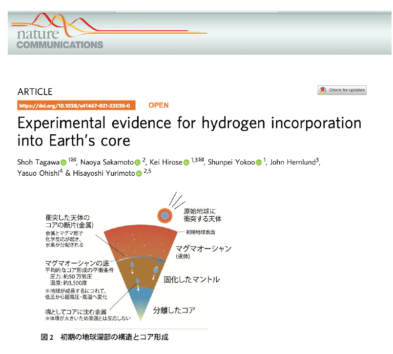
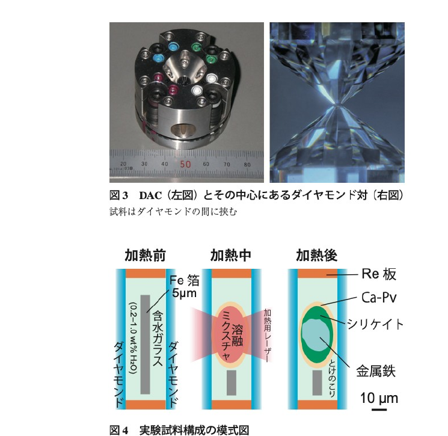

<b>Nature 姉妹誌</b>を含む、国際的な研究経験

<!--
- 旅費
-->

---

学習者主体のクラス設計

# クラス設計とは設計

①逆向き設計を使用する

✔<b>クラスの次元での目標</b>をきちんと定義し説明しましょう 
　▶<b>評価項目</b>も決めましょう

✔<b>要素の目標・形成的評価</b>をきちんと定義しましょう 
　▶課題の目標は、詳細シラバスで 
　▶動画の目標は、動画のタイトルページで

<b>達成目標：</b>クラス設計の指針を理解する。

✔あとは<b>コースデザインの時と同じ</b>です

<!--
- クラス設計の1つ目：逆向き設計を使う。クラス次元の目標と評価項目、要素の目標・形成的評価を定義し、あとはコースデザインと同じ。
-->

---

学習者主体のクラス設計

# クラス設計とは設計参照

② 2つの便利な方針を知っておく

<b>ガニエの9教授事象</b>

Gagne et al. (2004)

授業の<b>時間</b>を<b>どうデザインするか</b>

それぞれの流れに於いて、 <b>何をするべきか</b>

関心をもち、価値を知り、説明を受け、体験の機会を得て、記憶に残り、使える知識になる
<b>認知プロセス</b>に沿った教え方

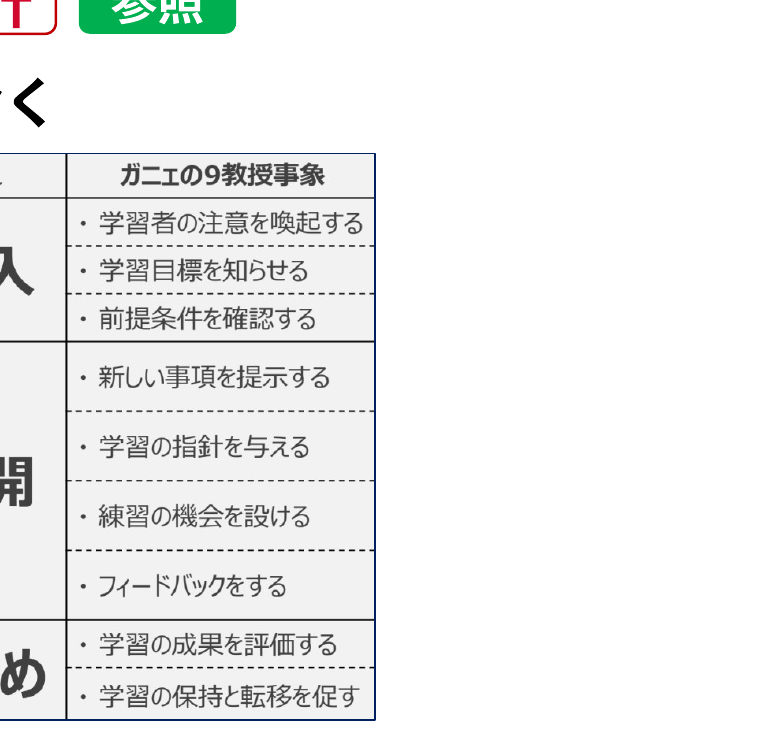

<!--
- ガニエ：インストラクショナル・デザインの大家。9教授事象で授業の時間と各段階ですべきことを設計し、認知プロセスに沿った教え方をする。
-->

---

学習者主体のクラス設計

# クラス設計とは設計

② 2つの便利な方針を知っておく

<b>90-20-8の法則</b>　→内容を20分毎にわける

• 理解しながら聞けるのは<b>90分</b>まで 
• 記憶に残しながら聞けるのは<b>20分</b>まで 
• <b>8分ごと</b>に参画させる

Pike (2008)

<b>学生の集中度合い</b>　(低 ⇔ 高)

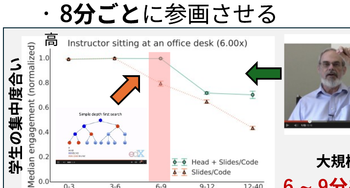

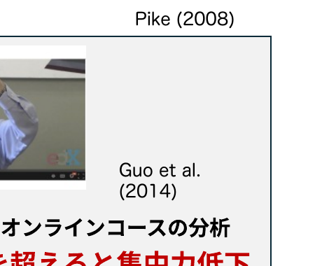

Guo et al. (2014)

<b>大規模オンラインコースの分析</b> <b>6 ~ 9分</b>を超えると集中力低下

<!--
- 90-20-8の法則。理解は90分、記憶は20分、8分ごとに参画。Guoらの大規模オンラインコース分析でも6〜9分を超えると集中力が落ちる。
-->

---

学習者主体のクラス設計

# クラス設計とは設計参照

③ 様々なインストラクションの要素を適切に組みわせる

<b>予習映像</b>

事前知識を共通化し、質問もしやすくなる

<b>事前問題</b>

事前に価値付けされ、授業にも関心をもつ

<b>講義説明</b>

学習項目を短時間で伝達し、理解に役立つ

<b>演習問題</b>

学習項目を体験し理解度も確かめられる

<b>雑談</b>

協力的な学習環境形成や集中の回復に

<b>ゆとり</b>

臨機応変な授業運営で学習者の興味に応える

<b>ワーク</b>

<b>学習者が主体的に学ぶチャンスが増える</b>

<b>課題</b> ▶コースデザイン参照

<!--
- 3つ目：インストラクションの要素（予習映像・事前問題・講義説明・演習問題・雑談・ゆとり・ワーク）を適切に組み合わせると、学習者が主体的に学ぶチャンスが増える。
-->

---

学習者主体のクラス設計

# アクティブラーニング

ワーク課題学習者が<b>主体的に</b>学びやすい要素

<b>双方向性・主体性のある学びを実現する方法論</b>

教員と学生が意思疎通を図りつつ、<b>一緒になって</b>切磋琢磨し、相互に刺激を与えながら知的に成長する場を創り、<b>学生が主体的に問題を発見し、解を見出していく能動的学修</b>
中教審 (2012)

▶手法：沢山ある (いくつかを次以降、体験)

<b>▶実装方法：教員がする or ティーチングフェローが双方向性を創る</b>

授業の目的上、適切ならば<b>積極的に利用</b>する <b>学習者が聴くだけの授業は終わりにしよう</b>

<!--
- ミニッツペーパー、自己評価、Think-Pair-Share、
- ピアレビュー、ブレインストーミング、ジグソー法、
- ケーススタディ、課題解決型学習(PBL)、チーム
- 基盤型学習(TBL)、ピアインストラクション、ポ
- スターツアー......
-->

---

学習者主体のクラス設計

# アクティブラーニングの有効性

<b>学部初歩の物理授業のテスト成績の分布図</b>

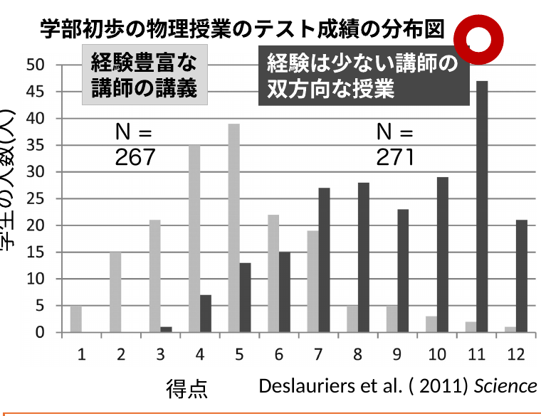

Deslauriers et al. (2011) <i>Science</i>

適切な講習を受け、<b>双方向性・主体性のある学習</b>を取り入れると、<b>若い教員も良い授業ができる</b>!

<b>注意：</b>アクティブラーニングすること自体が授業の目的ではない (効果がない事例も多数)

<!--
- アクティブラーニングの有効性。経験の少ない講師の双方向授業のほうが、経験豊富な講師の講義より得点分布が高い。ただしAL自体が目的ではない点に注意。
-->

---

千葉大の強み

# 千葉大の強み

① <b>アカデミックアドバイジングの専門職養成</b>

チュータリング・学修支援の長年の知見　→ 所属先のアカデミックリンクセンター

② <b>文理融合・課題解決型の学び</b>

個別最適な学びの必要性と支援の知見

③ <b>全員留学・スマートラーニング</b>

殆どの授業が少なくとも1回、オンライン開催 多数の授業映像が学内moodleに蓄積

BOOST応募に伴い、竹内副学長 (上長)より励ましのお言葉を頂きました

<!--
- 千葉大の強み3点：①アカデミックアドバイジングの専門職養成、②文理融合・課題解決型の学び、③全員留学・スマートラーニング。竹内副学長からも励ましを頂いた。
-->

---

学修基盤-授業前後の支援

# 主体的学びの同伴者app (授業前後/カリキュラム)

<b>問①　</b>個別最適な学び、主体的学びは可能か、学修者は良い質問を出来たか

<b>問②　</b>学修の達成状況が良化するか、学習基盤を使った教育の短期的影響

<b>問③　</b>異分野学生や社会人学生、支援を必要とする学生の履修はやりやすくなったか

<b>機能①</b>　授業情報の個別最適な説明 
<b>機能②</b>　各学修者に合わせたチュータリング 
<b>機能③</b>　予習 or 事後学修の理解促進 / 特に、いい質問の実施(精緻的質問) 
<b>機能④</b>　学生の課題実施支援、教員のフィードバック・採点設計支援 
　　　　→ 新しい教授法開発

<b>コンセプト</b> 心に寄り添う (AI×人) 履歴に寄り添う 夢と目標に寄り添う

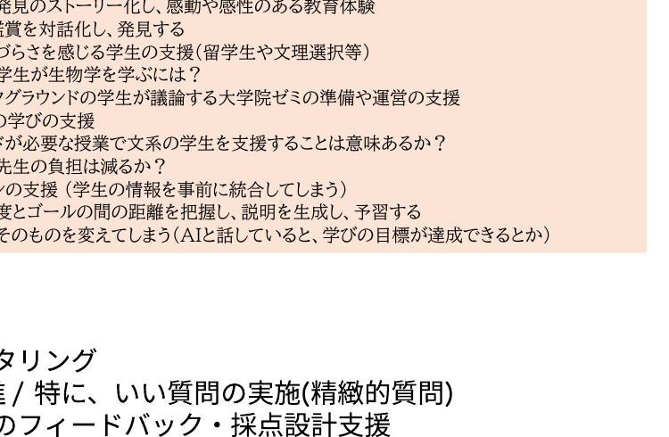

<b>この研究により学生が、実感を持って学び、目標まで確実に出来る</b> / 教員も最も重要な点に集中できる

<!--
- 授業前後の学修支援app。問①〜③に対し機能①〜④を提供し、心・履歴・夢に寄り添う。学生は実感を持って目標達成、教員は重要な点に集中できる。
-->

---

学修基盤モックアップを作る

# 学修基盤モックアップを作る

学生用 - AIUEO

<b>Chatbot</b>を軸とする web app

教員支援用 TEACH

製作予定 (Chatbot以外の要件が多い)

<b>研究でユーザーが使用する”ガワ”はきちんと作る</b> 
※様々なユースケースをこのapp内で実現可能とする 
※利用同意、評価データの収集、アンケート調査なども、ここから誘導

<b>消耗品費：UI/UX の開発・改善 (モックアップ費)、ラボ開発時の費用分担</b> 
最低限の開発費用として、2年度に5,500千円、3年度に2,500千円。更新・維持費用として、以降4年度~最終年度1,000千円を計上 
▶但しアプリ開発には不足するため、できる限り自前か学内予算獲得を目指す

設備備品費：2 ~ 最終年度実施 合計 2,400千円
消耗品費：2 ~ 最終年度実施 合計 11,000千円
2 ~ 最終年度実施 合計 500千円

<!--
- 学生用 AIUEO（Chatbot軸のweb app）と教員支援用 TEACH を作る。研究でユーザーが触る“ガワ”はきちんと作り、利用同意・評価データ収集・アンケートもここから誘導する。
-->

---

学修基盤-授業前後の支援

# 主体的学びの同伴者app (授業前後 / カリキュラム中)

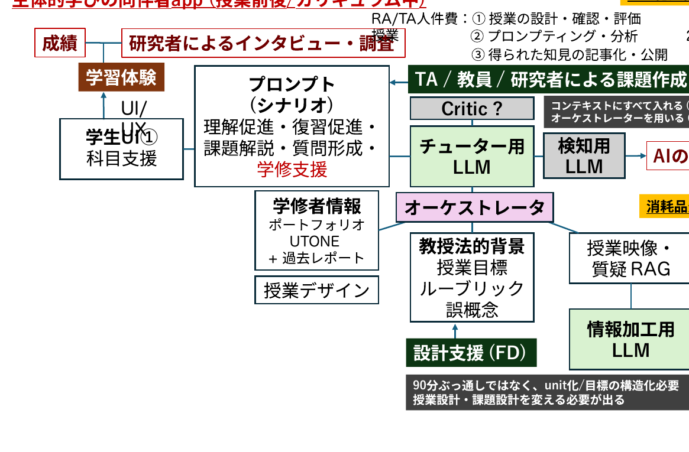

RA/TA人件費：① 授業の設計・確認・評価 2千円/1h ✕ 10 h = 20千円 per 1授業 
② プロンプティング・分析 2千円/1h ✕ 20 h = 40千円 per 1授業 
③ 得られた知見の記事化・公開 2千円/1h ✕ 10 h = 20千円 per 1授業

<b>API費用 (消耗品費用)：</b> 
東大の場合は、<b>無料分があり格安</b> 
他大の場合は、<b>250千円分確保</b>

<b>90分ぶっ通しではなく、unit化/目標の構造化必要</b> 
授業設計・課題設計を変える必要が出る

その他人件費：2 ~ 5年度実施 合計 4,000千円
消耗品費：2 ~ 5年度実施 合計 2,000千円

<!--
- 授業前後／カリキュラム中の「主体的学びの同伴者app」の構成。オーケストレータがチューター用LLM・検知用LLM・情報加工用LLMを束ね、学修者情報(UTONE/過去レポート)・授業映像質疑RAG・教授法的背景を統合する。Geminiのコンテキスト一括投入か o1-mini+オーケストレーターかは要検討。
-->

---

学修基盤-授業前後の支援

# 主体的学びの同伴者app (授業前後 / カリキュラム中)

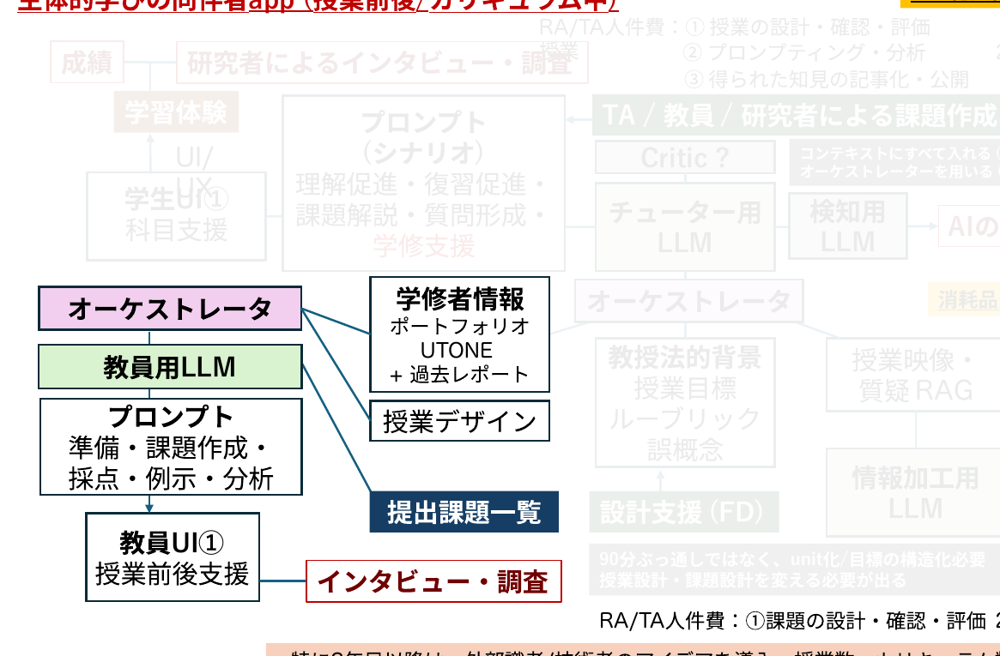

RA/TA人件費：①課題の設計・確認・評価 2千円/1h ✕ 10 h = 20千円 per 1授業 
② プロンプティング・分析 2千円/1h ✕ 20 h = 40千円 per 1授業 
③ 得られた知見の記事化・公開 2千円/1h ✕ 10 h = 20千円 per 1授業

<b>API費用 (消耗品費用)：</b> 
東大の場合は、<b>無料分があり格安</b> 
他大の場合は、<b>250千円分確保</b>

特に2年目以降は、外部識者/技術者のアイデアを導入、授業数・カリキュラム数を適宜調整

その他人件費：2 ~ 5年度実施 合計 4,000千円
消耗品費：2 ~ 5年度実施 合計 2,000千円

<!--
- 前ページと同じ構成を、教員UI①（授業前後支援）と教員用LLM・提出課題一覧の側から見た図。90分ぶっ通しでなくunit化・目標の構造化が必要で、授業設計・課題設計を変える必要が出る。
-->

---

学修基盤モックアップを作る

# 学修基盤モックアップを作る

教員支援用

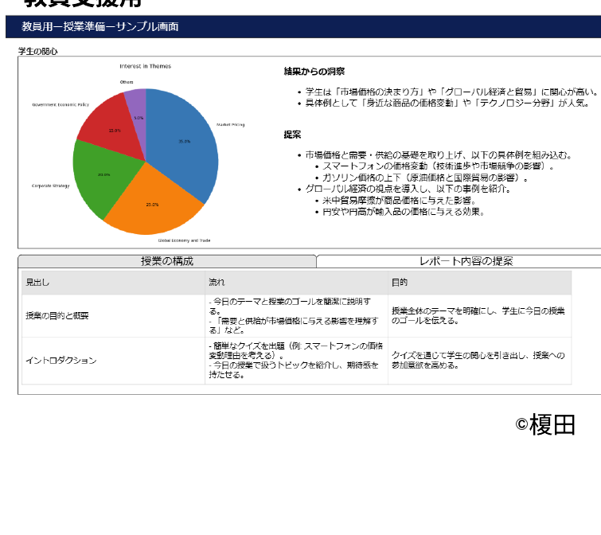

学生用

Dify / Azure
or
Google AI Studio

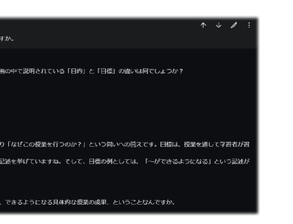

<!--
- モックアップの実例。教員支援用は、学生の関心を可視化した円グラフと「結果からの洞察・提案」、授業の構成／レポート内容の提案テーブル。学生用は Dify / Azure / Google AI Studio をバックエンドにしたチャットボットUI。
-->

---

学修基盤-授業中の支援

# 授業内支援 / 授業の体験変容

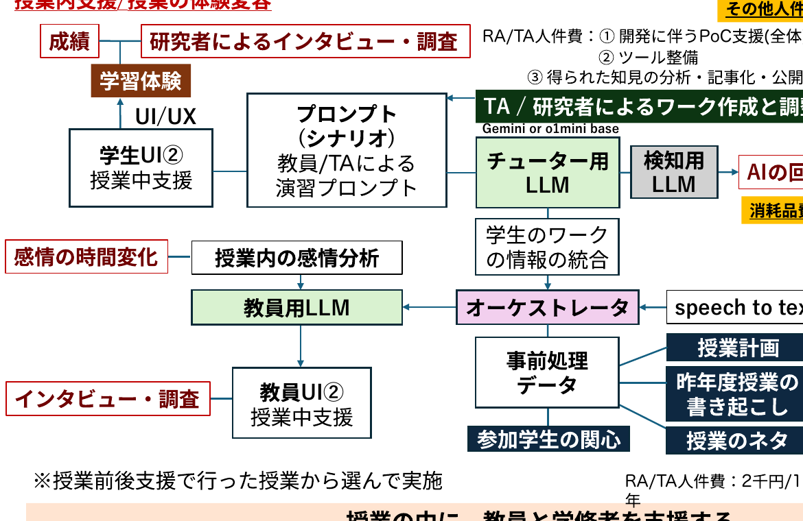

RA/TA人件費：① 開発に伴うPoC支援(全体) 2千円/1h ✕ 1,000 h = 2,000千円 
② ツール整備 2千円/1h ✕ 750 h = 1,500千円 
③ 得られた知見の分析・記事化・公開 2千円/1h ✕ 500 h = 1,000千円 
2千円/1h ✕ 50 h ✕ 5授業 = 500千円 ✕ 2年

<b>API費用 (消耗品費用)：</b> 
東大の場合は、<b>無料分があり格安</b> 
他大の場合は、<b>確保</b>

<b>授業の中に、教員と学修者を支援する</b> 
※授業前後支援で行った授業から選んで実施

その他人件費：3 ~ 5年度実施 合計 5,500千円
消耗品費：4 ~ 5年度実施 合計 3,000千円

<!--
- 授業中支援の構成。授業中の音声を speech to text し、事前処理データ・授業計画・参加学生の関心と統合、授業内の感情分析（感情の時間変化）も行う。学生UI②／教員UI②が授業中の体験を変える。前後支援で実施した授業から選んで実施。
-->

---

2シグマ論文

# 2シグマ論文 Bloom (1984)

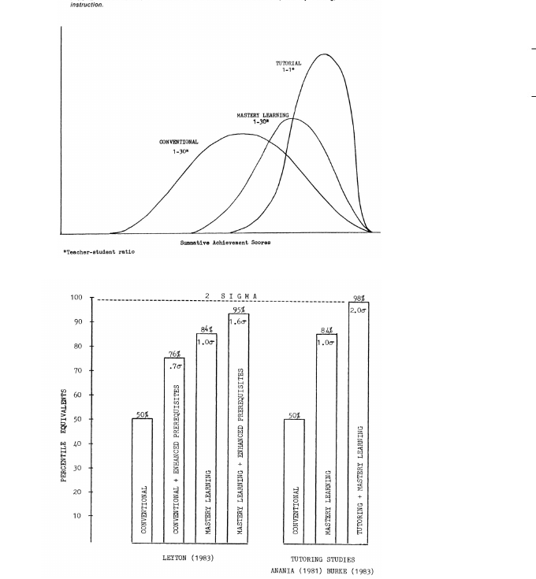

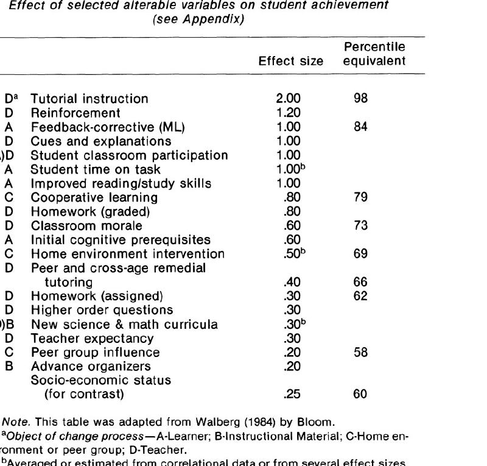

Bloom (1984), <i>Educational Researcher</i>　https://web.mit.edu/5.95/readings/bloom-two-sigma.pdf

<!--
- お金の配分を説明する（補足）。Bloom (1984) の2シグマ論文：個別指導(Tutorial)は通常授業に比べ約2標準偏差、完全習得学習でも約1標準偏差、成績分布が上方シフトする。右表は各種教育介入の効果量。
-->

---

学修基盤-授業前後の支援

# Googleの場合

cf. LeanLM (Google)の開発コンセプト

<b>アクティブ ラーニングを促す</b>: 適切なタイミングでフィードバックを提供して、演習と健全な取り組みを可能にする

<b>認知負荷の管理</b>: 関連性があり、構造化された情報を複数のモダリティで提示する

<b>学習者に適応する</b>: 目標とニーズに合わせて動的に調整し、関連する教材に基づいて学習を進めます。

<b>好奇心を刺激する</b>: 学習過程全体を通じてエンゲージメントを高め、モチベーションを高める

<b>メタ認知の深化</b>: 学習計画を立て、進捗をモニタリングし、学習者が自分の進歩を振り返るのを支援する

<!--
- 参考：Google の LearnLM の開発コンセプト（アクティブラーニング促進／認知負荷管理／学習者適応／好奇心刺激／メタ認知深化）。本研究の設計方針と重なる点を確認。
-->

---

学修基盤-授業中の支援

# 授業内支援 / 授業の体験変容

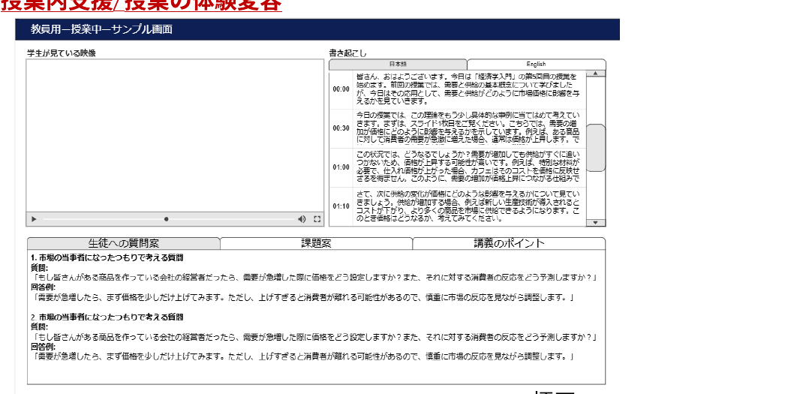

©榎田

<b>問①</b>　アクティブ・ラーニングや主体的学びは可能か

<b>問②</b>　学修の達成状況が良化するか、学習基盤を使った教育の短期的

<b>機能⑤</b>　授業中の教員支援、ワーク支援

Step 1　機能開発
Step 2　明らかにする問

<!--
- 授業中支援の体験変容。問①アクティブ・ラーニングや主体的学びは可能か、問②学修の達成状況が良化するか（短期的影響）、機能⑤授業中の教員支援・ワーク支援。Step1 機能開発／Step2 明らかにする問。
-->

---

Step ① 学修基盤-授業中支援

# 個別最適な継続的な学修支援 ・長期的な生成AIが学びに与える影響の調査

これまでの参加者　/　UTONE利用者

<svg viewBox="0 0 460 230" style="width:100%; height:auto;" xmlns="http://www.w3.org/2000/svg"><rect x="20" y="6" width="300" height="42" rx="8" fill="#8E0029"/><text x="170" y="33" font-size="20" font-weight="800" fill="#fff" text-anchor="middle">大学の学びで生成AIを体験</text><rect x="20" y="110" width="120" height="64" rx="8" fill="#fff" stroke="#1A6BB0" stroke-width="2.5"/><text x="80" y="138" font-size="17" font-weight="800" fill="#15436e" text-anchor="middle">学生UI③</text><text x="80" y="160" font-size="15" fill="#15436e" text-anchor="middle">授業外支援</text><rect x="172" y="110" width="120" height="64" rx="8" fill="#E8F3E8" stroke="#2E7D46" stroke-width="2.5"/><text x="232" y="138" font-size="17" font-weight="800" fill="#1d5a32" text-anchor="middle">チューター用</text><text x="232" y="160" font-size="17" font-weight="800" fill="#1d5a32" text-anchor="middle">LLM</text><rect x="324" y="110" width="120" height="64" rx="8" fill="#EEF0F3" stroke="#888" stroke-width="2.5"/><text x="384" y="138" font-size="17" font-weight="800" fill="#333" text-anchor="middle">UTONE</text><text x="384" y="160" font-size="16" fill="#333" text-anchor="middle">や学修履歴</text><line x1="324" y1="142" x2="296" y2="142" stroke="#444" stroke-width="2.5" marker-end="url(#ah33)"/><line x1="172" y1="142" x2="144" y2="142" stroke="#444" stroke-width="2.5" marker-end="url(#ah33)"/><line x1="80" y1="110" x2="80" y2="52" stroke="#444" stroke-width="2.5" marker-end="url(#ah33)"/><defs><marker id="ah33" markerWidth="9" markerHeight="9" refX="7" refY="4.5" orient="auto"><path d="M0,0 L9,4.5 L0,9 Z" fill="#444"/></marker></defs></svg>

整備は別予算で実施 / 分析を本予算で行う

インタビュー・調査・効果測定

<b>Step 1 機能開発</b>：機能⑥ 個別最適な学びに基づく、学習内容の生成

<b>Step 2 問</b>：問② 学修の達成状況が良化するか、学習基盤を使った教育の長期的影響

<b>Step 3 問</b>：問① 生成AIは、大学のどのような学修基盤となるべきか、設計の雛形はなにか / 問② 未来の大学のカリキュラムデザイン

<b>授業の中に、教員と学修者を支援する</b>

謝金：4 ~ 最終年度実施 合計 1,500千円

<!--
- 授業外支援（学生UI③）でチューター用LLMがUTONE・学修履歴に基づき個別最適な学習内容を生成。これまでの参加者・UTONE利用者を対象にインタビュー・調査・効果測定。整備は別予算、分析を本予算で。Step1機能開発→Step2/3で長期的影響と未来のカリキュラムデザインを問う。
-->

---

Step ① 学修基盤-授業中支援

# その他の費用

<b>クロアポ人件費 → 11,200千円</b>

<b>出張旅費 → 2,200千円</b>

<b>その他：主に、論文投稿・学会参加費用等 → 1700千円</b>

<!--
- その他の費用：クロスアポイントメント人件費 11,200千円、出張旅費 2,200千円、論文投稿・学会参加費用等 1,700千円。
-->

---

最後に

ご清聴、ありがとうございました。 
大学教育と生成AIが共生する最大のチャンスと思っております

何としても、学生と大学教育の未来に貢献したいです。 
全力で頑張りますので、<b style="color:var(--accent-dark);">よろしくお願い致します。</b>

<!--
- 締め。大学教育と生成AIが共生する最大のチャンスと考えており、学生と大学教育の未来に何としても貢献したい。全力で頑張ります、よろしくお願い致します。
-->

---

メディア授業の建付けと制限

# メディア授業の建付けと制限

オンライン授業で出来ること

①大学設置基準内にメディア授業を規定 
▶大学設置基準第二十五条第二項 
②<b>「面接(=対面)授業に相当する教育効果を有する」</b> 
- オンデマンド型の場合には <b>事後の指導</b>と<b>意見交換(質問)の機会確保</b>が必須 
▶平成13年文科省告示第51条 
<b>③学部は卒業単位数に含められる上限がある</b> 
<b>- メディア授業科目</b>(授業回数のうち半数を超える回数をメディア授業で実施する授業)は<b>60単位まで</b> 
※大学院は<b>上限はない</b> (短大/通信制大学は別規定)

大学における多様なメディアを高度に利用した授業について (文部科学省資料)　https://www.mext.go.jp/b_menu/shingi/chukyo/chukyo4/043/siryo/__icsFiles/afieldfile/2018/09/10/1409011_6.pdf

<!--
- メディア授業の法的建付け。①大学設置基準第25条2項で規定、②対面授業に相当する教育効果（オンデマンドは事後指導と質問機会の確保が必須・平成13年文科省告示51条）、③学部はメディア授業科目を卒業単位60単位まで（大学院は上限なし）。
-->

---

メディア授業の種類

# メディア授業の種類　参照

オンデマンド型

この授業 (他MOOC等が例) 映像が構造的に並び学習者が履修 情報の効率的な伝達に効果的で、資格試験関係に便利だが、遊びがないため疲れ易く、エンゲージメントが難しい

反転授業型 (後述)

オンデマンド教材を履修後、教室で演習やワークを実施

ブレンド型

対面や上記の形式を授業の目的に合わせて選択し実施

同時双方向型

Zoom等で学生の反応を見て実施 通常のクラスをオンライン化 アクティブ・ラーニング手法も取り入れ易いが、ツール・準備を要するため、教員が大変 ただ話すだけだと飽きられ易い

ハイフレックス型

オンライン・対面の両方で履修可 準備が大変で(教室の)設備も必要

自習型

映像や音声は使わず、課題やレポート等の課題のみで実施

---

メディア授業の評価

# メディア授業の評価　学生版

対面 ＞ ライブ講義 ～ オンデマンド ＞ オンラインアクティブラーニング

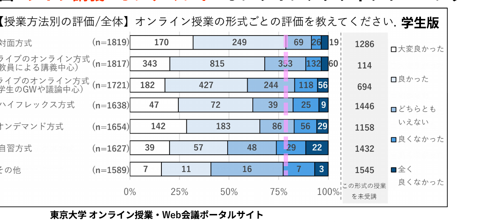

教員側の<b>FD</b> <b>(慣れ・手法開発・TF支援)</b> の問題

東京大学 オンライン授業・Web会議ポータルサイト　https://utelecon.adm.u-tokyo.ac.jp/questionnaire/student_2020A/

---

メディア授業の評価

# メディア授業の評価

東大の大学などで教えるでの結果

(慣れ・手法開発・TF支援を最大化したAL型授業の修了アンケート)

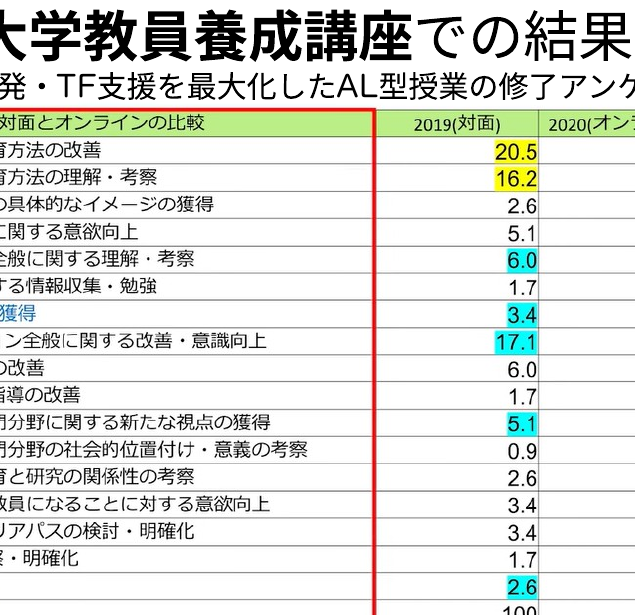

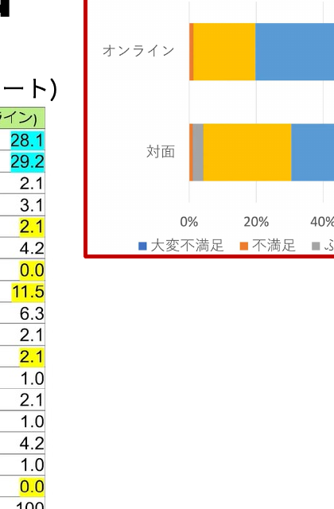

修了率の変化はない <b>満足度はオンラインの方が高い？</b>

青い数字：一方が3ポイント以上良い項目　©東大FFP/栗田/2022

---

メディア授業の強み・弱み・配慮点

# メディア授業の強み・弱み・配慮点

<b>強み</b>

①<b>設定した目標への到達</b>は得意

②<b>情報を効率的に提示し理解</b>に至りやすい

③<b>時間・場所的な融通</b>が効く

<b>弱み</b>

①<b>意図しない学びの発生</b>が難しい

②ジェネリックスキル形成に繋がり難い

③疲れやすい/集中しにくい

<b>要配慮</b>　①学生/教師-学生間の<b>コミュニケーション</b>　②学生側の視聴環境に差がある

---

反転授業

# 反転授業

基礎知識に関する(メディア)学習を<b>事前に</b> <b>▶その後の授業では議論・演習を行うブレンド型</b>

▶医学部等でも<b>実践論文</b>あり / Stanfordの取組が有名

高度化型

- <b>高次目標</b>を演習や実験で

完全習得型

- <b>理解の確認や質問</b>を教室で

✔アクティブラーニングを取り入れ教育効果を高めやすい ✔教員は多様な学生に対応しやすく、効率化もしやすい ✔学生は疑問点や関心を持ち、自己に最適な授業に臨める

---

# まとめ

①オンライン授業には<b>対面授業とは異なる</b> 　<b>強み</b>と<b>弱み</b>がある 
②組み合わせた<b>ブレンド型授業</b> (反転授業等) 　に注目が集まっている 
③学部はオンライン授業を卒業単位に 　含める上での<b>上限</b>がある

<b>参考文献</b> 
中央教育審議会 大学分科会 制度・教育改革ワーキンググループ (2018) 大学における多様なメディアを高度に利用した授業について.　https://www.mext.go.jp/b_menu/shingi/chukyo/chukyo4/043/siryo/__icsFiles/afieldfile/2018/09/10/1409011_6.pdf (参照日2024年4月3日) 
東京大学 大学総合教育研究センター (2021) オンライン授業に関するアンケート (Aセメスター). https://utelecon.adm.u-tokyo.ac.jp/questionnaire/student_2020A/ (参照日2024年4月3日) 
栗田佳代子 (2022) 対面からオンラインへの転換における学びの変化 革新的学びの創造学寄付講座シンポジウム第2回「学びのプロセス」https://tv.he.u-tokyo.ac.jp/lecture_5991/ (参照日2024年4月3日) 
Jonathan Bergmann, Aaron Sams, 山内祐平, 大浦弘樹 (監修), 上原 裕美子 (訳) (2014) <i>反転授業</i>. オデッセイコミュニケーションズ

---

例：AWS実践例

# 例：AWS実践例

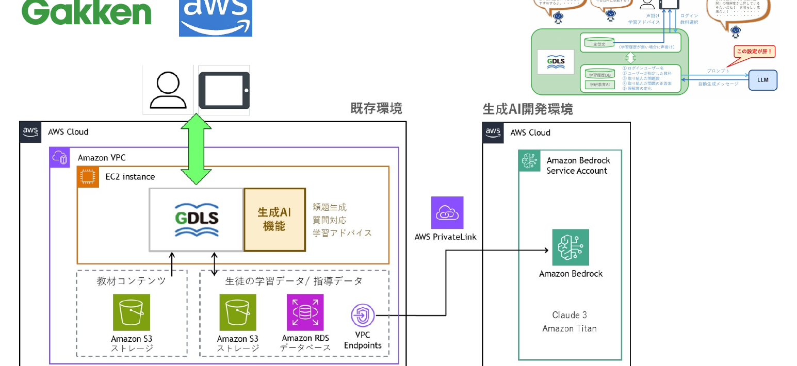

https://pages.awscloud.com/rs/112-TZM-766/images/CUS-02_AWS-Summit-2024_Gakken%20Method.pdf

---

例：AWS実践例

# 例：AWS実践例

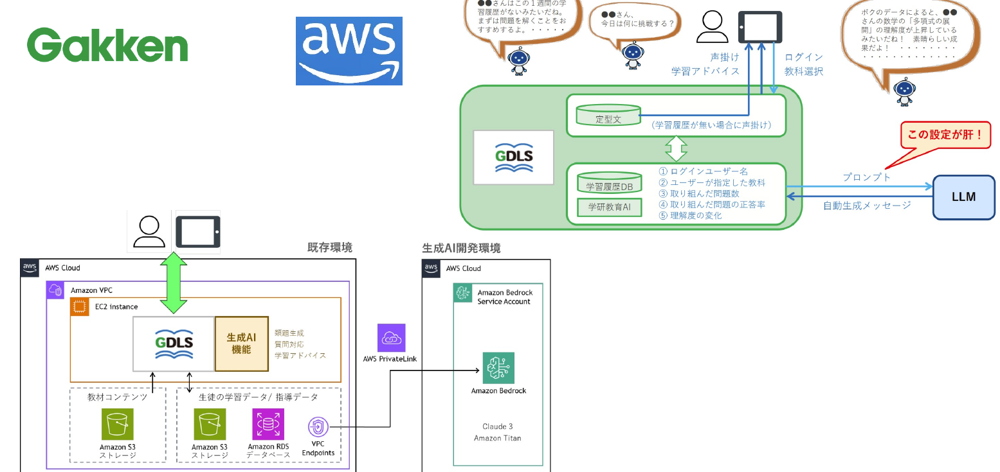

https://pages.awscloud.com/rs/112-TZM-766/images/CUS-02_AWS-Summit-2024_Gakken%20Method.pdf

---

① "教育×AI"領域の俯瞰

# Benjamin Bloom の２つの仕事 - その1　2シグマ問題

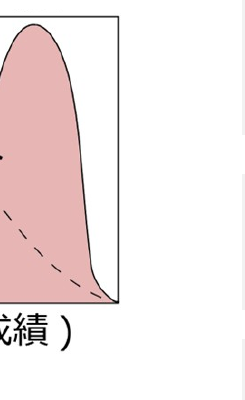

教室で学んだ集団 ／ 個別指導 (＋成績)

個別指導は、通常の教室での指導と比べ 学習効果が<b>2標準偏差</b>高い。

“コスト上実現しえない個別指導”と同等の学びを<b>全員に常時提供する方法</b>はあるか？

<b>生成AIで個別最適な学び</b>が支援出来る？

<b>学びの個別最適化ツール・伴走者として利用する</b>

<b>例：</b>興味や既習知識を例とした説明の生成、チュータリング、学習歴の情報統合、評価 <b>例：</b>英語、プログラミング等のスキル学習

学修支援向け生成AIの実用化 / MOOC提供者

Bloom (1984) <i>Educational Researcher</i> https://web.mit.edu/5.95/readings/bloom-two-sigma.pdf　／　Khan (2024)

---

① "教育×AI"領域の俯瞰

# Benjamin Bloom の２つの仕事 – その2　学習目標分類

<table style="font-size:19px; border-collapse:collapse; width:100%;">
<thead>
<tr style="background:var(--accent); color:#fff;">
<th style="padding:5px 6px; border:1px solid #ccc;"></th>
<th style="padding:5px 6px; border:1px solid #ccc;">認知的領域 (知識や思考)</th>
<th style="padding:5px 6px; border:1px solid #ccc;">学びへの生成AIの影響</th>
</tr>
</thead>
<tbody>
<tr><td style="padding:5px 6px; border:1px solid #ccc; font-weight:800; color:var(--accent-dark);">高次</td><td style="padding:5px 6px; border:1px solid #ccc;">創造 (学習を応用し、新しい価値を作れる)</td><td style="padding:5px 6px; border:1px solid #ccc;">人の創造性こそが大切</td></tr>
<tr><td style="padding:5px 6px; border:1px solid #ccc;"></td><td style="padding:5px 6px; border:1px solid #ccc;">評価 (事物・判断等を比較し評価出来る)</td><td style="padding:5px 6px; border:1px solid #ccc;">評価軸/価値/判断は人が設定する</td></tr>
<tr><td style="padding:5px 6px; border:1px solid #ccc;"></td><td style="padding:5px 6px; border:1px solid #ccc;">分析 (要素に分け、関係性を指摘できる)</td><td style="padding:5px 6px; border:1px solid #ccc;">解答/過程の支援可(例：要約・構造化・コーディング)</td></tr>
<tr><td style="padding:5px 6px; border:1px solid #ccc;"></td><td style="padding:5px 6px; border:1px solid #ccc;">応用 (他の場面や状況に使用できる)</td><td style="padding:5px 6px; border:1px solid #ccc;">単なる問題では、 AIが解いてしまう…</td></tr>
<tr><td style="padding:5px 6px; border:1px solid #ccc;"></td><td style="padding:5px 6px; border:1px solid #ccc;">理解 (学習内容を説明出来る)</td><td style="padding:5px 6px; border:1px solid #ccc;">説明/例示で支援可能 だが学修者の理解必須</td></tr>
<tr><td style="padding:5px 6px; border:1px solid #ccc; font-weight:800; color:var(--accent-dark);">低次</td><td style="padding:5px 6px; border:1px solid #ccc;">記憶 (事実や概念を暗記している)</td><td style="padding:5px 6px; border:1px solid #ccc;">支援可能だが、 学修者の記憶必須</td></tr>
</tbody>
</table>

左は栗田&中村 (2023)を元に作成 ／ 原著 Bloom (1956/1964)、改訂版(2001)を記載

学修の目標を構造化し、学びの設計を支援

※近年では、下から個別・段階的に行うのではなく、複数の次元の要素を組み合わせる必要性が叫ばれている。 
※近年では、学び方の学びや、人間性の涵養などを含む、学習目標分類も作成されている (e.g. Finkの学習目標分類) 
※但し、低次(特に記憶・理解・応用の段階)を蔑ろにして、高次の学修目標の達成は難しいと想定される。

授業におけるAI利用の指針となり得る

<b>授業の課題やワークの一部として、AIを学びの設計に取り入れる/対策する/教員支援を行う</b>

▶学習目標分類についての、担当講師による解説動画 (9分) https://www.notion.so/geophysica/Bloom-145d8c8bc5ab80deb9dfc15b89d91875?pvs=4

---

① "教育×AI"領域の俯瞰

# 本日のスコープの整理

<b>トレンド①</b> 学びの個別最適化ツール・ 同伴者として利用する

大学教育の趨勢として <u>←こちら</u>も気になりますが…

<b>トレンド②</b> 授業の課題やワークの一部として、 AIを学びの設計に取り入れる/対策する/教員支援を行う

本講座では、 <u>← こちら</u>を話題にします。

---

① "教育×AI"領域の俯瞰

# 

目的

<b>教育におけるAI活用が何を目指しているか</b>、 背景にある教育領域の知見を整理する。

内容

<b>A. AIを教育の文脈に取り込む</b> "社会の水準"、理学の学びと生成AI

AI利用を想定した授業設計・課題設定が不可欠になる でも、理学の学びの本質は変わらないのではないか

<b>B. Bloomの仕事と生成AI</b> 2シグマ問題・学習目標分類

トレンド① 学びの個別最適化ツール・伴走者として利用する トレンド② 授業の課題やワークの一部として、設計に取り入れる 　　　　　 and/or 教員支援を行う

---

②課題での利用例

# “教育×AI”領域の俯瞰②課題での利用例

目的現状、どのような利用例/研究例があるのか知り、試せるようになる。

内容

<b>A.</b> 学生が利用する

学修目標の達成のため、積極的に取り入れうる領域

公平かつ正しい評価のため、AI対策すべき領域

<b>B.</b> 教員が利用する

<!--
- ②課題での利用例。目的は、現状どんな利用例・研究例があるのかを知り、試せるようになること。
- 内容は A.学生が利用する／B.教員が利用する の2軸。学生利用には「積極的に取り入れうる領域」と「AI対策すべき領域」がある。
-->

---

②課題での利用例

# AIを学びの設計に取り入れる

<b>学生が使用する：課題・ワークでの活用</b> 
　学生の<b>分析・応用・理解の次元</b>における生成AIの利用 
　特に、課題/ワーク上での<b>支援</b>や課題<b>ツール</b>としての利用 
<b>教員が使用する：先生ご自身の支援ツールとしての活用</b> 
　フィードバック用ルーブリック 
　問題や問いかけの作成支援、(シラバスや設計の支援)

<b>現在の状況：</b>各大学で、グッドプラクティスを洗い出している状況 
　　　　　　昨今の生成AIの進化が早く、評価結果はかなり限られている

参考① 阪大 「生成AI教育ガイド」 https://www.tlsc.osaka-u.ac.jp/project/generative_ai/support_al.html 参考② Bowen &amp; Watson, AAC&amp;U “Teaching with AI” (2024)

<!-- メタな点：①ルーブリックでの採点やフィードバック支援はAIが可能になった -->

---

②課題での利用例

<b>アンケート 2</b> 
実際に授業で活用されている先生はどのように使用されていますか？

① コーディング

② 理解の促進 (学生が理解しにくい教授内容の深堀り)

③ 高度な学習目標の課題をさせるための途中過程

④ 外国語の翻訳や本/論文の要約

⑤ その他

(補足)差し支えなければ、コメントスクリーンでご紹介頂けませんか

この10分では、課題での利用例を説明致します

<!--
- アンケート2：実際に授業で活用されている先生はどう使っているか。コーディング、理解の促進、高度な学習目標課題の途中過程、翻訳・要約、その他。
-->

---

②課題での利用例

# デモ：理解を支援する、課題での情報の分析を行う、問題を作成する

研修後、Gemini / NotebookLMのデモ動画を共有

▶生物×物理とか、分野横断/学際的な学習も　支援や実装出来る？

① Notebook LMにアクセスしてみて下さい　https://notebooklm.google.com/ 
② 新規作成をクリックし、論文等のPDFや興味ある学習YouTubeなどを読み込ませて下さい 
③ 分析後、質問を書いたり、選んだり、英語による要約を確認してみて下さい 
④ 学生がよく持ちがちな誤概念について、間違っている理由を説明させて下さい

逆に言えば、学生スライドや配布資料をもとに、レポートを書くことや検索することが可能です 
<b>　→ ある程度重たい課題でも学生は実施出来ます / 逆に、簡単な課題はAIが答えてしまいます</b> 
※情報の変換・統合的なタスクであり比較的安心ですが、ハルシネーションはまだ発生します。

授業動画ファイルも、Gemini Pro (有料版)に読み込ませて、要約などが可能です。(支援が必要な学生向けに有効かも… / でも、授業を聞かなくてもよい、とはならないはずです)　▶先生方の感想や気付きを、コメントスクリーンでご共有頂けませんか (5分)

<!--
- デモ：NotebookLMで理解支援・情報分析・問題作成。重たい課題も学生が実施できる一方、簡単な課題はAIが答えてしまう。ハルシネーションに注意。
-->

---

②課題での利用例

# 動画を解釈する / 個別の生成AIツールを作成する

<b>自分の講義動画から授業の要約や問題作成をする例 (たたき台作成向け)</b>　<b>Google AI studio</b> 
https://geophysica.notion.site/Google-AI-studio-145d8c8bc5ab80a29a94dd3acf009c54?pvs=4

<b>PDFをアップロードするだけで、フィードバックシートを作成する例</b>　<b>Claude 有料版 プロジェクト機能</b> 
https://geophysica.notion.site/Claude-project-145d8c8bc5ab8037a41ad7fb7b3cf2d4?pvs=4

※昨今、これらのツールが大きく進展し、LangChainを使わずとも、 
Google / AWS / OpenAI等の公式ツールや、Dify等のサードパーティツールで、 
目的特化型の生成AI chatbotを設計出来るようになっています。

<!--
- 講義動画から要約・問題作成（Google AI Studio）、PDFアップでフィードバックシート作成（Claude有料版プロジェクト）。LangChain無しでも目的特化型chatbotが作れる。
-->

---

②課題での利用例

# 参考：理解を支援するための他のGoogleツール

LearnLMJurenka et al. (2024) on Arxiv

研修後、LearnLMのデモ動画を共有

① Google AI Studioにログインしてみて下さい　https://aistudio.google.com/prompts/new_chat?hl=ja 
② 新規作成/Create New Promptをクリックし、LearnLMを選択後、先生の分野における法則や概念、事実とされている内容を質問してみて下さい 
③ その内容について、問題を作成したり、先生の興味から解説するよう聞いて下さい

の取り組みについて 
「Google の使命は、世界中の情報を整理し、世界中の人がアクセスできて使えるようにすること」

Google labs の中に、幾つかの開発中の製品があり、教育への影響もありそうです → https://labs.google/　例：Illuminate (何でもソクラテス化：説明文や論文を対話的な解説に変えてしまうAI)

<!--
- LearnLM（Jurenka et al. 2024）。Google AI Studioでログインし、分野の法則・概念を質問し、問題作成や解説をさせる。Google labsには開発中の教育向け製品（Illuminate等）もある。
-->

---

②課題での利用例

# ChatGPT(無料版)の現状

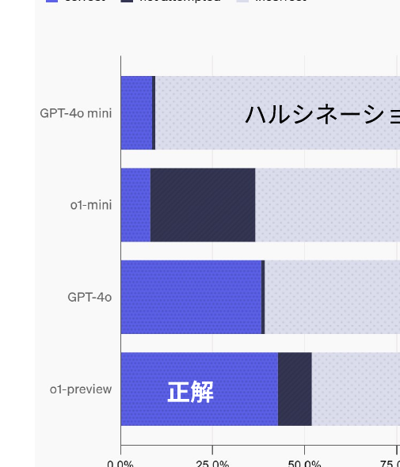

SimpleQA：回答の事実的正確性のベンチマーク 
Wei et al. (2024) Arxiv

例) Q. Who received the IEEE Frank Rosenblatt Award in 2010?　A. Michio Sugeno

知識のエッジ(=学習回数小)にある内容も含めてある

問題を解かせたり、論文を探させた場合等、 
無料版である<b>4o mini</b>は、「分からない」ということもなく、ハルシネーションする可能性が高い

但し、本流の知識を求めた場合については、 - 正しく説明したり、 - 答えを与えた状態でその理由を説明させると正しい　可能性が高い。

<!--
- ChatGPT無料版の現状。SimpleQA（Wei et al. 2024）。4o miniは「分からない」と言わずハルシネーションしやすい。ただし本流の知識なら正しく説明・理由付けできる可能性が高い。
-->

---

②課題での利用例

# ChatGPT(有料版)の現状

1. インタラクティブに数値実験する

フーリエ関数で、xが1つ増えるごとに1と-1を行き来するbox関数を、だんだん近似してみせて。(なんか、Box側が違いますが…)

2. 質問を自動生成する→ <b>精緻化（elaboration）</b>

「なぜそうなっているのか（Why）？」「どのようにそうなっているのか（How）？」「具体例は何なのか（What）？」

学校で学びそうなことを質問すると、自動生成されます。地球の核に水素が存在する可能性は？

3. o1を使って、問題の詳細な解説を得る

自分は、この問題について、〇〇と思った。解答は、△だった。なぜ？

4. Webで検索する　5. 出典を明示する　6. コーディングする

地球の核に水素が入っている可能性があるか、地球核のニュートリノ観測でわかるかどうか、英語の論文を引用しながら教えて。出典を明記して。

<!--
- ChatGPT有料版の活用例：1.数値実験 2.質問自動生成→精緻化（Why/How/What）3.o1で詳細解説 4.Web検索 5.出典明示 6.コーディング。
-->

---

②課題での利用例

# 要注意パターン：「応用」の次元への対応

簡単な問題や単答式の問題では、生成AIが直接回答を当てる場合がありえます 
特に、昨今のOpenAI o1は推論性能の向上により、相当強力です

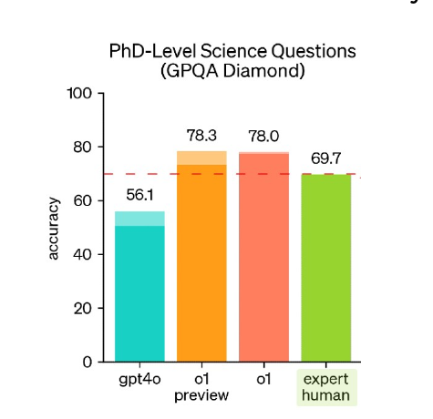

GPQA＝Graduate-level Physical and Quantitative Assessmentで人間の回答精度を上回る https://openai.com/index/learning-to-reason-with-llms/　Rein et al. (2023) arXiv

<b>化学（一般）</b> 
炭素と水素原子で構成される液体有機化合物の反応が、80度、20気圧で24時間行われたとする。プロントの核磁気共鳴スペクトルにおいて、反応物の最も高い化学シフトのシグナルが、生成物のシグナルに置き換わり、それは約3〜4 unit ほど低磁場側で観測される。対応する工業的大規模プロセスでも使用される、周期表のどの位置にある元素の化合物が、最も可能性の高い初期添加物（少量）として使用されたと考えられるか？ 
第5周期の金属化合物 / 第5周期の金属化合物と第3周期の非金属化合物 / 第4周期の金属化合物 / 第4周期の金属化合物と第2周期の非金属化合物

※課金した学生が成績がよい、という不公平な状況が発生しないよう、留意下さい

<!--
- 「応用」の次元は要注意。単答式はAIが直接当てる。GPQA（Rein et al. 2023）でo1は人間（専門家）の精度を上回る。課金した学生が有利になる不公平に留意。
-->

---

②課題での利用例

# 要注意パターン：「応用」の次元への対応

語学的な課題や、要約的な課題も、生成AIに直接入れてしまうだけで、 
回答が出てしまうことがありえます (写真も読み込めます)。

例：〇〇論文の内容を要約せよ / 教科書を翻訳せよ

課題

→

生成AI

→

アウトプット

→ 成績?

そこで、一捻りいかがでしょう (RPGを設計するように、レベル上げのパスを設計する)

例：教科書を翻訳の後、単語リストを作成し、暗記した内容をテストする。 
例：教科書の翻訳の際には、生成AIを使用しないポリシーを定める。 
例：生成AIで回答させた後、自分で添削して、そのプロセスを提出する。 
例：発表と質疑で成績を評価する。(理解のために生成AIは用いてよい。)

課題

→

生成AI

→

学習目標を確認できる学習者の努力

→

アウトプット

成績

<!--
- 語学・要約課題もAIに直接入れると回答が出る。そこで「一捻り」：翻訳後に単語リスト暗記テスト、翻訳時はAI禁止ポリシー、AI回答を自分で添削しプロセス提出、発表と質疑で評価。学習者の努力を組み込む。
-->

---

②課題での利用例

# 要注意パターン：「応用」の次元への対応

課題 (演習問題)

→

生成AI

→

アウトプット

成績?

持込み不可 試験など

課題

→

生成AI

→

学習目標を確認できる学習者の努力

→

アウトプット

成績

持込み可試験 レポートなど

生成AIを利用する課題デザイン　高次の学習目標 (例：創造・評価・分析) cf. 課題中心型の教授方略

<b>大きな課題</b> (複数トピック) ＝ 要注意 
途中で学修者の努力を含む / 過程を確認する

<!-- AIを必要に応じ活用しながらも、人間の創造性や批判的思考を重視し、 -->

---

②課題での利用例

# 課題の種別ごとの、生成AIのインパクト

<table style="border-collapse:collapse; font-size:22px;">
<tr style="background:var(--accent); color:#fff;">
<th style="padding:6px 14px; border:1px solid #ccc;"></th><th style="padding:6px 18px; border:1px solid #ccc;">知識</th><th style="padding:6px 18px; border:1px solid #ccc;">思考</th><th style="padding:6px 18px; border:1px solid #ccc;">技能</th><th style="padding:6px 18px; border:1px solid #ccc;">態度</th>
</tr>
<tr><td style="padding:5px 14px; border:1px solid #ccc; font-weight:700;">客観試験</td><td style="padding:5px; border:1px solid #ccc; text-align:center;">◎(低次)</td><td style="padding:5px; border:1px solid #ccc; text-align:center;">◯</td><td style="padding:5px; border:1px solid #ccc;"></td><td style="padding:5px; border:1px solid #ccc;"></td></tr>
<tr><td style="padding:5px 14px; border:1px solid #ccc; font-weight:700;">論述試験</td><td style="padding:5px; border:1px solid #ccc; text-align:center;">◯(高次)</td><td style="padding:5px; border:1px solid #ccc; text-align:center;">◎</td><td style="padding:5px; border:1px solid #ccc;"></td><td style="padding:5px; border:1px solid #ccc;"></td></tr>
<tr><td style="padding:5px 14px; border:1px solid #ccc; font-weight:700;">レポート</td><td style="padding:5px; border:1px solid #ccc; text-align:center;">◯(高次)</td><td style="padding:5px; border:1px solid #ccc; text-align:center;">◎</td><td style="padding:5px; border:1px solid #ccc; text-align:center;">◯</td><td style="padding:5px; border:1px solid #ccc; text-align:center;">◎</td></tr>
<tr><td style="padding:5px 14px; border:1px solid #ccc; font-weight:700;">発表</td><td style="padding:5px; border:1px solid #ccc; text-align:center;">◯(高次)</td><td style="padding:5px; border:1px solid #ccc; text-align:center;">◯</td><td style="padding:5px; border:1px solid #ccc; text-align:center;">◯</td><td style="padding:5px; border:1px solid #ccc; text-align:center;">◯</td></tr>
<tr><td style="padding:5px 14px; border:1px solid #ccc; font-weight:700;">口述/面接</td><td style="padding:5px; border:1px solid #ccc; text-align:center;">◎</td><td style="padding:5px; border:1px solid #ccc; text-align:center;">◎</td><td style="padding:5px; border:1px solid #ccc;"></td><td style="padding:5px; border:1px solid #ccc; text-align:center;">◯</td></tr>
<tr><td style="padding:5px 14px; border:1px solid #ccc; font-weight:700;">観察評価</td><td style="padding:5px; border:1px solid #ccc; text-align:center;">◯</td><td style="padding:5px; border:1px solid #ccc; text-align:center;">◯</td><td style="padding:5px; border:1px solid #ccc; text-align:center;">◎</td><td style="padding:5px; border:1px solid #ccc; text-align:center;">◯</td></tr>
<tr><td style="padding:5px 14px; border:1px solid #ccc; font-weight:700;">実演・制作</td><td style="padding:5px; border:1px solid #ccc;"></td><td style="padding:5px; border:1px solid #ccc;"></td><td style="padding:5px; border:1px solid #ccc; text-align:center;">◎</td><td style="padding:5px; border:1px solid #ccc; text-align:center;">◯</td></tr>
<tr><td style="padding:5px 14px; border:1px solid #ccc; font-weight:700;">自己評価</td><td style="padding:5px; border:1px solid #ccc;"></td><td style="padding:5px; border:1px solid #ccc;"></td><td style="padding:5px; border:1px solid #ccc;"></td><td style="padding:5px; border:1px solid #ccc; text-align:center;">◯</td></tr>
<tr><td style="padding:5px 14px; border:1px solid #ccc; font-weight:700;">心理テスト</td><td style="padding:5px; border:1px solid #ccc;"></td><td style="padding:5px; border:1px solid #ccc;"></td><td style="padding:5px; border:1px solid #ccc;"></td><td style="padding:5px; border:1px solid #ccc; text-align:center;">◯</td></tr>
</table>

<b>生成AI利用可とした場合：</b> 
<b>成果物へのインパクトが大</b>

中島 (2016) p.36が出典、吉田 (2023)/阪大FD (参照日：2024.11.20)より改変

<!--
- 課題種別ごとの生成AIインパクト。客観試験は知識◎(低次)、論述・レポートは思考◎(高次)、口述/面接は知識・思考◎。生成AI利用可とすると成果物へのインパクトが大。
-->

---

②課題での利用例

# その他、利用例

①<b>授業内のグループワークの設計</b>

東大・前期教養のアクティブ・ラーニングクラスでの実践例 https://www.juce.jp/LINK/journal/2501/pdf/02_01.pdf

アクティブラーニングの参加者の一人が生成AIになる ※広大などでは、グループワークの情報を統合する利用例がある

②<b>レポート用フィードバック ルーブリックの作成</b>

阪大のプロンプト例 https://www.tlsc.osaka-u.ac.jp/project/generative_ai/support_al.html#4

③<b>教員利用 / 学生利用の場合のグッドプラクティス例</b>

横国の実施例 https://www.yec.ynu.ac.jp/news/images/AI_good_practice.pdf

---

②課題での利用例

# 内容の整理

目的現状、どのような利用例/研究例があるのか知り、試せるようになる。

内容

<b>A. 学生が利用する</b>

理解を支援する、課題での情報の分析を行う ツール例：NotebookLM

授業のワーク・課題の設計で用いる

<b>B. 教員が利用する</b>

問題を作成する、フィードバックに用いる

---

③活用と対策の原則

# 内容の整理

目的指針等をもとに、生成AIを制限/活用する上での、「原則」を考える。

内容

<b>A. 利用/対策のポリシー、チェックシート</b>

<b>B. 利用/対策の原則</b>

---

③活用と対策の原則

# こんなとき、どうされますか？

レポートや課題、 生成AIで悪影響 受けないかな…

▶対策は？

学生が理解したり、 演習するのを助ける上で生成AIを 使ってみようかな？

▶活用は？

ここでは、対策と活用の部分についてご説明します

---

③活用と対策の原則

# 千葉大学における生成AIの指針① (令和５年４月１２日)

https://gakunai.jm.chiba-u.jp/gakujutsu/joho/sjoho2023/pdf/20230713ChatGPT.pdf

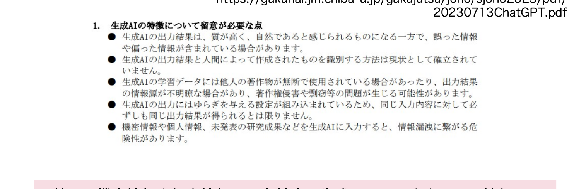

特に、<b>機密情報や個人情報の入力禁止</b>、生成AIにより出力された情報の著作権 (表現への類似性・依拠性)には留意が必要です。

---

③活用と対策の原則

# 千葉大学における生成AIの指針② (令和５年４月１２日)

https://gakunai.jm.chiba-u.jp/gakujutsu/joho/sjoho2023/pdf/20230713ChatGPT.pdf

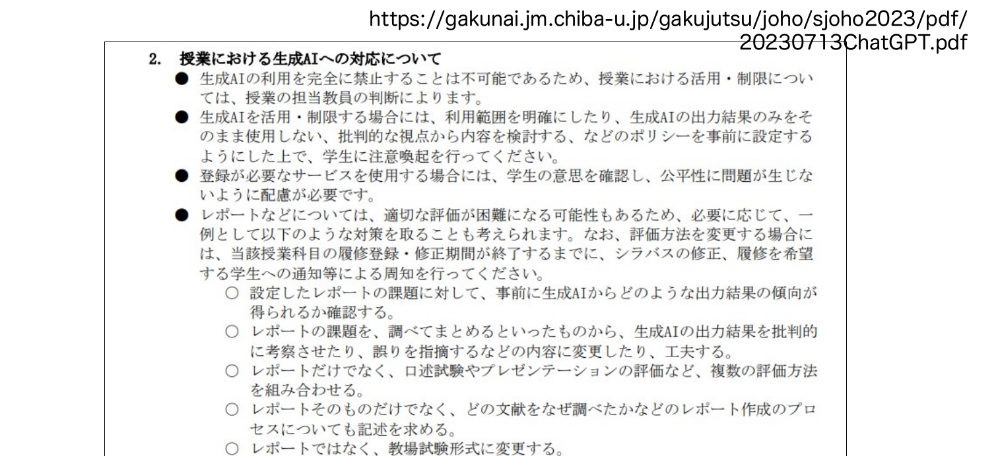

---

③活用と対策の原則

# (補足) 評価に関わる対策集 / 阪大FD (2024)

浦田・長岡・村上 (2024) <i>情報処理</i>

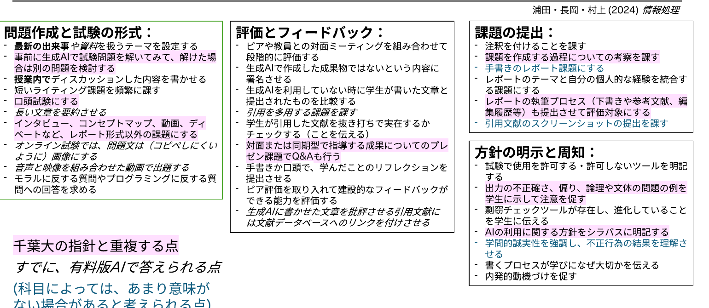

千葉大の指針と重複する点

すでに、有料版AIで答えられる点

---

③活用と対策の原則

# 制限/活用する上での「原則」 (Bowen &amp; Watson, AAC&amp;U 2024)

① <b>課題をAIに入れてみて、試す</b>

② <b>ポリシーを決める</b>

▶大学全体、授業全体、個別の課題での生成AI利用を定める ※ 使用の可否、使用内容/使用バージョンの記載等 ▶授業の目的・目標を鑑みて、AIの使用可否を説明する。

③ <b>不正行為のAI検出は不完全である</b>

▶採点対象の成果は、生成AIで直接出力不可のものにするか、生成AIの使用過程を含め、課題をデザインする ※記述式のテストは、測れる能力が限定される点に留意

④ <b>生成AI利用にあたるリテラシを共有する</b>

---

③活用と対策の原則

# 課題における記載例 (Bowen &amp; Watson, AAC&amp;U 2024)

記載例課題における自分のコントリビューションを説明する

- 私は友人、ツール、テクノロジー、AI の助けを一切借りずに、この作業を完全に自力で行った。 
- 最初のドラフトは自分で書いたが、その後、友人/ 家族/AI/ パラフレーズ/文法/剽窃ソフトウェアに読んでもらい、提案をもらった。この助けを受けた後、以下の変更を行った：

- スペルと文法の修正 - 構成や順序の変更

- 自分で作成した後、テクノロジーを使用して文全体や段落全体を書き直した。 
- 元となるアイデアを生成するためにAI/友人/チューターを使用した。 
- アウトライン/最初のドラフトを作成するためにAIを使用し、その後編集した。

<!-- メタな点：①ルーブリックでの採点やフィードバック支援はAIが可能になった -->

---

③活用と対策の原則

# 課題における記載例 (Bowen &amp; Watson, AAC&amp;U 2024)

ポリシー事前に授業における生成AI利用のポリシーを共有する

- AI の使用が許可または禁止されるのはいつか？なぜか？ 
- AI とのブレインストーミングはカンニングにあたるのか？ 
- AI がこのクラスで学習をどのように強化または妨げる可能性があるのか？ 
- AI が許可されている場合、学生は課題提出の一環として AI プロンプトを共有する必要があるのか？ 
- AI の使用はどのようにクレジットされるべきか？ 
- AI の限界に関する警告 
- AI 検出ツールの使用計画とその情報の使用方法に関する説明

<!-- メタな点：①ルーブリックでの採点やフィードバック支援はAIが可能になった -->

---

③活用と対策の原則

# 参考：課題における記載例 (Bowen &amp; Watson, AAC&amp;U 2024)

例事前に授業における生成AI利用のポリシーの例

このライティングコースの目標の一つは、効果的に書き、コミュニケーションをとる方法を学ぶことだ。これは練習が必要である。AIを使って迅速に生産することも期待されるが、<b>そもそも質の高い文章を自分で作成、編集し、認識する能力も必要</b>である。AIが自分を介さずに作業を行うことができる場合、それは雇用されるに値するスキルを持っていない、いうことになる。だから、練習しよう。 
それを達成するために、コースの前半では、AIのサポートは一切禁止する。この過程の苦労やもどかしさは、レベル上げ訓練のようなものと捉えてほしい。自分で作業を行う人が利益を得るのだ。 
一方、コースの後半では、特定の状況下でAIを使用することが許可される場合がある。AIの使用を認める必要がある。使用したプロンプトとその応答を提出するよう求める場合がある。 
AIリテラシーは重要な新しいスキルだ。Aiは「幻覚：事実のように見えるものを生成する可能性」があることに注意が必要である。この技術の利点と潜在的な危険性の両方について批判的に考える必要がある。 
あなたは依然として最終的な成果物およびAIからの制限やバイアスの可能性について責任を負う。このポリシーは必要に応じて変更する権利を留保する。

<!-- メタな点：①ルーブリックでの採点やフィードバック支援はAIが可能になった -->

---

③活用と対策の原則

# 参考：LLMを視覚的に体験し、リテラシを向上させる

LLM Visualization by Brendan Bycroft

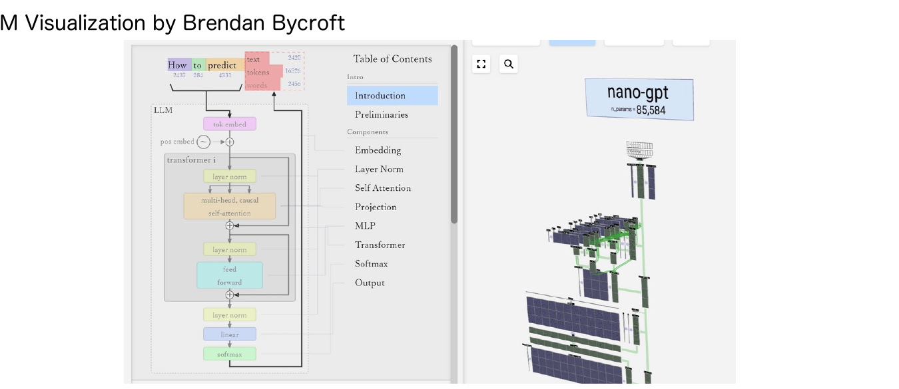

次のトークンを予想することで、回答を出すことを体験出来る

---

③活用と対策の原則

# アンケート 3

先生ご自身は、生成AIの授業利用/制限について、 
どんな「原則」を大切にされたいと考えますか？ 
ぜひ、チャットにて共有して下さい。

※ 触れた内容でも、他でも構いません。

例： 
　難しい問題はAIが支援を可能にする分、基礎力を徹底して鍛える授業にしたい。 
　生成AIを使われてしまいかねない課題は、生成AIに試しで入力してみる 
　課題をデザインする際に、生成AIを使用する部分を中間に設ける

※ 他の先生のコメントへの、返信もぜひ、お願い致します。

<!--
- アンケート3。先生ご自身が大切にしたい「原則」をチャットで共有してもらう。他の先生のコメントへの返信も歓迎。
-->

---

③活用と対策の原則

目的

指針等をもとに、生成AIを制限/活用する上での、 「原則」を考える。

内容

A. 利用/対策のポリシー、チェックシート

まずは、<b>千葉大のポリシー</b>をご参照下さい 
－　<b>活用</b>する場合 → <b>他大学のgood practice</b>をご参照いただき、授業のポリシーを設定下さい 
－　<b>対策</b>する場合 → 阪大の評価にかかる対策集や授業ポリシー例をご活用下さい

B. 利用/対策の原則

科目・分野による差が大きく、<b><u>一律の決定は難しい印象</u></b>です 
一方で、本日お話したように、方針やチェックすべき点は見出されつつあります 
本研修をもとに、先生方ご自身が、自らや授業での原則を形作って頂けますと、嬉しいです

<!--
- 目的：指針をもとに「原則」を考える。内容A：ポリシー・チェックシート（千葉大を起点に、活用なら他大good practice、対策なら阪大資料）。内容B：原則は一律には決めにくいが、方針は見出されつつある。
-->

---

まとめ

# 学習効果を損なわず、学修者の自律的な学びを支えるために

<b>Bloomの学修目標分類</b>

<table style="width:100%; border-collapse:collapse; font-size:21px;">
<tr style="background:var(--accent); color:#fff;">
<th style="border:1px solid #fff; padding:6px 10px; text-align:left;">認知的領域 (知識や思考)</th>
<th style="border:1px solid #fff; padding:6px 10px; text-align:left;">学びへの生成AIの影響</th>
<th style="border:1px solid #fff; padding:6px 10px; text-align:left;">現在の状況</th>
</tr>
<tr>
<td style="border:1px solid #ccc; padding:6px 10px;"><b>分析</b> (要素に分け、関係性を指摘できる)</td>
<td style="border:1px solid #ccc; padding:6px 10px;">解答/過程の支援可(例：要約・構造化・コーディング)</td>
<td style="border:1px solid #ccc; padding:6px 10px;">AIを利用することで、高度な課題が可能に</td>
</tr>
<tr style="background:var(--section-bg);">
<td style="border:1px solid #ccc; padding:6px 10px;"><b>応用</b> (他の場面や状況に使用できる)</td>
<td style="border:1px solid #ccc; padding:6px 10px;">単なる問題では、 AIが解いてしまう…</td>
<td style="border:1px solid #ccc; padding:6px 10px;">アウトプットが直接成績にならないよう注意</td>
</tr>
<tr>
<td style="border:1px solid #ccc; padding:6px 10px;"><b>理解</b> (学習内容を説明出来る)</td>
<td style="border:1px solid #ccc; padding:6px 10px;">説明/例示で支援可能 だが学修者の理解必須</td>
<td style="border:1px solid #ccc; padding:6px 10px;">生成AIが理解をインタラクティブに支援</td>
</tr>
</table>

- 理解の次元は、<b>持ち込みなしペーパーテスト等</b>で確認しやすいです。 
- 分析の次元は、学生のアウトプットが発表やレポート、口頭での試験となりやすく、<b>AIで単純に回答出来なくなります</b>。 
- 応用の次元は、生成AIが直接アウトプットを出さないように気をつけましょう。<b>高度な次元 (例：創造的なPBL等)の課題</b>を設定するのも手です。

<!--
- BloomのタクソノミーでAIの影響を整理。理解＝持ち込みなしテストで確認しやすい、分析＝発表/レポート/口頭でAIが単純に回答できない、応用＝AIが直接出力しないよう注意、高度な創造的PBL課題を設定するのも手。
-->

---

まとめ

<h1 style="font-size:34px; margin:0 0 6px;">今日の俯瞰図：AIを学びの設計に入れる / AIを対策する</h1>

学生

<table style="width:100%; border-collapse:collapse; font-size:18px; margin-bottom:4px;">
<tr style="background:var(--accent); color:#fff;">
<th style="border:1px solid #fff; padding:2px 7px; text-align:left; width:13%;">知識や思考</th>
<th style="border:1px solid #fff; padding:2px 7px; text-align:left;">生成AIの利用</th>
<th style="border:1px solid #fff; padding:2px 7px; text-align:left; width:30%;">使用可能なツール</th>
</tr>
<tr><td style="border:1px solid #ccc; padding:2px 7px;"><b>分析</b></td><td style="border:1px solid #ccc; padding:2px 7px;">情報を統合する/要約する/比較する</td><td style="border:1px solid #ccc; padding:2px 7px;">NotebookLM</td></tr>
<tr style="background:var(--section-bg);"><td style="border:1px solid #ccc; padding:2px 7px;"><b>応用</b></td><td style="border:1px solid #ccc; padding:2px 7px;">- 課題のデザインを考える</td><td style="border:1px solid #ccc; padding:2px 7px;"></td></tr>
<tr><td style="border:1px solid #ccc; padding:2px 7px;"><b>理解</b></td><td style="border:1px solid #ccc; padding:2px 7px;">AIを使って様々な角度から説明を受ける／授業に関する質問をAIに聞いてみる／授業の聞き逃しを要約する</td><td style="border:1px solid #ccc; padding:2px 7px;">NotebookLM/LearnLM／NotebookLM / ChatGPT等／Gemini</td></tr>
</table>

教員

<table class="pip-safe" style="width:100%; border-collapse:collapse; font-size:18px;">
<tr style="background:var(--accent-dark); color:#fff;">
<th style="border:1px solid #fff; padding:2px 7px; text-align:left; width:13%;">メタな部分</th>
<th style="border:1px solid #fff; padding:2px 7px; text-align:left;">生成AIの利用</th>
<th style="border:1px solid #fff; padding:2px 7px; text-align:left; width:30%;">使用可能なツール例</th>
</tr>
<tr><td style="border:1px solid #ccc; padding:2px 7px;"><b>指針</b> (ガイドライン)</td><td style="border:1px solid #ccc; padding:2px 7px;">千葉大の指針／使用までの推奨フローと禁止行為／(参考)文部科学省 初等中等向けガイドライン</td><td style="border:1px solid #ccc; padding:2px 7px;">リンク (要ログイン)／リンク</td></tr>
<tr style="background:var(--section-bg);"><td style="border:1px solid #ccc; padding:2px 7px;"><b>授業設計</b></td><td style="border:1px solid #ccc; padding:2px 7px;">タスクベースの教授方略 / 反転授業／PBL/アクティブラーニング</td><td style="border:1px solid #ccc; padding:2px 7px;">後ほど動画を公開</td></tr>
<tr><td style="border:1px solid #ccc; padding:2px 7px;"><b>問題作成</b></td><td style="border:1px solid #ccc; padding:2px 7px;">様々な形式問題を作成する</td><td style="border:1px solid #ccc; padding:2px 7px;">NotebookLM / LearnLM</td></tr>
<tr style="background:var(--section-bg);"><td style="border:1px solid #ccc; padding:2px 7px;"><b>採点</b></td><td style="border:1px solid #ccc; padding:2px 7px;">ルーブリックに基づく採点/フィードバック</td><td style="border:1px solid #ccc; padding:2px 7px;">NotebookLM / Claude 3.5</td></tr>
<tr><td style="border:1px solid #ccc; padding:2px 7px;"><b>他大学の例</b></td><td style="border:1px solid #ccc; padding:2px 7px;">グッド・プラクティス集</td><td style="border:1px solid #ccc; padding:2px 7px;">Yale / 阪大 / 横国 / 私大情協</td></tr>
</table>

<!--
- 今日の俯瞰図。学生は分析/応用/理解の各次元でAIをどう使うか、教員はメタな部分（指針・授業設計・問題作成・採点・他大学の例）でAIをどう使うかを一覧化。メタな点：①ルーブリックでの採点やフィードバック支援はAIが可能になった。
-->

---

補足

# SoTL / Good practice収集のお誘い

SoTL = Scholarship of Teaching and Learning (授業実践に係る研究) 
例：生成AIを使ったら成果物の質が上がった、学生の点数が上がった/下がった etc…

今後、<b>生成AIの利用における理学</b>と<b>学際分野の学修への影響を調査していきたい</b>と考えています。 
もし、<b>先生の授業で研究/AI関連の支援をさせて頂ける場合</b>には、ぜひお声掛け頂けませんでしょうか。理学の教育活動に、貢献できますと幸いです。

また、授業で生成AIを使用して見た結果など、グッドプラクティスを個人プロジェクトとして収集しています。インタビューや授業見学させて頂ける場合には、ぜひ、お知らせ下さい。

本日は、お時間を頂き、ありがとうございました。

それと、<b>複数の分野の知を使う学び/研究の加速</b>や、<b>大学院の研究支援</b>なども、可能では、、、と

<!--
- 補足。SoTL（授業実践研究）やgood practice収集のお誘い。理学・学際分野の学修へのAIの影響を調査したい。授業での支援・インタビュー・授業見学を歓迎。本日はありがとうございました。
-->

---

補足

# 本研修のアンケートのお願い

本研修の内容について、 
主に選択式で、3分程度で終わる、アンケートがございます。 
 
https://forms.gle/aXK5n2ojYu2SzoQ96 
 
差し支えなければ、今週中で構いませんので、ご回答頂けますと幸いです。

頂いた質問は、こちらにて解答致します (千葉大学 Google アカウントへのログインが必要です) 
<a href="https://docs.google.com/document/d/15iYeIOcIvbMgsydTFyBxJnvFKWMAoICJcXbLhNEMVJw/edit?usp=sharing" style="color:var(--tag-blue); font-size:18px; word-break:break-all;">https://docs.google.com/document/d/15iYeIOcIvbMgsydTFyBxJnvFKWMAoICJcXbLhNEMVJw/edit?usp=sharing</a>

<!--
- 本研修のアンケートのお願い。選択式3分程度。今週中で構わないので回答を。頂いた質問はGoogleドキュメント（千葉大アカウントでログイン）で解答。
-->

---

③活用と対策の原則

# 参考：AIリテラシ　OECD (2023)

AIの技術面を批判的に評価し、AIを効果的に活用できる能力 
(communicate and collaborate)

第１：AIの基本的な機能と日常生活におけるAIの使用方法に関する知識 
第２：様々な場面に応用することのできる能力 
第３：AIを実装し、評価することができる能力 
第４：アルゴリズムの開発に必要なデータを管理する能力とAIの出力結果を批判的に考察する能力

AIを理解し、活用し、監視し、批判的に考察できるスキル

各国でリスキリング/学校教育への取り込みが行われている

<b>内閣府(2024) 世界経済の潮流</b>＞第1章＞p.32

<!--
- 参考：OECD(2023)のAIリテラシ。4つの要素（基本機能と使用方法／応用力／実装・評価／データ管理と批判的考察）。各国でリスキリング・学校教育への取り込みが進む。出典は内閣府(2024)世界経済の潮流。
-->

---

① "教育×AI"領域の俯瞰

# 参考：職業への影響

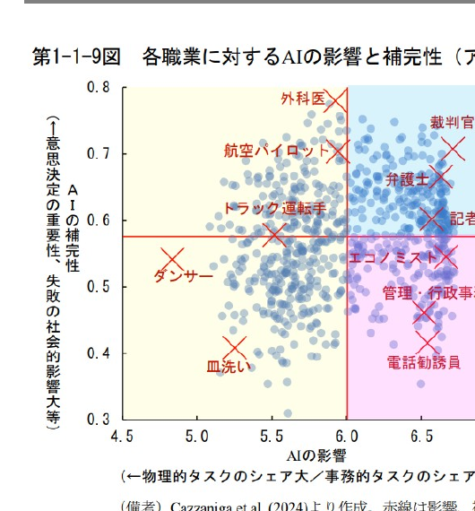

<b>AIの影響が大きく、代替性が高い職業：</b>事務的タスクのシェアが大きい職業。▶ つまり、AIがとって変わってしまう職業

<b>AIの影響が大きく、補完性が高い職業：</b>事務的タスクのシェアが大きいものの、意思決定の重要性が高く、AI任せとすることが社会的に望ましくない職業。▶ AIを使いこなす必要のある職業

<b>AIの影響の小さい職業：</b>物理的タスクのシェアが大きい職業。

※ 教員・研究者(自然科学系)は、青の領域

<b>内閣府(2024) 世界経済の潮流</b>＞第1章＞p.13

<!--
- 参考：職業へのAIの影響。代替性が高い（事務的＝置き換わる）／補完性が高い（意思決定が重要でAIを使いこなす）／影響が小さい（物理的タスク）。教員・研究者(自然科学系)は青の領域。出典は内閣府(2024)。
-->

---

参考：反転授業

# 参考：反転授業　参照

基礎知識に関する(メディア)学習を<b>事前に行い、その後の授業では議論・演習などを行うブレンド型の設計</b>

▶Stanfordの取組が有名 /学内でも医学部等でも<b>実践論文</b>あり

高度化型

- <b>高次目標</b>を演習や実験で

完全習得型

- <b>理解の確認や質問</b>を教室で

✔<b>アクティブラーニング</b>を取り入れ教育効果を高めやすい 
✔教員は多様な学生に対応しやすく、<b>効率化もしやすい</b> 
✔学生は疑問点や関心を持ち、<b>自己に最適な授業に臨める</b> 
✔授業時間の課題で評価するので、AIの影響を受けにくい/設計に取り入れやすい

<!--
- 参考：反転授業。基礎知識を事前学習し授業で議論・演習を行うブレンド型。Stanfordが有名、学内でも実践論文あり。高度化型／完全習得型。ALで教育効果を高め、効率化でき、学生は自己最適化、AIの影響も受けにくい。
-->

---

参考：最近接発達領域

# 参考：最近接発達領域　参照

<b>受講前は自力でできないが、課題を解いたら自力で出来るようになる</b>

<svg viewBox="0 0 380 260" xmlns="http://www.w3.org/2000/svg" style="width:100%;">
<ellipse cx="190" cy="130" rx="180" ry="120" fill="#FBE4EA" stroke="#CC003D" stroke-width="2"/>
<text x="190" y="34" text-anchor="middle" font-size="15" font-weight="800" fill="#8E0029">援助や協同があっても出来ない</text>
<ellipse cx="190" cy="148" rx="140" ry="92" fill="#FCEFDD" stroke="#E08A2B" stroke-width="2"/>
<text x="190" y="74" text-anchor="middle" font-size="15" font-weight="800" fill="#8a4b00">援助や協同があれば出来る</text>
<text x="190" y="94" text-anchor="middle" font-size="13" font-weight="800" fill="#8a4b00">（最近接発達領域）</text>
<ellipse cx="190" cy="170" rx="92" ry="58" fill="#EAF2FB" stroke="#1A6BB0" stroke-width="2"/>
<text x="190" y="172" text-anchor="middle" font-size="16" font-weight="800" fill="#15436e">自力で出来る</text>
</svg>

Vygotsky (1978)

<b>足場かけ (Scaffolding)：</b>他者の援助や協同で出来る状態にする

→ 最近接発達領域を広げたり、身につけたりする内容

<b>足場外し (Fading)：</b>他者の援助や協同を徐々に減らし独り立ち

→ 自力出来るようになる内容

<b>生成AIの活用を前提とすれば、よい本質的な課題に取り組む設計が出来る？</b>

<!--
- 参考：最近接発達領域（Vygotsky 1978）。自力でできる→援助があればできる（ZPD）→援助があってもできない、の三層。足場かけ(Scaffolding)で出来る状態にし、足場外し(Fading)で独り立ちさせる。AI活用前提なら本質的課題に取り組む設計ができる？
-->

---

参考：アクティブラーニングの有効性とAI

# 参考：アクティブラーニングの有効性とAI　参照

学部初歩の物理授業のテスト成績の分布図

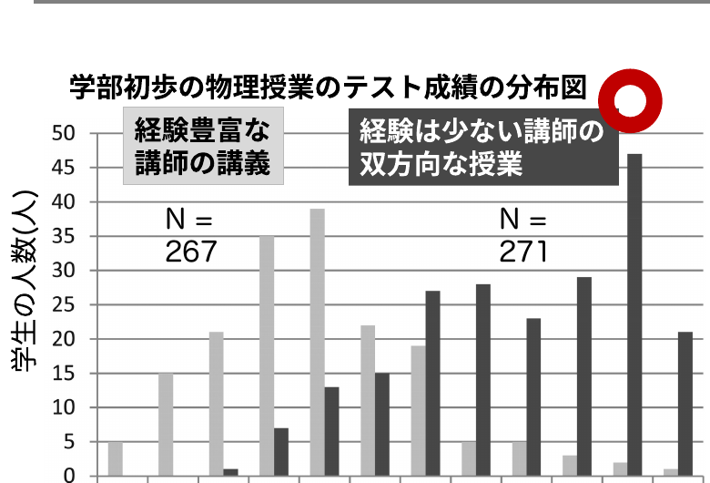

Deslauriers et al. (2011) <i>Science</i>

適切な講習を受け、双方向性・主体性のある学習を取り入れると、若い教員も良い授業ができる 
　→その支援にAIはならないか？

<b>注意：</b>アクティブラーニングすること自体が授業の目的ではない <b>(効果がない事例も多数)</b>

<!--
- 参考：ALの有効性（Deslauriers et al. 2011 Science）。経験豊富な講師の講義 vs 経験は少ない講師の双方向授業のテスト成績分布。適切な講習で双方向・主体性を取り入れれば若い教員も良い授業ができる→AIで支援できないか。注意：AL自体が目的ではない（効果がない事例も多数）。
-->

---

評価と目標の関係

# 評価の種類　参照

<svg viewBox="0 0 560 360" xmlns="http://www.w3.org/2000/svg" style="width:100%;">
<line x1="280" y1="20" x2="280" y2="340" stroke="#888" stroke-width="2"/>
<line x1="20" y1="180" x2="540" y2="180" stroke="#888" stroke-width="2"/>
<polygon points="280,12 274,26 286,26" fill="#888"/>
<polygon points="280,348 274,334 286,334" fill="#888"/>
<polygon points="12,180 26,174 26,186" fill="#888"/>
<polygon points="548,180 534,174 534,186" fill="#888"/>
<text x="290" y="20" font-size="15" font-weight="800" fill="#333">複雑</text>
<text x="290" y="350" font-size="15" font-weight="800" fill="#333">単純</text>
<text x="24" y="172" font-size="15" font-weight="800" fill="#333">筆記</text>
<text x="500" y="172" font-size="15" font-weight="800" fill="#333">実演</text>
<rect x="70" y="40" width="150" height="64" rx="8" fill="#FBE4EA" stroke="#CC003D" stroke-width="2"/>
<text x="145" y="68" text-anchor="middle" font-size="14" font-weight="800" fill="#8E0029">論述式問題</text>
<text x="145" y="88" text-anchor="middle" font-size="14" font-weight="800" fill="#8E0029">レポート</text>
<rect x="330" y="32" width="170" height="80" rx="8" fill="#FBE4EA" stroke="#CC003D" stroke-width="2.5"/>
<text x="415" y="62" text-anchor="middle" font-size="14" font-weight="800" fill="#8E0029">パフォーマンス課題</text>
<text x="415" y="84" text-anchor="middle" font-size="12" fill="#8E0029">(小論文、作品制作、発表等)</text>
<rect x="70" y="200" width="150" height="46" rx="8" fill="#EAF2FB" stroke="#1A6BB0" stroke-width="2"/>
<text x="145" y="228" text-anchor="middle" font-size="14" font-weight="800" fill="#15436e">記述式問題</text>
<rect x="70" y="262" width="150" height="46" rx="8" fill="#EAF2FB" stroke="#1A6BB0" stroke-width="2"/>
<text x="145" y="290" text-anchor="middle" font-size="14" font-weight="800" fill="#15436e">選択式問題</text>
<rect x="330" y="200" width="170" height="60" rx="8" fill="#FCEFDD" stroke="#E08A2B" stroke-width="2"/>
<text x="415" y="224" text-anchor="middle" font-size="13" font-weight="700" fill="#8a4b00">実技テスト</text>
<text x="415" y="246" text-anchor="middle" font-size="13" font-weight="700" fill="#8a4b00">面接/口頭試問</text>
<rect x="340" y="272" width="78" height="56" rx="8" fill="#FCEFDD" stroke="#E08A2B" stroke-width="2"/>
<text x="379" y="296" text-anchor="middle" font-size="13" font-weight="700" fill="#8a4b00">観察</text>
<text x="379" y="314" text-anchor="middle" font-size="13" font-weight="700" fill="#8a4b00">試験</text>
<rect x="430" y="272" width="78" height="56" rx="8" fill="#FCEFDD" stroke="#E08A2B" stroke-width="2"/>
<text x="469" y="296" text-anchor="middle" font-size="13" font-weight="700" fill="#8a4b00">心理</text>
<text x="469" y="314" text-anchor="middle" font-size="13" font-weight="700" fill="#8a4b00">テスト</text>
</svg>

田中耕治（2010）『<i>よくわかる教育評価</i>』を改変

<b>高次の目標を測りやすい</b>

組み合わせて測ることも<b>可</b>

<!--
- 評価の種類。縦軸＝単純/複雑、横軸＝筆記/実演の4象限。パフォーマンス課題（小論文・作品制作・発表）など高次の目標を測りやすい。組み合わせて測ることも可。田中耕治(2010)『よくわかる教育評価』を改変。
-->

---

ルーブリック

# ルーブリック　参照

✔<b>採点道具の一つ</b>で、課題を構成要素に分け、要素ごとに評価基準を満たすレベルを説明した表 ✔パフォーマンス課題・レポート・実技等の評価の可視化

<b>「課題内容</b>：6分模擬授業」を評価するためのルーブリック

評価 基準

評価尺度 ▶

<table style="font-size:21px; border-collapse:collapse; width:100%;">
<thead>
<tr style="background:var(--accent); color:#fff;">
<th style="padding:6px 10px; border:1px solid #ccc;">評価観点</th>
<th style="padding:6px 10px; border:1px solid #ccc;">素晴らしい(2)</th>
<th style="padding:6px 10px; border:1px solid #ccc;">合格(1)</th>
<th style="padding:6px 10px; border:1px solid #ccc;">不十分(0)</th>
</tr>
</thead>
<tbody>
<tr><td style="padding:6px 10px; border:1px solid #ccc; font-weight:800; color:var(--accent-dark);">分量</td><td style="padding:6px 10px; border:1px solid #ccc;"></td><td style="padding:6px 10px; border:1px solid #ccc;">6分間で丁度</td><td style="padding:6px 10px; border:1px solid #ccc;">過剰か少ない</td></tr>
<tr><td style="padding:6px 10px; border:1px solid #ccc; font-weight:800; color:var(--accent-dark);">目標</td><td style="padding:6px 10px; border:1px solid #ccc;">明確かつ内容が一致していた</td><td style="padding:6px 10px; border:1px solid #ccc;">明確さか内容の何れかに改善点</td><td style="padding:6px 10px; border:1px solid #ccc;">明確さ・内容の何れも不十分</td></tr>
<tr><td style="padding:6px 10px; border:1px solid #ccc; font-weight:800; color:var(--accent-dark);">レベル設定</td><td style="padding:6px 10px; border:1px solid #ccc;">手を伸ばせば届くレベルだった</td><td style="padding:6px 10px; border:1px solid #ccc;">一部高度・容易な箇所があった</td><td style="padding:6px 10px; border:1px solid #ccc;">極端に高度・容易であった</td></tr>
</tbody>
</table>

ルーブリックを設計し高次目標の課題も扱おう

栗田 &amp; 中村 (2024)『インタラクティブ・ティーチング 実践編３』／ スティーブンス &amp; レビ (2014)

---

②課題での利用例

# 参考：AIを活用する上で、私が気をつけていること

<b>① ループする/人力を入れる：</b>1回で正しい/求める答えは出ない

設計、PoCの双方で、AIと何度もやり取りしながら、求める形の結果になるまで整える。雛形が一回出来上がると、コンスタント化。

設計

⇄

PoC

⇒

運用

⇒

確認

<b>② 十分なコンテキストを与える：</b>

特に有料版の生成AIは、背景となる資料を与えた上でコンテキストを規定することで、的を射た形になる。

<b>③ 生成AIの答えを直接信用しない：</b>

出てきた解答を検証する。あるいは、選択する。例えば、1つの例を作るより、10個の例をAIが作って、正しいものを選ぶほうが早いし、きれい。

---

②課題での利用例

# 参考：ID(インストラクショナル・デザイン)の第一原理

<b>インストラクション</b>：学習を促進させるために行うことすべて

IDの第一原理

<table style="font-size:23px; border-collapse:collapse; width:100%; margin-top:2px;">
<thead>
<tr style="background:var(--accent); color:#fff;">
<th style="padding:5px 16px; border:1px solid #ccc; text-align:left;">5つの要件</th>
<th style="padding:5px 16px; border:1px solid #ccc; text-align:left;">説明</th>
</tr>
</thead>
<tbody>
<tr><td style="padding:5px 16px; border:1px solid #ccc; font-weight:800; color:var(--accent-dark);">①問題(Problem)</td><td style="padding:5px 16px; border:1px solid #ccc;">現実に起こりそうな問題に挑戦する</td></tr>
<tr><td style="padding:5px 16px; border:1px solid #ccc; font-weight:800; color:var(--accent-dark);">②活性化(Activation)</td><td style="padding:5px 16px; border:1px solid #ccc;">すでに知っている知識を動員する</td></tr>
<tr><td style="padding:5px 16px; border:1px solid #ccc; font-weight:800; color:var(--accent-dark);">③例示(Demonstration)</td><td style="padding:5px 16px; border:1px solid #ccc;">例示がある(Tell me でなく Show me)</td></tr>
<tr><td style="padding:5px 16px; border:1px solid #ccc; font-weight:800; color:var(--accent-dark);">④応用(Application)</td><td style="padding:5px 16px; border:1px solid #ccc;">応用するチャンスがある(Let me)</td></tr>
<tr><td style="padding:5px 16px; border:1px solid #ccc; font-weight:800; color:var(--accent-dark);">⑤統合(Integration)</td><td style="padding:5px 16px; border:1px solid #ccc;">現場で活用し、振り返るチャンスがある</td></tr>
</tbody>
</table>

鈴木克明 (2015)『研修設計マニュアル』北大路書房

---

②課題での利用例

# 参考：課題中心型の授業設計を行う背景にある問題意識

14世紀 @ ドイツ

Laurentius de Voltolina

現在？

Generated by DALL-E

<table style="font-size:19px; border-collapse:collapse; margin-left:auto;">
<thead><tr style="background:var(--accent); color:#fff;"><th style="padding:3px 8px; border:1px solid #ccc;"></th><th style="padding:3px 8px; border:1px solid #ccc;">認知的領域</th></tr></thead>
<tbody>
<tr><td style="padding:3px 8px; border:1px solid #ccc; font-weight:800;">高</td><td style="padding:3px 8px; border:1px solid #ccc;">創造</td></tr>
<tr><td style="padding:3px 8px; border:1px solid #ccc;"></td><td style="padding:3px 8px; border:1px solid #ccc;">評価</td></tr>
<tr><td style="padding:3px 8px; border:1px solid #ccc;"></td><td style="padding:3px 8px; border:1px solid #ccc;">分析</td></tr>
<tr><td style="padding:3px 8px; border:1px solid #ccc;"></td><td style="padding:3px 8px; border:1px solid #ccc;">応用</td></tr>
<tr><td style="padding:3px 8px; border:1px solid #ccc;"></td><td style="padding:3px 8px; border:1px solid #ccc;">理解</td></tr>
<tr><td style="padding:3px 8px; border:1px solid #ccc; font-weight:800;">低</td><td style="padding:3px 8px; border:1px solid #ccc;">記憶</td></tr>
</tbody>
</table>

<b>社会</b>も、<b>科学技術</b>も、<b>教育理論</b>も進歩　でも、<b>授業は同じまま</b>？

<b>座学の講義で理解を促すだけ</b>では、到達出来たり、授業中に試せたりする<b>目標の範囲が狭くなりがち</b>。そこで、<b>課題中心や実験中心など、「起こりそうな問題」や「実験」を設計の軸にする</b>ことで、より深く学べるようになるのでは？

---

Teaching with AI

# 参考：Teaching with AI

高等教育における、生成AI活用の事例・プロンプト集　(Bowen &amp; Watson, AAC&amp;U 2024)

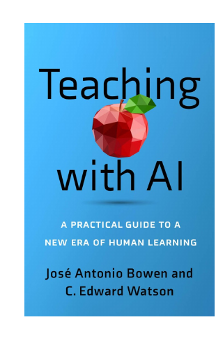

<b>授業での活用:</b> AIをリアルタイムの議論のサポートとして活用 AIを用いた模擬面接や役割演習の実施 AIを使った個別化された学習支援とフィードバック提供 クラスディスカッションでのAIの活用(例:反対意見の提示役として) 授業内での小テストやミニエッセイの実施

<b>評価方法:</b> ルーブリックを使用した評価 プロセスの評価(draftsの提出など) AIとの対話記録の提出と評価 個別化された評価基準の設定 即時フィードバックの提供

<b>課題設計:</b> 個人の経験や地域に基づいた課題の作成 プロセスを重視した段階的な課題設計 ピアレビューを組み込んだ課題 リアルタイムの出来事についての分析課題 フィールドワークやインタビューを含む課題 グループワークやコラボレーション課題 アノテーション(注釈付け)を活用した読解課題 マルチメディア(ビデオ、ポッドキャスト)を使用した課題

<b>特徴的な課題例:</b> AIを使って生成した文章の編集・改善 AIの出力に対する事実確認演習 異なる観客向けの文章作成練習 ケーススタディやテキストアドベンチャーゲームの作成 グラフィックノベルの制作 プレゼンテーションの準備と実施

AIを活用しながらも、人間の創造性や批判的思考を重視し、学習効果を高める

本一冊のユースケースについて要約を依頼し出力, 2024.11.21, Claude 3.5 Sonnet

---

Teaching with AI

# 参考：課題中心型の授業設計

<b>✗問題解決型</b>：現実の解決する形で設定するが、どのような学びや学問を使用するかは、明確にデザインされていない (スキル獲得を目指すもの)。

<b>◯課題中心型</b>：現実に起きそうな問題を、教員が小問 (道しるべ) や試行錯誤、ワークなど、使用する概念や獲得される学びを把握して、学習課程を設計する。

<b>方法</b>

①新しい全体的なタスクを見せる ②タスクに必要な構成要素を提示する ③タスクに関する構成要素を演示する ④もう一つ新しい全体タスクを見せる

⑤学修者に、既習の構成要素を新タスクに応用させる ⑥この新タスクに必要となる追加的な構成要素を提示する 　補足：追加部分は、AIに支援させるなども可能 ⑦これらの追加的な構成要素を演示する ⑧ステップ4~7を続くステップにも繰り返す

ブランチ・メリル (2013)

