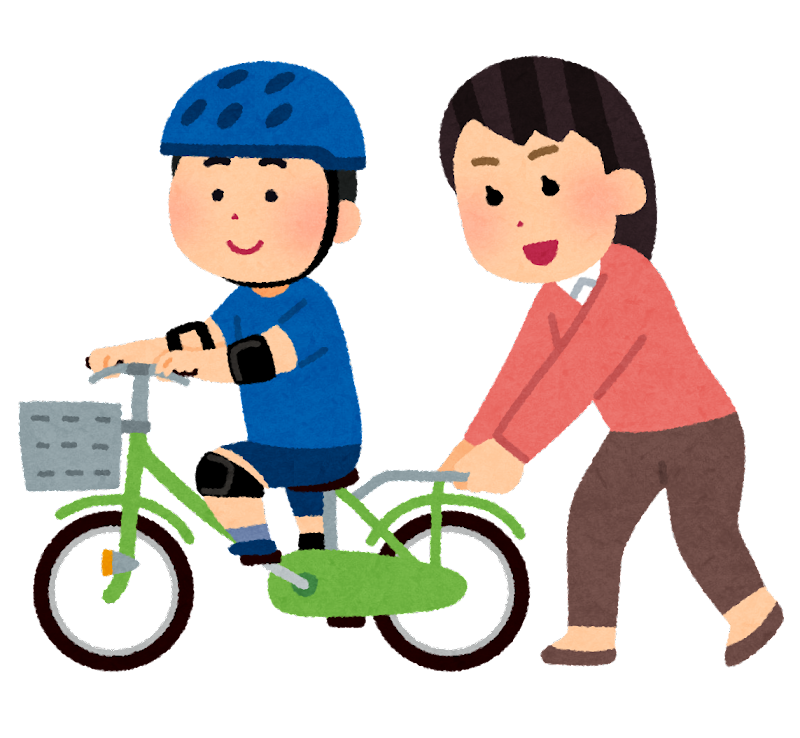
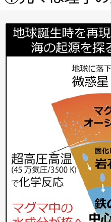
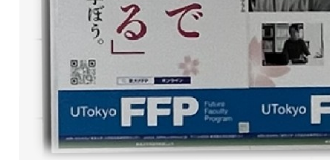
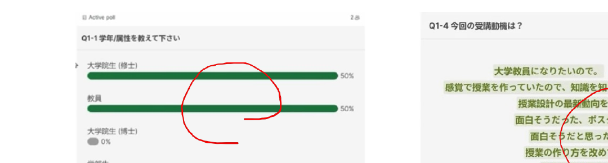
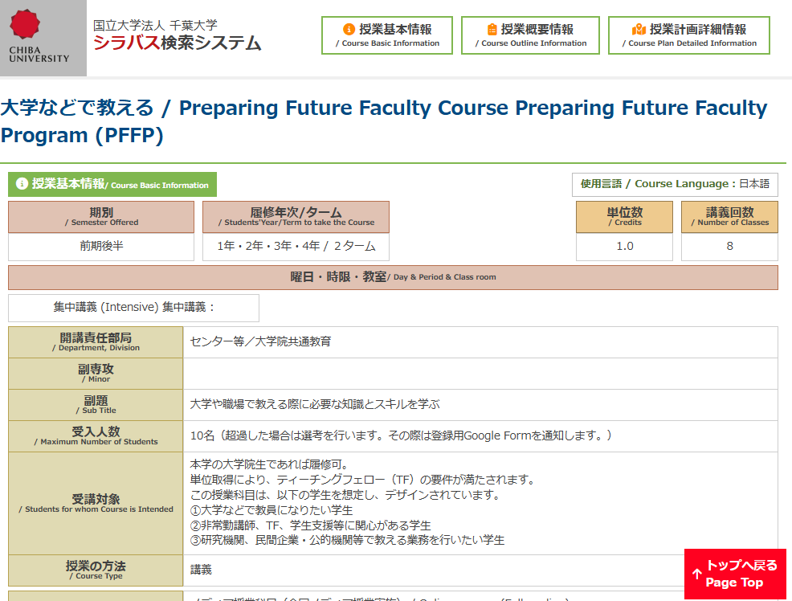
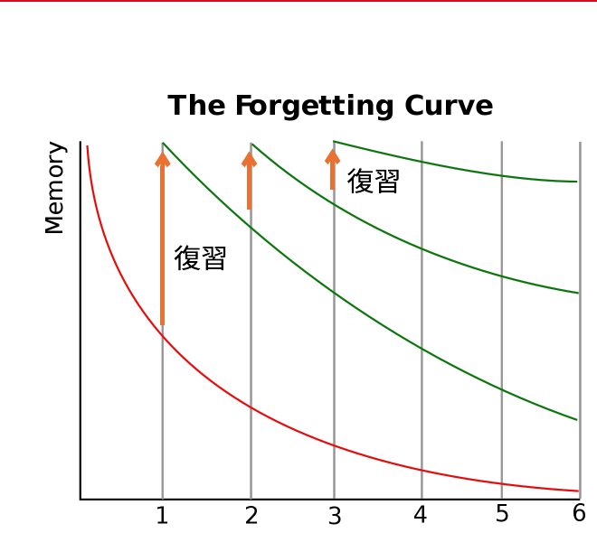
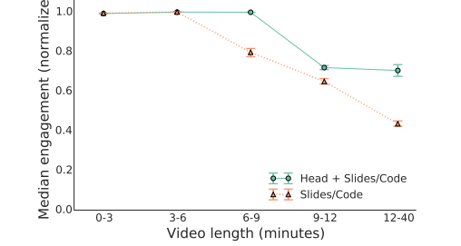
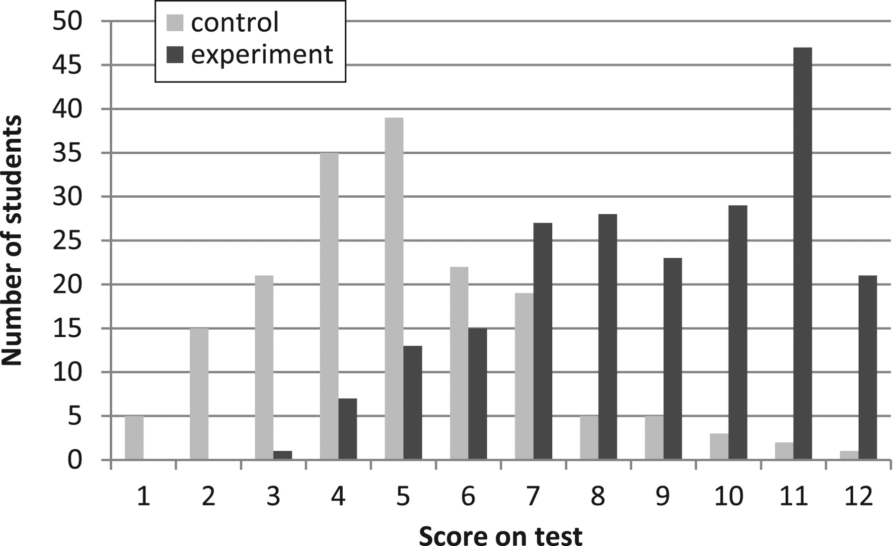
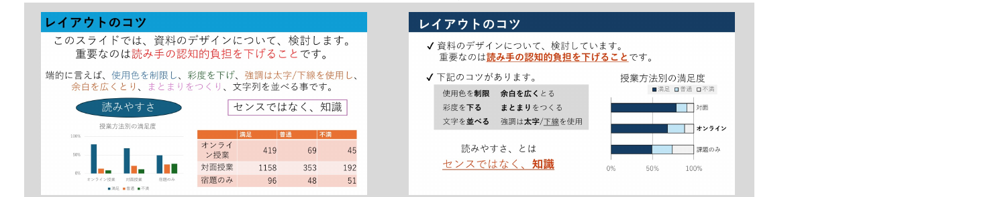
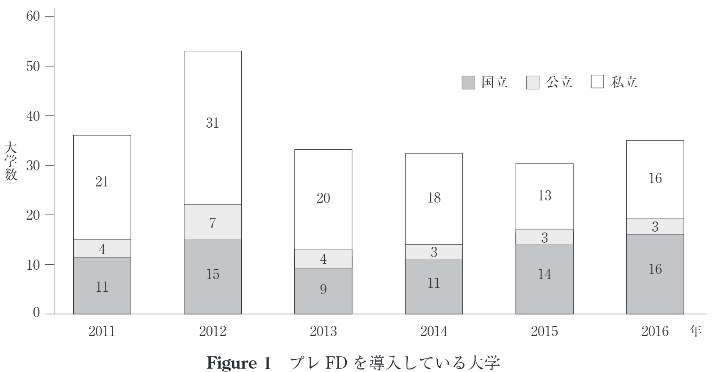

<!-- _class: cover-hero -->

初! 授業デザイン

はじめての 授業デザイン

教える前に知っておきたいあれこれ（設計編）

国際未来教育基幹　田川 翔

<!--
- 皆さん、こんにちは。「初めての授業デザインへ」、教える前に知っておきたいあれこれ、設計編へようこそ。
- 担当させていただきます。国際未来教育基幹の田川と申します。よろしくお願いします。
-->

---

初! 授業デザイン

# 今回のセッション

<b>Session 1</b>：「授業の担当となったら必要なこと」を理解する（コース分析・シラバス設計）

<b>Session 2</b>：逆向き設計を使いこなせ！（評価設計）

<b>Session 3</b>：【実習】目的・目標を書く（クラス設計）

<b>Session 4</b>：授業の準備を始める（教材開発）

1テーマ <b>15分間完結</b> 演習付き (動画の前の皆様もぜひ！)

<b>注意！</b> slidoは動きません リンクは一部動かないところがあります

<!--
- 大学院生になると非常勤講師などで教える機会が出てくる。突然授業をすることになっても困る人が多い。何から始めればいいか、シラバスや目標と言われてもどうすべきかわからない。
- そこで授業の目的目標の設定を軸に、初めて授業を受け持つ皆さまへ知っておくべきことを実践的にお伝えする時間。セッションは4つ。
- 1テーマ15分完結。演習もあるので動画の前の皆さまもぜひご自身で考えてみてほしい。
- 注意点：Slidoは今回動きません。リンクも一部動かないところがあります。
-->

---

今日のお土産

# 今日のお土産

① スキル

<ul>
<li>授業設計の流れが俯瞰できる。</li>
<li>目標・目的設定が出来るようになる。</li>
<li>教え方のTipsを得る。</li>
</ul>

② 1枚俯瞰シート

<ul>
<li>丸わかりシートをゲットできます。</li>
</ul>

③ AI用のプロンプト

<ul>
<li>目的・目標設計を支援してくれます。</li>
</ul>

<!--
- この授業で得られるものは3つ。①スキル：授業設計の流れが俯瞰でき、目的目標設計ができ、考え方のコツを得る。
- ②1枚俯瞰シート：今日聞いた内容が丸分かりになるシート。赤シートで隠して確認できるものも用意。
- ③AI用のプロンプト：目的目標設計を支援してくれるチャットボットを紹介。
-->

---

AIチャットボットの作り方

# チャットボットの作り方

GeminiでGemを開く

→

Gemを作成を押す

→

名前をつけてカスタム指示に添付

ここにシステムプロンプトを貼る

→

保存

目的と目標の作成を支援するチャットボットを作ることが出来る！ ※プロンプトは、EYRJページ内をご確認ください　(将来的に、アップデートする可能性があります。)

<!--
- Geminiを使った目標目的設定のための支援ツールをご自身で作れる。
- 作成手順：Geminiを開く → 左の「Gems」を表示 → 「Gemを作成」 → 名前を入力しシステムプロンプトを貼る。これだけで目的目標設定ボットが作れる。
- 演習で目的目標を書くとき、浮かばないときはぜひ活用してほしい。
-->

---

宣伝：大学などで教える

# 第二ターム開講！　大学などで教える

<b>実習</b>と<b>フィードバック</b>で伴走し、<b>実感出来る</b>授業

授業デザインの理論

<ul>
<li>コースデザイン</li>
<li>クラスデザイン</li>
<li>背景の理論</li>
<li>改善活動</li>
</ul>

体験と実践

<ul>
<li>シラバス作成</li>
<li>クラスデザインシート作成</li>
<li>6分模擬授業</li>
<li>教育への抱負</li>
</ul>

教員/TF リテラシ

<ul>
<li>大学制度</li>
<li>倫理/情報</li>
<li>著作権</li>
<li>キャリア</li>
</ul>

「使う」状態

→

「使える」状態

→

集大成

<b>教育が変わり 社会が変わる</b>

本年度担当：国際未来教育基幹 松本先生・田川

<!--
- この15ミニッツセッションは、大学院共通教育「大学などで教える」という第2タームの授業の出張版。実践とフィードバックで伴走しながら、大学で教える様々な感覚を身につける授業。
- コースデザインやクラスデザインが理解でき、教員やティーチングフェローのリテラシーも十分説明している。
- 補助輪で走っていたところから助走し、自分で走れるようになり、いつか他の人も押して走る感じに。授業を自走できるようになる体験。ご興味あればぜひ。
-->

---

講師紹介

# 田川 翔　たがわ しょう

<b>所属：</b>千葉大学 高等教育センター/アカデミックリンクセンター <b>大学教育を設計し、学生と教員を支援する仕事</b>

① 元々は理学の人

② 色々な経験

‐ 大学のICT支援 (コロナ禍) 
‐ AI×大学 
‐ 大規模オンライン授業の作成 
‐ 民間企業での経験

③ 人生を変えたプレFD

博士課程のときに、<b>大学での教え方</b>を授業で学んだ　→ 面白かった

<!--
- 自己紹介。田川と申します。所属は千葉大学高等教育センターやアカデミックリンクセンター。大学教育を設計し、学習と教育を支援する仕事。
- もともとは理学で地球科学。コロナのタイミングで卒業し、大学のオンライン授業をなんとかしたり、民間に出たり、いろいろやった。
- 人生を変えたのが博士課程の時に学んだ「大学での教え方」という授業。非常に面白く、その内容をもとに勉強して今こうした授業を受け持っている。
-->

---

<!-- _class: divider -->

SESSION 1

# 「授業の担当となったら 必要なこと」を理解する

## コース分析・シラバス設計

<!--
- では早速、最初のセッションに入っていきましょう。授業の担当となったら必要なことを理解する、コース分析・シラバス設計です。
-->

---

Session 1の目的・到達目標

# Session 1の目的・到達目標

<b>Session 1：</b>「授業の担当となったら必要なこと」を理解する（コース分析・シラバス設計）

目的

「授業の担当となったら必要なこと」を理解する（コース分析・シラバス設計）

目標

<b>ADDIEモデル</b>の構成を列記できる。

<b>目を配るべき各種情報・要件</b>を思い浮かべられる。

<b>授業設計の知識</b>はなぜ必要か表現する。

<!--
- セッション1の目標：ADDIEモデルの構成を列記できる、目を配るべき各種情報や要件を思い浮かべられる、授業設計の知識がなぜ必要か表現できる。この点を身につけてほしい。
-->

---

slidoへのアクセス依頼

# 授業インタラクティブ化ツール slido を使いました

機能

① その場アンケート

② 資料の配布

③ 質疑応答 (最後にまとめて実施予定)

<b>匿名で記入下さい</b> (名前の記入禁止)

※ オンデマンドで受けられた方は、アクセス出来ません。申し訳ございません。では、ここからは、<b>当日の様子でどうぞ！</b>

<!--
- オンデマンド動画を見ている皆さんには体験いただけないが、当日は授業インタラクティブ化ツールのSlidoを使った。リアルタイムアンケートや資料配布、ワードクラウドなどができる。
- 当日の様子を見ていただきながら、スライドも確認しつつ臨場感あふれる形で楽しんでほしい。ここからは当日の様子でどうぞ。
-->

---

申請者紹介

# Q1-1 学年/属性を教えて下さい

slido を用いたインタラクティブ設問（当日実施）。 The Slido app must be installed on every computer you're presenting from.

---

申請者紹介

# Q1-2 どんな分野？

slido を用いたインタラクティブ設問（当日実施）。 The Slido app must be installed on every computer you're presenting from.

---

申請者紹介

# Q1-3 授業担当経験

slido を用いたインタラクティブ設問（当日実施）。 The Slido app must be installed on every computer you're presenting from.

---

<!-- slide 13 -->

申請者紹介

Do not edit How to change the design

<svg viewBox="0 0 120 110" width="170" height="156" xmlns="http://www.w3.org/2000/svg" aria-label="word cloud">
<path d="M38 70 a20 20 0 1 1 6 -39 a16 16 0 0 1 30 4 a15 15 0 0 1 4 35 z" fill="#EEDCF3" stroke="#7A3B8F" stroke-width="6" stroke-linejoin="round"/>
<path d="M62 96 a13 13 0 1 1 4 -25 a10 10 0 0 1 19 3 a10 10 0 0 1 -1 22 z" fill="#fff" stroke="#7A3B8F" stroke-width="6" stroke-linejoin="round"/>
<path d="M34 30 a16 16 0 0 1 14 -8" fill="none" stroke="#7A3B8F" stroke-width="5" stroke-linecap="round"/>
</svg>

Q1-4　今回の受講動機は？

ⓘ The Slido app must be installed on every computer you’re presenting from

<!--
- Q1-4：今回の受講動機を、Slidoでその場アンケート。オンデマンド視聴者はアクセス不可。
-->

---

<!-- slide 14 -->

ADDIEモデル

# まずは、分析：学習者の把握・目的/目標設定から！

どこから、 はじめる？

<svg viewBox="0 0 360 330" width="360" height="330" xmlns="http://www.w3.org/2000/svg" aria-label="ADDIEサイクル図">
<defs><marker id="ah" markerWidth="9" markerHeight="9" refX="3" refY="4" orient="auto"><path d="M0 0 L8 4 L0 8 z" fill="#D98A92"/></marker></defs>
<circle cx="180" cy="170" r="120" fill="none" stroke="#E2A9AF" stroke-width="22" stroke-dasharray="556 130" stroke-dashoffset="40" transform="rotate(-90 180 170)" marker-end="url(#ah)"/>
<g font-size="22" font-weight="800" text-anchor="middle">
<rect x="120" y="34" width="120" height="44" rx="9" fill="#fff" stroke="#1E3A6E" stroke-width="2.5"/><text x="180" y="63" fill="#1E3A6E">分析</text>
<rect x="244" y="118" width="110" height="44" rx="9" fill="#fff" stroke="#1E3A6E" stroke-width="2.5"/><text x="299" y="147" fill="#1E3A6E">設計</text>
<rect x="218" y="252" width="110" height="44" rx="9" fill="#fff" stroke="#888" stroke-width="2.5"/><text x="273" y="281" fill="#444">開発</text>
<rect x="40" y="252" width="110" height="44" rx="9" fill="#fff" stroke="#888" stroke-width="2.5"/><text x="95" y="281" fill="#444">実施</text>
<rect x="2" y="118" width="120" height="44" rx="9" fill="#fff" stroke="#888" stroke-width="2.5"/><text x="62" y="147" fill="#444">授業評価</text>
</g>
<g font-size="15" fill="#666"><text x="246" y="92">Analysis</text><text x="300" y="184" text-anchor="middle">Design</text><text x="273" y="312" text-anchor="middle">Development</text><text x="95" y="312" text-anchor="middle">Implementation</text><text x="62" y="184" text-anchor="middle">Evaluation</text></g>
<text x="180" y="166" text-anchor="middle" font-size="16" font-weight="800" fill="#8a4b00">Close the LOOP!</text>
<text x="180" y="188" text-anchor="middle" font-size="16" font-weight="800" fill="#8a4b00">Be AGILE!</text>
</svg>

<b style="font-size:30px;">ADDIE モデル</b> 
<b>授業・教材設計のプロセス</b>を示したもの　(ガニエ他 2007)

授業の安全な実施法は、<b style="color:var(--accent-dark)">各ステップ</b>を展開すること 
授業を改善するとは、<b style="color:var(--accent-dark)">改善のサイクルを回す</b>こと

<!--
- まずは分析。学習者の把握・目的/目標設定から始める。
- ADDIEモデルは授業・教材設計のプロセス（分析→設計→開発→実施→授業評価）。各ステップを展開すれば安全に実施でき、ループを回せば改善できる。Close the LOOP! Be AGILE!
-->

---

<!-- slide 15 -->

ADDIEモデル

# ADDIEモデル　各ステップの中身

<table style="width:100%; border-collapse:separate; border-spacing:0 8px; font-size:23px;">
<tr>
<td style="width:130px; vertical-align:middle;">
分析
</td>
<td style="padding-left:18px;">① <b>授業運営のために必要な情報</b>を知る(内容 &amp; 学習者特性)。 ② <b>目的と目標</b>を絞り込む。</td>
</tr>
<tr>
<td style="vertical-align:middle;">
設計
</td>
<td style="padding-left:18px;">① 教える<b>内容の深さ・量</b>　② <b>伝える方法</b>・ワークデザイン ③ 構成(順番)・タイムライン</td>
</tr>
<tr>
<td style="vertical-align:middle;">
開発
</td>
<td style="padding-left:18px;">① スライド作成　② 参考資料、配布資料作成...</td>
</tr>
<tr>
<td style="vertical-align:middle;">
実施
</td>
<td style="padding-left:18px;">① <b>理解を確かめながら</b>、授業実施。　② デリバリー (伝え方・話し方)</td>
</tr>
<tr>
<td style="vertical-align:middle;">
授業評価
</td>
<td style="padding-left:18px;">① <b>授業評価アンケート等による評価</b>。　② 自己評価や他の教員からの評価。</td>
</tr>
</table>

<!--
- ADDIEの各ステップでやることを一覧に。分析＝情報収集と目的目標の絞り込み、設計＝内容・方法・構成、開発＝スライドや資料、実施＝理解確認とデリバリー、授業評価＝アンケートや自己他者評価。
-->

---

<!-- slide 16 -->

分析で重要な点

# 分析で重要な点

分析

① <b>授業運営のために必要な情報</b>を知る(内容 &amp; 学習者特性)。 ② 目的と目標を絞り込む。

授業運営のために必要な情報

何がある？

例：内容、学習者特性

授業運営のために必要な知識

例：法令などの要対応事項

<!--
- 分析で重要なのは、まず授業運営に必要な「情報」を知ること。何がある？と問いかけ、例として内容・学習者特性。さらに必要な「知識」として、法令などの要対応事項がある。
-->

---

<!-- slide 17 -->

申請者紹介

Do not edit How to change the design

<svg viewBox="0 0 120 110" width="170" height="156" xmlns="http://www.w3.org/2000/svg" aria-label="word cloud">
<path d="M38 70 a20 20 0 1 1 6 -39 a16 16 0 0 1 30 4 a15 15 0 0 1 4 35 z" fill="#EEDCF3" stroke="#7A3B8F" stroke-width="6" stroke-linejoin="round"/>
<path d="M62 96 a13 13 0 1 1 4 -25 a10 10 0 0 1 19 3 a10 10 0 0 1 -1 22 z" fill="#fff" stroke="#7A3B8F" stroke-width="6" stroke-linejoin="round"/>
<path d="M34 30 a16 16 0 0 1 14 -8" fill="none" stroke="#7A3B8F" stroke-width="5" stroke-linecap="round"/>
</svg>

Q1-5　必要な情報・知識を書き出してみる (1 min)

ⓘ The Slido app must be installed on every computer you’re presenting from

<!--
- Q1-5：必要な情報・知識を1分で書き出す演習。動画の前の皆さんもぜひ考えてみてください。
-->

---

<!-- slide 18 -->

分析で重要な点

# 分析で重要な点

分析

① <b>授業運営のために必要な情報</b>を知る(内容 &amp; 学習者特性)。 ② 目的と目標を絞り込む。

授業運営のために必要な情報

<b>内容：</b>　教え方、<b>既習・未習(CM)・位置付け</b>、前任教員の知見 
<b>環境：</b>　授業方法、<b>システム</b>、教室の形式・機材、受講者数、時期 
<b>文脈：</b>　<b>学校の文化 (理念/CP/DP)</b>、学習者のレベルや受講動機 
<b>ロジ：</b>　締切/<b>要件</b>(シラバス・成績等)、連絡先、相談先、<b>配慮</b>

授業運営のために必要な知識

<b>法令：</b>　個人情報保護、著作権、シラバス (授業設計)、オンライン

詳細は「大学などで教える」 or シラバスチェックで！

<!--
- 必要な「情報」を内容・環境・文脈・ロジの4観点で具体化。必要な「知識」は法令（個人情報保護、著作権、シラバス、オンライン）。詳細は授業「大学などで教える」やシラバスチェックで。
-->

---

<!-- slide 19 -->

シラバス

# シラバス分析設計

<b>シラバス = 各授業科目の詳細な授業計画。</b>

大学の授業名、担当教員名、講義目的、各回ごとの授業内容、成績評価方法・基準、準備学修等についての具体的な指示、教科書・参考文献、履修条件等が記されており、<b style="color:var(--accent-dark)">学生が各授業科目の準備学修等を進めるための基本となるもの。</b>

<b>大学設置基準 （成績評価基準等の明示等）</b> 
第二十五条の二　大学は、学生に対して、<b>授業の方法及び内容並びに一年間の授業の計画をあらかじめ明示する</b>ものとする。 
２　大学は、<b>学修の成果に係る評価及び卒業の認定に当たつては、客観性及び厳格性を確保するため、学生に対してその基準をあらかじめ明示するとともに、当該基準にしたがつて適切に行う</b>ものとする。

<b>教学マネジメント指針（中教審 / 2020）</b>　学生と教員の共通理解の基盤及び成績評価の基点としてシラバスの重要性を強調

<!--
- シラバスは各授業科目の詳細な授業計画。授業名・担当・目的・各回内容・評価基準・準備学修の指示・教科書・履修条件等を記し、学生の準備学修の基本となる。
- 大学設置基準第二十五条の二で明示が義務化。教学マネジメント指針（中教審2020）もシラバスの重要性を強調。
-->

---

<!-- slide 20 -->

シラバス

# シラバスを作ることで授業の 分析 が 設計 に乗る

学生

<b>学修を促すツール</b>として

両者にとって… <b>約束事</b>(評価/態度等)として

<b>コースデザイン</b>に役立つ目標に応じたデザイン 
<b>カリキュラムの整合性</b>の確認　DP、CP、AP 
<b>教育力を示す資料</b>として

教員

シラバス作成は、学習者・教員の双方に役立つ

<!--
- シラバスを作ると、授業の「分析」が「設計」に乗る。学生にとっては学修を促すツール、両者にとっては約束事、教員にとってはコースデザイン・カリキュラム整合性の確認・教育力を示す資料。学習者・教員の双方に役立つ。
-->

---

<!-- slide 21 -->

申請者紹介

Do not edit How to change the design

<svg viewBox="0 0 120 110" width="170" height="156" xmlns="http://www.w3.org/2000/svg" aria-label="word cloud">
<path d="M38 70 a20 20 0 1 1 6 -39 a16 16 0 0 1 30 4 a15 15 0 0 1 4 35 z" fill="#EEDCF3" stroke="#7A3B8F" stroke-width="6" stroke-linejoin="round"/>
<path d="M62 96 a13 13 0 1 1 4 -25 a10 10 0 0 1 19 3 a10 10 0 0 1 -1 22 z" fill="#fff" stroke="#7A3B8F" stroke-width="6" stroke-linejoin="round"/>
<path d="M34 30 a16 16 0 0 1 14 -8" fill="none" stroke="#7A3B8F" stroke-width="5" stroke-linecap="round"/>
</svg>

Q1-6　授業設計の知識はなぜ必要

ⓘ The Slido app must be installed on every computer you’re presenting from

<!--
- Q1-6：授業設計の知識はなぜ必要か。受講者に表現してもらう。セッション1の目標の一つ。
-->

---

<!-- slide 22 -->

Session 1の目的・到達目標

# Session 1 振り返り

目的

目標 ＋ まとめ

<b>Session 1：</b> 　「授業の担当となったら必要なこと」を理解する（コース分析・シラバス設計）

<b>ADDIEモデルの構成</b>を列記できる。 
分析→設計→開発→実施→授業評価→分析… ／ Loopさせる 
<b>目を配るべき各種情報</b>・要件を思い浮かべられる。 
最も印象深かったものは…？ 
<b>授業設計の知識はなぜ必要か</b>表現する。

<!--
- セッション1の振り返り。目的＝「授業の担当となったら必要なこと」を理解する。目標：ADDIEモデルの構成を列記できる（分析→設計→開発→実施→授業評価をループ）、目を配るべき情報・要件を思い浮かべられる、授業設計の知識がなぜ必要か表現できる。
-->

---

<!-- slide 23 -->

申請者紹介

Do not edit How to change the design

<svg viewBox="0 0 110 100" width="170" height="155" xmlns="http://www.w3.org/2000/svg" aria-label="audience Q and A">
<path d="M26 28 h60 a10 10 0 0 1 10 10 v30 a10 10 0 0 1 -10 10 h-34 l-16 14 v-14 h-10 a10 10 0 0 1 -10 -10 v-30 a10 10 0 0 1 10 -10 z" fill="#FBE4EA" stroke="#B0182B" stroke-width="6" stroke-linejoin="round"/>
<circle cx="40" cy="53" r="5" fill="#B0182B"/>
<circle cx="56" cy="53" r="5" fill="#B0182B"/>
<circle cx="72" cy="53" r="5" fill="#B0182B"/>
<path d="M22 24 a10 10 0 0 0 -10 10 v22" fill="none" stroke="#B0182B" stroke-width="6" stroke-linecap="round"/>
</svg>

Audience Q&amp;A

ⓘ The Slido app must be installed on every computer you’re presenting from

<!--
- セッション1の質疑応答。Slidoで受け付けた質問に回答（後でまとめて実施予定）。
-->

---

<!-- slide 24 -->

<!-- _class: divider -->

SESSION 2

# 逆向き設計を使いこなせ！ （評価設計）

## はじめての授業デザイン　教える前に知っておきたいあれこれ（設計編）　／　国際未来教育基幹　田川 翔

<!--
- セッション2に入ります。逆向き設計を使いこなせ！評価設計の回です。
-->

---

Session 2の目的・到達目標

<b>Session 2：</b> 逆向き設計を使いこなせ！（評価設計）

目的

<b>逆向き設計</b>を使いこなせ！（評価設計）

目標

<b>なぜ評価するのか、</b>を受け入れる。 
<b>どのように測るのか、</b>を選択できる。 
<b>逆向き設計</b>を説明できる。

<!--
- セッション2の目標として、以下があります。
- なぜ評価するのか、を受け入れる / どのように測るのか、を選択できる / 逆向き設計を説明できる。
- この点を皆さん、身につけていただければなと思います。
-->

---

講師紹介

# 田川　翔

たがわ　しょう

<b>所属：</b>千葉大学 高等教育センター/アカデミックリンクセンター 
大学教育を設計し、学生と教員を支援する仕事

第2ターム 大学院共通教育 「大学などで教える」 開講中！

<!--
- 改めて、私の自己紹介です。田川と申します。
- 所属は千葉大学高等教育センターやアカデミックリンクセンターというところで、大学教育を設計し、学生と教員を支援する仕事を行っております。
- 第2タームの大学院共通教育「大学などで教える」も開講中です。
-->

---

申請者紹介

# Q2-1　どの順番で組み立てる？

<b>slido</b> で回答を募集します（当日のインタラクティブ化ツール）。 逆向き設計に入る前に、皆さんの直感をうかがいます。

※ オンデマンドで受けられた方は、slido にアクセス出来ません。申し訳ございません。

<!--
- ここで一度、皆さんに問いかけます。授業はどの順番で組み立てるのが良いでしょうか。
- 当日はslidoで回答を募集しました。
-->

---

これだけ覚えて下さい

# 逆向き設計(backward design)設計

① 求められている結果を明確にする <b>（目的・目標）</b>

② 承認できる証拠を決定する <b>（評価方法）</b>

③ 学習経験と指導を計画する <b>（内容）</b>

(この順番 or 三位一体)

なんで「逆向き」?

指導後に考えられがちな<b>評価方法を指導の前に</b>る点，単元末・学年末・卒業時といった<b>最終的な結果から遡って教育を設計する</b>点から。

Wiggins &amp; McTighe (1998)；西岡 (2005)；西岡 (2015)

<!--
- これだけは覚えて下さい。逆向き設計です。
- ①求められている結果を明確にする（目的・目標）、②承認できる証拠を決定する（評価方法）、③学習経験と指導を計画する（内容）。
- なんで「逆向き」かというと、指導後に考えられがちな評価方法を指導の前に置く点、最終的な結果から遡って設計する点からです。
-->

---

目的とはなにか

# 授業の目的 ＝ 授業の存在意義

学習者の 
<b style="font-size:30px;">「Why? なぜこれを学ぶ必要があるのか？」</b> 
に対する答え

目的
→
目標
＋
目標

<!--
- 目的とはなにか。授業の目的とは、授業の存在意義です。
- 学習者の「Why? なぜこれを学ぶ必要があるのか？」に対する答えですね。
- この目的から、複数の目標へとブレイクダウンしていきます。
-->

---

目標とはなにか

# 目標とはなにか

<b>目標</b>：終了後に学習者にできるようになって欲しい<b>能力</b> 
(Goal, Learning outcomes)

授業の結果、学習者が何を学び、何ができるようになっているのか。

授業
→
できるようになる

<!--
- 目標とはなにか。終了後に学習者にできるようになって欲しい能力のことです。Goal、Learning outcomesですね。
- 授業の結果、学習者が何を学び、何ができるようになっているのか、を表します。
-->

---

目標とはなにか

# 目標とはなにか

<b>目標</b>：終了後に学習者にできるようになって欲しい<b>能力</b> 
(Goal, Learning outcomes)

① 目的を<b>具体化</b>したもの

② <b>学生の自学自習</b>に役立つ

③ <b>評価項目</b>と一致させる

Before
―<b style="color:var(--accent);">差分：評価</b>→
劇的 After

<!--
- 目標についてもう少し。①目的を具体化したもの、②学生の自学自習に役立つ、③評価項目と一致させる、という3点が大切です。
- BeforeとAfterの差分こそが、評価の対象になります。
-->

---

申請者紹介

# Q2-2　なぜ評価するのでしょうか？

<b>slido</b> で皆さんの考えをうかがいます。 「なぜ評価するのか」――まずは直感でお答えください。

※ オンデマンドで受けられた方は、slido にアクセス出来ません。申し訳ございません。

<!--
- 改めて問いかけます。なぜ評価するのでしょうか。
- これも当日はslidoで皆さんに答えていただきました。
-->

---

評価の価値

# 評価の価値

良い成績を取れる人を見分けるため？　<b>否。受験パラダイムは忘れて下さい。</b>

学修者・教員を支援するため

支援

教員：授業を<b>改善</b>するため

教員：<b>理解度を確認</b>し支援するため

学修者：<b>目標到達度</b>に基づく主体的な学びのため

学修の質を保証をするため (成績) <b>→ DP</b>　／　学びに繋がる”評価”・フィードバックを目指す

<!--
- 評価の価値です。良い成績を取れる人を見分けるため？ いいえ、受験パラダイムは忘れて下さい。
- 評価は、学修者・教員を支援するために行います。
- 教員にとっては授業改善や理解度確認、学修者にとっては目標到達度に基づく主体的な学びのため。
- 最終的には、学びに繋がる評価・フィードバックを目指します。
-->

---

申請者紹介

# Q2-3　評価によって計測出来るものは変化するか？

<b>slido</b> で皆さんの考えをうかがいます。 評価方法を変えると、測れる能力も変わるのでしょうか？

※ オンデマンドで受けられた方は、slido にアクセス出来ません。申し訳ございません。

<!--
- 評価によって計測出来るものは変化するか、という問いです。
- 評価方法によって、測れる能力の幅が変わってきます。次のスライドで見ていきましょう。
-->

---

様々な評価手法

# 方法上の区分

<svg viewBox="0 0 560 470" width="560" xmlns="http://www.w3.org/2000/svg">
<defs>
<linearGradient id="arr" x1="0" y1="1" x2="1" y2="0">
<stop offset="0" stop-color="#FBE4EA"/><stop offset="1" stop-color="#CC003D"/>
</linearGradient>
<marker id="ah" markerWidth="10" markerHeight="10" refX="7" refY="5" orient="auto"><path d="M0,0 L10,5 L0,10 z" fill="#888"/></marker>
<marker id="ahb" markerWidth="14" markerHeight="14" refX="9" refY="7" orient="auto"><path d="M0,0 L14,7 L0,14 z" fill="#CC003D"/></marker>
</defs>
<line x1="280" y1="40" x2="280" y2="430" stroke="#888" stroke-width="4" marker-start="url(#ah)" marker-end="url(#ah)"/>
<line x1="40" y1="235" x2="540" y2="235" stroke="#888" stroke-width="4" marker-start="url(#ah)" marker-end="url(#ah)"/>
<line x1="200" y1="380" x2="430" y2="120" stroke="url(#arr)" stroke-width="34" stroke-linecap="round" marker-end="url(#ahb)" opacity="0.85"/>
<text x="280" y="26" text-anchor="middle" font-size="26" font-weight="800">複雑</text>
<text x="280" y="462" text-anchor="middle" font-size="26" font-weight="800">単純</text>
<text x="20" y="270" font-size="26" font-weight="800">筆記</text>
<text x="500" y="270" font-size="26" font-weight="800">実演</text>
<rect x="40" y="60" width="370" height="80" rx="6" fill="#FBE4EA" stroke="#CC003D" stroke-width="3"/>
<text x="225" y="92" text-anchor="middle" font-size="25" font-weight="800">パフォーマンス課題</text>
<text x="225" y="124" text-anchor="middle" font-size="20">(小論文、作品制作、発表等)</text>
<rect x="55" y="160" width="170" height="74" rx="5" fill="#fff" stroke="#E08A2B" stroke-width="3"/>
<text x="140" y="190" text-anchor="middle" font-size="22">論述式問題</text>
<text x="140" y="218" text-anchor="middle" font-size="22">レポート</text>
<rect x="305" y="160" width="190" height="74" rx="5" fill="#fff" stroke="#E08A2B" stroke-width="3"/>
<text x="400" y="190" text-anchor="middle" font-size="22">実技テスト</text>
<text x="400" y="218" text-anchor="middle" font-size="22">面接/口頭試問</text>
<rect x="70" y="252" width="140" height="74" rx="5" fill="#fff" stroke="#E08A2B" stroke-width="3"/>
<text x="140" y="282" text-anchor="middle" font-size="22">記述式</text>
<text x="140" y="310" text-anchor="middle" font-size="22">問題</text>
<rect x="345" y="252" width="130" height="74" rx="5" fill="#fff" stroke="#E08A2B" stroke-width="3"/>
<text x="410" y="282" text-anchor="middle" font-size="22">観察</text>
<text x="410" y="310" text-anchor="middle" font-size="22">試験</text>
<rect x="70" y="344" width="140" height="74" rx="5" fill="#fff" stroke="#E08A2B" stroke-width="3"/>
<text x="140" y="374" text-anchor="middle" font-size="22">選択式</text>
<text x="140" y="402" text-anchor="middle" font-size="22">問題</text>
<rect x="305" y="344" width="120" height="74" rx="5" fill="#fff" stroke="#888" stroke-width="2.5"/>
<text x="365" y="374" text-anchor="middle" font-size="22">心理</text>
<text x="365" y="402" text-anchor="middle" font-size="22">テスト</text>
</svg>

<b>高次</b>の目標を測りやすい

<u>組み合わせて測ることも<b>可</b></u>

田中耕治（2010）『<i>よくわかる教育評価</i>』(ミネルヴァ書房)を改変

<!--
- 様々な評価手法があります。方法上の区分として、横軸に筆記と実演、縦軸に単純と複雑をとります。
- 右上に行くほど、つまりパフォーマンス課題のような複雑・実演型ほど、高次の目標を測りやすくなります。
- これらは組み合わせて測ることも可能です。
- 田中耕治先生の「よくわかる教育評価」を改変しています。
-->

---

様々な評価手法

# 評価できる能力

<table style="border-collapse:collapse; font-size:21px; flex:1;">
<thead>
<tr style="background:var(--accent-soft);">
<th style="border:1px solid #ccc; padding:5px 10px;"></th>
<th style="border:1px solid #ccc; padding:5px 10px;">知識</th>
<th style="border:1px solid #ccc; padding:5px 10px;">思考</th>
<th style="border:1px solid #ccc; padding:5px 10px;">技能</th>
<th style="border:1px solid #ccc; padding:5px 10px;">態度</th>
</tr>
</thead>
<tbody>
<tr><td style="border:1px solid #ccc; padding:4px 10px; font-weight:700;">客観試験</td><td style="border:1px solid #ccc; padding:4px 10px; text-align:center;">◎(低次)</td><td style="border:1px solid #ccc; padding:4px 10px; text-align:center;">◯</td><td style="border:1px solid #ccc; padding:4px 10px;"></td><td style="border:1px solid #ccc; padding:4px 10px;"></td></tr>
<tr><td style="border:1px solid #ccc; padding:4px 10px; font-weight:700;">論述試験</td><td style="border:1px solid #ccc; padding:4px 10px; text-align:center;">◯(高次)</td><td style="border:1px solid #ccc; padding:4px 10px; text-align:center;">◎</td><td style="border:1px solid #ccc; padding:4px 10px;"></td><td style="border:1px solid #ccc; padding:4px 10px;"></td></tr>
<tr><td style="border:1px solid #ccc; padding:4px 10px; font-weight:700;">レポート</td><td style="border:1px solid #ccc; padding:4px 10px; text-align:center;">◯(高次)</td><td style="border:1px solid #ccc; padding:4px 10px; text-align:center;">◎</td><td style="border:1px solid #ccc; padding:4px 10px; text-align:center;">◯</td><td style="border:1px solid #ccc; padding:4px 10px; text-align:center;">◎</td></tr>
<tr><td style="border:1px solid #ccc; padding:4px 10px; font-weight:700;">発表</td><td style="border:1px solid #ccc; padding:4px 10px; text-align:center;">◯(高次)</td><td style="border:1px solid #ccc; padding:4px 10px; text-align:center;">◯</td><td style="border:1px solid #ccc; padding:4px 10px; text-align:center;">◯</td><td style="border:1px solid #ccc; padding:4px 10px; text-align:center;">◯</td></tr>
<tr><td style="border:1px solid #ccc; padding:4px 10px; font-weight:700;">口述/面接</td><td style="border:1px solid #ccc; padding:4px 10px; text-align:center;">◎</td><td style="border:1px solid #ccc; padding:4px 10px; text-align:center;">◎</td><td style="border:1px solid #ccc; padding:4px 10px;"></td><td style="border:1px solid #ccc; padding:4px 10px; text-align:center;">◯</td></tr>
<tr><td style="border:1px solid #ccc; padding:4px 10px; font-weight:700;">観察評価</td><td style="border:1px solid #ccc; padding:4px 10px; text-align:center;">◯</td><td style="border:1px solid #ccc; padding:4px 10px; text-align:center;">◯</td><td style="border:1px solid #ccc; padding:4px 10px; text-align:center;">◎</td><td style="border:1px solid #ccc; padding:4px 10px; text-align:center;">◯</td></tr>
<tr><td style="border:1px solid #ccc; padding:4px 10px; font-weight:700;">実演・制作</td><td style="border:1px solid #ccc; padding:4px 10px;"></td><td style="border:1px solid #ccc; padding:4px 10px;"></td><td style="border:1px solid #ccc; padding:4px 10px; text-align:center;">◎</td><td style="border:1px solid #ccc; padding:4px 10px; text-align:center;">◯</td></tr>
<tr><td style="border:1px solid #ccc; padding:4px 10px; font-weight:700;">自己評価</td><td style="border:1px solid #ccc; padding:4px 10px;"></td><td style="border:1px solid #ccc; padding:4px 10px;"></td><td style="border:1px solid #ccc; padding:4px 10px;"></td><td style="border:1px solid #ccc; padding:4px 10px; text-align:center;">◯</td></tr>
<tr><td style="border:1px solid #ccc; padding:4px 10px; font-weight:700;">心理テスト</td><td style="border:1px solid #ccc; padding:4px 10px;"></td><td style="border:1px solid #ccc; padding:4px 10px;"></td><td style="border:1px solid #ccc; padding:4px 10px;"></td><td style="border:1px solid #ccc; padding:4px 10px; text-align:center;">◯</td></tr>
</tbody>
</table>

<b>生成AI利用可とした場合：</b> <b>成果物へのインパクトが大</b>

中島 (2016) p.36が出典、吉田 (2023)/阪大FD (参照日：2024.11.20)より改変

<!--
- それぞれの評価方法で、どの能力が測りやすいかを整理した表です。知識・思考・技能・態度の4軸で見ています。
- 客観試験は低次の知識、論述試験やレポートは高次の知識や思考まで測れます。
- 特に、生成AIを利用可とした場合、成果物へのインパクトが大きくなる点に注意が必要です。
-->

---

流れ

# 教育を支える2つのレイヤー

理念

AP CP DP

—

<b style="font-size:21px;">カリキュラム マップ</b> 学修の流れ 既修・未修

—

<b style="font-size:21px;">シラバス</b> 授業内容の 概観図

—

<b style="font-size:21px;">LMS/クラス</b> 授業内容、 学生のFB

—

<b style="font-size:21px;">PF</b> 学修の履歴

—

<b style="font-size:21px;">学習成果</b> 可視化 バッジ化

<b>履修管理 成績管理</b>

<b>動画サーバー</b>

授業レイヤー （法令で制限あり）

学習支援レイヤー

① 授業をなくすことは難しい　<b>カーネギー単位で動くことが法令で義務化</b> ② 授業の狙いをシフトしていくことが重要

<!--
- 教育は授業レイヤーと学習支援レイヤーの2層で支えられている。理念（AP/CP/DP）からカリキュラムマップ、シラバス、LMS/クラス、PF、学習成果へと流れる。
- 授業をなくすことは難しい。カーネギー単位で動くことが法令で義務化されている。だからこそ授業の狙いをシフトしていくことが重要。
-->

---

申請者紹介

# Q2-4 どの評価方法が妥当？：AIを使いこなす能力を評価したい

slido を用いたインタラクティブ設問（当日実施）。 The Slido app must be installed on every computer you're presenting from.

---

申請者紹介

# Q2-5 全ての評価結果は成績に含める？

slido を用いたインタラクティブ設問（当日実施）。 The Slido app must be installed on every computer you're presenting from.

---

評価の頻度

# 頻度軸：総括的評価と形成的評価

<table style="width:100%; border-collapse:collapse; font-size:22px; margin-top:6px;">
<tr>
<th style="border:1px solid #bbb; padding:5px 8px; background:#fff;"></th>
<th style="border:1px solid #bbb; padding:5px 8px; background:var(--accent); color:#fff;">形成的評価</th>
<th style="border:1px solid #bbb; padding:5px 8px; background:#777; color:#fff;">総括的評価</th>
</tr>
<tr>
<td style="border:1px solid #bbb; padding:5px 8px; background:#f3f3f3; font-weight:800;">目的</td>
<td style="border:1px solid #bbb; padding:5px 8px;">学習途上の改善</td>
<td style="border:1px solid #bbb; padding:5px 8px;">達成された成果の測定</td>
</tr>
<tr>
<td style="border:1px solid #bbb; padding:5px 8px; background:#f3f3f3; font-weight:800;">機能</td>
<td style="border:1px solid #bbb; padding:5px 8px;">優れた点，改善点等 フィードバック</td>
<td style="border:1px solid #bbb; padding:5px 8px;">合格水準判定</td>
</tr>
<tr>
<td style="border:1px solid #bbb; padding:5px 8px; background:#f3f3f3; font-weight:800;">時期</td>
<td style="border:1px solid #bbb; padding:5px 8px;">学習中</td>
<td style="border:1px solid #bbb; padding:5px 8px;">学習終了後</td>
</tr>
<tr>
<td style="border:1px solid #bbb; padding:5px 8px; background:#f3f3f3; font-weight:800;">成績評価</td>
<td style="border:1px solid #bbb; padding:5px 8px;">原則、含めない</td>
<td style="border:1px solid #bbb; padding:5px 8px;">含める</td>
</tr>
<tr>
<td style="border:1px solid #bbb; padding:5px 8px; background:#f3f3f3; font-weight:800;">範囲</td>
<td style="border:1px solid #bbb; padding:5px 8px;">狭い/学習内容のみ</td>
<td style="border:1px solid #bbb; padding:5px 8px;">広い/発展課題も含む</td>
</tr>
</table>

※「どちらか」ではない。「形成的側面を持った総括的評価」やその逆もあり。 ※ 一つの授業で両方を組み合わせるのもあり。

主体的な学びには形成的評価の導入も重要

栗田&amp;中村 (2023) p.18

<!--
- 評価には頻度軸がある。形成的評価は学習途上の改善が目的で学習中に行い、原則成績には含めない。総括的評価は達成成果の測定が目的で学習終了後に行い、成績に含める。
- 「どちらか」ではない。形成的側面を持った総括的評価やその逆もあり、一つの授業で両方を組み合わせるのもあり。主体的な学びには形成的評価の導入も重要。
-->

---

評価の頻度

# 形成的評価で復習を促すことも重要

Ebbinghaus, H. (1885)など / <a>https://commons.wikimedia.org/wiki/File:ForgettingCurve.svg</a>

形成的評価で忘れない 道を間違わない

復習を重ねるごとに<b>忘れにくくなる</b>。 形成的評価がその<b>道案内</b>になる。

<!--
- エビングハウスの忘却曲線。一度学んだだけでは時間とともに忘れていくが、復習を重ねるごとに減衰がゆるやかになり忘れにくくなる。
- 形成的評価で復習を促すことも重要。形成的評価が「忘れない・道を間違わない」道案内になる。
-->

---

授業設定の全体像

# 授業設定の全体像　学修 “カリキュラムによる学び”

<b>目標：</b> 何が出来るようになるのか

<b>設計：</b> どのように教えるのか

<b>評価：</b> どのように測るのか

<b>目的：</b> どこに向かうのか (授業の存在価値)

学生の現状

学修後の状態

メタ：そもそも、「講義」・「授業」である必要はあるのか　← 逆向き設計

<b>目標</b>とは、授業で出来るようになって欲しいことの一覧

<b>評価</b>とは、<b>目標に対しどれほど到達出来たか</b>を可視化したもの

評価対象と評価方法は目標と対応

<!--
- 授業設定の全体像。学生の現状から学修後の状態へ。目的（どこに向かうのか・授業の存在価値）、目標（何が出来るようになるのか）、評価（どのように測るのか）、設計（どのように教えるのか）。
- 目標とは授業で出来るようになって欲しいことの一覧。評価とは目標に対しどれほど到達出来たかを可視化したもの。評価対象と評価方法は目標と対応する。これが逆向き設計。
-->

---

Session 2の目的・到達目標

# Session 2の目的・到達目標　振り返り

<b>Session 2：</b>逆向き設計を使いこなせ！（評価設計）

目的

逆向き設計を使いこなせ！（評価設計）

目標 + まとめ

<b>なぜ評価するのか、</b>を受け入れる。　学習者の学びのため、教員の把握のため

<b>どのように測るのか、</b>を選択できる。　逆向き設計を理解し、目標に合わせる／様々な方法がある／形成・総括を組み合わせる

<b>逆向き設計</b>を説明できる。

<!--
- セッション2の振り返り。目的は逆向き設計を使いこなせ（評価設計）。
- 目標：なぜ評価するのかを受け入れる（学習者の学びのため、教員の把握のため）。どのように測るのかを選択できる（逆向き設計を理解し目標に合わせる、様々な方法がある、形成・総括を組み合わせる）。逆向き設計を説明できる。
-->

---

申請者紹介

# Q2-6 (復習)目的と目標の定義は？

目的： 目標：

slido を用いたインタラクティブ設問（当日実施）。 The Slido app must be installed on every computer you're presenting from.

---

申請者紹介

# Audience Q&amp;A

slido を用いた質疑応答（当日実施）。 The Slido app must be installed on every computer you're presenting from.

---

<!-- _class: divider -->

SESSION 3

# 【実習】目的・目標を書く

## クラス設計

<!--
- では、セッション3に入ります。実習として、実際に目的・目標を書いていきましょう。クラス設計です。
-->

---

Session 3の目的・到達目標

# Session 3の目的・到達目標

<b>Session 3：</b>【演習】目的・目標を書く

目的

【演習】目的・目標を書く

目標

実際に<b>目的</b>と<b>目標</b>を書いてみる。

Bloomの学習目標分類を手に入れる。

<b>クラスデザインシート</b>を手に入れる。

<!--
- セッション3の目標。実際に目的と目標を書いてみる。Bloomの学習目標分類を手に入れる。クラスデザインシートを手に入れる。
-->

---

講師紹介

# 田川 翔　たがわ しょう

<b>所属：</b>千葉大学 高等教育センター/アカデミックリンクセンター <b>大学教育を設計し、学生と教員を支援する仕事</b>

<b>第2ターム 大学院共通教育 「大学などで教える」 開講中！</b>

<!--
- 改めて講師紹介。田川と申します。所属は千葉大学高等教育センター/アカデミックリンクセンター。大学教育を設計し、学生と教員を支援する仕事です。
- 第2ターム 大学院共通教育「大学などで教える」開講中です。
-->

---

Bloomの学習目標分類

# Bloomの学習目標分類

教育心理学者Bloomらにより、<b>8年かけて#作られた教育における目標の分類</b>

<table style="font-size:17px; border-collapse:collapse; flex:1;">
<thead>
<tr><th></th><th>認知的領域 (知識や思考)</th><th>精神運動的領域 (技能やスキル)</th><th>情意的領域 (態度)</th></tr>
</thead>
<tbody>
<tr><td><b>高次</b></td><td><b>創造</b> (学習を応用し、新しい価値を作れる)</td><td></td><td></td></tr>
<tr><td></td><td><b>評価</b> (事物・判断等を比較し、評価出来る)</td><td><b>自然化</b> (習慣的な動作として行える)</td><td><b>個性化</b> (自身の世界観を持ち行動を促せる)</td></tr>
<tr><td></td><td><b>分析</b> (要素に分け、関係性を指摘できる)</td><td><b>分節化</b> (複数動作を組み合わせ調和できる)</td><td><b>組織化</b> (複数の価値の相互関係を設定する)</td></tr>
<tr><td></td><td><b>応用</b> (他の場面や状況に使用できる)</td><td><b>精密化</b> (臨機応変な動作が出来る)</td><td><b>価値づけ</b> (価値を理解し自分のものとする)</td></tr>
<tr><td></td><td><b>理解</b> (学習内容を説明出来る)</td><td><b>巧妙化</b> (示された動作を誤りなく行える)</td><td><b>反応</b> (新しい現象に能動的に反応する)</td></tr>
<tr><td><b>低次</b></td><td><b>記憶</b> (事実や概念を暗記している)</td><td><b>模倣</b> (示された動作を真似できる)</td><td><b>受け入れ</b> (新たな現象に注意を向ける)</td></tr>
</tbody>
</table>

棟梁

大工

見習い

# 1956年に認知的領域、1964年に情意的領域。精神運動領域は1972年の別のグループの仕事。認知的領域はAndersonらの改訂版を使用。　／　(梶田, 2010や栗田&amp;中村, 2023を元に作成)

<!--
- Bloomの学習目標分類。認知・精神運動・情意の3領域それぞれに、低次から高次への段階がある。棟梁・大工・見習いの比喩で習熟段階を示す。
-->

---

その他の学習目標分類

# その他の学習目標分類

<b>Finkの意味ある学習分類</b> (Taxonomy of significant learning)

<b>人間性の醸成</b>や、<b>価値観</b>の見出し、 <b>学び方自体の学習</b>なども目標に加える立場

Fink (2003) <i>Creating significant leaning experiences</i>

➡

複数の学習分類があるので、 <b>学習に組み込む必要がある領域を</b> <b>含んだモデル</b>を使用する

目標分類を道具として活用し、授業設計に活かす

<!--
- Finkの意味ある学習分類。人間性や価値観、学び方自体も目標に含める。複数ある分類から、必要な領域を含んだモデルを道具として選び、授業設計に活かす。
-->

---

演習

# 演習　演習

あなたの専門を紹介する、15分のミニレクチャを担当します。なにか1 - 2つを受講者は学び、持って帰って欲しいです。 
<b>5分間で、目的:1文と目標：1〜2文を手元の紙に書いて下さい。</b>周囲と話してOKです。最後聞きます。

書き方の共通事項

学習者の「<b>主体的学び✨</b>」の支援になること

①主語は<b>学習者</b>とすること

②<b>動詞</b>に注意する (表を参照)

◯　〜が出来る ✗　〜を教える

◯　〜を説明できる ✗　〜を感じる/学ぶ

参考文献：目的・目標記載のための動詞例 (佐藤編2010、中島編2016、栗田編2023)

<!--
- 演習。自分の専門の15分ミニレクチャの目的1文と目標1〜2文を5分で書く。主語は学習者、動詞に注意。「〜が出来る／説明できる」のように観察可能な行動で書く。
-->

---

例：大学などで教える

# 例：大学などで教える

<b>［目的］</b> 大学などで教えるために、学習者主体の教育や学修支援に必要な諸概念を理解し、応用できるようになる。

<b>［目標］</b>この授業科目では、以下のことを身につけられます。 
（1）高等教育の現状及び大学教員のキャリアの性質を説明できる。 
（2）関連する法令やポリシー、倫理を理解し、教育活動の場に適用できる。 
（3）教育・学修に関連する理論や学説、方法の基本的事項を理解し、学修者が主体的に学べる授業をデザインできる。 
（4）模擬授業の開発・実施・評価を通して、学習内容を実践し応用できる。 
（5）省察的実践を通じて、自身が受ける教育や学修支援を改善し、未来の大学教育への意見を持つ。

<b>［この授業科目の”うり”］</b> 
①＜楽しい＞：教育を実践する力を身につけ、学ぶ意欲が高まります。 
②＜役立つ＞：発表、他人への伝え方、教育のデザインがうまくなり、授業を担当するのが怖くなくなります。 
③＜繋がる＞：他分野の学生と学ぶ機会を提供するため、貴重なネットワークを作れます。

※結構難しいです (2日くらい考えた)

<!--
- 「大学などで教える」の目的・目標の実例。目的1文、目標5項目、授業の”うり”3点。これを作るのに2日くらい考えた、というくらい難しい作業。
-->

---

ヒント

# ヒント

目的存在価値

<b>①「ために」</b>を上手く使う

<b>② 多様な価値</b>が含まれていることを示す

<table style="font-size:16px; border-collapse:collapse; margin:6px 0;">
<thead><tr><th>価値の種類</th><th>意味</th><th>目的達成後の例</th></tr></thead>
<tbody>
<tr><td><b>達成価値</b></td><td>習得と達成から満足が得られたか</td><td>一人で出来た・一冊読んだ　🚗一人で運転/教本読破/試験合格</td></tr>
<tr><td><b>内発的価値</b></td><td>授業のタスクそのものに価値を感じられるか</td><td>議論がためになる・作業が楽しい　🚗運転楽しい/教官との話有意義</td></tr>
<tr><td><b>道具的価値</b></td><td>高次の目標達成に役立つか</td><td>資格取得・卒論や就職後役立つ　🚗免許取得/旅行出来る/就職に有利</td></tr>
</tbody>
</table>

目標できるようになってほしい

<b>①観察可能(=評価可能)な行動</b>で記載

<b>②一つの文章に一つの目標</b>

<b>③現実的かつジャンプすれば届く距離</b>

<!--
- ヒント。目的は「ために」を使い、達成価値・内発的価値・道具的価値という多様な価値を含める。目標は観察可能（=評価可能）な行動で、一文に一目標、ジャンプすれば届く距離で書く。
-->

---

Dify AIチューター

# Dify AIチューター

臨時のAWSサーバーに、目的・目標の記入を支援するbotを作りました

<a href="http://cu-dify.ai-ue-o.jp/chat/2FF1jM1YZU9wX0YQ">http://cu-dify.ai-ue-o.jp/chat/2FF1jM1YZU9wX0YQ</a>

必要であれば、ご利用下さい

<b>注意：</b> 
・近日中にアクセス不可にします 
・個人情報／機密の入力不可 
・履歴は、田川には見えます (但し外部には出ず、AWSで完結)

<!--
- 目的・目標の記入を支援するbotを臨時のAWSサーバーに作った。必要なら利用可。ただし近日中にアクセス不可。個人情報・機密は入力不可。履歴は田川に見えるが外部には出ない。
-->

---

<!-- _class: qa -->

申請者紹介

# Q3-1　目的例

## （当日は slido で回答を募集しました）

<!--
- slido で「目的例」を募集。オンデマンドでは回答不可。
-->

---

<!-- _class: qa -->

申請者紹介

# Q3-2　目標例 (省略)

## （当日は slido で回答を募集しました）

<!--
- slido で「目標例」を募集（省略）。
-->

---

クラス設計

# 目的・目標設定 → クラスデザインシートへ展開

<b>✔ クラスの設計作業を集約したシート</b>

<table style="width:100%; font-size:15px; border-collapse:collapse; margin:4px 0;">
<tbody>
<tr><td style="border:1px solid #bbb; padding:3px 8px; background:#f2f2f2; font-weight:700;">このクラスの目的</td></tr>
<tr><td style="border:1px solid #bbb; padding:4px 8px;">未来の大学教員や社会人として活躍するために、学習者主体の教育の実現や学修支援に必要な概念を理解し、自らが教育を担当する際に応用できるようになる。</td></tr>
</tbody>
</table>

<table style="width:100%; font-size:15px; border-collapse:collapse; margin:4px 0;">
<thead><tr><th style="border:1px solid #bbb; padding:3px 8px; background:#f2f2f2; text-align:left;">このクラスの達成目標</th><th style="border:1px solid #bbb; padding:3px 8px; background:#f2f2f2; text-align:left; white-space:nowrap;">対応する評価方法</th></tr></thead>
<tbody>
<tr><td style="border:1px solid #bbb; padding:4px 8px;">・クラス設計の理論的背景を理解し、クラスデザインシートを作成できる</td><td style="border:1px solid #bbb; padding:4px 8px;">・レポート</td></tr>
<tr><td style="border:1px solid #bbb; padding:4px 8px;">・アクティブ・ラーニングや反転授業について理解し選択できる</td><td style="border:1px solid #bbb; padding:4px 8px;">・レポート</td></tr>
<tr><td style="border:1px solid #bbb; padding:4px 8px;">・授業形式の特性について概観しクラス設計の注意点を指摘できる</td><td style="border:1px solid #bbb; padding:4px 8px;">・形成的な評価</td></tr>
</tbody>
</table>

スケジュール

<table style="width:100%; font-size:13px; border-collapse:collapse;">
<thead><tr>
<th style="border:1px solid #bbb; padding:2px 5px; background:#f2f2f2;">経過 時間</th>
<th style="border:1px solid #bbb; padding:2px 5px; background:#f2f2f2;">所要 時間</th>
<th style="border:1px solid #bbb; padding:2px 5px; background:#f2f2f2;">構成</th>
<th style="border:1px solid #bbb; padding:2px 5px; background:#f2f2f2;">内容</th>
<th style="border:1px solid #bbb; padding:2px 5px; background:#f2f2f2;">方法</th>
<th style="border:1px solid #bbb; padding:2px 5px; background:#f2f2f2;">学生の活動</th>
</tr></thead>
<tbody>
<tr>
<td style="border:1px solid #bbb; padding:2px 5px;">00:00</td><td style="border:1px solid #bbb; padding:2px 5px;">05:00</td><td style="border:1px solid #bbb; padding:2px 5px;">導入</td><td style="border:1px solid #bbb; padding:2px 5px;">前回の復習</td><td style="border:1px solid #bbb; padding:2px 5px;">ウォームアップ 1. 目的の意味を答えられる 2. Bloom目標分類の応用問題 3. 逆向き設計を答えられる</td><td style="border:1px solid #bbb; padding:2px 5px;">Google form</td>
</tr>
<tr>
<td style="border:1px solid #bbb; padding:2px 5px;">05:00</td><td style="border:1px solid #bbb; padding:2px 5px;">03:30</td><td style="border:1px solid #bbb; padding:2px 5px;">導入</td><td style="border:1px solid #bbb; padding:2px 5px;">第3回イントロ</td><td style="border:1px solid #bbb; padding:2px 5px;">漫才動画で動機づけ</td><td style="border:1px solid #bbb; padding:2px 5px;">動画視聴</td>
</tr>
<tr>
<td style="border:1px solid #bbb; padding:2px 5px;">08:30</td><td style="border:1px solid #bbb; padding:2px 5px;">07:00</td><td style="border:1px solid #bbb; padding:2px 5px;">導入</td><td style="border:1px solid #bbb; padding:2px 5px;">学習者主体のクラス設計</td><td style="border:1px solid #bbb; padding:2px 5px;">クラス設計の方針を説明 ALの動機づけ</td><td style="border:1px solid #bbb; padding:2px 5px;">動画視聴</td>
</tr>
<tr>
<td style="border:1px solid #bbb; padding:2px 5px;">15:30</td><td style="border:1px solid #bbb; padding:2px 5px;">01:00</td><td style="border:1px solid #bbb; padding:2px 5px;">導入</td><td style="border:1px solid #bbb; padding:2px 5px;">クラス設計確認問題</td><td style="border:1px solid #bbb; padding:2px 5px;">ALの意義について答える 90-20-8の法則の説明</td><td style="border:1px solid #bbb; padding:2px 5px;">Google form</td>
</tr>
<tr>
<td style="border:1px solid #bbb; padding:2px 5px;">16:30</td><td style="border:1px solid #bbb; padding:2px 5px;">10:30</td><td style="border:1px solid #bbb; padding:2px 5px;">展開</td><td style="border:1px solid #bbb; padding:2px 5px;">Think pair shareの説明</td><td style="border:1px solid #bbb; padding:2px 5px;">使用現場の動画を見る</td><td style="border:1px solid #bbb; padding:2px 5px;">動画視聴</td>
</tr>
</tbody>
</table>

開発 に入る前に作る

▼

情報が集約されており、 作成すれば逆向き設計が <b>自ずと実現</b>される

▼

時間やワーク、評価の 過不足が理解できる

<b>クラスデザインシート</b> テンプレ リンク （開講期間中） ©東大FFP

<!--
- クラスデザインシートはクラスの設計作業を集約したシート。目的・達成目標・評価方法・スケジュールが一枚に集約されており、作成すれば逆向き設計が自ずと実現される。開発に入る前に作ることで、時間やワーク、評価の過不足が理解できる。テンプレは開講期間中にリンクで提供（©東大FFP）。
-->

---

Session 3の目的・到達目標

# Session 3 振り返り

<b>Session 3：</b> 　　　【実習】 目的・目標の書き方を理解する

目的目標 ＋ まとめ

実際に<b>目的</b>と<b>目標</b>を書いてみる。　→ かけました！

主語は学生に。測定可能な動詞を使う。

Bloomの学習目標分類を手に入れる。　→ 時々使ってみて下さい。

<b>クラスデザインシート</b>を手に入れる。

<!--
- Session 3の振り返り。目的・目標を実際に書けた。主語は学生に、測定可能な動詞を使う。Bloomの分類とクラスデザインシートを手に入れた。
-->

---

<!-- _class: qa -->

申請者紹介

# Audience Q&amp;A

## （当日は slido で質疑応答を実施しました）

<!--
- slido で Audience Q&A を実施。
-->

---

<!-- _class: cover-hero -->

はじめての授業デザイン

はじめての 授業デザイン

教 え る 前 に 知 っ て お き た い あ れ こ れ ( 設 計 編 )

<b>Session 4：</b>授業の準備を始める

国際未来教育基幹 田川 翔

<!--
- Session 4のタイトルコール。「はじめての授業デザイン（設計編）」、Session 4は授業の準備を始める。
-->

---

Session 4の目的・到達目標

# Session 4の目的・到達目標

<b>Session 4：</b>授業の準備を始める

目的

授業の準備を始める

目標

クラス設計・開発のtipsを使えるようになる。

協力的な学びの場作りの重要性を説明できる。

型を乗り越える。

<!--
- セッション4の目標：クラス設計・開発のtipsを使えるようになる、協力的な学びの場作りの重要性を説明できる、型を乗り越える。
-->

---

講師紹介

# 田川 翔　たがわ しょう

<b>所属：</b>千葉大学 高等教育センター/アカデミックリンクセンター <b>大学教育を設計し、学生と教員を支援する仕事</b>

第2ターム 大学院共通教育 <b>「大学などで教える」開講中！</b>

<!--
- 講師紹介。田川翔です。所属は千葉大学 高等教育センター/アカデミックリンクセンター。大学教育を設計し、学生と教員を支援する仕事。
- 第2ターム 大学院共通教育「大学などで教える」開講中です。
-->

---

申請者紹介

# Q4-1 ADDIEで最も重要な部分？

slido を用いたインタラクティブ設問（当日実施）。 The Slido app must be installed on every computer you're presenting from.

---

ADDIEモデル

# ADDIEモデル　(1つめのD) がとても大切

<svg viewBox="0 0 440 360" style="width:100%; max-width:440px;" xmlns="http://www.w3.org/2000/svg">
<defs><marker id="ah64" markerWidth="9" markerHeight="9" refX="6" refY="3" orient="auto"><path d="M0,0 L7,3 L0,6 Z" fill="#E08A6B"/></marker></defs>
<circle cx="210" cy="185" r="120" fill="none" stroke="#E8A18A" stroke-width="22" stroke-dasharray="540 80" stroke-linecap="round" transform="rotate(-58 210 185)"/>
<path d="M120 110 q-18 -16 -8 -36" fill="none" stroke="#E08A6B" stroke-width="6" marker-end="url(#ah64)"/>
<g font-weight="800" text-anchor="middle">
<rect x="158" y="40" width="104" height="50" rx="10" fill="#fff" stroke="var(--tag-blue)" stroke-width="3"/><text x="210" y="74" font-size="28" fill="var(--tag-blue)">分析</text>
<rect x="318" y="150" width="104" height="50" rx="10" fill="#fff" stroke="var(--accent)" stroke-width="3"/><text x="370" y="184" font-size="28" fill="var(--accent)">設計</text>
<rect x="270" y="280" width="104" height="50" rx="10" fill="#fff" stroke="#2E9E5B" stroke-width="3"/><text x="322" y="314" font-size="28" fill="#2E9E5B">開発</text>
<rect x="46" y="280" width="104" height="50" rx="10" fill="#fff" stroke="#9A4DB8" stroke-width="3"/><text x="98" y="314" font-size="28" fill="#9A4DB8">実施</text>
<rect x="-2" y="150" width="124" height="50" rx="10" fill="#fff" stroke="#C0182B" stroke-width="3"/><text x="60" y="184" font-size="26" fill="#C0182B">授業評価</text>
</g>
<text x="210" y="178" font-size="19" text-anchor="middle" fill="#444" font-weight="700">Close the LOOP!</text>
<text x="210" y="202" font-size="19" text-anchor="middle" fill="#444" font-weight="700">Be AGILE!</text>
<text x="60" y="118" font-size="17" text-anchor="middle" fill="#C0182B" font-weight="800">復習</text>
</svg>

<b>どこが、 大切？</b>

分析

<b>コース設計</b> シラバス

設計

<b>クラス設計</b> 構成・教え方

<!--
- ADDIEモデルの中でも、1つめのD（設計）がとても大切。
- 分析＝コース設計・シラバス。設計＝クラス設計・構成・教え方。
- ループを閉じてアジャイルに改善していく。
-->

---

　"構成"の便利な方針①

# ガニエの9教授事象

<b>認知プロセス</b>に沿った教え方

関心をもち、価値を知り、 説明を受け、体験の機会を得て、 記憶に残り、使える知識になる

▼

授業の<b>時間</b>を<b>どうデザインするか</b>

それぞれの流れに於いて、<b>何をするべきか</b>

導入・展開・まとめをバランスよく並べる その際に、<b>9教授事象</b>を意識する

(ガニエ他 2004)

<!--
- 構成の便利な方針その①、ガニエの9教授事象。認知プロセスに沿った教え方。
- 関心をもち、価値を知り、説明を受け、体験の機会を得て、記憶に残り、使える知識になる、という流れ。
- 授業の時間をどうデザインするか、それぞれの流れで何をするべきか。導入・展開・まとめをバランスよく並べ、9教授事象を意識する。
-->

---

　"構成"の便利な方針②

# 90-20-8の法則

法則

理解しながら聞けるのは<b>90分</b>まで

記憶に残しながら聞けるのは<b>20分</b>まで

<b>8分ごと</b>に参画させる

<b>→内容を15から20分毎にわける</b>

なので、15-minsセッションくらいの時間感は、<b>Good！</b> (2つのテーマで、2回参画してもらう)

(ロバート・パイク, 2008)

学生の集中度合い (講義動画)

<b>大規模オンラインコースの分析</b> 6 - 9分を超えると集中力低下

(Guo et al, 2014) ● 人の顔+スライド / ▲ スライドだけ

<!--
- 構成の便利な方針その②、90-20-8の法則。理解しながら聞けるのは90分まで、記憶に残しながら聞けるのは20分まで、8分ごとに参画させる。
- なので内容を15から20分毎にわける。15分セッションくらいの時間感はちょうど良い。2つのテーマで2回参画してもらう形。
- Guoらの大規模オンラインコースの分析でも、6〜9分を超えると集中力が低下する。
-->

---

　アクティブラーニング

# 双方向性・主体性のある学びを実現する方法論

教員と学生が意思疎通を図りつつ、<b>一緒になって</b>切磋琢磨し、相互に刺激を与えながら知的に成長する場を創り、<b>学生が主体的に問題を発見し、解を見出していく能動的学修</b> (文科省 2012)

学部初歩の物理授業のテスト成績の分布図

■ 経験豊富な講師の講義 (N=267)　/　■ 経験は少ない講師の双方向な授業 (N=271)

<b>適切な講習を受け、 双方向性・主体性のある学習</b>を取り入れると、 <b>若い教員も良い授業ができる!</b>

<b>講義で教えなくても</b>、<b>伝えることは出来る</b> 授業の目的上、適切ならば<b>積極的に利用</b>する 学習者が聴くだけの授業は終わりにしよう

(Deslauriers et al. <i>Science</i>, 2011)

<!--
- アクティブラーニングは、双方向性・主体性のある学びを実現する方法論。教員と学生が意思疎通を図りつつ、一緒に切磋琢磨し、学生が主体的に問題を発見し解を見出していく能動的学修（文科省2012）。
- Deslauriersらの研究：経験豊富な講師の講義より、経験は少ない講師の双方向な授業の方がテスト成績が高い。
- 適切な講習を受け、双方向性・主体性のある学習を取り入れると、若い教員も良い授業ができる。講義で教えなくても伝えることは出来る。学習者が聴くだけの授業は終わりにしよう。
-->

---

そのほか

# そのほか

✔ クラス時間の設計と同時に、<b>課題や課外活動などについても同時に</b>デザインする

✔ 何を課題とするか 　- <b>最も覚えてほしいこと</b> 　- 事前知識や課題の狙いを説明したか？ 　- 例の提示や補足説明は不要か？

✔ スライドの書き方、声や目線、オンラインはマイク・カメラに注意 　- 高橋先生の15minsセッションも<b>超おすすめ</b>です。

※学部：<b>１単位＝４５時間の学修</b> (大学設置基準第二十一条)　→<b>30時間のクラス外活動が標準</b>。<b>確実なフィードバック</b>と<b>課題にかかる時間</b>に留意

<!--
- そのほか。クラス時間の設計と同時に、課題や課外活動などについても同時にデザインする。
- 何を課題とするか。最も覚えてほしいこと、事前知識や課題の狙いを説明したか、例の提示や補足説明は不要か。
- スライドの書き方、声や目線、オンラインはマイク・カメラに注意。高橋先生の15minsセッションも超おすすめ。
- 学部は1単位45時間の学修（大学設置基準第二十一条）で、30時間のクラス外活動が標準。確実なフィードバックと課題にかかる時間に留意。
-->

---

まとめ：鍵となるキーワード

# まとめ：鍵となるキーワード

<b style="color:var(--accent-dark); font-size:27px;">学修者本位の教育</b>

<b>教員</b>が<b>「何を教えたか」</b>ではなく、<b>学修者</b>が<b>「何を学び、身に付けることができたのか」</b>という思想に基づき設計された教育 (2040年の高等教育グランドデザイン答申)

<b style="color:var(--accent-dark); font-size:27px;">インストラクショナル・デザイン</b>

教育の効果・効率・魅力を高める手法・モデル・研究を統合し、<b>学修を支援する環境を構成するプロセス、取組み</b>

<b style="color:var(--accent-dark); font-size:27px;">アクティブ・ラーニング</b>

一方向性による知識伝達型の学習方法<b>ではなく</b>、<b>学修者の能動的な学修への参加</b>を取り入れた教授・学習法の総称

<!--
- まとめ、鍵となるキーワード。
- 学修者本位の教育：教員が「何を教えたか」ではなく、学修者が「何を学び、身に付けることができたのか」という思想に基づき設計された教育（2040年の高等教育グランドデザイン答申）。
- インストラクショナル・デザイン：教育の効果・効率・魅力を高める手法・モデル・研究を統合し、学修を支援する環境を構成するプロセス、取組み。
- アクティブ・ラーニング：一方向性による知識伝達型の学習方法ではなく、学修者の能動的な学修への参加を取り入れた教授・学習法の総称。
-->

---

協力的な学習環境

# 協力的な学習環境

✔ 協力的な学習環境づくりは大切　／　モチベーション ＝ <b>期待</b> × <b>価値</b> 理論

<b>期待：</b>目標達成への主観的確率 授業を通して目標達成（が期待）できそうか？

<b>価値：</b>授業にどれだけの価値を見いだせるか 達成価値、内発的価値、道具的価値

教育

<b>協力的な環境</b>をつくりだすこと

<b>価値を作り出し</b>、<b>伝える</b>こと

<b>期待を高める工夫をする</b>こと

両方UP!

<!--
- 協力的な学習環境。協力的な学習環境づくりは大切。モチベーションは「期待」×「価値」理論。
- 期待：目標達成への主観的確率。授業を通して目標達成できそうか。
- 価値：授業にどれだけの価値を見いだせるか。達成価値、内発的価値、道具的価値。
- 教育者が出来ること：協力的な環境をつくりだす、価値を作り出し伝える、期待を高める工夫をする。両方をUPさせる。
-->

---

最後に:型の話

# 最後に：型の話

今回、お伝えしたのは、<b style="color:var(--accent-dark);">授業の型</b>

伝えるべき情報を、わかりやすく、時間内で、<b>きちんと教える技法</b>

大学で必要となる学びは今度どうなる？

創造性であったり、人間性であったり、、、 <b>経験や対話、考え抜く経験から感動とかあるのでは？</b>

<b>今回の内容を絶対視するのではなく、基礎として身につけながら、必要に応じて型を破り、皆様だからできる良い授業を実現して下さい！</b>

<!--
- 最後に型の話。今回お伝えしたのは授業の型。伝えるべき情報を、わかりやすく、時間内で、きちんと教える技法。
- 大学で必要となる学びは今後どうなる？創造性であったり、人間性であったり、経験や対話、考え抜く経験から感動とかあるのでは。
- 今回の内容を絶対視するのではなく、基礎として身につけながら、必要に応じて型を破り、皆様だからできる良い授業を実現してください。
-->

---

申請者紹介

# Audience Q&A

slido を用いた質疑応答（当日実施）。 The Slido app must be installed on every computer you're presenting from.

<!--
- ここで会場からの質疑応答（Audience Q&A）。当日はslidoで実施しました。
-->

---

<!-- slide 73 -->

Session 3の目的・到達目標

# Session 4 振り返り

目的

目標 ＋ まとめ

<b>Session 4：</b> 　<b>授業の準備を始める</b>

クラス設計・開発のtipsを使えるようになる。 
皆さんで話して頂きました。 
協力的な学びの場作りの重要性を説明できる。 
学習者のモチベーションに繋がる方法だから。 
型を乗り越える。 
基礎は抑えるけども、原理主義にならない。

<!--
- セッション4の振り返り。目的＝授業の準備を始める。
- 目標：クラス設計・開発のtipsを使えるようになる（皆さんで話して頂きました）。協力的な学びの場作りの重要性を説明できる（学習者のモチベーションに繋がる方法だから）。型を乗り越える（基礎は抑えるけども、原理主義にならない）。
-->

---

<!-- slide 74 -->

宣伝：大学などで教える

# 第二ターム開講！　大学などで教える

<b>実習</b>と<b>フィードバック</b>で伴走し、<b>実感出来る</b>授業

授業デザインの理論

<ul>
<li>コースデザイン</li>
<li>クラスデザイン</li>
<li>背景の理論</li>
<li>改善活動</li>
</ul>

体験と実践

<ul>
<li>シラバス作成</li>
<li>クラスデザインシート作成</li>
<li>6分模擬授業</li>
<li>教育への抱負</li>
</ul>

教員/TF リテラシ

<ul>
<li>大学制度</li>
<li>倫理/情報</li>
<li>著作権</li>
<li>キャリア</li>
</ul>

「使う」状態

→

「使える」状態

→

集大成

<b>教育が変わり 社会が変わる</b>

本年度担当：国際未来教育基幹 松本先生・田川

<!--
- この15ミニッツセッションは、大学院共通教育「大学などで教える」という第2タームの授業の出張版。実践とフィードバックで伴走しながら、大学で教える様々な感覚を身につける授業。
- コースデザインやクラスデザインが理解でき、教員やティーチングフェローのリテラシーも十分説明している。
- 補助輪で走っていたところから助走し、自分で走れるようになり、いつか他の人も押して走る感じに。授業を自走できるようになる体験。ご興味あればぜひ。
-->

---

<!-- slide 75 -->

質問回答置き場

# 質問回答置き場

Google スプレッドシート にて回答します

公開期限（5月末まで）

<svg viewBox="0 0 100 100" width="240" height="240" xmlns="http://www.w3.org/2000/svg" aria-label="QRコード">
<rect width="100" height="100" fill="#fff"/>
<g fill="#111">
<rect x="6" y="6" width="22" height="22"/><rect x="10" y="10" width="14" height="14" fill="#fff"/><rect x="13" y="13" width="8" height="8"/>
<rect x="72" y="6" width="22" height="22"/><rect x="76" y="10" width="14" height="14" fill="#fff"/><rect x="79" y="13" width="8" height="8"/>
<rect x="6" y="72" width="22" height="22"/><rect x="10" y="76" width="14" height="14" fill="#fff"/><rect x="13" y="79" width="8" height="8"/>
<rect x="34" y="8" width="4" height="4"/><rect x="42" y="8" width="4" height="4"/><rect x="50" y="12" width="4" height="4"/><rect x="58" y="8" width="4" height="4"/>
<rect x="36" y="20" width="4" height="4"/><rect x="44" y="16" width="4" height="4"/><rect x="52" y="22" width="4" height="4"/><rect x="62" y="20" width="4" height="4"/>
<rect x="8" y="34" width="4" height="4"/><rect x="16" y="40" width="4" height="4"/><rect x="10" y="48" width="4" height="4"/><rect x="20" y="58" width="4" height="4"/>
<rect x="34" y="34" width="4" height="4"/><rect x="42" y="38" width="4" height="4"/><rect x="50" y="34" width="4" height="4"/><rect x="58" y="40" width="4" height="4"/><rect x="66" y="36" width="4" height="4"/>
<rect x="38" y="44" width="4" height="4"/><rect x="46" y="48" width="4" height="4"/><rect x="54" y="44" width="4" height="4"/><rect x="62" y="50" width="4" height="4"/><rect x="70" y="46" width="4" height="4"/>
<rect x="34" y="54" width="4" height="4"/><rect x="44" y="58" width="4" height="4"/><rect x="52" y="54" width="4" height="4"/><rect x="60" y="60" width="4" height="4"/><rect x="68" y="56" width="4" height="4"/>
<rect x="76" y="34" width="4" height="4"/><rect x="84" y="40" width="4" height="4"/><rect x="80" y="48" width="4" height="4"/><rect x="88" y="56" width="4" height="4"/>
<rect x="36" y="68" width="4" height="4"/><rect x="44" y="72" width="4" height="4"/><rect x="52" y="68" width="4" height="4"/><rect x="60" y="74" width="4" height="4"/><rect x="68" y="68" width="4" height="4"/><rect x="76" y="72" width="4" height="4"/><rect x="84" y="68" width="4" height="4"/>
<rect x="36" y="80" width="4" height="4"/><rect x="44" y="86" width="4" height="4"/><rect x="52" y="82" width="4" height="4"/><rect x="60" y="88" width="4" height="4"/><rect x="70" y="82" width="4" height="4"/><rect x="80" y="84" width="4" height="4"/><rect x="88" y="80" width="4" height="4"/>
</g>
</svg>

<!--
- 質問回答置き場。Googleスプレッドシートにて回答します。公開期限は5月末まで。
-->

---

<!-- slide 76 -->

Do not edit How to change the design

<svg viewBox="0 0 120 110" width="150" height="138" xmlns="http://www.w3.org/2000/svg" aria-label="アンケート">
<rect x="30" y="20" width="60" height="74" rx="8" fill="#DCEBF7" stroke="#1A5C8F" stroke-width="6"/>
<path d="M40 42 l6 7 l12 -13" fill="none" stroke="#1A5C8F" stroke-width="6" stroke-linecap="round" stroke-linejoin="round"/>
<rect x="66" y="42" width="16" height="6" rx="3" fill="#1A5C8F"/>
<circle cx="46" cy="70" r="7" fill="none" stroke="#1A5C8F" stroke-width="6"/>
<rect x="66" y="67" width="16" height="6" rx="3" fill="#1A5C8F"/>
</svg>

本日の満足度を教えて下さい

ⓘ The Slido app must be installed on every computer you’re presenting fromslido

<!--
- 本日の満足度を、Slidoで教えてください。オンデマンド視聴者はアクセス不可。
-->

---

<!-- slide 77 -->

御礼

# 本日は、ご参加頂きありがとうございました！

スライド

<svg viewBox="0 0 100 100" width="200" height="200" xmlns="http://www.w3.org/2000/svg" aria-label="スライドQRコード">
<rect width="100" height="100" fill="#fff"/>
<g fill="#111">
<rect x="6" y="6" width="22" height="22"/><rect x="10" y="10" width="14" height="14" fill="#fff"/><rect x="13" y="13" width="8" height="8"/>
<rect x="72" y="6" width="22" height="22"/><rect x="76" y="10" width="14" height="14" fill="#fff"/><rect x="79" y="13" width="8" height="8"/>
<rect x="6" y="72" width="22" height="22"/><rect x="10" y="76" width="14" height="14" fill="#fff"/><rect x="13" y="79" width="8" height="8"/>
<rect x="34" y="8" width="4" height="4"/><rect x="42" y="14" width="4" height="4"/><rect x="50" y="8" width="4" height="4"/><rect x="58" y="14" width="4" height="4"/>
<rect x="36" y="22" width="4" height="4"/><rect x="46" y="18" width="4" height="4"/><rect x="54" y="22" width="4" height="4"/><rect x="62" y="18" width="4" height="4"/>
<rect x="8" y="36" width="4" height="4"/><rect x="18" y="42" width="4" height="4"/><rect x="12" y="50" width="4" height="4"/><rect x="20" y="60" width="4" height="4"/>
<rect x="34" y="36" width="4" height="4"/><rect x="44" y="40" width="4" height="4"/><rect x="52" y="36" width="4" height="4"/><rect x="60" y="42" width="4" height="4"/><rect x="68" y="38" width="4" height="4"/>
<rect x="38" y="48" width="4" height="4"/><rect x="48" y="52" width="4" height="4"/><rect x="56" y="48" width="4" height="4"/><rect x="64" y="54" width="4" height="4"/><rect x="72" y="50" width="4" height="4"/>
<rect x="34" y="60" width="4" height="4"/><rect x="44" y="64" width="4" height="4"/><rect x="54" y="60" width="4" height="4"/><rect x="62" y="66" width="4" height="4"/><rect x="70" y="62" width="4" height="4"/>
<rect x="78" y="36" width="4" height="4"/><rect x="86" y="44" width="4" height="4"/><rect x="80" y="52" width="4" height="4"/><rect x="88" y="60" width="4" height="4"/>
<rect x="36" y="74" width="4" height="4"/><rect x="46" y="78" width="4" height="4"/><rect x="54" y="74" width="4" height="4"/><rect x="62" y="80" width="4" height="4"/><rect x="72" y="74" width="4" height="4"/><rect x="80" y="80" width="4" height="4"/><rect x="88" y="76" width="4" height="4"/>
<rect x="38" y="86" width="4" height="4"/><rect x="48" y="88" width="4" height="4"/><rect x="56" y="84" width="4" height="4"/><rect x="66" y="88" width="4" height="4"/><rect x="74" y="86" width="4" height="4"/><rect x="84" y="88" width="4" height="4"/>
</g>
</svg>

ハンドアウト

<svg viewBox="0 0 100 100" width="200" height="200" xmlns="http://www.w3.org/2000/svg" aria-label="ハンドアウトQRコード">
<rect width="100" height="100" fill="#fff"/>
<g fill="#111">
<rect x="6" y="6" width="22" height="22"/><rect x="10" y="10" width="14" height="14" fill="#fff"/><rect x="13" y="13" width="8" height="8"/>
<rect x="72" y="6" width="22" height="22"/><rect x="76" y="10" width="14" height="14" fill="#fff"/><rect x="79" y="13" width="8" height="8"/>
<rect x="6" y="72" width="22" height="22"/><rect x="10" y="76" width="14" height="14" fill="#fff"/><rect x="13" y="79" width="8" height="8"/>
<rect x="36" y="8" width="4" height="4"/><rect x="44" y="12" width="4" height="4"/><rect x="52" y="8" width="4" height="4"/><rect x="60" y="12" width="4" height="4"/>
<rect x="34" y="20" width="4" height="4"/><rect x="44" y="22" width="4" height="4"/><rect x="56" y="18" width="4" height="4"/><rect x="64" y="22" width="4" height="4"/>
<rect x="10" y="34" width="4" height="4"/><rect x="16" y="44" width="4" height="4"/><rect x="10" y="52" width="4" height="4"/><rect x="18" y="62" width="4" height="4"/>
<rect x="36" y="34" width="4" height="4"/><rect x="46" y="38" width="4" height="4"/><rect x="54" y="34" width="4" height="4"/><rect x="62" y="40" width="4" height="4"/><rect x="70" y="36" width="4" height="4"/>
<rect x="40" y="46" width="4" height="4"/><rect x="50" y="50" width="4" height="4"/><rect x="58" y="46" width="4" height="4"/><rect x="66" y="52" width="4" height="4"/><rect x="74" y="48" width="4" height="4"/>
<rect x="36" y="58" width="4" height="4"/><rect x="46" y="62" width="4" height="4"/><rect x="56" y="58" width="4" height="4"/><rect x="64" y="64" width="4" height="4"/><rect x="72" y="60" width="4" height="4"/>
<rect x="80" y="34" width="4" height="4"/><rect x="86" y="42" width="4" height="4"/><rect x="82" y="50" width="4" height="4"/><rect x="88" y="58" width="4" height="4"/>
<rect x="34" y="72" width="4" height="4"/><rect x="44" y="76" width="4" height="4"/><rect x="52" y="72" width="4" height="4"/><rect x="60" y="78" width="4" height="4"/><rect x="70" y="72" width="4" height="4"/><rect x="78" y="78" width="4" height="4"/><rect x="86" y="72" width="4" height="4"/>
<rect x="38" y="84" width="4" height="4"/><rect x="46" y="88" width="4" height="4"/><rect x="56" y="84" width="4" height="4"/><rect x="64" y="88" width="4" height="4"/><rect x="74" y="84" width="4" height="4"/><rect x="82" y="88" width="4" height="4"/>
</g>
</svg>

（学内Gmailのログイン必須）

<!--
- 本日はご参加頂きありがとうございました。スライドとハンドアウトをQRコードからどうぞ。学内Gmailのログインが必須です。
-->

---

<!-- slide 78 -->

<!-- _class: cover-hero -->

初! 授業デザイン

はじめての 授業デザイン

教える前に知っておきたいあれこれ（設計編）

補足資料

国際未来教育基幹　田川 翔

<!--
- ここからは補足資料です。
-->

---

<!-- slide 79 -->

開発のtips

# スライドの作成tips

<b>下記のwebページ</b>を参照のこと 
<a href="https://tsutawarudesign.com/" style="color:var(--tag-blue);">https://tsutawarudesign.com/</a> 
高橋佑磨・片山なつ (オフィス伝わる) ※高橋先生は、千葉大の先生です

✔ 情報デザインには<b>ルール</b>がある (=誰でも出来る) 
✔ 見やすい<b>レイアウト・配色・グラフ</b>にする 
✔ <b>バリアフリー</b>を考える (色覚 / 他リクエスト)

<!--
- どんな授業がたのしかったですか？考えてみて下さい。
- スライド作成のtips。「伝わるデザイン」（高橋佑磨・片山なつ、オフィス伝わる）のwebページを参照。高橋先生は千葉大の先生。
- 情報デザインにはルールがある（誰でも出来る）／見やすいレイアウト・配色・グラフにする／バリアフリー（色覚など）を考える。
-->

---

<!-- slide 80 -->

開発のtips

# デリバリースキルのtips参照

<b>①自信を持った姿勢</b> 胸を張って肩を落とす / 目を合わせる / 落ち着いた身振り

首が前に出る/目が泳ぐ→自信がなく見える　／　胸を突っ張る→余裕がなく見える

<b>②沈黙</b>・<b>いい間違え</b>を恐れない/焦らない 「余裕」を持って話す / 明るく話す / 学生の発言がない時に、待ってあげる

<b>③授業用の話し方</b> ゆっくり話す / 聞き間違えない単語を選ぶ

栗田編, インタラクティブ・ティーチング(2017), 第９章

<!--
- どんな授業がたのしかったですか？考えてみて下さい。
- デリバリースキルのtips。①自信を持った姿勢（胸を張って肩を落とす・目を合わせる・落ち着いた身振り）。首が前に出る/目が泳ぐと自信がなく見え、胸を突っ張ると余裕がなく見える。
- ②沈黙・いい間違えを恐れない/焦らない（余裕を持って明るく話す・学生の発言がない時は待ってあげる）。③授業用の話し方（ゆっくり話す・聞き間違えない単語を選ぶ。地球「深部」など。自分の想定より早くなりがち）。
-->

---

<!-- slide 81 -->

開発のtips

# オンライン授業収録のtips参照

<b>①カメラチェック</b> 
<b>明るさ：</b>顔が明るい (必要に応じ照明) / 逆光✗ 
<b>高さ　：</b>講師の目と<b>同じ</b>か<b>高い場所</b>に設置

見下ろすと「偉そう」に見えて悪印象

<b>②マイクチェック</b> 
<b>音量　：</b>一回撮って聞く / 出来れば別マイク

<b>③オーバーリアクション &amp; 親しみやすさ</b> 
<b>反応　：</b>対面より<b>2割増</b>の反応で飽きにくい

<!--
- どんな授業がたのしかったですか？考えてみて下さい。
- オンライン授業収録のtips。①カメラチェック：明るさは顔が明るくなるように（必要に応じ照明）・逆光は✗。高さは講師の目と同じか高い場所に設置（見下ろすと偉そうに見えて悪印象）。
- ②マイクチェック：音量は一回撮って聞く・出来れば別マイク。③オーバーリアクション＆親しみやすさ：反応は対面より2割増で飽きにくい。
-->

---

<!-- slide 82 -->

開発のtips

# オンライン授業編集のtips

いらない部分は、切る

LosslessCut

✔ 映像が大きく変わる場所(🔑の箇所)で切れる (それ以外は多少ずれる) 
✔ 書き出しは、数秒で可能 
✔ 長い動画の<b>切り貼り</b>や<b>短縮が簡単</b>

<b>サイズを圧縮する</b> (1280 x 720ピクセルで十分)

VLC Player

✔ 実は、VLCプレイヤーで圧縮できる

Adobe 系ソフトを使うと、高度なことも可能 
<b>Premier Pro / Audition / Encoder</b>

https://www.math.kyoto-u.ac.jp/sites/default/files/public_files/How2VideoDownconv.pdf

<!--
- どんな授業がたのしかったですか？考えてみて下さい。
- オンライン授業編集のtips。いらない部分は切る：LosslessCutは映像が大きく変わる場所（🔑の箇所）で切れる（それ以外は多少ずれる）・書き出しは数秒で可能・長い動画の切り貼りや短縮が簡単。
- サイズを圧縮する（1280×720ピクセルで十分）：実はVLCプレイヤーで圧縮できる。Adobe系ソフト（Premier Pro / Audition / Encoder）を使うと高度なことも可能。
-->

---

<!-- slide 83 -->

オンライン授業のtips

# メディア授業の強み・弱み・配慮点

強み

①<b>設定した目標への到達</b>は得意 
②<b>情報を効率的に提示し理解</b>に至りやすい 
③<b>時間・場所的な融通</b>が効く

弱み

①<b>意図しない学びの発生</b>が難しい 
②ジェネリックスキル形成に繋がり難い 
③疲れやすい/集中しにくい

<b>要配慮</b>　①学生/教師-学生間の<b>コミュニケーション</b>　②学生側の視聴環境に差がある

<!--
- メディア授業の強み・弱み・配慮点。強み：①設定した目標への到達は得意、②情報を効率的に提示し理解に至りやすい、③時間・場所的な融通が効く。
- 弱み：①意図しない学びの発生が難しい、②ジェネリックスキル形成に繋がり難い、③疲れやすい/集中しにくい。
- 要配慮：①学生/教師-学生間のコミュニケーション、②学生側の視聴環境に差がある。
-->

---

<!-- slide 84 -->

オンライン授業のtips

# 反転授業

事前に基礎知識に関する(メディア)学習をして, <b>授業では議論・演習を行うブレンド型</b>の一つ

高度化型

- <b>「理解」</b>をオンデマンド 
- <b>高次目標</b>を演習や実験で

完全習得型

- <b>「理解」</b>をオンデマンド 
- <b>理解の確認や質問</b>を教室で

▶医学部等でも<b>実践論文</b>あり / Stanfordの取組が有名

✔アクティブラーニングを取り入れ教育効果を高めやすい 
✔教員は多様な学生に対応しやすく、効率化もしやすい 
✔学生は疑問点や関心をもって授業に取り組める

<!--
- 反転授業。事前に基礎知識に関する（メディア）学習をして、授業では議論・演習を行うブレンド型の一つ。医学部等でも実践論文あり、Stanfordの取組が有名。
- 高度化型：「理解」をオンデマンド／高次目標を演習や実験で。完全習得型：「理解」をオンデマンド／理解の確認や質問を教室で。
- アクティブラーニングを取り入れ教育効果を高めやすい／教員は多様な学生に対応しやすく効率化もしやすい／学生は疑問点や関心をもって取り組める。
-->

---

<!-- slide 85 -->

大学などで教える

# 6分間模擬授業とは開発実施

<b>クラスデザインシート</b>や<b>知識</b>を元に、 
実際に<b>動画教材</b>を作ってみる 
→ この授業の<b style="color:var(--accent-dark)">集大成</b>です

狙い

①授業で習った知識を使い、 <b>学生が主体的に学べる教材</b>を作れる ②デリバリースキルを身につける ③他者からフィードバックをもらう

国内の教員養成講座と同種のプログラムには <b>全て模擬授業の実施が含まれています</b>

<!--
- どんな授業がたのしかったですか？考えてみて下さい。
-->

---

<!-- slide 86 -->

授業設計のアイデア

# 参考：ID(インストラクショナル・デザイン)の第一原理

<b>インストラクション</b>：学習を促進させるために行うことすべて

IDの第一原理

<table style="width:100%; border-collapse:separate; border-spacing:0; font-size:24px; line-height:1.5;">
<tr><td style="width:36%; font-weight:800; padding:6px 0;">5つの要件</td><td style="font-weight:800; padding:6px 0;">説明</td></tr>
<tr><td style="padding:5px 0;">①問題(Problem)</td><td style="padding:5px 0;">現実に起こりそうな問題に挑戦する</td></tr>
<tr><td style="padding:5px 0;">②活性化(Activation)</td><td style="padding:5px 0;">すでに知っている知識を動員する</td></tr>
<tr><td style="padding:5px 0;">③例示(Demonstration)</td><td style="padding:5px 0;">例示がある(Tell me でなく Show me)</td></tr>
<tr><td style="padding:5px 0;">④応用(Application)</td><td style="padding:5px 0;">応用するチャンスがある(Let me)</td></tr>
<tr><td style="padding:5px 0;">⑤統合(Integration)</td><td style="padding:5px 0;">現場で活用し、振り返るチャンスがある</td></tr>
</table>

鈴木克明（2015）『研修設計マニュアル』北大路書房

<!--
- どんな授業がたのしかったですか？考えてみて下さい。
-->

---

<!-- slide 87 -->

授業設計のアイデア

# 参考：課題中心型の授業設計を行う背景にある問題意識

14世紀 @ ドイツ

Laurentius de Voltolina

現在？

Generated by DALL-E

<b style="color:var(--accent-dark)">社会</b>も、<b style="color:var(--accent-dark)">科学技術</b>も、<b style="color:var(--accent-dark)">教育理論</b>も進歩 でも、<b style="color:var(--accent-dark)">授業は同じまま</b>？

<table style="border-collapse:collapse; font-size:20px; margin:0 auto 8px;">
<tr><td style="background:#9aa3ad; width:34px;"></td><td style="background:#1F5C7A; color:#fff; font-weight:800; padding:3px 18px; text-align:center;">認知的領域</td></tr>
<tr><td style="background:#c7cdd4; text-align:center; padding:3px;">高</td><td style="background:#dde2e8; font-weight:800; padding:3px 18px;">創造</td></tr>
<tr><td style="background:#c7cdd4;"></td><td style="background:#dde2e8; font-weight:800; padding:3px 18px;">評価</td></tr>
<tr><td style="background:#c7cdd4;"></td><td style="background:#dde2e8; font-weight:800; padding:3px 18px;">分析</td></tr>
<tr><td style="background:#c7cdd4;"></td><td style="background:#dde2e8; font-weight:800; padding:3px 18px;">応用</td></tr>
<tr><td style="background:#c7cdd4;"></td><td style="background:#dde2e8; font-weight:800; padding:3px 18px;">理解</td></tr>
<tr><td style="background:#c7cdd4; text-align:center; padding:3px;">低</td><td style="background:#dde2e8; font-weight:800; padding:3px 18px;">記憶</td></tr>
</table>

<b>座学の講義で理解を促すだけ</b>では、到達出来たり、授業中に試せたりする<b>目標の範囲が狭くなりがち</b>。 
そこで、<b>課題中心や実験中心など、「起こりそうな問題」や「実験」を設計の軸にする</b>ことで、より深く学べるようになるのでは？

<!--
- どんな授業がたのしかったですか？考えてみて下さい。
-->

---

<!-- slide 88 -->

3つのポリシー

<b style="color:var(--accent-dark)">・卒業認定・学位授与の方針（ディプロマ/DP）</b>各大学、学部・学科等の教育理念に基づき、どのような力を身に付けた者に卒業を認定し、学位を授与するのかを定める基本的な方針であり、学生の学修成果の目標（学修目標）ともなるもの。

<b style="color:var(--accent-dark)">・教育課程編成・実施の方針（カリキュラム/CP）</b>卒業認定・学位授与の方針の達成のために、どのような教育課程を編成し、どのような教育内容・方法を実施し、学修成果をどのように評価するのかを定める基本的な方針。

<b style="color:var(--accent-dark)">・入学者受入れの方針（アドミッション/AP）</b>各大学、学部・学科等の教育理念、ディプロマ・ポリシー、カリキュラム・ポリシーに基づく教育内容等を踏まえ、どのように入学者を受け入れるかを定める基本的な方針であり、受け入れる学生に求める学修成果（「学力の３要素」についてどのような成果を求めるか）を示すもの。

(文部科学省：教学マネジメント指針用語集)

<svg viewBox="0 0 240 200" width="240" height="200" xmlns="http://www.w3.org/2000/svg" aria-label="DP CP 授業の目的のピラミッド">
<polygon points="120,8 64,84 176,84" fill="#8E0029"/>
<polygon points="60,90 180,90 200,154 40,154" fill="#CC003D"/>
<polygon points="36,160 204,160 224,196 16,196" fill="#F2A6B8"/>
<text x="120" y="64" fill="#fff" font-size="26" font-weight="800" text-anchor="middle">DP</text>
<text x="120" y="132" fill="#fff" font-size="26" font-weight="800" text-anchor="middle">CP</text>
<text x="120" y="184" fill="#8E0029" font-size="22" font-weight="800" text-anchor="middle">授業の目的</text>
</svg>

✔ 全大学は<b>3つの方針</b>を提示 
✔ DPからCPへ 
CPから各授業へ

<!--
- 全大学は3つの方針（DP/CP/AP）を提示。DPからCPへ、CPから各授業へと落とし込む。
-->

---

<!-- slide 89 -->

根拠法

# 日本国憲法第：第二十六条 教育を受ける権利

<b>教育基本法</b>：教育の原則<b>『目的・目標・理念』</b> 
<b>学校教育法</b>：<b>大学の定義</b>

※ 国立大学設置法/国立大学法人法とその施行規則 ※ 私立学校法/地方独立行政法人法

大学設置基準/ 大学院設置基準

運用や制度

中央教育審議会

<svg viewBox="0 0 60 70" width="44" height="52" xmlns="http://www.w3.org/2000/svg" aria-label="下向き矢印"><polygon points="18,4 42,4 42,40 56,40 30,66 4,40 18,40" fill="#F0A07A" stroke="#E08A2B" stroke-width="2"/></svg>
答申

文部科学省

教育にかかる重要事項を調査審議し， 文部科学大臣に意見を述べる

基準や計画、施策等を変更する

<!--
- 大学教育の根拠法は憲法26条→教育基本法・学校教育法→大学設置基準。運用は中教審が調査審議し文科省に答申、文科省が基準や施策を変更する。
-->

---

<!-- slide 90 -->

プレFDの実施状況

# プレFD: 学識を教授するために必要な能力を培うための機会

<b>大学院設置基準 第四十二条 (近年、努力義務化)</b> 
大学院は、博士課程の学生が修了後自らが有する学識を教授するために必要な能力を培うための機会を設けること又は当該機会に関する情報の提供を行うことに努めるものとする

大学教員準備プログラム実施校

<b>実施校は10%満たない</b>

※Pre FDは和製英語。英語では、 Preparing Future Faculty （PFF）。 (栗田, 教育心理学年報, 2020)

<!--
- プレFD＝学識を教授する能力を培う機会。大学院設置基準42条で努力義務化。だが実施校は10%に満たない。Pre FDは和製英語、英語ではPFF。
-->

---

<!-- slide 91 -->

プレFDの実施状況

<b>PD</b>1.5万

<b>新卒/民間</b>1.5万人

3万人

ざっくり

<svg viewBox="0 0 90 60" width="74" height="50" xmlns="http://www.w3.org/2000/svg" aria-label="右矢印"><polygon points="2,20 56,20 56,8 88,30 56,52 56,40 2,40" fill="#fff" stroke="#1a1a1a" stroke-width="3"/><text x="29" y="38" fill="var(--accent)" font-size="22" font-weight="800" text-anchor="middle">5倍</text></svg>

<b>助教相当 新規採用数</b> <b style="color:var(--accent); font-size:26px;">6000ポスト</b> (2019年) 
※大学間移動1000ポスト (文部科学省 学校教員統計調査)

※分野によって、値が異なることに注意。 　統計上、大雑把な専門分野別に分かれているので、倍率は概算可能。

<svg viewBox="0 0 130 50" width="120" height="46" xmlns="http://www.w3.org/2000/svg" aria-label="JREC-IN Portal"><rect x="0" y="6" width="130" height="38" rx="4" fill="#0B3D91"/><text x="65" y="26" fill="#fff" font-size="17" font-weight="800" text-anchor="middle">JREC-IN</text><text x="65" y="40" fill="#fff" font-size="12" text-anchor="middle" letter-spacing="2">Portal</text></svg>

<b>助教相当公募数</b> <b style="color:var(--accent); font-size:28px;">6,751</b>ポスト (2022)

<b>模擬授業含む</b>　<b style="color:var(--accent); font-size:28px;">414</b> (23%) △2017.4.13の13%から増加

<b>シラバス含む</b>　<b style="color:var(--accent); font-size:28px;">127</b> (7%) △2017.4.13の5%から増加

<b>教育に対する抱負含む</b>　<b style="color:var(--accent); font-size:28px;">186</b> (10%)

何が合否を分けるのか？

①研究業績 <b>②将来の展望</b> <b>③教育力</b>

<b>教授・准教授・講師・助教公募数  1,822</b> (2024.3.18現在)

早稲田大

千葉大

北大

<!--
- 助教の新規採用は年6000ポスト、PD+新卒民間3万人で約5倍の競争。合否を分けるのは①研究業績②将来の展望③教育力。公募で模擬授業含む23%・シラバス7%・教育の抱負10%と、教育力を問う流れが増加。
-->

---

<!-- slide 92 -->

型の話

型破りとは 
型のある人がやるから 
型破り。 
型のない人がやったら 
それは形無し。

−−−　僧侶 無着成恭さん、歌舞伎俳優 故 中村勘三郎さん

<b>形無し</b>：面目ないこと、散々なこと。 
ここでは「型がない」と二重の意味になっている。

<!--
- 型破りは型のある人がやるから型破り、型のない人がやったらそれは形無し。形無しは面目ないこと・散々なこと。ここでは「型がない」との二重の意味。
-->
