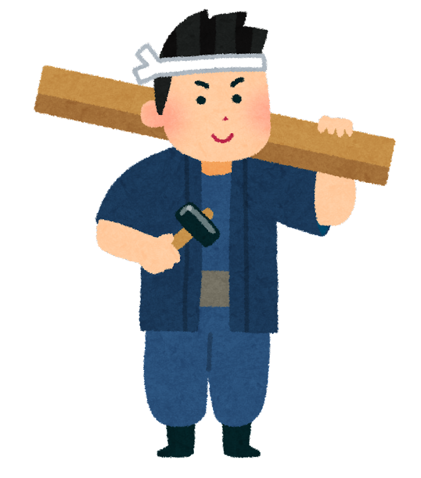
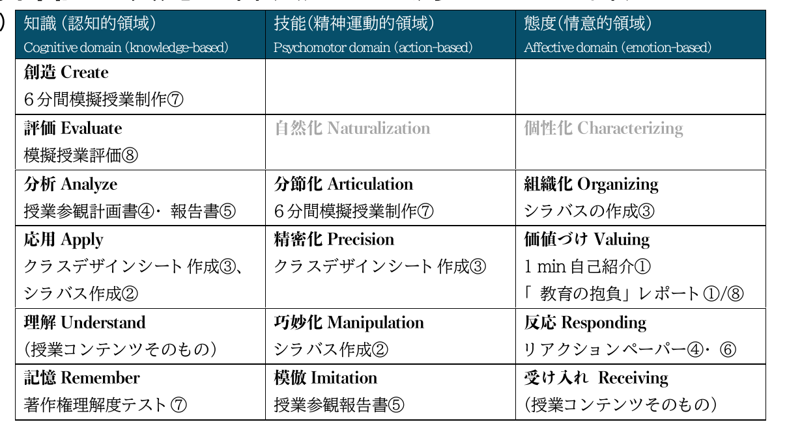

<!-- _class: cover-hero -->

大学などで教える

Bloomの教育目標分類

<b>達成目標：</b>教育目標分類を使いこなせるようになる。

<!--
- タイトルコール。「Bloomの教育目標分類」を使いこなせるようになる、が今回の達成目標。
-->

---

Bloomの教育目標分類

# 8年かけて作られた目標の分類

教育心理学者Bloomらにより、<b>8年かけて</b>作られた教育における目標の分類

<table class="bloom">
<tr><th></th><th>認知的領域 (知識や思考)</th><th>精神運動的領域 (技能やスキル)</th><th>情意的領域 (態度)</th></tr>
<tr class="l6"><td class="axis">高次</td><td><b class="verb">創造</b> (学習を応用し、新しい価値を作れる)</td><td></td><td></td></tr>
<tr class="l5"><td class="axis"></td><td><b class="verb">評価</b> (事物・判断等を比較し、評価出来る)</td><td><b class="verb">自然化</b> (習慣的な動作として行える)</td><td><b class="verb">個性化</b> (自身の世界観を持ち行動を促せる)</td></tr>
<tr class="l4"><td class="axis"></td><td><b class="verb">分析</b> (要素に分け、関係性を指摘できる)</td><td><b class="verb">分節化</b> (複数動作を組み合わせ調和できる)</td><td><b class="verb">組織化</b> (複数の価値の相互関係を設定する)</td></tr>
<tr class="l3"><td class="axis"></td><td><b class="verb">応用</b> (他の場面や状況に使用できる)</td><td><b class="verb">精密化</b> (臨機応変な動作が出来る)</td><td><b class="verb">価値づけ</b> (価値を理解し自分のものとする)</td></tr>
<tr class="l2"><td class="axis"></td><td><b class="verb">理解</b> (学習内容を説明出来る)</td><td><b class="verb">巧妙化</b> (示された動作を誤りなく行える)</td><td><b class="verb">反応</b> (新しい現象に能動的に反応する)</td></tr>
<tr class="l1"><td class="axis">低次</td><td><b class="verb">記憶</b> (事実や概念を暗記している)</td><td><b class="verb">模倣</b> (示された動作を真似できる)</td><td><b class="verb">受け入れ</b> (新たな現象に注意を向ける)</td></tr>
</table>

<b>参照</b> 1956年に認知的領域、1964年に情意的領域。精神運動領域は1972年の別のグループの仕事。認知的領域はAndersonらの改訂版を使用。

(梶田, 2010や栗田&amp;中村, 2023を元に作成)

<!--
- Bloomらが8年かけて作った3領域×6段の目標分類。認知・精神運動・情意の各領域を、低次（記憶・模倣・受け入れ）から高次（創造・自然化・個性化）へ並べる。
-->

---

Bloomの教育目標分類

# スキルは目標に沿って発達する

個人のスキルは、<b>教育目標に沿って発達している</b>と考えると、腑に落ちませんか？

<table class="bloom compact">
<tr><th></th><th>知識や思考</th><th>技能やスキル</th><th>態度</th></tr>
<tr class="l6"><td class="axis">高次</td><td><b>創造</b></td><td></td><td></td></tr>
<tr class="l5"><td class="axis"></td><td>評価</td><td>自然化</td><td>個性化</td></tr>
<tr class="l4"><td class="axis"></td><td>分析</td><td>分節化</td><td>組織化</td></tr>
<tr class="l3"><td class="axis"></td><td>応用</td><td>精密化</td><td>価値づけ</td></tr>
<tr class="l2"><td class="axis"></td><td>理解</td><td>巧妙化</td><td>反応</td></tr>
<tr class="l1"><td class="axis">低次</td><td>記憶</td><td>模倣</td><td>受け入れ</td></tr>
</table>

棟梁

大工

見習い

<!--
- スキルは教育目標に沿って発達する、と考えると腑に落ちる。見習い→大工→棟梁のように、低次から高次へ積み上がっていくイメージ。
-->

---

Bloomの教育目標分類

# ②評価の次元道具

<b>Bloomの教育目標をコースデザインの道具として使う</b> <b>②評価の次元：</b>各次元まで測れるか・課題のねらい考える

<table class="bloom compact" style="flex:0 0 auto;">
<tr><th></th><th>知識や思考</th><th>技能やスキル</th><th>態度</th></tr>
<tr class="l6"><td class="axis">高次</td><td><b>創造</b></td><td></td><td></td></tr>
<tr class="l5"><td class="axis"></td><td>評価</td><td>自然化</td><td>個性化</td></tr>
<tr class="l4"><td class="axis"></td><td>分析</td><td>分節化</td><td>組織化</td></tr>
<tr class="l3"><td class="axis"></td><td>応用</td><td>精密化</td><td>価値づけ</td></tr>
<tr class="l2"><td class="axis"></td><td>理解</td><td>巧妙化</td><td>反応</td></tr>
<tr class="l1"><td class="axis">低次</td><td>記憶</td><td>模倣</td><td>受け入れ</td></tr>
</table>

課題種別に応じて 評価できるものは変わるよ

理解と記憶の確認が主 なので、筆記試験！

複数手法を構造化する 論述試験と複数手法を 応用するレポートかな

実演や企画書の提出、 面接等も必要かも

<!--
- 評価の次元：表の各段（次元）まで測れているか、課題のねらいを考える道具に使う。記憶・理解なら筆記試験、分析・評価なら論述・レポート、創造や態度なら実演・企画書・面接など、課題種別を選ぶ。
-->

---

Bloomの教育目標分類

# ②評価の次元　例)道具

<b>Bloomの教育目標をコースデザインの道具として使う</b> <b>②評価の次元：</b>各次元まで測れるか・課題のねらい考える

<!--
- 例として、各次元（Remember〜Create 等）に対応する課題種別を英日対照で並べたもの。次元ごとに評価できる課題が変わる。
-->

---

Bloomの教育目標分類

# ③インストラクションの次元道具

<b>Bloomの教育目標をコースデザインの道具として使う</b> <b>③インストラクションの次元：</b>その教え方で身につきます？

<table class="bloom compact" style="flex:0 0 auto;">
<tr><th></th><th>知識や思考</th><th>技能やスキル</th><th>態度</th></tr>
<tr class="l6"><td class="axis">高次</td><td><b>創造</b></td><td></td><td></td></tr>
<tr class="l5"><td class="axis"></td><td>評価</td><td>自然化</td><td>個性化</td></tr>
<tr class="l4"><td class="axis"></td><td>分析</td><td>分節化</td><td>組織化</td></tr>
<tr class="l3"><td class="axis"></td><td>応用</td><td>精密化</td><td>価値づけ</td></tr>
<tr class="l2"><td class="axis"></td><td>理解</td><td>巧妙化</td><td>反応</td></tr>
<tr class="l1"><td class="axis">低次</td><td>記憶</td><td>模倣</td><td>受け入れ</td></tr>
</table>

単なる講義では 高次の目標には 到達できないよ

オンデマンド型の講義 で十分かな

輪読型の授業や実社会 の課題を見学する時間 は取りたいかも

アクティブラーニング や外部講師は必須かも

<!--
- インストラクションの次元：その教え方で本当に身につくか。低次はオンデマンド講義で十分、中位は輪読や見学、高次はアクティブラーニングや外部講師が必須になりやすい。
-->

---

Bloomの教育目標分類

# Finkの意味ある学習分類

<b>Finkの意味ある学習分類</b> (Taxonomy of significant learning)

<b>人間性の醸成</b>や、<b>価値観</b>の見出し、<b>学び方自体の学習</b>なども目標に加える立場

Fink (2003) <i>Creating significant leaning experiences</i>

複数の学習分類があるので、 <b>学習に組み込む必要がある領域を含んだモデル</b>を使用する

目標分類を道具として活用し、授業設計に活かす

<!--
- Bloom以外にもFinkの「意味ある学習分類」など複数のモデルがある。人間性・価値観・学び方の学習まで含める立場。最後に：複数の分類を道具として活用し、必要な領域を含むモデルで授業設計に活かす。
-->
