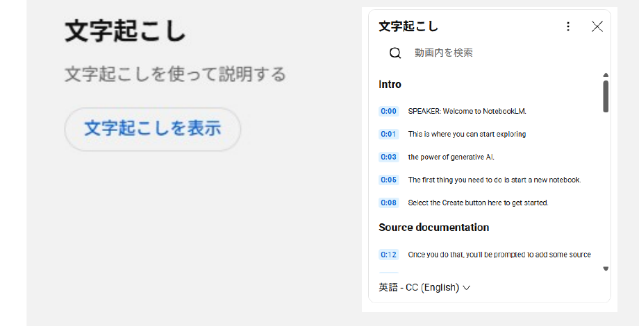
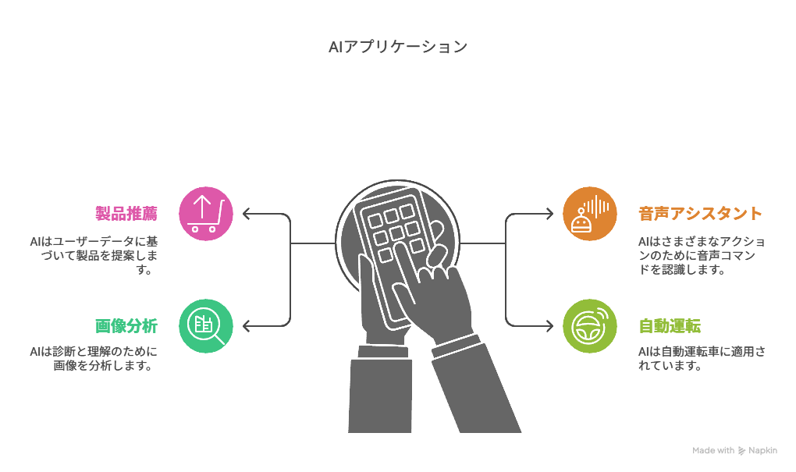
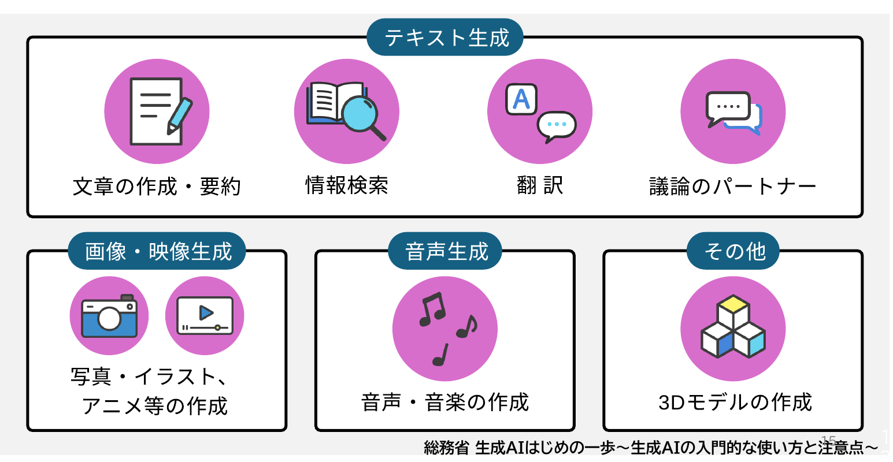
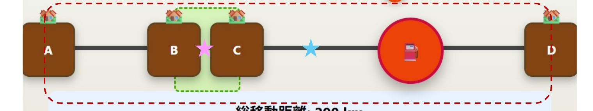
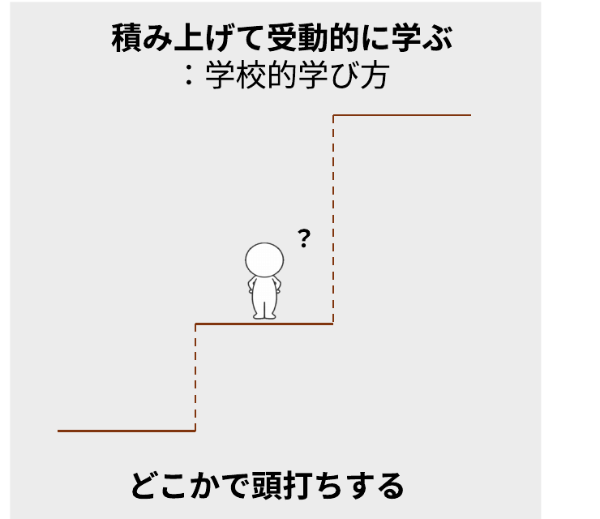
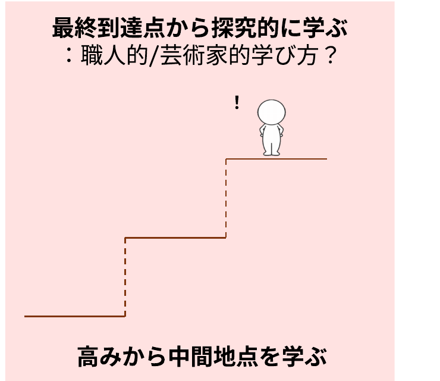
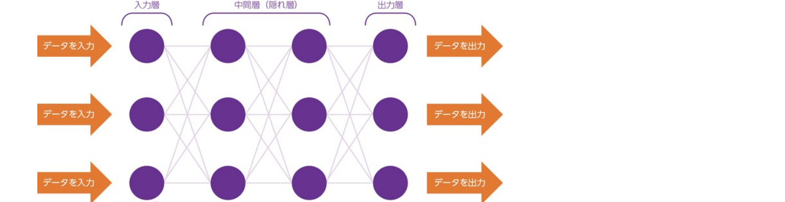
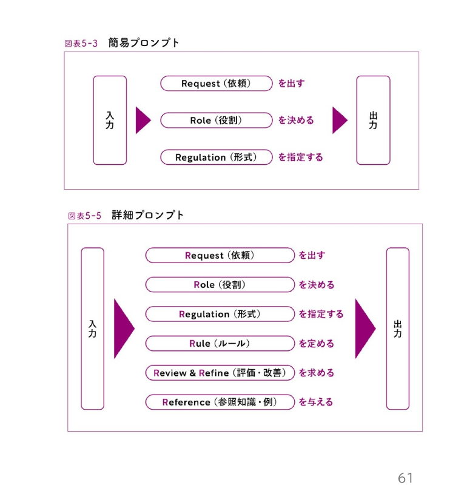
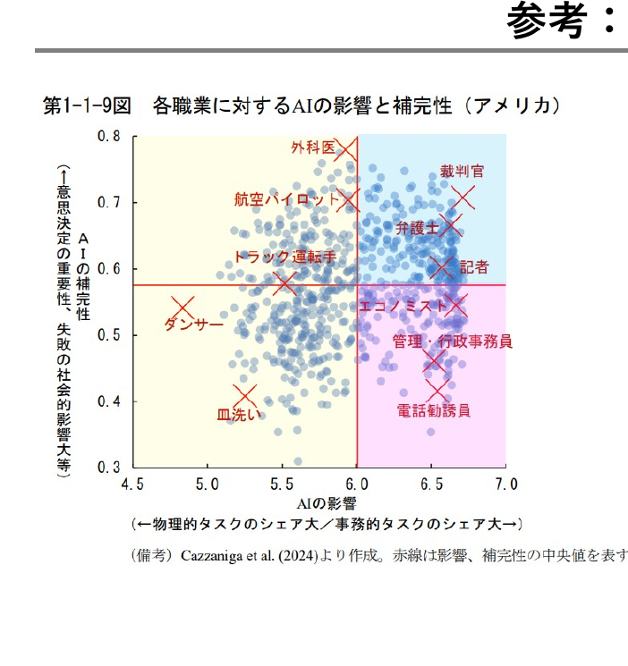

<!-- _class: cover-hero -->

生成AIで学ぶ

2025/06/11 宮崎東高校講演会

講師：田川 翔

千葉大学 国際未来教育基幹 助教

<!--
0-1
-->

---

自己紹介

# 自己紹介

仕事：<b>大学教育の企画</b>／<b>学生と教員を支援</b>

専門：<b>地球の起源、AI</b> 
地球惑星科学　博士(理学) 2020年

海の起源の仮説検証 
Tagawa et al. (2021) <i>Nat. Com.</i>

<b>翻訳：</b>大学の教え方の授業　<b>来年、発売予定！</b>

<!--
1-3 / 始める前に、簡単に僕の自己紹介をしときましょう。名前は、田川翔といいます。現在は千葉大学の教育をより良くするために、教育企画の仕事を行っている教員です。最近の研究テーマは大学教育と生成AIの関係なので、ここに立っています。 / これ似顔絵ですね。ポスターを真似て、チャットGPTにかいてもらいました。似てますかね？(会場の反応を見る) / さて、そんな私ですが、もともと研究テーマは地球の起源の解明なんですね。この惑星は、どのようにできたのか。そして、海の量はなぜきまったのか。 / そんなテーマで、博士課程まで実験していました。これですね(岩石みせる)、皆様の足元深い所にあるかんらん岩という岩石なんですけどもこの宝石みたいな岩石が地球のマントルの成分だと考えられています。 / で、こっちの方が隕鉄ですね。特徴的な結晶構造があるので、宇宙から降ってきたってわかるんですけど、この2つの化学反応を、実際に地球ができた温度、圧力で実験していました。 / それは、超高圧・高温の世界で、手のひらに東京タワー10本分ぐらいをのっけたような圧力を作り出し、そこにレーザーをあててドロドロに融かすわけです。
-->

---

本日使用するツール

# 授業・セミナー インタラクティブ化ツール

✓匿名 / もしよければ、ぜひご参加下さい

Join at

slido.com

#8912 651

<b>PCから参加の方へ</b> 
slidoのwebページを開き、アクセスコード(7桁)を入力して下さい

<!--
3-6
-->

---

今日の目的

# 今日の目的

<b>第1講</b> AIって何か知ろう

<b>第2講</b> AIを使う上での注意点とその背景を知ろう

コンペ：AIを探求、読書、普段の学びに活かすには

<b>第3講</b> AIとの付き合い方を考えよう

今後、AIとどう向き合うか、自分の考えを持てれば成功です

<!--
6-7
-->

---

アンケート (slido)

# AIを使ったことはある？

スマホ・PCから <b>slido</b> でご回答ください　(#8912 651)

※ slido のライブ投票画面を表示

<!--
7-8
-->

---

アンケート (slido)

# どんな使い方をする？

スマホ・PCから <b>slido</b> でご回答ください　(#8912 651)

※ slido のワードクラウド画面を表示

<!--
8-11
-->

---

アンケート (slido)

# AIってどう思う？

スマホ・PCから <b>slido</b> でご回答ください　(#8912 651)

※ slido のワードクラウド画面を表示

<!--
11-13
-->

---

今日の目的

# 今日の目的

<b style="color:var(--accent);">第1講 AIって何か知ろう</b>

<b>第2講</b> AIを使う上での注意点を知ろう

コンペ：AIを探求、読書、普段の学びに活かすには

<b>第3講</b> AIとの付き合い方を考えよう

今後、AIとどう向き合うか、自分の考えを持てれば成功です

<!--
13-15
-->

---

AIを使ってみる

# Step 1) Gemini か、マイクロソフトcopilotを開いて下さい。

注意：ChatGPTは保護者の許可がいります

※ アカウントが必要な際は、作っても大丈夫です

皆さんがあけるまで、3分、お待ちします

<!--
16-18
-->

---

ワーク：AIを使ってみる

# Step 2) 以下のプロンプトをそれぞれ流してみて下さい。

生成AIとはなにか、説明して下さい。

(わかりにくい場合)　わかりにくいので、高校生にも分かるよう、説明して下さい

(わかりにくい場合)　わかりにくいので、3文で説明して下さい

(遊んでみる場合)　関西弁や宮崎弁で説明して下さい

## Step 3) 意図的に間違わせてみましょう (例)

宮崎東高の校長先生は誰ですか？ 
5 cmの綿に、10 cmのレンがを乗せると、高さ何cm?

※余裕がある場合、「自信なかったら答えないように」頼んだ質問もやってみて下さい。

<!--
18-21
-->

---

ワーク：AIを使ってみる

# Step 4) YouTubeまたはPDFを開き、動画の書き起こしを開き、コピー、AIに<u>日本語で</u>要約させて下さい。

例：

→AIにコピペ

“以下は、動画を添付したものです。その内容を要約して下さい”

<!--
21-13
-->

---

アンケート (slido)

# AIの説明はわかりやすくなりましたか？

スマホ・PCから <b>slido</b> でご回答ください　(#8912 651)

※ slido のライブ投票画面を表示

<!--
23-25
-->

---

2 使ってみる

# ワーク：AIを使ってみる

AIの説明をより分かりやすくするために (実際に試してみて下さい)

① 箇条書きや表にしてほしい、と言ってみる

② 回答の長さを指定する (AIは長くなりがちです)

③ 小学生に教えるように、と付け加える

④ わかりにくい言葉の定義を教えて、と言ってみる

⑤ <b>分からないところを質問して、詳しく説明してもらう</b>

学んだり、探求するなかで、とても使える道具になる 
<b>思考を一緒して、自分が分かっていないことを教えてくれる相手になる</b> 
(自分も1日30回以上は聞いている)

<!-- 25-28 -->

---

1 AIって何？

# AIの種類

<b>AIの定義 (例)</b>：人間の思考プロセスと同じような形で動作するプログラム ／ 人間が知的と感じる情報処理やそれを行う科学・技術

『R6 科学技術イノベーション白書 (第一章)』文部科学省 (2024)

AIはいろいろなところにすでにある

注：目的関数が、エンゲージや売上をあげるなど、「サービス提供側 (≠あなた)」にしか利益を与えない場合もある

cf. 『マインドハッキング: あなたの感情を支配し行動を操るソーシャルメディア』

<b>通常の生成AIは、安全性や透明性に、かなり注意して設計・研究されている。</b>

---

1 AIってなに？

# 生成AIでできること

総務省 生成AIはじめの一歩〜生成AIの入門的な使い方と注意点〜

---

1 AIって何？

# ワーク：問題の解説をしてみよう

私は砂漠の石油王で、たまたま一直線上に位置している四つの町に石油を届けることになっている。その四つの町を順番に回るのだが、次の町へ行く前に必ず石油タンクに戻らなければならない。移動距離をもっとも短くするにはどこにタンクを置けばいいだろうか？王族の友人がいて私か望めば無料でいくらでも道路を建設してくれるから、道路の心配はいらない。

---

第1講　イントロ

# ワーク：問題の解説をしてみよう

- 端っこ2つの街の真ん中 
- 中央２つの街の真ん中　★ 
- 中央２つの街の上、または間ならどこでも　（正解）

<b>AIが仮に答えられたとしても、AIの回答を見ても賢くはなれないので、考えてみよう</b>

---

<!-- _class: message -->

📋 ライブ投票（Slido）

# AIを使わない場合、答えは？

— その場で回答を集めます —

---

1 AIって何？

# 答え合わせ? (AIに聞いてみよう)

この[問題]の回答を教えて下さい。

[私は砂漠の石油王で、たまたま一直線上に位置している四つの町に石油を届けることになっている。その四つの町を順番に回るのだが、次の町へ行く前に必ず石油タンクに戻らなければならない。移動距離をもっとも短くするにはどこにタンクを置けばいいだろうか？王族の友人がいて私か望めば無料でいくらでも道路を建設してくれるから、道路の心配はいらない。]

---

<!-- _class: message -->

📋 ライブ投票（Slido）

# AIを使った場合、答えは？

— その場で回答を集めます —

---

1 AIって何？

# 答え合わせ：問題の解説をしてもらおう

以下の問題があります。<b>自分は、真ん中２つの街の真ん中だと答えました。正解は、真ん中２つの街の上、または間なら、どこでも良い、になるんだそうです。</b>なぜ、そのようになるのか、高校生にもわかりやすく、教えてもらえませんか？ 
[私は砂漠の石油王で、たまたま一直線上に位置している四つの町に石油を届けることになっている。その四つの町を順番に回るのだが、次の町へ行く前に必ず石油タンクに戻らなければならない。移動距離をもっとも短くするにはどこにタンクを置けばいいだろうか？王族の友人がいて私か望めば無料でいくらでも道路を建設してくれるから、道路の心配はいらない。]

ツール：https://claude.ai/public/artifacts/2bb7e14c-1df9-4c01-ae3e-45fe6edeb43b 
プロンプト：https://claude.ai/share/5c053617-2718-41f7-8319-0ed0ea2e2012

---

<!-- _class: message -->

📋 ライブ投票（Slido）

# なんか、勉強に役立ちそう？

— その場で回答を集めます —

---

1 AIってなに

# 学び方は変わる？

「なぜ学ぶのか、どのように学ぶのか、何を学ぶのか」の変質

<b>まずは、自分から、学び方を変えてみよう</b> ▶ できないかな、と思ったら<b>使ってみる</b>

---

<!-- _class: message -->

💬 ライブQ&A（Slido）

# なんで、英語やプログラミング、数学はこれからも学ばないといけないと思う？

— その場で回答を集めます —

---

第1講 イントロ

# どんなときに使うと、勉強に役立ちそう？

💬

どんなときに使うと、 勉強に役立ちそう？

スマホ・PCから <b>Slido</b> にアクセスして、思いついた場面を投稿してください

<!--
- ここでSlido。「どんなときに使うと勉強に役立ちそうか」を、思いついた場面を出し合ってもらう。
-->

---

何が、利用上の注意点か

# 生成AI活用の注意点　2 注意点

生成AI活用にあたって 注意すべきポイントは？

情報の正確性

情報流出

知的財産権の侵害

活用者としてのモラル

<b>総務省　生成AIはじめの一歩～生成AIの入門的な使い方と注意点～</b> 
https://www.soumu.go.jp/use_the_internet_wisely/special/generativeai/ 
コンパクトに纏まっているので、ぜひ、ご活用ください

<!--
- ここからは、生成AIを使う上で注意すべき4つのポイントを学習します。
- まずは、情報の正確性に関することです。
-->

---

偽・誤情報に騙されない・拡散しないため、3つのポイントを常に意識する

# 3つのポイントを常に意識　2 注意点

ポイント１

人は信じたいものを選ぶ（認知バイアス）ので、無意識のうちに合理的ではない行動、偏った判断をすることがあるという<b>意識をもつ</b>

ポイント２

<b>チェックリスト</b>を用いて真偽を判断する

ポイント３

チェックリストを用いて判断しても騙されるので、<b>安易に拡散しない</b> / 拡散したいときは ひと呼吸おく

Source: 総務省「インターネットとの向き合い方～ニセ・誤情報に騙されないために～」

<!--
- 生成AIの技術は急速に進展しており、人間が情報の真偽を判断することは難しくなることが予想されます。
- 自分が被害者、加害者にならないため、3つのポイントを常に意識しましょう。
- 1つ目は、人は信じたいものを選ぶので、無意識のうちに合理的ではない行動、偏った判断をすることがあるという意識をもつこと、
- 2つ目は、チェックリストを用いて真偽を判断すること、
- 3つ目は、チェックリストを用いて判断しても騙されるので、安易に拡散しない、また拡散したいときはひと呼吸おくことです。
- これから、それぞれのポイントについてご説明します。
-->

---

チェックシートを用いて判断する

# チェックシートを用いて判断する　2 注意点

基 本

<ul style="font-size:24px;">
<li>☑ <b>情報源</b>はある？</li>
<li>☑ その分野の<b>専門家</b>？</li>
<li>☑ <b>他では</b>どう言われている？</li>
<li>☑ その画像は<b>本物</b>？</li>
</ul>

応 用

<ul style="font-size:24px;">
<li>☑ 「<b>知り合いだから</b>」 という理由だけで信じていないか？</li>
<li>☑ <b>表やグラフ</b>も疑ってみた？</li>
<li>☑ その情報に<b>動機</b>はある？</li>
<li>☑ <b>ファクトチェック</b>結果は？ ※1</li>
</ul>

Source: 総務省「インターネットとの向き合い方～ニセ・誤情報に騙されないために～」

<!--
- 2つ目に意識すべきポイントは、チェックリストを用いて真偽を判断することです。
- 情報源は信用できるか、他のメディアではどういわれているか、その画像/表/グラフは本物か、ファクトチェックの結果はどうかなど、1つ1つ確認することが大切です。
-->

---

生成AIにより偽・誤情報が生成される可能性

# 偽・誤情報が生成される可能性　事例

偽・誤情報の事例 ❶

ある生成AIサービスに以下の指示を入力すると、問題のあるリストが生成された。

西日本で最も高い山のTOP10を教えてください

<b>生成されたリストの課題</b> ・実在しない山の名前が含まれる ・標高が不正確

偽・誤情報の事例 ❷

2022年9月、台風15号による水害被害が発生している静岡県の画像がSNS上で拡散。その後投稿者は、画像生成AIで作成した偽画像だったと公表。

Source: 生成AIサービスを用いて回答を作成、NHK「SNSで拡散 “AI生成の偽の災害画像” ファクトチェックはどうする」

<!--
- 生成AIによりもっともらしい偽・誤情報が生成される可能性に注意が必要です。
- 例えば、生成AIサービスに指示を入力すると、実在しない内容が含まれていたり、数字が不正確だったりすることがあります。
- また、水害被害の画像がSNSで拡散されたところ、実は画像生成AIで作成した偽画像だったという事例があります。
-->

---

何が、利用上の注意点か

# 生成AI活用の注意点　2 注意点

生成AI活用にあたって 注意すべきポイントは？

情報の正確性

情報流出

知的財産権の侵害

活用者としてのモラル

<b>総務省　生成AIはじめの一歩～生成AIの入門的な使い方と注意点～ から考える</b> 
https://www.soumu.go.jp/use_the_internet_wisely/special/generativeai/

<!--
- 次に、情報流出に関することについて学習します。
-->

---

情報流出を防ぐため、3つの行動を心がける

# 3つの行動を心がける　2 注意点

行動１

🔍

生成AIサービスの<b>規約を確認</b>（データの利用目的や範囲等）また利用規約の変更時には<b>変更箇所をチェック</b>

行動２

🔒

個人情報や機密情報の 入力は<b>必要最小限</b>

行動３

🚫

生成AIに入力したデータを<b>学習に使わせないように設定</b>（オプトアウト設定）※1

<!--
- 情報流出を防ぐため、3つの行動を心がけることが大切です。
- まずは、生成AIサービスの規約で、データの利用目的や範囲等を確認し、利用規約の変更時には変更箇所をチェックするようにしましょう。
- その上で、個人情報や機密情報の入力を必要最小限にするよう注意しましょう。
- また、利用する生成AIサービスで設定が可能であれば、入力したデータを学習に使わせないように設定しましょう。
-->

---

教育として必要なこと

# 教育として必要なこと　2 注意点

Terms of use (利用規約) を読む / AIに読み込ませる

<table style="width:100%; border-collapse:collapse; margin-top:14px; font-size:23px;">
<tr>
<th style="width:160px; background:var(--accent-soft); border:1px solid #ccc; padding:8px 12px; text-align:center;">サービス</th>
<th style="background:var(--accent-soft); border:1px solid #ccc; padding:8px 12px; text-align:left;">年齢・利用条件</th>
</tr>
<tr>
<td style="border:1px solid #ccc; padding:8px 12px; text-align:center; font-weight:800;">ChatGPT</td>
<td style="border:1px solid #ccc; padding:8px 12px;">13才以上は可だが、<b>18才未満は保護者同意必須</b></td>
</tr>
<tr>
<td style="border:1px solid #ccc; padding:8px 12px; text-align:center; font-weight:800;">Gemini</td>
<td style="border:1px solid #ccc; padding:8px 12px;">13才以上可　<b>但し学校版は管理者の許可必須</b> ※ APIの利用/Studio/gem/NotebookLMの利用は不可</td>
</tr>
<tr>
<td style="border:1px solid #ccc; padding:8px 12px; text-align:center; font-weight:800;">Claude</td>
<td style="border:1px solid #ccc; padding:8px 12px;">18才以上可</td>
</tr>
<tr>
<td style="border:1px solid #ccc; padding:8px 12px; text-align:center; font-weight:800;">Copilot</td>
<td style="border:1px solid #ccc; padding:8px 12px;">13才以上可 (MS365 Copilotは 2025夏に13才以上に変更)</td>
</tr>
</table>

※K-12向けAIは「みんなのコード」や「Khanmigo (米国向け)」など限られる (安全性を考え、順次拡大中ではある)

---

ある海外企業では、生成AIに機密情報を入力し情報が流出

# 機密情報を入力し情報が流出　事例

2023年3月、海外の電子機器メーカーで生成AIの使用による、社内情報流出が立て続けに発生

情報流出の内容 ❶

<b>社内機密のソースコード</b>を生成AIに入力し、修正を依頼 (2件)

💻

➡

生成AI

情報流出の内容 ❷

<b>社内会議の録音データ</b>を音声認識アプリで文章に変換して生成AIに入力し、議事録を作成 (1件)

🎙

➡

生成AI

<!--
- ある海外企業では、社員が生成AIの仕組みへの理解が不十分であったため、生成AIに機密情報を入力してしまい、情報が流出するトラブルが発生しました。
- ビジネスで利用する場合は、自社の機密情報の取扱いについて十分留意する必要があります。
-->

---

何が、利用上の注意点か

# 生成AI活用の注意点　2 注意点

生成AI活用にあたって 注意すべきポイントは？

情報の正確性

情報流出

知的財産権の侵害

活用者としてのモラル

<b>総務省　生成AIはじめの一歩～生成AIの入門的な使い方と注意点～ から考える</b> 
https://www.soumu.go.jp/use_the_internet_wisely/special/generativeai/

<!--
- 次に、知的財産権の侵害に関することについて学習します。
-->

---

配慮すべき知的財産権

# 配慮すべき知的財産権　2 注意点

利用例１

既存の<b style="color:var(--accent-dark);">著作物</b>と類似している生成物を、アップロードして公表/複製物を販売

⬇

⚠ 著作権

利用例２

商標や意匠として登録されている<b style="color:var(--accent-dark);">ロゴ・デザイン等</b>と同一または類似している生成物を商用利用

⬇

⚠ 商標権・意匠権

利用例３

生成AIを利用して生成された<b style="color:var(--accent-dark);">著名人の氏名、肖像等</b>を商用利用

⬇

⚠ パブリシティ権

<b>差止請求・損害賠償請求等の民事訴訟や、刑事罰の対象となることも</b>

Source: 総務省「インターネットとの向き合い方～ニセ・誤情報に騙されないために～」

<!--
- 生成AIで生成したものが、既存の著作物・商標・意匠・著名人の肖像等と類似していると、知的財産権の侵害になりうる。
- 差止請求・損害賠償請求等の民事訴訟や、刑事罰の対象となることもある点に注意。
-->

---

そもそも、なんで？

# そもそも、なんで？　2 背景

疑問点

<b>AIの中身は、どうなっているのだろう？</b>

<b>そもそもなんで、間違えるのか？</b>

<b>間違えることはなくならないのか</b>

AIを使いこなすためには、メカニズムをある程度、知る必要がある

→ <b>AIをただ、使うだけでは、わからない！！！</b> 　　実際、大学でも教員にAIのメカニズムを教えることが増加

<!--
- AIを使いこなすには、メカニズムをある程度知る必要がある。
- ただ使うだけではわからない。大学でも教員にAIのメカニズムを教えることが増えている。
-->

---

機会学習で、データの関係性をどう考えるか

# データの関係性をどう考えるか　2 背景

<table style="width:62%; border-collapse:collapse; margin:40px auto 0; font-size:40px; text-align:center;">
<tr>
<th style="background:#3FA535; color:#fff; border:2px solid #fff; padding:14px 0; font-weight:800;">x</th>
<th style="background:#3FA535; color:#fff; border:2px solid #fff; padding:14px 0; font-weight:800;">f(x)</th>
</tr>
<tr><td style="background:#CFE3C8; border:2px solid #fff; padding:12px 0;">1</td><td style="background:#CFE3C8; border:2px solid #fff; padding:12px 0;">3</td></tr>
<tr><td style="background:#E9F2E4; border:2px solid #fff; padding:12px 0;">2</td><td style="background:#E9F2E4; border:2px solid #fff; padding:12px 0;">5</td></tr>
<tr><td style="background:#CFE3C8; border:2px solid #fff; padding:12px 0;">3</td><td style="background:#CFE3C8; border:2px solid #fff; padding:12px 0;">7</td></tr>
<tr><td style="background:#E9F2E4; border:2px solid #fff; padding:12px 0;">4</td><td style="background:#E9F2E4; border:2px solid #fff; padding:12px 0;">?</td></tr>
</table>

<!--
- ちょっと問題をだしてみましょう。正解も何もないので、頭の体操としてきいて下さい。
- f(1) = 3、f(2)= 5、f(3)=7と数が並んでいた時、f(4)はなんだと思いますか？
-->

---

機会学習で、データの関係性をどう考えるか

# データの関係性をどう考えるか　2 背景

<table style="flex:0 0 auto; border-collapse:collapse; font-size:24px; text-align:center;">
<tr>
<th style="background:#3FA535; color:#fff; border:2px solid #fff; padding:6px 24px; font-weight:800;">x</th>
<th style="background:#3FA535; color:#fff; border:2px solid #fff; padding:6px 24px; font-weight:800;">f(x)</th>
</tr>
<tr><td style="background:#CFE3C8; border:2px solid #fff; padding:5px 0;">1</td><td style="background:#CFE3C8; border:2px solid #fff; padding:5px 0;">3</td></tr>
<tr><td style="background:#E9F2E4; border:2px solid #fff; padding:5px 0;">2</td><td style="background:#E9F2E4; border:2px solid #fff; padding:5px 0;">5</td></tr>
<tr><td style="background:#CFE3C8; border:2px solid #fff; padding:5px 0;">3</td><td style="background:#CFE3C8; border:2px solid #fff; padding:5px 0;">7</td></tr>
<tr><td style="background:#E9F2E4; border:2px solid #fff; padding:5px 0;">4</td><td style="background:#E9F2E4; border:2px solid #fff; padding:5px 0;">?</td></tr>
</table>

ルールベースの世界観 (設計者が教えておく)

解析的に解くよ 
等差数列っぽい？ <b style="color:var(--accent);">→ Yes</b> 
f(x) = 2x+1？ 
ならば9と予想

機械学習の世界観 (もっとたくさん学習！)

入力されたデータからパターンをコンピュータが探索・発見 
<b>f(x)自体は気にしない</b> 
9とか11？

変換する「函」

確率・統計的に処理 <b style="color:var(--accent);">正解が出てくるとは限らない</b>

<b>ブラックボックス内を理解する手法は開発中</b> 
e.g. Anthropic (2025) 
　　AI顕微鏡

データの関係性の捉え方が根本的に違う

<!--
- ルールベースの世界に生きるAIは、きっと僕から、解析的な解き方を教えられているんですね。たとえば、この場合には、一次式を試してみて、f(x) = 2*x+1っていう風なので、x=4で9だぞって。
- 結構高校までの数学の授業って、こういう考え方しませんか。f(x)ときたら、f(x)の式の形を求めることから初めてみようかな、と思う。
- でも、機械学習的な世界では、このf(x)がどうなっているかはどうでも良いのですね。xとf(x)の関係性を学習し、次を予測するだけ。f(x)の式そのものは、ブラックボックスで全然構わない。まぁ、たったこんだけの数字で機械学習することなんてまぁ、無理なんですけど。ただ、この数字から次を予測するとしたら、9以外にも11とかも言ってくるかもしれないんですね。
- データの関係性について、f(x)自体がルールを明示的、つまり人が読んでもわからない形でも構わないが、コンピューターが自ら学習した結果を予想できる、この考え方がミソなんですね。
-->

---

箱としての、ディープラーニング (深層学習)

# 箱としての、ディープラーニング　2 背景

『R1 総務省 情報通信白書』総務省(2019)

学習

入力

パラメーター の函

数字の羅列

<b>出力</b> ↻更新 <b>評価</b>

利用

入力

パラメーター の函

数字の羅列

出力

<!--
- ただ、このブラックボックス部分ですけど、この自体をどんな形にするか、という設計はあるわけです。
- 人工ニューラルネットワーク、その発展型である深層学習(Deep Learning)という言葉を耳にした方は多いかもしれません。今年のノーベル賞ですからね。複数のパラメータを配置することで、学習したデータとはことなるものを確率的につくることが出来るわけです。
- 意味を直接設計しようとするアプローチではなく、機械的に膨大なパラメータから意味を生成する方法の方法がいまのAIの背景にあるのです。
-->

---

箱としての、ディープラーニング (深層学習)

# 箱としての、ディープラーニング　2 背景

・人間の神経細胞（ニューロン）のように、各ノードが層をなして接続されるものがニューラルネットワーク 
・中間層（隠れ層）が複数の層となっているものを用いるものが深層学習

<b>2012年</b>、Googleの キャットペーパー 
(「猫」を教えていなかったのに、写真から猫の特徴を抽出) 
ヒントンらによる画像認識のブレークスルー 
<b>2016年</b>、世界トップレベルのプロ囲碁棋士に勝利 (囲碁専用ではない)

ノーベル賞 2024年 (PD)

<b>物理学：</b>人工ニューラルネットワークによる機械学習を可能にする基礎的な発見と発明 
<b>ジョン・ホップフィールド</b> 物理学者・分子生物学者 
<b>ジェフリー・ヒントン</b> 生理学・哲学→実験心理学→コンピューター科学

<b>化学 (一部)：</b>タンパク質プログラムの開発 
<b>デミス・ハサビス</b> 人工知能研究者、神経科学者 
<b>ジョン・M・ジャンパー</b> 固体物理学→理論化学→計算生物学

※高校生/高校教諭向けには、東大松尾研のGCIなど、無料でおすすめ

『R1 総務省 情報通信白書』総務省(2019)

<!--
- ただ、このブラックボックス部分ですけど、この自体をどんな形にするか、という設計はあるわけです。
- 人工ニューラルネットワーク、その発展型である深層学習(Deep Learning)という言葉を耳にした方は多いかもしれません。今年のノーベル賞ですからね。複数のパラメータを配置することで、学習したデータとはことなるものを確率的につくることが出来るわけです。
- 意味を直接設計しようとするアプローチではなく、機械的に膨大なパラメータから意味を生成する方法の方法がいまのAIの背景にあるのです。
-->

---

箱としての、ディープラーニング (深層学習)

# 箱としての、ディープラーニング　2 背景

言語型の大規模言語モデル (生成AIの中核) の本質

ネクストワードプレディクション

日本の首都__ →日本の首都は__ →日本の首都は東京__

これまでのコンテキストから、次の言葉(トークン)の確率を予想する問題

学習

入力 文字

パラメーター の函

数字の羅列

<b>出力</b> ↻更新 <b>評価</b>

GPT 4の場合、アメリカ議会図書館の全蔵書の約22倍に相当? 
※書籍、記事、ウェブサイト、コードなど幅広いテキストソース

<!--
- そして、生成AIの時代にきます。生成AIでよく想像されるのは、Chat GPTのような、言語を扱うAIでしょう。
- その構成について、トランスフォーマーの一つである、GPTのパラメタ構造をのぞいてみましょう。
- これも、ニューラルネットワークモデルです。インプットされたデータが、複数の層を通って出力されます。
- なんか宇宙ステーションみたいですね。
- ここでは「nano-gpt」という非常に小さなモデル（パラメータ数わずか85,000）を使って、モデルの仕組みを探っていきます。
- このモデルの目的はシンプルです。次にくるアルファベットを予想するタスクをしているわけですね。
- こんな感じで、言葉を操る生成AIは、ネクストワードプレディクション、つまり次に出てくる言葉の予測をおこなうAIなわけですね。さっき言ってた函ってのはこれ全部にあたります。
-->

---

<!-- _class: message -->

<svg viewBox="0 0 120 120" width="150" xmlns="http://www.w3.org/2000/svg"><rect x="22" y="14" width="76" height="92" rx="12" fill="#EAF2FB" stroke="#1A6BB0" stroke-width="8"/><path d="M36 42 l9 9 16 -18" fill="none" stroke="#1A6BB0" stroke-width="8" stroke-linecap="round" stroke-linejoin="round"/><rect x="70" y="42" width="20" height="8" rx="4" fill="#1A6BB0"/><circle cx="42" cy="80" r="10" fill="none" stroke="#1A6BB0" stroke-width="8"/><rect x="70" y="76" width="20" height="8" rx="4" fill="#1A6BB0"/></svg>

日本の首都は___

<!-- Slidoで「日本の首都は___」の次に来る言葉を予想してもらいます。ネクストワードプレディクションの体験です。 -->

---

<!-- _class: message -->

<svg viewBox="0 0 120 120" width="150" xmlns="http://www.w3.org/2000/svg"><rect x="22" y="14" width="76" height="92" rx="12" fill="#EAF2FB" stroke="#1A6BB0" stroke-width="8"/><path d="M36 42 l9 9 16 -18" fill="none" stroke="#1A6BB0" stroke-width="8" stroke-linecap="round" stroke-linejoin="round"/><rect x="70" y="42" width="20" height="8" rx="4" fill="#1A6BB0"/><circle cx="42" cy="80" r="10" fill="none" stroke="#1A6BB0" stroke-width="8"/><rect x="70" y="76" width="20" height="8" rx="4" fill="#1A6BB0"/></svg>

春は___

<!-- 次に「春は___」の続きを予想してもらいます。文脈によって候補が広がることを体験します。 -->

---

<!-- _class: message -->

<svg viewBox="0 0 120 120" width="150" xmlns="http://www.w3.org/2000/svg"><rect x="22" y="14" width="76" height="92" rx="12" fill="#EAF2FB" stroke="#1A6BB0" stroke-width="8"/><path d="M36 42 l9 9 16 -18" fill="none" stroke="#1A6BB0" stroke-width="8" stroke-linecap="round" stroke-linejoin="round"/><rect x="70" y="42" width="20" height="8" rx="4" fill="#1A6BB0"/><circle cx="42" cy="80" r="10" fill="none" stroke="#1A6BB0" stroke-width="8"/><rect x="70" y="76" width="20" height="8" rx="4" fill="#1A6BB0"/></svg>

地球に存在する水の総量はおおよそ海の_

<!-- 最後に「地球に存在する水の総量はおおよそ海の_」を予想してもらいます。専門的な文脈では予測が難しくなることを体験します。 -->

---

パラメーターの箱(函)としての、ディープラーニング (深層学習)

# パラメーターの箱(函)としての、DL　2 背景

LLM Visualization

クリックで <b>LLM Visualization</b> のデモを開き、GPTのパラメータ構造を実際にのぞいてみる

cf. NVIDIA "Mythbusters Demo GPU versus CPU"

<!--
- LLM Visualizationのデモを開いて、GPTのパラメータ構造を実際にのぞいてみましょう。
- 入力されたデータが、複数の層を通って出力される様子が見えます。なんか宇宙ステーションみたいですね。
- 緑のセルは現在処理されている数値を、青のセルは重みを表しています。
- cf. NVIDIAの「Mythbusters Demo GPU versus CPU」も、並列処理のイメージとしておすすめです。
-->

---

基本問題

理解度 チェック

基本問題

生成AIを活用するときの倫理に関する説明として、適切なものはどれか。全て選んでください。

Q

総務省　生成AIはじめの一歩 ～生成AIの入門的な使い方と注意点～

ア

本来自分が行うべきことまで生成AI任せにしない

イ

自分の考えと異なる専門家を攻撃するためのSNS文案を生成AIで作成する

ウ

生成AIを仕事や勉強には決して使うべきではない

エ

生成AIを非倫理的な行為や犯罪に悪用しない

<!-- では、ここまでの注意すべきポイント（活用者としてのモラル）に関する理解を確認するため、問題を解いてみましょう。生成AIを活用するときの倫理に関する説明として適切なものを、ア〜エから全て選んでください。 -->

---

解答/解説

理解度 チェック

解答/解説

正解

ア

エ

A

総務省　生成AIはじめの一歩 ～生成AIの入門的な使い方と注意点～

ア

本来自分が行うべきことまで生成AI任せにしない

イ

<b style="color:#555;">【解説】</b>生成AIを使って他人を誹謗中傷することはモラルに反する

ウ

<b style="color:#555;">【解説】</b>仕事や勉強において生成AIを一切使用してはいけない訳ではない。目的に沿って適切に活用することが重要。

エ

生成AIを非倫理的な行為や犯罪に悪用しない

<!-- 解答です。正解はアとエ。アは本来自分が行うべきことまで生成AI任せにしないこと、エは非倫理的な行為や犯罪に悪用しないこと。イは他人の誹謗中傷でモラルに反し、ウは生成AIを一切使ってはいけない訳ではなく、目的に沿って適切に活用することが重要です。 -->

---

応用問題

理解度 チェック

応用問題

画像生成AIで「料理をしている人」の画像を生成したところ、全て女性のイラストや写真であったときの対応として適切なものはどれか。全て選んでください。

ア

生成された内容に偏りがないか自分で考えてみる

イ

生成された内容は常に中立的なものであるため、そのまま活用する

ウ

性別を限定しないで生成するよう改めて指示する

エ

再度同じ指示をして、1回目と2回目で生成された画像を混ぜて使う

<!-- 続いて応用問題です。画像生成AIで「料理をしている人」の画像を生成したところ、全て女性のイラストや写真であったときの対応として適切なものを、ア〜エから全て選んでください。 -->

---

解答/解説

理解度 チェック

解答/解説

正解

ア

ウ

<b>ア</b>：生成物に偏見や差別が含まれていないか、人間が判断することが重要。

<b>ウ</b>：偏見や差別を軽減するため、具体的な指示を与えて多様性を引き出すことが重要。

A

ア

生成された内容に偏りがないか自分で考えてみる

イ

<b style="color:#555;">【解説】</b>生成AIは大量の学習データから文脈に沿った結果を生成する単なるツールであるため、生成内容が常に中立的であるとは限らない

ウ

性別を限定しないで生成するよう改めて指示する

エ

<b style="color:#555;">【解説】</b>再度同じ指示をしても同様の偏りがある画像が出力される可能性が高い

総務省　生成AIはじめの一歩 〜生成AIの入門的な使い方と注意点〜

<!-- 前問（画像生成の偏り）の解答です。正解はアとウ。アは生成物に偏見や差別が含まれていないか人間が判断すること、ウは具体的な指示で多様性を引き出すことが重要です。イとエは解説のとおり適切ではありません。 -->

---

基本問題

理解度 チェック

基本問題

生成AIの説明として、適切なものはどれか。全て選んでください。

Q

ア

生成AIは、インターネット上の文章を大量に学習し、指示に沿った回答を出力する

イ

生成AIは、文章だけでなく、画像/動画/コード等も生成可能である

ウ

生成AIは、高度な技術をもったエンジニアでないと使うことが難しい

エ

生成AIは、指示入力を工夫しなくても、利用者の意図をくみ取って回答を生成してくれる

<!-- では、ここまでの「生成AIの使い方」に関する理解を確認するため、問題を解いてみましょう。生成AIの説明として適切なものを、ア〜エから全て選んでください。 -->

---

解答/解説

理解度 チェック

解答/解説

正解

ア

イ

A

ア

生成AIは、インターネット上の文章を大量に学習し、指示に沿った回答を出力する

イ

生成AIは、文章だけでなく、画像/動画/コード等も生成可能である

ウ

<b style="color:#555;">【解説】</b>生成AIは、高度な技術は必要なく、簡単に使うことができるため、日常生活・学習・仕事に大きな影響を与えると見込まれる

エ

<b style="color:#555;">【解説】</b>生成AIは、利用者の意図を自動的にくみ取るわけではないため、指示の工夫が必要である

<!-- 基本問題の解答です。正解はアとイ。アは生成AIの基本的な仕組み、イは多様な生成物を扱えること。ウは高度な技術が不要で簡単に使えること、エは指示の工夫が必要であることが解説のポイントです。 -->

---

学びへの活用

2 〜 3人のグループになって下さい。

30分のワークをします

① AIを勉強、仕事・就職や読書に活かすアイデアを選んで、探してみて下さい。どんなことがAIできると便利ですか。 <b>AIに相談してもよいです。</b>

② そのアイデアは、さっきの注意点は、解決できていますか。問題がないか、確認しましょう。

③ 実際にAIで、そのアイデアが生きるか、確認し、共有して下さい。 <b>発表してもらえると、ちょっとした賞があります。</b>

<!-- ここからグループワークです。2〜3人のグループになって、30分のワークに取り組みます。①AIを学びや仕事に活かすアイデアを探し、②注意点が解決できているか確認し、③実際にAIで試して共有します。発表してくれたグループにはちょっとした賞があります。 -->

---

学びへの活用

2 〜 3人のグループになって下さい。

30分のワークをします

① AIを勉強、仕事・就職や読書に活かすアイデアを選んで、探してみて下さい。どんなことがAIできると便利ですか。 <b>AIに相談してもよいです。</b>

今から<b style="color:var(--accent);">５分後</b>にシェアしてもらいます。 比較的短い、「質問」と「応答」をするシナリオでよいです。

<b>例：</b>宿題で分からないところを解説してもらう 
エントリーシートで書くのが難しいところを質問する 
探究のテーマを決めるときに、他のアイデアをたくさんもらう

<!-- まずは①から始めましょう。今から5分後にシェアしてもらいます。比較的短い「質問」と「応答」のシナリオで構いません。例えば、宿題の分からないところを解説してもらう、エントリーシートで書きにくいところを質問する、探究のテーマ決めで他のアイデアをもらう、などです。 -->

---

<!-- _class: message -->

<svg viewBox="0 0 120 110" width="150" xmlns="http://www.w3.org/2000/svg"><path d="M14 12 h78 a14 14 0 0 1 14 14 v40 a14 14 0 0 1 -14 14 H46 l-20 18 v-18 H14 a14 14 0 0 1 -14 -14 V26 a14 14 0 0 1 14 -14 z" fill="#fff" stroke="#2E7D46" stroke-width="8"/><rect x="26" y="32" width="42" height="8" rx="4" fill="#2E7D46"/><rect x="26" y="50" width="28" height="8" rx="4" fill="#2E7D46"/></svg>

どんなアイデアにしますか。

<!-- グループで、どんなアイデアにするか考えてみましょう。Slidoで皆さんの考えを集めます。 -->

---

学びへの活用

② そのアイデアは、さっきの注意点は、解決できていますか。問題がないか、確認しましょう。

生成AI活用に当たって注意すべきポイントは?

情報の正確性

<ul>
<li>無意識のうちに合理的ではない行動、偏った判断をすることがあるという意識を持つ</li>
<li>チェックリストを用いて真偽を判断する</li>
<li>安易に拡散しない / 拡散したいときはひと呼吸おく</li>
</ul>

情報流出

<ul>
<li>生成AIサービスの規約を確認する(商用利用可否、損害発生時の責任所在等)</li>
<li>個人情報や機密情報の入力は必要最小限にする</li>
<li>生成AIに入力したデータを学習に使わせないように設定する</li>
</ul>

知的財産権の侵害

<ul>
<li>既存のものや実在の人物に似たものを生成するような指示入力を避ける</li>
<li>生成物が既存のものや実在の人物に類似している場合、利用をやめる/権利者から許諾を取得後に利用する/既存のものと類似しないよう大幅に加工する</li>
</ul>

活用者としてのモラル

<ul>
<li>本来自分が行うべきことまで生成AI任せにしない</li>
<li>生成AIが作った偏見のある回答を使用しない</li>
<li>生成AIを非倫理的な行為や犯罪に悪用しない</li>
</ul>

総務省　生成AIはじめの一歩 〜生成AIの入門的な使い方と注意点〜

<!-- 次に②です。考えたアイデアが、注意点を解決できているか確認しましょう。生成AI活用にあたっては、情報の正確性、情報流出、知的財産権の侵害、活用者としてのモラル、それぞれについて、今回学習した内容を心がけましょう。 -->

---

学びへの活用

なぜ誤答だったのか、聞いてみる

※直接聞くより間違えにくい

自分は、〇〇と答えたけども、答えは△だった。自分はどこで勘違いしたのか？

精緻的質問をしてみる

※読書にも有効

なぜそうなっているのか？ どのようになっているのか？

他の捉え方を聞いてみる

※読書にも有効

△について、自分は、〇〇と考えた。他の考え方はあるか。

<!-- 学びへの活用例です。誤答だったときはなぜ間違えたのか聞いてみる、精緻的質問でなぜ・どのようにと深掘りする、他の捉え方を聞いてみる、といった使い方ができます。いずれも読書にも有効です。 -->

---

<!-- _class: message -->

<svg viewBox="0 0 120 120" width="150" xmlns="http://www.w3.org/2000/svg"><rect x="18" y="10" width="84" height="100" rx="14" fill="#EAF2FB" stroke="#1A6BB0" stroke-width="8"/><path d="M34 40 l9 9 16 -18" fill="none" stroke="#1A6BB0" stroke-width="8" stroke-linecap="round" stroke-linejoin="round"/><rect x="70" y="40" width="22" height="8" rx="4" fill="#1A6BB0"/><circle cx="40" cy="80" r="11" fill="none" stroke="#1A6BB0" stroke-width="8"/><rect x="70" y="76" width="22" height="8" rx="4" fill="#1A6BB0"/></svg>

注意点を確認しましたか

<!-- アイデアについて、これまで学んだ注意点を確認できたかをSlidoでたずねます。 -->

---

学びへの活用

関連付け

△について習ったことがある。□になりたい。〇はどう関係するのか？☓のいい比喩はないか？

リフレクションや言語化のシミュレーション

〇〇と言葉にしたけど伝わる?復習したいからコーチして

英語で話してみる

※文法は完璧

I'm preparing for an upcoming presentation about AI…

<!-- さらに、学んだ内容を関連付ける、リフレクションや言語化のシミュレーションをする、英語で話してみる（文法は完璧に直してくれる）といった活用もできます。 -->

---

<!-- _class: message -->

<svg viewBox="0 0 120 110" width="150" xmlns="http://www.w3.org/2000/svg"><path d="M14 12 h78 a14 14 0 0 1 14 14 v40 a14 14 0 0 1 -14 14 H46 l-20 18 v-18 H14 a14 14 0 0 1 -14 -14 V26 a14 14 0 0 1 14 -14 z" fill="#fff" stroke="#2E7D46" stroke-width="8"/><rect x="26" y="32" width="42" height="8" rx="4" fill="#2E7D46"/><rect x="26" y="50" width="28" height="8" rx="4" fill="#2E7D46"/></svg>

どのようなアイデアを作ったか、紹介してみて下さい

<!-- 各グループが、どのようなアイデアを作ったかを紹介してもらいます。Slidoで共有しましょう。 -->

---

良いプロンプトを書くコツ

生成AIから最適な回答を得るための指示（プロンプト）の工夫を "<b>プロンプトエンジニアリング</b>" と呼ぶ

工 夫

指示 (プロンプト) 例

1目的・詳細な設定・検討の材料を書く

この質問は、XXXを作成するために聞いています なお、8月の夏休みに行く旅行について検討しています XXXの文脈に絞って、XXXについて教えてください

2欲しい回答の例を与える

XXXのような事例を探しています 以下の例を参考に、類似のものを調べてください

3書式/回答方法を制限する

横軸がAとBとCである表形式で答えてください XXX文字以内で答えてください 要点をXXX個挙げてください

4文章のテイストを指定する

私は10歳の子供だと思って説明してください XXX (有名な作家 等) の文体で説明してください 女子高生になりきって説明してください

<!-- 生成AIから欲しい情報を得るために、指示入力にはいくつかのコツがあります。代表的な4つのコツをご紹介します。①目的、詳細な設定、検討の材料を書く。目的や背景を説明すると、意図に沿った回答を得やすくなります。②欲しい回答の例を与える。例をいくつか提示すると、類似の回答を得やすくなります。③書式、回答方法を制限する。回答の形式、字数、回答の個数などを具体的に指定することで、目的に沿った回答を得やすくなります。④文章のテイストを指定する。誰に対する回答かを想定して指示することで、文脈に沿った回答を得やすくなります。なお、このような指示の工夫を、「プロンプトエンジニアリング」と呼びます。 -->

---

コンペ

# 良いプロンプトを書くコツ 7R法

プロンプト上手になるための7つのポイント

① 明確な質問　曖昧な質問ではなく明確な質問をすることで、より良い回答が得られます。

② 具体性　トピックや要求に具体的な詳細を提供することで、適切な回答を引き出すことができます。

③ プロンプトの構造　質問を構造化して、抜け・漏れをなくします。

④ 文脈の提供　重要な文脈や背景情報を提供します。

⑤ 複数の質問　必要に応じて、複数の質問を連続して投げます。

⑥ ステップバイステップ指示　段階的に考えさせます。

⑦ 校正とフィードバック　得られた結果を評価し、精度向上を促します。

ChatGPT時代の文系AI人材になる｜野口 竜司

<!--
- プロンプト上手になるための7つのポイント（7R法）。①明確な質問、②具体性、③プロンプトの構造、④文脈の提供、⑤複数の質問、⑥ステップバイステップ指示、⑦校正とフィードバック。
- 右図は「簡易プロンプト（Request/Role/Regulation）」と「詳細プロンプト（Request/Role/Regulation/Rule/Review&Refine/Reference）」の入力→出力の流れ。
- 出典：ChatGPT時代の文系AI人材になる｜野口竜司
-->

---

コンペ

# 良いプロンプトを書くコツ

<b># 命令(Instruction)</b> 
AIに実行してほしい、最も重要なタスクを明確に記述します。この点、何をしてほしいのか、しっかりと対話して明確にして下さい。 
例：納豆の魅力について、子供向けに解説してください。

<b># 役割(Role)</b> 
AIに担ってほしい専門家やキャラクターを設定します。 
例：小学生に教えるのが得意な、明るく優しい先生

<b># 文脈(Context)</b> 
このタスクの背景や、回答を作る上で考慮してほしい状況を伝えます。 
例：対象読者は、食べ物の好き嫌いが多い小学校3年生です。

<b># 参照(Reference)</b> 
AIに読み込ませたい情報（文章、データ、ファイル名など）を指定します。 
例：添付のPDF「natto_data.pdf」を読んでから回答してください。

<b># 形式(Format)</b> 
出力してほしい形を具体的に指定します。 
例：表形式で、各列は「栄養素」「働き」「多く含まれる食べ物」にしてください。

<b># ルール(Rules)</b> 
回答を作成する上での、具体的な制約や必ず守ってほしい条件を箇条書きにします。 
* 【含めること】：必ず「ネバネバパワー」という言葉を入れてください。 
* 【禁止すること】：難しい科学用語（例：ビタミンK2）は使わないで下さい。

<b>目的</b> 
どういう意図か？ 
　含めること 
　禁止すること  
<b>背景</b> 
背景知識 
プロンプトのターゲット  
<b>出力スタイル</b> 
　量 
　形式 
　抽象度/具体度 
　順番

ChatGPT時代の文系AI人材になる｜野口 竜司を改変　／　※ とても長いプロンプトになる

<!--
- 良いプロンプトの構成要素を具体例つきで解説。命令(Instruction)・役割(Role)・文脈(Context)・参照(Reference)・形式(Format)・ルール(Rules)。
- 右側は要素を「目的（意図・含めること・禁止すること）」「背景（背景知識・ターゲット）」「出力スタイル（量・形式・抽象度/具体度・順番）」に整理したもの。
- ※ とても長いプロンプトになる。出典：ChatGPT時代の文系AI人材になる｜野口竜司を改変。
-->

---

第3講　AIとの関係

# 今日の目的

第1講 AIって何か知ろう

第2講 AIを使う上での注意点とその背景を知ろう

コンペ：AIを探求、読書、普段の学びに活かすには

第3講 AIとの付き合い方を考えよう

今後、AIとどう向き合うか、自分の考えを持てれば成功です

<!--
- 6-7
- 今日の目的の振り返り。第1講「AIって何か知ろう」、第2講「AIを使う上での注意点とその背景を知ろう」、コンペ「AIを探求、読書、普段の学びに活かすには」を経て、今は第3講「AIとの付き合い方を考えよう」。
- 今後、AIとどう向き合うか、自分の考えを持てれば成功です。
-->

---

第3講　AIとの関係

# AIは「教える」のどこに影響するか

参考職業への影響

<b>(1) AIの影響が大きく、代替性が高い職業：</b>事務的タスクのシェアが大きい職業。▶ つまり、AIがとって変わってしまう職業

<b>(2) AIの影響が大きく、補完性が高い職業：</b>事務的タスクのシェアが大きいものの、意思決定の重要性が高く、AI任せとすることが社会的に望ましくない職業。▶ AIを使いこなす必要のある職業

<b>(3) AIの影響の小さい職業：</b>物理的タスクのシェアが大きい職業。

※ 教員・研究者(自然科学系)は、青の領域

内閣府(2024) 世界経済の潮流 &gt;第1章&gt;p.13

<!--
- 職業へのAIの影響を、代替性／補完性の2軸で分類した図（アメリカの各職業に対するAIの影響と補完性）。
- (1)影響大・代替性高＝AIがとって変わる職業、(2)影響大・補完性高＝AIを使いこなす必要のある職業、(3)影響小＝物理的タスク中心の職業。
- ※教員・研究者(自然科学系)は青の領域。出典：内閣府(2024) 世界経済の潮流＞第1章＞p.13
-->

---

第3講　AIとの関係

# (参考) AIリテラシ OECD (2023)

AIの技術面を批判的に評価し、AIを効果的に活用できる能力 
(communicate and collaborate)

第１：AIの基本的な機能と日常生活におけるAIの使用方法に関する知識

第２：様々な場面に応用することのできる能力

第３：AIを実装し、評価することができる能力

第４：アルゴリズムの開発に必要なデータを管理する能力とAIの出力結果を批判的に考察する能力

AIを理解し、活用し、監視し、批判的に考察できるスキル

各国でリスキリング/学校教育への取り込みが行われている

内閣府(2024) 世界経済の潮流 &gt;第1章&gt;p.32

<!--
- 参考：OECD(2023)のAIリテラシ。AIの技術面を批判的に評価し、効果的に活用できる能力（communicate and collaborate）。
- 第1：基本的機能と日常生活での使用法の知識、第2：様々な場面に応用する能力、第3：実装・評価できる能力、第4：データ管理能力と出力結果を批判的に考察する能力。
- AIを理解し、活用し、監視し、批判的に考察できるスキル。各国でリスキリング/学校教育への取り込みが行われている。出典：内閣府(2024) 世界経済の潮流＞第1章＞p.32
-->

---

第3講　AIとの関係

# AIとどうか変わるかの例

共同知能 Co-Intelligence

<b>AIは人と異なる知能</b>である。「<b>異星人の心</b>」でありいくら人間っぽくても、性質が違う。

<b>共同知能についての4つのルール</b>

AIを参加させる。

人間参加型のデザインにする。

AIにペルソナを与える。

今使っているAIは、今後使用するどのAIよりも劣悪と仮定する。

<b>+ でてきた情報を、批判的に考える</b> 
<b>+ 先生は学びの文脈をAIに与えてみる</b> 
<b>+ マイルールを作って行くことが大切</b>

『これからのAI、正しい付き合い方と使い方』 (2024) Mollick著、久保田訳

<!--
- AIとどう関わるかの例として「共同知能 Co-Intelligence」を紹介。AIは人と異なる知能であり「異星人の心」。いくら人間っぽくても性質が違う。
- 共同知能についての4つのルール：①AIを参加させる、②人間参加型のデザインにする、③AIにペルソナを与える、④今使っているAIは今後のどのAIよりも劣悪と仮定する。
- 補足：でてきた情報を批判的に考える／先生は学びの文脈をAIに与えてみる／マイルールを作っていくことが大切。出典：『これからのAI、正しい付き合い方と使い方』(2024) Mollick著、久保田訳
-->

---

<!-- _class: message -->

💬

日頃の学びの中で、AIとどのように関わっていきたいですか。

スマホ・PCから <b>Slido</b> にアクセスして、書き込んでください

<!-- Slidoで「日頃の学びの中で、AIとどのように関わっていきたいですか」を聴衆に書き込んでもらう。 -->

---

<!-- _class: message -->

💬

Audience Q&amp;A

スマホ・PCから <b>Slido</b> にアクセスして、質問してください

<!-- Slidoで会場からの質問を受け付ける。 -->
