<!-- _class: cover -->

1　イントロ

# 生成AIと教える

2025/06/11 宮崎東高校講演会 講師：田川 翔 千葉大学 国際未来教育基幹 助教

教員の皆様：途中退出・参加自由・内職OKです

<!--
- 生成AIと教える、というテーマで宮崎東高校講演会を始めます。講師は千葉大学 国際未来教育基幹 助教の田川翔です。
- 教員の皆様は、途中退出・参加自由・内職OKです。
-->

---

1　イントロ

# 自己紹介

仕事：<b>大学教育の企画</b>　／　<b>学生と教員を支援</b>

専門：<b>地球の起源、AI</b> 地球惑星科学  博士(理学) 2020年

<b>海の起源の仮説検証</b> Tagawa et al. (2021) <i>Nat. Com.</i>

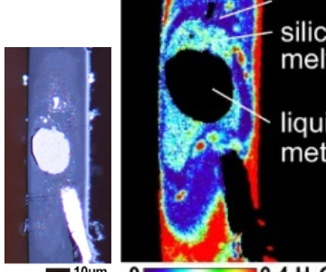

<b>翻訳：</b> 『大学の教え方の授業』 来年、発売予定！

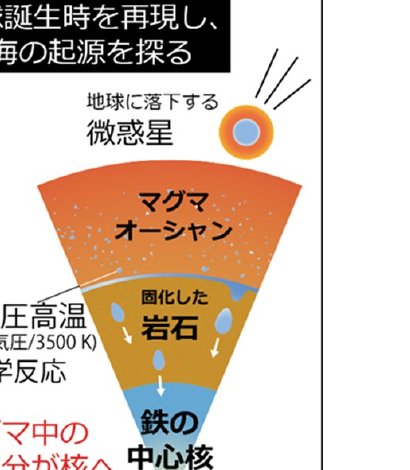

地球誕生時を再現し、海の起源を探る

<!--
- 始める前に簡単に自己紹介を。田川翔といいます。現在は千葉大学で教育企画の仕事を行っている教員で、研究テーマは大学教育と生成AIの関係です。
- この似顔絵はポスターを真似てChatGPTに描いてもらいました。もともとの研究テーマは地球の起源、海の量がなぜ決まったのかです。博士課程まで超高圧・高温の実験をしていました。来年、『大学の教え方の授業』の翻訳も発売予定です。
-->

---

1　イントロ

# 今日の目的

1.　イントロ / <b>職場が持つAIの印象を知る</b>

2.　<b>AIを実際に使ってみる</b>

3.　<b>AIの背景にある考え方</b>を知る

4.　<b>教育利用上の注意点</b>を知る (時間がない場合省略)

5.　<b>活用例で、</b>体験する (時間がない場合省略)

6.　<b>教育応用を考えてみる</b>

7.　教育応用のアイデアを共有し、AIをどう使うか考える

各セッション 15分 / 途中休憩あり / 部分受講可

<!--
- 今日の目的です。1イントロで職場が持つAIの印象を知り、2AIを実際に使ってみて、3AIの背景にある考え方を知る。4教育利用上の注意点、5活用例での体験は時間がなければ省略します。6教育応用を考え、7アイデアを共有してAIをどう使うか考えます。
- 各セッション15分、途中休憩あり、部分受講可です。
-->

---

原則

# 今日の結論　原則

－　AIを試す/情報収集することは、<b>重要</b>

－　多くのAIは、<b>安全性に配慮されている</b>

－　学生が直接使う場合や扱えるデータには、<b>制限がある</b>ので、 　　　「注意点」を理解

－　先生の仕事を支援する”助手”と考える

<!--
- 今日の結論、原則です。AIを試す・情報収集することは重要。多くのAIは安全性に配慮されている。学生が直接使う場合や扱えるデータには制限があるので「注意点」を理解する。そして、先生の仕事を支援する“助手”と考える、ということです。
-->

---

2　使ってみる

# AIの種類

<b>AIの定義 (例)</b>：人間の思考プロセスと同じような形で動作するプログラム／人間が知的と感じる情報処理やそれを行う科学・技術 『R6 科学技術イノベーション白書 (第一章)』文部科学省 (2024)

AIはいろいろなところにすでにある

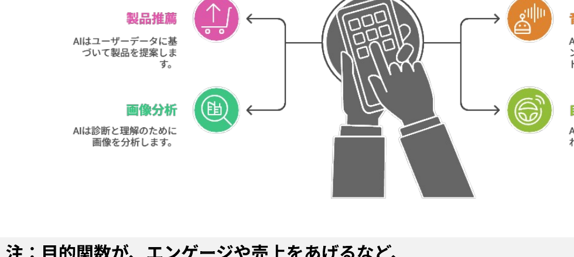

<b>注：目的関数が、エンゲージや売上をあげるなど、「サービス提供側 (≠あなた)」にしか利益を与えない場合もある</b> cf. 『マインドハッキング: あなたの感情を支配し行動を操るソーシャルメディア』ワイリー (2020)

<!--
- AIの定義の例。人間の思考プロセスと同じように動作するプログラム、人間が知的と感じる情報処理やそれを行う科学・技術です。AIはすでに製品推薦・画像分析・音声アシスタント・自動運転など、いろいろなところにあります。
- 注意として、AIの目的関数が、エンゲージや売上をあげるなど「サービス提供側(≠あなた)」にしか利益を与えない場合もあります。
-->

---

2　使ってみる

# 生成AIってなんだ？

大規模なデータから学習し、新たなコンテンツやアイデアを生成するAIの一種

マルチモーダル

テキスト、画像、音声、動画など、異なるデータ形式（モーダル）を同時に扱い、統合するAIシステム

Chat GPT　Gemini

分野特化

特定の機能を持っているAI

DALL·E 2　Veo　Whisper

ツール

AIを組合せて、特定の問題解決に役立つAI

NotebookLM　napkin ai

<b>近年、AIエージェント化</b>：AIエージェントとは、ユーザーの目標達成のために最適な手段を、自律的に選択してタスクを遂行するAIの技術。deep researchなどが有名

生成AIずかん

<!--
- 生成AIとは、大規模なデータから学習し、新たなコンテンツやアイデアを生成するAIの一種です。テキスト・画像・音声・動画を扱うマルチモーダル（ChatGPT、Gemini）、特定機能の分野特化（DALL·E 2、Veo、Whisper）、組合せて問題解決に役立つツール（NotebookLM、napkin ai）があります。
- 近年はAIエージェント化が進んでいます。エージェントとは、ユーザーの目標達成のために最適な手段を自律的に選択してタスクを遂行する技術で、deep researchなどが有名です。
-->

---

2　使ってみる

# 最も性能がよいAI 2025/6/12

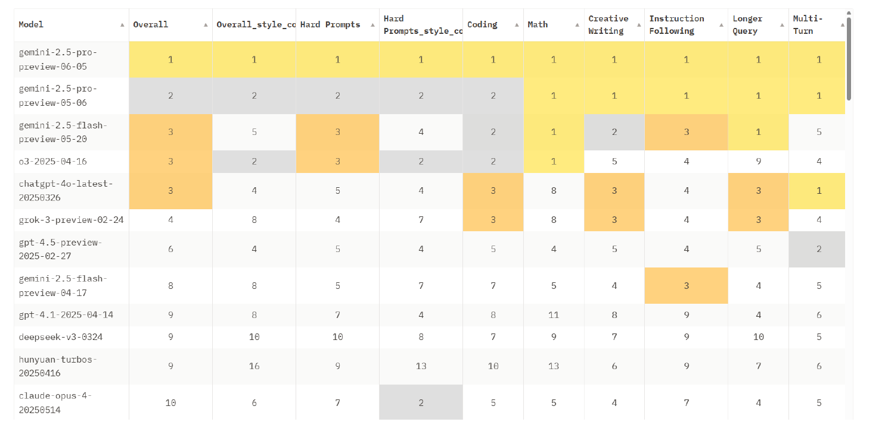

https://huggingface.co/spaces/lmarena-ai/chatbot-arena-leaderboard

<!--
- 2025年6月12日時点で最も性能がよいAIのランキングです。LM Arenaのchatbot arena leaderboardから。総合だけでなく、難問・コーディング・数学・創作・指示追従などカテゴリ別に評価されています。日々入れ替わるので、最新を確認しましょう。
-->

---

2　使ってみる

# 生成AIでできること

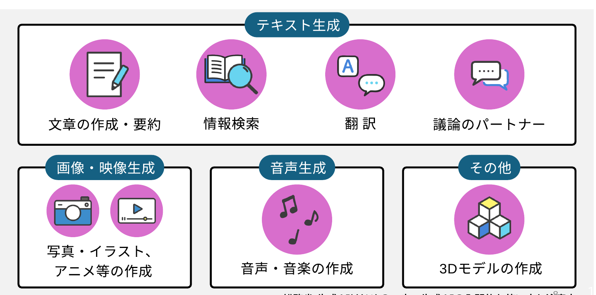

<b>総務省 生成AIはじめの一歩～生成AIの入門的な使い方と注意点～</b>

<!--
- 生成AIでできることを整理した図です。テキスト生成では文章の作成・要約、情報検索、翻訳、議論のパートナー。画像・映像生成では写真・イラスト・アニメ等の作成。音声生成では音声・音楽の作成。その他に3Dモデルの作成などがあります。総務省「生成AIはじめの一歩」より。
-->

---

2　使ってみる

# 生成AIの活用領域

何をしたか

プライバシーの保護を保った状態で、400万以上のClaude.aiの会話を分析 →どの経済的タスクにAIが利用されているか把握 米国労働省のO*NET実会話DBから類似性分類

全体として分かったこと

① Software 開発とWritingで半分 
② 36%の職業にAIが利用されている 
③ スキル増強：自動化 = 57 : 43

<b>教育での利用</b>：チュータリングタスクが多い

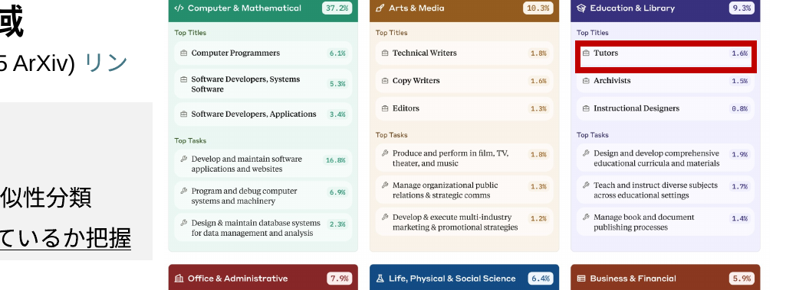

Anthropic (2025 ArXiv)

<!--
- 生成AIの活用領域について、Anthropicの2025年のArXiv論文から。プライバシーを保った状態で400万以上のClaude.aiの会話を分析し、どの経済的タスクにAIが使われているかを、米国労働省のO*NET実会話DBから類似性分類で把握しました。
- 全体として、①ソフトウェア開発とWritingで半分、②36%の職業にAIが利用されている、③スキル増強と自動化の比は57対43。教育での利用ではチュータリングタスクが多いことが分かりました。
-->

---

2　使ってみる

# ワーク：AIを使ってみる

<b>Step 1)</b> <b>Gemini か、MS copilot</b>など、<b>学校で使われているAI</b>を開いて下さい。

<b>Step 2)</b> 以下のプロンプトをそれぞれ流してみて下さい。

・生成AIとはなにか、説明して下さい。 ・わかりにくいので、高校生にも分かるよう、説明して下さい ・(わかりにくい場合) わかりにくいので、3文で説明して下さい

<b>Step 3)</b> 意図的にハルシネーションさせてみましょう (例)

・宮崎東高の校長先生は誰ですか？ ・地球の核に水はどのくらいありますか ・5 cmの綿に、10 cmのレンがを乗せると、高さ何cm?

※余裕がある場合、「自信なかったら答えないように」頼んだ質問もやってみて下さい。

<!--
- ワークです。Step1、GeminiかMS copilotなど学校で使われているAIを開いてください。Step2、生成AIとは何か、高校生にも分かるように、3文で、と順に説明させてみてください。
- Step3、意図的にハルシネーションさせてみましょう。宮崎東高の校長先生は誰か、地球の核に水はどのくらいあるか、5cmの綿に10cmのレンガを乗せると高さ何cmか、など。余裕があれば「自信がなかったら答えないように」と頼んだ質問もやってみてください。
-->

---

2　使ってみる

# ワーク：AIを使ってみる

<b>Step 4)</b> <b>YouTubeまたはPDFを開き、動画の書き起こしを開き、コピー、AIに日本語で要約させて下さい。</b>

例：https://www.youtube.com/watch?v=6dHmu1GALmA

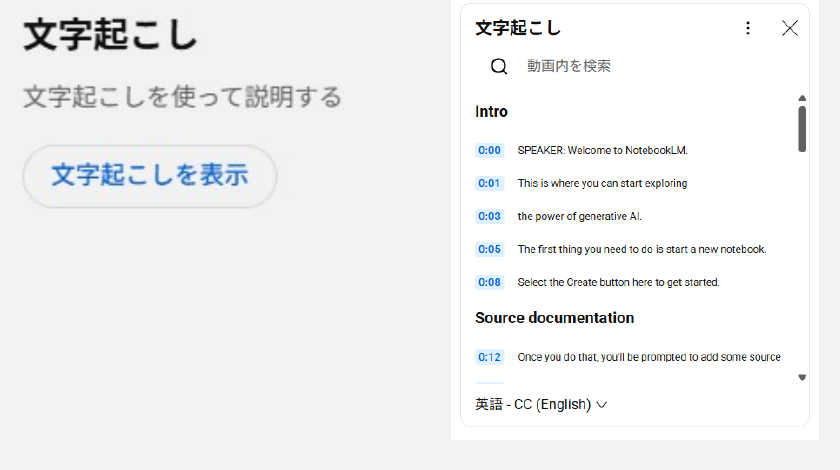

→AIにコピペ

“以下は、動画の書き起こしを添付したものです。その内容を200文字で要約して下さい”

<!--
- Step4、YouTubeまたはPDFを開き、動画の書き起こしを開いてコピーし、AIに日本語で要約させてください。
- 動画の文字起こし画面からテキストをコピーしてAIに貼り付け、「以下は動画の書き起こしです。その内容を200文字で要約して下さい」と頼みます。
-->

---

2　使ってみる

# ワーク：AIを使ってみる

<b>Step 5)</b> 与えた情報(コンテキスト)内を情報を検索してみましょう

“与えた情報によれば、Notebook LMでは、どのようなファイルを使えるんですか”

<b>Step 6)</b> 議論のパートナーにする

“私は科目〇〇の高校の先生です。NotebookLMは、自分の担当する科目でどう使えそうですか？”

<b>Step 7)</b> 理解を確かめる

“与えた情報から、Notebook LMを自分が理解したかを確かめる、三択問題を2問、この動画から作成して下さい。”

<b>Step 8)</b> 情報検索をしてみる

“Notebook LMは、高校生でもつかえるんですか?”

<!--
- Step5、与えた情報（コンテキスト）内を検索させます。「与えた情報によれば、Notebook LMではどのようなファイルを使えるか」など。Step6、議論のパートナーにする。「私は科目〇〇の高校の先生です。NotebookLMは自分の担当科目でどう使えそうか」。
- Step7、理解を確かめる。「与えた情報から、Notebook LMを理解したか確かめる三択問題を2問、この動画から作成して」。Step8、情報検索をしてみる。「Notebook LMは高校生でもつかえるんですか?」これは次のスライドで答え合わせをします。
-->

---

2　使ってみる

# 生成AIを使う上で

重要な力1<b>AIと対話の文脈を作る</b>

<b>AIと対話の文脈を作る</b> 　<b>= 思考錯誤し、自分が必要な支援を引き出す</b>

自分が積極的にAIに問いかけてみる ／ 適切な情報一覧を与えてあげる 自分が動かないと、AIは良い回答を出してくれない。能動的に。

重要な力2<b>ハルシネーションの発生を念頭に、信頼できる情報を見極める。</b>

多分、ハルシネーションしたり、社会・概念のフレームを理解しない回答をしたりしている

“Notebook LMは、高校生でもつかえるんですか?”　<b style="color:var(--accent-dark)">正解：いいえ。年齢制限のため、使えません。</b>

AIも、生徒と同じで、正しい判断ができるためには、<b>正しい事前知識をプロンプトに入れてあげる</b>と良い

<!--
- 生成AIを使う上で大事なのは2つの力。1つ目は「AIと対話の文脈を作る」＝試行錯誤して自分が必要な支援を引き出すこと。能動的に問いかけ、適切な情報一覧を与えないと、AIは良い回答を出してくれません。
- 2つ目は、ハルシネーションを念頭に、信頼できる情報を見極めること。AIも生徒と同じで、正しい判断には正しい事前知識をプロンプトに入れてあげるのが良い。
-->

---

2　使ってみる

# 生成AIとハルシネーション

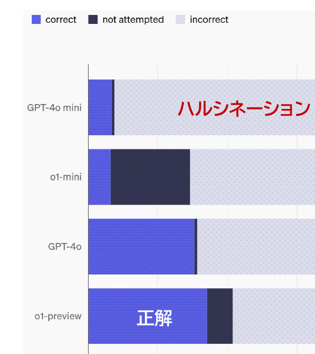

<b>SimpleQA</b>：回答の事実的正確性のベンチマーク Wei et al. (2024) <i>Arxiv</i>

<b>学習している知識が少ない場合の例</b> 知識のエッジ(=学習回数小)にある内容も含めてある 例) Q. Who received the IEEE Frank Rosenblatt Award in 2010?　A. Michio Sugeno

その他の例

古い情報だった・誤った情報を学習していた／AIが考えるべきことを誤解し、なんか変だ／別の分野の文脈に引きずられていた・偏っていた／差別やバイアスが含まれていた／推論ミス、別のところを参照 etc…

問題を解かせたり、論文を探させた場合等、無料版である<b>AI</b>は、「分からない」ということもなく、ハルシネーション(誤情報を出す)する可能性が高い <b>誤っている可能性を知り、信頼の高い情報を参照し正確性を確認</b>　※ 相当ある

ハルシネーションは結構頻繁に起こる <b>(特に無料版の場合)</b>

<!--
- SimpleQAは回答の事実的正確性を測るベンチマーク。学習回数の少ない「知識のエッジ」にある内容も含むので、無料版のAIは「分からない」と言わずにハルシネーション（誤情報を出す）する可能性が高い。
- 原因は、古い情報、別分野への引きずられ、バイアス、推論ミスなどさまざま。誤っている可能性を前提に、信頼の高い情報を参照して正確性を確認しましょう。
-->

---

2　使ってみる

# 現在の生成AIの変化 ①

<b>△ 生成AIにただ聞いて回答させる</b>

内部の学習データから回答を出す

<b>間違うことがある</b>　例：宮崎県の観光地を教えて → ○　／　例：日本のAI基本法を教えて → ☓

<b>○ 生成AIに、情報を与え、自分がほしい情報に変換してもらう</b>

与えたデータから回答を出す

間違いは、だいぶ減る

現在：生成AIはツール・エージェント(助手みたいなもの)になっている

AIの回答を確認するAI、webを検索するAIなどが繋がる

<!--
- 生成AIにただ聞いて内部の学習データから答えさせると間違うことがある。たとえば「宮崎県の観光地」は答えられても「日本のAI基本法」は外す。
- 一方、情報を与えて「自分がほしい情報に変換してもらう」使い方なら間違いはだいぶ減る。今の生成AIはツール・エージェント＝助手のような存在で、回答を確認するAIやwebを検索するAIなどが繋がって動いています。
-->

---

2　使ってみる

# AI agentの動きの例

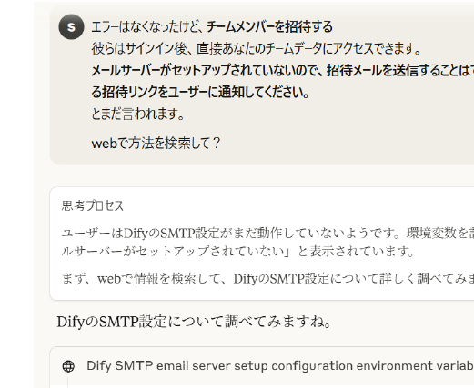

<b>グラウンディング：</b> 　AIが生成する回答を、特定の信頼できる情報源（ソース）にしっかりと結びつける技術

昔：

AI

→

回答

今：

データ

→

AI

→

回答

<b>「因果推論」「思考ツール」</b>になりつつある

<b>“ガチャ”状態：</b> 当たりまで何回もデータ・指示を変え試す

<!--
- グラウンディングとは、AIの回答を信頼できる情報源（ソース）に結びつける技術。
- 昔は「AI→回答」と直接答えていたが、今は「データ→AI→回答」のようにソースを参照して答える。AIは因果推論・思考ツールになりつつある。当たりが出るまで何度もデータや指示を変えて試す“ガチャ”状態でもあります。
-->

---

2　使ってみる

# 教員の仕事とAIの親和性

AIにおしえてあげる ＝ AIも生徒と同じで、<b>正しい判断ができるためには正しい事前知識をプロンプトに入れてあげる</b>と良い

AIを、何でも知っている先生としてとらえるの<b>ではなく</b>、 <b>「読み書き・推論は賢く、常識もあり、疲れずないけど専門性はないので教えて上げるべき助手」</b>として捉えてみる

「<b>与えた情報の変換</b>」や「<b>一般性のある回答</b>」には使える 昨今は、AI自体もwebページを参照していることがある

良い質問をするには、「評価」をあらかじめ、イメージする <b>逆向き設計の授業設計のように、メタいところから</b>考える

<b>教えることに近い</b>ので、<b>学校の先生はAIを使いこなせる</b>

<!--
- AIに教えてあげる＝AIも生徒と同じで、正しい判断のためには正しい事前知識をプロンプトに入れると良い。
- AIを「何でも知っている先生」ではなく、「読み書き・推論は賢く常識もあり疲れないが、専門性はないので教えるべき助手」と捉える。良い質問には、逆向き設計のように「評価」をあらかじめイメージしてメタな視点から考える。教えることに近いので、学校の先生はAIを使いこなせます。
-->

---

3　背景を知る

# そもそも、なんで？

疑問点

<b>AIの中身は、どうなっているのだろう？</b>  <b>そもそもなんで、間違えるのか？</b>  <b>間違えることはなくならないのか</b>

AIを使いこなすためには、メカニズムをある程度、知る必要がある

→ AIをただ、使うだけでは、わからない！！！ 　　実際、大学でも教員にAIのメカニズムを教えることが増加

<!--
- ここからは「3 背景を知る」。AIの中身はどうなっているのか、なぜ間違えるのか、間違いはなくならないのか、という疑問に向き合います。
- AIを使いこなすにはメカニズムをある程度知る必要がある。ただ使うだけでは分からない。実際、大学でも教員にAIのメカニズムを教えることが増えています。
-->

---

3　背景を知る

# ワーク：ハルシネーションの例

<b>この問題を直接貼り付けて、AIに解かせてみて下さい。</b> 【問題】aを実数の定数とする。xについての方程式 |x² − 2x − 3| = a(x − 2) の、異なる実数解の個数を求めよ。思考プロセスをステップバイステップで詳細に記述しながら、結論を導き出してください。

誤った回答の例　Gemini 2.5 flash

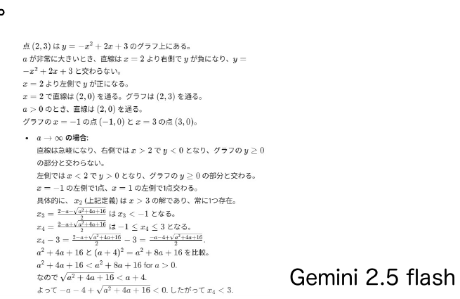

出力例：6/12　https://claude.ai/share/8e82983f-275b-427e-8ea3-aef898cd0bd7

<b>なんで、こんなトンチンカンなことになるのか？</b> <b>そのためには、機械学習を考えることになります…</b>

<!--
- ワークです。絶対値を含む方程式の実数解の個数を求める問題をAIに直接貼り付けて解かせてみてください。
- Gemini 2.5 flashの出力では、誤った回答になりました。なんでこんなトンチンカンなことになるのか。それを理解するには、機械学習を考えることになります。
-->

---

3　背景を知る

# 機械学習で、データの関係性をどう考えるか

<table style="border-collapse:collapse; width:100%; font-size:24px;">
<thead><tr style="background:var(--accent); color:#fff;"><th style="padding:8px 0; width:50%;">x</th><th style="padding:8px 0;">f(x)</th></tr></thead>
<tbody>
<tr><td style="border:1px solid #cdd5e0; text-align:center; padding:6px;">1</td><td style="border:1px solid #cdd5e0; text-align:center; padding:6px;">3</td></tr>
<tr><td style="border:1px solid #cdd5e0; text-align:center; padding:6px;">2</td><td style="border:1px solid #cdd5e0; text-align:center; padding:6px;">5</td></tr>
<tr><td style="border:1px solid #cdd5e0; text-align:center; padding:6px;">3</td><td style="border:1px solid #cdd5e0; text-align:center; padding:6px;">7</td></tr>
<tr><td style="border:1px solid #cdd5e0; text-align:center; padding:6px;">4</td><td style="border:1px solid #cdd5e0; text-align:center; padding:6px;">?</td></tr>
</tbody>
</table>

<b>変換する「函」</b> <b>確率・統計的に処理</b>

ルールベースの世界観 (設計者が教えておく)

解析的に解くよ 等差数列っぽい？ <b>→ Yes</b> f(x) = 2x+1？ ならば9と予想

機械学習の世界観 (もっとたくさん学習！)

入力されたデータからパターンをコンピュータが探索・発見 <b>f(x)自体は気にしない</b> 9とか11？

<b>正解が出てくるとは限らない／ブラックボックス</b> <b>ブラックボックス内を理解する手法は開発中</b>　e.g. Anthropic (2025) AI顕微鏡

<b>データの関係性の捉え方が根本的に違う</b>

<!--
- ルールベースの世界に生きるAIは、解析的な解き方を教えられている。たとえば一次式を試してf(x)=2x+1だから x=4で9だぞ、と。高校までの数学はこういう考え方をしますね。
- でも機械学習の世界では、f(x)がどうなっているかはどうでもよく、xとf(x)の関係性を学習して次を予測するだけ。f(x)の式そのものはブラックボックスで構わない。だから9以外に11と言うかもしれない。データの関係性の捉え方が根本的に違うのです。
-->

---

3　背景を知る

# 箱としての、ディープラーニング (深層学習)

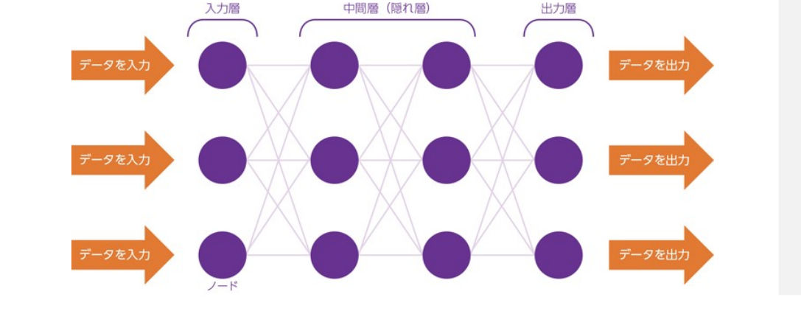

『R1 総務省 情報通信白書』総務省(2019)

学習

入力

<b>パラメーター の函</b> 数字の羅列

出力

更新 ↺ 評価

利用

入力

<b>パラメーター の函</b> 数字の羅列

出力

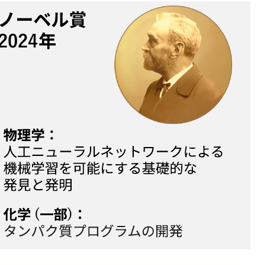

<!--
- このブラックボックス部分をどんな形にするか、という設計はあります。人工ニューラルネットワーク、その発展型である深層学習（Deep Learning）です。今年のノーベル賞でもありますね。
- 物理学賞は人工ニューラルネットワークによる機械学習を可能にする基礎的な発見と発明、化学賞の一部はタンパク質プログラムの開発。複数のパラメータを配置し、学習データとは異なるものを確率的につくる。意味を直接設計するのではなく、膨大なパラメータから機械的に意味を生成する方法が、いまのAIの背景にあります。
-->

---

3　背景を知る

# 箱としての、ディープラーニング (深層学習)

言語型の大規模言語モデル (生成AIの中身) の本質

日本の首都__ →日本の首都は__ →日本の首都は東京__

ネクストワードプレディクション

<b>これまでのコンテキストから、次の言葉(トークン)の確率を予想する問題</b>

学習

入力 文字

<b>パラメーターの函</b> 数字の羅列

出力

更新 ↺ 評価

GPT 4の場合、アメリカ議会図書館の<b>全蔵書の約22倍</b>に相当? ※書籍、記事、ウェブサイト、コードなど幅広いテキストソース

<!--
- 生成AIの時代に来ます。よく想像されるのはChatGPTのような言語を扱うAIでしょう。これもニューラルネットワークモデルで、入力データが複数の層を通って出力されます。
- 言葉を操る生成AIはネクストワードプレディクション、つまり次に出てくる言葉（トークン）の確率を予測するAI。「日本の首都__」から次の語を予測していく。GPT-4の学習データは、アメリカ議会図書館の全蔵書の約22倍に相当するとも言われます。
-->

---

3　背景を知る

# 大規模言語モデルを生成AIにする

<table style="border-collapse:collapse; width:100%; font-size:23px;">
<tbody>
<tr>
<td style="border:1px solid #cdd5e0; padding:10px 16px; width:24%; font-weight:800; background:var(--accent-soft); color:var(--accent-dark);">チューニング ・RLHF</td>
<td style="border:1px solid #cdd5e0; padding:10px 16px;">人間にとって自然な回答をするよう、トレーニングする (good/bad)</td>
</tr>
<tr>
<td style="border:1px solid #cdd5e0; padding:10px 16px; font-weight:800; background:var(--accent-soft); color:var(--accent-dark);">ガードレールの作成</td>
<td style="border:1px solid #cdd5e0; padding:10px 16px;"><b style="color:var(--accent-dark)">AIの安全性を向上させる</b>　(AIに危険/不適切なことを言わせない)</td>
</tr>
<tr>
<td style="border:1px solid #cdd5e0; padding:10px 16px; font-weight:800; background:var(--accent-soft); color:var(--accent-dark);">倫理的課題の解決 バイアスの低減</td>
<td style="border:1px solid #cdd5e0; padding:10px 16px;">トレーニングデータ上のバイアスを減らす</td>
</tr>
<tr>
<td style="border:1px solid #cdd5e0; padding:10px 16px; font-weight:800; background:var(--accent-soft); color:var(--accent-dark);">ツールの接続</td>
<td style="border:1px solid #cdd5e0; padding:10px 16px;">計算やweb検索など、モジュールを接続する</td>
</tr>
</tbody>
</table>

市販のAIは、<b>人間中心の原則</b>に従い、かなりの注意して作成されている

<!--
- 大規模言語モデルを生成AIにするには、いくつかの工程があります。チューニング・RLHFで人間にとって自然な回答をするようトレーニングし、ガードレールでAIの安全性を向上させ、倫理的課題やバイアスを低減し、計算やweb検索などのツールを接続する。
- 市販のAIは、人間のニーズ・能力・制約を最優先に考慮する「人間中心の原則」に従い、かなりの注意をして作成されています。
-->

---

4　注意点

# 生成AI活用にあたって注意すべきポイントは？

生成AI活用にあたって 注意すべきポイントは？

情報の正確性

情報流出

知的財産権の侵害

活用者としてのモラル

<b>総務省　生成AIはじめの一歩～生成AIの入門的な使い方と注意点～</b> https://www.soumu.go.jp/use_the_internet_wisely/special/generativeai/

コンパクトに纏まっているので、ぜひ、ご活用ください

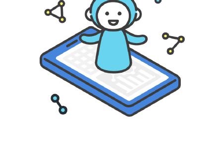

<!--
- ここからは「4 注意点」。生成AIを使う上で注意すべき4つのポイントを学習します。情報の正確性、情報流出、知的財産権の侵害、活用者としてのモラルです。
- まずは情報の正確性に関すること。総務省の「生成AIはじめの一歩」はコンパクトに纏まっているので、ぜひご活用ください。
-->

---

4　注意点

# 偽・誤情報に騙されない・拡散しないため、3つのポイントを常に意識する

ポイント１

人は信じたいものを選ぶ（認知バイアス）ので、無意識のうちに合理的ではない行動、偏った判断をすることがあるという意識をもつ

ポイント２

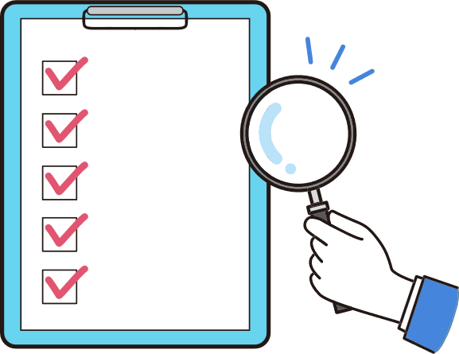

チェックリストを用いて真偽を判断する

ポイント３

チェックリストを用いて判断しても騙されるので、安易に拡散しない / 拡散したいときは ひと呼吸おく

Source: 総務省「インターネットとの向き合い方〜ニセ・誤情報に騙されないために〜」

<!--
- 生成AIの技術は急速に進展しており、人間が情報の真偽を判断することは難しくなることが予想されます。
- 自分が被害者、加害者にならないため、3つのポイントを常に意識しましょう。
- 1つ目は、人は信じたいものを選ぶので、無意識のうちに合理的ではない行動、偏った判断をすることがあるという意識をもつこと、2つ目は、チェックリストを用いて真偽を判断すること、3つ目は、チェックリストを用いて判断しても騙されるので、安易に拡散しない、また拡散したいときはひと呼吸おくことです。
-->

---

4　注意点

# チェックシートを用いて判断する

基 本

☑ <b>情報源</b>はある？

☑ その分野の<b>専門家</b>？

☑ <b>他ではどう言われている</b>？

☑ その画像は<b>本物</b>？

応 用

☑ 「<b>知り合いだから</b>」 という理由だけで信じていないか？

☑ <b>表やグラフ</b>も疑ってみた？

☑ その情報に<b>動機</b>はある？

☑ <b>ファクトチェック</b>結果は？※1

Source: 総務省「インターネットとの向き合い方〜ニセ・誤情報に騙されないために〜」

<!--
- 2つ目に意識すべきポイントは、チェックリストを用いて真偽を判断することです。
- 情報源は信用できるか、他のメディアではどういわれているか、その画像/表/グラフは本物か、ファクトチェックの結果はどうかなど、1つ1つ確認することが大切です。
-->

---

4　注意点

# 生成AIにより偽・誤情報が生成される可能性事例

偽・誤情報の事例 ❶

ある生成AIサービスに以下の指示を入力すると、問題のあるリストが生成された。

西日本で最も高い山のTOP10を教えてください

生成されたリストの課題

実在しない山の名前が含まれる 標高が不正確

偽・誤情報の事例 ❷

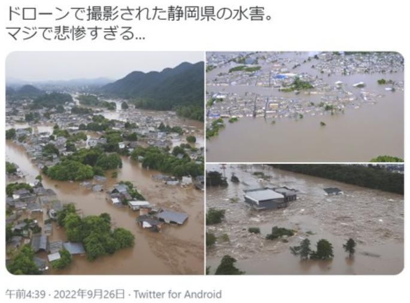

2022年9月、台風15号による水害被害が発生している静岡県の画像がSNS上で拡散。その後投稿者は、画像生成AIで作成した偽画像だったと公表。

Source: 生成AIサービスを用いて回答を作成、NHK「SNSで拡散 “AI生成の偽の災害画像” ファクトチェックはどうする」

<!--
- 生成AIによりもっともらしい偽・誤情報が生成される可能性に注意が必要です。
- 例えば、生成AIサービスに指示を入力すると、実在しない内容が含まれていたり、数字が不正確だったりすることがあります。
- また、水害被害の画像がSNSで拡散されたところ、実は画像生成AIで作成した偽画像だったという事例があります。
-->

---

4　注意点

# 情報流出を防ぐため、3つの行動を心がける

行動１

生成AIサービスの<b>規約を確認</b>（データの利用目的や範囲等）また利用規約の変更時には<b>変更箇所をチェック</b>

行動２

個人情報や機密情報の入力は<b>必要最小限</b>

行動３

生成AIに入力したデータを<b>学習に使わせないように設定</b>（オプトアウト設定）※1

<!--
- 情報流出を防ぐため、3つの行動を心がけることが大切です。
- まずは、生成AIサービスの規約で、データの利用目的や範囲等を確認し、利用規約の変更時には変更箇所をチェックするようにしましょう。
- その上で、個人情報や機密情報の入力を必要最小限にするよう注意しましょう。
- また、利用する生成AIサービスで設定が可能であれば、入力したデータを学習に使わせないように設定しましょう。
-->

---

4　注意点

# ワーク：オプトアウトを確認する

先生が今お使いのAIは、学習されますか？ どうなっていますでしょうか

Copilot

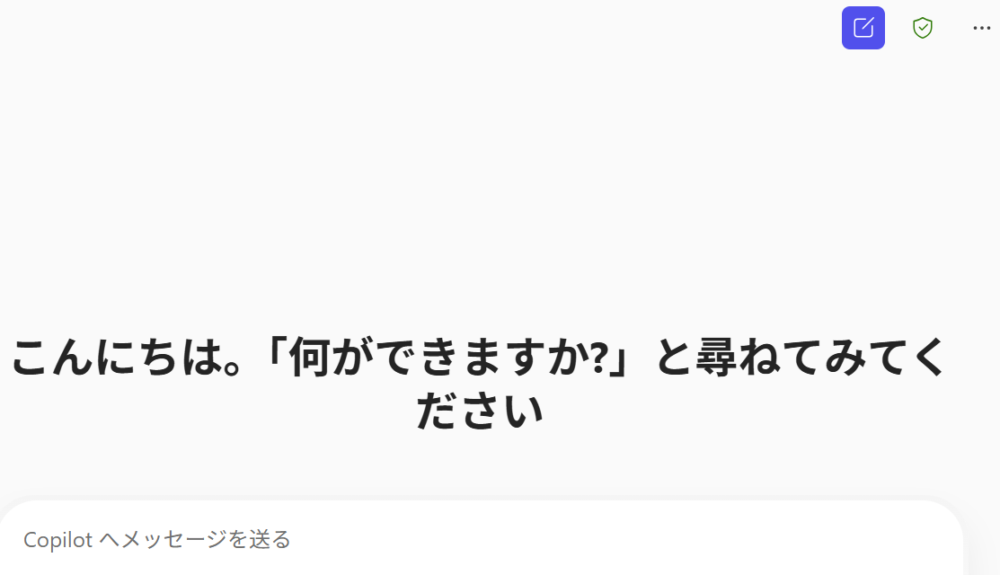

Gemini

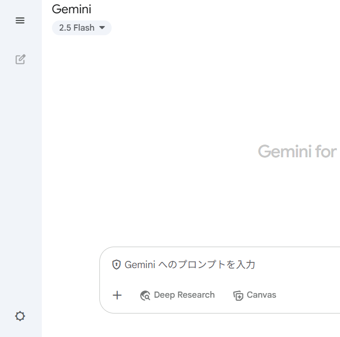

海外の第三者が見ることも…→<b>個人情報保護法違反</b>になりえるので注意

<!--
- 情報流出を防ぐため、3つの行動を心がけることが大切です。
- まずは、生成AIサービスの規約で、データの利用目的や範囲等を確認し、利用規約の変更時には変更箇所をチェックするようにしましょう。
- その上で、個人情報や機密情報の入力を必要最小限にするよう注意しましょう。
- また、利用する生成AIサービスで設定が可能であれば、入力したデータを学習に使わせないように設定しましょう。
-->

---

4　注意点

# ある海外企業では、生成AIに機密情報を入力し情報が流出事例

2023年3月、海外の電子機器メーカーで生成AIの使用による、<b>社内情報流出</b>が立て続けに発生

情報流出の内容 ❶

<b>社内機密のソースコード</b>を生成AIに入力し、修正を依頼 (2件)

💻→

生成AI

情報流出の内容 ❷

<b>社内会議の録音データ</b>を音声認識アプリで文章に変換して生成AIに入力し、議事録を作成 (1件)

→

生成AI

<!--
- ある海外企業では、社員が生成AIの仕組みへの理解が不十分であったため、生成AIに機密情報を入力してしまい、情報が流出するトラブルが発生しました。
- ビジネスで利用する場合は、自社の機密情報の取扱いについて十分留意する必要があります。
-->

---

4　注意点

# 配慮すべき知的財産権

利用例１

既存の<b>著作物</b>と類似している生成物を、アップロードして公表/複製物を販売

▼

⚠ 著作権

利用例２

商標や意匠として登録されている<b>ロゴ・デザイン等</b>と同一または類似している生成物を商用利用

▼

⚠ 商標権・意匠権

利用例３

生成AIを利用して生成された<b>著名人の氏名、肖像等</b>を商用利用

▼

⚠ パブリシティ権

<b>差止請求・損害賠償請求等の民事訴訟</b>や、<b>刑事罰</b>の対象となることも

Note: 一方、生成AIへの入力段階では、著作物のデータは、原則として著作権者の許諾なく利用できる ／ Source: 総務省「インターネットとの向き合い方〜ニセ・誤情報に騙されないために〜」

<!--
- 生成AIの普及により、偽情報・誤情報の増加が問題になっています。
- 著作権・商標権・意匠権・パブリシティ権など、配慮すべき知的財産権を、利用例とともに確認します。
- 差止請求・損害賠償請求等の民事訴訟や、刑事罰の対象となることもあります。一方、生成AIへの入力段階では、著作物のデータは原則として著作権者の許諾なく利用できます。
-->

---

4　注意点

# 教育として必要なこと

<b>Terms of use (利用規約)</b> を読む / AIに読み込ませる

<table style="width:100%; border-collapse:collapse; font-size:22px;">
<tr style="background:var(--section-bg);">
<th style="text-align:left; padding:4px 14px; width:24%; border:1px solid #ddd;">サービス</th>
<th style="text-align:left; padding:3px 14px; border:1px solid #ddd;">年齢・利用条件</th>
</tr>
<tr>
<td style="padding:3px 14px; border:1px solid #ddd; font-weight:800;">ChatGPT</td>
<td style="padding:3px 14px; border:1px solid #ddd;">13才以上は可だが、<b>18才未満は保護者同意必須</b></td>
</tr>
<tr>
<td style="padding:3px 14px; border:1px solid #ddd; font-weight:800;">Gemini</td>
<td style="padding:3px 14px; border:1px solid #ddd;">13才以上可　<b>但し学校版は管理者の許可必須</b> ※ APIの利用/Studio/gem/NotebookLMの利用は不可</td>
</tr>
<tr>
<td style="padding:3px 14px; border:1px solid #ddd; font-weight:800;">Claude</td>
<td style="padding:3px 14px; border:1px solid #ddd;">18才以上可</td>
</tr>
<tr>
<td style="padding:3px 14px; border:1px solid #ddd; font-weight:800;">Copilot</td>
<td style="padding:3px 14px; border:1px solid #ddd;">13才以上可 (MS365 Copilotは 2025夏に13才以上に変更)</td>
</tr>
</table>

<b>※K-12向けAIは「みんなのコード」や「Khanmigo (米国向け)」など限られる</b>（安全性を考え、順次拡大中ではある）

<!--
- 教育として必要なことは、まず利用規約 (Terms of use) を読むこと、あるいはAIに読み込ませることです。
- サービスごとに年齢制限や利用条件が異なります。ChatGPTは13才以上可だが18才未満は保護者同意必須、Geminiは学校版は管理者の許可必須、Claudeは18才以上、Copilotは13才以上などです。
- K-12向けのAIは「みんなのコード」や米国向けのKhanmigoなど限られますが、安全性を考え順次拡大中です。
-->

---

5　活用例

# ワーク：注意点の確認方法

<b>Notebook LM を使った、注意点の確認方法 (画面でみせます)</b>

① “文科省通知『初等中等教育段階における生成AIの利活用に関するガイドライン』” (第二版)のpdfをダウンロードしてください

② NotebookLMを開き、ソースにpdfをアップロードしてください。

③ 質問し、「高校でのAIの利用において、遵守しないと行けない点」をまとめて、見つけて見てください。(後ほど、slido上で伺います)

<b>個人情報保護はどうでしょうか</b> ／ <b>具体例や事例を考えてもらいましょう</b>

<b>応用：</b> <b>解説音声や問題、その解説を作って見てください</b>

初等中等教育段階における生成AIの利活用に関するガイドライン <a>https://www.mext.go.jp/a_menu/other/mext_02412.html</a>

<b>※生徒は年齢制限上使用不可</b>

Google の取り組みについて：「Googleの使命は、世界中の情報を整理し、世界中の人がアクセスできて使えるようにすること」／ Google labs の中に、幾つかの開発中の製品があり、教育への影響もありそうです（例：Illuminate＝何でもソクラテス化：説明文や論文を対話的な解説に変えてしまうAI）

<!--
- ワークです。NotebookLM を使った、注意点の確認方法を画面でお見せします。
- 文科省通知のガイドライン(第二版)のpdfをダウンロードし、NotebookLMにソースとしてアップロードして、「高校でのAIの利用において遵守しないといけない点」をまとめて見つけてください。後ほどslidoで伺います。
- 個人情報保護はどうか、具体例や事例も考えてもらいましょう。応用として、解説音声や問題・その解説を作ってみてください。生徒は年齢制限上使用不可な点に注意。
-->

---

5　活用例

# ガイドライン（学校で利用する場面・ポイント）

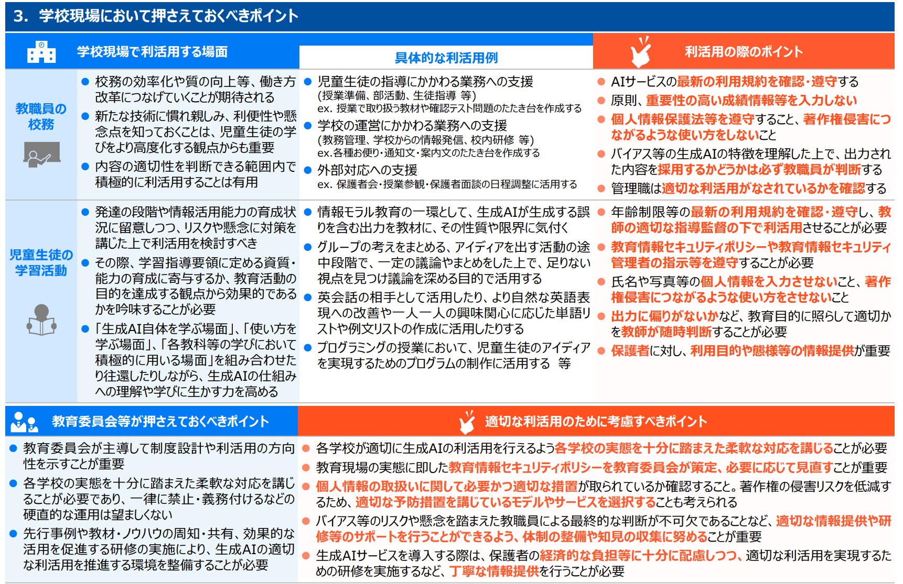

<a>https://www.mext.go.jp/content/20241226-mxt_shuukyo02-000030823_003.pdf</a>

<!--
- 文科省ガイドラインのうち、学校現場において押さえておくべきポイントの表です。教職員の役割・児童生徒の学習活動・教育委員会等のそれぞれについて、利用する場面・具体的な利活用例・利活用の際のポイントが整理されています。
-->

---

5　活用例

# ガイドライン（利活用のチェック項目）

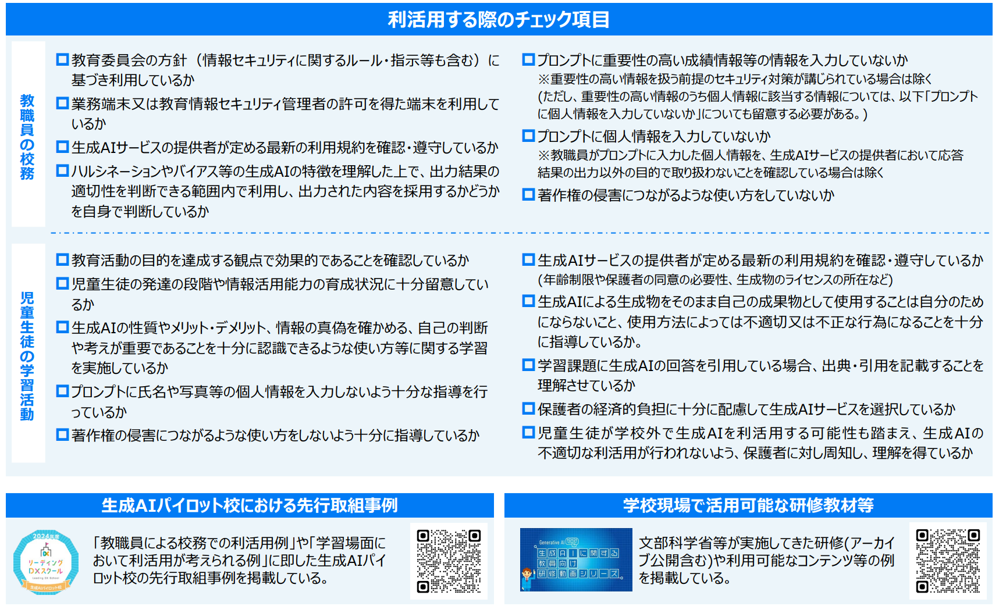

<a>https://www.mext.go.jp/content/20241226-mxt_shuukyo02-000030823_003.pdf</a>

<!--
- 続いて、利活用する際のチェック項目です。教育委員会・学校管理職・教職員それぞれの観点で、生成AIのパイロット的な取り組みや本格的な利活用に向けたチェック項目が示されています。
-->

---

5　活用例

# deep researchでまとめた、高校の注意点・活用事例

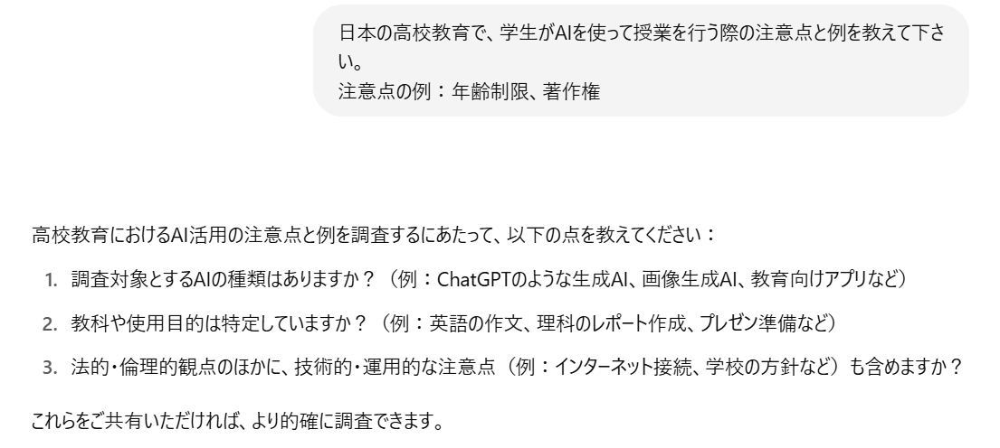

<a>https://chatgpt.com/s/dr_6849f71f583c81919120833c46eebd16</a>

※ ハルシネーション

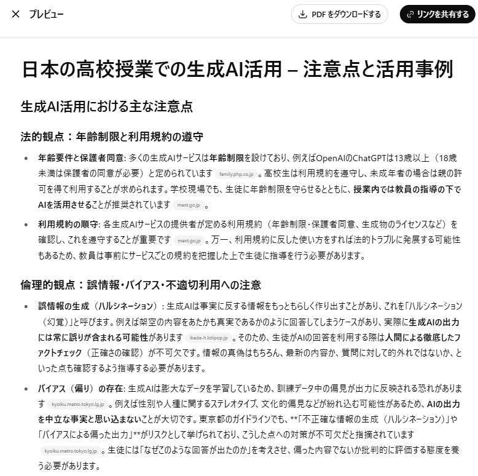

自分は、まとめられた情報を見るのではなく、<b>何がソースか</b>を見ている

<!--
- deep researchでまとめた、高校での生成AI活用の注意点・活用事例です。
- ただし、deep researchの出力にもハルシネーションが含まれる可能性があります。
- 私自身は、まとめられた情報そのものを見るのではなく、何がソースかを見るようにしています。
-->

---

5　活用例

# 良いプロンプトを書くコツ

生成AIから最適な回答を得るための指示（プロンプト）の工夫を "<b>プロンプトエンジニアリング</b>" と呼ぶ

1
<b style="font-size:22px;">目的・詳細な設定・ 検討の材料を書く</b>

この質問は、XXXを作成するために聞いています なお、8月の夏休みに行く旅行について検討しています XXXの文脈に絞って、XXXについて教えてください

2
<b style="font-size:22px;">欲しい回答の例を与える</b>

XXXのような事例を探しています 以下の例を参考に、類似のものを調べてください

3
<b style="font-size:22px;">書式/回答方法を制限する</b>

横軸がAとBとCである表形式で答えてください XXX文字以内で答えてください／要点をXXX個挙げてください

4
<b style="font-size:22px;">文章のテイストを指定する</b>

私は10歳の子供だと思って説明してください XXX (有名な作家 等) の文体で説明してください 女子高生になりきって説明してください

今のAIは、幾分、簡単な質問でも答えるようになった ／ <b>複雑なことをさせるには必要</b>

<!--
- 生成AIから欲しい情報を得るために、指示入力にはいくつかのコツがあります。
- 代表的な4つのコツをご紹介します。
- ①目的、詳細な設定、検討の材料を書く
- 　目的や背景を説明すると、意図に沿った回答を得やすくなります。
- ②欲しい回答の例を与える
- 　例をいくつか提示すると、類似の回答を得やすくなります。
- ③書式、回答方法を制限する
- 　回答の形式、字数、回答の個数などを具体的に指定することで、目的に沿った回答を得やすくなります。
- ④文章のテイストを指定する
- 　誰に対する回答かを想定して指示することで、文脈に沿った回答を得やすくなります。
- なお、このような指示の工夫を、「プロンプトエンジニアリング」と呼びます。
-->

---

5　活用例

# 良いプロンプトを書くコツ　7R法

図表5-1　プロンプト上手になるための7つのポイント

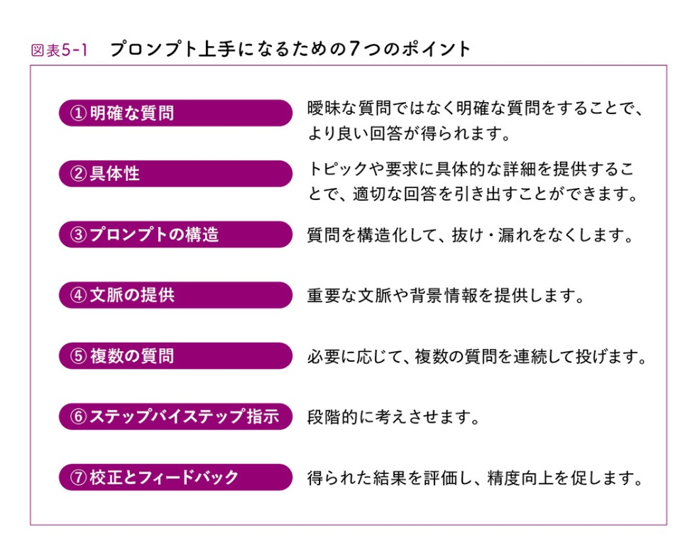

簡易プロンプト

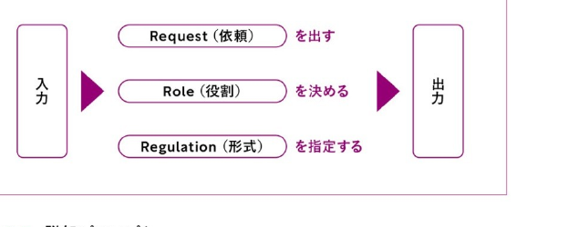

詳細プロンプト

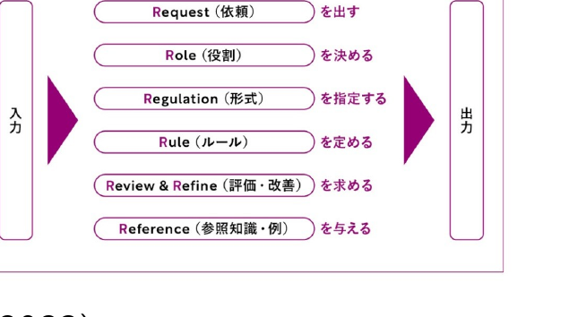

野口 竜司 (2023). 『ChatGPT時代の文系AI人材になる』東洋経済新報社.

<!--
[NOTE なし]
-->

---

5　活用例

# 良いプロンプトを書くコツ　gem デモ

<b style="color:var(--accent-dark);"># 役割 (Role)</b> AIに担ってほしい専門家やキャラクターを設定します。 例：小学生に教えるのが得意な、明るく優しい先生 
<b style="color:var(--accent-dark);"># 命令 (Instruction)</b> AIに実行してほしい、最も重要なタスクを明確に記述します。 例：納豆の魅力について、子供向けに解説してください。 
<b style="color:var(--accent-dark);"># 文脈 (Context)</b> このタスクの背景や、回答を作る上で考慮してほしい状況を伝えます。 例：対象読者は、食べ物の好き嫌いが多い小学校3年生です。 
<b style="color:var(--accent-dark);"># 参照 (Reference)</b> AIに読み込ませたい情報（文章、データ、ファイル名など）を指定します。 例：添付のPDF「natto_data.pdf」を読んでから回答してください。 
<b style="color:var(--accent-dark);"># 形式 (Format)</b> 出力してほしい形を具体的に指定します。 例：表形式で、各列は「栄養素」「働き」「多く含まれる食べ物」にしてください。 
<b style="color:var(--accent-dark);"># ルール (Rules)</b> 回答を作成する上での、具体的な制約や必ず守ってほしい条件を箇条書きにします。 ・【含めること】：必ず「ネバネバパワー」という言葉を入れてください。 ・【禁止すること】：難しい科学用語（例：ビタミンK2）は使わないで下さい。

<b>目的</b> どういう意図か？／含めること／禁止すること

<b>背景</b> 背景知識／プロンプトのターゲット

<b>出力スタイル</b> 量／形式／抽象度・具体度／順番

メタプロンプトを作る (予め、ロールプレイする方法を伝えておく、等) AIにプロンプトを作らせるプロンプトを作る

探究プロンプトも似た構造 → 上手いプロンプトの構造を持ってきて書き換える／AIに書かせる

<!--
[NOTE なし]
-->

---

5　活用例

# AIに関する勉強方法

①<b>使い込んでいる人の使い方</b>を見る

②<b>模範例のプロンプトを書き換えてみる</b>

③<b>めんどう・よだきいとなったら、 　AIに外注できないか</b>、考えてみる

④<b>しっくりくる回答が来るまで、試行錯誤する</b>

⑤webにある無料講座などを履修する

<!--
[NOTE なし]
-->

---

5　活用例

# プロンプトの小技　1. 画像からの文字起こし

OCRの代用

意味を考えるので間違えにくい

○ a lot of ☓ a 1ot of

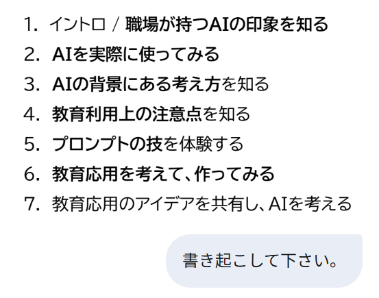

<!--
[NOTE なし]
-->

---

5　活用例

# プロンプトの小技　2. (デモのみ) 動画からの文字起こし

<b>田川の講義動画をアップロードし、いろいろと聞いてみましょう</b> 
－ 問題を作ってみる　－ 教え方を工夫するうえで、何をすべきか聞いてみる － 要約を作ってみる　－ 精緻的質問を行ってみる

注意点： 
Google AI studioは、オプトアウトできません(AIが学習に使ってしまう) 。 
今回の動画は、公開されているので、webに使用できる状態です。

3. (デモのみ) napkin AIによる図表化

<!--
[NOTE なし]
-->

---

6　教育活用

# 授業の流れと使い所

先進活用事例

授業での活用事例
https://leadingdxschool.mext.go.jp/achieve/ai/

日常での活用事例

授業準備

学習指導要領参照 関係資料の検索 レジュメ作成支援 授業案作成支援

授業

教材 (調べ学習) (不明点の理解)

小テスト

問題案作成 回答・解説案作成 誤答案作成

評価

評価基準作成

(分析)

※個人情報上 難しい

校務：絵を作る、機密にかからない文案作成/添削 公開された省庁資料の分析や生徒指導提要の例を作成等

生徒の受け取り方 壁打ち

その他、無限の可能性がありそうです！

<!--
[NOTE なし]
-->

---

6　教育活用

# ハンズオン　問題の解説を考えましょう

① AIに解かせたい、入試・定期試験などの問題を一つ選んでください。 　　回答があることが望ましいです。記述式のほうが良いかもしれません。

② 問題文だけをAIに投げて、解説させてください。 　　ハルシネーションはおきましたか？

<!--
[NOTE なし]
-->

---

6　教育活用

# ハンズオン　問題の解説を考えましょう

③ 今度は、問題といっしょに、解説と答えを含めて、送付してみましょう。 　　次に、AIに解説を詳しくするよう、頼んで下さい。

④ AIに意図を説明しましょう。 　　何を学生に学び取ってほしいのか、等。

<!--
[NOTE なし]
-->

---

6　教育活用

# ハンズオン　問題の解説を考えましょう

⑤ 学生は、どんな誤答をしがちか、聞いてみましょう。 　　その理由はなにか、表形式でまとめるよう、AIに聞いてみて下さい。

⑥ 類題を作ってみましょう。問題の形式、回答の有無、 　　難易度などは、指定しましょう

<!--
[NOTE なし]
-->

---

6　教育活用

# ハンズオン：評価のための補足　ルーブリック

<b>✔</b> 採点道具の一つで、課題を構成要素に分け、<b>要素ごとに評価基準を満たすレベル</b>を説明した表 
✔ パフォーマンス課題・レポート・実技等の評価の可視化

「<b>課題内容</b>：6分模擬授業」を評価するためのルーブリック

<table style="border-collapse:collapse; width:100%; font-size:18px;">
<tr style="background:var(--accent); color:#fff;">
<th style="padding:6px 8px; border:1px solid #ccc;">評価観点</th>
<th style="padding:6px 8px; border:1px solid #ccc;">素晴らしい(2)</th>
<th style="padding:6px 8px; border:1px solid #ccc;">合格(1)</th>
<th style="padding:6px 8px; border:1px solid #ccc;">不十分(0)</th>
</tr>
<tr><td style="padding:4px 8px; border:1px solid #ccc; font-weight:800; background:var(--accent-soft);">分量</td><td style="padding:4px 8px; border:1px solid #ccc;"></td><td style="padding:4px 8px; border:1px solid #ccc;">6分間で丁度</td><td style="padding:4px 8px; border:1px solid #ccc;">過剰か少ない</td></tr>
<tr><td style="padding:4px 8px; border:1px solid #ccc; font-weight:800; background:var(--accent-soft);">目標</td><td style="padding:4px 8px; border:1px solid #ccc;">明確かつ内容が一致していた</td><td style="padding:4px 8px; border:1px solid #ccc;">明確さか内容の何れかに改善点</td><td style="padding:4px 8px; border:1px solid #ccc;">明確さ・内容の何れも不十分</td></tr>
<tr><td style="padding:4px 8px; border:1px solid #ccc; font-weight:800; background:var(--accent-soft);">レベル設定</td><td style="padding:4px 8px; border:1px solid #ccc;">手を伸ばせば届くレベルだった</td><td style="padding:4px 8px; border:1px solid #ccc;">一部高度・容易な箇所があった</td><td style="padding:4px 8px; border:1px solid #ccc;">極端に高度・容易であった</td></tr>
</table>

← 評価尺度↑ 評価基準

ルーブリックにより、安定・充実した評価が可能に → AIは上手　参照

栗田 &amp; 中村（2024）「インタラクティブ・ティーチング 実践編３」／スティーブンス＆レビ (2014)

<!--
[NOTE なし]
-->

---

6　教育活用

# ハンズオン　問題の解説を考えましょう

⑦ 問題が記述式の場合、採点する際のルーブリックと採点基準について、 　　作ってもらいましょう。(ルーブリックの場合、観点数と尺度数も与える)

⑧ (有料版の場合　※デモ) 　　それを体験してもらうツール・コードを作りましょう

<!--
[NOTE なし]
-->

---

6　教育活用

# 例：問題の解説をしてもらおう

以下の問題があります。<b>自分は、真ん中２つの街の真ん中だと答えました。正解は、真ん中２つの街の上、または間なら、どこでも良い、になるんだそうです。</b>この状況の問題を学生に解説したいです。絵を作ってもらえませんか。

私は砂漠の石油王で、たまたま一直線上に位置している四つの町に石油を届けることになっている。その四つの町を順番に回るのだが、次の町へ行く前に必ず石油タンクに戻らなければならない。移動距離をもっとも短くするにはどこにタンクを置けばいいだろうか？王族の友人がいて私か望めば無料でいくらでも道路を建設してくれるから、道路の心配はいらない。

オックスフォード大学《数学》

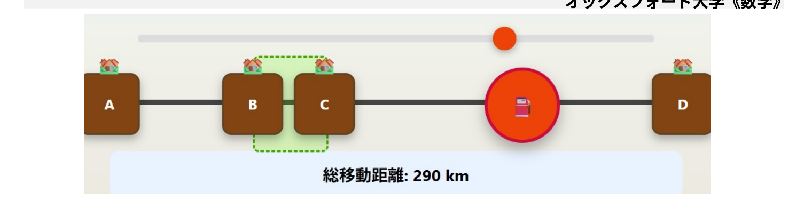

ツール：https://claude.ai/public/artifacts/2bb7e14c-1df9-4c01-ae3e-45fe6edeb43b　／　プロンプト：https://claude.ai/share/5c053617-2718-41f7-8319-0ed0ea2e2012

<!--
- 6 教育活用。例：問題の解説をしてもらおう。オックスフォード大学《数学》の問題。一直線上の四つの町に石油を届ける石油王が、移動距離を最短にするタンクの位置を問う。学生に解説する絵をAIに作ってもらった例。
-->

---

6　教育活用

# (時間がある場合) 探究の支援ツールにする

実際の教育活用の技を体験する

① web検索可能なAI (deep researchなど)で、 調べるべき内容を教員が一気に検索しておく

② その内容で得られた「リンク」をもとに、 学生の調べ学習の参考資料を出す (もちろん学生自身が自分で検索できることも重要)

③ 学生はGeminiで要約したり、理解するための道具 としたり、教科との関連付けを調べたりする

<!--
- 6 教育活用。時間がある場合、探究の支援ツールにする。①web検索可能なAIで教員が一気に検索 →②得られたリンクで学生の参考資料を出す（学生自身が検索できることも重要）→③学生はGeminiで要約・理解・教科との関連付けに使う。
-->

---

6　教育活用

# 学びのための学生が使えるAIの活用例

なぜ誤答だったのか、聞いてみる

※直接聞くより間違えにくい

自分は、〇〇と答えたけども、答えは△だった。自分はどこで勘違いしたのか？

精緻的質問をしてみる

※読書にも有効

なぜそうなっているのか？どのようになっているのか？

他の捉え方を聞いてみる

※読書にも有効

△について、自分は、〇〇と考えた。他の考え方はあるか。

<!--
- 6 教育活用。学びのための学生が使えるAIの活用例。①なぜ誤答だったのか聞く（直接聞くより間違えにくい）②精緻的質問をしてみる（なぜ・どのように。読書にも有効）③他の捉え方を聞いてみる（読書にも有効）。
-->

---

6　教育活用

# 学びのための学生が使えるAIの活用例

関連付け

△について習ったことがある。□になりたい。〇はどう関係するのか？✕のいい比喩はないか？

リフレクションや言語化のシミュレーション

〇〇と言葉にしたけど伝わる?復習したいからコーチして

英語で話してみる

※文法は完璧

I'm preparing for an upcoming presentation about AI…

<!--
- 6 教育活用。続き。①関連付け（習ったこと・なりたいこと・関係・比喩を聞く）②リフレクションや言語化のシミュレーション（言葉にしたが伝わるか、復習のコーチ）③英語で話してみる（文法は完璧）。
-->

---

7　AIとの関わり方

# AIは「教える」のどこに影響するか

参考職業への影響

<b style="color:#C0182B;">AIの影響が大きく、代替性が高い職業：</b>事務的タスクのシェアが大きい職業。▶ つまり、AIがとって変わってしまう職業

<b>AIの影響が大きく、補完性が高い職業：</b>事務的タスクのシェアが大きいものの、意思決定の重要性が高く、AI任せとすることが社会的に望ましくない職業。▶ AIを使いこなす必要のある職業

<b>AIの影響の小さい職業：</b>物理的タスクのシェアが大きい職業。

※ 教員・研究者(自然科学系)は、青の領域

内閣府(2024) 世界経済の潮流 ＞第1章＞p.13

<!--
- 7 AIとの関わり方。参考：職業への影響（内閣府2024 世界経済の潮流 第1章 p.13）。AIの影響が大きく代替性が高い職業（事務的、AIに取って代わられる）／影響大きく補完性が高い職業（意思決定が重要、使いこなす必要）／影響の小さい職業（物理的）。教員・研究者（自然科学系）は青の領域。
-->

---

7　AIとの関わり方

# AIは「教える」のどこに影響するか

<b>Does ChatGPT enhance student learning? A systematic review and meta-analysis of experimental studies</b>　Deng et al. (April 2025) <i>Computers &amp; Education</i> 
ChatGPTが主に(85%)大学生の学習に与える影響について、2022年から2024年にかけて発表された69本の教育実践をシステマティック・レビューしたもの (※語学32%)

<b>Academic performance (学業成績)</b>

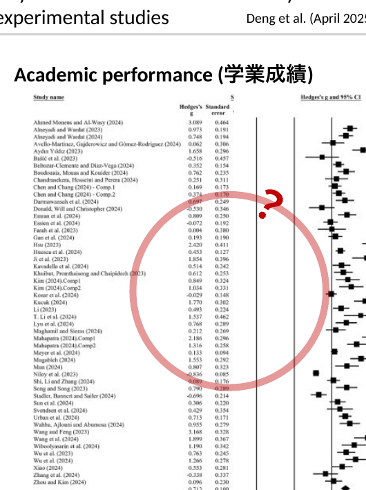

<b>縦軸：</b>各研究名

<b>Hedge's g：</b>各研究の効果量を示す。大きいほど研究のサンプルサイズが大きく、結果の精度が高い (0.5で中程度、0.8を超えると大)。

<b>ひげ：</b>各研究の効果量の95%信頼区間（CI）を示す。この線が0をまたがなければ、その研究は統計的に有意な効果を持つことを示す。

<b>見方</b>　中央の0を基準とし、- 右側は「ChatGPT利用が学習効果を高める」- 左側は「ChatGPTが逆効果または効果なし」

<b>結論</b>　一番下の菱形（ダイヤモンド）：全研究を統合した全体の効果量、菱形の中央が全体の効果量。<b style="color:var(--accent-dark);">学業成績を高める効果がある</b>とわかる。

<b style="color:#C0182B;">注意点：</b>An alternative explanation for the improved academic performance could be the higher quality of work produced with ChatGPT's assistance／9件の研究では、ChatGPTの使用を許可した状態でポストテストを行ったと明記されている（例：Bašić et al., 2023; Li, 2023）。33件の研究では、ChatGPTの使用が明示されておらず不明である。

<!--
- 7 AIとの関わり方。Deng et al. (2025) Computers & Education のメタ分析。主に大学生(85%)を対象、2022-2024の69本（語学32%）。学業成績のフォレストプロット。Hedge's g、95%CI、ひげが0をまたがなければ有意。一番下の菱形が統合効果量で、学業成績を高める効果があるとわかる。注意点：成果物の質が高かったことが別の説明になりうる／9件は使用許可下でポストテスト、33件は不明。
-->

---

7　AIとの関わり方

# AIは「教える」のどこに影響するか

<b>Does ChatGPT enhance student learning? A systematic review and meta-analysis of experimental studies</b>　Deng et al. (April 2025) <i>Computers &amp; Education</i> 
ChatGPTが主に(85%)大学生の学習に与える影響について、2022年から2024年にかけて発表された69本の教育実践をシステマティック・レビューしたもの (※語学32%)

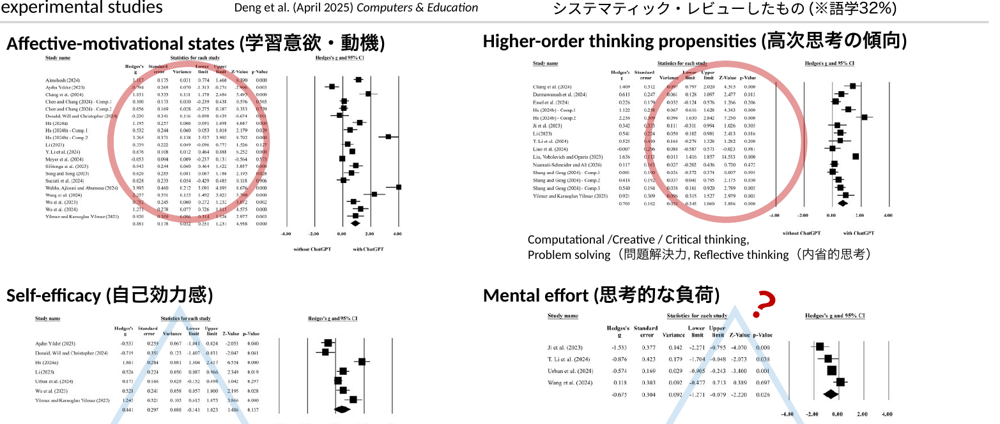

<b>Affective-motivational states (学習意欲・動機)</b>

<b>Higher-order thinking propensities (高次思考の傾向)</b> Computational / Creative / Critical thinking, Problem solving（問題解決力, Reflective thinking（内省的思考）

<b>Self-efficacy (自己効力感)</b>

<b>Mental effort (思考的な負荷)</b>

<!--
- 7 AIとの関わり方。同じDeng et al. (2025) のメタ分析の続き。学業成績以外の側面：学習意欲・動機（Affective-motivational states）、高次思考の傾向（Higher-order thinking：計算的・創造的・批判的思考、問題解決力、内省的思考）、自己効力感（Self-efficacy）、思考的な負荷（Mental effort）のフォレストプロット。
-->

---

7　AIとの関わり方

# AIと学びの考え方 (例)

学習・学修の過程で絶対に使うな、という意味<b>ではない</b>

学生の現状

⇒

<b style="color:var(--accent-dark);">ねらい：</b> どこに向かうのか (授業の存在価値)

<b style="color:var(--accent-dark);">達成目標：</b> 何が出来るようになるのか

<b style="color:var(--accent-dark);">評価：</b> どのように測るのか

<b style="color:var(--accent-dark);">設計：</b> どのように教えるのか

⇒

学修後の状態

逆向き設計

目標や設計を損なう形で使ってはいけない

<b>「AIができることをただ出力する、ということは、AIで事足りるので採用する必要はない」ということ</b>　Teaching with AI (Bowen &amp; Watson, AAC&amp;U 2024)

<b>AIができない「高次」の価値を作るために、引き続き学ぶ必要はある</b>

<b>学びの場合、コスパ・タイパのために、AIを悪用してはいけません</b> <b>自律的に学びを深めるために、活用する文脈を学生と作りましょう</b>

<!--
- 7 AIとの関わり方。AIと学びの考え方（例）。絶対に使うなという意味ではない。逆向き設計（ねらい→達成目標→評価→設計）の目標や設計を損なう形で使ってはいけない。「AIができることをただ出力するだけならAIで事足りるので採用不要」（Bowen & Watson, Teaching with AI, AAC&U 2024）。AIができない高次の価値のために学ぶ必要はある。コスパ・タイパのために悪用せず、自律的に学びを深める文脈を学生と作る。
-->

---

7　AIとの関わり方

# 学習目標から考えるAIの影響学習目標分類

<table style="border-collapse:collapse; font-size:19px; flex:1.2;">
<tr><th style="border:1px solid #bbb; padding:5px 8px; background:var(--accent-soft);"></th><th style="border:1px solid #bbb; padding:5px 8px; background:var(--accent-soft);">認知的領域 (知識や思考)</th><th style="border:1px solid #bbb; padding:5px 8px; background:var(--accent-soft);">学びへの生成AIの影響</th></tr>
<tr><td rowspan="4" style="border:1px solid #bbb; padding:5px 8px; text-align:center; font-weight:800; color:var(--accent-dark);">高次</td><td style="border:1px solid #bbb; padding:5px 8px;">創造 (学習を応用し、新しい価値を作れる)</td><td style="border:1px solid #bbb; padding:5px 8px;">人の創造性こそが大切</td></tr>
<tr><td style="border:1px solid #bbb; padding:5px 8px;">評価 (事物・判断等を比較し評価出来る)</td><td style="border:1px solid #bbb; padding:5px 8px;">評価軸/価値/判断は人が設定する</td></tr>
<tr><td style="border:1px solid #bbb; padding:5px 8px;">分析 (要素に分け、関係性を指摘できる)</td><td style="border:1px solid #bbb; padding:5px 8px;">解答/過程の支援可(例：要約・構造化・コーディング)</td></tr>
<tr><td style="border:1px solid #bbb; padding:5px 8px;">応用 (他の場面や状況に使用できる)</td><td style="border:1px solid #bbb; padding:5px 8px;">単なる問題では、 AIが解いてしまう…</td></tr>
<tr><td rowspan="2" style="border:1px solid #bbb; padding:5px 8px; text-align:center; font-weight:800; color:#1A6BB0;">低次</td><td style="border:1px solid #bbb; padding:5px 8px;">理解 (学習内容を説明出来る)</td><td style="border:1px solid #bbb; padding:5px 8px;">説明/例示で支援可能 だが学修者の理解必須</td></tr>
<tr><td style="border:1px solid #bbb; padding:5px 8px;">記憶 (事実や概念を暗記している)</td><td style="border:1px solid #bbb; padding:5px 8px;">支援可能だが、 学修者の記憶必須</td></tr>
</table>

学修の目標を構造化し、学びの設計を支援

※近年では、下から個別・段階的に行うのではなく、<b>複数の次元の要素を組み合わせる</b>必要性が叫ばれている。 ※近年では、学び方の学びや、人間性の涵養などを含む、学習目標分類も作成されている (e.g. Finkの学習目標分類) ※但し、<b>低次(特に記憶・理解・応用の段階)を蔑ろにして、高次の学修目標の達成は難しい</b>と想定される。

授業におけるAI利用の指針となり得る

<b>AI が答えを出せるとしても、途中を学ぶことは引き続き必要では？</b>

左は栗田&amp;中村 (2023)を元に作成 / 原著 Bloom (1956/1964)、改訂版(2001)を記載　▶学習目標分類についての、担当講師による解説動画 (9分) https://www.notion.so/geophysica/Bloom-145d8c8bc5ab80deb9dfc15b89d91875?pvs=4

<!--
- 7 AIとの関わり方。学習目標分類（ブルーム・タキソノミー）。高次=創造（人の創造性が大切）・評価（評価軸は人が設定）・分析（要約・構造化・コーディングを支援可）・応用（単なる問題はAIが解いてしまう）、低次=理解（説明・例示で支援可だが学修者の理解必須）・記憶（支援可だが記憶必須）。学修目標を構造化し設計を支援、AI利用の指針となり得る。近年は複数次元の組み合わせやFinkの分類も。但し低次を蔑ろにして高次は難しい。AIが答えを出せても途中を学ぶことは必要。左は栗田&中村(2023)、原著Bloom。
-->

---

7　AIとの関わり方

# 学び方は変わる？

14世紀 @ ドイツ

Laurentius de VoltolinaGenerated by DALL-E

<b>社会</b>も、<b>科学技術</b>も、<b>教育理論</b>も進歩でも、<b>授業は同じまま</b>？

<table style="border-collapse:collapse; font-size:21px; width:100%;">
<tr><th style="border:1px solid #bbb; padding:4px 8px; background:var(--accent-soft);"></th><th style="border:1px solid #bbb; padding:4px 8px; background:var(--accent-soft);">認知的領域</th></tr>
<tr><td rowspan="3" style="border:1px solid #bbb; padding:4px 8px; text-align:center; font-weight:800; color:var(--accent-dark);">高</td><td style="border:1px solid #bbb; padding:4px 8px;">創造</td></tr>
<tr><td style="border:1px solid #bbb; padding:4px 8px;">評価</td></tr>
<tr><td style="border:1px solid #bbb; padding:4px 8px;">分析</td></tr>
<tr><td rowspan="3" style="border:1px solid #bbb; padding:4px 8px; text-align:center; font-weight:800; color:#1A6BB0;">低</td><td style="border:1px solid #bbb; padding:4px 8px;">応用</td></tr>
<tr><td style="border:1px solid #bbb; padding:4px 8px;">理解</td></tr>
<tr><td style="border:1px solid #bbb; padding:4px 8px;">記憶</td></tr>
</table>

<b>座学の講義で理解を促すだけ</b>では、到達出来たり、授業中に試せたりする<b>目標の範囲が狭くなりがち</b>。そこで、<b>課題中心や実験中心など、「起こりそうな問題」や「実験」を設計の軸にする</b>ことで、より深く学べるようになるのでは？

<!--
- 7 AIとの関わり方。学び方は変わる？14世紀ドイツの講義風景（Laurentius de Voltolina）と現在（DALL-E生成）はほぼ同じ。社会も科学技術も教育理論も進歩したのに授業は同じまま？座学の講義で理解を促すだけでは到達・試行できる目標の範囲が狭くなりがち。課題中心・実験中心など「起こりそうな問題」「実験」を設計の軸にすることでより深く学べるのでは。
-->

---

7　AIとの関わり方

# 学び方は変わる？

積み上げて受動的に学ぶ

：学校的学び方

<svg viewBox="0 0 320 150" style="width:90%;" xmlns="http://www.w3.org/2000/svg"><polyline points="10,135 110,135 110,90 210,90 210,45 310,45" fill="none" stroke="#7B4B2A" stroke-width="3"/><circle cx="150" cy="72" r="9" fill="#fff" stroke="#999"/><text x="178" y="80" font-size="22" fill="#333">?</text></svg>

どこかで頭打ちする

最終到達点から探究的に学ぶ

：職人的/芸術家的学び方？

<svg viewBox="0 0 320 150" style="width:90%;" xmlns="http://www.w3.org/2000/svg"><polyline points="10,135 110,135 110,90 210,90 210,45 310,45" fill="none" stroke="#7B4B2A" stroke-width="3"/><circle cx="250" cy="28" r="9" fill="#fff" stroke="#999"/><text x="225" y="36" font-size="22" fill="var(--accent)">!</text></svg>

高みから中間地点を学ぶ

<b>「なぜ学ぶのか、どのように学ぶのか、何を学ぶのか」</b>の変質

まずは、自分から、学び方を変えてみよう

▶

できないかな、と思ったら<b>使ってみる</b>

<!--
- 7 AIとの関わり方。学び方は変わる？積み上げて受動的に学ぶ（学校的学び方）はどこかで頭打ちする。最終到達点から探究的に学ぶ（職人的/芸術家的学び方？）は高みから中間地点を学ぶ。「なぜ学ぶのか、どのように学ぶのか、何を学ぶのか」の変質。まずは自分から学び方を変えてみよう。できないかなと思ったら使ってみる。
-->

---

7　AIとの関わり方

# (参考) AIリテラシ OECD (2023)

AIの技術面を批判的に評価し、AIを効果的に活用できる能力 (communicate and collaborate)

第１：AIの基本的な機能と日常生活におけるAIの使用方法に関する知識

第２：様々な場面に応用することのできる能力

第３：AIを実装し、評価することができる能力

第４：アルゴリズムの開発に必要なデータを管理する能力とAIの出力結果を批判的に考察する能力

<b>AIを理解し、活用し、監視し、批判的に考察できるスキル</b>

<b>各国でリスキリング/学校教育への取り込みが行われている</b>

内閣府(2024) 世界経済の潮流 ＞第1章＞p.32

<!--
- 7 AIとの関わり方。(参考) AIリテラシ OECD (2023)。AIの技術面を批判的に評価しAIを効果的に活用できる能力（communicate and collaborate）。第1：基本的な機能と日常生活での使用方法の知識／第2：様々な場面に応用できる能力／第3：実装し評価できる能力／第4：アルゴリズム開発に必要なデータ管理と出力結果を批判的に考察する能力。AIを理解・活用・監視・批判的に考察できるスキル。各国でリスキリング/学校教育への取り込みが進む。内閣府(2024) 世界経済の潮流 第1章 p.32。
-->

---

7　AIとの関わり方

# 共同知能 Co-Intelligence

『これからのAI、正しい付き合い方と使い方』 (2024) Mollick著、久保田訳

<b>AIは人と異なる知能</b>である。「<b>異星人の心</b>」でありいくら人間っぽくても、性質が違う。

例えば、、、

AI

たくさん考えるのは得意！

言葉にするのは得意！ ニュアンスさえも。

→ AIをアイデア出し・ブレインストーミングにつかってはどうか ※自分がすることや「なぜ」をAIに聞くのは筋が悪い

人

一番本質を見抜くのが得意！

<b>感覚的にわかる！</b> なぜか間違わない。

→ AIが持っていない、タイプの知がある？

<!--
- 共同知能。Mollickの本から。AIは人と異なる知能、「異星人の心」。たくさん考える・言葉にするのはAIが得意、本質を見抜く・感覚的にわかるのは人が得意。だからAIはアイデア出しに使い、人にしかない知を活かす。
-->

---

7　AIとの関わり方

# 共同知能 Co-Intelligence

『これからのAI、正しい付き合い方と使い方』 (2024) Mollick著、久保田訳

<b>AIは人と異なる知能</b>である。「<b>異星人の心</b>」でありいくら人間っぽくても、性質が違う。

共同知能についての<b>4つのルール</b>

AIを参加させる。

人間参加型のデザインにする。

AIにペルソナを与える。

今使っているAIは、今後使用するどのAIよりも劣悪と仮定する。

+ でてきた情報を、批判的に考える 
+ 先生は学びの文脈をAIに与えてみる 
+ マイルールを作って行くことが大切

<!--
- 共同知能の4つのルール。①AIを参加させる ②人間参加型のデザインにする ③AIにペルソナを与える ④今のAIは今後のどれより劣悪と仮定する。加えて、出てきた情報は批判的に、先生は学びの文脈をAIに与え、マイルールを作っていくことが大切。
-->

---

おわり

# ご清聴いただき、 ありがとうございました

AIの影響は避けられないと思います。 
ならば、もっと生徒のためになる方向へ、 
きっと活用する道があると思います。  
「定時制だからこそできる学び」に「AI」を足すと、 
面白い事ができるはずです！ 
ともに、良い教育を作るべく、一緒に進んでいきましょう。

<!--
- ご清聴ありがとうございました。AIの影響は避けられない。ならばもっと生徒のためになる方向へ活用する道がある。「定時制だからこそできる学び」に「AI」を足すと面白い事ができる。ともに良い教育を作るべく進みましょう。
-->
