<!-- _class: cover-hero -->

2025/06/11 宮崎東高校講演会

生成AIと教える

講師：田川 翔

千葉大学 国際未来教育基幹 助教

教員の皆様：途中退出・参加自由・内職<b>OK</b>です

<!--
- タイトルコール。本日は宮崎東高校での講演「生成AIと教える」。講師は田川。
- 教員の皆様は、途中退出・参加自由・内職OKです、と最初に伝える。
-->

---

自己紹介

# 自己紹介

仕事：<b>大学教育の企画</b>／<b>学生と教員を支援</b>

専門：<b>地球の起源、AI</b> 
地球惑星科学　博士(理学) 2020年

海の起源の仮説検証 
Tagawa et al. (2021) <i>Nat. Com.</i>

<b>翻訳：</b>大学の教え方の授業　<b>来年、発売予定！</b>

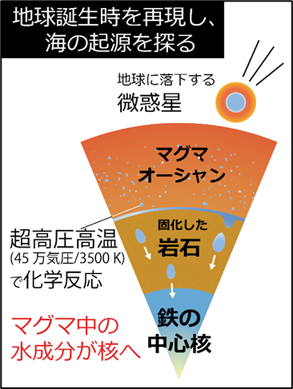

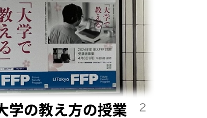

<!--
[NOTE] 始める前に、簡単に僕の自己紹介をしときましょう。名前は、田川翔といいます。現在は千葉大学の教育をより良くするために、教育企画の仕事を行っている教員です。最近の研究テーマは大学教育と生成AIの関係なので、ここに立っています。 / これ似顔絵ですね。ポスターを真似て、チャットGPTにかいてもらいました。似てますかね？ / さて、そんな私ですが、もともと研究テーマは地球の起源の解明なんですね。この惑星は、どのようにできたのか。そして、海の量はなぜきまったのか。 / そんなテーマで、博士課程まで実験していました。
-->

---

本日使用するツール

# 授業・セミナー インタラクティブ化ツール

✓匿名 / もしよければ、ぜひご参加下さい

Join at

slido.com

#6538 006

<b>PCから参加の方へ</b> 
slidoのwebページを開き、アクセスコード(7桁)を入力して下さい

<!--
- 本日はslidoというインタラクティブ化ツールを使います。匿名なので、もしよければぜひご参加下さい。
- スマホはQRコード、PCの方はslido.comでアクセスコードを入力。
-->

---

アンケート (slido)

# 授業で活用したことはありますか

スマホ・PCから <b>slido</b> でご回答ください　(#6538 006)

※ slido のライブ投票画面を表示

<!--
- ここでslido投票。授業でAIを活用したことはありますか、を聞いてみる。
-->

---

アンケート (slido)

# AIにどのような印象をお持ちですか

スマホ・PCから <b>slido</b> でご回答ください　(#6538 006)

※ slido のワードクラウド画面を表示

<!--
- 続いてslido。AIにどのような印象をお持ちですか、をワードクラウドで集める。
-->

---

アンケート (slido)

# AIは高校教育にどんな影響を与えそうですか (複数回答可)

スマホ・PCから <b>slido</b> でご回答ください　(#6538 006)

※ slido のライブ投票画面を表示（複数回答可）

<!--
- slido。AIは高校教育にどんな影響を与えそうか、複数回答可で聞く。
-->

---

今日の目的

# 今日の目的

1.　イントロ / <b>職場が持つAIの印象を知る</b> 
2.　<b>AIを実際に使ってみる</b> 
3.　<b>AIの背景にある考え方</b>を知る 
4.　<b>教育利用上の注意点</b>を知る (時間がない場合省略) 
5.　<b>活用例で、</b>体験する (時間がない場合省略) 
6.　<b>教育応用を考えてみる</b> 
7.　教育応用のアイデアを共有し、AIをどう使うか考える

各セッション <b>15分</b> / 途中休憩あり / 部分受講可

<!--
- 今日の目的は7つ。職場のAI印象を知る→使ってみる→背景の考え方→注意点→活用例→教育応用→共有。
- 各セッション15分、途中休憩あり、部分受講可。
-->

---

グランドルール

互いに学び合う、協力的環境づくり

－　<b>積極的に</b>ご参加頂きたい 
－　<b>3Kなフィードバック</b>「敬意を持って」「忌憚なく」「建設的に」 
－　<b>職位に関係なく、ざっくばらんに</b>話せる

<!--
- グランドルールは「互いに学び合う、協力的環境づくり」。
- 積極的に参加、3Kなフィードバック（敬意・忌憚なく・建設的に）、職位に関係なくざっくばらんに。
-->

---

アンケート (slido)

# AIに関する課題感はなにですか？ 今日、一番期待することはなんですか。

スマホ・PCから <b>slido</b> でご回答ください　(#6538 006)

※ slido のオープン回答画面を表示

<!--
- slido。AIに関する課題感、今日一番期待することを自由記述で集める。
-->

---

今日の結論

原則

－　AIを試す/情報収集することは、<b>重要</b> 
－　多くのAIは、<b>安全性に配慮されている</b> 
－　学生が直接使う場合や扱えるデータには、<b>制限がある</b>ので、「注意点」を理解 
－　先生の仕事を支援する”助手”と考える

<!--
- 今日の結論＝原則。AIを試す/情報収集は重要、多くのAIは安全性に配慮、学生の直接利用や扱えるデータには制限があるので注意点を理解、そして先生の仕事を支援する“助手”と考える。
-->

---

AIの種類

# AIはいろいろなところにすでにある

<b>AIの定義 (例)</b>　人間の思考プロセスと同じような形で動作するプログラム／人間が知的と感じる情報処理やそれを行う科学・技術

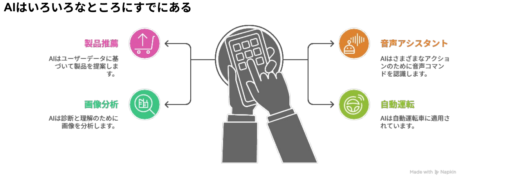

<b>注：目的関数が、エンゲージや売上をあげるなど、「サービス提供側 (≠あなた)」にしか利益を与えない場合もある</b>

cf. 『マインドハッキング: あなたの感情を支配し行動を操るソーシャルメディア』 ワイリー (2020)；『R6 科学技術イノベーション白書 (第一章)』文部科学省 (2024)

<!--
- AIはすでにいろいろなところにある。製品推薦、音声アシスタント、画像分析、自動運転など。
- 注意：目的関数がエンゲージや売上を上げるなど、サービス提供側（あなたではない）にしか利益を与えない場合もある。
-->

---

生成AIってなんだ？

大規模なデータから学習し、新たなコンテンツやアイデアを生成するAIの一種

マルチモーダル

テキスト、画像、音声、動画など、異なるデータ形式（モーダル）を同時に扱い、統合するAIシステム

Chat GPT　Gemini　Gemini

分野特化

特定の機能を持っているAI

DALL·E 2　Veo　Whisper

<b>近年、AIエージェント化</b> 
AIエージェントとは、ユーザーの目標達成のために最適な手段を、自律的に選択してタスクを遂行するAIの技術 
deep researchなどが有名

ツール

AIを組合せて、特定の問題解決に役立つAI

napkin ai　NotebookLM

生成AIずかん

<!--
- 生成AIとは、大規模なデータから学習し、新たなコンテンツやアイデアを生成するAIの一種。
- マルチモーダル（ChatGPT, Gemini）、分野特化（DALL·E 2, Veo, Whisper）、ツール（napkin ai, NotebookLM）。
- 近年はAIエージェント化。ユーザーの目標達成のため自律的に手段を選びタスクを遂行する技術。deep researchなどが有名。
-->

---

2　使ってみる

# 最も性能がよいAI 6/12

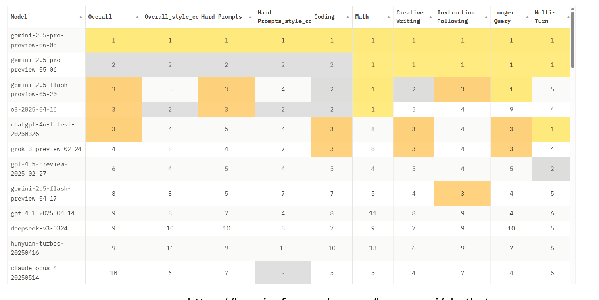

https://huggingface.co/spaces/lmarena-ai/chatbot-arena-leaderboard

<!--
- 性能のよいAIは、Chatbot Arena のリーダーボードで日々ランキングが変わる。6/12時点ではこの順位。
-->

---

2　使ってみる

# 生成AIでできること

テキスト生成

📝
文章の作成・要約

🔍
情報検索

🅰️
翻 訳

💬
議論のパートナー

画像・映像生成
📷 ▶️
写真・イラスト、 アニメ等の作成

音声生成
🎵
音声・音楽の作成

その他
🧊
3Dモデルの作成

総務省 生成AIはじめの一歩～生成AIの入門的な使い方と注意点～

<!--
- 生成AIでできることを「テキスト生成／画像・映像生成／音声生成／その他」で整理。テキストは文章作成・要約、情報検索、翻訳、議論のパートナーなど。
-->

---

2　使ってみる

# 生成AIでできること

生成AIの活用領域Anthropic (2025 ArXiv) リンク

<b>何をしたか</b> プライバシーの保護を保った状態で、400万以上のClaude.aiの会話を分析 →どの経済的タスクにAIが利用されているか把握 米国労働省のO*NET実会話DBから類似性分類

全体として分かったこと

① Software 開発とWritingで半分

② 36%の職業にAIが利用されている

③ スキル増強：自動化 = 57 : 43

<b>教育での利用</b>　チュータリングタスクが多い

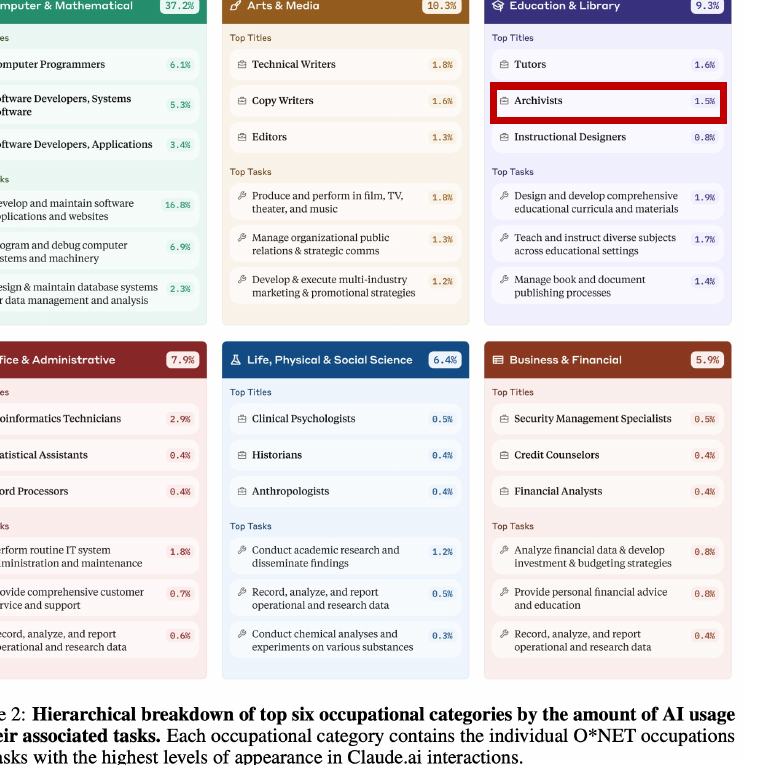

<!--
- Anthropic の研究。プライバシーを守った状態で400万以上のClaude会話を分析し、O*NETの職業タスクと照合。SW開発とWritingで半分、36%の職業で利用、スキル増強と自動化が57:43。教育ではチュータリングが多い。
-->

---

2　使ってみる

# ワーク：AIを使ってみる

<b>Step 1)</b>　<b>Gemini</b> か、<b>MS copilot</b>など、<b>学校で使われているAI</b>を開いて下さい。

<b>Step 2)　以下のプロンプトをそれぞれ流してみて下さい。</b>

・生成AIとはなにか、説明して下さい。

・わかりにくいので、高校生にも分かるよう、説明して下さい

・(わかりにくい場合) わかりにくいので、3文で説明して下さい

<b>Step 3)　意図的にハルシネーションさせてみましょう (例)</b>

・宮崎東高の校長先生は誰ですか？

・地球の核に水はどのくらいありますか

・5 cmの綿に、10 cmのレンがを乗せると、高さ何cm?

※余裕がある場合、「自信なかったら答えないように」頼んだ質問もやってみて下さい。

<!--
- 実際にAIを開いて、生成AIの説明をさせる。高校生向け・3文へと言い換えさせる。さらに意図的にハルシネーションを誘発する質問もやってみる。
-->

---

<!-- _class: intro -->

1　イントロ

📋

AIの説明はわかりやすく なりましたか？

slido で回答を共有しましょう

<!--
- slido ポーリング。AIに高校生向け・3文と頼んで、説明はわかりやすくなったかを共有する。
-->

---

2　使ってみる

# ワーク：AIを使ってみる

<b>Step 4)</b>　<b>YouTubeまたはPDFを開き、動画の書き起こしを開き、コピー、AIに日本語で要約させて下さい。</b>

例：https://www.youtube.com/watch?v=6dHmu1GALmA

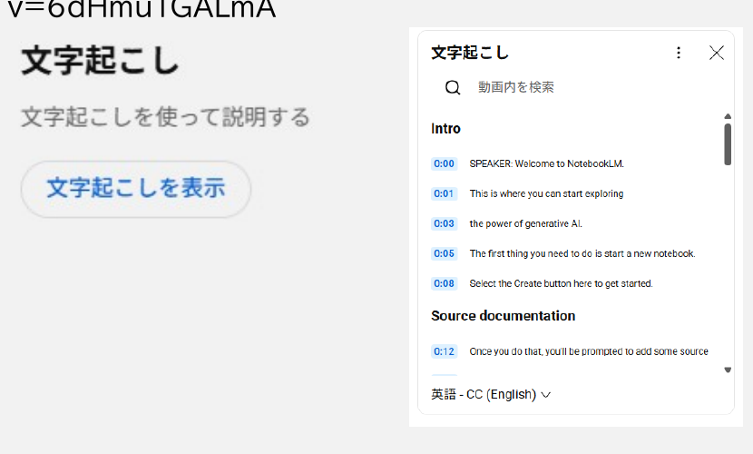

→AIにコピペ

"以下は、動画の書き起こしを添付したものです。その内容を200文字で要約して下さい"

<!--
- YouTubeやPDFの書き起こしをコピーして、AIに日本語で要約させる。プロンプト例「以下は動画の書き起こし…200文字で要約して下さい」。
-->

---

2　使ってみる

# ワーク：AIを使ってみる

<b>Step 5)　与えた情報(コンテキスト)内を情報を検索してみましょう</b>

"与えた情報によれば、Notebook LMでは、どのようなファイルを使えるんですか"

<b>Step 6)　議論のパートナーにする</b>

"私は科目〇〇の高校の先生です。NotebookLMは、自分の担当する科目でどう使えそうですか？"

<b>Step 7) 理解を確かめる</b>

"与えた情報から、Notebook LMを自分が理解したかを確かめる、三択問題を2問、この動画から作成して下さい。"

<b>Step 8) 情報検索をしてみる</b>

"Notebook LMは、高校生でもつかえるんですか?"

<!--
- 与えた情報内の検索、議論のパートナー、理解の確認(三択問題作成)、情報検索と、AIの使い方を段階的に体験する。
-->

---

<!-- _class: intro -->

1　イントロ

💬

ハルシネーションは どんな問でおきましたか。

slido で回答を共有しましょう

<!--
- slido ポーリング。どんな問いでハルシネーションが起きたかを共有する。
-->

---

2　使ってみる

# 生成AIを使う上で

<b>AIと対話の文脈を作る</b>　= <b>思考錯誤し、自分が必要な支援を引き出す</b>

重要な力1

多分、ハルシネーションしたり、社会・概念のフレームを理解しない回答をしたりしている

"Notebook LMは、高校生でもつかえるんですか?"

ハルシネーションの発生を念頭に、 信頼できる情報を見極める。

重要な力2

正解：いいえ。年齢制限のため、使えません。

自分が積極的にAIに問いかけてみる / 適切な情報一覧を与えてあげる 自分が動かないと、AIは良い回答を出してくれない。能動的に。

AIも、生徒と同じで、正しい判断ができるためには、正しい事前知識をプロンプトに入れてあげると良い

<!--
- 生成AIを使う上で2つの力。重要な力1=ハルシネーションを念頭に信頼できる情報を見極める。重要な力2=能動的に問いかけ、適切な情報を与える。AIも生徒と同じで、正しい事前知識を入れると良い。
-->

---

2　使ってみる

# 生成AIとハルシネーション

<b>SimpleQA</b>：回答の事実的正確性のベンチマーク Wei et al. (2024) Arxiv

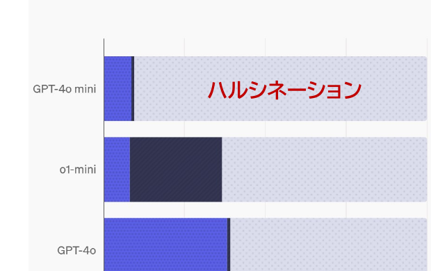

知識のエッジ(=学習回数小)にある内容も含めてある

<b>学習している知識が少ない場合の例</b> 例) Q. Who received the IEEE Frank Rosenblatt Award in 2010?　　A. Michio Sugeno

問題を解かせたり、論文を探させた場合等、無料版である<b>AI</b>は、「分からない」ということもなく、ハルシネーション(誤情報を出す)する可能性が高い

その他の例

・古い情報だった・誤った情報を学習していた

・AIが考えるべきことを誤解し、なんか変だ

・別の分野の文脈に引きずられていた/偏っていた

・差別やバイアスが含まれていた

・推論ミス、別のところを参照 etc…

<b>誤っている可能性を知り、信頼の高い情報を参照し正確性を確認</b>　<b>※ 相当ある</b>

ハルシネーションは結構頻繁に起こる <b>(特に無料版の場合)</b>

<!--
- SimpleQA で測ると、無料版AIは「分からない」と言わずにハルシネーションする可能性が高い。古い情報・誤解・文脈の引きずられ・バイアス・推論ミス等。信頼の高い情報で正確性を確認すること。
-->

---

2　使ってみる

# 現在の生成AIの変化 ①

<b>△ 生成AIにただ聞いて回答させる</b>

内部の学習データから回答を出す

<b>間違うことがある</b> 　例：宮崎県の観光地を教えて → ○ 　例：日本のAI基本法を教えて → ☓

<b>○ 生成AIに、情報を与え、自分がほしい情報に変換してもらう</b>

与えたデータから回答を出す

間違いは、だいぶ減る

<b>現在：生成AIはツール・エージェント(助手みたいなもの)になっている</b> AIの回答を確認するAI、webを検索するAIなどが繋がる

<!--
- △ただ聞くと内部データから回答し間違うことがある。○情報を与えて変換してもらうと間違いはだいぶ減る。現在のAIはツール・エージェント(助手)になりつつある。
-->

---

2　使ってみる

# AI agentの動きの例

<b>グラウンディング：</b> 　AIが生成する回答を、特定の信頼できる情報源（ソース）にしっかりと結びつける技術

昔：

AI

→

回答

今：

データ

→

AI

→

回答

<b>「因果推論」「思考ツール」</b>になりつつある

<b>"ガチャ"状態：</b>当たりまで何回もデータ・指示を変え試す

<!--
- グラウンディング=回答を信頼できるソースに結びつける技術。昔はAI→回答だけ。今はデータ→AI→回答。「因果推論」「思考ツール」になりつつあり、当たりまで何回も試す"ガチャ"状態。
-->

---

教員の仕事とAIの親和性

# 教員の仕事とAIの親和性

AIにおしえてあげる ＝ AIも生徒と同じで、<b>正しい判断ができるためには正しい事前知識をプロンプトに入れてあげる</b>と良い

AIを、何でも知っている先生としてとらえるの<b>ではなく</b>、 <b>「読み書き・推論は賢く、常識もあり、疲れずないけど専門性はないので教えて上げるべき助手」</b>として捉えてみる

「<b>与えた情報の変換</b>」や「<b>一般性のある回答</b>」には使える

昨今は、AI自体もwebページを参照していることがある

良い質問をするには、「評価」をあらかじめ、イメージする

<b>逆向き設計の授業設計のように、メタいところから</b>考える

<b>教えることに近い</b>ので、<b>学校の先生はAIを使いこなせる</b>

---

<!-- _class: divider -->

Slido

# Audience Q&amp;A

参加者からの質問に答える時間です

---

そもそも、なんで？

# そもそも、なんで？

疑問点

<b>AIの中身は、どうなっているのだろう？</b>

<b>そもそもなんで、間違えるのか？</b>

<b>間違えることはなくならないのか</b>

<b>AIを使いこなすためには、メカニズムをある程度、知る必要がある</b>

→ AIをただ、使うだけでは、わからない！！！ 
　実際、大学でも教員にAIのメカニズムを教えることが増加

---

ワーク：ハルシネーションの例

# ワーク：ハルシネーションの例

<b>[問題]</b> aを実数の定数とする。xについての方程式 　　　　|x² − 2x − 3| = a(x − 2) の、異なる実数解の個数を求めよ。 思考プロセスをステップバイステップで詳細に記述しながら、結論を導き出してください。

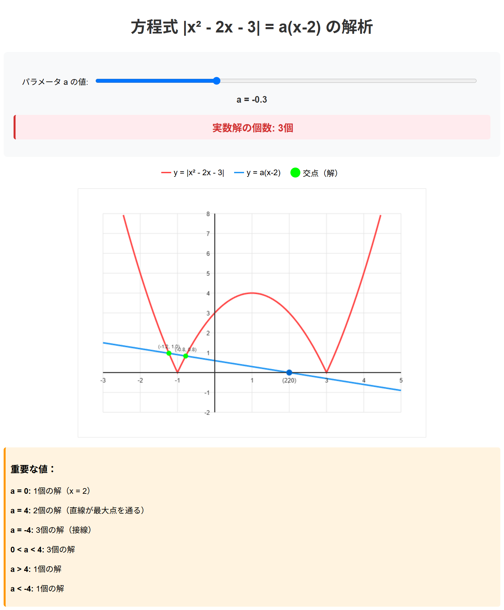

AIで作成したツール

https://claude.ai/public/artifacts/ 22fda9cd-0688-4887-a74b-53867fab0945

AIで回答した例

若干不自然だが(記述式では減点？)、合格

https://chatgpt.com/share/684a0bd1-b198- 8004-81ce-807f626ed962

出力例：6/12

---

ワーク：ハルシネーションの例

# ワーク：ハルシネーションの例

<b>この問題を直接貼り付けて、AIに解かせてみて下さい。</b>

誤った回答の例　Gemini 2.5 flash

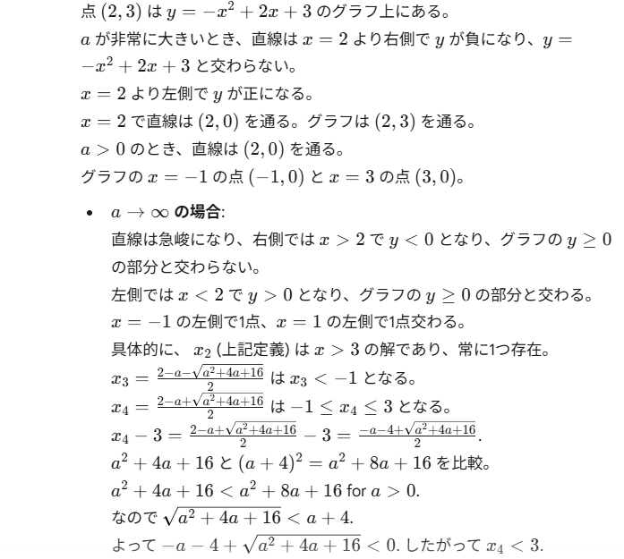

https://claude.ai/share/8e82983f-275b-427e-8ea3-aef898cd0bd7

<b>なんで、こんなトンチンカンなことになるのか？</b> <b>そのためには、機械学習を考えることになります…</b>

出力例：6/12

---

機会学習とは

# 機会学習で、データの関係性をどう考えるか

<table style="width:560px; margin:40px auto 0; border-collapse:collapse; font-size:34px; text-align:center;">
<thead>
<tr style="background:#5BA838; color:#fff;"><th style="padding:14px 0;">x</th><th style="padding:14px 0;">f(x)</th></tr>
</thead>
<tbody>
<tr style="background:#D8E9CC;"><td style="padding:10px 0;">1</td><td>3</td></tr>
<tr style="background:#ECF4E4;"><td style="padding:10px 0;">2</td><td>5</td></tr>
<tr style="background:#D8E9CC;"><td style="padding:10px 0;">3</td><td>7</td></tr>
<tr style="background:#ECF4E4;"><td style="padding:10px 0;">4</td><td>?</td></tr>
</tbody>
</table>

<!--
ちょっと問題をだしてみましょう。正解も何もないので、頭の体操としてきいて下さい。 / f(1) = 3、f(2)= 5、f(3)=7と数が並んでいた時、f(4)はなんだと思いますか？
-->

---

機会学習とは

# 機会学習で、データの関係性をどう考えるか

<table style="width:230px; border-collapse:collapse; font-size:24px; text-align:center;">
<thead>
<tr style="background:#5BA838; color:#fff;"><th style="padding:7px 0;">x</th><th style="padding:7px 0;">f(x)</th></tr>
</thead>
<tbody>
<tr style="background:#D8E9CC;"><td style="padding:5px 0;">1</td><td>3</td></tr>
<tr style="background:#ECF4E4;"><td>2</td><td>5</td></tr>
<tr style="background:#D8E9CC;"><td>3</td><td>7</td></tr>
<tr style="background:#ECF4E4;"><td>4</td><td>?</td></tr>
</tbody>
</table>

変換する「函」

<svg viewBox="0 0 220 90" style="width:200px;"><rect x="40" y="20" width="140" height="50" rx="8" fill="#fff" stroke="#333" stroke-width="2.5"/><text x="110" y="42" font-size="15" text-anchor="middle" fill="#111">ブラックボックス</text><text x="110" y="60" font-size="12" text-anchor="middle" fill="#555">確率・統計的に処理</text></svg>

正解が出てくるとは限らない

<b>ブラックボックス内を理解する手法は開発中</b> e.g. Anthropic (2025) AI顕微鏡

ルールベースの世界観

(設計者が教えておく)

解析的に解くよ／等差数列っぽい？ <b>→ Yes</b> f(x) = 2x+1？　ならば9と予想

機械学習の世界観

(もっとたくさん学習！)

入力されたデータからパターンをコンピュータが探索・発見 <b>f(x)自体は気にしない</b>／9とか11？

<b>データの関係性の捉え方が根本的に違う</b>

<!--
ルールベースの世界に生きるAIは、きっと僕から、解析的な解き方を教えられているんですね。たとえば、この場合には、一次式を試してみて、f(x) = 2*x+1っていう風なので、x=4で9だぞって。 / 結構高校までの数学の授業って、こういう考え方しませんか。 / でも、機械学習的な世界では、このf(x)がどうなっているかはどうでも良いのですね。xとf(x)の関係性を学習し、次を予測するだけ。 / データの関係性について、f(x)自体がルールを明示的でない形でも構わないが、コンピューターが自ら学習した結果を予想できる、この考え方がミソなんですね。
-->

---

ディープラーニング (深層学習)

# 箱としての、ディープラーニング (深層学習)

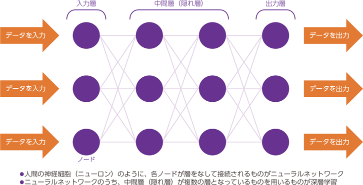

学習

<svg viewBox="0 0 320 130" style="width:100%;"><text x="22" y="60" font-size="20" font-weight="800" fill="#111">入力</text><rect x="68" y="28" width="150" height="74" rx="6" fill="#fff" stroke="#333" stroke-width="2.5"/><text x="143" y="58" font-size="20" font-weight="800" text-anchor="middle" fill="#111">パラメーター</text><text x="143" y="80" font-size="20" font-weight="800" text-anchor="middle" fill="#111">の函</text><text x="143" y="98" font-size="13" text-anchor="middle" fill="#555">数字の羅列</text><text x="262" y="50" font-size="20" font-weight="800" fill="#111">出力</text><text x="262" y="98" font-size="20" font-weight="800" fill="#111">評価</text><path d="M250 60 q24 18 0 36" fill="none" stroke="#888" stroke-width="9" marker-end="url(#a32)"/><defs><marker id="a32" markerWidth="7" markerHeight="7" refX="3" refY="3.5" orient="auto"><path d="M0 0 L7 3.5 L0 7 z" fill="#888"/></marker></defs><text x="234" y="86" font-size="12" fill="var(--accent)">更新</text></svg>

利用

<svg viewBox="0 0 300 130" style="width:100%;"><text x="14" y="68" font-size="20" font-weight="800" fill="#111">入力</text><rect x="60" y="28" width="150" height="74" rx="6" fill="#fff" stroke="#333" stroke-width="2.5"/><text x="135" y="58" font-size="20" font-weight="800" text-anchor="middle" fill="#111">パラメーター</text><text x="135" y="80" font-size="20" font-weight="800" text-anchor="middle" fill="#111">の函</text><text x="135" y="98" font-size="13" text-anchor="middle" fill="#555">数字の羅列</text><text x="232" y="68" font-size="20" font-weight="800" fill="#111">出力</text></svg>

『R1 総務省 情報通信白書』総務省 (2019)

<!--
このブラックボックス部分ですけど、この自体をどんな形にするか、という設計はあるわけです。 / 人工ニューラルネットワーク、その発展型である深層学習(Deep Learning)。今年のノーベル賞ですからね。複数のパラメータを配置することで、学習したデータとはことなるものを確率的につくることが出来るわけです。 / 機械的に膨大なパラメータから意味を生成する方法がいまのAIの背景にあるのです。
-->

---

ディープラーニング (深層学習)

# 箱としての、ディープラーニング (深層学習)

- 人間の神経細胞（ニューロン）のように、各ノードが層をなして接続されるものがニューラルネットワーク

- 中間層（隠れ層）が複数の層となっているものを用いるものが深層学習

<b>2012年</b>、Googleの キャットペーパー (「猫」を教えていなかったのに、写真から猫の特徴を抽出) ヒントンらによる画像認識のブレークスルー <b>2016年</b>、世界トップレベルのプロ囲碁棋士に勝利 (囲碁専用ではない)

ノーベル賞 2024年 (PD)

<b>物理学：</b>人工ニューラルネットワークによる機械学習を可能にする基礎的な発見と発明

<b>ジョン・ホップフィールド</b>　物理学者・分子生物学者 <b>ジェフリー・ヒントン</b>　生理学・哲学→実験心理学→コンピューター科学

<b>化学 (一部)：</b>タンパク質プログラムの開発

<b>デミス・ハサビス</b>　人工知能研究者、神経科学者 <b>ジョン・M・ジャンパー</b>　固体物理学→理論化学→計算生物学

<b>※高校生/高校教諭向けには、東大松尾研のGCIなど、無料でおすすめ</b>

『R1 総務省 情報通信白書』総務省 (2019)

---

ディープラーニング (深層学習)

# 箱としての、ディープラーニング (深層学習)

言語型の大規模言語モデル (生成AIの中身) の本質

ネクストワードプレディクション

日本の首都__ → 日本の首都は__ → 日本の首都は東京__

これまでのコンテキストから、次の言葉(トークン)の確率を予想する問題

学習

<svg viewBox="0 0 340 130" style="width:100%;"><text x="14" y="58" font-size="18" font-weight="800" fill="#111">入力</text><text x="14" y="80" font-size="18" font-weight="800" fill="#111">文字</text><rect x="72" y="28" width="150" height="74" rx="6" fill="#fff" stroke="#333" stroke-width="2.5"/><text x="147" y="58" font-size="20" font-weight="800" text-anchor="middle" fill="#111">パラメーター</text><text x="147" y="80" font-size="20" font-weight="800" text-anchor="middle" fill="#111">の函</text><text x="147" y="98" font-size="13" text-anchor="middle" fill="#555">数字の羅列</text><text x="266" y="50" font-size="18" font-weight="800" fill="#111">出力</text><text x="266" y="98" font-size="18" font-weight="800" fill="#111">評価</text><path d="M252 60 q24 18 0 36" fill="none" stroke="#888" stroke-width="9" marker-end="url(#a34)"/><defs><marker id="a34" markerWidth="7" markerHeight="7" refX="3" refY="3.5" orient="auto"><path d="M0 0 L7 3.5 L0 7 z" fill="#888"/></marker></defs><text x="236" y="86" font-size="12" fill="var(--accent)">更新</text></svg>

GPT 4の場合、アメリカ議会図書館の<b>全蔵書の約22倍</b>に相当? ※書籍、記事、ウェブサイト、コードなど幅広いテキストソース

<!--
生成AIでよく想像されるのは、Chat GPTのような、言語を扱うAIでしょう。 / 言葉を操る生成AIは、ネクストワードプレディクション、つまり次に出てくる言葉の予測をおこなうAIなわけですね。 / さっき言ってた函ってのはこれ全部にあたります。
-->

---

<!-- _class: divider -->

Slido

# 春は___

次の言葉を予測してみましょう

---

<!-- _class: divider -->

Slido

# 地球に存在する水の総量はおおよそ海の_

次の言葉を予測してみましょう

---

ディープラーニング (深層学習)

# パラメーターの箱(函)としての、ディープラーニング

LLM の内部構造をブラウザで可視化する 
<a href="https://bbycroft.net/llm" style="color:var(--tag-blue); font-weight:800; font-size:34px;">LLM Visualization</a>

cf. NVIDIA "Mythbusters Demo GPU versus CPU"

<!--
そして、生成AIの時代にきます。生成AIでよく想像されるのは、Chat GPTのような、言語を扱うAIでしょう。 / その構成について、トランスフォーマーの一つである、GPTのパラメタ構造をのぞいてみましょう。 / これも、ニューラルネットワークモデルです。インプットされたデータが、複数の層を通って出力されます。 / なんか宇宙ステーションみたいですね。 / ここでは「nano-gpt」という非常に小さなモデル（パラメータ数わずか85,000）を使って、モデルの仕組みを探っていきます。 / このモデルの目的はシンプルです。以下の6文字からなるシーケンス： / C B A B B C をアルファベット順に並べ替えること、つまり「A B B B C C」にすることです。 / 次にくるアルファベットを予想するタスクをしているわけですね。 / 緑のセルは現在処理されている数値を、青のセルは重みを表しています。 / こんな感じで、言葉を操る生成AIは、ネクストワードプレディクション、つまり次に出てくる言葉の予測をおこなうAIなわけですね。 / さっき言ってた函ってのはこれ全部にあたります。
-->

---

大規模言語モデルを生成AIにする

# 大規模言語モデルを生成AIにする

<table style="width:100%; border-collapse:separate; border-spacing:0 10px; font-size:24px; line-height:1.45;">
<tr>
<td style="width:30%; background:var(--accent-soft); border-radius:10px; padding:12px 20px; font-weight:800; color:var(--accent-dark);">チューニング ・RLHF</td>
<td style="padding:12px 24px;">人間にとって自然な回答をするよう、トレーニングする (good/bad)</td>
</tr>
<tr>
<td style="width:30%; background:var(--accent-soft); border-radius:10px; padding:12px 20px; font-weight:800; color:var(--accent-dark);">ガードレールの作成</td>
<td style="padding:12px 24px;"><b style="color:var(--accent);">AIの安全性を向上させる</b>（AIに危険/不適切なことを言わせない）</td>
</tr>
<tr>
<td style="width:30%; background:var(--accent-soft); border-radius:10px; padding:12px 20px; font-weight:800; color:var(--accent-dark);">倫理的課題の解決 バイアスの低減</td>
<td style="padding:12px 24px;">トレーニングデータ上のバイアスを減らす</td>
</tr>
<tr>
<td style="width:30%; background:var(--accent-soft); border-radius:10px; padding:12px 20px; font-weight:800; color:var(--accent-dark);">ツールの接続</td>
<td style="padding:12px 24px;">計算やweb検索など、モジュールを接続する</td>
</tr>
</table>

市販のAIは、<b>人間中心の原則</b>に従い、かなりの注意して作成されている

<!--
人間のニーズ、能力、制約を最優先に考慮する
-->

---

Slido：ハルシネーションを減らすには

# ハルシネーションを減らすには、 どうすればよいと思いますか

複数回答可

🏆　Slido で回答を募集します（匿名）

スマホ・PC から slido にアクセスし、ご回答ください

---

まとめ

# まとめ

<b style="font-size:34px;">大規模言語モデル = 数字の箱</b> 
→　ルールの箱や、データの箱ではないことに注意

<b>ネクストワードプレディクション</b>

日本の首都__ → 日本の首都は__ → 日本の首都は東京__

これまでのコンテキストから、次の言葉(トークン)の生成確率を予想する問題

生成AIは、LLMを有用化した一連のパッケージ

<b>確率的に考えるモデルなので、ハルシネーションはなくならない</b> しかし、工夫により問題は減り、有用性が向上しつつある

<!--
そして、生成AIの時代にきます。生成AIでよく想像されるのは、Chat GPTのような、言語を扱うAIでしょう。 / これも、ニューラルネットワークモデルです。インプットされたデータが、複数の層を通って出力されます。 / こんな感じで、言葉を操る生成AIは、ネクストワードプレディクション、つまり次に出てくる言葉の予測をおこなうAIなわけですね。 / さっき言ってた函ってのはこれ全部にあたります。
-->

---

何が、利用上の注意点か

# 何が、利用上の注意点か

生成AI活用にあたって 注意すべきポイントは？

情報の正確性

情報流出

知的財産権の侵害

活用者としてのモラル

総務省　生成AIはじめの一歩～生成AIの入門的な使い方と注意点～ 
<a href="https://www.soumu.go.jp/use_the_internet_wisely/special/generativeai/" style="color:var(--tag-blue); font-size:22px;">https://www.soumu.go.jp/use_the_internet_wisely/special/generativeai/</a>

<b>コンパクトに纏まっているので、ぜひ、ご活用ください</b>

<!--
ここからは、生成AIを使う上で注意すべき4つのポイントを学習します。 / まずは、情報の正確性に関することです。
-->

---

偽・誤情報に騙されないための3点

# 偽・誤情報に騙されない・拡散しないため、 3つのポイントを常に意識する

ポイント１

人は信じたいものを選ぶ（認知バイアス）ので、無意識のうちに合理的ではない行動、偏った判断をすることがあるという意識をもつ

ポイント２

チェックリストを用いて真偽を判断する

ポイント３

チェックリストを用いて判断しても騙されるので、安易に拡散しない / 拡散したいときは ひと呼吸おく

Source: 総務省「インターネットとの向き合い方～ニセ・誤情報に騙されないために～」

<!--
生成AIの技術は急速に進展しており、人間が情報の真偽を判断することは難しくなることが予想されます。 / 自分が被害者、加害者にならないため、3つのポイントを常に意識しましょう。 / 1つ目は、人は信じたいものを選ぶので、無意識のうちに合理的ではない行動、偏った判断をすることがあるという意識をもつこと、 / 2つ目は、チェックリストを用いて真偽を判断すること、 / 3つ目は、チェックリストを用いて判断しても騙されるので、安易に拡散しない、また拡散したいときはひと呼吸おくことです。
-->

---

チェックシートを用いて判断する

# チェックシートを用いて判断する

基 本

☑ 情報源はある？ 
☑ その分野の専門家？ 
☑ 他ではどう言われている？ 
☑ その画像は本物？

応 用

☑ 「知り合いだから」という理由だけで信じていないか？ 
☑ 表やグラフも疑ってみた？ 
☑ その情報に動機はある？ 
☑ ファクトチェック結果は？※1

Source: 総務省「インターネットとの向き合い方～ニセ・誤情報に騙されないために～」

<!--
2つ目に意識すべきポイントは、チェックリストを用いて真偽を判断することです。 / 情報源は信用できるか、他のメディアではどういわれているか、その画像/表/グラフは本物か、ファクトチェックの結果はどうかなど、1つ1つ確認することが大切です。
-->

---

偽・誤情報のリスク

# 生成AIにより偽・誤情報が生成される可能性

偽・誤情報の事例 ❶

ある生成AIサービスに以下の指示を入力すると、問題のあるリストが生成された。

西日本で最も高い山のTOP10を教えてください

<b>生成されたリストの課題</b>

実在しない山の名前が含まれる 標高が不正確

偽・誤情報の事例 ❷

2022年9月、台風15号による水害被害が発生している静岡県の画像がSNS上で拡散。その後投稿者は、画像生成AIで作成した偽画像だったと公表。

Source: 生成AIサービスを用いて回答を作成、NHK「SNSで拡散 "AI生成の偽の災害画像" ファクトチェックはどうする」

<!--
生成AIによりもっともらしい偽・誤情報が生成される可能性に注意が必要です。 / 例えば、生成AIサービスに指示を入力すると、実在しない内容が含まれていたり、数字が不正確だったりすることがあります。 / また、水害被害の画像がSNSで拡散されたところ、実は画像生成AIで作成した偽画像だったという事例があります。
-->

---

何が、利用上の注意点か

# 何が、利用上の注意点か

生成AI活用にあたって 注意すべきポイントは？

情報の正確性

情報流出

知的財産権の侵害

活用者としてのモラル

<b>総務省　生成AIはじめの一歩～生成AIの入門的な使い方と注意点～ から考える</b>

<a href="https://www.soumu.go.jp/use_the_internet_wisely/special/generativeai/" style="color:var(--tag-blue);">https://www.soumu.go.jp/use_the_internet_wisely/special/generativeai/</a>

<!--
次に、情報流出に関することについて学習します。
-->

---

情報流出を防ぐための3つの行動

# 情報流出を防ぐため、3つの行動を心がける

行動１

生成AIサービスの<b style="color:var(--tag-green);">規約を確認</b>（データの利用目的や範囲等）また利用規約の変更時には<b style="color:var(--tag-green);">変更箇所をチェック</b>

行動２

個人情報や機密情報の入力は<b style="color:var(--tag-green);">必要最小限</b>

行動３

生成AIに入力したデータを<b style="color:var(--tag-green);">学習に使わせないように設定</b>（オプトアウト設定）※1

<!--
情報流出を防ぐため、3つの行動を心がけることが大切です。 / まずは、生成AIサービスの規約で、データの利用目的や範囲等を確認し、利用規約の変更時には変更箇所をチェックするようにしましょう。 / その上で、個人情報や機密情報の入力を必要最小限にするよう注意しましょう。 / また、利用する生成AIサービスで設定が可能であれば、入力したデータを学習に使わせないように設定しましょう。
-->

---

ワーク：オプトアウトを確認する

# ワーク：オプトアウトを確認する

<b>先生が今お使いのAIは、学習されますか？ どうなっていますでしょうか</b>

Copilot

こんにちは。「何ができますか?」と尋ねてみてください └ Copilot へメッセージを送る

Gemini

Gemini　2.5 Flash └ Gemini へのプロンプトを入力 　 Deep Research / Canvas

<b>海外の第三者が見ることも…</b>

<!--
情報流出を防ぐため、3つの行動を心がけることが大切です。 / まずは、生成AIサービスの規約で、データの利用目的や範囲等を確認し、利用規約の変更時には変更箇所をチェックするようにしましょう。 / その上で、個人情報や機密情報の入力を必要最小限にするよう注意しましょう。 / また、利用する生成AIサービスで設定が可能であれば、入力したデータを学習に使わせないように設定しましょう。
-->

---

海外企業での情報流出事例

# ある海外企業では、生成AIに機密情報を入力し情報が流出

2023年3月、海外の電子機器メーカーで生成AIの使用による、社内情報流出が立て続けに発生

情報流出の内容 ❶

社内機密の<b>ソースコード</b>を生成AIに入力し、修正を依頼 (2件)

⌨ → 🤖 生成AI

情報流出の内容 ❷

社内会議の<b>録音データ</b>を音声認識アプリで文章に変換して生成AIに入力し、議事録を作成 (1件)

🎙 → 🤖 生成AI

<!--
ある海外企業では、社員が生成AIの仕組みへの理解が不十分であったため、生成AIに機密情報を入力してしまい、情報が流出するトラブルが発生しました。 / ビジネスで利用する場合は、自社の機密情報の取扱いについて十分留意する必要があります。
-->

---

何が、利用上の注意点か

# 何が、利用上の注意点か4 注意点

生成AI活用にあたって 注意すべきポイントは？

情報の正確性

情報流出

知的財産権の侵害

活用者としてのモラル

<b>総務省　生成AIはじめの一歩〜生成AIの入門的な使い方と注意点〜</b> <b>から考える</b>  https://www.soumu.go.jp/use_the_internet_wisely/special/generativeai/

<!--
- 次に、情報流出に関することについて学習します。
-->

---

配慮すべき知的財産権

# 配慮すべき知的財産権4 注意点

利用例１

既存の著作物と類似している生成物を、アップロードして公表/複製物を販売

⬇

⚠ 著作権

利用例２

商標や意匠として登録されているロゴ・デザイン等と同一または類似している生成物を商用利用

⬇

⚠ 商標権・意匠権

利用例３

生成AIを利用して生成された著名人の氏名、肖像等を商用利用

⬇

⚠ パブリシティ権

差止請求・損害賠償請求等の民事訴訟や、刑事罰の対象となることも

Note: 一方、生成AIへの入力段階では、著作物のデータは、原則として著作権者の許諾なく利用できる Source: 総務省「インターネットとの向き合い方〜ニセ・誤情報に騙されないために〜」

<!--
- 生成AIの普及により、偽情報・誤情報の増加が問題になっています。
- 偽情報とは、意図的・意識的に作られたウソ、虚偽の情報です。誤情報とは、勘違いや誤解により広まってしまった、間違い情報です。
- 生成AIにより、特殊な技術がなくても、もっともらしい偽画像・映像・音声・ニュース記事等を作成できるようになったこと、学習データが不正確であったり、偏っている場合があること、裏づけのない回答をする場合があること、正確なデータを学習したとしても出力される情報が正しくない可能性があることから、偽情報・誤情報の増加につながっています。
-->

---

教育として必要なこと

# 教育として必要なこと4 注意点

<b>Terms of use (利用規約)を読む / AIに読み込ませる</b>

<table style="width:100%; border-collapse:collapse; font-size:24px;">
<tr>
<td style="width:18%; font-weight:800; padding:8px 12px; vertical-align:top;">Chat GPT</td>
<td style="padding:8px 12px;">13才以上は可だが、<b>18才未満は保護者同意必須</b></td>
</tr>
<tr style="background:var(--section-bg);">
<td style="font-weight:800; padding:8px 12px; vertical-align:top;">Gemini</td>
<td style="padding:8px 12px;">13才以上可 <b>但し学校版は管理者の許可必須</b> ※ APIの利用/Studio/gem/NotebookLMの利用は不可</td>
</tr>
<tr>
<td style="font-weight:800; padding:8px 12px; vertical-align:top;">Claude</td>
<td style="padding:8px 12px;">18才以上可</td>
</tr>
<tr style="background:var(--section-bg);">
<td style="font-weight:800; padding:8px 12px; vertical-align:top;">Copilot</td>
<td style="padding:8px 12px;">13才以上可 (MS365 Copilotは 2025夏に13才以上に変更)</td>
</tr>
</table>

<b>※K-12向けAIは「みんなのコード」や「Khanmigo (米国向け)」など限られる</b> <b>(安全性を考え、順次拡大中ではある)</b>

---

ワーク：高校での利用

# Notebook LM を使った、注意点の確認方法 (画面出みせます)5 活用例

“文科省通知『初等中等教育段階における生成AIの利活用に関するガイドライン』 ” (第二版)のpdfをダウンロードしてください

NotebookLMを開き、ソースにpdfをアップロードしてください。

質問し、「高校でのAIの利用において、遵守しないと行けない点」をまとめて、見つけて見てください。(後ほど、slido上で伺います)　<b>個人情報保護はどうでしょうか</b>　<b>具体例や事例を考えてもらいましょう</b>

<b>応用：解説音声や問題、その解説を作って見てください</b>

<b>※生徒は年齢制限上使用不可</b>

https://www.mext.go.jp/a_menu/other/mext_02412.html

---

ワーク：高校での利用

# ワーク：高校での利用で気をつけるべき点をまとめてみよう5 活用例

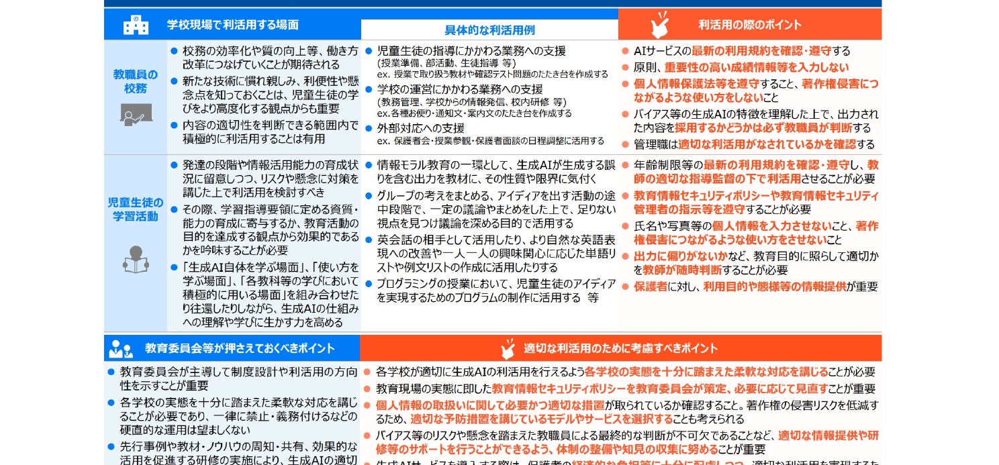

https://www.mext.go.jp/content/20241226-mxt_shuukyo02-000030823_003.pdf

---

ワーク：高校での利用

# ワーク：高校での利用で気をつけるべき点をまとめてみよう5 活用例

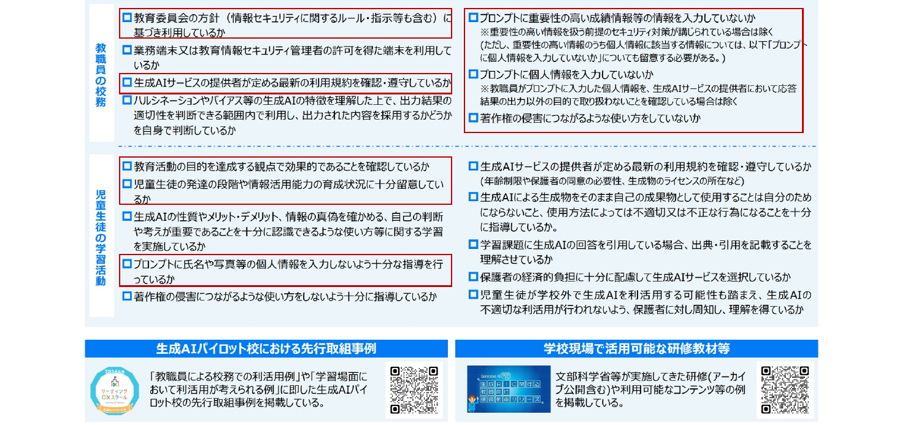

https://www.mext.go.jp/content/20241226-mxt_shuukyo02-000030823_003.pdf

---

deep researchでまとめた注意点

# deep researchでまとめた、高校の注意点・活用事例4 注意点

https://chatgpt.com/s/dr_6849f71f583c81919120833c46eebd16

※ ハルシネーション

自分は、まとめられた情報を見るのではなく、<b>何がソースか</b>を見ている

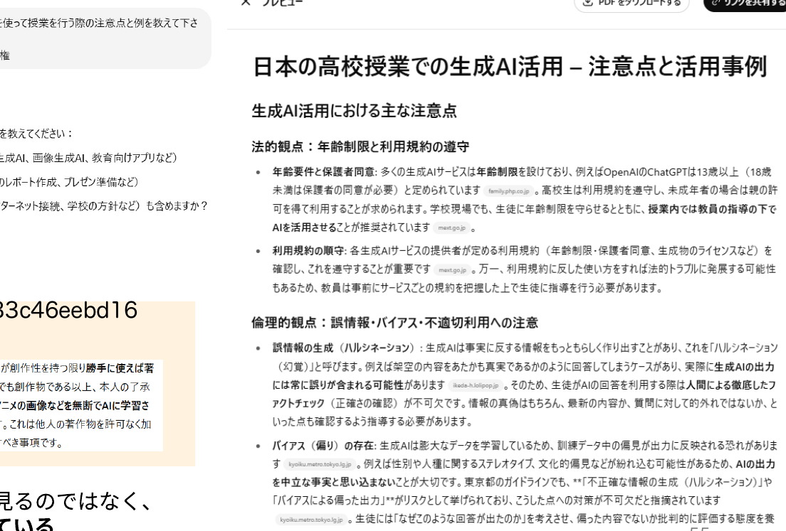

---

良いプロンプトを書くコツ

# 良いプロンプトを書くコツ5 活用例

生成AIから最適な回答を得るための指示（プロンプト）の工夫を "<b>プロンプトエンジニアリング</b>" と呼ぶ

<table style="width:100%; border-collapse:collapse; font-size:22px; margin-top:6px;">
<tr style="background:var(--accent); color:#fff; font-weight:800;">
<td style="padding:7px 14px; width:46%;">工 夫</td>
<td style="padding:7px 14px;">指示 (プロンプト) 例</td>
</tr>
<tr>
<td style="padding:8px 14px; vertical-align:top;">① 目的・詳細な設定・検討の材料を書く</td>
<td style="padding:8px 14px; line-height:1.45;">この質問は、XXXを作成するために聞いています なお、8月の夏休みに行く旅行について検討しています XXXの文脈に絞って、XXXについて教えてください</td>
</tr>
<tr style="background:var(--section-bg);">
<td style="padding:8px 14px; vertical-align:top;">② 欲しい回答の例を与える</td>
<td style="padding:8px 14px; line-height:1.45;">XXXのような事例を探しています 以下の例を参考に、類似のものを調べてください</td>
</tr>
<tr>
<td style="padding:8px 14px; vertical-align:top;">③ 書式/回答方法を制限する</td>
<td style="padding:8px 14px; line-height:1.45;">横軸がAとBとCである表形式で答えてください XXX文字以内で答えてください 要点をXXX個挙げてください</td>
</tr>
<tr style="background:var(--section-bg);">
<td style="padding:8px 14px; vertical-align:top;">④ 文章のテイストを指定する</td>
<td style="padding:8px 14px; line-height:1.45;">私は10歳の子供だと思って説明してください XXX (有名な作家 等) の文体で説明してください 女子高生になりきって説明してください</td>
</tr>
</table>

今のAIは、幾分、簡単な質問でも答えるようになった / <b>複雑なことをさせるには必要</b>

<!--
- 生成AIから欲しい情報を得るために、指示入力にはいくつかのコツがあります。
- 代表的な4つのコツをご紹介します。
- ①目的、詳細な設定、検討の材料を書く　目的や背景を説明すると、意図に沿った回答を得やすくなります。
- ②欲しい回答の例を与える　例をいくつか提示すると、類似の回答を得やすくなります。
- ③書式、回答方法を制限する　回答の形式、字数、回答の個数などを具体的に指定することで、目的に沿った回答を得やすくなります。
- ④文章のテイストを指定する　誰に対する回答かを想定して指示することで、文脈に沿った回答を得やすくなります。
- なお、このような指示の工夫を、「プロンプトエンジニアリング」と呼びます。
-->

---

良いプロンプトを書くコツ (7R法)

# 良いプロンプトを書くコツ (7R法)5 活用例

図表5-1　プロンプト上手になるための7つのポイント

①明確な質問曖昧な質問ではなく明確な質問をすることでより良い回答が得られます。

②具体性トピックや要求に具体的な詳細を提供することで、適切な回答を引き出すことができます。

③プロンプトの構造質問を構造化して、抜け・漏れをなくします。

④文脈の提供重要な文脈や背景情報を提供します。

⑤複数の質問必要に応じて、複数の質問を連続して投げかけます。

⑥ステップバイステップ指示段階的に考えさせます。

⑦校正とフィードバック得られた結果を評価し、精度向上を促します。

図表5-3　簡易プロンプト

入力

▶

<b>Request (依頼)</b> を出す

<b>Role (役割)</b> を決める

<b>Regulation (形式)</b> を指定する

▶

出力

図表5-5　詳細プロンプト

入力

▶

<b>Request (依頼)</b> を出す

<b>Role (役割)</b> を決める

<b>Regulation (形式)</b> を指定する

<b>Rule (ルール)</b> を定める

<b>Review &amp; Refine (評価・改善)</b> を求める

<b>Reference (参照知識・例)</b> を与える

▶

出力

ChatGPT時代の文系AI人材になる｜野口 竜司 (東洋経済新報社 2023)

---

良いプロンプトを書くコツ

# 良いプロンプトを書くコツ (gem デモ)5 活用例

<b># 役割 (Role)</b> AIに担ってほしい専門家やキャラクターを設定します。 例：小学生に教えるのが得意な、明るく優しい先生 
<b># 命令 (Instruction)</b> AIに実行してほしい、最も重要なタスクを明確に記述します。 例：納豆の魅力について、子供向けに解説してください。 
<b># 文脈 (Context)</b> このタスクの背景や、回答を作る上で考慮してほしい状況を伝えます。 例：対象読者は、食べ物の好き嫌いが多い小学校3年生です。 
<b># 参照 (Reference)</b> AIに読み込ませたい情報（文章、データ、ファイル名など）を指定します。 例：添付のPDF「natto_data.pdf」を読んでから回答してください。 
<b># 形式 (Format)</b> 出力してほしい形を具体的に指定します。 例：表形式で、各列は「栄養素」「働き」「多く含まれる食べ物」にしてください。 
<b># ルール (Rules)</b> 回答を作成する上での、具体的な制約や必ず守ってほしい条件を箇条書きにします。 * 【含めること】：必ず「ネバネバパワー」という言葉を入れてください。 * 【禁止すること】：難しい科学用語（例：ビタミンK2）は使わないで下さい。

<b>目的</b> どういう意図か？ 含めること 禁止すること  
<b>背景</b> 背景知識 プロンプトのターゲット  
<b>出力スタイル</b> 量 形式 抽象度/具体度 順番

探究プロンプトも似た構造 → 上手いプロンプトの構造を持ってきて書き換える/AIに書かせる メタプロンプトを作る (予め、ロールプレイする方法を伝えておく、等) ／ AIにプロンプトを作らせるプロンプトを作る

---

AIに関する勉強方法

# AIに関する勉強方法5 活用例

① <b>使い込んでいる人の使い方</b>を見る

② <b>模範例のプロンプトを書き換えてみる</b>

③ めんどう・よだきいとなったら、 AIに外注できないか、考えてみる

④ <b>しっくりくる回答が来るまで、試行錯誤する</b>

⑤ webにある無料講座などを履修する

---

プロンプトの小技

# プロンプトの小技5 活用例

1.　画像からの文字起こし

OCRの代用 意味を考えるので間違えにくい

<b>以下、画像を書き起こしたものです。</b> <b>イントロ / 職場が持つAIの印象を知る</b> <b>AIを実際に使ってみる</b> <b>AIの背景にある考え方を知る</b> <b>教育利用上の注意点を知る</b> <b>プロンプトの技を体験する</b> <b>教育応用を考えて、作ってみる</b> <b>教育応用のアイデアを共有し、AIを考える</b>

○ a lot of ☓ a 1ot of

書き起こして下さい。

---

プロンプトの小技

# 2.　(デモのみ)動画からの文字起こし

田川の講義動画をアップロードし、 いろいろと聞いてみましょう

・ 問題を作ってみる

・ 教え方を工夫するうえで、何をすべきか聞いてみる

・ 要約を作ってみる

・ 精緻的質問を行ってみる

<b>注意点：</b> 
Google AI studioは、オプトアウトできません(AIが学習に使ってしまう) 。 
今回の動画は、公開されているので、webに使用できる状態です。

<!--
- デモのみ。田川の講義動画をアップロードして、問題作成・教え方の工夫・要約・精緻的質問などを聞いてみる。
- 注意：Google AI studioはオプトアウトできず学習に使われる。今回の動画は公開済みなのでweb利用可。
-->

---

プロンプトの小技

# 3. (デモのみ)napkin AIによる図表化

デモの実施

<b>注意点：</b> 
napkin AI は、オプトアウト可能になりました。学習には使用されませんが、他社のAIシステムを使用しています。

<!--
- デモのみ。napkin AIによる図表化を実演する。
- 注意：napkin AIはオプトアウト可能になった。学習には使われないが、他社のAIシステムを使用している。
-->

---

授業の流れと使い所

# 授業での活用事例

先進活用事例<a href="https://leadingdxschool.mext.go.jp/achieve/ai/">https://leadingdxschool.mext.go.jp/achieve/ai/</a>

日常での活用事例

校務：絵を作る、機密にかからない文案作成/添削 　公開された省庁資料の分析や生徒指導提要の例を作成等

授業準備
<ul><li>学習指導要領参照</li><li>関係資料の検索</li><li>レジュメ作成支援</li><li>授業案作成支援</li></ul>

授業
<ul><li>教材</li><li>(調べ学習)</li><li>(不明点の理解)</li></ul>

小テスト
<ul><li>問題案作成</li><li>回答・解説案作成</li></ul>

評価
<ul><li>誤答案作成</li><li>評価基準作成</li><li>生徒の受け取り方</li><li>壁打ち</li></ul>

(分析)
<ul><li>※個人情報上難しい</li></ul>

その他、無限の可能性がありそうです！

<!--
- 授業の流れに沿った活用事例を一望。先進活用事例はリーディングDXスクールの事例集を参照。
- 授業準備・授業・小テスト・評価の各段で使い所がある。分析は個人情報上難しい。
- 校務は絵の作成・機密にかからない文案作成/添削、公開省庁資料の分析や生徒指導提要の例作成など。
-->

---

実際の教育活用の技を体験する

# 問題の解説を考えましょう

① AIに解かせたい、入試・定期試験・エントリーシートなどのワークの問題を一つ選んでください。記述式のほうが良いかもしれません。

② 問題文だけをAIに投げて、解説させてください。ハルシネーションはおきましたか？

<!--
- 体験ワーク。①AIに解かせたい問題を一つ選ぶ（記述式推奨）。②問題文だけをAIに投げて解説させ、ハルシネーションが起きたか確認する。
-->

---

実際の教育活用の技を体験する

# 問題の解説を考えましょう

③ 今度は、問題といっしょに、解説や模範例、こうなると面白いなどのアイデア・答えを含めて、送付してみましょう。次に、AIに解説を詳しくするよう、頼んで下さい。

④ AIに意図を説明しましょう。何を学生に学び取ってほしいのか、等。そのうえで、教え方のアイデアを聞いてみて下さい。

<!--
- ③問題と一緒に解説・模範例・アイデア・答えを送り、解説を詳しくするよう頼む。
- ④AIに意図（何を学生に学び取ってほしいか）を説明し、教え方のアイデアを聞いてみる。
-->

---

実際の教育活用の技を体験する

# 問題の解説を考えましょう

⑤ 学生は、どんな誤答をしがちか、聞いてみましょう。その理由はなにか、表形式でまとめるよう、AIに聞いてみて下さい。

⑥ 類題を作ってみましょう。問題の形式、回答の有無、難易度などは、指定しましょう

<!--
- ⑤学生がどんな誤答をしがちか、その理由は何かを表形式でまとめるようAIに聞く。
- ⑥類題を作る。問題の形式・回答の有無・難易度などは指定する。
-->

---

評価のための補足

# ルーブリック参照

✔ 採点道具の一つで、課題を構成要素に分け、<b>要素ごとに評価基準を満たすレベル</b>を説明した表 
✔ パフォーマンス課題・レポート・実技等の評価の可視化

「課題内容：6分模擬授業」を評価するためのルーブリック

<table style="font-size:19px; border-collapse:collapse; width:100%;">
<tr style="background:var(--accent); color:#fff;"><th style="border:1px solid #ccc; padding:5px;">評価観点</th><th style="border:1px solid #ccc; padding:5px;">素晴らしい(2)</th><th style="border:1px solid #ccc; padding:5px;">合格(1)</th><th style="border:1px solid #ccc; padding:5px;">不十分(0)</th></tr>
<tr><td style="border:1px solid #ccc; padding:5px;">分量</td><td style="border:1px solid #ccc; padding:5px;"></td><td style="border:1px solid #ccc; padding:5px;">6分間で丁度</td><td style="border:1px solid #ccc; padding:5px;">過剰か少ない</td></tr>
<tr><td style="border:1px solid #ccc; padding:5px;">目標</td><td style="border:1px solid #ccc; padding:5px;">明確かつ内容が一致していた</td><td style="border:1px solid #ccc; padding:5px;">明確さか内容の何れかに改善点</td><td style="border:1px solid #ccc; padding:5px;">明確さ・内容の何れも不十分</td></tr>
<tr><td style="border:1px solid #ccc; padding:5px;">レベル設定</td><td style="border:1px solid #ccc; padding:5px;">手を伸ばせば届くレベルだった</td><td style="border:1px solid #ccc; padding:5px;">一部高度・容易な箇所があった</td><td style="border:1px solid #ccc; padding:5px;">極端に高度・容易であった</td></tr>
</table>

ルーブリックにより、安定・充実した評価が可能に→AIは上手

栗田 &amp; 中村（2024）「インタラクティブ・ティーチング 実践編３」；スティーブンス＆レビ (2014)

<!--
- ルーブリックは採点道具の一つ。課題を構成要素に分け、要素ごとに評価基準を満たすレベルを説明した表。
- パフォーマンス課題・レポート・実技等の評価を可視化できる。「6分模擬授業」の例を提示。
- 評価尺度（横）と評価基準（縦）。ルーブリックで安定・充実した評価が可能になり、AIは作成が上手。
-->

---

実際の教育活用の技を体験する

# 問題の解説を考えましょう

⑦ 問題が記述式の場合、採点する際のルーブリックと採点基準について、作ってもらいましょう。(ルーブリックの場合、観点数と尺度数も与える)

⑧ (有料版の場合　※デモ)それを体験してもらうツール・コードを作りましょう

<!--
- ⑦記述式の場合、採点用のルーブリックと採点基準を作ってもらう（ルーブリックなら観点数と尺度数も与える）。
- ⑧有料版の場合（デモ）、それを体験してもらうツール・コードを作る。
-->

---

例：問題の解説をしてもらおう

# 例：問題の解説をしてもらおう

以下の問題があります。<b>自分は、真ん中２つの街の真ん中だと答えました。正解は、真ん中２つの街の上、または間なら、どこでも良い、になるんだそうです。</b>この状況の問題を学生に解説したいです。絵を作ってもらえませんか。

[私は砂漠の石油王で、たまたま一直線上に位置している四つの町に石油を届けることになっている。その四つの町を順番に回るのだが、次の町へ行く前に必ず石油タンクに戻らなければならない。移動距離をもっとも短くするにはどこにタンクを置けばいいだろうか？王族の友人がいて私か望めば無料でいくらでも道路を建設してくれるから、道路の心配はいらない。]

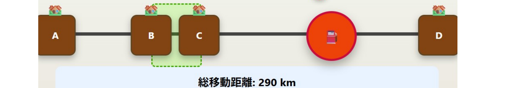

ツール：https://claude.ai/public/artifacts/2bb7e14c-1df9-4c01-ae3e-45fe6edeb43b　／　プロンプト：https://claude.ai/share/5c053617-2718-41f7-8319-0ed0ea2e2012

<!--
- 例：問題の解説を生成AIにしてもらう。一直線上の四つの町に石油を届け、各町の前に必ずタンクに戻る。移動距離が最短になるタンクの位置を問う問題。
- 正解は真ん中2つの街の上または間ならどこでも良い。この状況を学生に解説するための絵を作ってもらう。
-->

---

実際の教育活用の技を体験する

# (時間がある場合デモ) 探究の支援ツールにする

① web検索可能なAI (deep researchなど)で、調べるべき内容を教員が一気に検索しておく

② その内容で得られた「リンク」をもとに、学生の調べ学習の参考資料を出す (もちろん学生自身が自分で検索できることも重要)

③ 学生はGeminiで要約したり、理解するための道具としたり、教科との関連付けを調べたりする

<!--
- 時間がある場合のデモ。探究の支援ツールにする。
- ①web検索可能なAI（deep researchなど）で調べるべき内容を教員が一気に検索。②得られたリンクをもとに学生の調べ学習の参考資料を出す（学生自身の検索も重要）。③学生はGeminiで要約・理解の道具・教科との関連付けに使う。
-->

---

学生が使えるAIの活用例

# 学びのための学生が使えるAIの活用例

<table style="font-size:22px; border-collapse:separate; border-spacing:0 14px; width:100%;">
<tr>
<td style="width:38%; background:var(--section-bg); border-radius:10px; padding:12px 18px; vertical-align:middle;"><b>なぜ誤答だったのか、聞いてみる</b> ※直接聞くより間違えにくい</td>
<td style="width:4%;"></td>
<td style="border:2px solid #888; border-radius:8px; padding:12px 18px; vertical-align:middle;">自分は、〇〇と答えたけども、答えは△だった。自分はどこで勘違いしたのか？</td>
</tr>
<tr>
<td style="background:var(--section-bg); border-radius:10px; padding:12px 18px; vertical-align:middle;"><b>精緻的質問をしてみる</b> ※読書にも有効</td>
<td></td>
<td style="border:2px solid #888; border-radius:8px; padding:12px 18px; vertical-align:middle;">なぜそうなっているのか？どのようになっているのか？</td>
</tr>
<tr>
<td style="background:var(--section-bg); border-radius:10px; padding:12px 18px; vertical-align:middle;"><b>他の捉え方を聞いてみる</b> ※読書にも有効</td>
<td></td>
<td style="border:2px solid #888; border-radius:8px; padding:12px 18px; vertical-align:middle;">△について、自分は、〇〇と考えた。他の考え方はあるか。</td>
</tr>
</table>

<!--
- 学びのために学生が使えるAIの活用例（左＝目的、右＝プロンプト例）。
- なぜ誤答だったのか聞く（直接聞くより間違えにくい）／精緻的質問をしてみる（読書にも有効）／他の捉え方を聞いてみる（読書にも有効）。
-->

---

学生が使えるAIの活用例

# 学びのための学生が使えるAIの活用例

<table style="font-size:22px; border-collapse:separate; border-spacing:0 14px; width:100%;">
<tr>
<td style="width:38%; background:var(--section-bg); border-radius:10px; padding:12px 18px; vertical-align:middle;"><b>関連付け</b></td>
<td style="width:4%;"></td>
<td style="border:2px solid #888; border-radius:8px; padding:12px 18px; vertical-align:middle;">△について習ったことがある。□になりたい。◯はどう関係するのか？☓のいい比喩はないか？</td>
</tr>
<tr>
<td style="background:var(--section-bg); border-radius:10px; padding:12px 18px; vertical-align:middle;"><b>リフレクションや言語化のシミュレーション</b></td>
<td></td>
<td style="border:2px solid #888; border-radius:8px; padding:12px 18px; vertical-align:middle;">〇〇と言葉にしたけど伝わる?復習したいからコーチして</td>
</tr>
<tr>
<td style="background:var(--section-bg); border-radius:10px; padding:12px 18px; vertical-align:middle;"><b>英語で話してみる</b> ※文法は完璧</td>
<td></td>
<td style="border:2px solid #888; border-radius:8px; padding:12px 18px; vertical-align:middle;">I'm preparing for an upcoming presentation about AI…</td>
</tr>
</table>

<!--
- 学びのために学生が使えるAIの活用例（続き）。
- 関連付け（習ったこと・なりたい姿・関係・比喩を尋ねる）／リフレクションや言語化のシミュレーション（伝わるか確認・復習コーチ）／英語で話してみる（文法は完璧）。
-->

---

ライブアンケート

# AIに関して生徒から、 言われて困ったことありますか？

💬 <b>Slido</b> でご回答ください

<!--
- AIに関して生徒から、言われて困ったことはありますか。Slidoで聞いてみましょう。
-->

---

AIと学びの考え方 (例)

# AIと学びの考え方（例）

学習・学修の過程で絶対に使うな、という意味<b>ではない</b>

学生の現状

⇒

学修後の状態

<b>ねらい：</b> どこに向かうのか (授業の存在価値)

<b>達成目標：</b> 何が出来るようになるのか

<b>評価：</b> どのように測るのか

<b>設計：</b> どのように教えるのか

逆向き設計

<b>学びの場合、コスパ・タイパのために、AIを悪用してはいけません</b> 
自律的に学びを深めるために、<b>活用する文脈を学生と作りましょう</b>

<b>「AIができることをただ出力する、ということは、AIで事足りるので採用する必要はない」ということ</b>

<b>AIができない「高次」の価値を作るために、引き続き学ぶ必要はある</b>

Bowen &amp; Watson (2024). <i>Teaching with AI</i>. AAC&amp;U.

<!--
- 目標や設計を損なう形で使ってはいけない。AIができることをただ出力するなら、AIで事足りる。AIができない高次の価値を作るために、引き続き学ぶ必要はある。
-->

---

AIは「教える」のどこに影響するか

# 千葉大学における 生成AIの指針

令和５年１０月１３日

「生成 AI についての学び」「生成 AI を用いた学び」「生成 AI によらない学び」を<b>それぞれ推進</b>

<b>①</b> 授業での利用は、授業の目的に合致することが前提であり、合致するかは、各授業の担当教員が<b>判断</b> 　<b>禁止の場合はシラバスなどに明記</b>　(気になったら先生に聞くことの徹底)

<b>②</b> <b>授業・課題レベル</b>のコントロール 　① 使って良いとき、使ってはいけないときを示す 　② AIを使わずに、学ぶ価値を示す

<!--
- 千葉大学では、AIについての学び、AIを用いた学び、AIによらない学びをそれぞれ推進している。授業での利用は授業の目的に合致するかを担当教員が判断し、禁止ならシラバスに明記する。
-->

---

AIは「教える」のどこに影響するか

# 参考：職業への影響

内閣府(2024) 世界経済の潮流 ＞第1章＞p.13

<b>AIの影響が大きく、代替性が高い職業：</b>事務的タスクのシェアが大きい職業。　▶ つまり、AIがとって変わってしまう職業

<b>AIの影響が大きく、補完性が高い職業：</b>事務的タスクのシェアが大きいものの、意思決定の重要性が高く、AI任せとすることが社会的に望ましくない職業。　▶ AIを使いこなす必要のある職業

<b>AIの影響の小さい職業：</b>物理的タスクのシェアが大きい職業。

※ 教員・研究者(自然科学系)は、青の領域

<!--
- 内閣府の資料から、職業への影響を見てみる。教員・研究者(自然科学系)は、AIの影響が大きく補完性が高い、AIを使いこなす必要のある領域に位置づけられる。
-->

---

AIは「教える」のどこに影響するか

# ChatGPTは学習を高めるか？メタ分析

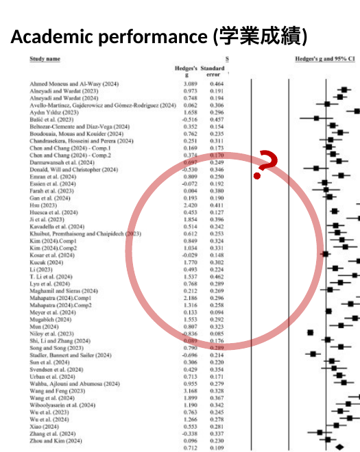

Academic performance (学業成績)

<b>Does ChatGPT enhance student learning?</b> A systematic review and meta-analysis of experimental studies

ChatGPTが主に(85%)大学生の学習に与える影響について、2022年から2024年にかけて発表された69本の教育実践をシステマティック・レビューしたもの (※語学32%)

<b>縦軸</b>：各研究名 
<b>Hedge's g</b>：各研究の効果量。大きいほどサンプルサイズが大きく結果の精度が高い (0.5で中程度、0.8超で大) 
<b>ひげ</b>：各研究の効果量の95%信頼区間 (CI)。0をまたがなければ統計的に有意

<b>見方</b>　中央の0を基準とし、右側は「ChatGPT利用が学習効果を高める」、左側は「ChatGPTが逆効果または効果なし」 
<b>結論</b>　一番下の菱形＝全研究を統合した全体の効果量。<b>学業成績を高める効果がある</b>とわかる。

<b>注意点：</b>9件はChatGPT使用を許可した状態でポストテストと明記 (例：Bašić et al., 2023; Li, 2023)。33件は使用が明示されておらず不明である。

Deng et al. (April 2025). <i>Computers &amp; Education</i>.

<!--
- ChatGPTが学習を高めるかを調べたメタ分析。一番下の菱形が全体の効果量で、学業成績を高める効果があるとわかる。ただし、ポストテストでのChatGPT使用許可の有無など、注意点もある。
-->

---

AIは「教える」のどこに影響するか

# 学習の質への影響メタ分析

<b>Does ChatGPT enhance student learning?</b>　A systematic review and meta-analysis of experimental studies　— Deng et al. (April 2025) Computers &amp; Education

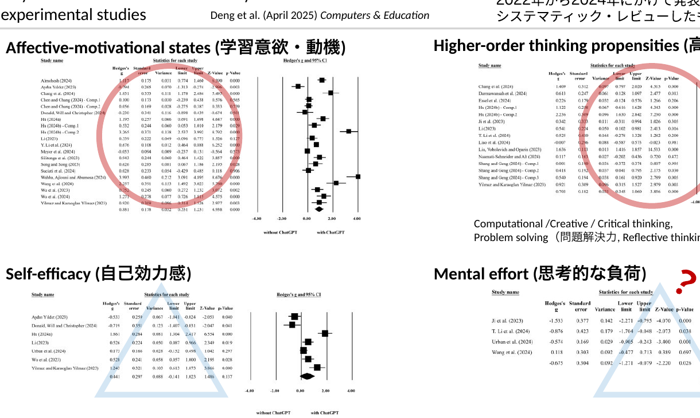

<b>Affective-motivational states (学習意欲・動機)</b>

<b>Higher-order thinking propensities (高次思考の傾向)</b> Computational / Creative / Critical thinking, Problem solving（問題解決力）, Reflective thinking（内省的思考）

<b>Self-efficacy (自己効力感)</b>

<b>Mental effort (思考的な負荷)</b>

<!--
- 同じメタ分析の、学業成績以外の4観点。学習意欲・動機、高次思考の傾向、自己効力感、思考的な負荷について、それぞれフォレストプロットで効果量を示している。
-->

---

学習目標から考えるAIの影響

# 学習目標分類設計

<table style="border-collapse:collapse; font-size:19px; width:100%;">
<thead>
<tr style="background:var(--accent-soft);">
<th style="border:1px solid #bbb; padding:5px 8px;"></th>
<th style="border:1px solid #bbb; padding:5px 8px;">認知的領域 (知識や思考)</th>
<th style="border:1px solid #bbb; padding:5px 8px;">学びへの生成AIの影響</th>
</tr>
</thead>
<tbody>
<tr><td style="border:1px solid #bbb; padding:5px 8px; font-weight:800; color:var(--accent);">高次</td><td style="border:1px solid #bbb; padding:5px 8px;"><b>創造</b> (学習を応用し、新しい価値を作れる)</td><td style="border:1px solid #bbb; padding:5px 8px;">人の創造性こそが大切</td></tr>
<tr><td style="border:1px solid #bbb; padding:5px 8px;"></td><td style="border:1px solid #bbb; padding:5px 8px;"><b>評価</b> (事物・判断等を比較し評価出来る)</td><td style="border:1px solid #bbb; padding:5px 8px;">評価軸/価値/判断は人が設定する</td></tr>
<tr><td style="border:1px solid #bbb; padding:5px 8px;"></td><td style="border:1px solid #bbb; padding:5px 8px;"><b>分析</b> (要素に分け、関係性を指摘できる)</td><td style="border:1px solid #bbb; padding:5px 8px;">解答/過程の支援可(例：要約・構造化・コーディング)</td></tr>
<tr><td style="border:1px solid #bbb; padding:5px 8px;"></td><td style="border:1px solid #bbb; padding:5px 8px;"><b>応用</b> (他の場面や状況に使用できる)</td><td style="border:1px solid #bbb; padding:5px 8px;">単なる問題では、 AIが解いてしまう…</td></tr>
<tr><td style="border:1px solid #bbb; padding:5px 8px;"></td><td style="border:1px solid #bbb; padding:5px 8px;"><b>理解</b> (学習内容を説明出来る)</td><td style="border:1px solid #bbb; padding:5px 8px;">説明/例示で支援可能 だが学修者の理解必須</td></tr>
<tr><td style="border:1px solid #bbb; padding:5px 8px; font-weight:800; color:var(--tag-blue);">低次</td><td style="border:1px solid #bbb; padding:5px 8px;"><b>記憶</b> (事実や概念を暗記している)</td><td style="border:1px solid #bbb; padding:5px 8px;">支援可能だが、 学修者の記憶必須</td></tr>
</tbody>
</table>

左は栗田&amp;中村 (2023)を元に作成 ／ 原著 Bloom (1956/1964)、改訂版(2001)を記載

<b>学修の目標を構造化し、学びの設計を支援</b>

※近年では、下から個別・段階的に行うのではなく、<b>複数の次元の要素を組み合わせる</b>必要性が叫ばれている。 
※近年では、学び方の学びや、人間性の涵養などを含む、学習目標分類も作成されている (e.g. Finkの学習目標分類) 
※但し、<b>低次(特に記憶・理解・応用の段階)を蔑ろにして、高次の学修目標の達成は難しい</b>と想定される。

<b>授業におけるAI利用の指針となり得る</b>

<b>AI が答えを出せるとしても、途中を学ぶことは引き続き必要では？</b>

<!--
- ブルームの学習目標分類で、認知的領域を低次から高次に並べ、それぞれへの生成AIの影響を考える。低次を蔑ろにして高次の達成は難しい。AIが答えを出せても、途中を学ぶことは引き続き必要では。
-->

---

学び方は変わる？

# 学び方は変わる？

14世紀 @ ドイツ

Laurentius de Voltolina

現在？

Generated by DALL-E

<b>社会</b>も、<b>科学技術</b>も、<b>教育理論</b>も進歩。でも、<b>授業は同じまま</b>？

<table style="border-collapse:collapse; font-size:21px; width:100%;">
<tr style="background:var(--accent-soft);"><th style="border:1px solid #bbb; padding:4px 8px;"></th><th style="border:1px solid #bbb; padding:4px 8px;">認知的領域</th></tr>
<tr><td style="border:1px solid #bbb; padding:4px 8px; font-weight:800; color:var(--accent);">高</td><td style="border:1px solid #bbb; padding:4px 8px;">創造</td></tr>
<tr><td style="border:1px solid #bbb; padding:4px 8px;"></td><td style="border:1px solid #bbb; padding:4px 8px;">評価</td></tr>
<tr><td style="border:1px solid #bbb; padding:4px 8px;"></td><td style="border:1px solid #bbb; padding:4px 8px;">分析</td></tr>
<tr><td style="border:1px solid #bbb; padding:4px 8px;"></td><td style="border:1px solid #bbb; padding:4px 8px;">応用</td></tr>
<tr><td style="border:1px solid #bbb; padding:4px 8px;"></td><td style="border:1px solid #bbb; padding:4px 8px;">理解</td></tr>
<tr><td style="border:1px solid #bbb; padding:4px 8px; font-weight:800; color:var(--tag-blue);">低</td><td style="border:1px solid #bbb; padding:4px 8px;">記憶</td></tr>
</table>

<b>座学の講義で理解を促すだけ</b>では、到達出来たり、授業中に試せたりする<b>目標の範囲が狭くなりがち</b>。そこで、<b>課題中心や実験中心など、「起こりそうな問題」や「実験」を設計の軸にする</b>ことで、より深く学べるようになるのでは？

<!--
- 14世紀の講義風景と現在の講義風景。社会も科学技術も教育理論も進歩したのに、授業は同じままではないか。座学だけでは到達できる目標の範囲が狭くなりがち。課題中心や実験中心の設計で、より深く学べるのでは。
-->

---

学び方は変わる？

# 学び方は変わる？

積み上げて受動的に学ぶ

：学校的学び方

📈❓

どこかで頭打ちする

▶

最終到達点から探究的に学ぶ

：職人的/芸術家的学び方？

🏔️❗

高みから中間地点を学ぶ

「なぜ学ぶのか、どのように学ぶのか、何を学ぶのか」の変質

<b>まずは、自分から、学び方を変えてみよう</b>　▶　できないかな、と思ったら<b>使ってみる</b>

<!--
- 積み上げて受動的に学ぶ学校的学び方は、どこかで頭打ちする。最終到達点から探究的に学ぶ職人的・芸術家的学び方では、高みから中間地点を学ぶ。なぜ・どのように・何を学ぶのかが変質する。まずは自分から学び方を変えてみよう。
-->

---

(参考) AIリテラシ OECD (2023)

# (参考) AIリテラシ OECD (2023)

AIの技術面を批判的に評価し、AIを効果的に活用できる能力 
(communicate and collaborate)

第１：AIの基本的な機能と日常生活におけるAIの使用方法に関する知識 第２：様々な場面に応用することのできる能力 第３：AIを実装し、評価することができる能力 第４：アルゴリズムの開発に必要なデータを管理する能力とAIの出力結果を批判的に考察する能力

<b>AIを理解し、活用し、監視し、批判的に考察できるスキル</b>

<b>各国でリスキリング/学校教育への取り込みが行われている</b>

内閣府(2024) 世界経済の潮流 ＞第1章＞p.32

<!--
- OECDのAIリテラシの定義。AIの技術面を批判的に評価し、効果的に活用できる能力。AIを理解し、活用し、監視し、批判的に考察できるスキル。各国でリスキリングや学校教育への取り込みが行われている。
-->

---

AIとどうか変わるかの例

# 共同知能 Co-Intelligence

<b>AIは人と異なる知能</b>である。「<b>異星人の心</b>」でありいくら人間っぽくても、性質が違う。

AI

たくさん考えるのは得意！

言葉にするのは得意！ニュアンスさえも。

人

一番本質を見抜くのが得意！

<b>感覚的にわかる！</b>なぜか間違わない。

例えば、、、

→ AIをアイデア出し・ブレインストーミングにつかってはどうか 　　※自分がすることや「なぜ」をAIに聞くのは筋が悪い

→ AIが持っていない、タイプの知がある？

Mollick著、久保田訳 (2024). 『これからのAI、正しい付き合い方と使い方』.

<!--
- 共同知能、コ・インテリジェンス。AIは人と異なる知能で、異星人の心。たくさん考え、言葉にするのはAIが得意。本質を見抜き、感覚的にわかるのは人が得意。AIはアイデア出しに使い、人にしかないタイプの知を活かす。
-->

---

AIとどうか変わるかの例

# 共同知能 Co-Intelligence

<b>AIは人と異なる知能</b>である。「<b>異星人の心</b>」でありいくら人間っぽくても、性質が違う。

<b>共同知能についての4つのルール</b>

AIを参加させる。 
人間参加型のデザインにする。 
AIにペルソナを与える。 
今使っているAIは、今後使用するどのAIよりも劣悪と仮定する。

<b>＋ でてきた情報を、批判的に考える</b> 
<b>＋ 先生は学びの文脈をAIに与えてみる</b> 
<b>＋ マイルールを作って行くことが大切</b>

Mollick著、久保田訳 (2024). 『これからのAI、正しい付き合い方と使い方』.

<!--
- Mollickの共同知能についての4つのルール。AIを参加させる、人間参加型のデザインにする、AIにペルソナを与える、今使っているAIは今後のどのAIよりも劣悪と仮定する。加えて、出てきた情報を批判的に考え、先生は学びの文脈をAIに与え、マイルールを作っていくことが大切。
-->

---

<!-- _class: message -->

1　イントロ

💬

高校の教育でAIとどのように関わっていきたいですか

The <u>Slido app</u> must be installed on every computer you're presenting from

<!-- スライドにアクセスし、高校教育でのAIとの関わり方を書き込んでもらう。 -->

---

<!-- _class: message -->

1　イントロ

🗳️

満足度を教えて下さい

The <u>Slido app</u> must be installed on every computer you're presenting from

<!-- slidoで本日の満足度を回答してもらう。 -->

---

<!-- _class: message -->

1　イントロ

💬

Audience Q&amp;A

The <u>Slido app</u> must be installed on every computer you're presenting from

<!-- 会場からの質問をslidoで受け付ける。 -->

---

今日の目的

# まとめ

1.　イントロ / <b>職場が持つAIの印象を知る</b> 
2.　<b>AIを実際に使ってみる</b> 
3.　<b>AIの背景にある考え方</b>を知る 
4.　<b>教育利用上の注意点</b>を知る 
5.　<b>活用例で、</b>体験する 
6.　<b>教育応用を考えてみる</b> 
7.　教育応用のアイデアを共有し、AIをどう使うか考える

<!-- 本日扱った7つのセッションを振り返る。 -->

---

<!-- _class: message -->

おわり

<h1 style="text-align:center; font-size:64px; line-height:1.25; margin:10px 0 26px;">ご清聴いただき、 ありがとうございました</h1>

AIの影響は避けられないと思います。 
ならば、もっと生徒のためになる方向へ、 
きっと活用する道があると思います。  
「定時制だからこそできる学び」に「AI」を足すと、 
面白い事ができるはずです！ 
ともに、良い教育を作るべく、一緒に進んでいきましょう。

<!-- 締めのメッセージ。定時制だからこそできる学びにAIを足す可能性を語り、ともに良い教育を作ろうと呼びかける。 -->

---

すぐにできること：課題での注意点

# 課題での注意点

参考課題における記載例 (Bowen &amp; Watson, AAC&amp;U 2024)

<b>事前に授業における生成AI利用のポリシーを共有する</b>

‐ AI の使用が許可または禁止されるのはいつか？なぜか？

‐ AI とのブレインストーミングはカンニングにあたるのか？

‐ AI がこのクラスで学習をどのように強化または妨げる可能性があるのか？

‐ AI が許可されている場合、学生は課題提出の一環として AI プロンプトを共有する必要があるのか？

‐ AI の使用はどのようにクレジットされるべきか？

‐ AI の限界に関する警告

‐ AI 検出ツールの使用計画とその情報の使用方法に関する説明

<!-- メタな点：①ルーブリックでの採点やフィードバック支援はAIが可能になった -->

---

すぐにできること：課題での注意点

# 課題での注意点

参考課題における記載例 (Bowen &amp; Watson, AAC&amp;U 2024)

<b>事前に授業における生成AI利用のポリシーの例</b>

このライティングコースの目標の一つは、効果的に書き、コミュニケーションをとる方法を学ぶことだ。これは練習が必要である。AIを使って迅速に生産することも期待されるが、<b>そもそも質の高い文章を自分で作成、編集し、認識する能力も必要</b>である。AIが自分を介さずに作業を行うことができる場合、それは雇用されるに値するスキルを持っていない、いうことになる。だから、練習しよう。 
それを達成するために、コースの前半では、AIのサポートは一切禁止する。この過程の苦労やもどかしさは、レベル上げ訓練のようなものと捉えてほしい。自分で作業を行う人が利益を得るのだ。 
一方、コースの後半では、特定の状況下でAIを使用することが許可される場合がある。AIの使用を認める必要がある。使用したプロンプトとその応答を提出するよう求める場合がある。 
AIリテラシーは重要な新しいスキルだ。Aiは「幻覚：事実のように見えるものを生成する可能性」があることに注意が必要である。この技術の利点と潜在的な危険性の両方について批判的に考える必要がある。 
あなたは依然として最終的な成果物およびAIからの制限やバイアスの可能性について責任を負う。このポリシーは必要に応じて変更する権利を留保する。

<!-- メタな点：①ルーブリックでの採点やフィードバック支援はAIが可能になった -->

---

1　イントロ

# ツール (海外：教員支援)

<table style="width:100%; border-collapse:collapse; font-size:16px; line-height:1.4;">
<thead>
<tr style="background:var(--accent); color:#fff;">
<th style="padding:5px 8px; border:1px solid #ccc;">Application</th>
<th style="padding:5px 8px; border:1px solid #ccc;">ユーザー数</th>
<th style="padding:5px 8px; border:1px solid #ccc;">地域</th>
<th style="padding:5px 8px; border:1px solid #ccc; width:32%;">Key Features</th>
<th style="padding:5px 8px; border:1px solid #ccc; width:34%;">Strengths</th>
</tr>
</thead>
<tbody>
<tr>
<td style="padding:5px 8px; border:1px solid #ccc;"><b>Khamigo</b></td>
<td style="padding:5px 8px; border:1px solid #ccc;">1億6000万人以上 (含む学習者・保護者)</td>
<td style="padding:5px 8px; border:1px solid #ccc;">Global (USA-based)</td>
<td style="padding:5px 8px; border:1px solid #ccc;">Khan Academyが開発したAI搭載の学習支援ツール。学生向けのパーソナルチューターと教師向けのアシスタント機能を提供。米国内は、MSの投資により無料。日本からは接続不可。</td>
<td style="padding:5px 8px; border:1px solid #ccc;">For 教員：多言語の保護者向けメール、授業計画作成、評価基準、授業内活動、正解付き問題集など、様々な教材の素早い草案作成をサポート　For 学生：通常のAIとは異なり、単に答えを提供するのではなく、チューターとして学生が問題を自分で解決できるよう批判的思考を促進</td>
</tr>
<tr style="background:var(--section-bg);">
<td style="padding:5px 8px; border:1px solid #ccc;"><b>MagicSchool.ai</b></td>
<td style="padding:5px 8px; border:1px solid #ccc;">~500万人</td>
<td style="padding:5px 8px; border:1px solid #ccc;">Global (USA-based)</td>
<td style="padding:5px 8px; border:1px solid #ccc;">教育者向けAIアシスタントプラットフォーム。授業計画、個別教育プログラム（IEP）、学習活動、評価などを生成。100種類以上のコンテンツテンプレートを提供し、15言語以上をサポート。</td>
<td style="padding:5px 8px; border:1px solid #ccc;">教師の計画作業と事務作業の時間を節約し、バーンアウト対策に貢献。160地域以上（ほぼすべての米国学区）で採用。プライバシー重視。</td>
</tr>
<tr>
<td style="padding:5px 8px; border:1px solid #ccc;"><b>Eduaide.ai</b></td>
<td style="padding:5px 8px; border:1px solid #ccc;">N/A (thousands of users, 2023)</td>
<td style="padding:5px 8px; border:1px solid #ccc;">Global (USA-based)</td>
<td style="padding:5px 8px; border:1px solid #ccc;">教師向けオールインワンAIワークスペース。教材用コンテンツジェネレーター、IEP計画やメール作成の「ティーチングアシスタント」、学生作品へのフィードバックボット、自由形式のAIチャット、クイズ/評価ビルダーを提供。</td>
<td style="padding:5px 8px; border:1px solid #ccc;">100種類以上のリソースタイプが利用可能で多目的。生成されたコンテンツを15言語以上に即時翻訳。指導の差別化をサポート（例：調整案の提案）。</td>
</tr>
<tr style="background:var(--section-bg);">
<td style="padding:5px 8px; border:1px solid #ccc;"><b>Curipod</b></td>
<td style="padding:5px 8px; border:1px solid #ccc;">150,000+ teachers (2023)</td>
<td style="padding:5px 8px; border:1px solid #ccc;">Global (Norway)</td>
<td style="padding:5px 8px; border:1px solid #ccc;">生成系AIを組み込んだインタラクティブな授業作成プラットフォーム。教師がトピックを入力すると、投票、ワードクラウド、クイズ、ディスカッションプロンプトを含む授業スライドを生成。記述回答に対するAIベースの個別フィードバックを提供。</td>
<td style="padding:5px 8px; border:1px solid #ccc;">インタラクティブでゲーム化されたコンテンツで学生の参加を促進。AIコンテンツを教師が確認しながら、授業準備時間を大幅に削減。2023年後半までに24万の授業が作成され、100万人の学生に到達。教師向け無料AIトレーニング（認定プログラム）を提供。</td>
</tr>
<tr>
<td style="padding:5px 8px; border:1px solid #ccc;"><b>Education Copilot</b></td>
<td style="padding:5px 8px; border:1px solid #ccc;">N/A (new in 2023)</td>
<td style="padding:5px 8px; border:1px solid #ccc;">Global (UK-based)</td>
<td style="padding:5px 8px; border:1px solid #ccc;">教育者・トレーナー向けオールインワンAIプラットフォーム。授業計画の生成とリソース作成を自動化。出席確認や採点などの管理タスクを処理する仮想教育アシスタントを提供し、授業計画中にリアルタイムの提案を行う。</td>
<td style="padding:5px 8px; border:1px solid #ccc;">指導と管理業務の両方を効率化し、準備時間を節約して教室管理を容易に。カスタマイズとコンテンツ編集のためのユーザーフレンドリーなインターフェースを提供。インタラクティブな学生参加（即時フィードバック、学生コラボレーション機能など）をサポート。</td>
</tr>
</tbody>
</table>

<!-- 海外の教員支援ツールを一覧で紹介。 -->

---

1　イントロ

# ツール (海外：教員支援)

英国では2023年11月にかけて、<b>初等中等のAI利用教員の割合が17%から42%に上昇</b> 
　cf. Among online UK youths aged 16-24, 74% have used a GenAI tool.

米国でも2024年秋までに<b>約43%の教員がAI研修を受ける</b>ように 
n = 1135, EdWeek Research Center survey, 2024

<b>トレンド</b>

<b>教師の業務効率化</b> 
　授業計画の作成、教材リソース開発、採点、管理業務の自動化 
　事務作業時間の削減により、より学生に集中できる環境作り 
　多言語対応を含む多様なコンテンツテンプレートの提供 
<b>パーソナライズされた学習支援</b> 
　学生の進捗データ分析と指導法の提案 
　適応型学習コンテンツの提供 
　学生の個別フィードバック生成

https://www.ai-in-education.co.uk/news-events/dfe-generative-ai-in-education-report　/　https://www.edweek.org/technology/were-at-a-disadvantage-and-other-teacher-sentiments-on-ai/2024/10

<!-- 各国で教員のAI利用・研修が拡大しているトレンドを示す。 -->

---

1　イントロ

# ツール (海外：教員養成・PD)

<b>トレンド：AIコーチングとメンタリング</b>　教師のリフレクション（自己省察）を促すシステム / シミュレーションの提供 / 人間のメンターを補完、専門家の意見をスケールする

<table style="width:100%; border-collapse:collapse; font-size:15.5px; line-height:1.4;">
<thead>
<tr style="background:var(--accent); color:#fff;">
<th style="padding:5px 8px; border:1px solid #ccc;">Application</th>
<th style="padding:5px 8px; border:1px solid #ccc;">ユーザー数</th>
<th style="padding:5px 8px; border:1px solid #ccc;">地域</th>
<th style="padding:5px 8px; border:1px solid #ccc; width:34%;">Key Features</th>
<th style="padding:5px 8px; border:1px solid #ccc; width:32%;">Strengths</th>
</tr>
</thead>
<tbody>
<tr>
<td style="padding:5px 8px; border:1px solid #ccc;"><b>AI Coach by Edthena</b></td>
<td style="padding:5px 8px; border:1px solid #ccc;">Used in multiple U.S. districts</td>
<td style="padding:5px 8px; border:1px solid #ccc;">USA (available globally)</td>
<td style="padding:5px 8px; border:1px solid #ccc;">専門能力開発向け仮想AIコーチ。教師が自身の授業ビデオを録画・アップロードし、AIコーチから分析とフィードバックを受けられるシステム。経験豊富な指導コーチによって訓練されたAIが、研究に基づいたコーチングを提供。4ステッププロセス：分析、振り返り、実行、影響評価で実施する。</td>
<td style="padding:5px 8px; border:1px solid #ccc;">すべての教師にいつでもコーチングを無制限で提供　パーソナライズされた成長プラン：各教師の目標と教室データに合わせたコンテンツ　管理者がダッシュボードを通じて専門能力開発の進捗を追跡できる</td>
</tr>
<tr style="background:var(--section-bg);">
<td style="padding:5px 8px; border:1px solid #ccc;"><b>AI Classroom Simulator (Relay/Wharton)</b></td>
<td style="padding:5px 8px; border:1px solid #ccc;">PoC (rolling out 2024)</td>
<td style="padding:5px 8px; border:1px solid #ccc;">USA</td>
<td style="padding:5px 8px; border:1px solid #ccc;">教師養成生のためのAI駆動の教育シミュレーション。「AIが実際の教師養成と開発を代替ではなく補完するのにどのように役立つか」がkey。研修生はAI生成の生徒アバターとテキストベースの仮想教室シナリオに参加。AI指導者（「バーチャルコーチ」）が研修生をガイドする。</td>
<td style="padding:5px 8px; border:1px solid #ccc;">新任教師が教室でのやり取りを練習するための安全でリスクの低い環境を提供　ふさわしい特定の行動を他のものよりも選ぶ「理由」を考えるのを助けるよう設計　即時フィードバックと、振り返り再試行する機会を提供し、スキル開発を加速</td>
</tr>
<tr>
<td style="padding:5px 8px; border:1px solid #ccc;"><b>StretchAI (ISTE/ASCD)</b></td>
<td style="padding:5px 8px; border:1px solid #ccc;">Beta testing (2024)</td>
<td style="padding:5px 8px; border:1px solid #ccc;">USA (global reach)</td>
<td style="padding:5px 8px; border:1px solid #ccc;">教育者の専門能力開発（PD）のためのAIコーチ。Q&amp;Aと指導アシスタントとして機能し、教師が教育戦略や課題についてアドバイスを求めると、StretchAIは審査済みの研究ベースの出版物やベストプラクティスリソースのライブラリから回答を提供。</td>
<td style="padding:5px 8px; border:1px solid #ccc;">信頼できる知識ベースを持ち、アドバイスは検証された研究や教育専門家の意見に基づく（単なるオープンウェブチャットボットではない）　教育学と教師のニーズに焦点を当て、的を絞ったガイダンスを実施</td>
</tr>
</tbody>
</table>

<!-- 海外の教員養成・PD向けのAIコーチング／シミュレーションツールを紹介。 -->

---

1　イントロ

# 教員養成での研究例 まとめ

数学科の教員志望者にChatGPT (GPT-3.5)をミニ授業（microteaching）の指導案作成アシスタントとして使わせ、出力の有用性や問題点を分析。ChatGPTの教育的アウトプットを批判的に評価できたが、数学的な出力に関しては誤った解答を「別のアプローチ」と誤解することがあった。

ChatGPTの授業計画作成能力の認識を調査。STEM、TESOL、社会科の方法論コースに登録されている59人の教員を目指す学部生と大学院生を対象。「アイデア源としては役立つが、生成内容の精査・補完が教師の重要な役割」との認識を深めた。

仮想学生“応答型AIチャットボット”との対話は教育実習生の「気づき能力」を向上させるか。質問実践力に顕著な差が観察された。

<b>まとめ</b> 
多数の研究成果があり、 
‐ AIでシミュレーション用ツールを創ったもの 
‐ AIをツールと活用してみたもの 
‐ AIをリフレクションなどに活用するもの 
が目立つ

国内での研究はそこまで多くない気がする 
文化・制度依存性を踏まえ、国内での検証が待たれる

<!-- 教員養成領域でのAI研究例を3件紹介し、傾向と国内での検証の必要性をまとめる。 -->

---

授業設計はどう変わる？

# IDの第一原理 参考

参考：ID(インストラクショナル・デザイン)の第一原理

<b>インストラクション</b>：学習を促進させるために行うことすべて

<table style="width:100%; border-collapse:collapse; font-size:23px; line-height:1.25;">
<thead>
<tr style="background:var(--accent); color:#fff;">
<th style="padding:5px 14px; border:1px solid #ccc; width:42%;">5つの要件</th>
<th style="padding:8px 14px; border:1px solid #ccc;">説明</th>
</tr>
</thead>
<tbody>
<tr>
<td style="padding:5px 14px; border:1px solid #ccc;">①問題(Problem)</td>
<td style="padding:5px 14px; border:1px solid #ccc;">現実に起こりそうな問題に挑戦する</td>
</tr>
<tr style="background:var(--section-bg);">
<td style="padding:5px 14px; border:1px solid #ccc;">②活性化(Activation)</td>
<td style="padding:5px 14px; border:1px solid #ccc;">すでに知っている知識を動員する</td>
</tr>
<tr>
<td style="padding:5px 14px; border:1px solid #ccc;">③例示(Demonstration)</td>
<td style="padding:5px 14px; border:1px solid #ccc;">例示がある(Tell me でなく Show me)</td>
</tr>
<tr style="background:var(--section-bg);">
<td style="padding:5px 14px; border:1px solid #ccc;">④応用(Application)</td>
<td style="padding:5px 14px; border:1px solid #ccc;">応用するチャンスがある(Let me)</td>
</tr>
<tr>
<td style="padding:5px 14px; border:1px solid #ccc;">⑤統合(Integration)</td>
<td style="padding:5px 14px; border:1px solid #ccc;">現場で活用し、振り返るチャンスがある</td>
</tr>
</tbody>
</table>

鈴木克明（2015）『研修設計マニュアル』北大路書房

<!-- IDの第一原理（メリル）の5要件を表で示す。 -->

---

AIとの付き合い方

# 課題中心型の授業設計 参考

<b>✗問題解決型</b>：現実の解決する形で設定するが、どのような学びや学問を使用するかは、明確にデザインされていない (スキル獲得を目指すもの)。

<b>◯課題中心型</b>：現実に起きそうな問題を、教員が小問 (道しるべ) や試行錯誤、ワークなど、使用する概念や獲得される学びを把握して、学習課程を設計する。

<b>方法</b>

①新しい全体的なタスクを見せる

②タスクに必要な構成要素を提示する

③タスクに関する構成要素を演示する

④もう一つ新しい全体タスクを見せる

⑤学修者に、既習の構成要素を新タスクに応用させる

⑥この新タスクに必要となる追加的な構成要素を提示する 　補足：追加部分は、AIに支援させるなども可能

⑦これらの追加的な構成要素を演示する

⑧ステップ4~7を続くステップにも繰り返す

ブランチ・メリル (2013)

<b>AI時代に容易になった学び方にも対応</b> (cf. 100日チャレンジ)

<!-- 課題中心型の授業設計を紹介。問題解決型との違いと8ステップの方法を示す。 -->

---

AIとの付き合い方

# 反転授業

基礎知識に関する(メディア)学習を<b>事前に</b> 
　<b>その後の授業では議論・演習を行うブレンド型</b>

　医学部等でも<b>実践論文</b>あり / Stanfordの取組が有名

高度化型

<ul>
<li>‐ <b>高次目標</b>を演習や実験で</li>
</ul>

完全習得型

<ul>
<li>‐ <b>理解の確認や質問</b>を教室で</li>
</ul>

✔アクティブラーニングを取り入れ教育効果を高めやすい 
✔教員は多様な学生に対応しやすく、効率化もしやすい 
✔学生は疑問点や関心を持ち、自己に最適な授業に臨める

<b>今までは動画教材だったが、AI教材でも多分出来る</b>

<!-- 反転授業の概要。高度化型・完全習得型の2類型と、AL・効率化・最適化の利点を示す。 -->

---

AIとの付き合い方

# 反転授業

基礎知識に関する(メディア)学習を<b>事前に</b> 
　<b>その後の授業では議論・演習を行うブレンド型</b>

　医学部等でも<b>実践論文</b>あり / Stanfordの取組が有名

高度化型

<ul>
<li>‐ <b>高次目標</b>を演習や実験で</li>
</ul>

完全習得型

<ul>
<li>‐ <b>理解の確認や質問</b>を教室で</li>
</ul>

✔アクティブラーニングを取り入れ教育効果を高めやすい 
✔教員は多様な学生に対応しやすく、効率化もしやすい 
✔学生は疑問点や関心を持ち、自己に最適な授業に臨める

<b>今までは動画教材だったが、AI教材でも多分出来る</b>

<!-- 反転授業の再掲（同一構成）。 -->

---

AIとの付き合い方

# メディア授業の強み・弱み・配慮点

強み

<ul>
<li>①<b>設定した目標への到達</b>は得意</li>
<li>②<b>情報を効率的に提示し理解</b>に至りやすい</li>
<li>③<b>時間・場所的な融通</b>が効く</li>
</ul>

弱み

<ul>
<li>①<b>意図しない学びの発生</b>が難しい</li>
<li>②ジェネリックスキル形成に繋がり難い</li>
<li>③疲れやすい/集中しにくい</li>
</ul>

要配慮

<ul>
<li>①学生/教師‐学生間の<b>コミュニケーション</b></li>
<li>②学生側の視聴環境に差がある</li>
</ul>

AI教材利用の場合の注意も近い？ <b>→ 人×教室×AIの重要性</b>

<!-- メディア授業の強み・弱み・要配慮を3カラムで整理し、AI教材にも通じると示す。 -->

---

AIリテラシと図書館の役割

# AIリテラシと図書館の役割

Engineering LibrarianによるLLMの講義とディスカッションを実施 
探究ベースのコースワークや人工知能の限界やユースケースについて、より洗練された理解を学生がもつ助けになった事例

“Despite the urgency of AI literacy, there is a lack of structured approaches to teaching these skills in higher education. <b>Because the expertise of academic librarians lies in information literacy, innovative pedagogy, and interdisciplinary collaboration, they are uniquely positioned to address this gap.</b> Librarians are already adept at teaching students to evaluate sources, engage with diverse information systems, and consider the ethical aspects related to information use. Building on these strengths, academic librarians can play a pivotal role in fostering AI literacy by delivering scaffolded workshops that align with varying levels of familiarity with AI concepts.”

Scaffolding AI literacy: An instructional model for academic librarianship, <i>The Journal of Academic Librarianship</i> https://www.sciencedirect.com/science/article/pii/S0099133324000600 / https://www.sciencedirect.com/science/article/pii/S0099133325000370

<!-- ハンプサイクル。AIリテラシ教育で図書館（情報リテラシの専門家）が果たせる役割を示す。 -->

---

学習のまとめ(2/2)

# 生成AI活用に当たって注意すべきポイントは？

情報の正確性

<ul>
<li>無意識のうちに合理的ではない行動、偏った判断をすることがあるという意識を持つ</li>
<li>チェックリストを用いて真偽を判断する</li>
<li>安易に拡散しない / 拡散したいときはひと呼吸おく</li>
</ul>

情報流出

<ul>
<li>生成AIサービスの規約を確認する(商用利用可否、損害発生時の責任所在等)</li>
<li>個人情報や機密情報の入力は必要最小限にする</li>
<li>生成AIに入力したデータを学習に使わせないように設定する</li>
</ul>

知的財産権の侵害

<ul>
<li>既存のものや実在の人物に似たものを生成するような指示入力を避ける</li>
<li>生成物が既存のものや実在の人物に類似している場合、利用をやめる/権利者から許諾を取得後に利用する/既存のものと類似しないよう大幅に加工する</li>
</ul>

活用者としてのモラル

<ul>
<li>本来自分が行うべきことまで生成AI任せにしない</li>
<li>生成AIが作った偏見のある回答を使用しない</li>
<li>生成AIを非倫理的な行為や犯罪に悪用しない</li>
</ul>

<!-- 生成AI活用にあたっては、情報の正確性、情報流出、知的財産権の侵害、活用者としてのモラル、それぞれについて、今回学習した内容を心がけましょう。 -->

---

関連資料

# 関連資料

<b>「AI事業者ガイドライン第1.0版(案)」</b> (総務省・経済産業省) 事業活動においてAIを活用する事業者を対象としたガイドライン　※後日「第1.0版」として両省HPに公表予定

<b>「上手にネットと付き合おう！～安心・安全なインターネット利用ガイド～」</b> (総務省) 安全なインターネット利用に関する様々なコンテンツを公開（「インターネットトラブル事例集」／啓発教育教材「インターネットとの向き合い方」／家庭で学ぶデジタル・シティズンシップ）

<b>情報モラル学習・教育サイト</b> (文部科学省) 小～高校生向け「情報モラル学習サイト」／教員向け「情報モラル教育ポータルサイト」

<b>「マナビDX」</b> (経済産業省) デジタルスキルを身につける講座を紹介するポータルサイト

<b>「デジタルスキル標準（DSS）」</b> (経済産業省) DX時代の個人の学習や企業の人材確保・育成の指針。2023年8月改訂にて⽣成AIに関するリテラシーを追加。

<b>「楽しく学ぼう みんなの著作権」</b> (文化庁) 小学生のための著作権教材

<b>「AIと著作権」</b> (文化庁) 現行の著作権法の考え方やAIと著作権の関係を説明

<!-- 生成AIリテラシ・著作権・情報モラルに関する公的な関連資料を一覧で紹介。 -->

---

活用者としてのモラル

# 著作権上の論争

AIが学習した作品に似た画像が生成される場合があるとして、著作権上の論争を呼んでいる

海外では、アーティストが自分たちの作品が画像生成AIの学習に使われ、著作権が侵害されたとして、画像生成AIの開発元に対して訴訟を起こした

<b>✕Bad</b>　著作権侵害の知識がないユーザーが生成した画像を外部に発信することで、著作権を侵害し、訴訟等に発展する可能性

ハンバーガーを持つロボットを、◯◯氏の画風で　等を画像生成AIに入力

画像生成AIの出力 ※1

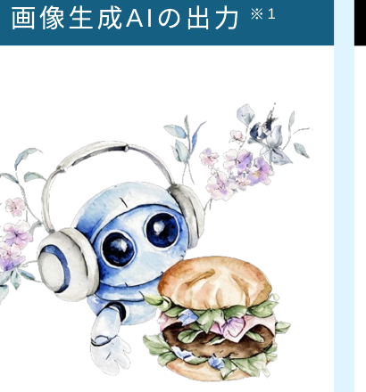

アーティストの作品 ※1

Source: New York Times, This Tool Could Protect Artists From A.I.-Generated Art That Steals Their Style　※1：画像はすべて架空の作品であり実例ではない

<!-- 海外では、アーティストが自分たちの作品が画像生成AIの学習に使われ、著作権が侵害されたとして、画像生成AIの開発元に対して訴訟を起こしました。 / 著作権侵害の知識がないユーザーが生成した画像を外部に発信することで、著作権を侵害し、訴訟等に発展する可能性があります。 -->

---

<!-- _class: divider -->

目次

1生成AIとは何か？

2生成AIをどのように使うか？

3生成AI活用にあたって 注意すべきポイントは？

おわりに

基礎知識

生成AIにまつわる変化

生成AIの用途

生成AIサービスの使い方

情報の正確性

情報流出

知的財産権の侵害

活用者としてのモラル

学習のまとめ、関連資料

<!-- 目次（章扉）。第3章「生成AI活用にあたって注意すべきポイントは？」の中の「情報流出」へ。 -->

---

情報流出

# 情報流出のリスク

個人情報や機密情報を生成AIに入力すると、情報流出のリスクがある

生成AIは、 利用者が入力したデータを 学習データとして利用 することがある

<b style="color:var(--accent);">リスク 1</b> 個人情報 ※1 や社外秘の機密情報 ※2を入力すると、他⼈の質問への回答に使われ、情報が漏洩する可能性がある

<b style="color:var(--accent);">リスク 2</b> 漏洩した情報がサイバー犯罪などに悪⽤される恐れがある

※1：個人情報の例: 氏名、電話番号、住所、メールアドレス、生年月日、公的ID番号、学校・職場の情報、顔写真など　※2：機密情報の例：経営・営業に関する情報、顧客や社員のデータ、技術情報、法的文章、業務上の秘密、議事録など

<!-- 個人情報や機密情報を生成AIに入力すると、情報流出のリスクがあります。 / なぜかと言うと、生成AIの仕組み上、利用者が入力したデータが学習データとして活用されることがあるためです。 / 個人情報や社外秘の機密情報を入力すると、他人の質問への回答に使われ、情報が漏洩する可能性があるほか、 / 漏洩した情報がサイバー犯罪などに悪用される恐れがあるため、注意が必要です。 -->

---

年齢制限

# Terms of use を読む

<b>Terms of use (利用規約)を読む / AIに読み込ませる</b>

<table style="width:100%; border-collapse:collapse; font-size:23px; line-height:1.5; margin-top:6px;">
<tbody>
<tr>
<td style="padding:8px 16px; border:1px solid #ccc; width:18%; font-weight:800; background:var(--section-bg);">ChatGPT</td>
<td style="padding:8px 16px; border:1px solid #ccc;">13才以上は可だが、<b>18才未満は保護者同意必須</b></td>
</tr>
<tr>
<td style="padding:8px 16px; border:1px solid #ccc; font-weight:800; background:var(--accent-soft); color:var(--accent-dark); border:2px solid var(--accent);">Gemini</td>
<td style="padding:8px 16px; border:1px solid #ccc;">13才以上可　<b>但し学校版は管理者の許可必須</b> ※ APIの利用/Studio/gem/NotebookLMの利用は不可</td>
</tr>
<tr>
<td style="padding:8px 16px; border:1px solid #ccc; font-weight:800; background:var(--section-bg);">Claude</td>
<td style="padding:8px 16px; border:1px solid #ccc;">18才以上可</td>
</tr>
<tr>
<td style="padding:8px 16px; border:1px solid #ccc; font-weight:800; background:var(--section-bg);">Copilot</td>
<td style="padding:8px 16px; border:1px solid #ccc;">13才以上可 (MS365 Copilotは 2025夏に13才以上に変更)</td>
</tr>
</tbody>
</table>

<b>※K-12向けAIは「みんなのコード」や「Khanmigo (米国向け)」など限られる</b> 
<b>(安全性を考え、順次拡大中ではある)</b>

<!-- 主要AIの年齢制限を表で整理。利用規約を読む／AIに読み込ませることを推奨。 -->

---

情報の正確性

# 理解度チェック　基本問題

生成AIにより生成された偽情報・誤情報に騙されないために常に意識するものとして、適切なものはどれか。全て選んでください。

ア

生成AIに、この情報が正しいか質問する

イ

人は信じたいものを選び、無意識のうちに合理的ではない行動、偏った判断をすることがあるという意識をもつ

ウ

「情報源があるか？」「その分野の専門家の発信か？」といった確認をする

エ

安易に拡散しない。拡散したいときはひと呼吸おく

<!-- では、ここまでの注意すべきポイント（情報の正確性）に関する理解を確認するため、問題を解いてみましょう。 -->

---

情報の正確性

理解度 チェック

解答/解説

正解

イ

ウ

エ

情報の正確性リスクを予防するために、常に意識すべき3つのポイントの説明。

ア

【解説】生成AIが偽・誤情報を回答する恐れがあることから、生成AIに真偽を問うことは適切ではない

イ

人は信じたいものを選び、無意識のうちに合理的ではない行動、偏った判断をすることがあるという意識をもつ

ウ

「情報源があるか？」「その分野の専門家の発信か？」といった確認をする

エ

安易に拡散しない。拡散したいときはひと呼吸おく

---

情報の正確性

理解度 チェック

応用問題

SNSで次の情報を見たときに避けるべき対応はどれか。全て選んでください。

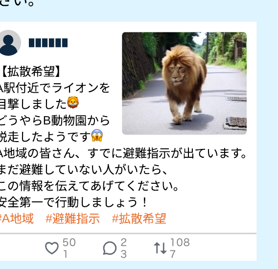

ア

少しでも早く避難が終わり、ライオンによる被害が出ないよう、急いで情報を拡散する

イ

A自治体HPやB動物園HPなどの公式情報を確認する

ウ

直ちに貴重品をもって避難場所に移動し、自身の身の安全を確保する

エ

画像に違和感がないか確認し、本物だろうと判断したので、家族に避難を呼びかける

---

情報の正確性

理解度 チェック

解答/解説

正解

ア

ウ

エ

公式な情報源や信頼できるメディアからの情報を無視して、代わりに非公式な情報源に依存するのは避けるべき。

今回の問題のSNS文章と写真は全て生成AIで作成

ア

【解説】情報が正しいかどうか確認しないまま、その情報をシェアして拡散するのは避けるべき

イ

A自治体HPやB動物園HPなどの公式情報を確認する

ウ

【解説】緊急性の高い情報に対して即座に反応し、パニックに陥るのは避けるべき。まずは深呼吸をして、その情報が本当に信頼できるかどうかを考える

エ

【解説】画像が本物か疑っているところまでは正しい行動。しかし、生成AIの技術の進歩により、合成画像を見分けるのは非常に困難となっている。画像に違和感がなくても偽情報の可能性があるため、まずは公式情報を確認すべき

---

情報流出

理解度 チェック

基本問題

生成AIに入力すべきでない、個人情報や機密情報の例として、適切なものはどれか。全て選んでください。

ア

知人のメールアドレス一覧

イ

役員会議の発言メモ

ウ

クラス名簿を撮影した写真

エ

自分の趣味

<!-- では、ここまでの注意すべきポイント（情報流出）に関する理解を確認するため、問題を解いてみましょう。 -->

---

情報流出

理解度 チェック

解答/解説

正解

ア

イ

ウ

ア

知人のメールアドレス一覧

イ

役員会議の発言メモ

ウ

クラス名簿を撮影した写真

エ

【解説】趣味は、一般的には特定の個人を直接識別するものではないので、個人情報には当てはまらない。ただし、このような情報の中にも特定の個人の識別につながる情報がないか確認することが必要。

---

情報流出

理解度 チェック

応用問題

企業で面接を受けた後に送付するお礼メールを生成AIで作成する際に、気を付けるべきこととして、適切なものはどれか。全て選んでください 。

ア

お礼メール程度であれば、特段気を付けるべきものはない

イ

自分自身の氏名や所属は、個人情報には当たらないため生成AIに入力してよい

ウ

面接中に聞いた相手方の業務情報は機密情報に当たる可能性があるので、生成AIには入力しない

エ

生成されたメールは、確認し、適宜修正したうえで送信する

---

情報流出

理解度 チェック

解答/解説

正解

ウ

エ

ウ：機密情報は生成AIに入力するべきではない。 エ：生成されたメールドラフトを確認の上、入力できなかった個人情報や機密情報を補ったうえで、メール文章を完成させ、送信するべき。

ア

【解説】自身の尺度で重要度を判断するのは危険。個人情報や機密情報に当てはまらないか、確認をしながら入力することが必要

イ

【解説】自分自身の氏名や所属も個人情報に当たる

ウ

面接中に聞いた相手方の業務情報は機密情報に当たる可能性があるので、生成AIには入力しない

エ

生成されたメールは、確認し、適宜修正したうえで送信する

---

目次

1

生成AIとは何か？

2

生成AIを どのように使うか？

3

生成AI活用にあたって 注意すべきポイントは？

おわりに

基礎知識

生成AIにまつわる変化

生成AIの用途

生成AIサービスの使い方

情報の正確性

情報流出

知的財産権の侵害

活用者としてのモラル

学習のまとめ、関連資料

<!-- 次に、知的財産権の侵害について学習します。 -->

---

知的財産権の侵害

他人の知的財産権等の侵害を防ぐため、既存のものや実在の人物に類似しないよう気を付ける

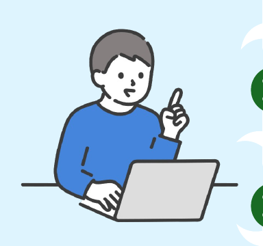

＼　以下のような指示は避ける　／

✕

✕✕に似ているロゴを考えて

✕

✕✕のキャラクターを描いて

✕

✕✕さんそっくりの写真を生成して

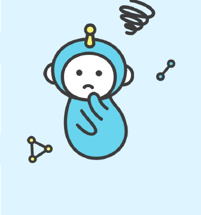

<!-- 他人の知的財産権等の侵害を防ぐため、まずは指示入力段階で、既存のものや実在の人物に類似しないよう注意することが大切です。 / 具体的には、「xxに似ているロゴを考えて」、「xxのキャラクターを書いて」、「xxさんそっくりの写真を生成して」といった指示は避けましょう。 -->

---

知的財産権の侵害

生成物が既存のものや実在の人物に類似している場合、以下のいずれかの対応を行う

対応１

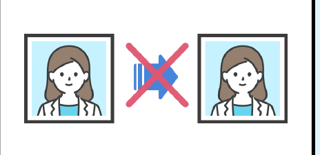

利用をやめる

対応２

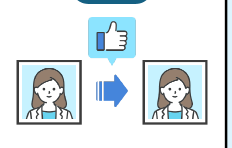

既存データの権利者から許諾を取得後、利用する

対応３

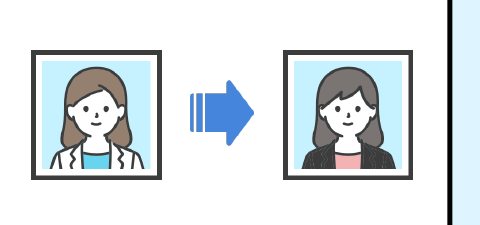

既存データと類似しないよう、大幅に手を加えて利用する

<!-- その上で、生成物が既存のものや実在の人物に類似している場合、「利用をやめる」、「既存データの権利者から許諾を取得後、利用する」、「既存データと類似しないよう、大幅に手を加えて利用する」のいずれかの対応を行いましょう。 / 特にビジネスで利用するものは念入りにチェックが必要です。 -->

---

知的財産権の侵害

理解度 チェック

基本問題

画像生成AIで作ったキャラクターのイラストが有名なキャラクターデザインに似ていた。

対応として適切なものはどれか。全て選んでください。

ア

全く同じものではないのでそのまま公開する

イ

トラブルを避けるため、イラストを利用しない

ウ

既存データの権利者から許諾を得た上で利用する

エ

既存データとは全く異なるデザインとなるよう、大幅に手を加えた

<!-- では、ここまでの注意すべきポイント（知的財産権の侵害）に関する理解を確認するため、問題を解いてみましょう。 -->

---

知的財産権の侵害

理解度 チェック

解答/解説

正解

イ

ウ

エ

知的財産の侵害リスクの予防方法として正しい説明。

ア

【解説】著作権侵害となる可能性がある

イ

トラブルを避けるため、イラストを利用しない

ウ

既存データの権利者から許諾を得た上で利用する

エ

既存データとは全く異なるデザインとなるよう、大幅に手を加えた

---

3　活用者としてのモラル

理解度 チェック

応用問題

知的財産権やパブリシティ権の侵害を予防するために、避けるべき指示はどれか。全て選んでください。

Q

ア

XXのロゴに似ているロゴを作成してください

イ

XXのキャラクターのイラストを描いてください

ウ

アイドル「XX」にそっくりの写真を生成してしてください

エ

XXの新商品のキャッチコピーを考えてください

<!-- 知的財産権・パブリシティ権の侵害を予防するため、避けるべき指示を全て選ばせる応用問題。 -->

---

3　活用者としてのモラル

理解度 チェック

解答/解説

正解

ア

イ

ウ

既存のものと類似した生成物が作成される可能性が非常に高いため、適切ではない。

A

ア

XXのロゴに似ているロゴを作成してください

イ

XXのキャラクターのイラストを描いてください

ウ

アイドル「XX」にそっくりの写真を生成してしてください

エ

<b style="color:#2E7D46;">【解説】</b>この指示が直ちに知的財産権やパブリシティ権の侵害になることはない。ただし、生成物が既存の著作物と類似していないか確認が必要。

<!-- ア・イ・ウが正解。既存物と類似した生成物が作られやすく適切でない。エは直ちに侵害にならないが、類似していないか確認が必要。 -->

---

3　活用者としてのモラル

<h2 style="margin:2px 0 14px;">目次</h2>

<table style="width:100%; border-collapse:separate; border-spacing:10px 8px; font-size:23px;">
<tr>
<td style="width:38%; background:#CFE6F5; color:#9bb3c4; font-weight:800; border-radius:8px; padding:14px 20px; vertical-align:middle;">1生成AIとは何か？</td>
<td style="background:#EAF2F8; color:#9bb3c4; border-radius:8px; padding:10px 20px;">基礎知識</td>
</tr>
<tr>
<td style="background:#CFE6F5; color:#9bb3c4; font-weight:800; border-radius:8px; padding:14px 20px; vertical-align:middle;">2生成AIを どのように使うか？</td>
<td style="background:#EAF2F8; color:#9bb3c4; border-radius:8px; padding:10px 20px;">生成AIの用途  生成AIサービスの使い方</td>
</tr>
<tr>
<td rowspan="2" style="background:#1E4E6B; color:#fff; font-weight:800; border-radius:8px; padding:14px 20px; vertical-align:middle;">3生成AI活用にあたって 注意すべきポイントは？</td>
<td style="background:#EAF2F8; color:#9bb3c4; border-radius:8px; padding:10px 20px;">情報の正確性  情報流出  知的財産権の侵害</td>
</tr>
<tr>
<td style="background:#D870C0; color:#fff; font-weight:800; border-radius:8px; padding:10px 20px;">活用者としてのモラル</td>
</tr>
<tr>
<td style="background:#CFE6F5; color:#9bb3c4; font-weight:800; border-radius:8px; padding:10px 20px;">おわりに</td>
<td style="background:#EAF2F8; color:#9bb3c4; border-radius:8px; padding:10px 20px;">学習のまとめ、関連資料</td>
</tr>
</table>

<!-- 最後に、活用者としてのモラルについて学習します。 -->

---

3　活用者としてのモラル

生成AIを活用する際は、モラルを守った行動を心がける

モラル１

本来自分が行うべきことまで生成AI任せにしない

‐ 学校や大学の課題を全て生成AIで解決しようとする ‐ AIの利用を想定していないコンクール等に生成物をそのまま出品する　等

モラル２

生成AIが作った偏見のある回答を使用しない

モラル３

生成AIを非倫理的な行為や犯罪に悪用しない

<!-- 生成AIを活用する際は、モラルを守った行動を心がけましょう。 / 「本来自分が行うべきことまで全て生成AI任せにしない」、「生成AIが作った偏見のある回答を使用しない」、「生成AIを非倫理的な行為や犯罪に悪用しない」といった姿勢を忘れないようにしてください。 -->

---

3　活用者としてのモラル

事例モラル❶学生が自分で考えるべき場面で、安易に生成AIを使ってしまう

🧑

あなたは中学2年生です。『走れメロス』の読書感想文を書いてください。

AI

『走れメロス』は宮沢賢治の名作で、忠義と友情の深さを描いた感動的な物語です。私が最も印象的だったのは主人公メロスの人間性とその行動の強さです。メロスの友情と忠誠心は、最も難しい状況でさえも変わらないことを教えてくれます。 
物語の中で、メロスは暴君ディオニスに対して「友情とは何か」を証明するために、厳しい試練を受けます。それは彼の友達セリヌンティウスの命と引き換えに、結婚式に間に合うという約束を果たすというものでした。私はこの部分が特に心に響きました。メロスは自分自身を危険にさらしながらも、友達への約束を破ることなく、時間厳守で村に戻ってきます。その姿は、どんな困難な状況でも信念を持ち続けることの大切さを教えてくれます。(中略) 
全体として、『走れメロス』は人間の持つ美しい感情と強さを描いた作品で、読んで本当に良かったと感じています。私自身もメロスのように、友情を大切にし、誠実に生きていきたいと思います。

Note: ChatGPT(GPT-4)との実際の会話

<!-- 例えば、生成AIに読書感想文を書くよう指示すると、もっともらしい文章が出力されますが、課題を通じた学びを得られず、自分のためになりません。 -->

---

3　活用者としてのモラル

事例モラル❷生成AIが出力した偏見のある回答をそのまま使用してしまう

画像生成AIで出力した以下の画像はいずれも性別や人種に偏りが見られる

※ 現在では、生成AIサービス側の改善が進んでいる

看護師

国会議員

<b>✕Bad</b>　複数人の看護師の画像作成を指示したところ、<b>女性ばかり</b>が出力され、<b>人種にも偏り</b>

<b>✕Bad</b>　国会議員の画像作成を指示したところ、<b>男性ばかり</b>が出力され、<b>人種にも偏り</b>

Note: 画像生成AIで生成。プロンプトとして、左の画像は「Various nurses」、右の画像は「国会議員」と入力

<!-- また、生成AIは人種や性別に偏りのある回答を生成することがありますが、そのまま使用すると偏見の助長につながる可能性があります。 / 偏りのある回答を予防するため、具体的な指示を出す、複数の視点からの回答を求めるといった工夫が必要です。 -->

---

3　活用者としてのモラル

事例モラル❸中国では、生成AIで他人の顔を生成し、金銭をだまし取る詐欺が発生

2023年4月、中国では、生成AIを悪用して<b>実在の友人の顔を生成</b>し、<b>8,400万円以上をだまし取る事件</b>が発生

詐欺の内容

‐ 被害者は、友人からビデオ通話で「入札の保証金を貸してほしい」と依頼され、指定された口座に入金 
‐ 容疑者は、被害者の友人のアカウントを盗み、顔や声を特定しAIで生成した可能性がある

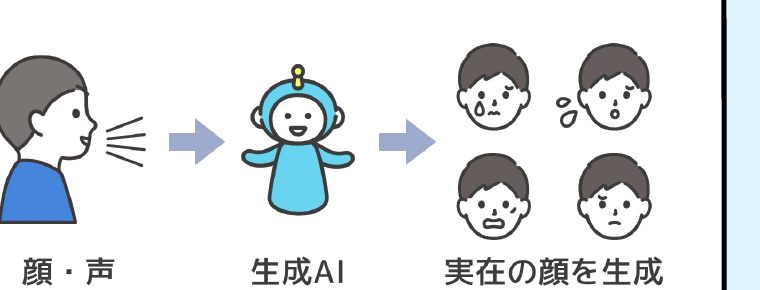

Source: https://newsdig.tbs.co.jp/articles/-/507779

<!-- 中国では、生成AIで他人の顔を生成し、金銭をだまし取る詐欺が発生しました。 / 生成AIを非倫理的な行為や犯罪に悪用しないようにしてください。 -->

---

理解度チェック

理解度 チェック

基本問題

生成AIの説明として、適切なものはどれか。全て選んでください。

Q

ア

生成AIは、インターネット上の文章を大量に学習し、指示に沿った回答を出力する

イ

生成AIは、文章だけでなく、画像/動画/コード等も生成可能である

ウ

生成AIは、高度な技術をもったエンジニアでないと使うことが難しい

エ

生成AIは、指示入力を工夫しなくても、利用者の意図をくみ取って回答を生成してくれる

<!-- では、ここまでの「生成AIの使い方」に関する理解を確認するため、問題を解いてみましょう。 -->

---

理解度チェック

理解度 チェック

解答/解説

正解

ア

イ

A

ア

生成AIは、インターネット上の文章を大量に学習し、指示に沿った回答を出力する

イ

生成AIは、文章だけでなく、画像/動画/コード等も生成可能である

ウ

<b style="color:#2E7D46;">【解説】</b>生成AIは、高度な技術は必要なく、簡単に使うことができるため、日常生活・学習・仕事に大きな影響を与えると見込まれる

エ

<b style="color:#2E7D46;">【解説】</b>生成AIは、利用者の意図を自動的にくみ取るわけではないため、指示の工夫が必要である

<!-- アとイが正解。ウは高度な技術は不要で簡単に使える。エは意図を自動でくみ取るわけではなく指示の工夫が必要。 -->

---

理解度チェック

理解度 チェック

応用問題

社会課題に対応したボランティアのアイデア出しのために、生成AIに「日本社会の課題について教えてください」と指示したところ、下記５個の課題が約400字の長文で出力され、ボランティアに生かせるアイデアになっていなかった。  
次に入力する指示として、適切なものはどれか。全て選んでください。

生成AIが回答した課題

‐ 高齢化社会と少子化問題 ‐ 労働環境の問題 ‐ 経済の停滞 ‐ 地方の過疎化 ‐ 環境問題

ア

生成AIに役割を与えたうえで、再度同じ情報を聞く「日本社会の課題について教えてください。　あなたは授業で実施するボランティア活動について　考えている高校生です」

イ

質問の背景を入力したうえで、再度同じ情報を聞く「日本社会の課題について教えてください。　地域でのどのようなボランティア活動ができるか　考えています。」

ウ

生成AI自身の考えを問う「日本の社会課題について、　あなたの意見を教えてください」

エ

再度同じ文言を指示する「日本社会の課題について教えてください」

<!-- 生成AIの回答をボランティアに生かせるアイデアにするため、次に入力する指示として適切なものを全て選ばせる応用問題。 -->

---

理解度チェック

理解度 チェック

解答/解説

正解

ア

イ

指示の工夫方法として、生成AIに役割を与える、指示の背景を記載する、詳細を聞く、回答の制限条件を入力すること等が挙げられる。

ア

生成AIに役割を与えたうえで、再度同じ情報を聞く「日本社会の課題について教えてください。　あなたは授業で実施するボランティア活動について　考えている高校生です」

イ

質問の背景を入力したうえで、再度同じ情報を聞く「日本社会の課題について教えてください。　地域でのどのようなボランティア活動ができるか　考えています。」

ウ

<b style="color:#2E7D46;">【解説】</b>生成AI は学習データからアルゴリズムに基づいてコンテンツを生成する技術であり、生成AI が個人的な意見を持つことはない

エ

<b style="color:#2E7D46;">【解説】</b>再度同じ文言を指示しても同じ趣旨の回答が出力される可能性が高いため、表現を変えて何度か試行する方が効果的である

<!-- アとイが正解。指示の工夫として役割付与・背景記載・詳細を聞く・制限条件の入力等が有効。ウは個人的な意見を持たない、エは同じ文言では同趣旨になりやすい。 -->

---

理解度チェック

理解度 チェック

応用問題

あなたは生成AIを活用して「<b>旅行の行き先</b>」を決めたいと考えています。  
旅行の条件や自分の好みに合わせた行き先を提案してもらうため、生成AIにどのような指示をすると良いでしょうか？

Q

※ 条件は自由に考えてみてください

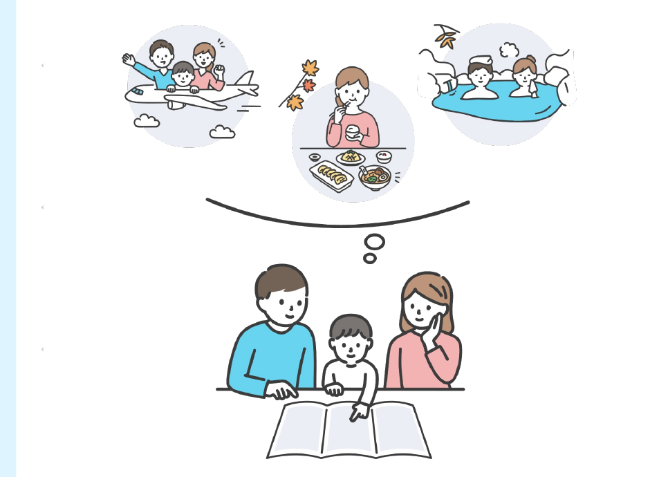

<!-- 旅行の行き先を決めるため、条件や好みに合わせた提案を生成AIから引き出す指示を、各自自由に考えてもらう応用問題。 -->

---

解答/解説

理解度 チェック
解答/解説

この問題に解答はありません。 
実際に生成AIに指示してみましょう。

A

<!-- 理解度チェックの解答スライド。この問いには決まった解答はなく、実際に生成AIへ指示を出してみることを促す。家族旅行の計画づくりを生成AIに相談するイメージ図を示す。 -->
