<!-- _class: cover-hero -->

エピグラフ

調べる。行ってみる。確かめる。また調べる。可能性を考える。実験してみる。失われてしまったものに思いを馳せる。耳をすませる。目を凝らす。風に吹かれる。そのひとつひとつが、君に世界の記述のしかたを教える。

―『ルリボシカミキリの青』 福岡 (2010)

今、君が好きなことがそのまま職業に通じる必要は全くないんだ。 大切なのは、何かひとつ好きなことがあること、 そしてその好きなことがずっと好きであり続けられることの旅程が、 驚くほど豊かで、君を一瞬たりともあきさせることがないということ。

ChatGPT

<!--
図書館の書庫に降りて、本棚の隅にようやく探していた本を見つける。開くと埃の匂いがする。 / 裏表紙をあけてみる。そこに貼られている貸し出し票の日付印。なんと君は十年ぶりの借り手だ。 / 誰にも読まれず書庫の澱のなかに眠っていた本。それを今、君が手にする。なんとなくうれしくなる。それは君がちゃんと道を踏んでいる確かな証拠だ。十年前、この道をたどった誰かと同じように。
-->

---

<!-- _class: cover-hero -->

あかりんアワー 第1回　12:10-12:40

新入生必見！？ 大学の学びにおける生成AIとの付き合い方

<b>国際未来教育基幹</b>　高等教育センター 助教 <b>田川 翔</b>

<b>Grand Canyon ?</b> 元々、地球の研究者

<b>AI?</b> 今、AI×教育の研究者

途中退出・参加自由

<!--
皆さん、こんにちは！ / はじめまして。国際未来教育基幹の田川と申します。お昼休みの忙しい中、集まって頂きありがとうございます。途中退出・入場自由ですので、お気軽にご参加下さい。
-->

---

自己紹介

# 自己紹介

仕事：<b>大学教育の企画</b>　<b>学生と教員を支援</b> 
専門：<b>地球の起源</b> 
地球惑星科学　博士(理学) 2020年

海の起源の仮説検証 Tagawa et al. (2021) <i>Nat. Com.</i>

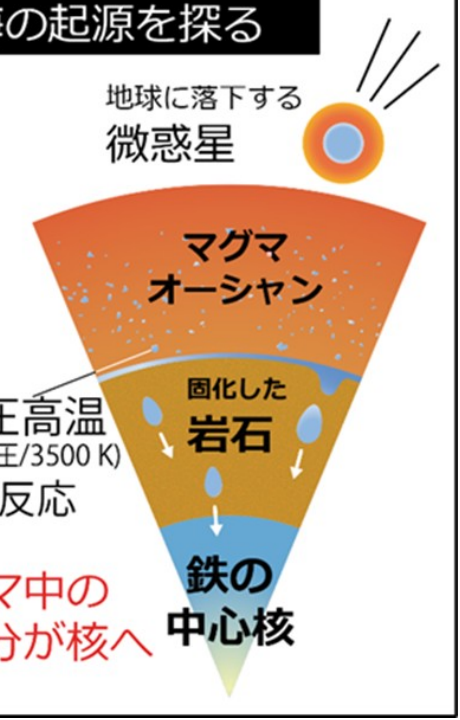

<!--
始める前に、簡単に僕の自己紹介をしときましょう。名前は、田川翔といいます。現在は千葉大学の教育をより良くするために、教育企画の仕事を行っている教員です。最近の研究テーマは大学教育と生成AIの関係なので、ここに立っています。 / これ似顔絵ですね。ポスターを真似て、チャットGPTにかいてもらいました。似てますかね？(会場の反応を見る) / さて、そんな私ですが、もともと研究テーマは地球の起源の解明なんですね。この惑星は、どのようにできたのか。そして、海の量はなぜきまったのか。 / そんなテーマで、博士課程まで実験していました。これですね(岩石みせる)、皆様の足元深い所にあるかんらん岩という岩石なんですけどもこの宝石みたいな岩石が地球のマントルの成分だと考えられています。 / で、こっちの方が隕鉄ですね。特徴的な結晶構造があるので、宇宙から降ってきたってわかるんですけど、この2つの化学反応を、実際に地球ができた温度、圧力で実験していました。 / それは、超高圧・高温の世界で、手のひらに東京タワー10本分ぐらいをのっけたような圧力を作り出し、そこにレーザーをあててドロドロに融かすわけです。
-->

---

自己紹介

# 自己紹介

仕事：<b>大学教育の企画</b>／<b>学生と教員を支援</b> 
専門：<b>地球の起源</b> 
地球惑星科学　博士(理学) 2020年

興味：<b>知を扱う方法</b>　<b>学びを良くする方法</b> <b>　→　生成AI × 教育</b>

航空会社での勤務経験

大学の教え方の授業

<!--
そんな感じで研究していたのですが、ちょうど卒業した時がコロナ禍だったんですね。大学自体が大変だし、学び方が変わるということで、オンライン教育支援の研究をはじめたことが、今につながっています。 / 地球惑星科学って、学際領域なので、かなり多くの範囲を学ばないといけないんですね。それと、自分は航空会社の国際線で業務をしていた時期もあって、社会人になると自分の知らないことでも学んで仕事に活かしていかなければならない。 / そうやって、色々なナレッジを使いこなすことに興味があったんですが、その道具に生成AIはなるんじゃないか、と思っています。
-->

---

slido

# 皆さんのことも、教えて下さい m(_ _)m

授業・セミナー インタラクティブ化ツール

<b>匿名 / もしよければ、携帯 / PCで、ぜひご参加下さい</b>

こちらで参加： <b style="font-size:34px;">slido.com</b> <b style="font-size:34px;">#3791 080</b>

<b>PCの方へ</b> slidoのwebページを開き、アクセスコードを入力して下さい

slido Q&amp;A / Polls ▢▦ スマホはQRコードから参加

<!--
さて、僕ばかり話していてもしかたないので、皆さんのほうからも自己紹介してもらいましょう。今回の講義はですね、インタラクティブに行うために、Sli.doというツールをつかっていこうと思います。 / みなさんスマホもってますか？スマホの方は、QRを開いて見て下さい。zoomはQRを貼りますね。PCを使われている方は、いまからする方法を見ていて下さい。 / Slidoのサイトにいって、ここに、このコードを入力する感じですね。 / これは、リアルタイムでアンケート集計したり、皆さんからの質問を集めたりする、教室支援用のツールなんですね。
-->

---

slido — Q1

☑

Q1. 皆さんの学年を教えて下さい。

slido で回答 — 申請者紹介

<!--
ではいまから3問だします。もしよければ、答えてみて下さい。どんどんいきますよ。 / 1問目：皆さんの学年を教えて下さい。1年生向けといっていますが、どんな感じでしょうか。
-->

---

slido — Q2-1

☑

Q2-1. 生成AIをどのような頻度で使っていますか？

slido で回答 — 申請者紹介

<!--
では、2問目：生成AI、どんな頻度でつかっていますか？
-->

---

slido — Q2-2

☑

Q2-2. 生成AIをどんな方法で使ってますか (使用者のみ)。

slido で回答 — 申請者紹介

---

slido — Q3

☁

Q3. (複数可)生成AIにどんな印象を持ちますか。(例：便利！)

slido で回答（複数可・ワードクラウド） — 申請者紹介

<!--
最後3問目です。生成AIについて思うことを記入して見て下さい。 / どうでしたでしょうか。だいぶ皆さんのことが分かってきましたね。 / お互い紹介できたところで、楽しい時間にできればと思うので、よろしくお願いいたします。
-->

---

今日のトピック

# 今日のトピック

<b>①生成AIとはなにか</b> 　AIは注意した方が良い、リスクがある…?

<b>②学びにおける生成AIとの付き合い方</b> 　授業を受けるうえでの注意点?

<b>③生成AIは学ぶ道具になる？</b> 　使い方のアイデア、未来の生成AI

<b>質問</b>は、<b>slidoのQ&amp;Aに適宜</b>記入下さい　最後or後日答えます

<!--
では、今日どんな話をするか、について話します。 / 1つ目は、生成AIとはなにかっていうことです。AIは注意した方が良い、リスクが有る、そういうことをよく言われますよね。それはなにか、という話をします。 / 2つ目は、学びにおける、AIとの関わりかたについてです。授業を受ける中で、どのような注意点があるかという点をご説明します。 / 最後に3つ目は、生成AIを積極的に使い、学びに活かすことで、自分がもっと学ぶ道具として使う方法についてご説明します。 / ちなみに、このタイトルのAIとの付き合い方、というのは種本があって、この本からきています。異星人として扱え、みたいなことが書いてあって面白い本で、図書館にも入っています。
-->

---

①生成AIとは、なにか

# ①生成AIとは、なにか

<b>AIはいろいろなところにすでにある</b>

<b>ChatGPTなどの生成AI以外にも、生活の中でいつの間にか、たくさん触れている</b>

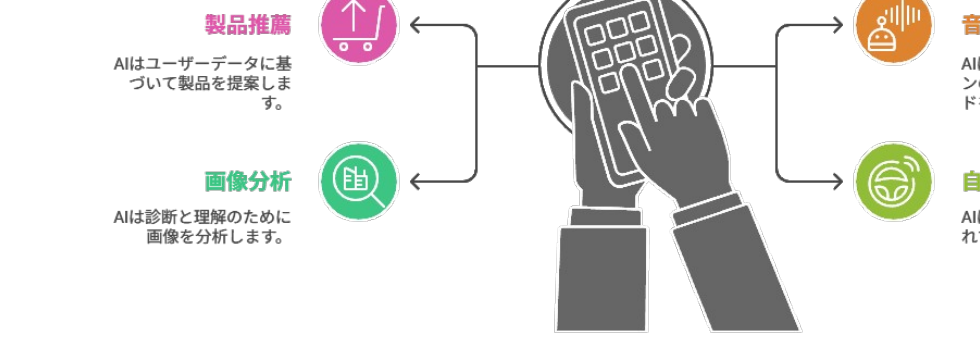

ChatGPTなどの生成AI以外にも、生活の中でいつの間にか、たくさん触れている

<b>この絵もAIが書いた！</b>

<b>AIの定義 (例)</b> 人間の思考プロセスと同じような形で動作するプログラム 人間が知的と感じる情報処理やそれを行う科学・技術

<b>注：</b>目的関数が、エンゲージや売上をあげるなど、「サービス提供側 (≠あなた)」にしか利益を与えない場合もある

cf. 『マインドハッキング: あなたの感情を支配し行動を操るソーシャルメディア』ワイリー (2020)　／　『R6 科学技術イノベーション白書 (第一章)』文部科学省 (2024)

<!--
では、AIを理解するうえで重要なことを説明していきましょう。 / AIの定義は決まっていませんが、人間が知的と感じる情報処理やそれを行う科学・技術といった説明がなされがちです。 / まず、１つ目は、AIはいろいろなところにすでにある、ということです。皆さんがAmazonを開いたら、おすすめが出てきたりしますよね。スマホの音声操作もそうです。私たちの声を認識し、検索したり、アクションをしますよね。その他にも、画像の分析や診断だったり、自動運転だったりにも、応用されつつあります。もはや、AIといえるものは、皆さんの周りに普通に存在しているんですね。
-->

---

①生成AIとは、なにか

# AIの発展年表

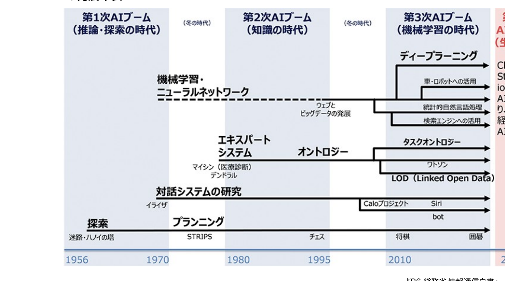

『R6 総務省 情報通信白書』総務省(2024)

<!--
ちょっと歴史を紐解いてみましょう。アーティフィシャルインテリジェンスという言葉が現れたのは、1956年年です。 / その後、アルゴリズムであったり、ルールベースのAIだったりが流行りました。しかし、コンピューターの性能やプログラムのメンテナンスだったり課題はたくさんあって、まだSFのようなものと捉えられていたんですね。 / そんななか、ハードウェアの向上によって、とある技術が大発展を遂げることになります。その技術の名前は、機械学習、英語では、マシンラーニングといいます。 / IBMの研究者であるアーサー・サミュエルが、1959年に定義づけました。かれは、機械学習を「明示的にプログラムされることなく、経験から学習する能力をコンピューターに与える学問領域」として定めたんですね。 / これは、従来のルールベースとまったく異なります。コンピュータ自体が、何らかの方法で、与えたデータからパターンを見出し、予測や判断を行うアプローチだったわけです。
-->

---

①生成AIとは、なにか

# データの関係性をどう考えるか

<table style="width:80%; border-collapse:collapse; margin-top:20px; font-size:34px; text-align:center;">
<thead>
<tr style="background:var(--accent); color:#fff;">
<th style="padding:12px 0; border:1px solid #fff;">x</th>
<th style="padding:12px 0; border:1px solid #fff;">f(x)</th>
</tr>
</thead>
<tbody>
<tr style="background:var(--accent-soft);"><td style="padding:10px 0;">1</td><td style="padding:10px 0;">3</td></tr>
<tr><td style="padding:10px 0;">2</td><td style="padding:10px 0;">5</td></tr>
<tr style="background:var(--accent-soft);"><td style="padding:10px 0;">3</td><td style="padding:10px 0;">7</td></tr>
<tr><td style="padding:10px 0;">4</td><td style="padding:10px 0;">?</td></tr>
</tbody>
</table>

<!--
- ちょっと問題をだしてみましょう。正解も何もないので、頭の体操としてきいて下さい。
- f(1) = 3、f(2)= 5、f(3)=7と数が並んでいた時、f(4)はなんだと思いますか？
- ルールベースの世界に生きるAIは、きっと僕から、解析的な解き方を教えられているんですね。たとえば、この場合には、一次式を試してみて、f(x) = 2*x+1っていう風なので、x=4で9だぞって。
- 結構高校までの数学の授業って、こういう考え方しませんか。f(x)ときたら、f(x)の式の形を求めることから初めてみようかな、と思う。
- でも、機械学習的な世界では、このf(x)がどうなっているかはどうでも良いのですね。xとf(x)の関係性を学習し、次を予測するだけ。f(x)の式そのものは、ブラックボックスで全然構わない。
- データの関係性について、f(x)自体がルールを明示的、つまり人が読んでもわからない形でも構わないが、コンピューターが自ら学習した結果を予想できる、この考え方がミソなんですね。
-->

---

①生成AIとは、なにか

# データの関係性をどう考えるか

<table style="width:100%; border-collapse:collapse; font-size:26px; text-align:center;">
<thead>
<tr style="background:var(--accent); color:#fff;"><th style="padding:6px 0; border:1px solid #fff;">x</th><th style="padding:6px 0; border:1px solid #fff;">f(x)</th></tr>
</thead>
<tbody>
<tr style="background:var(--accent-soft);"><td style="padding:4px 0;">1</td><td>3</td></tr>
<tr><td style="padding:4px 0;">2</td><td>5</td></tr>
<tr style="background:var(--accent-soft);"><td style="padding:4px 0;">3</td><td>7</td></tr>
<tr><td style="padding:4px 0;">4</td><td>?</td></tr>
</tbody>
</table>

変換する「函」

<b>ルールベースの世界観</b> (設計者が教えておく) 解析的に解くよ／等差数列っぽい？ <b>→ Yes</b> f(x) = 2x+1？　ならば9と予想

<b>機械学習の世界観</b> (もっとたくさん学習！) 入力されたデータからパターンをコンピュータが探索・発見 <b>f(x)自体は気にしない</b>　9とか11？

<b>ブラックボックス</b> ブラックボックス内を理解する手法は開発中 e.g. Anthropic (2025)　AI顕微鏡

データの関係性の捉え方が根本的に違う
確率・統計的に処理
正解が出てくるとは限らない

<!--
- ちょっと問題をだしてみましょう。正解も何もないので、頭の体操としてきいて下さい。
- f(1) = 3、f(2)= 5、f(3)=7と数が並んでいた時、f(4)はなんだと思いますか？
- ルールベースの世界に生きるAIは、きっと僕から、解析的な解き方を教えられているんですね。たとえば、この場合には、一次式を試してみて、f(x) = 2*x+1っていう風なので、x=4で9だぞって。
- でも、機械学習的な世界では、このf(x)がどうなっているかはどうでも良いのですね。xとf(x)の関係性を学習し、次を予測するだけ。f(x)の式そのものは、ブラックボックスで全然構わない。
- データの関係性について、f(x)自体がルールを明示的、つまり人が読んでもわからない形でも構わないが、コンピューターが自ら学習した結果を予想できる、この考え方がミソなんですね。
-->

---

①生成AIとは、なにか

# 深層学習(ディープラーニング)

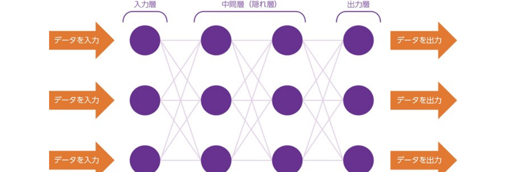

- 人間の神経細胞（ニューロン）のように、各ノードが層をなして接続されるものがニューラルネットワーク 
- 中間層（隠れ層）が複数の層となっているものを用いるものが深層学習

<b>2012年</b>、Googleの キャットペーパー　(「猫」を教えていなかったのに、写真から猫の特徴を抽出)　ヒントンらによる画像認識のブレークスルー <b>2016年</b>、世界トップレベルのプロ囲碁棋士に勝利 (囲碁専用ではない)

<b>ノーベル賞　2024年</b>

<b>物理学：</b>人工ニューラルネットワークによる機械学習を可能にする基礎的な発見と発明 
　<b>ジョン・ホップフィールド</b>（物理学者・分子生物学者） 
　<b>ジェフリー・ヒントン</b>（生理学・哲学→実験心理学→コンピューター科学）

<b>化学 (一部)：</b>タンパク質プログラムの開発 
　<b>デミス・ハサビス</b>（人工知能研究者、神経科学者） 
　<b>ジョン・M・ジャンパー</b>（固体物理学→理論化学→計算生物学）

『R1 総務省 情報通信白書』総務省 (2019)

<!--
- ただ、このブラックボックス部分ですけど、この自体をどんな形にするか、という設計はあるわけです。
- 人工ニューラルネットワーク、その発展型である深層学習(Deep Learning)という言葉を耳にした方は多いかもしれません。今年のノーベル賞ですからね。複数のパラメータを配置することで、学習したデータとはことなるものを確率的につくることが出来るわけです。
- 意味を直接設計しようとするアプローチではなく、機械的に膨大なパラメータから意味を生成する方法の方法がいまのAIの背景にあるのです。
-->

---

①生成AIとは、なにか

# 生成AI：与えられたデータから、新たなデータを生成する技術

<b>ネクストワードプレディクション</b> 日本の首都__ → 日本の首都は__ → 日本の首都は東京__

<b>トランスフォーマー（自己注意機構）</b> ニューラルネットワークの「形」のこと

<b>GPT：</b>

▶ デモ：LLM Visualization

トランスフォーマー(nano-gpt)のパラメタ構造をのぞく

<b><a href="https://www.youtube.com/watch?v=-P28LKWTzrI" style="color:var(--tag-blue);">LLM Visualization</a></b>

cf. NVIDIA "Mythbusters Demo GPU versus CPU"　https://www.youtube.com/watch?v=-P28LKWTzrI

<!--
- そして、生成AIの時代にきます。生成AIでよく想像されるのは、Chat GPTのような、言語を扱うAIでしょう。
- その構成について、トランスフォーマーの一つである、GPTのパラメタ構造をのぞいてみましょう。
- これも、ニューラルネットワークモデルです。インプットされたデータが、複数の層を通って出力されます。なんか宇宙ステーションみたいですね。
- ここでは「nano-gpt」という非常に小さなモデル（パラメータ数わずか85,000）を使って、モデルの仕組みを探っていきます。
- こんな感じで、言葉を操る生成AIは、ネクストワードプレディクション、つまり次に出てくる言葉の予測をおこなうAIなわけですね。さっき言ってた函ってのはこれ全部にあたります。
-->

---

<!-- _class: divider -->

slido　設問

# Q4. 日本の首都は、____

<!--
- では、ちょっとみんなで実験してみましょうか。
- 次の単語を予想して下さい。日本の首都は、____
- これは簡単でしたね。東京、または、定めている法律はない、みたいな文章に連なりそうです。
-->

---

<!-- _class: divider -->

slido　設問

# Q5. 春は、 ____

<!--
- これはどうでしょうか。
- なるほど、どれでも正しそうですね。こんな感じで、正解は一つでは無いときも、確率分布は生成されるので、何か戻ってくるわけです。
-->

---

<!-- _class: divider -->

slido　設問

# Q6. 地球に存在する水の総量はおおよそ海の ____

<!--
- 最後はこれ。
- ChatGPTに昨日きいたら、「地球に存在する水の総量はおおよそ海の水で約97%を占めています。」と言われました。もしかしたら、皆さんは、私が海の量を調べてたといったので、10倍とか50倍とかを選んだかもしれません。これは、私が皆さんにコンテキストを与えたので、結果が変わったのかもしれません。
-->

---

①生成AIとは、なにか

# AIは、間違えうる

<b>原則</b>として、<b>次にくるもっともらしいもの</b>を生成AIは確率的に予想しているだけ

学習している知識が少ない場合の例

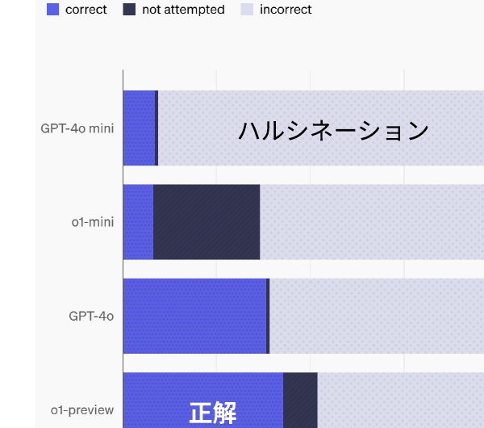

<b>SimpleQA</b>：回答の事実的正確性のベンチマーク　Wei et al. (2024) Arxiv 例) Q. Who received the IEEE Frank Rosenblatt Award in 2010?　A. Michio Sugeno

知識のエッジ(=学習回数小)にある内容も含めてある。問題を解かせたり、論文を探させた場合等、無料版である<b>AI</b>は、「分からない」ということもなく、<b>ハルシネーション</b>(誤情報を出す)する可能性が高い

その他の例

古い情報だった・誤った情報を学習していた／AIが誤解していた、なんか変だ／別の分野の文脈に引きずられていた・偏っていた／差別やバイアスが含まれていた／推論ミス、別のところを参照 etc…

<b>誤っている可能性を知り、信頼の高い情報を参照し正確性を確認</b>　※ 相当ある

<!--
- つまり、確率的に処理しているので、誤ったことを言う可能性もありますし、間違ったことを言う可能性もあるというのが重要です。
- 知識のエッジの話をしましょう。例外的な知識だけででもありません。AIが誤解していたり、別の分野の文脈に引きずられて、何ら変な回答が出てきたりはするわけです。
- 生成AIが、いかにもありそうなことをでっち上げること、これをハルシネーションといいます。
- 生成AIは間違う可能性もあるから気をつけろ。これは原理的にそうなのです。なので、AIの回答については、客観的に評価し、判断するようにしましょう。
-->

---

①生成AIとは、なにか

# まとめTake home message!

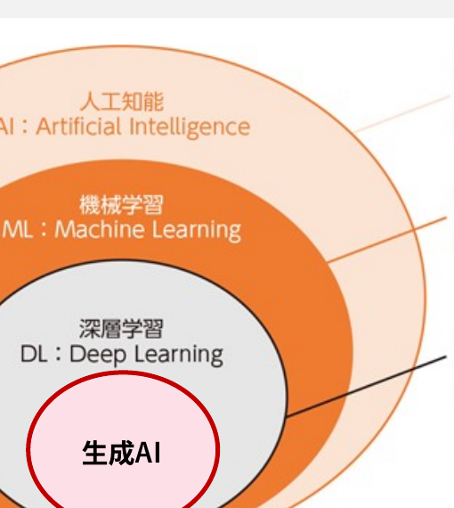

改変：『R1 総務省 情報通信白書』総務省 (2019)

<b>原則</b>として、<b>次にくるもっともらしいもの</b>を生成AIは確率的に予想しているだけ

<b>ハルシネーション</b>する<b>(幻覚：AIが誤った情報を出す)</b> のは、仕組み上仕方ない

<b>※社会や人に与える影響はまだ未知数</b>

<!--
- これまでの情報をまとめるとこの図になります。
- 最後に、AIのリスクについてひとこと。AIはネクストワードプレディクション以外でも、生成結果を修正する処理を行っています。これは、バイアスや倫理上の問題の回避にもつながっているのですが、人が心地よい回答を生成する側面もあるのですね。
- AI中毒や、AIに過度に依存する事によって、私たちの関係性や社会への影響、学びへの影響がどうなるかは、まだわかっていないわけです。もはや、巨大な社会実験に乗り出してしまったような可能性があります。
- AIが出力したものを信じるかどうか、という以上に、もう一歩引いてメタな視点からAIとの関わりを情報収集し、リスクを見つめ、考えることが重要だと思っています。
-->

---

②学びにおける付き合い方

文科省通知『大学・高専における生成 AI の教学面の取扱いについて』 (2023年7月) <a href="https://www.mext.go.jp/b_menu/houdou/2023/mext_01260.html" style="color:var(--tag-blue);">https://www.mext.go.jp/b_menu/houdou/2023/mext_01260.html</a>

大学・高専における学修は学生が主体的に学ぶことが本質であり、生成 AI の出力をそのまま用いるなど学生自らの手によらずにレポート等の成果物を作成することは、学生自身の学びを深めることに繋がらないため、<b>一般に不適切</b>と考えられる。

<!--
- ということで、AIとの付き合い方の話にいきましょう。ここまでは、少しひろい話でしたが、大学の話にしぼってすすめて行こうと思います。
- まず、文部科学省のポリシーがあるのでご紹介しておきます。これは、生成AIに関して利活用が想定される場面例や留意すべき観点について、各大学などに周知されたものです。
- 冒頭から、結構ぶっこんできてますね。「学修効果が上がり、また教職員の業務効率化を図ることができるなどの効果が期待される反面、レポート等の作成に生成 AI のみが使われること等に対する懸念が指摘されている」。
- ここに書いてありますけど、「大学・高専における学修は学生が主体的に学ぶことが本質であり、生成 AI の出力をそのまま用いるなど学生自らの手によらずにレポート等の成果物を作成することは、学生自身の学びを深めることに繋がらないため、一般に不適切と考えられる」ということですね。
-->

---

②学びにおける付き合い方

学習・学修の過程で絶対に使うな、という意味ではない

逆向き設計

<b style="font-size:30px;">目的：</b> どこに向かうのか  (授業の存在価値)

学修後の状態

<b style="font-size:30px;">目標：</b> 何が出来るようになるのか

<b style="font-size:30px;">設計：</b> どのように教えるのか

<b style="font-size:30px;">評価：</b> どのように測るのか

学生の現状

目標や設計を損なう形で使ってはいけない

<!--
- 図で書くとこういうことです。
- ちょっとここで、成績とはなにかという話をしておきます。成績とは、目標と評価によって結ばれる、この過程の皆さんの努力を評価しているわけですね。AIを用いて再現する能力を聞いているわけではないです。
- 授業の到達目標(これはシラバスに書いてありますが)、つまり身につけてほしいこと、というのは、教員が考えて、AI時代も必要だと思って、きめているわけですね。例えば、学部4年生の論文作成の授業で、到達目標がAIを利用して自分が伝えたいことをきちんと英語で書く、とかであれば利用は問題ない場合が多いでしょう。でも、学部1年生の授業で、一緒使える英語を学ぶ、とかの目標なのに、AIが回答していたら、良くないということです。
-->

---

<!-- _class: divider -->

slido　設問

# Q7 AIで英語の学習はどう変わる？

<!--
- AIで英語の学習はどう変わるか、皆さんに聞いてみましょう。
-->

---

②学びにおける付き合い方

# 学習・学修の過程で絶対に使うな、という意味ではない

学生の現状

⇒

<b>目的：</b>どこに向かうのか (授業の存在価値)

<b>目標：</b>何が出来るようになるのか

<b>評価：</b>どのように測るのか

<b>設計：</b>どのように教えるのか

学修後の状態

逆向き設計　目標や設計を損なう形で使ってはいけない

<b>コスパ・タイパのために、AIを悪用してはいけません</b> 自律的に学びを深めるために、活用しましょう

「AIができることをただ出力する、ということは、AIで事足りるので採用する必要はない」ということ

AIができない「高次」の価値を作るために、引き続き学ぶ必要はある

Bowen &amp; Watson (2024). <i>Teaching with AI</i>. AAC&amp;U.

<!--
- 例えば、学部4年生の論文作成の授業で、到達目標がAIを利用して自分が伝えたいことをきちんと英語で書く、とかであれば利用は問題ないかもしれません。
- でも、学部1年生の授業で、一緒使える英語を学ぶ、とかの目標なのに、AIが回答していたら、良くないということです。
- そして、AIができるようになっても
-->

---

②学びにおける付き合い方

# cf. プログラムの学びは必要？

「AIがプログラミングを自動化するから、学ぶ必要はない」と主張しているが、これは<b>非常に悪い</b>キャリアアドバイスだ。実際には、プログラミングが簡単になるにつれ、より多くの人が学ぶべきだ。  1960年代にノーベル賞受賞者が語った、<b>「プログラマーという職業が全能になるよりも、むしろ絶滅する可能性の方がずっと高い。ますますコンピューターは自分自身をプログラムするようになるだろう。」は間違い</b>だった。

重要なのは、AIに仕事を奪われるのではなく、<b>AIを使いこなす側になること</b>。  そのためには、AIに明確な指示を出せる力、<b>つまり「ソフトウェアの言語（＝プログラミング）」を理解することが必要</b>。芸術やマーケティングなど他の分野でも、専門的な言語を知っている人ほどAIを効果的に使えるのと同じである。

良いプログラマと話すと、気がつく / 私が想像・創造できること以上を語ってくれる

Andrew Ng（@AndrewYNg）

<!--
- 例えば、学部4年生の論文作成の授業で、到達目標がAIを利用して自分が伝えたいことをきちんと英語で書く、とかであれば利用は問題ないかもしれません。
- でも、学部1年生の授業で、一緒使える英語を学ぶ、とかの目標なのに、AIが回答していたら、良くないということです。
- そして、AIができるようになっても
-->

---

②学びにおける付き合い方

# 学習目標分類

<table style="font-size:19px; width:100%;">
<thead>
<tr><th></th><th>認知的領域 (知識や思考)</th><th>学びへの生成AIの影響</th></tr>
</thead>
<tbody>
<tr><td style="color:var(--accent-dark); font-weight:800;">高次</td><td><b>創造</b> (学習を応用し、新しい価値を作れる)</td><td>人の創造性こそが大切</td></tr>
<tr><td></td><td><b>評価</b> (事物・判断等を比較し評価出来る)</td><td>評価軸/価値/判断は人が設定する</td></tr>
<tr><td></td><td><b>分析</b> (要素に分け、関係性を指摘できる)</td><td>解答/過程の支援可(例：要約・構造化・コーディング)</td></tr>
<tr><td></td><td><b>応用</b> (他の場面や状況に使用できる)</td><td>単なる問題では、AIが解いてしまう…</td></tr>
<tr><td></td><td><b>理解</b> (学習内容を説明出来る)</td><td>説明/例示で支援可能 だが学修者の理解必須</td></tr>
<tr><td style="color:var(--accent-dark); font-weight:800;">低次</td><td><b>記憶</b> (事実や概念を暗記している)</td><td>支援可能だが、学修者の記憶必須</td></tr>
</tbody>
</table>

左は栗田 &amp; 中村 (2023) を元に作成 ／ 原著 Bloom (1956/1964)、改訂版 (2001) を記載

棟梁

↑

大工

↓

見習い

学修の目標を構造化し、学びの設計を支援

※近年では、下から個別・段階的に行うのではなく、<b>複数の次元の要素を組み合わせる</b>必要性が叫ばれている。 
※近年では、学び方の学びや、人間性の涵養などを含む、学習目標分類も作成されている (e.g. Finkの学習目標分類) 
※但し、<b>低次(特に記憶・理解・応用の段階)を蔑ろにして</b>、<b>高次の学修目標の達成は難しい</b>と想定される。

授業におけるAI利用の指針となり得る

<b>AI が答えを出せるとしても、途中を学ぶことは引き続き必要です</b>

<!--
- 学習目標分類についての、担当講師による解説動画 (9分) https://www.notion.so/geophysica/Bloom-145d8c8bc5ab80deb9dfc15b89d91875?pvs=4
-->

---

②学びにおける付き合い方

# 千葉大学における生成AIの指針 (令和５年１０月１３日)

「生成 AI についての学び」「生成 AI を用いた学び」「生成 AI によらない学び」をそれぞれ推進

<b>①</b> 授業での利用は、授業の目的に合致することが前提であり、合致するかは、各授業の担当教員が<b>判断</b> <b>禁止の場合はシラバスなどに明記</b> 　(気になったら先生に聞きましょう！)

<b>②</b> リスクや懸念に伴う禁止事項あり

<b>③</b> 特に、<b>機密情報や個人情報の入力禁止</b>、生成AIにより出力された情報の著作権 (表現への類似性・依拠性)には留意が必要です。

<a>https://www.chiba-u.ac.jp/academics/files/pdf/Guidelines_GenerativeAI.pdf</a>

<!--
-->

---

<!-- _class: message -->

<svg width="150" height="150" viewBox="0 0 64 64" xmlns="http://www.w3.org/2000/svg">
<rect x="6" y="10" width="44" height="34" rx="8" fill="none" stroke="var(--accent)" stroke-width="4"/>
<path d="M18 44 L18 56 L30 44 Z" fill="none" stroke="var(--accent)" stroke-width="4" stroke-linejoin="round"/>
<circle cx="20" cy="27" r="3" fill="var(--accent)"/>
<circle cx="30" cy="27" r="3" fill="var(--accent)"/>
<circle cx="40" cy="27" r="3" fill="var(--accent)"/>
</svg>

Audience Q&amp;A

<!--
-->

---

③生成AIは学ぶ道具になるか

# まずは、自分から、学び方を変えてみよう

積み上げて受動的に学ぶ

：学校的学び方

<svg viewBox="0 0 320 200" xmlns="http://www.w3.org/2000/svg" style="width:100%; height:200px;">
<polyline points="20,170 130,170 130,120 240,120 240,70 300,70" fill="none" stroke="#7a3b10" stroke-width="3"/>
<polyline points="130,170 130,120" fill="none" stroke="#7a3b10" stroke-width="2" stroke-dasharray="5 5"/>
<polyline points="240,120 240,70" fill="none" stroke="#7a3b10" stroke-width="2" stroke-dasharray="5 5"/>
<circle cx="150" cy="100" r="11" fill="#fff" stroke="#999" stroke-width="2"/>
<rect x="142" y="112" width="16" height="40" rx="7" fill="#fff" stroke="#999" stroke-width="2"/>
<text x="178" y="92" font-size="26" font-weight="800" fill="#333">?</text>
</svg>

どこかで頭打ちする

最終到達点から探究的に学ぶ

：職人的/芸術家的学び方？

<svg viewBox="0 0 320 200" xmlns="http://www.w3.org/2000/svg" style="width:100%; height:200px;">
<polyline points="20,170 130,170 130,120 240,120 240,55 300,55" fill="none" stroke="#7a3b10" stroke-width="3"/>
<polyline points="130,170 130,120" fill="none" stroke="#7a3b10" stroke-width="2" stroke-dasharray="5 5"/>
<polyline points="240,120 240,55" fill="none" stroke="#7a3b10" stroke-width="2" stroke-dasharray="5 5"/>
<circle cx="262" cy="35" r="11" fill="#fff" stroke="#999" stroke-width="2"/>
<rect x="254" y="47" width="16" height="40" rx="7" fill="#fff" stroke="#999" stroke-width="2"/>
<text x="232" y="28" font-size="26" font-weight="800" fill="var(--accent)">!</text>
</svg>

高みから中間地点を学ぶ

「なぜ学ぶのか、どのように学ぶのか、何を学ぶのか」の変質

まずは、自分から、学び方を変えてみよう ▶ できないかな、と思ったら<b>使ってみる</b>

<!--
-->

---

③生成AIは学ぶ道具になるか

# 共同知能 Co-Intelligence

<b>AIは人と異なる知能</b>である。「<b>異星人の心</b>」でありいくら人間っぽくても、性質が違う。

例えば、、、

AI

<b>たくさん考えるのは得意！</b> 言葉にするのは得意！ニュアンスさえも。

→ AIをアイデア出し・ブレインストーミングにつかってはどうか ※自分がすることや「なぜ」をAIに聞くのは筋が悪い

人

<b>一番本質を見抜くのが得意！</b> <b>感覚的にわかる！</b>なぜか間違わない。

→ AIが持っていない、タイプの知がある？

Mollick (2024). 『これからのAI、正しい付き合い方と使い方』久保田訳．

<!--
-->

---

③生成AIは学ぶ道具になるか

# 共同知能 Co-Intelligence

<b>AIは人と異なる知能</b>である。「<b>異星人の心</b>」でありいくら人間っぽくても、性質が違う。

共同知能についての4つのルール

① AIを参加させる。

② 人間参加型のデザインにする。

③ AIにペルソナを与える。

④ 今使っているAIは、今後使用するどのAIよりも劣悪と仮定する。

<b>でてきた情報を、批判的に考える</b>

Mollick (2024). 『これからのAI、正しい付き合い方と使い方』久保田訳．

<!--
- 正しくないかもしれない
-->

---

③生成AIは学ぶ道具になるか

# 学びのための活用例

<table style="width:100%; font-size:23px;">
<tbody>
<tr>
<td style="width:34%; font-weight:800;">なぜ誤答だったのか、聞いてみる ※直接聞くより間違えにくい</td>
<td>
自分は、〇〇と答えたけども、答えは△だった。自分はどこで勘違いしたのか？
</td>
</tr>
<tr>
<td style="font-weight:800;">精緻的質問をしてみる ※読書にも有効</td>
<td>
なぜそうなっているのか？どのようになっているのか？
</td>
</tr>
<tr>
<td style="font-weight:800;">他の捉え方を聞いてみる ※読書にも有効</td>
<td>
△について、自分は、〇〇と考えた。他の考え方はあるか。
</td>
</tr>
</tbody>
</table>

<!--
- 正しくないかもしれない
-->

---

③生成AIは学ぶ道具になるか

# 学びのための活用例

<table style="width:100%; font-size:23px;">
<tbody>
<tr>
<td style="width:34%; font-weight:800;">関連付け</td>
<td>
△について習ったことがある。□になりたい。◯はどう関係するのか？☓のいい比喩はないか？
</td>
</tr>
<tr>
<td style="font-weight:800;">リフレクションや言語化のシミュレーション</td>
<td>
〇〇と言葉にしたけど伝わる?復習したいからコーチして
</td>
</tr>
<tr>
<td style="font-weight:800;">英語で話してみる ※文法は完璧</td>
<td>
I'm preparing for an upcoming presentation about AI…
</td>
</tr>
</tbody>
</table>

<!--
- 正しくないかもしれない
-->

---

③生成AIは学ぶ道具になるか

# すぐに来る未来の技術

<b>①自分でAIを作り込む時代</b>

Dify　Project　GPTs

<b>②自分のほしい情報をAIに加工してもらう時代</b>

MCP (Model Context Protocol)　AI agent

自分で作ってみることで、仕組みや、使い方、限界がわかる

<b>第4ターム 水3</b> 生成AI活用講座

<!--
- 正しくないかもしれない
-->

---

<!-- _class: message -->

<svg width="150" height="150" viewBox="0 0 64 64" xmlns="http://www.w3.org/2000/svg">
<rect x="6" y="10" width="44" height="34" rx="8" fill="none" stroke="var(--accent)" stroke-width="4"/>
<path d="M18 44 L18 56 L30 44 Z" fill="none" stroke="var(--accent)" stroke-width="4" stroke-linejoin="round"/>
<line x1="16" y1="22" x2="40" y2="22" stroke="var(--accent)" stroke-width="3.5" stroke-linecap="round"/>
<line x1="16" y1="30" x2="34" y2="30" stroke="var(--accent)" stroke-width="3.5" stroke-linecap="round"/>
</svg>

Q8. おすすめの学習法は？

<!--
-->

---

<!-- _class: message -->

<svg width="150" height="150" viewBox="0 0 64 64" xmlns="http://www.w3.org/2000/svg">
<rect x="6" y="10" width="44" height="34" rx="8" fill="none" stroke="var(--accent)" stroke-width="4"/>
<path d="M18 44 L18 56 L30 44 Z" fill="none" stroke="var(--accent)" stroke-width="4" stroke-linejoin="round"/>
<circle cx="20" cy="27" r="3" fill="var(--accent)"/>
<circle cx="30" cy="27" r="3" fill="var(--accent)"/>
<circle cx="40" cy="27" r="3" fill="var(--accent)"/>
</svg>

Audience Q&amp;A

<!--
-->

---

まとめ

# 今日の内容

<b>①生成AIとはなにか</b>

<b>②学びにおける生成AIとの付き合い方</b>

<b>③生成AIは学ぶ道具になる？</b>

調べる。行ってみる。確かめる。また調べる。可能性を考える。実験してみる。失われてしまったものに思いを馳せる。耳をすませる。目を凝らす。風に吹かれる。そのひとつひとつが、君に世界の記述のしかたを教える。 
―『ルリボシカミキリの青』 福岡 (2010)
大学へ行き教育を受けることの重要な理由のひとつは、いままでずっと信じこんでいたことが真実ではないことや、何事も外見だけではわからないということを学ぶためだということをぼくは理解した。 
―『アルジャーノンに花束を』 キイス (1966)

きっと、学びの価値や、読書の大切さや、友達と集まる意味は変わらない 
良い大学生活を。そして、皆さんに良いことがたくさんありますよう。 
新入生は、入学おめでとう！

<!--
- 正しくないかもしれない
-->

---

<!-- _class: message -->

<svg width="150" height="150" viewBox="0 0 64 64" xmlns="http://www.w3.org/2000/svg">
<rect x="8" y="6" width="48" height="52" rx="8" fill="none" stroke="var(--accent)" stroke-width="4"/>
<path d="M18 22 l6 6 l12 -12" fill="none" stroke="var(--accent)" stroke-width="4" stroke-linecap="round" stroke-linejoin="round"/>
<line x1="40" y1="22" x2="48" y2="22" stroke="var(--accent)" stroke-width="4" stroke-linecap="round"/>
<circle cx="21" cy="42" r="5" fill="none" stroke="var(--accent)" stroke-width="4"/>
<line x1="33" y1="42" x2="48" y2="42" stroke="var(--accent)" stroke-width="4" stroke-linecap="round"/>
</svg>

（アンケート）今日の満足度はどうでしたか。

<!--
-->

---

<!-- _class: divider -->

参考資料

以下、参考資料

<!--
-->

---

仕事への影響予測

# 参考： 職業への影響

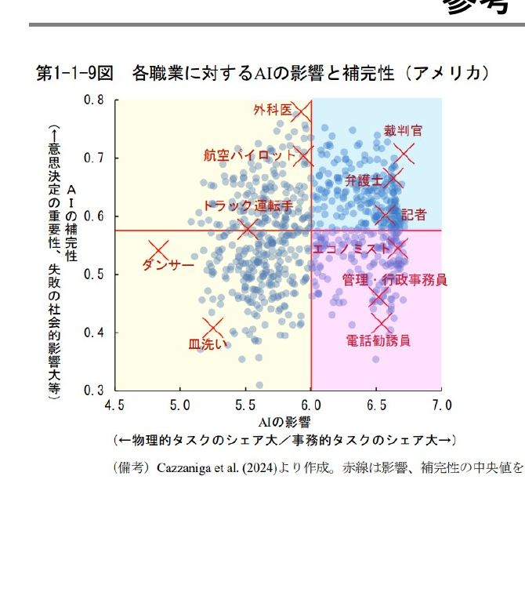

<b>AIの影響が大きく、代替性が高い職業：</b>事務的タスクのシェアが大きい職業。▶ つまり、AIがとって変わってしまう職業

<b>AIの影響が大きく、補完性が高い職業：</b>事務的タスクのシェアが大きいものの、意思決定の重要性が高く、AI任せとすることが社会的に望ましくない職業。▶ AIを使いこなす必要のある職業

<b>AIの影響の小さい職業：</b>物理的タスクのシェアが大きい職業。

※ 教員・研究者(自然科学系)は、青の領域

内閣府 (2024)『世界経済の潮流』第1章 p.13

<!--
- ハンプサイクル
-->

---

前提：学習への生成AIの影響

# Academic performance (学業成績)

<b>Does ChatGPT enhance student learning? A systematic review and meta-analysis of experimental studies</b>　ChatGPTが主に(85%)大学生の学習に与える影響について、2022年から2024年にかけて発表された69本の教育実践をシステマティック・レビューしたもの (※語学32%)

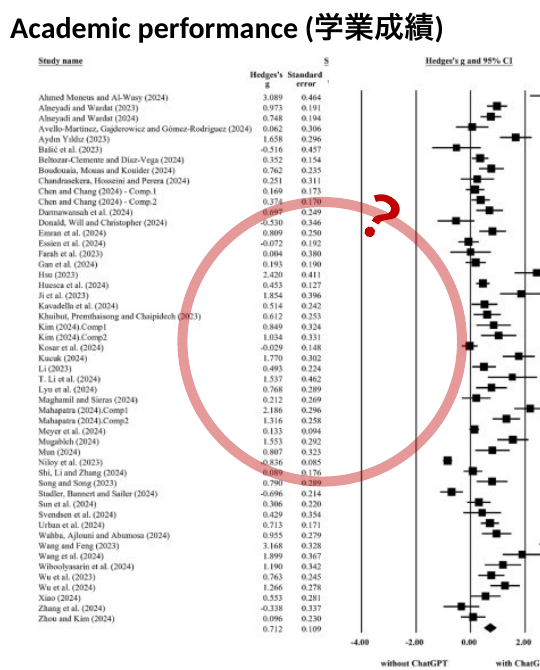

<b>縦軸：</b>各研究名

<b>Hedge's g：</b>各研究の効果量を示す。大きいほど研究のサンプルサイズが大きく、結果の精度が高い (0.5で中程度、0.8を超えると大)。

<b>ひげ：</b>各研究の効果量の95%信頼区間（CI）を示す。この線が0をまたがなければ、その研究は統計的に有意な効果を持つことを示す。

<b>見方</b>　中央の0を基準とし、- 右側は「ChatGPT利用が学習効果を高める」 - 左側は「ChatGPTが逆効果または効果なし」

<b>結論：</b>一番下の菱形（ダイヤモンド）は全研究を統合した全体の効果量、菱形の中央が全体の効果量。<b>学業成績を高める効果がある</b>とわかる。

<b>注意点：</b>9件の研究では、ChatGPTの使用を許可した状態でポストテストを行ったと明記（例：Bašić et al., 2023; Li, 2023）。33件の研究では、ChatGPTの使用が明示されておらず不明。<i>An alternative explanation for the improved academic performance could be the higher quality of work produced with ChatGPT's assistance</i>

Deng et al. (April 2025). <i>Computers &amp; Education</i>.

<!--
-->

---

前提：学習への生成AIの影響

# その他の指標も 分析

<b>Does ChatGPT enhance student learning?</b>　ChatGPTが主に(85%)大学生の学習に与える影響について、2022年から2024年にかけて発表された69本の教育実践をシステマティック・レビューしたもの (※語学32%)

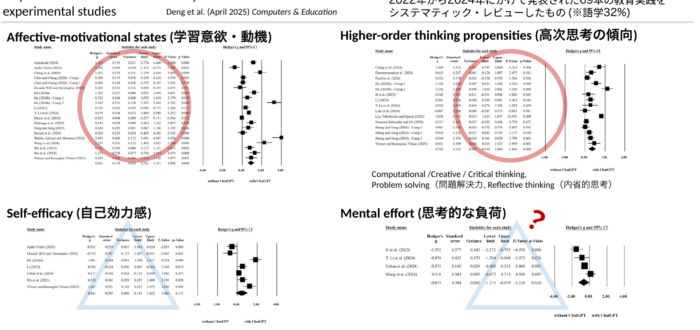

<b>Affective-motivational states</b> (学習意欲・動機)

<b>Higher-order thinking propensities</b> (高次思考の傾向) Computational / Creative / Critical thinking, Problem solving（問題解決力）, Reflective thinking（内省的思考）

<b>Self-efficacy</b> (自己効力感)

<b>Mental effort</b> (思考的な負荷)

Deng et al. (April 2025). <i>Computers &amp; Education</i>.

<!--
-->

---

前提：学習への生成AIの影響

# RQ1：どこでどのように教育活用されているか？

<b>Does ChatGPT enhance student learning?</b>　ChatGPTが主に(85%)大学生の学習に与える影響について、2022年から2024年にかけて発表された69本の教育実践をシステマティック・レビューしたもの (※語学32%)

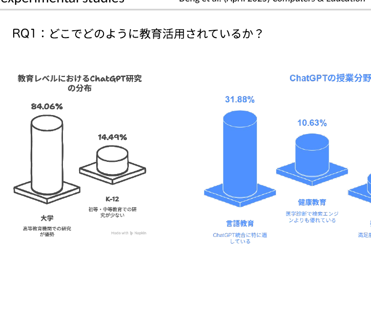

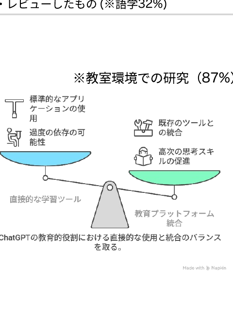

※教室環境での研究（87%）

<!--
-->

---

教員支援：ツールの調査

# ツール (海外：教員支援)

<table style="width:100%; font-size:14px; line-height:1.4;">
<thead>
<tr><th>Application</th><th>ユーザー数</th><th>地域</th><th>Key Features</th><th>Strengths</th></tr>
</thead>
<tbody>
<tr>
<td><b>Khanmigo</b></td><td>1億6000万人以上 (含む学習者・保護者)</td><td>Global (USA-based)</td>
<td>Khan Academyが開発したAI搭載の学習支援ツール。学生向けのパーソナルチューターと教師向けのアシスタント機能を提供。米国内は、MSの投資により無料。日本からは接続不可。</td>
<td>For 教員：多言語の保護者向けメール、授業計画作成、評価基準、授業内活動、正解付き問題集など、様々な教材の素早い草案作成をサポート　For 学生：単に答えを提供するのではなく、チューターとして学生が問題を自分で解決できるよう批判的思考を促進</td>
</tr>
<tr>
<td><b>MagicSchool.ai</b></td><td>~500万人</td><td>Global (USA-based)</td>
<td>教育者向けAIアシスタントプラットフォーム。授業計画、個別教育プログラム（IEP）、学習活動、評価などを生成。100種類以上のコンテンツテンプレートを提供し、15言語以上をサポート。</td>
<td>教師の計画作業と事務作業の時間を節約し、バーンアウト対策に貢献。160地域以上（ほぼすべての米国学区）で採用。プライバシー重視。</td>
</tr>
<tr>
<td><b>Eduaide.ai</b></td><td>N/A (thousands of users, 2023)</td><td>Global (USA-based)</td>
<td>教師向けオールインワンAIワークスペース。教材用コンテンツジェネレーター、IEP計画やメール作成の「ティーチングアシスタント」、学生作品へのフィードバックボット、自由形式のAIチャット、クイズ/評価ビルダーを提供。</td>
<td>100種類以上のリソースタイプが利用可能で多目的。生成されたコンテンツを15言語以上に即時翻訳。指導の差別化をサポート（例：調整案の提案）。</td>
</tr>
<tr>
<td><b>Curipod</b></td><td>150,000+ teachers (2023)</td><td>Global (Norway)</td>
<td>生成系AIを組み込んだインタラクティブな授業作成プラットフォーム。教師がトピックを入力すると、投票、ワードクラウド、クイズ、ディスカッションプロンプトを含む授業スライドを生成。記述回答に対するAIベースの個別フィードバックを提供。</td>
<td>インタラクティブでゲーム化されたコンテンツで学生の参加を促進。AIコンテンツを教師が確認しながら、授業準備時間を大幅に削減。2023年後半までに24万の授業が作成され、100万人の学生に到達。教師向け無料AIトレーニング（認定プログラム）を提供。</td>
</tr>
<tr>
<td><b>Education Copilot</b></td><td>N/A (new in 2023)</td><td>Global (UK-based)</td>
<td>教育者・トレーナー向けオールインワンAIプラットフォーム。授業計画の生成とリソース作成を自動化。出席確認や採点などの管理タスクを処理する仮想教育アシスタントを提供し、授業計画中にリアルタイムの提案を行う。</td>
<td>指導と管理業務の両方を効率化し、準備時間を節約して教室管理を容易に。カスタマイズとコンテンツ編集のためのユーザーフレンドリーなインターフェースを提供。インタラクティブな学生参加（即時フィードバック、学生コラボレーション機能など）をサポート。</td>
</tr>
</tbody>
</table>

<!--
-->

---

教員支援：ツールの調査

# トレンド (海外：教員支援)

英国では2023年11月にかけて、<b>初等中等のAI利用教員の割合が17%から42%に上昇</b> 
　cf. Among online UK youths aged 16-24, 74% have used a GenAI tool.

米国でも2024年秋までに<b>約43%の教員がAI研修を受ける</b>ように 
n = 1135, EdWeek Research Center survey, 2024

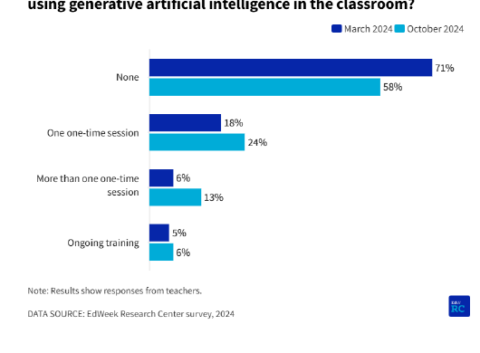

<b>教師の業務効率化</b>

授業計画の作成、教材リソース開発、採点、管理業務の自動化／事務作業時間の削減により、より学生に集中できる環境作り／多言語対応を含む多様なコンテンツテンプレートの提供

<b>パーソナライズされた学習支援</b>

学生の進捗データ分析と指導法の提案／適応型学習コンテンツの提供／学生の個別フィードバック生成

<a>https://www.ai-in-education.co.uk/news-events/dfe-generative-ai-in-education-report</a>

<!--
-->

---

FD：ツールの調査

# ツール (海外：教員養成・PD)

<b>AIコーチングとメンタリング</b>　教師のリフレクション（自己省察）を促すシステム／シミュレーションの提供／人間のメンターを補完、専門家の意見をスケールする

<table style="width:100%; font-size:14px; line-height:1.4;">
<thead>
<tr><th>Application</th><th>ユーザー数</th><th>地域</th><th>Key Features</th><th>Strengths</th></tr>
</thead>
<tbody>
<tr>
<td><b>AI Coach by Edthena</b></td><td>Used in multiple U.S. districts</td><td>USA (available globally)</td>
<td>専門能力開発向け仮想AIコーチ。教師が自身の授業ビデオを録画・アップロードし、AIコーチから分析とフィードバックを受けられるシステム。経験豊富な指導コーチによって訓練されたAIが、研究に基づいたコーチングを提供。4ステッププロセス：分析、振り返り、実行、影響評価で実施する。授業研究をオンライン化したような道具。</td>
<td>すべての教師にいつでもコーチングを無制限で提供。パーソナライズされた成長プラン：各教師の目標と教室データに合わせたコンテンツ。管理者がダッシュボードを通じて専門能力開発の進捗を追跡できる</td>
</tr>
<tr>
<td><b>AI Classroom Simulator (Relay/Wharton)</b></td><td>PoC (rolling out 2024)</td><td>USA</td>
<td>教師養成生のためのAI駆動の教育シミュレーション。「AIが実際の教師養成と開発を代替ではなく補完するのにどのように役立つか」がkey。研修生はAI生成の生徒アバターとテキストベースの仮想教室シナリオに参加。AI指導者（「バーチャルコーチ」）が研修生をガイドし、生徒との会話などを練習する際にヒントやフィードバックを提供する。</td>
<td>新任教師が教室でのやり取りを練習するための安全でリスクの低い環境を提供。ふさわしい特定の行動を他のものよりも選ぶ「理由」を考えるのを助けるよう設計。即時フィードバックと、エクササイズを振り返り再試行する機会を提供することで、スキル開発を加速</td>
</tr>
<tr>
<td><b>StretchAI (ISTE/ASCD)</b></td><td>Beta testing (2024)</td><td>USA (global reach)</td>
<td>教育者の専門能力開発（PD）のためのAIコーチ。Q&amp;Aと指導アシスタントとして機能し、教師が教育戦略や課題についてアドバイスを求めると、StretchAIは審査済みの研究ベースの出版物やベストプラクティスリソースのライブラリから回答を提供</td>
<td>信頼できる知識ベースを持ち、アドバイスは検証された研究や教育専門家の意見に基づく（単なるオープンウェブチャットボットではない）。教育学と教師のニーズに焦点を当て、的を絞ったガイダンスを実施（例：特定の指導スキルを向上させる方法）を提供</td>
</tr>
</tbody>
</table>

<!--
-->

---

プレFD/教員養成でのAI

# 研究例と まとめ

<b>ChatGPTの授業計画作成能力の認識を調査</b>　STEM、TESOL、社会科の方法論コースに登録されている59人の教員を目指す学部生と大学院生を対象

数学科の教員志望者にChatGPT (GPT-3.5)をミニ授業（microteaching）の指導案作成アシスタントとして使わせ、出力の有用性や問題点を分析。ChatGPTの教育的アウトプットを批判的に評価できたが、数学的な出力に関しては誤った解答を「別のアプローチ」と誤解することがあった。結果的に「アイデア源としては役立つが、生成内容の精査・補完が教師の重要な役割」との認識を深めた。

<b>仮想学生"応答型AIチャットボット"との対話は教育実習生の「気づき能力」を向上させるか</b>　質問実践力に顕著な差が観察された

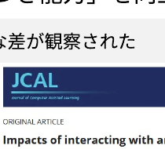

<b>まとめ：</b>多数の研究成果があり、- AIでシミュレーション用ツールを創ったもの - AIをツールと活用してみたもの - AIをリフレクションなどに活用するもの が目立つ。 
文化・制度依存性を踏まえ、国内での検証が待たれる（国内での研究はそこまで多くない気がする）

<!--
-->

---

AI時代に授業設計はどう変わる？

# 問題意識

14世紀 @ ドイツ

Laurentius de Voltolina

現在？

Generated by DALL-E

<b>社会</b>も、<b>科学技術</b>も、<b>教育理論</b>も進歩 でも、<b>授業は同じまま</b>？

<table style="width:100%; font-size:21px;">
<thead><tr><th></th><th>認知的領域</th></tr></thead>
<tbody>
<tr><td style="color:var(--accent-dark); font-weight:800;">高</td><td>創造</td></tr>
<tr><td></td><td>評価</td></tr>
<tr><td></td><td>分析</td></tr>
<tr><td></td><td>応用</td></tr>
<tr><td></td><td>理解</td></tr>
<tr><td style="color:var(--accent-dark); font-weight:800;">低</td><td>記憶</td></tr>
</tbody>
</table>

<b>座学の講義で理解を促すだけ</b>では、到達出来たり、授業中に試せたりする<b>目標の範囲が狭くなりがち</b>。そこで、<b>課題中心や実験中心など、</b><b>「起こりそうな問題」や「実験」を設計の軸にする</b>ことで、より深く学べるようになるのでは？

<!--
-->

---

AI時代に授業設計はどう変わる？

# 参考：ID(インストラクショナル・デザイン)の第一原理

<b>インストラクション</b>：学習を促進させるために行うことすべて

IDの第一原理

<table style="width:100%; font-size:24px;">
<thead>
<tr><th style="width:42%;">5つの要件</th><th>説明</th></tr>
</thead>
<tbody>
<tr><td><b>①問題</b> (Problem)</td><td>現実に起こりそうな問題に挑戦する</td></tr>
<tr><td><b>②活性化</b> (Activation)</td><td>すでに知っている知識を動員する</td></tr>
<tr><td><b>③例示</b> (Demonstration)</td><td>例示がある(Tell me でなく Show me)</td></tr>
<tr><td><b>④応用</b> (Application)</td><td>応用するチャンスがある(Let me)</td></tr>
<tr><td><b>⑤統合</b> (Integration)</td><td>現場で活用し、振り返るチャンスがある</td></tr>
</tbody>
</table>

鈴木克明 (2015)『研修設計マニュアル』北大路書房

<!--
-->

---

AI時代に授業設計はどう変わる？

# 参考：課題中心型の授業設計

<b>✗問題解決型</b>：現実の解決する形で設定するが、どのような学びや学問を使用するかは、明確にデザインされていない (スキル獲得を目指すもの)。

<b>◯課題中心型</b>：現実に起きそうな問題を、教員が小問 (道しるべ) や試行錯誤、ワークなど、使用する概念や獲得される学びを把握して、学習課程を設計する。

方法

①新しい全体的なタスクを見せる 
②タスクに必要な構成要素を提示する 
③タスクに関する構成要素を演示する 
④もう一つ新しい全体タスクを見せる 
⑤学修者に、既習の構成要素を新タスクに応用させる 
⑥この新タスクに必要となる追加的な構成要素を提示する 
　補足：追加部分は、AIに支援させるなども可能 
⑦これらの追加的な構成要素を演示する 
⑧ステップ4~7を続くステップにも繰り返す

<b>AI時代に容易になった学び方にも対応</b> (cf. 100日チャレンジ)　ブランチ・メリル (2013)

<!--
-->

---

AIが得意な授業支援例

# ルーブリック

<b>✔</b>採点道具の一つで、課題を構成要素に分け、<b>要素ごとに評価基準を満たすレベル</b>を説明した表 ✔パフォーマンス課題・レポート・実技等の評価の可視化

<table style="width:100%; font-size:20px; margin-top:10px;">
<thead>
<tr><th>評価観点</th><th>素晴らしい(2)</th><th>合格(1)</th><th>不十分(0)</th></tr>
</thead>
<tbody>
<tr><td><b>分量</b></td><td></td><td>6分間で丁度</td><td>過剰か少ない</td></tr>
<tr><td><b>目標</b></td><td>明確かつ内容が一致していた</td><td>明確さか内容の何れかに改善点</td><td>明確さ・内容の何れも不十分</td></tr>
<tr><td><b>レベル設定</b></td><td>手を伸ばせば届くレベルだった</td><td>一部高度・容易な箇所があった</td><td>極端に高度・容易であった</td></tr>
</tbody>
</table>

<b>「課題内容</b>：6分模擬授業」を評価するためのルーブリック

<b>評価尺度</b> (横方向のレベル)

<b>評価基準</b> (縦方向の観点)

ルーブリックにより、安定・充実した評価が可能に

栗田 &amp; 中村 (2024)「インタラクティブ・ティーチング 実践編３」／ スティーブンス＆レビ (2014)

<!--
-->

---

AIが得意な授業支援例

# 反転授業

基礎知識に関する(メディア)学習を<b>事前に</b> 　<b>その後の授業では議論・演習を行うブレンド型</b>

医学部等でも<b>実践論文</b>あり ／ Stanfordの取組が有名

高度化型

- <b>高次目標</b>を演習や実験で

完全習得型

- <b>理解の確認や質問</b>を教室で

✔アクティブラーニングを取り入れ教育効果を高めやすい ✔教員は多様な学生に対応しやすく、効率化もしやすい ✔学生は疑問点や関心を持ち、自己に最適な授業に臨める

<b>今までは動画教材だったが、AI教材でも多分出来る</b>

<!--
-->

---

AIが得意な授業支援例

# メディア授業の強み・弱み・配慮点

オンライン授業で出来ること

強み

①<b>設定した目標への到達</b>は得意 
②<b>情報を効率的に提示し理解</b>に至りやすい 
③<b>時間・場所的な融通</b>が効く

弱み

①<b>意図しない学びの発生</b>が難しい 
②ジェネリックスキル形成に繋がり難い 
③疲れやすい/集中しにくい

要配慮

①学生/教師-学生間の<b>コミュニケーション</b> 
②学生側の視聴環境に差がある

AI教材利用の場合の注意も近い？ ▶ 人×教室×AIの重要性

<!--
-->

---

すぐにできること：課題での注意点

# 参考：AIリテラシ OECD (2023)

各国でリスキリング/学校教育への取り込みが行われている

第１：AIの基本的な機能と日常生活におけるAIの使用方法に関する知識 
第２：様々な場面に応用することのできる能力 
第３：AIを実装し、評価することができる能力 
第４：アルゴリズムの開発に必要なデータを管理する能力とAIの出力結果を批判的に考察する能力

AIの技術面を批判的に評価し、AIを効果的に活用できる能力 (communicate and collaborate)

AIを理解し、活用し、監視し、批判的に考察できるスキル

内閣府 (2024) 世界経済の潮流 ＞第1章＞p.32

<!-- ハンプサイクル -->

---

AIリテラシと図書館の役割

# 生成AIの活用領域

プライバシーの保護を保った状態で、400万以上のClaude.aiの会話を分析

→どの経済的タスクにAIが利用されているか把握 米国労働省のO*NET実会話DBから類似性分類

全体として分かったこと

① Software 開発とWritingで半分

② 36%の職業にAIが利用されている

③ スキル増強：自動化 = 57 : 43

<b>文書館・図書館などでの利用</b> 「Archivist：評価し、収集、整理、保存、そして利用を促進する専門家」的タスクが多い

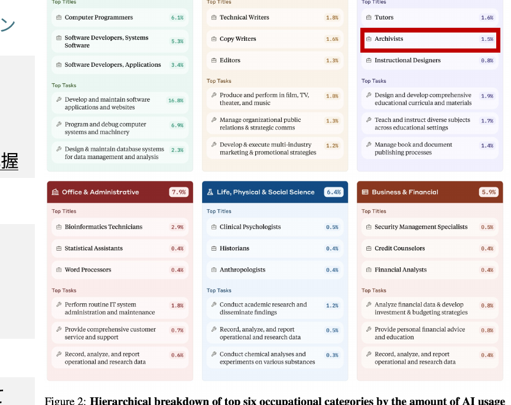

Figure 2. Hierarchical breakdown of top six occupational categories by the amount of AI usage. Anthropic (2025 ArXiv)

<!-- ハンプサイクル -->

---

AIリテラシと図書館の役割

# 図書館員によるAIリテラシ教育

Engineering LibrarianによるLLMの講義とディスカッションを実施 探究ベースのコースワークや人工知能の限界やユースケースについて、より洗練された理解を学生がもつ助けになった事例

<a>https://www.sciencedirect.com/science/article/pii/S0099133324000600</a>

"Despite the urgency of AI literacy, there is a lack of structured approaches to teaching these skills in higher education. <b>Because the expertise of academic librarians lies in information literacy, innovative pedagogy, and interdisciplinary collaboration, they are uniquely positioned to address this gap.</b> Librarians are already adept at teaching students to evaluate sources, engage with diverse information systems, and consider the ethical aspects related to information use. Building on these strengths, academic librarians can play a pivotal role in fostering AI literacy by delivering scaffolded workshops that align with varying levels of familiarity with AI concepts."

<a>https://www.sciencedirect.com/science/article/pii/S0099133325000370</a>

<!-- ハンプサイクル -->

---

すぐにできること：課題での注意点

# 課題における記載例 (Bowen &amp; Watson, AAC&amp;U 2024)

課題における自分のコントリビューションを説明する

- 私は友人、ツール、テクノロジー、AI の助けを一切借りずに、この作業を完全に自力で行った。 
- 最初のドラフトは自分で書いたが、その後、友人/ 家族/AI/ パラフレーズ/文法/剽窃ソフトウェアに読んでもらい、提案をもらった。この助けを受けた後、以下の変更を行った：

　- スペルと文法の修正 
　- 構成や順序の変更

自分で作成した後、テクノロジーを使用して文全体や段落全体を書き直した。 
元となるアイデアを生成するためにAI/友人/チューターを使用した。 
アウトライン/最初のドラフトを作成するためにAIを使用し、その後編集した。

<!-- メタな点：①ルーブリックでの採点やフィードバック支援はAIが可能になった -->

---

すぐにできること：課題での注意点

# 課題における記載例 (Bowen &amp; Watson, AAC&amp;U 2024)

事前に授業における生成AI利用のポリシーを共有する

AI の使用が許可または禁止されるのはいつか？なぜか？ 
AI とのブレインストーミングはカンニングにあたるのか？ 
AI がこのクラスで学習をどのように強化または妨げる可能性があるのか？ 
AI が許可されている場合、学生は課題提出の一環として AI プロンプトを共有する必要があるのか？ 
AI の使用はどのようにクレジットされるべきか？ 
AI の限界に関する警告 
AI 検出ツールの使用計画とその情報の使用方法に関する説明

<!-- メタな点：①ルーブリックでの採点やフィードバック支援はAIが可能になった -->

---

すぐにできること：課題での注意点

# 参考：課題における記載例 (Bowen &amp; Watson, AAC&amp;U 2024)

事前に授業における生成AI利用のポリシーの例

このライティングコースの目標の一つは、効果的に書き、コミュニケーションをとる方法を学ぶことだ。これは練習が必要である。AIを使って迅速に生産することも期待されるが、<b>そもそも質の高い文章を自分で作成、編集し、認識する能力も必要</b>である。AIが自分を介さずに作業を行うことができる場合、それは雇用されるに値するスキルを持っていない、いうことになる。だから、練習しよう。  
それを達成するために、コースの前半では、AIのサポートは一切禁止する。この過程の苦労やもどかしさは、レベル上げ訓練のようなものと捉えてほしい。自分で作業を行う人が利益を得るのだ。  
一方、コースの後半では、特定の状況下でAIを使用することが許可される場合がある。AIの使用を認める必要がある。使用したプロンプトとその応答を提出するよう求める場合がある。  
AIリテラシーは重要な新しいスキルだ。Aiは「幻覚：事実のように見えるものを生成する可能性」があることに注意が必要である。この技術の利点と潜在的な危険性の両方について批判的に考える必要がある。  
あなたは依然として最終的な成果物およびAIからの制限やバイアスの可能性について責任を負う。このポリシーは必要に応じて変更する権利を留保する。

<!-- メタな点：①ルーブリックでの採点やフィードバック支援はAIが可能になった -->
