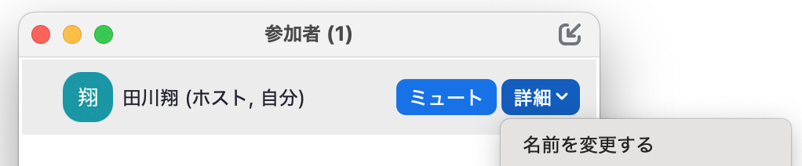
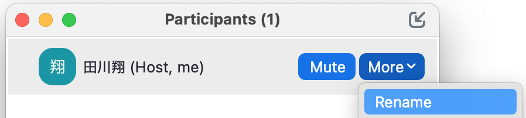
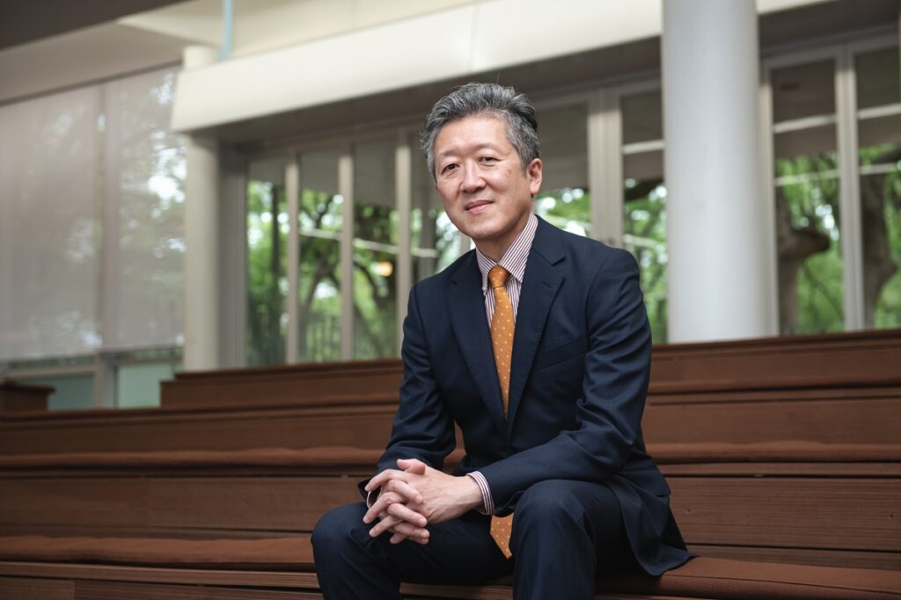
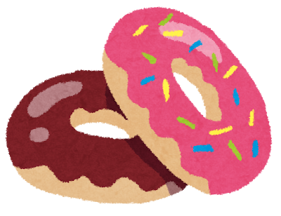
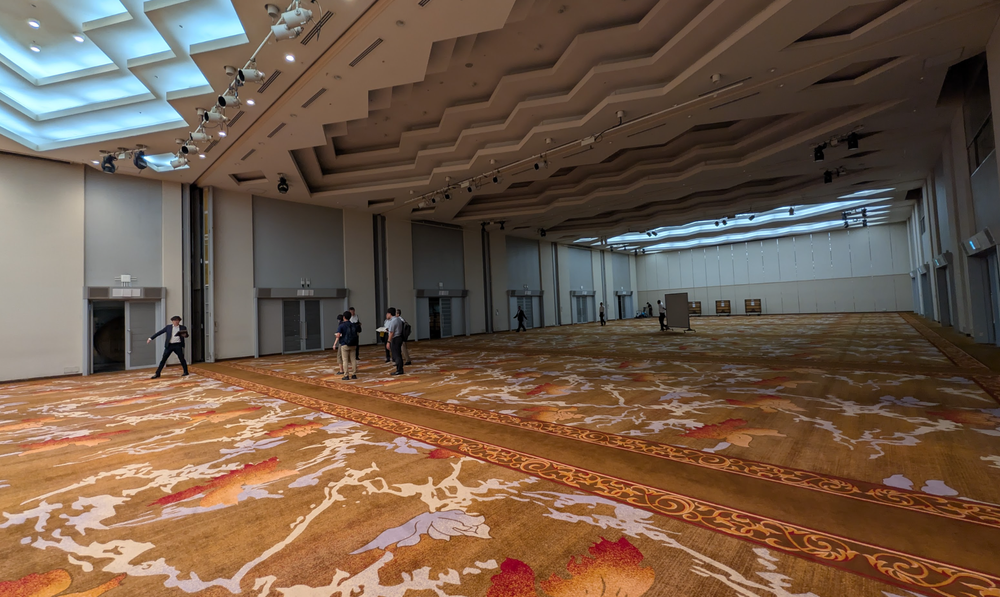
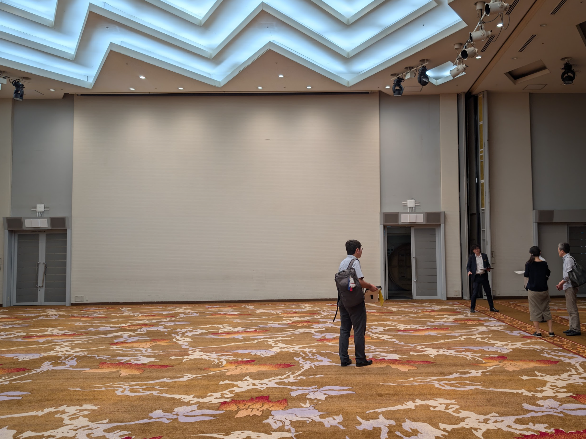

開始前の案内

# 開始前の案内／Pre-event Notice

➢接続に関するトラブルがありましたら、お知らせください
➢氏名を「グループ番号と氏名（ローマ字表記）にしてください」　例：「01_Taro CHIBA」
➢この打ち合わせは、<b><u>録画を行います（終了後公開予定です）</u></b>
➢スライド<b><u>資料は、リンク🔗から取得できます</u></b>

➢If you have any connection issues, let us know.
➢Change your name into "Group Number_Full Name"; e.g. "01_Taro CHIBA"
➢This session is <b><u>recorded and made available afterward.</u></b>
➢This <b><u>material can be accessed via the link🔗.</u></b>

👥 1 ⌃ Participants

⇒

<!-- 田川 -->

---

<!-- _class: cover-hero -->

大学院教育改革フォーラム2025／Forum for Graduate School Educational Reform 2025

25th September, 2025　(Last updated at 3pm, on 25th Sep.)

学生グループ発表 事前説明会・顔合わせ

Briefing &amp; Kick-off Meeting for Group Presentation

<!-- 松本先生 -->

---

ご挨拶

# ご挨拶／Opening Remarks

Prof. Hiroya TAKEUCHI

実行委員会委員長 千葉大学副学長

Chairperson of the Forum Committee Vice President of Chiba University

<!-- 松本先生 / 竹内先生→バイリンガルでお願いする。英語で作成頂く。 -->

---

コーディネート担当教員

# コーディネート担当教員／Coordinators

Shoh TAGAWA（田川 翔）

【現在の専門】高等教育論・教育におけるAI 
【学術的バックグラウンド】 地球の起源 
【一押し】航空会社で働いていました

Current Academic Focus: Higher Education, and AI in Education 
Academic Background: Planetary Science 
A Previous Chapter: Working for an Airline

Yohei MATSUMOTO（松本 暢平）

【現在の専門】中・高等教育の接続・医学教育 
【学術的バックグラウンド】教育社会学 
【一押し】うなぎ好きです

Current Academic Focus: Articulation between Secondary and Higher Education, and Medical Education 
Academic Background: Sociology of Education 
Fun Fact: Unagi Lover

<b>日々異分野交流している、私たち2人がコーディネートします</b>　／　<b>Two Guides, Two Perspectives</b>

<!-- １人ずつ -->

---

フォーラムのテーマ

# フォーラムのテーマ／Forum Topic

博士の可能性、社会の未来

Unlocking the Potential of Doctorates, Shaping the Future of Society

➢複雑化した課題の多い社会で、未来を切り拓く"知の力"
➢博士人材が、それぞれの専門知を分野を超えて社会や人々のために生かすことが不可欠
➢鍵のひとつとしての「マルチキャリア」化
➢専門性の否定ではなく、<b><u>高度な"知の力"で突き抜けた博士が多彩に活躍する社会</u></b>
➢多分野の大学院生が協働し、専門知で未来を築くための実験に、このセッションで挑みます

➢The Power of Knowledge that shapes our future in this era filled with a lot of complex social issues.
➢The expertise of doctoral talent across disciplines is needed for the benefit of society and people.
➢One key is the shift toward diverse career paths (we say "multi-career" paths) and sectors.
➢<b><u>Society where doctoral professionals leverage their specialized knowledge across disciplines, collaborating with diverse people.</u></b>
➢This session is an experiment in which graduate students from diverse fields collaborate in order to build the future with their specialized knowledge.

<!-- 田川 -->

---

Slido

皆さんは、異分野の大学院生と話したいと思ったことはありますか？

Have you ever wanted to connect with students from different disciplines?

ⓘ Presenting with animations, GIFs or speaker notes? Enable our <u>Chrome extension</u>

<!-- 📣 This is Slido interaction slide, please don't delete it.✅ Click on 'Present with Slido' and the poll will launch automatically when you get to this slide.田川 -->

---

Slido

それはなぜですか? Why?

ⓘ Presenting with animations, GIFs or speaker notes? Enable our <u>Chrome extension</u>

<!-- 📣 This is Slido interaction slide, please don't delete it.✅ Click on 'Present with Slido' and the poll will launch automatically when you get to this slide.田川 -->

---

グループ発表のテーマ

# グループ発表のテーマ／Theme for this session

専門知の統合による社会課題への挑戦

Addressing Social Challenges through the Integration of Specialized Knowledge

専門性は重要だが、専門性「だけ」になってしまうのは、大学院生にとって幸せなのか？ 
分野横断的な広がりやつながりが研究や仕事を通じて社会の発展につながることもあるのではないか？

Does focusing "only" on "specialization" lead to a fulfilling path for graduate students? 
Interdisciplinary connections lead to research and work that contributes to solving societal challenges?

<!-- 松本先生 To achieve the forum topic, we made discussion what to do. Then we decided the theme. As shown in the slide, we decide, / We are sometimes questioning, -->

---

グループ発表のテーマ

# グループ発表のテーマ／Theme for this session

専門知の統合による社会課題への挑戦

Addressing Social Challenges through the Integration of Specialized Knowledge

1)全員の専門性を背景として、 
2)現代社会が抱える課題・今後抱え得る課題をひとつ特定し、 
3)解決策や新たな挑み方を<b><u>分野横断的に専門知を統合して創造し</u></b>、提案してください。

Your Mission is, <b><u>cross-disciplinarily</u></b>, 
1)to synthesize each member's intelligence, 
2)to identify a critical challenge, present or future, and 
3)to forge an innovative solution or a bold new approach.

<!-- 一つの課題に対して、多数のアプローチがあるはず。 / 自分の専門からその問題をきちんと統合して、一つの解決策として、統合していけるか。 /  / 松本先生 -->

---

当日までの流れ

# 当日までの想定される流れ／4 Steps to the day

Step 1

グループ内で各自の専門分野を紹介し合う

Share Your "Specialization" one another

▶

Step 2

解決可能な「社会課題」やそれに関する「問い」を決める

<u>Define the Challenge</u>

that only your team's collective intelligence can unlock

▶

Step 3

専門知を変える「問い」を深堀りし、解決策や挑み方などを示す。

<u>Build Your Solution</u>

Optional: If you still have time, go beyond the idea! e.g. PoC etc…

Step 4

フォーラム当日、5分間で発表する

Pitch Your Vision in 5mins on the Forum day

<!-- 松本先生 -->

---

テーマ例

# 例) 「ドーナッツを穴だけ残して食べる方法」書籍

e.g. "How to eat a donut, leaving only the hole."; The Univ. of Osaka

➢様々な専門家が、ドーナツの穴を定義し、残す方法を提案します 
Imagine a diverse team of experts sparking unexpected solutions from their unique definitions of a single donut hole—a mathematician seeing it as a topological feature, a philosopher as an absence of being, and a chef as wasted potential.

➢常識を覆します 
It challenges common sense.

➢遊び心とユーモアがあります 
It's playful and humorous.

➢日常にある身近なモノへの見方を変えてくれます 
It changes our perspective on a simple, everyday object.

<!-- 松本先生 -->

---

テーマ例

# テーマ例／Examples of Presentation topic

➢相転移のアナロジーから考える「教室」 
地球内部の鉱物：「温度・圧力」の変化により、接していたい原子の数(配位数)が変わることに着目 
相転移が起き、構成元素は同じなのに違う構造の鉱物になることに着目 
教室も相互作用の数で状態が分類できるのでは？ 
では、温度や圧力に類する社会学的なパラメタは？ 
<b style="color:var(--accent-dark);">地球惑星科学＋教育学etc.</b>

<b>不老不死が実現した社会における「生きがい」の再定義</b>　医科学＋哲学etc. 
<b>環境変動から生じる疾病リスクの増大を防ぐ方法</b> 
<b>リテラシーに起因する社会的な分断の解決策</b> 
<b>最強の「言い訳」生成AIが開発された場合の倫理的課題</b>

ある社会的なテーマの解決や改善に、複数の学術領域からアプローチすることは、できるし、必要

➢<b>The Classroom Analysis Through the Analogy of Phase Transitions.</b> 
Minerals: Changes in temperature &amp; pressure alter a mineral's atomic structure (a phase transition), creating a new mineral from the same elements. 
Classroom Analogy: Can a classroom's "state" be classified by the number of interactions? 
The Question: What are the sociological equivalents of "temperature" and "pressure"? 
<b>Planetary Science and Education etc.</b>

<b>Redefining Purpose in Life in a Society Where Immortality is a Reality.</b>　<b>Medicical Science and Philosophy etc.</b> 
<b>Methods for Preventing the Increased Risk of Diseases due to Environmental Change.</b> 
<b>Solutions for Social Division by Literacy Gaps.</b> 
<b>Ethical Challenges from the Development of a "Perfect Excusing" AI.</b>

Addressing and improving social issues through multiple academic fields is possible and necessary.

<!-- 松本 -->

---

よい例と“じゃない”例

# よい例と“じゃない”例／Dos and Don'ts

好ましくない例／Common Pitfalls

<ul style="font-size:20px;">
<li>誰かの一人の研究テーマを発展させる Just expanding on a member's personal research.</li>
<li>課題解決ではなく研究する Treating this as a pure academic research project.</li>
<li>ビジコンとして捉える Mistaking this event as a business plan competition.</li>
<li>専門性と全く無関係な話になる An idea that ignores team's collective expertise. (Please avoid a generic solution anyone could think of.)</li>
<li>具体性のない精神論 Just providing a solution that's just a slogan.</li>
<li>壮大すぎるテーマ設定 Choosing a problem that's too broad</li>
</ul>

よい例／Dos

<ul style="font-size:20px;">
<li>「私達だから思いついた！」が光る解決策 Perspective-Shifting Ideas with "Why Us?" Solutions</li>
<li>研究室の外を想像するもの Grounding Your Idea: Think Beyond the Lab.</li>
<li>視点を変える面白いアイデア Unconventional &amp; Humorous ideas.</li>
<li>状況を定義したり、仮定するもの Feel free to set your own "What Ifs" or definitions.</li>
<li>創発的な気づきや小さな発見 Small yet emergent insights that can only arise when diverse PhD candidates come together.</li>
</ul>

<b>皆さんの専門分野が交差するからこそ生まれる、世界やものごとの見え方が変わる話題を求めます</b> We will evaluate ideas born from the interactions of your disciplines, that have the power to change how we see the world or things.

<!-- 田川 -->

---

準備してほしいこと

# 準備してほしいこと/What to Prepare for the Forum

当日は、<b>1グループあたり5分の発表と3分の質疑応答を</b>してもらいます

準備

PCとプロジェクタを用意します（持ち込み不可）

動画などはPPT埋め込みで（YouTube等へのリンクは不可）

発表言語は 英語 or 日本語、スライドは日英併記で

事前にPPTとPDFの両方を提出

スライドサイズは<b>4:3</b>推奨

<b>5分厳守で。20秒延長で減点</b>、1分延長するとそこで打ち切り

Each group will give 5-minute presentation &amp; 3-minutes QA. <b>Equipment:</b> A PC and projector will be provided. You may not bring your own devices. <b>Videos:</b> Please embed videos directly into your PowerPoint file. Links to YouTube or other external websites are not permitted. <b>Language:</b> Presentations can be in either English or Japanese. Slides must be bilingual. <b>Submission:</b> Please submit both the PowerPoint and PDF versions of your slides in advance. <b>Slide Format:</b> A 4:3 aspect ratio is recommended for your slides. <b>Time Limit:</b> Points will be deducted if you exceed the time by 20 seconds.

<!-- 田川 -->

---

会場の様子

# 会場の様子／Venue Information

会場はかなり広いため <b>資料の文字は大きめに！</b> The venue hall is large, so larger font is recommended!

<!-- 松本先生 -->

---

評価の方法／Evaluation

# 評価の方法／Evaluation

<b>1日目：当日、会場全体でフォームで採点</b>　また、要した時間などに基づき事務局側でも一部点数を追加・減点します。

【採点基準案】各基準5点ずつ、合計20点、採点者の平均点で評価

<b>①面白さ：</b>提案に社会的・学問的な面白さがあるか

<b>②専門性の融合／協働：</b>提案が全員の専門性や学問的なアイデアを活かしている

<b>③深さ：</b>問いの提案だけではなく、実証性もあり、納得感のある解決策の提案が含まれているか

<b>④明瞭さ：</b>専門外の人が聞いて提案の核心や魅力が明確に伝わるか、スライドや話し方は分かりやすいか

<b>2日目： 会場全体に「どれが一番よかったか」質問し、投票の多いものから順位づけ</b>

<b>Day1:</b> The audience will score each presentation with web-forms. The organizers will also score based on factors such as timekeeping. <b>Scoring Criteria:</b> Each criterion is 5 points, and evaluated based on the average of evaluators. — Interest: Is the idea original and engaging? / Collaboration: Does the proposal combine everyone's expertise? / Depth: Is the solution well-reasoned and practical? / Clarity & Communication: Is the message clear and compelling, even to a non-expert? <b>Day 2:</b> Audience Vote "Which one was the best?"

<!-- 松本先生 グループ名は非表示で点数のばらつきで評価する：地元企業から出してもらう！ -->

---

当日の流れと賞について

# 当日の流れと賞について /Schedule Overview

<b>一日目：</b>2会場に分かれて予選　※当日参加者は、<b>1日目夜にあるレセプションに無料招待！</b>ぜひ来てくださいね。

⬇

当日その場での集計で、<b>10グループ中、3グループが本戦</b>に（同点の場合はくじ引き）

<b>二日目(本戦)：</b>メイン会場で全員からの投票、結果に基づき大賞・優秀賞を授与します。

<b>Day 1: Preliminary Rounds</b> — Presentations will be held in two separate venues. Scores will be tallied on-site immediately following the presentations. 3 out of 10 groups will advance to the final round. In case of a tie, the finalist will be chosen by lottery. <b>Day 2: The Finals</b> — The final round will be held in the main hall.

<!-- 松本先生 グループ名は非表示で点数のばらつきで評価する：地元企業から出してもらう！ -->

---

進め方とチェックポイント

# 進め方とチェックポイント/ Workflow and Checkpoints

<b>重要：すべてのお知らせや質問の回答結果、全員の進捗は、このスプレッドシートに掲載されます。</b>

連絡手段を含め、どのように進めていくかはグループに委ねます。以下の<b>チェックポイントを、期日までに通過</b>してください。

CP

最低1度の全員での顔合わせの完了・リーダー決定の報告（～10/7）

進捗状況報告（①～10/14、②〜10/28）

題目・概要の報告（11/7）

発表資料の事前提出（～11/30）　PPTとPDF

それぞれのチェックポイントを通過した時点で、スプレッドシート<b>(link)</b>に記載して下さい。それにより、皆様の進捗状況を把握します。

<b>Important:</b> All announcements, answers to questions, and progress updates will be posted on this spreadsheet. <b>Workflow:</b> Each group is responsible for deciding its own workflow, including your primary method of communication. <b>Checkpoints</b> (update the spreadsheet as you complete each): By Oct 7: Hold at least one meeting with all members and report that your group leader is assigned. / By Oct 14 and Oct 28: Submit a progress reports. / By Nov 7: Submit your presentation title and abstract. / By Nov 30: Submit your final presentation materials (in both PowerPoint and PDF formats). <b>Note:</b> Participants in this session do not need to complete the general event registration.

<!-- 田川 -->

---

相談・フォロー体制

# 相談・フォロー体制／Questions &amp; Support

質問がある場合には、こちらのフォームに記入してください (質問フォームへのリンク🔗)。個人情報を削除の上、全員が閲覧可能なSpreadsheetに回答を記載します (回答へのリンク🔗)。

<b>※ 本日分の質問も受け入れます。追って回答します</b>

フォームに記入できない、機微のある相談は直接事務局までメール (<b>kyoki-forum@chiba-u.jp</b>) してください。個別に対応します。

<b>For General Questions:</b> submit via the online form (here🔗); answers posted to a shared Google Spreadsheet (here🔗). <b>Notes:</b> Questions for today's session will be accepted after this session ends. <b>For Sensitive or Private Inquiries:</b> email the administration office directly (Mail: kyoki-forum@chiba-u.jp).

<!-- 田川 -->

---

企画者からのメッセージ

# 企画者からのメッセージ／Message from organizers

まずは、普段の研究とは異なる<b>今回の出会いとアクティビティを楽しんで</b>ください

修士課程・博士後期課程問わず<b>遠慮せずに発言してください</b>、他者の視点が役立つことは多いです

<b>全員が参加する、協力的な場作り</b>は、社会で生きるうえでとても重要です

分野も、バックグラウンドも、(時には言語も)<b>異なる様々な人と建設的に議論し</b>、社会に価値を作りだすきっかけにしてください

<b>Anyway, enjoy this serendipitous encounter and activity!</b> Actively share your ideas and discuss whether you are in Ph.D course or MA course. It's great valuable for all to collaborate inclusively one another in our society. Engage with diverse peers in your group. Make constructive discussion and learn to create social impact.

<!-- 松本先生 -->

---

初回・顔合わせmtg

# 初回・顔合わせmtg / Kick-off Meeting

今から、<b>ブレイクアウト</b>で実施します。<b>所属のグループに各自移動</b>してください。

<b>行ってほしいこと (リスト)</b>

Tasks

①各自の紹介 (名前、所属、専門分野)

②リーダーの決定

③グループでのコミュニケーション方法の開設 (Line、Slack etc…)、次回の打合せ

→完了後、上記の情報をスプレッドシートに記入する(link)

<b>その後は自由解散で </b>(最大1時間は開いておくので、テーマの話し合いもOKです。それまでに終えてください。)

<b>We will now move into breakout rooms.</b> Join your assigned group. Tasks: ①Introduce yourselves (name, affiliation, field). ②Decide a group leader. ③Set up communication (e.g., Slack, LINE) → enter the info into the spreadsheet (link). <b>After completing these tasks, you are free to leave.</b> The rooms will remain open for up to one hour.

<!-- 田川 ※もし、全員集まっていないグループがありましたら、 -->
