<!-- _class: cover-hero -->

生成AI活用講座

第1回 (後半)

2025/10/1　講師：田川 翔

千葉大学 国際未来教育基幹 助教

<!--
- タイトルコール。生成AI活用講座 第1回の後半を始めます。講師の田川です。
-->

---

1　イントロ

# 自己紹介

仕事：<b>大学教育の企画</b>／<b>学生と教員を支援</b>

専門：<b>地球の起源、AI</b> 
地球惑星科学　博士(理学) 2020年

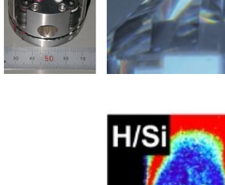

海の起源の仮説検証　Tagawa et al. (2021) <i>Nat. Com.</i>

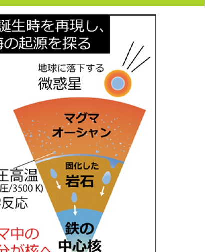

<b>翻訳：</b> 来年、発売予定！ 大学の教え方の授業

<!--
- 始める前に、簡単に僕の自己紹介をしときましょう。名前は、田川翔といいます。現在は千葉大学の教育をより良くするために、教育企画の仕事を行っている教員です。最近の研究テーマは大学教育と生成AIの関係なので、ここに立っています。
- これ似顔絵ですね。ポスターを真似て、チャットGPTにかいてもらいました。似てますかね？(会場の反応を見る)
- さて、そんな私ですが、もともと研究テーマは地球の起源の解明なんですね。この惑星は、どのようにできたのか。そして、海の量はなぜきまったのか。
- そんなテーマで、博士課程まで実験していました。これですね(岩石みせる)、皆様の足元深い所にあるかんらん岩という岩石なんですけどもこの宝石みたいな岩石が地球のマントルの成分だと考えられています。
- で、こっちの方が隕鉄ですね。特徴的な結晶構造があるので、宇宙から降ってきたってわかるんですけど、この2つの化学反応を、実際に地球ができた温度、圧力で実験していました。
- それは、超高圧・高温の世界で、手のひらに東京タワー10本分ぐらいをのっけたような圧力を作り出し、そこにレーザーをあててドロドロに融かすわけです。
-->

---

1　イントロ

# 授業・セミナー インタラクティブ化ツール

✓匿名 / もしよければ、ぜひご参加下さい

Join at slido.com #6732809

<b>PCから参加の方へ</b> 
<b>slidoのwebページを開き、アクセスコード(7桁)を入力して下さい</b>

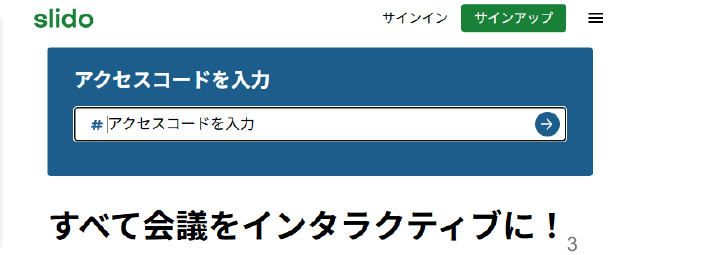

<!--
- 今日は slido という匿名参加ツールを使います。QRコードか slido.com にアクセスし、アクセスコード #6732809 を入力して下さい。
-->

---

1　イントロ

# 使ったことはありますか？

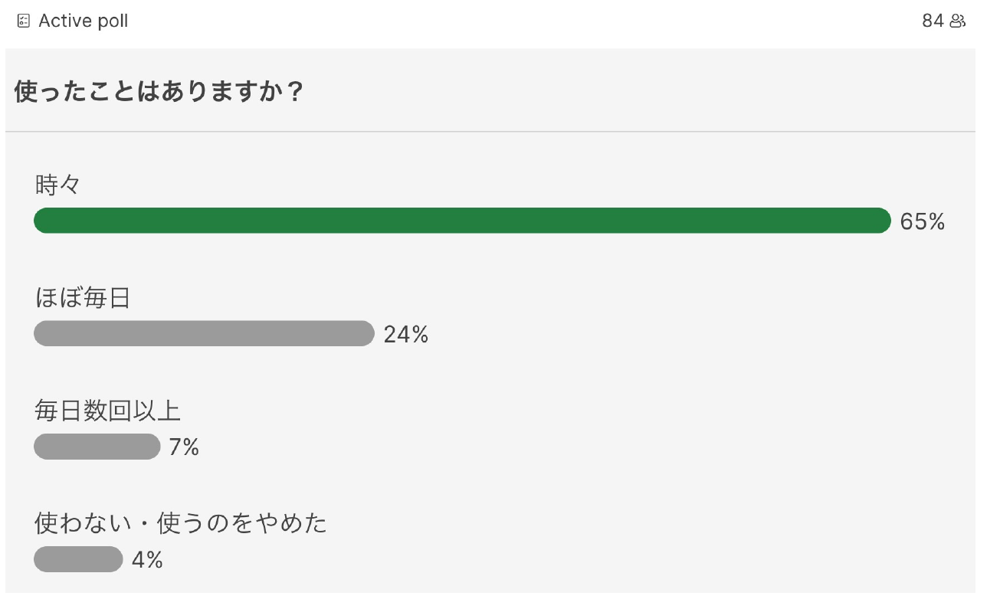

<!--
- まず、現状を知りましょう。生成AIを使ったことはありますか、という投票です。時々が65%、ほぼ毎日が24%でした。
-->

---

1　イントロ

# どんなことに使いますか？

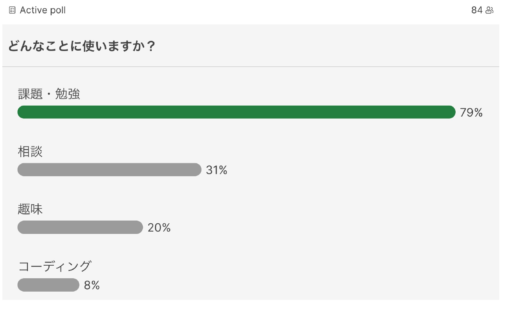

<!--
- 何に使いますか、という投票。課題・勉強が79%、相談が31%、趣味が20%でした。
-->

---

1　イントロ

# 使っているのは？

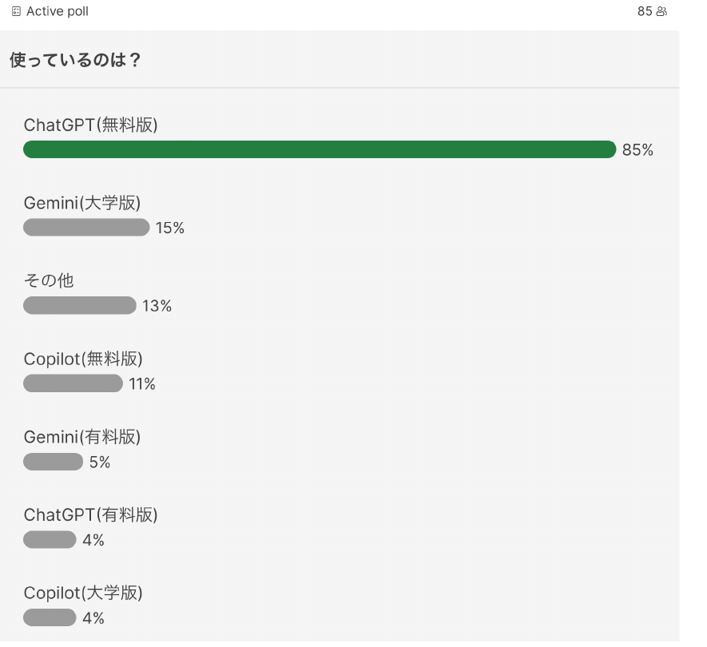

意外にも チャットGPT一強…

後で出ますが、<b>オプトアウト</b>に注意 
(自分のデータをAIの学習に使わせない設計)

<!--
- 使っている生成AIは何か。意外にもチャットGPT無料版が85%と一強でした。後で出ますが、オプトアウト(自分のデータをAIの学習に使わせない設計)に注意して下さい。
-->

---

1　イントロ

# コーディング・開発経験

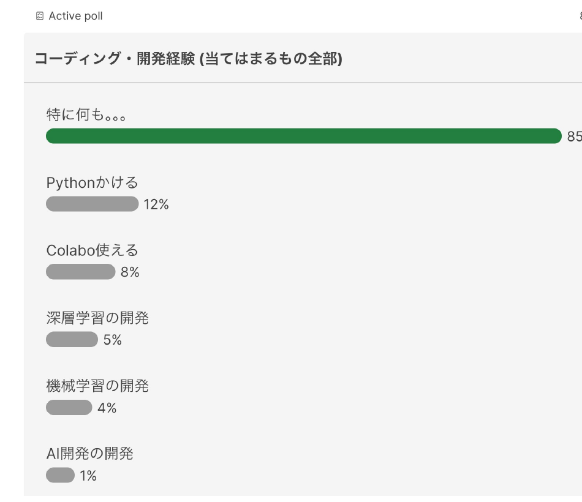

承知しました。 
<b>第二回の内容を</b>少し簡単に修正します。

それと、<b>開発経験のある皆様、ぜひ、他の学生の支援に回って下さい。</b>

<!--
- コーディング・開発経験について。特に何もない方が多いので、第二回の内容を少し簡単に修正します。開発経験のある皆様は、ぜひ他の学生の支援に回って下さい。
-->

---

1　イントロ

原則

- AIを試す/情報収集することは、<b>重要</b>

- AIは利活用が進んでいる

- 学生が直接使う場合や扱えるデータには、<b>制限がある</b>ので、「注意点」を理解

- 自分を支援する”助手”と考える

<!--
- 今日の結論、原則です。AIを試す・情報収集することは重要。AIは利活用が進んでいる。学生が直接使う場合や扱えるデータには制限があるので「注意点」を理解する。そして、自分を支援する“助手”と考える、ということです。
-->

---

2　使ってみる

AIの定義 (例)

人間の思考プロセスと同じような形で動作するプログラム 
人間が知的と感じる情報処理やそれを行う科学・技術

『R6 科学技術イノベーション白書 (第一章)』文部科学省 (2024)

AIはいろいろなところにすでにある

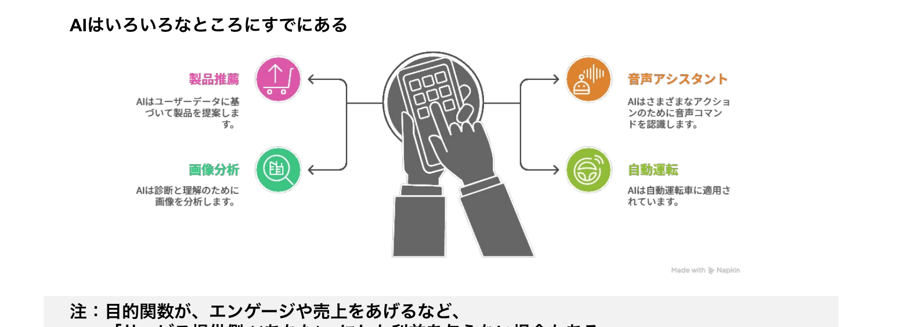

<b>注：</b>目的関数が、エンゲージや売上をあげるなど、「サービス提供側 (≠あなた)」にしか利益を与えない場合もある

cf. 『マインドハッキング: あなたの感情を支配し行動を操るソーシャルメディア』　ワイリー (2020)

<!--
- AIの種類の前に、AIの定義の例を確認します。人間の思考プロセスと同じような形で動作するプログラム、あるいは人間が知的と感じる情報処理やそれを行う科学・技術、とされています。
- AIは、製品推薦や画像分析、音声アシスタント、自動運転など、もういろいろなところにすでにあります。
- ただし注意点として、目的関数がエンゲージや売上をあげるなど、サービス提供側にしか利益を与えない場合もある、という点は覚えておいて下さい。
-->

---

2　使ってみる

大規模なデータから学習し、 新たなコンテンツやアイデアを生成するAIの一種

マルチモーダル

テキスト、画像、音声、動画など、異なるデータ形式（モーダル）を同時に扱い、統合するAIシステム

Chat GPT　　Gemini　　Claude

分野特化

特定の機能を持っているAI

DALL·E 2　Veo　Whisper

ツール

AIを組合せて、特定の問題解決に役立つAI

napkin ai　NotebookLM

<b>生成AIずかん</b>

近年、AIエージェント化

AIエージェントとは、ユーザーの目標達成のために最適な手段を、自律的に選択してタスクを遂行するAIの技術

<b>deep research</b>などが有名

<!--
- 生成AIとは、大規模なデータから学習し、新たなコンテンツやアイデアを生成するAIの一種です。
- 種類としては、テキスト・画像・音声・動画など異なるモーダルを同時に扱うマルチモーダル(ChatGPT, Gemini, Claude)、特定の機能を持つ分野特化(DALL·E 2, Veo, Whisper)、AIを組合せて問題解決に役立つツール(napkin ai, NotebookLM)があります。
- そして近年はAIエージェント化が進んでいます。AIエージェントとは、ユーザーの目標達成のために最適な手段を自律的に選択してタスクを遂行するAIの技術で、deep researchなどが有名です。
-->

---

2　使ってみる

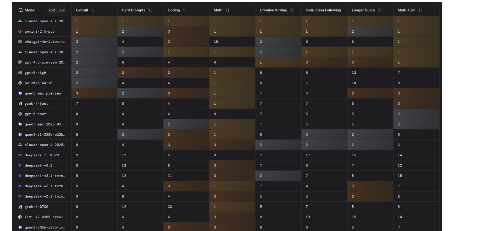

現時点では、Gemini がよい? (Claude opusは高い…)

<a href="https://lmarena.ai/leaderboard">https://lmarena.ai/leaderboard</a>

<!--
- 9月30日時点で最も性能がよいAIを、LMArena のリーダーボードで見てみます。現時点では Gemini がよさそうですね。Claude opus は高いですが…。
-->

---

2　使ってみる

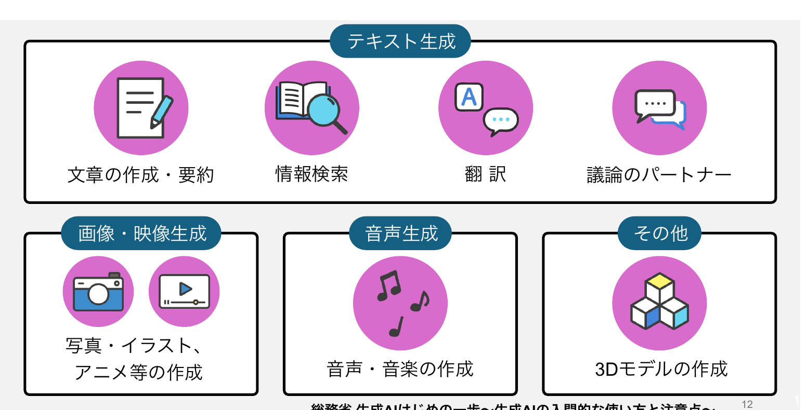

総務省 生成AIはじめの一歩～生成AIの入門的な使い方と注意点～

<!--
- 生成AIでできることを整理します。テキスト生成では文章の作成・要約、情報検索、翻訳、議論のパートナー。画像・映像生成では写真・イラスト、アニメ等の作成。音声生成では音声・音楽の作成。その他に3Dモデルの作成などがあります。出典は総務省の「生成AIはじめの一歩」です。
-->

---

2　使ってみる

# 生成AIの活用領域

Anthropic (2025 ArXiv) <a href="https://www.anthropic.com/research/anthropic-economic-index" style="color:var(--tag-blue); text-decoration:none;">リンク</a>

プライバシーの保護を保った状態で、 400万以上のClaude.aiの会話を分析

何をしたか

→どの経済的タスクにAIが利用されているか把握 米国労働省のO*NET実会話DBから類似性分類

全体として分かったこと

① Software 開発とWritingで半分

② 36%の職業にAIが利用されている

③ スキル増強：自動化 = 57 : 43

教育での利用

チュータリングタスクが多い

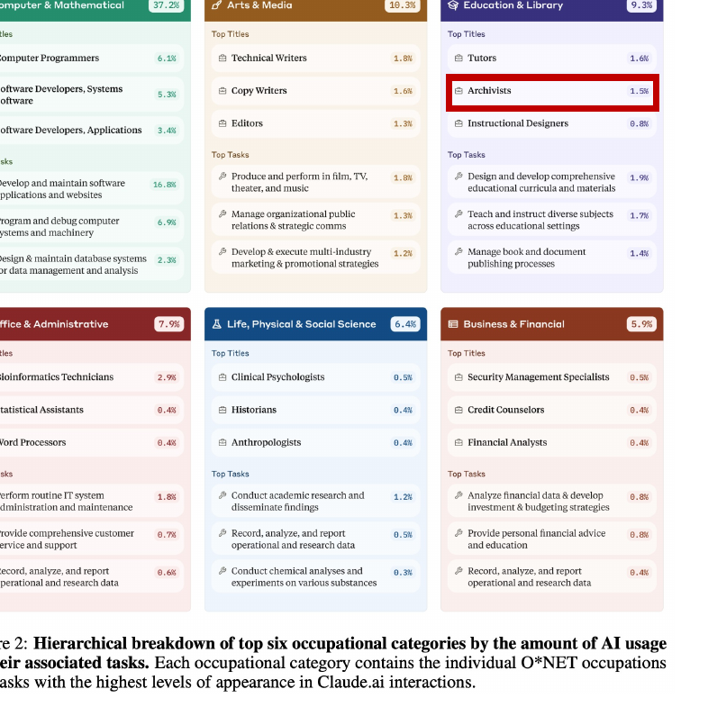

<!--
- AnthropicのEconomic Index。プライバシーを保ったまま400万以上のClaude会話を分析し、どの経済的タスクにAIが使われているかを把握した研究。SoftwareとWritingで半分、36%の職業で利用、スキル増強と自動化が57:43、教育ではチュータリングが多い。
-->

---

2　使ってみる

# 参考： 職業への影響

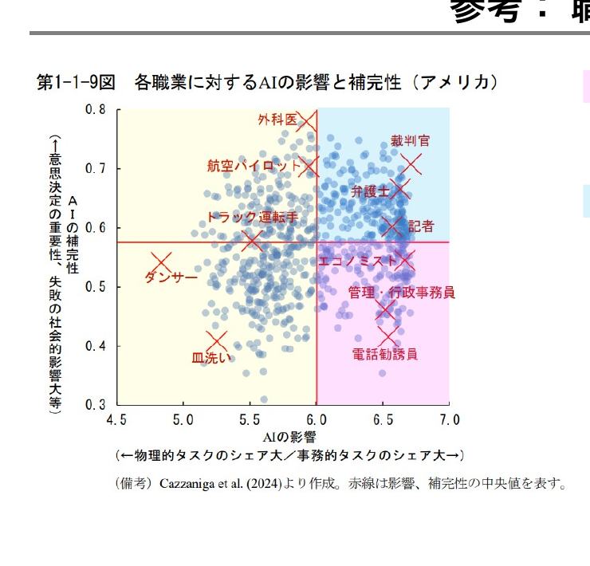

<b>AIの影響が大きく、代替性が高い職業：</b>事務的タスクのシェアが大きい職業。▶ つまり、AIがとって変わってしまう職業

<b>AIの影響が大きく、補完性が高い職業：</b>事務的タスクのシェアが大きいものの、意思決定の重要性が高く、AI任せとすることが社会的に望ましくない職業。▶ AIを使いこなす必要のある職業

<b>AIの影響の小さい職業：</b>物理的タスクのシェアが大きい職業。

※ 教員・研究者(自然科学系)は、青の領域

内閣府(2024) 世界経済の潮流＞第1章＞p.13

<!--
- 内閣府の世界経済の潮流より。職業をAIの影響(横)と補完性(縦)でプロット。事務系で代替性が高いとAIに置き換わり、補完性が高いとAIを使いこなす職業になる。物理タスク中心は影響が小さい。教員・研究者(自然科学系)は青の領域。
-->

---

3　グループ分け

# AIモデルだけでは、動けない

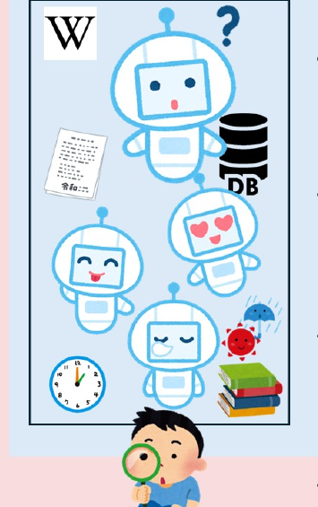

- <b>Model</b>だけでは、動くことが出来ません

入力、出力、他との接続（mcp、AI、ツール、参考書 etc…）

<!--
- まず大規模言語モデル(model)単体では動けない。入力・出力、そしてmcp・他のAI・ツール・参考書などとの接続が必要になる、という話の出発点。
-->

---

3　グループ分け

# AIモデルだけでは、動けない

- <b>Model</b>だけでは、動くことが出来ません

入力、出力、他との接続（mcp、AI、ツール、参考書 etc…）

- AIを組合せることで、様々な複雑な処理が可能になります

入力の分類、出力の分析、音声処理、画像処理…

<!--
- AIを組み合わせると、入力の分類・出力の分析・音声処理・画像処理など、複雑な処理ができるようになる。
-->

---

3　グループ分け

# AIモデルだけでは、動けない

- <b>Model</b>だけでは、動くことが出来ません

入力、出力、他との接続（mcp、AI、ツール、参考書 etc…）

- AIを組合せることで、様々な複雑な処理が可能になります

入力の分類、出力の分析、音声処理、画像処理…

- AIに道具をもたせて、現実的な処理ができるようになります

RAG、データベース、書籍、時計、天気予報…

<!--
- さらにAIに道具(RAG・データベース・書籍・時計・天気予報など)をもたせると、現実的な処理ができるようになる。
-->

---

3　グループ分け

# AIモデルだけでは、動けない

- <b>Model</b>だけでは、動くことが出来ません

入力、出力、他との接続（mcp、AI、ツール、参考書 etc…）

- AIを組合せることで、様々な複雑な処理が可能になります

入力の分類、出力の分析、音声処理、画像処理…

- AIに道具をもたせて、現実的な処理ができるようになります

RAG、データベース、書籍、時計、天気予報…

- 開発には、メタな視点が必要です

CI/CD、ログ管理、出力評価、MLOps、DB、セキュリティ…

<!--
- 実際に開発するとなると、CI/CD・ログ管理・出力評価・MLOps・DB・セキュリティといったメタな視点も必要になってくる。
-->

---

3　グループ分け

# AIモデルだけでは、動けない

- <b>Model</b>だけでは、動くことが出来ません

入力、出力、他との接続（mcp、AI、ツール、参考書 etc…）

- AIを組合せることで、様々な複雑な処理が可能になります

入力の分類、出力の分析、音声処理、画像処理…

- AIに道具をもたせて、現実的な処理ができるようになります

RAG、データベース、書籍、時計、天気予報…

- 開発には、メタな視点が必要です

CI/CD、ログ管理、出力評価、MLOps、DB、セキュリティ…

<b>Dify</b> Define &amp; Modify / Do It For You ── この全部がある程度（=モックアップ稼働まで）できるのが、<b>AIプラットフォーム"Dify"</b>

<!--
- これらを一通り面倒みてくれる、つまりモックアップ稼働まで持っていけるのがAIプラットフォーム"Dify"。Define & Modify / Do It For You の略。今回の演習でこれを使う。
-->

---

3　グループ分け

# Difyの3つの提供形態

<table style="width:100%; border-collapse:collapse; font-size:18px; margin-top:4px; line-height:1.3;">
<colgroup><col style="width:16%;"><col style="width:28%;"><col style="width:28%;"><col style="width:28%;"></colgroup>
<thead>
<tr>
<th style="border:1px solid #cdd5e0; padding:2px 9px; background:#f3f5f8;"></th>
<th style="border:1px solid #cdd5e0; padding:2px 9px; background:#DDEAF6; text-align:left;">Web SaaS 版 https://cloud.dify.ai/</th>
<th style="border:1px solid #cdd5e0; padding:2px 9px; background:#DCEFE0; text-align:left;">AWS (/GCP) 版 例：https://dify.alc-test.net/</th>
<th style="border:1px solid #cdd5e0; padding:2px 9px; background:#FBE7DA; text-align:left;">Local＋イントラ版 例：http://localhost/</th>
</tr>
</thead>
<tbody>
<tr>
<td style="border:1px solid #cdd5e0; padding:2px 9px; font-weight:700;">管理者</td>
<td style="border:1px solid #cdd5e0; padding:2px 9px; background:#EFF5FB;">Langgenius</td>
<td style="border:1px solid #cdd5e0; padding:2px 9px; background:#F0F8F2;">田川</td>
<td style="border:1px solid #cdd5e0; padding:2px 9px; background:#FDF2EB;">自分</td>
</tr>
<tr>
<td style="border:1px solid #cdd5e0; padding:2px 9px; font-weight:700;">LLM稼働箇所</td>
<td style="border:1px solid #cdd5e0; padding:2px 9px; background:#EFF5FB;">各社APIサーバー</td>
<td style="border:1px solid #cdd5e0; padding:2px 9px; background:#F0F8F2;">AWS（=各社APIサーバー）</td>
<td style="border:1px solid #cdd5e0; padding:2px 9px; background:#FDF2EB;">LCL（＋AWS＝各社APIサーバー）</td>
</tr>
<tr>
<td style="border:1px solid #cdd5e0; padding:2px 9px; font-weight:700;">使用目的</td>
<td style="border:1px solid #cdd5e0; padding:2px 9px; background:#EFF5FB;">個人的なPoC、企業業務</td>
<td style="border:1px solid #cdd5e0; padding:2px 9px; background:#F0F8F2;">大学業務</td>
<td style="border:1px solid #cdd5e0; padding:2px 9px; background:#FDF2EB;">（制限なさそう…）個人情報処理、採点 etc…</td>
</tr>
<tr>
<td style="border:1px solid #cdd5e0; padding:2px 9px; font-weight:700;">データの学習</td>
<td style="border:1px solid #cdd5e0; padding:2px 9px; background:#EFF5FB;">原則されない (API次第)</td>
<td style="border:1px solid #cdd5e0; padding:2px 9px; background:#F0F8F2;">されない</td>
<td style="border:1px solid #cdd5e0; padding:2px 9px; background:#FDF2EB;">されなさそう</td>
</tr>
<tr>
<td style="border:1px solid #cdd5e0; padding:2px 9px; font-weight:700;">費用</td>
<td style="border:1px solid #cdd5e0; padding:2px 9px; background:#EFF5FB;">安い（大学はAPI代実費のみ）</td>
<td style="border:1px solid #cdd5e0; padding:2px 9px; background:#F0F8F2;">中くらい（月2万円/10人）</td>
<td style="border:1px solid #cdd5e0; padding:2px 9px; background:#FDF2EB;">Mac mini(20,30)/studio(60)</td>
</tr>
<tr>
<td style="border:1px solid #cdd5e0; padding:2px 9px; font-weight:700;">機能</td>
<td style="border:1px solid #cdd5e0; padding:2px 9px; background:#EFF5FB;">最高（何でもできる）</td>
<td style="border:1px solid #cdd5e0; padding:2px 9px; background:#F0F8F2;">高い（結構できる）</td>
<td style="border:1px solid #cdd5e0; padding:2px 9px; background:#FDF2EB;">中くらい（テキスト処理？）</td>
</tr>
<tr>
<td style="border:1px solid #cdd5e0; padding:2px 9px; font-weight:700;">速さ</td>
<td style="border:1px solid #cdd5e0; padding:2px 9px; background:#EFF5FB;">最速（ChatGPTレベル）</td>
<td style="border:1px solid #cdd5e0; padding:2px 9px; background:#F0F8F2;">普通（我慢できるレベル）</td>
<td style="border:1px solid #cdd5e0; padding:2px 9px; background:#FDF2EB;">遅い（APIを使うと…）</td>
</tr>
<tr>
<td style="border:1px solid #cdd5e0; padding:2px 9px; font-weight:700;">セキュリティ</td>
<td style="border:1px solid #cdd5e0; padding:2px 9px; background:#EFF5FB;">普通（ChatGPTレベル）</td>
<td style="border:1px solid #cdd5e0; padding:2px 9px; background:#F0F8F2;">高い（企業向AWSレベル）</td>
<td style="border:1px solid #cdd5e0; padding:2px 9px; background:#FDF2EB;">最高（普通のPCと同じ）</td>
</tr>
</tbody>
</table>

AWS版/GCP版でクラウドチェックリストで、機密まで扱える要件を取りたい（但し、コミュニティ版は、複数WS／マルチアカウントが出来ない）

<!--
- Difyの提供形態は3つ。Web SaaS版(手軽・個人PoC向け)、AWS/GCP版(田川管理・大学業務向け)、Local+イントラ版(自分管理・最高セキュリティ)。用途とセキュリティ要件で選ぶ。
-->

---

3　グループ分け

# どちらがやりたいですか

▣ Active poll　　86人

自分の専門・研究に近いことを行いたい

30%

音声や画像などに興味がある

30%

面白い学び方を提案したい

28%

安全性・倫理

10%

千葉大の課題を解決したい

1%

<!--
- Slidoでクラスに「どちらがやりたいか」を聞いた結果。専門・研究と音声画像が各30%、面白い学び方28%、安全性倫理10%、千葉大の課題1%。この分布をもとにグループを分けていく。
-->

---

3　グループ分け

# テーマごとのグループで分かれて下さい

①<b>それぞれの島で5 - 6人集めて下さい。</b> グループの中に知り合いは3人まで (できるだけバラけて) →グループを何らかの方法で決めて下さい

②決まったら、<b>それぞれの班に分かれ、</b> <b>PCを立ち上げ、自分のグループを書いて下さい。</b> →クラスルーム内の以下のファイルです。

<b>グループ分け</b>　投稿日時 10:49

<!--
- グループ分けの指示。①各島で5〜6人、知り合いは3人まででバラけて決める。②決まったら班に分かれてPCを立ち上げ、クラスルーム内のファイルに自分のグループを記入する。
-->

---

3　グループ分け

# グループ分け結果

専門特化グループ

サーバー：gen_ai25_g1　専門1、2、3 (計17名) 
サーバー：gen_ai25_g2　専門4 (計6名) 
(合計23名)

倫理グループ

サーバー：gen_ai25_g2　倫理8 (計8名) 
(合計8名)

学び方グループ

サーバー：gen_ai25_g3　学び方1、2、3 (計18名) 
サーバー：gen_ai25_g4　学び方4、5 (計8名) 
(合計26名)

絵・音声グループ

サーバー：gen_ai25_g5　絵・音声1、2 (計14名) 
サーバー：gen_ai25_g6　絵・音声3、4 (計12名) 
(合計26名)

<!--
- グループ分け結果(2025/10/01時点)。専門特化23名(g1/g2)、倫理8名(g2)、学び方26名(g3/g4)、絵・音声26名(g5/g6)。各グループに割り当てたDifyサーバーを示す。順次更新。
-->

---

4　AI利活用

# 必ず知ってほしいこと

日常の活用において、知っていてほしいこと 
<b>① 大学の生成AI利用に関するポリシー</b> 
<b>② AI自体の学習・セキュリティに関する状況</b> 
<b>③ 大学で提供しているAI</b>

ChatGPT(特に無料版)の場合、<b>ユーザーの入力は原則、学習に使われる</b>(と思っておいた方が良い)。 <b>機微を含む場合、オプトアウト(自分のデータの使用停止)をしておく</b> → https://help.openai.com/en/articles/7730893-data-controls-faq

<!--
- 日常でAIを使う上で必ず知ってほしい3点：①大学のポリシー、②AIの学習・セキュリティの状況、③大学で提供しているAI。特にChatGPT無料版は入力が原則学習に使われると思った方がよく、機微情報を含む場合はオプトアウトしておく。
-->

---

4　AI利活用

# AIを教育で利活用する上で、必ず知ってほしいこと

千葉大学における生成AIの指針 (令和5年10月13日)

①「生成 AI についての学び」「生成 AI を用いた学び」「生成 AI によらない学び」を<b>それぞれ推進</b>

②授業での利用は、授業の目的に合致することが前提であり、合致するかは、各授業の担当教員が<b>判断</b>。<b>禁止の場合はシラバスなどに明記</b> (気になったら先生に聞きましょう！)

③<b>リスクや懸念に伴う禁止事項あり</b>

https://drive.google.com/file/d/1ZultuLWXNLJ53M43ExrYG8cIfwqcCnCO/view

特に、<b>機密情報や個人情報の入力禁止</b>、生成AIにより出力された情報の<b>著作権（表現への類似性・依拠性）</b>には留意が必要です。

---

4　AI利活用

# 学内で使えるツール

Gemini (とGem) https://gemini.google.com/gems/view

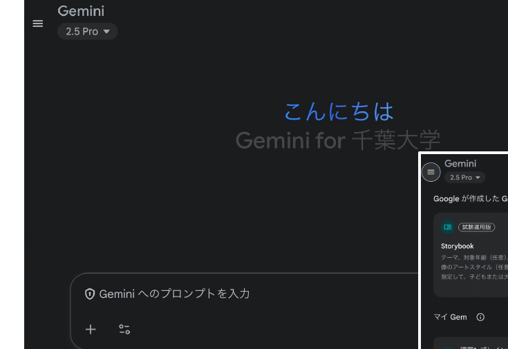

一般的なチャットボット <b>gemで用途に特化した道具</b>も作れて便利 ただ、現在、表現と思考がちょっと硬い

セキュリティの確認

<b>画面左下</b>

↓

⚙ 設定とヘルプ

↓

アクティビティ

<b>Gemini アプリ アクティビティの仕組み</b> 「Gemini では私のデータはどのように扱われますか？」 組織のデータが含まれているタスクに Gemini を使用する場合、お客様のデータが、トレーニングや改善に使用されることはありません。

---

4　AI利活用

# 学内で使えるツール

<b>Copilot</b> https://copilot.microsoft.com/

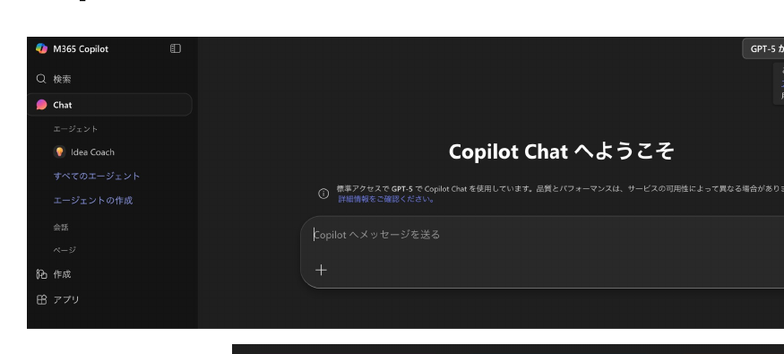

一般的なチャットボット Geminiと同じ事ができる。 (無料版は色々と出来るけど、大学版は機能少なめ)

セキュリティの確認

このチャットには <b>エンタープライズ データ保護</b> が適用されます。 と書いてあればOK

---

4　AI利活用

# 学内で使えるツール

NotebookLM

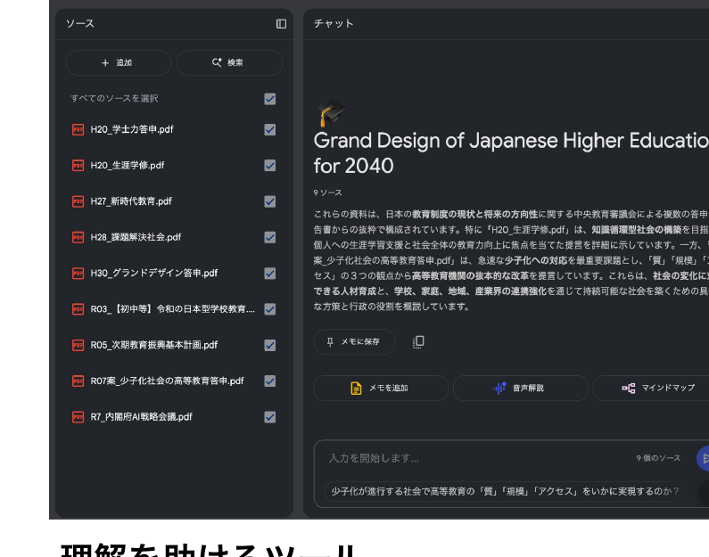

<b>理解を助けるツール</b> 大量の文章内を検索したり、音声・動画解説を使ったり、問題や暗記事項を書き出したりするのに便利

セキュリティの確認

<b>エンタープライズ級のセキュリティとプライバシー</b> アップロードされたファイル、チャット、モデル出力は、人間のレビューアーが確認することも、生成 AI モデルの改善に使用されることもありません。

---

4　AI利活用

# 安全性の配慮：大規模言語モデルを「生成AIサービス」にする

<table style="width:100%; border-collapse:collapse; margin-top:8px; font-size:23px;">
<tr>
<td style="background:var(--section-bg); border-radius:8px; padding:9px 22px; font-weight:800; width:34%;">チューニング ・RLHF</td>
<td style="padding:9px 22px;">人間にとって自然な回答をするよう、トレーニングする (good/bad)</td>
</tr>
<tr>
<td style="background:var(--section-bg); border-radius:8px; padding:9px 22px; font-weight:800;">ガードレールの作成</td>
<td style="padding:9px 22px;"><b style="color:var(--accent);">AIの安全性を向上させる</b> (AIに危険/不適切なことを言わせない)</td>
</tr>
<tr>
<td style="background:var(--section-bg); border-radius:8px; padding:9px 22px; font-weight:800;">倫理的課題の解決 バイアスの低減</td>
<td style="padding:9px 22px;">トレーニングデータ上のバイアスを減らす</td>
</tr>
<tr>
<td style="background:var(--section-bg); border-radius:8px; padding:9px 22px; font-weight:800;">ツールの接続</td>
<td style="padding:9px 22px;">計算やweb検索など、モジュールを接続する</td>
</tr>
</table>

市販のAIは、<b>人間中心の原則</b>に従い、かなりの注意して作成されている

<!-- 人間のニーズ、能力、制約を最優先に考慮する -->

---

5 学び方

# 生成AIの学び方 (資料のみ)

<table style="width:100%; border-collapse:collapse; margin-top:8px; font-size:20px; line-height:1.45;">
<tr style="color:#fff; background:var(--accent);">
<th style="padding:6px 12px; text-align:left; width:20%;">方法</th>
<th style="padding:6px 12px; text-align:left; width:48%;">特徴</th>
<th style="padding:6px 12px; text-align:left;">参考</th>
</tr>
<tr style="border-bottom:1px solid #e0e0e0;">
<td style="padding:8px 12px; font-weight:800;">本を読む</td>
<td style="padding:8px 12px;">◯ 自分の手で動かしてみるときに便利　◯ 情報が信頼できる　✕ １人だと難しいこともある</td>
<td style="padding:8px 12px;">(推薦はシラバスの参考書に)</td>
</tr>
<tr style="border-bottom:1px solid #e0e0e0; background:var(--section-bg);">
<td style="padding:8px 12px; font-weight:800;">YouTubeや記事を読む</td>
<td style="padding:8px 12px;">◯ 最新の情報の把握に便利　✕ 体系がない　✕ ガセがある　✕ 教育的効果がない…</td>
<td style="padding:8px 12px;">メカニズムから分かる映像　サービスが分かるAI図鑑</td>
</tr>
<tr style="border-bottom:1px solid #e0e0e0;">
<td style="padding:8px 12px; font-weight:800;">授業を受ける</td>
<td style="padding:8px 12px;">◯ 体系的な力が身につく　✕ しかし、大変</td>
<td style="padding:8px 12px;">東大松尾研究室講座/MOOC等 (現在募集中、学生無料) LLM基礎・データサイエンス</td>
</tr>
<tr style="border-bottom:1px solid #e0e0e0; background:var(--section-bg);">
<td style="padding:8px 12px; font-weight:800;">資格を取る・資格勉強する</td>
<td style="padding:8px 12px;">◯ 就活に有利　◯ 学習資料が充実しており、体系的　✕ １つあたり5000円くらいかかる</td>
<td style="padding:8px 12px;">JDLA G検定、 Google Generative AI Leader、 生成AIパスポートなど</td>
</tr>
<tr>
<td style="padding:8px 12px; font-weight:800;">上手い人の操作を見る</td>
<td style="padding:8px 12px;">◯ 自分でも使い方が分かる</td>
<td style="padding:8px 12px;">この授業の参考動画</td>
</tr>
</table>

自分は、<b>本、授業、資格</b>で学びました。特に<b>松尾研究室の授業</b>と<b>Google Skillup boost</b>はおすすめです。

---

6 まとめ

# 今日達成出来たこと

<b>授業の説明</b>　gammaを使ったスライドとシラバスをご参照下さい

<b>グループ分け・自己紹介</b>　無事、dify配布まで完了しました ありがとう!

<b>生成AIについての認識の確認</b>　Slidoでクラスの現状を把握しました

<b>DX事例の把握 /安全性など社会的な議論等の紹介</b>　宿題になっています (後者は別途説明します)

<b>千葉大で活用できる生成AI</b>　Gemini, Copilot, NotebookLMを紹介しました

<b>この授業の学び方の紹介</b>　スライド p.29をご参照下さい

